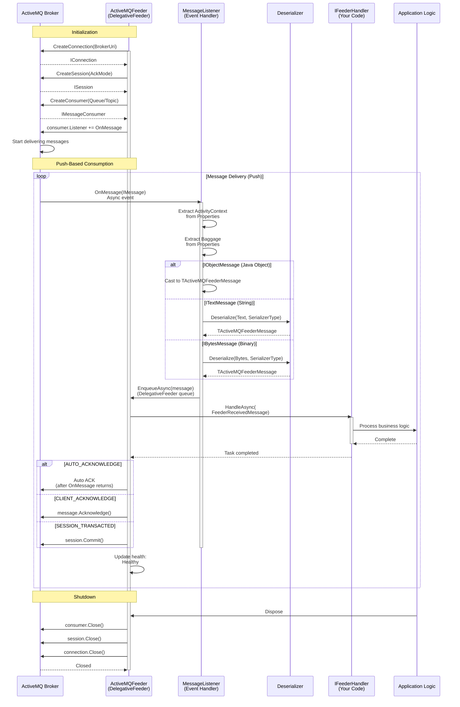
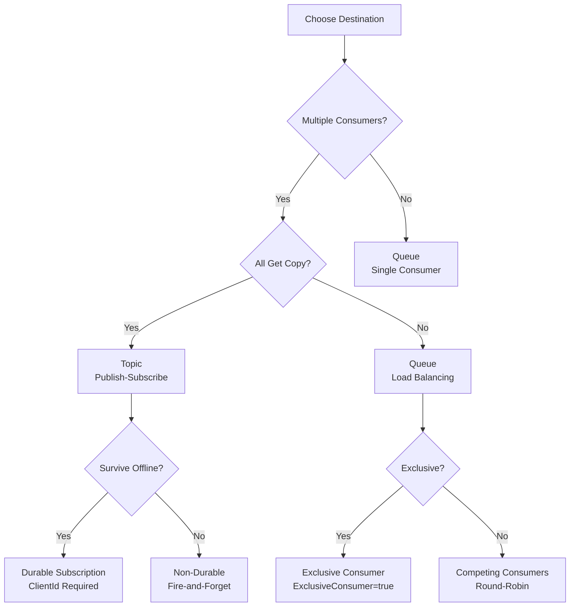

# ThunderPropagator.Feeders.ActiveMQ

> Apache ActiveMQ Message Consumer - Receives and processes inbound JMS messages from queues and topics

[◂ Back to ActiveMQ](../README.md) | [◂ Back to Documentation](../../README.md)

## Contents

- [Overview](#overview)
- [Architecture](#architecture)
- [Files](#files)
- [Configuration](#configuration)
- [Dependencies](#dependencies)
- [API Reference](#api-reference)
- [Examples](#examples)
- [Advanced Patterns](#advanced-patterns)
- [Best Practices](#best-practices)
- [Troubleshooting](#troubleshooting)
- [See Also](#see-also)

## Overview

**Type**: Message Consumer (Feeder)  
**Target Frameworks**: .NET 8, 9, 10  
**Package**: ThunderPropagator.Feeders.ActiveMQ

The ActiveMQ Feeder is a **DelegativeFeeder** implementation that provides JMS 1.1/2.0 compliant message consumption from Apache ActiveMQ Classic brokers. It uses a push-based consumption model with the Apache.NMS.ActiveMQ client library, supporting queues, topics, durable subscriptions, message selectors, transactions, and comprehensive error handling.

### Key Features

- ✅ **Push-Based Consumption**: MessageListener event-driven model for low-latency delivery
- ✅ **Dual Destination Types**: Queue (point-to-point) and Topic (publish-subscribe)
- ✅ **Durable Subscriptions**: Resume from last position after disconnect (topics)
- ✅ **Message Selectors**: SQL-92 based server-side filtering
- ✅ **Acknowledgment Modes**: AUTO, CLIENT, DUPS_OK, TRANSACTED
- ✅ **Transactional Consumption**: Atomic processing with commit/rollback
- ✅ **Message Groups**: Ordered processing for related messages (JMSXGroupID)
- ✅ **Request/Reply Pattern**: JMSReplyTo and JMSCorrelationID support
- ✅ **Multiple Serialization**: JSON, Newtonsoft.Json, NetJSON, or native JMS objects
- ✅ **OpenTelemetry Integration**: W3C Trace Context and Baggage propagation
- ✅ **Health Monitoring**: Real-time connection and consumption health reporting
- ✅ **Failover Transport**: Automatic reconnection to clustered brokers
- ✅ **Advisory Message Access**: Monitor broker events (consumer/producer lifecycle)

### When to Use This Feeder

| Use Case | Recommendation |
|----------|----------------|
| **Task Distribution** | ✅ Queue with multiple consumers (load balancing) |
| **Event Broadcasting** | ✅ Topic with multiple subscribers (pub/sub) |
| **Guaranteed Delivery** | ✅ Persistent messages + transactional consumption |
| **Offline Resilience** | ✅ Durable topic subscription (survive disconnects) |
| **Message Filtering** | ✅ Message selectors (SQL-based filters at broker) |
| **Ordered Processing** | ✅ Message groups (JMSXGroupID) or exclusive consumer |
| **Request/Reply** | ✅ TemporaryQueue + JMSCorrelationID |
| **Legacy Integration** | ✅ JMS 1.1/2.0 compliance (Java interop) |

## Architecture



### Push-Based Consumption Flow

Unlike pull-based feeders (Kafka, Pulsar), ActiveMQFeeder uses **push semantics**:

1. **MessageListener Registration**: Feeder registers event handler with `consumer.Listener += OnMessage`
2. **Broker Push**: ActiveMQ broker invokes `OnMessage(IMessage)` when messages arrive
3. **Async Enqueue**: Listener enqueues message into DelegativeFeeder's internal queue
4. **Handler Processing**: `IFeederHandler` processes message from queue
5. **Acknowledgment**: Automatic (AUTO_ACKNOWLEDGE) or manual (CLIENT_ACKNOWLEDGE, TRANSACTED)

**Advantages**:
- **Low Latency**: Immediate delivery (no polling overhead)
- **Backpressure**: Broker respects consumer prefetch limits
- **Event-Driven**: Natural fit for reactive applications

**Considerations**:
- **Prefetch Buffer**: Broker pre-fetches messages (configure `PrefetchSize`)
- **No Flow Control**: Consumer must process fast enough (or queue depth grows)

## Files

| File | Lines | Responsibility |
|------|-------|----------------|
| **ActiveMQFeeder.cs** | 115 | Core DelegativeFeeder implementation with MessageListener |
| **ActiveMQFeederConfiguration.cs** | 155 | Configuration class with 30+ JMS properties |
| **ActiveMQFeederExtensions.cs** | 52 | DI registration methods (AddActiveMQFeeder, resolver patterns) |
| **ActiveMQFeederMessage.cs** | 5 | Abstract message base class |
| **Total** | **327** | **Complete feeder implementation** |

### Key Classes

**ActiveMQFeeder**:
- Inherits `DelegativeFeeder<TChannel, TActiveMQFeederMessage, TActiveMQFeederConfiguration>`
- Creates `IConnection`, `ISession`, `IMessageConsumer` via Apache.NMS
- Registers `MessageListener` event handler for push delivery
- Deserializes `ITextMessage`, `IBytesMessage`, `IObjectMessage` to `TActiveMQFeederMessage`
- Extracts `ActivityContext` and `Baggage` from message properties (OpenTelemetry)
- Reports health status (`HealthName`, `HealthTags`)
- Disposes resources on shutdown (`StopAsync`, `DisposeManagedResources`)

## Dependencies

```xml
<!-- JMS Client Library -->
<PackageReference Include="Apache.NMS" Version="2.2.0" />
<PackageReference Include="Apache.NMS.ActiveMQ" Version="2.2.0" />

<!-- ThunderPropagator Framework -->
<PackageReference Include="ThunderPropagator" Version="1.0.1-beta.2" />
<PackageReference Include="ThunderPropagator.BuildingBlocks" Version="1.0.1-beta.2" />
<PackageReference Include="ThunderPropagator.Feeviders.ActiveMQ.SharedKernel" Version="1.0.1-beta.2" />

<!-- Infrastructure -->
<PackageReference Include="Microsoft.Extensions.DependencyInjection" Version="9.0.0" />
<PackageReference Include="Microsoft.Extensions.Diagnostics.HealthChecks" Version="9.0.0" />
<PackageReference Include="OpenTelemetry.Api" Version="1.10.0" />
```

## Configuration

### Core Properties

| Property | Type | Required | Default | Description |
|----------|------|----------|---------|-------------|
| **BrokerUri** | `Uri` | ✅ | — | Broker connection URI (tcp://host:61616, ssl://host:61617, failover:(...)) |
| **Queue** | `string` | ✅ | — | Destination name (queue or topic) |
| **SerializerType** | `SerializerType` | ✅ | — | Serialization format (Json, NJson, NetJson) |
| **UserName** | `string?` | ❌ | `null` | JAAS authentication username |
| **Password** | `string?` | ❌ | `null` | JAAS authentication password |
| **ClientId** | `string?` | ❌ | `null` | Unique client identifier (required for durable subscriptions) |
| **ClientIdPrefix** | `string?` | ❌ | `null` | Prefix for auto-generated ClientId |

### Consumer Properties

| Property | Type | Required | Default | Description |
|----------|------|----------|---------|-------------|
| **AcknowledgementMode** | `AcknowledgementMode?` | ❌ | `AutoAcknowledge` | AUTO_ACKNOWLEDGE, CLIENT_ACKNOWLEDGE, DUPS_OK_ACKNOWLEDGE, SESSION_TRANSACTED |
| **PrefetchSize** | `int?` | ❌ | 1000 | Number of messages to prefetch (consumer buffer size) |
| **ExclusiveConsumer** | `bool?` | ❌ | `false` | Only one consumer can connect to queue (mutual exclusion) |
| **UseRetroactiveConsumer** | `bool?` | ❌ | `false` | Receive messages sent before subscription created |
| **OptimizeAcknowledge** | `bool?` | ❌ | `false` | Batch acknowledgments for performance (CLIENT_ACKNOWLEDGE only) |
| **OptimizeAcknowledgeTimeOut** | `long?` | ❌ | 300 | Batch ack timeout (ms) |
| **OptimizedAckScheduledAckInterval** | `long?` | ❌ | 0 | Periodic ack interval (ms, 0 = disabled) |

### Redelivery & Durability

| Property | Type | Required | Default | Description |
|----------|------|----------|---------|-------------|
| **ConsumerFailoverRedeliveryWaitPeriod** | `long?` | ❌ | 0 | Delay before redelivery after failover (ms) |
| **CheckForDuplicates** | `bool?` | ❌ | `false` | Enable duplicate message detection (uses message audit) |
| **NonBlockingRedelivery** | `bool?` | ❌ | `false` | Redeliver messages asynchronously (non-blocking consumer) |
| **AuditDepth** | `int?` | ❌ | 2048 | Number of message IDs to track for duplicate detection |
| **AuditMaximumProducerNumber** | `int?` | ❌ | 64 | Max producers to track for duplicate detection |

### Connection & Performance

| Property | Type | Required | Default | Description |
|----------|------|----------|---------|-------------|
| **UseCompression** | `bool?` | ❌ | `false` | Enable message compression (GZip) |
| **AsyncSend** | `bool?` | ❌ | `false` | Send acknowledgments asynchronously (producer-side) |
| **AsyncClose** | `bool?` | ❌ | `true` | Close connections asynchronously |
| **DispatchAsync** | `bool?` | ❌ | `true` | Dispatch messages to listener asynchronously |
| **SendAcksAsync** | `bool?` | ❌ | `true` | Send consumer acknowledgments asynchronously |
| **AlwaysSyncSend** | `bool?` | ❌ | `false` | Always wait for broker confirmation (producer-side) |
| **CopyMessageOnSend** | `bool?` | ❌ | `true` | Copy message before sending (producer-side) |
| **RequestTimeout** | `int?` | ❌ | 30000 | Request timeout (ms) |
| **ProducerWindowSize** | `int?` | ❌ | 0 | Producer flow control window (bytes, 0 = disabled) |

### Advanced Properties

| Property | Type | Required | Default | Description |
|----------|------|----------|---------|-------------|
| **WatchTopicAdvisories** | `bool?` | ❌ | `true` | Subscribe to advisory topics (monitoring) |
| **MessagePrioritySupported** | `bool?` | ❌ | `true` | Enable message priority queuing |
| **TransactedIndividualAck** | `bool?` | ❌ | `false` | Allow individual acks in transacted sessions |

### Configuration Example

```json
{
  "Messaging": {
    "ActiveMQ": {
      "Consumer": {
        "BrokerUri": "tcp://localhost:61616",
        "Queue": "orders",
        "UserName": "admin",
        "Password": "admin",
        "ClientId": "order-consumer-1",
        "SerializerType": "Json",
        "AcknowledgementMode": "AutoAcknowledge",
        "PrefetchSize": 100,
        "UseCompression": true,
        "DispatchAsync": true,
        "CheckForDuplicates": true,
        "AuditDepth": 2048
      }
    }
  }
}
```

## API Reference

### ActiveMQFeeder Class

```csharp
internal class ActiveMQFeeder<TChannel, TActiveMQFeederMessage, TActiveMQFeederConfiguration> 
    : DelegativeFeeder<TChannel, TActiveMQFeederMessage, TActiveMQFeederConfiguration>, 
      IFeature
    where TChannel : class, IChannel
    where TActiveMQFeederMessage : ActiveMQFeederMessage
    where TActiveMQFeederConfiguration : ActiveMQFeederConfiguration
{
    // Constructor: Initializes connection, session, consumer, and MessageListener
    public ActiveMQFeeder(
        TChannel channel,
        TActiveMQFeederConfiguration activeMQFeederConfiguration,
        IFeederHandler<TChannel, TActiveMQFeederMessage> feederHandler,
        IServiceProvider serviceProvider);
    
    // Health monitoring
    public string HealthName { get; } // feeder_ActiveMQ_{Queue}
    public string[] HealthTags { get; } // ["ActiveMQ", "{Queue}"]
    
    // Lifecycle methods
    protected override Task StopAsync(CancellationToken cancellationToken = default);
    protected override void DisposeManagedResources();
}
```

### ActiveMQFeederMessage Class

```csharp
public abstract class ActiveMQFeederMessage : FeederMessage
{
    // Inherits from FeederMessage (ThunderPropagator base class)
    // Define custom properties in derived classes
}

// Example implementation
public class OrderMessage : ActiveMQFeederMessage
{
    public string OrderId { get; set; } = default!;
    public decimal Amount { get; set; }
    public string Status { get; set; } = default!;
}
```

### ActiveMQFeederConfiguration Class

```csharp
public abstract class ActiveMQFeederConfiguration 
    : AbstractFeederConfiguration, 
      IActiveMQFeeviderConfiguration
{
    // Core properties
    public Uri BrokerUri { get; set; }
    public string Queue { get; set; }
    public string? UserName { get; set; }
    public string? Password { get; set; }
    public string? ClientId { get; set; }
    
    // Consumer properties
    public AcknowledgementMode? AcknowledgementMode { get; set; }
    public int? PrefetchSize { get; set; }
    public bool? ExclusiveConsumer { get; set; }
    
    // Performance properties
    public bool? UseCompression { get; set; }
    public bool? DispatchAsync { get; set; }
    public bool? SendAcksAsync { get; set; }
    
    // See Configuration section for complete property list
}
```

### Extension Methods

```csharp
public static class ActiveMQFeederExtensions
{
    // Register feeder with DI container (static configuration)
    public static IServiceCollection AddActiveMQFeeder<TChannel, TActiveMQFeederMessage, TActiveMQFeederConfiguration>(
        this IServiceCollection services, 
        IConfigurationRoot configuration, 
        string sectionName)
        where TChannel : class, IChannel
        where TActiveMQFeederMessage : ActiveMQFeederMessage
        where TActiveMQFeederConfiguration : ActiveMQFeederConfiguration, new();
    
    // Register feeder resolver (dynamic configuration)
    public static IServiceCollection AddActiveMQFeederResolver<TChannel, TActiveMQFeederMessage, TActiveMQFeederConfiguration>(
        this IServiceCollection services)
        where TChannel : class, IChannel
        where TActiveMQFeederMessage : ActiveMQFeederMessage
        where TActiveMQFeederConfiguration : ActiveMQFeederConfiguration, new();
    
    // Use feeder resolver (activate with runtime configuration)
    public static IApplicationBuilder UseActiveMQFeederResolver<TChannel, TActiveMQFeederMessage, TActiveMQFeederConfiguration>(
        this IApplicationBuilder app, 
        Guid channelKey, 
        TActiveMQFeederConfiguration activeMQFeederConfiguration)
        where TChannel : class, IChannel
        where TActiveMQFeederMessage : ActiveMQFeederMessage
        where TActiveMQFeederConfiguration : ActiveMQFeederConfiguration;
}
```

## Examples

### 1. Basic Queue Consumption (Point-to-Point)

**Scenario**: Distribute order processing tasks across multiple consumers

**Configuration** (`appsettings.json`):
```json
{
  "Messaging": {
    "ActiveMQ": {
      "OrderQueue": {
        "BrokerUri": "tcp://localhost:61616",
        "Queue": "orders",
        "UserName": "admin",
        "Password": "admin",
        "SerializerType": "Json",
        "AcknowledgementMode": "AutoAcknowledge"
      }
    }
  }
}
```

**Message Definition**:
```csharp
public class OrderMessage : ActiveMQFeederMessage
{
    public string OrderId { get; set; } = default!;
    public string CustomerId { get; set; } = default!;
    public decimal TotalAmount { get; set; }
    public DateTime OrderDate { get; set; }
    public string Status { get; set; } = "Pending";
}

public class OrderQueueConfiguration : ActiveMQFeederConfiguration { }
```

**Channel & Handler**:
```csharp
public class OrderChannel : IChannel
{
    public ChannelMetadata Metadata { get; } = new("orders", "Order processing channel");
}

public class OrderFeederHandler : IFeederHandler<OrderChannel, OrderMessage>
{
    private readonly IOrderService _orderService;
    private readonly ILogger<OrderFeederHandler> _logger;
    
    public OrderFeederHandler(IOrderService orderService, ILogger<OrderFeederHandler> logger)
    {
        _orderService = orderService;
        _logger = logger;
    }
    
    public async Task HandleAsync(
        FeederReceivedMessage<OrderMessage> feederReceivedMessage, 
        CancellationToken cancellationToken = default)
    {
        var order = feederReceivedMessage.Message;
        _logger.LogInformation("Processing order {OrderId} for customer {CustomerId}", 
            order.OrderId, order.CustomerId);
        
        try
        {
            await _orderService.ProcessOrderAsync(order, cancellationToken);
            _logger.LogInformation("Order {OrderId} processed successfully", order.OrderId);
        }
        catch (Exception ex)
        {
            _logger.LogError(ex, "Failed to process order {OrderId}", order.OrderId);
            throw; // Message will redeliver (if configured)
        }
    }
}
```

**Registration** (`Program.cs`):
```csharp
var builder = WebApplication.CreateBuilder(args);
var configuration = builder.Configuration;

// Register channel
builder.Services.AddChannel<OrderChannel>();

// Register feeder handler
builder.Services.AddScoped<IFeederHandler<OrderChannel, OrderMessage>, OrderFeederHandler>();

// Register ActiveMQ feeder
builder.Services.AddActiveMQFeeder<OrderChannel, OrderMessage, OrderQueueConfiguration>(
    configuration, "Messaging:ActiveMQ:OrderQueue");

var app = builder.Build();
app.Run();
```

**Behavior**:
- **Load Balancing**: Multiple instances consume from same queue (round-robin)
- **Guaranteed Delivery**: Each message consumed by exactly one consumer
- **Acknowledgment**: Automatic after `HandleAsync` completes successfully
- **Redelivery**: Exception in handler → message redelivers

### 2. Topic Subscription (Publish-Subscribe)

**Scenario**: Broadcast audit events to multiple subscribers (audit logger, analytics, compliance)

**Configuration**:
```json
{
  "Messaging": {
    "ActiveMQ": {
      "AuditTopic": {
        "BrokerUri": "tcp://localhost:61616",
        "Queue": "topic://audit.events",
        "SerializerType": "Json",
        "AcknowledgementMode": "AutoAcknowledge"
      }
    }
  }
}
```

**Message Definition**:
```csharp
public class AuditEventMessage : ActiveMQFeederMessage
{
    public string EventId { get; set; } = default!;
    public string EventType { get; set; } = default!;
    public string UserId { get; set; } = default!;
    public string Action { get; set; } = default!;
    public DateTime Timestamp { get; set; }
    public Dictionary<string, object> Metadata { get; set; } = new();
}

public class AuditTopicConfiguration : ActiveMQFeederConfiguration { }
```

**Handler** (Audit Logger):
```csharp
public class AuditLoggerHandler : IFeederHandler<AuditChannel, AuditEventMessage>
{
    private readonly IAuditRepository _repository;
    private readonly ILogger<AuditLoggerHandler> _logger;
    
    public async Task HandleAsync(
        FeederReceivedMessage<AuditEventMessage> feederReceivedMessage, 
        CancellationToken cancellationToken = default)
    {
        var auditEvent = feederReceivedMessage.Message;
        _logger.LogInformation("Logging audit event: {EventType} by user {UserId}", 
            auditEvent.EventType, auditEvent.UserId);
        
        await _repository.SaveAuditEventAsync(auditEvent, cancellationToken);
    }
}
```

**Registration** (Multiple Subscribers):
```csharp
// Subscriber 1: Audit Logger
builder.Services.AddChannel<AuditChannel>();
builder.Services.AddScoped<IFeederHandler<AuditChannel, AuditEventMessage>, AuditLoggerHandler>();
builder.Services.AddActiveMQFeeder<AuditChannel, AuditEventMessage, AuditTopicConfiguration>(
    configuration, "Messaging:ActiveMQ:AuditTopic");

// Subscriber 2: Analytics (separate instance/process)
builder.Services.AddChannel<AnalyticsChannel>();
builder.Services.AddScoped<IFeederHandler<AnalyticsChannel, AuditEventMessage>, AnalyticsHandler>();
builder.Services.AddActiveMQFeeder<AnalyticsChannel, AuditEventMessage, AuditTopicConfiguration>(
    configuration, "Messaging:ActiveMQ:AuditTopic");
```

**Behavior**:
- **Broadcast**: All subscribers receive copy of each message
- **Non-Durable**: Messages lost if subscriber offline (see Example 3 for durable)
- **Independent Processing**: Each subscriber processes independently (no coordination)

### 3. Durable Topic Subscription (Guaranteed Delivery)

**Scenario**: Critical system events must be delivered even if subscriber temporarily offline

**Configuration**:
```json
{
  "Messaging": {
    "ActiveMQ": {
      "SystemEventsTopic": {
        "BrokerUri": "tcp://localhost:61616",
        "Queue": "topic://system.events",
        "ClientId": "notification-service-1",
        "DurableSubscriberName": "notification-durable-sub",
        "SerializerType": "Json",
        "AcknowledgementMode": "ClientAcknowledge"
      }
    }
  }
}
```

**Message Definition**:
```csharp
public class SystemEventMessage : ActiveMQFeederMessage
{
    public string EventId { get; set; } = default!;
    public string EventType { get; set; } = default!;
    public string Severity { get; set; } = default!; // Info, Warning, Critical
    public string Message { get; set; } = default!;
    public DateTime Timestamp { get; set; }
}

public class SystemEventsConfiguration : ActiveMQFeederConfiguration { }
```

**Custom Feeder with Durable Subscription**:
```csharp
// Note: Extend ActiveMQFeeder or configure via NMS APIs
// This example shows conceptual implementation

public class DurableTopicFeeder<TChannel, TMessage, TConfig> : ActiveMQFeeder<TChannel, TMessage, TConfig>
    where TChannel : class, IChannel
    where TMessage : ActiveMQFeederMessage
    where TConfig : ActiveMQFeederConfiguration
{
    public DurableTopicFeeder(/* ... */) : base(/* ... */)
    {
        // ActiveMQ automatically handles durable subscriptions when ClientId is set
        // Broker queues messages for durable subscribers when offline
    }
}
```

**Handler with Manual Acknowledgment**:
```csharp
public class NotificationHandler : IFeederHandler<NotificationChannel, SystemEventMessage>
{
    private readonly INotificationService _notificationService;
    private readonly ILogger<NotificationHandler> _logger;
    
    public async Task HandleAsync(
        FeederReceivedMessage<SystemEventMessage> feederReceivedMessage, 
        CancellationToken cancellationToken = default)
    {
        var systemEvent = feederReceivedMessage.Message;
        _logger.LogInformation("Received system event: {EventType} ({Severity})", 
            systemEvent.EventType, systemEvent.Severity);
        
        try
        {
            // Send notification (email, SMS, push)
            await _notificationService.SendNotificationAsync(systemEvent, cancellationToken);
            
            // Explicit acknowledgment (CLIENT_ACKNOWLEDGE mode)
            // Note: In DelegativeFeeder, acknowledgment handled by framework
            // This is conceptual - actual implementation may vary
            _logger.LogInformation("Acknowledged system event {EventId}", systemEvent.EventId);
        }
        catch (Exception ex)
        {
            _logger.LogError(ex, "Failed to process system event {EventId}", systemEvent.EventId);
            throw; // Message will redeliver after timeout
        }
    }
}
```

**Durable Subscription Behavior**:
- **ClientId Required**: Unique identifier for connection
- **Durable Name**: Identifies subscription (persisted by broker)
- **Offline Queuing**: Broker queues messages when subscriber disconnected
- **Reconnection**: Subscriber receives queued messages on reconnect
- **Unsubscribe**: Must explicitly unsubscribe to delete subscription

### 4. Message Selectors for Filtering

**Scenario**: High-priority orders routed to dedicated processor, low-priority to batch processor

**Configuration** (High Priority):
```json
{
  "Messaging": {
    "ActiveMQ": {
      "HighPriorityOrders": {
        "BrokerUri": "tcp://localhost:61616",
        "Queue": "orders",
        "MessageSelector": "Priority >= 7 AND OrderType = 'Express'",
        "SerializerType": "Json",
        "AcknowledgementMode": "AutoAcknowledge"
      }
    }
  }
}
```

**Configuration** (Low Priority):
```json
{
  "Messaging": {
    "ActiveMQ": {
      "LowPriorityOrders": {
        "BrokerUri": "tcp://localhost:61616",
        "Queue": "orders",
        "MessageSelector": "Priority < 7 OR OrderType <> 'Express'",
        "SerializerType": "Json",
        "AcknowledgementMode": "DupsOkAcknowledge"
      }
    }
  }
}
```

**Custom Configuration with Selector**:
```csharp
public class HighPriorityOrderConfiguration : ActiveMQFeederConfiguration
{
    // Note: MessageSelector not directly exposed in current implementation
    // Configure via NMS Consumer creation or extend configuration
}
```

**Selector Syntax Examples**:
```sql
-- Priority filtering
JMSPriority > 5

-- Custom property filtering
OrderType = 'Premium' AND Amount > 1000

-- Logical operators
(Status = 'Pending' OR Status = 'Processing') AND Priority >= 7

-- BETWEEN operator
Amount BETWEEN 100 AND 500

-- IN operator
Region IN ('US', 'EU', 'APAC')

-- LIKE operator (wildcard matching)
OrderId LIKE 'ORD-%'

-- NULL checks
CouponCode IS NOT NULL
```

**Handler (High Priority)**:
```csharp
public class HighPriorityOrderHandler : IFeederHandler<OrderChannel, OrderMessage>
{
    private readonly IExpressOrderService _expressOrderService;
    
    public async Task HandleAsync(
        FeederReceivedMessage<OrderMessage> feederReceivedMessage, 
        CancellationToken cancellationToken = default)
    {
        var order = feederReceivedMessage.Message;
        // Fast-track processing
        await _expressOrderService.ProcessExpressOrderAsync(order, cancellationToken);
    }
}
```

**Benefits**:
- **Broker-Side Filtering**: Reduces network traffic
- **Targeted Consumption**: Consumers only receive relevant messages
- **No Code Changes**: Modify selectors via configuration

### 5. Transactional Consumption (Atomic Processing)

**Scenario**: Consume order, update inventory, send confirmation - all or nothing

**Configuration**:
```json
{
  "Messaging": {
    "ActiveMQ": {
      "TransactionalOrders": {
        "BrokerUri": "tcp://localhost:61616",
        "Queue": "orders.transactional",
        "SerializerType": "Json",
        "AcknowledgementMode": "SessionTransacted"
      }
    }
  }
}
```

**Message Definition**:
```csharp
public class TransactionalOrderMessage : ActiveMQFeederMessage
{
    public string OrderId { get; set; } = default!;
    public string ProductId { get; set; } = default!;
    public int Quantity { get; set; }
}

public class TransactionalOrderConfiguration : ActiveMQFeederConfiguration { }
```

**Handler with Transaction Scope**:
```csharp
public class TransactionalOrderHandler : IFeederHandler<OrderChannel, TransactionalOrderMessage>
{
    private readonly IInventoryService _inventoryService;
    private readonly IOrderRepository _orderRepository;
    private readonly INotificationService _notificationService;
    private readonly IDbContextTransaction _dbTransaction;
    private readonly ILogger<TransactionalOrderHandler> _logger;
    
    public async Task HandleAsync(
        FeederReceivedMessage<TransactionalOrderMessage> feederReceivedMessage, 
        CancellationToken cancellationToken = default)
    {
        var order = feederReceivedMessage.Message;
        
        using var transaction = await _dbTransaction.BeginTransactionAsync(cancellationToken);
        
        try
        {
            // Step 1: Reserve inventory
            await _inventoryService.ReserveStockAsync(order.ProductId, order.Quantity, cancellationToken);
            
            // Step 2: Save order to database
            await _orderRepository.CreateOrderAsync(order, cancellationToken);
            
            // Step 3: Send confirmation
            await _notificationService.SendOrderConfirmationAsync(order.OrderId, cancellationToken);
            
            // Commit database transaction
            await transaction.CommitAsync(cancellationToken);
            
            // JMS session auto-commits (SESSION_TRANSACTED mode)
            _logger.LogInformation("Order {OrderId} processed successfully (transactional)", order.OrderId);
        }
        catch (Exception ex)
        {
            // Rollback database transaction
            await transaction.RollbackAsync(cancellationToken);
            
            // JMS session auto-rollbacks (message redelivers)
            _logger.LogError(ex, "Order {OrderId} processing failed, transaction rolled back", order.OrderId);
            throw;
        }
    }
}
```

**Transactional Behavior**:
- **Acknowledgment**: Via `session.Commit()` (all messages acked atomically)
- **Rollback**: Via `session.Rollback()` (all messages redeliver)
- **Redelivery**: Failed messages redeliver from beginning of transaction
- **Atomicity**: All operations succeed or all fail (no partial updates)

**Considerations**:
- **Performance**: ~50% slower than AUTO_ACKNOWLEDGE
- **Batch Size**: Configure transaction batch size via `TransactionBatchSize`
- **Distributed Transactions**: Use XA transactions for multi-resource coordination

### 6. Request/Reply Pattern

**Scenario**: Synchronous order validation (send validation request, wait for response)

**Request Configuration**:
```json
{
  "Messaging": {
    "ActiveMQ": {
      "ValidationRequests": {
        "BrokerUri": "tcp://localhost:61616",
        "Queue": "validation.requests",
        "SerializerType": "Json"
      }
    }
  }
}
```

**Request Message**:
```csharp
public class ValidationRequestMessage : ActiveMQFeederMessage
{
    public string RequestId { get; set; } = default!;
    public string OrderId { get; set; } = default!;
    public string ReplyToQueue { get; set; } = default!; // Temporary queue name
    public string CorrelationId { get; set; } = default!;
}
```

**Validation Service (Responder)**:
```csharp
public class ValidationHandler : IFeederHandler<ValidationChannel, ValidationRequestMessage>
{
    private readonly IValidationService _validationService;
    private readonly IServiceProvider _serviceProvider;
    
    public async Task HandleAsync(
        FeederReceivedMessage<ValidationRequestMessage> feederReceivedMessage, 
        CancellationToken cancellationToken = default)
    {
        var request = feederReceivedMessage.Message;
        
        // Perform validation
        var validationResult = await _validationService.ValidateOrderAsync(request.OrderId, cancellationToken);
        
        // Send response to ReplyTo destination
        var provider = _serviceProvider.GetRequiredService<ActiveMQProvider<ValidationResponseMessage, ValidationResponseConfiguration>>();
        
        var response = new ValidationResponseMessage
        {
            RequestId = request.RequestId,
            CorrelationId = request.CorrelationId,
            IsValid = validationResult.IsValid,
            Errors = validationResult.Errors
        };
        
        // Configure provider with ReplyTo queue
        var replyConfig = new ValidationResponseConfiguration
        {
            BrokerUri = new Uri("tcp://localhost:61616"),
            Queue = request.ReplyToQueue
        };
        
        await provider.ExecuteAsync(response);
    }
}
```

**Requestor (Client)**:
```csharp
public class OrderService
{
    private readonly ActiveMQProvider<ValidationRequestMessage, ValidationRequestConfiguration> _requestProvider;
    private readonly IConnection _connection;
    
    public async Task<ValidationResult> ValidateOrderAsync(string orderId)
    {
        // Create temporary queue for replies
        var session = _connection.CreateSession();
        var tempQueue = session.CreateTemporaryQueue();
        var consumer = session.CreateConsumer(tempQueue);
        
        var correlationId = Guid.NewGuid().ToString();
        
        // Send request
        await _requestProvider.ExecuteAsync(new ValidationRequestMessage
        {
            RequestId = Guid.NewGuid().ToString(),
            OrderId = orderId,
            ReplyToQueue = tempQueue.QueueName,
            CorrelationId = correlationId
        });
        
        // Wait for response (with timeout)
        using var cts = new CancellationTokenSource(TimeSpan.FromSeconds(30));
        var responseMessage = await AwaitResponseAsync(consumer, correlationId, cts.Token);
        
        // Cleanup
        await consumer.CloseAsync();
        await tempQueue.DeleteAsync();
        
        return responseMessage;
    }
    
    private async Task<ValidationResult> AwaitResponseAsync(
        IMessageConsumer consumer, 
        string correlationId, 
        CancellationToken cancellationToken)
    {
        var tcs = new TaskCompletionSource<ValidationResult>();
        
        consumer.Listener += message =>
        {
            if (message.Properties.GetString("JMSCorrelationID") == correlationId)
            {
                var response = DeserializeResponse(message);
                tcs.SetResult(response);
            }
        };
        
        return await tcs.Task.WaitAsync(cancellationToken);
    }
}
```

**Request/Reply Components**:
- **JMSReplyTo**: Temporary queue for responses
- **JMSCorrelationID**: Link request to response
- **Temporary Queue**: Auto-deleted when connection closes
- **Timeout**: Client waits with timeout (avoid blocking indefinitely)

## Advanced Patterns

### 1. Queue vs Topic Selection Guide

| Requirement | Destination Type | Configuration |
|-------------|------------------|---------------|
| **One Consumer** | Queue | `Queue = "orders"` |
| **Load Balancing** | Queue (multiple consumers) | Same queue, multiple instances |
| **All Consumers Get Copy** | Topic | `Queue = "topic://events"` |
| **Guaranteed Delivery (Offline)** | Topic (durable) | `ClientId + DurableSubscriberName` |
| **No Guarantee (Fire-and-Forget)** | Topic (non-durable) | No ClientId required |
| **Request/Reply** | TemporaryQueue | `session.CreateTemporaryQueue()` |

**Decision Matrix**:


### 2. Acknowledgment Strategies

| Mode | Acknowledgment | Redelivery | Performance | Use Case |
|------|----------------|------------|-------------|----------|
| **AUTO_ACKNOWLEDGE** | After `OnMessage` returns | On exception | High | Default, simple processing |
| **CLIENT_ACKNOWLEDGE** | Explicit `message.Acknowledge()` | Manual control | Medium | Batch processing, manual retry |
| **DUPS_OK_ACKNOWLEDGE** | Lazy (broker decides) | Possible duplicates | Highest | Idempotent consumers, high throughput |
| **SESSION_TRANSACTED** | Via `session.Commit()` | Via `session.Rollback()` | Low | Atomic processing, all-or-nothing |

**AUTO_ACKNOWLEDGE Example**:
```csharp
// Default behavior
public async Task HandleAsync(FeederReceivedMessage<OrderMessage> msg, CancellationToken ct)
{
    await ProcessOrderAsync(msg.Message);
    // Auto-ack on successful return
}
```

**CLIENT_ACKNOWLEDGE Example** (Conceptual):
```csharp
// Manual acknowledgment
consumer.Listener += async message =>
{
    try
    {
        await ProcessMessageAsync(message);
        await message.AcknowledgeAsync(); // Explicit ack
    }
    catch (TransientException ex)
    {
        // Don't ack, message redelivers
        Logger.LogWarning("Transient error, message will redeliver");
    }
    catch (PermanentException ex)
    {
        await message.AcknowledgeAsync(); // Ack to prevent infinite loop
        await SendToDLQAsync(message); // Manual dead letter handling
    }
};
```

**SESSION_TRANSACTED Example**:
```csharp
session.AcknowledgementMode = AcknowledgementMode.Transacted;

try
{
    var msg1 = await consumer.ReceiveAsync();
    await ProcessMessage1Async(msg1);
    
    var msg2 = await consumer.ReceiveAsync();
    await ProcessMessage2Async(msg2);
    
    await session.CommitAsync(); // Ack both messages
}
catch (Exception ex)
{
    await session.RollbackAsync(); // Redeliver both messages
}
```

### 3. Message Priority Handling

**Priority Levels**: 0 (lowest) to 9 (highest), default 4

**Producer Sets Priority**:
```csharp
producer.Priority = MsgPriority.High; // 7-9
await producer.SendAsync(message);
```

**Broker Configuration** (Enable Priority Queues):
```xml
<policyEntry queue="orders">
  <prioritizedMessages useCache="true" />
</policyEntry>
```

**Consumer Behavior**:
- Higher priority messages delivered first
- Only works if queue depth > 0 (otherwise, FIFO)
- Performance impact: ~10-20% overhead

**Use Cases**:
- **Express Orders**: Priority 9 (immediate processing)
- **Standard Orders**: Priority 4 (default)
- **Bulk Orders**: Priority 1 (background processing)

### 4. Message Groups (Ordered Processing)

**Purpose**: Ensure related messages processed in order by same consumer

**Producer Sets Group ID**:
```csharp
message.Properties.SetString("JMSXGroupID", customerId);
message.Properties.SetInt("JMSXGroupSeq", sequenceNumber);
```

**Broker Behavior**:
- All messages with same `JMSXGroupID` route to same consumer
- Consumer processes messages in `JMSXGroupSeq` order
- Group "locked" to consumer until group closes

**Group Close** (Allow Reassignment):
```csharp
message.Properties.SetInt("JMSXGroupSeq", -1); // Close group
```

**Example**:
```csharp
// Customer 123 orders
message1.Properties.SetString("JMSXGroupID", "customer-123");
message1.Properties.SetInt("JMSXGroupSeq", 1);

message2.Properties.SetString("JMSXGroupID", "customer-123");
message2.Properties.SetInt("JMSXGroupSeq", 2);

message3.Properties.SetString("JMSXGroupID", "customer-123");
message3.Properties.SetInt("JMSXGroupSeq", 3);

// All routed to same consumer, processed in sequence order
```

**Use Cases**:
- **Order Processing**: All orders for customer processed sequentially
- **Session Management**: All requests for session handled by same server
- **State Machines**: Process events for entity in order

### 5. Exclusive Consumer (Single Active Consumer)

**Purpose**: Only one consumer can connect to queue (mutual exclusion)

**Configuration**:
```json
{
  "ExclusiveConsumer": true
}
```

**Behavior**:
- First consumer to connect becomes active
- Additional consumers blocked (connection fails or queues)
- On disconnect, next consumer becomes active (failover)

**Use Cases**:
- **Singleton Processing**: Only one instance processes messages (no parallelism)
- **Ordered Processing**: Guarantee sequential processing (no out-of-order)
- **Failover**: Active-standby pattern (backup consumer waits)

**Comparison**:
| Pattern | Parallelism | Ordering | Use Case |
|---------|-------------|----------|----------|
| **Competing Consumers** | High | No guarantee | Task distribution, load balancing |
| **Message Groups** | Medium | Per-group | Related messages (customer orders) |
| **Exclusive Consumer** | None | Global | Singleton processing, strict ordering |

### 6. Retroactive Consumer

**Purpose**: Receive messages sent before subscription created

**Configuration**:
```json
{
  "UseRetroactiveConsumer": true
}
```

**Behavior**:
- Consumer receives "recent" messages from before subscription
- Requires broker configuration (`<policyEntry>` with `<retentionPolicy>`)
- Only works for non-persistent messages in memory

**Broker Configuration**:
```xml
<policyEntry queue="events">
  <retentionPolicy>
    <lastRetentionPolicy/>
  </retentionPolicy>
</policyEntry>
```

**Use Cases**:
- **Late Joiners**: New consumers catch up on recent events
- **Debugging**: Replay recent messages for troubleshooting
- **Testing**: Verify recent message flow

### 7. Health Monitoring & Advisory Messages

**Built-in Health Reporting**:
```csharp
// Automatic health reporting via HealthName and HealthTags
public class ActiveMQFeeder<TChannel, TMessage, TConfig>
{
    public string HealthName => $"feeder_ActiveMQ_{Queue}";
    public string[] HealthTags => new[] { "ActiveMQ", Queue };
}

// Health check configuration
builder.Services.AddHealthChecks()
    .AddCheck<ActiveMQFeederHealthCheck>("activemq-feeder");
```

**Advisory Message Monitoring**:
```csharp
// Subscribe to advisory topics
var advisoryTopic = session.GetTopic("ActiveMQ.Advisory.Consumer.Queue.orders");
var advisoryConsumer = session.CreateConsumer(advisoryTopic);

advisoryConsumer.Listener += message =>
{
    var eventType = message.NMSType; // ConsumerEvent
    var consumerInfo = message.Properties; // Consumer details
    
    if (eventType == "ConsumerEvent.Started")
    {
        Console.WriteLine($"Consumer added: {consumerInfo["consumerId"]}");
    }
    else if (eventType == "ConsumerEvent.Stopped")
    {
        Console.WriteLine($"Consumer removed: {consumerInfo["consumerId"]}");
    }
};
```

**Advisory Topic Types**:
- `ActiveMQ.Advisory.Consumer.Queue.{queue}`: Consumer lifecycle
- `ActiveMQ.Advisory.Producer.Queue.{queue}`: Producer lifecycle
- `ActiveMQ.Advisory.MessageConsumed.Queue.{queue}`: Consumption stats
- `ActiveMQ.Advisory.MessageDelivered.Queue.{queue}`: Delivery stats
- `ActiveMQ.Advisory.Connection`: Connection lifecycle
- `ActiveMQ.Advisory.Expired.Queue.{queue}`: Expired messages

**Use Cases**:
- **Dynamic Scaling**: Scale consumers based on queue depth
- **Monitoring**: Track consumer/producer count
- **Alerting**: Notify on consumer disconnect
- **Debugging**: Identify message flow issues

## Best Practices

### 1. Destination Selection

✅ **Do**:
- Use **queues** for task distribution (one consumer per message)
- Use **topics** for event broadcasting (all consumers receive copy)
- Use **durable subscriptions** for topics requiring guaranteed delivery
- Use **temporary queues** for request/reply pattern

❌ **Don't**:
- Use topics for one-time processing (use queues instead)
- Use queues for broadcasting (use topics instead)
- Mix queues and topics for same use case (choose one model)

### 2. Acknowledgment Mode Selection

✅ **Do**:
- Use **AUTO_ACKNOWLEDGE** for simple processing (default)
- Use **CLIENT_ACKNOWLEDGE** for batch processing or manual retry
- Use **DUPS_OK_ACKNOWLEDGE** for high throughput with idempotent consumers
- Use **SESSION_TRANSACTED** for atomic processing (all-or-nothing)

❌ **Don't**:
- Use CLIENT_ACKNOWLEDGE without proper error handling (message loss)
- Use SESSION_TRANSACTED for high-volume workloads (performance impact)
- Forget to call `session.Commit()` in transacted mode (messages block)

### 3. Message Selector Optimization

✅ **Do**:
- Use simple conditions (`Priority > 5`)
- Index custom properties (broker configuration)
- Filter at broker (reduce network traffic)
- Test selector syntax before deployment

❌ **Don't**:
- Use complex calculations (`Amount * 0.8 > 100`)
- Use selectors for every message (consider separate queues)
- Rely solely on selectors for routing (use queues/topics)

### 4. Connection Management

✅ **Do**:
- Reuse connections (expensive to create)
- Use connection pooling for high-volume applications
- Configure failover transport for HA
- Handle connection failures gracefully (retry logic)

❌ **Don't**:
- Create new connection per message (resource leak)
- Share session across threads (not thread-safe)
- Ignore connection errors (silent failures)

### 5. Error Handling

✅ **Do**:
- Log exceptions with context (order ID, message ID)
- Use dead letter queues (DLQ) for poison messages
- Configure redelivery policy (max attempts, delay)
- Implement idempotency (handle duplicate messages)

❌ **Don't**:
- Swallow exceptions (acknowledge failed messages)
- Retry indefinitely (infinite loop)
- Ignore message redelivery count (check `JMSXDeliveryCount`)

### 6. Performance Tuning

✅ **Do**:
- Adjust prefetch size based on processing speed
- Use compression for large messages
- Use async operations (`DispatchAsync`, `SendAcksAsync`)
- Monitor queue depth (scale consumers if needed)

❌ **Don't**:
- Set prefetch too high (memory overhead, uneven distribution)
- Set prefetch too low (latency, network overhead)
- Use persistent delivery for non-critical messages

### 7. Monitoring & Observability

✅ **Do**:
- Subscribe to advisory topics (consumer/producer events)
- Monitor queue depth (enqueued, dequeued, inflight)
- Use health checks (ASP.NET Core Health Checks)
- Enable JMX metrics (broker monitoring)

❌ **Don't**:
- Ignore queue depth growth (slow consumers)
- Disable advisory messages (lose visibility)
- Skip health checks (no alerting)

## Troubleshooting

### 1. Messages Not Consumed

**Symptoms**: Messages in queue, consumer connected, no consumption

**Causes**:
- Connection not started (`connection.Start()`)
- MessageListener not registered
- Message selector excludes all messages
- Session transaction not committed
- Consumer prefetch buffer full

**Solutions**:
```csharp
// Ensure connection started
connection.Start();

// Verify listener registered
Console.WriteLine($"Listener count: {consumer.Listener?.GetInvocationList().Length}");

// Check selector
Console.WriteLine($"Selector: {consumer.MessageSelector}");

// Check prefetch size
Console.WriteLine($"Prefetch: {connectionFactory.PrefetchPolicy.QueuePrefetch}");

// Commit transaction (if transacted)
if (session.Transacted)
{
    await session.CommitAsync();
}
```

### 2. Message Redelivery Loop

**Symptoms**: Same message redelivered repeatedly, consumer keeps failing

**Causes**:
- Unhandled exception in MessageListener
- No acknowledgment (CLIENT_ACKNOWLEDGE mode)
- Transaction always rolls back
- Poison message (bad data)

**Solutions**:
```csharp
// Configure redelivery policy (broker config)
<redeliveryPolicy>
  <redeliveryPolicy maximumRedeliveries="5" 
                     redeliveryDelay="5000" 
                     useExponentialBackOff="true" 
                     backOffMultiplier="2" />
</redeliveryPolicy>

// Handle poison messages
consumer.Listener += async message =>
{
    try
    {
        var deliveryCount = message.Properties.GetInt("JMSXDeliveryCount");
        if (deliveryCount > 5)
        {
            // Send to DLQ manually
            await SendToDLQAsync(message);
            await message.AcknowledgeAsync(); // Ack to prevent redelivery
            return;
        }
        
        await ProcessMessageAsync(message);
    }
    catch (Exception ex)
    {
        Logger.LogError(ex, "Processing failed");
        throw; // Redeliver
    }
};
```

### 3. Connection Failover Issues

**Symptoms**: Connection fails to reconnect after broker restart

**Causes**:
- Incorrect failover URI
- Max reconnect attempts exceeded
- Network connectivity issues
- Broker not accepting connections

**Solutions**:
```csharp
// Increase reconnect attempts
BrokerUri = new Uri("failover:(tcp://localhost:61616)?maxReconnectAttempts=-1"); // Infinite

// Add multiple brokers
BrokerUri = new Uri("failover:(tcp://broker1:61616,tcp://broker2:61616)?randomize=false");

// Enable connection logging
connectionFactory.ConnectionListener += (conn, args) =>
{
    Console.WriteLine($"Connection event: {args.EventType}");
};

// Test connection
try
{
    var connection = connectionFactory.CreateConnection();
    connection.Start();
    Console.WriteLine("Connection successful");
}
catch (Exception ex)
{
    Console.WriteLine($"Connection failed: {ex.Message}");
}
```

### 4. Slow Consumer (Queue Depth Growing)

**Symptoms**: Queue depth increases, messages not consumed fast enough

**Causes**:
- Consumer processing too slow
- Insufficient consumers (scale horizontally)
- Large message size (serialization overhead)
- Network latency (remote consumers)

**Solutions**:
```csharp
// Scale consumers horizontally (multiple instances)
// Each consumes from same queue (load balancing)

// Reduce prefetch (if processing is slow)
connectionFactory.PrefetchPolicy.QueuePrefetch = 1; // Fetch one at a time

// Use compression
connectionFactory.UseCompression = true;

// Optimize processing (async/await, parallel tasks)
consumer.Listener += async message =>
{
    await Task.Run(() => ProcessMessageAsync(message));
};

// Monitor queue depth (advisory messages or JMX)
// Alert if depth > threshold → scale consumers
```

### 5. Durable Subscription Not Working

**Symptoms**: Messages not queued for offline subscriber

**Causes**:
- ClientID not set (required)
- Durable subscriber name not unique
- Subscription unsubscribed (deleted)
- Topic created as queue (wrong destination type)

**Solutions**:
```csharp
// Set ClientID (unique per connection)
connectionFactory.ClientId = "notification-service-1";

// Verify ClientID
Console.WriteLine($"ClientID: {connection.ClientId}");

// Create durable subscriber (requires topic)
var topic = session.GetTopic("system.events");
var consumer = session.CreateDurableConsumer(topic, "notification-durable-sub");

// Check subscription exists (broker admin console)
// http://localhost:8161/admin/subscribers.jsp

// Unsubscribe to delete (if needed)
session.Unsubscribe("notification-durable-sub");
```

## See Also

- [**ActiveMQ System Overview**](../README.md) - Apache ActiveMQ architecture, features, and concepts
- [**Providers.DotNet.ActiveMQ**](../Providers.DotNet.ActiveMQ/README.md) - ActiveMQ message publisher implementation
- [**Feeviders.ActiveMQ.SharedKernel**](../Feeviders.ActiveMQ.SharedKernel/README.md) - Shared configuration, connection factory
- [**Feeders.SharedKernel**](../../SharedKernel/Feeders.SharedKernel/README.md) - Core feeder abstractions
- [**Apache ActiveMQ Documentation**](https://activemq.apache.org/components/classic/documentation) - Official broker documentation
- [**Apache.NMS API Reference**](https://github.com/apache/activemq-nms-api) - .NET Messaging API for ActiveMQ

---

**Next Steps**:
1. Choose destination: [Queue](#basic-queue-consumption-point-to-point) or [Topic](#topic-subscription-publish-subscribe)
2. Configure [acknowledgment mode](#acknowledgment-strategies)
3. Implement [message selectors](#message-selectors-for-filtering) for filtering
4. Set up [transactional consumption](#transactional-consumption-atomic-processing) for atomicity
5. Monitor via [advisory messages](#health-monitoring--advisory-messages)
