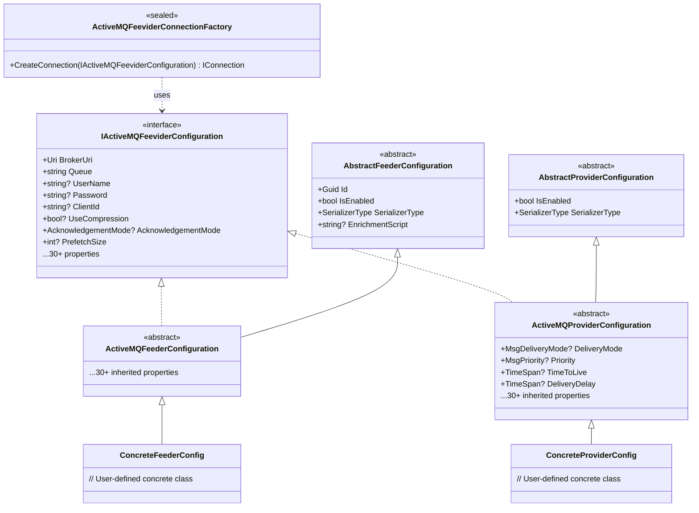

# ThunderPropagator.Feeviders.ActiveMQ.SharedKernel

> Shared configuration, connection management, and utilities for ActiveMQ integration

[◂ Back to ActiveMQ](../README.md) | [◂ Back to Documentation](../../README.md)

## Contents

- [Overview](#overview)
- [Architecture](#architecture)
- [Files](#files)
- [Configuration](#configuration)
- [Dependencies](#dependencies)
- [API Reference](#api-reference)
- [Examples](#examples)
- [Advanced Patterns](#advanced-patterns)
- [Best Practices](#best-practices)
- [See Also](#see-also)

## Overview

**Type**: Shared Kernel Library  
**Target Frameworks**: .NET 8, 9, 10  
**Package**: ThunderPropagator.Feeviders.ActiveMQ.SharedKernel

The ActiveMQ SharedKernel provides common abstractions, configuration classes, and utilities shared between ActiveMQ Feeders (consumers) and Providers (publishers). It implements the Apache.NMS connection factory pattern, configuration validation, and provides a unified interface for JMS broker connectivity across all ActiveMQ feeviders.

### Key Features

- ✅ **Unified Configuration**: Common `IActiveMQFeeviderConfiguration` interface
- ✅ **Connection Factory**: Centralized `ActiveMQFeeviderConnectionFactory` for broker connections
- ✅ **Configuration Validation**: Property validation (required fields, format checks)
- ✅ **Failover Transport**: Built-in HA configuration support
- ✅ **Authentication**: Username/password, client certificates
- ✅ **Performance Tuning**: Prefetch, compression, async operations
- ✅ **Connection Pooling**: Reusable connection creation pattern
- ✅ **Type Safety**: Strongly-typed configuration properties

### Components

| Component | Purpose |
|-----------|---------|
| **IActiveMQFeeviderConfiguration** | Common interface for Feeder/Provider configuration |
| **ActiveMQFeeviderConnectionFactory** | Creates configured `IConnection` instances |
| **Configuration Enums** | `AcknowledgementMode`, `MsgDeliveryMode`, `MsgPriority` |

## Architecture



### Configuration Inheritance Hierarchy

```
IActiveMQFeeviderConfiguration (Interface)
│
├─► AbstractFeederConfiguration (Base class from ThunderPropagator)
│   └─► ActiveMQFeederConfiguration (ActiveMQ-specific feeder config)
│       └─► YourFeederConfig (User-defined concrete class)
│
└─► AbstractProviderConfiguration (Base class from ThunderPropagator)
    └─► ActiveMQProviderConfiguration (ActiveMQ-specific provider config)
        └─► YourProviderConfig (User-defined concrete class)
```

## Files

| File | Lines | Responsibility |
|------|-------|----------------|
| **IActiveMQFeeviderConfiguration.cs** | 34 | Common configuration interface (30+ properties) |
| **ActiveMQFeeviderConnectionFactory.cs** | 71 | Connection factory implementation |
| **AssemblyInfo.cs** | 22 | Assembly metadata |
| **Total** | **127** | **Complete shared kernel** |

### Key Classes

**IActiveMQFeeviderConfiguration**:
- Interface defining all common JMS configuration properties
- Implemented by both `ActiveMQFeederConfiguration` and `ActiveMQProviderConfiguration`
- Ensures consistent configuration across feeders and providers

**ActiveMQFeeviderConnectionFactory**:
- Static factory method: `CreateConnection(IActiveMQFeeviderConfiguration)`
- Creates `Apache.NMS.ActiveMQ.ConnectionFactory` from configuration
- Applies all configuration properties (broker URI, authentication, performance settings)
- Returns started `IConnection` ready for use

## Dependencies

```xml
<!-- JMS Client Library -->
<PackageReference Include="Apache.NMS" Version="2.2.0" />
<PackageReference Include="Apache.NMS.ActiveMQ" Version="2.2.0" />

<!-- ThunderPropagator Framework -->
<PackageReference Include="ThunderPropagator.BuildingBlocks" Version="1.0.1-beta.2" />
```

## Configuration

### Core Properties

| Property | Type | Required | Default | Description |
|----------|------|----------|---------|-------------|
| **BrokerUri** | `Uri` | ✅ | — | Broker connection URI (tcp://host:61616, ssl://host:61617, failover:(...)) |
| **Queue** | `string` | ✅ | — | Destination name (queue or topic, supports topic:// prefix) |
| **UserName** | `string?` | ❌ | `null` | JAAS authentication username |
| **Password** | `string?` | ❌ | `null` | JAAS authentication password |
| **ClientId** | `string?` | ❌ | `null` | Unique client identifier (required for durable subscriptions) |
| **ClientIdPrefix** | `string?` | ❌ | `null` | Prefix for auto-generated ClientId |

### Connection Properties

| Property | Type | Required | Default | Description |
|----------|------|----------|---------|-------------|
| **RequestTimeout** | `int?` | ❌ | 30000 | Request timeout (milliseconds) |
| **UseCompression** | `bool?` | ❌ | `false` | Enable GZip message compression |
| **CopyMessageOnSend** | `bool?` | ❌ | `true` | Copy message before sending (prevent modification) |
| **AlwaysSyncSend** | `bool?` | ❌ | `false` | Always wait for broker confirmation (slower, guaranteed) |
| **AsyncSend** | `bool?` | ❌ | `false` | Send messages asynchronously (faster, no wait) |
| **AsyncClose** | `bool?` | ❌ | `true` | Close connections asynchronously |

### Consumer Properties

| Property | Type | Required | Default | Description |
|----------|------|----------|---------|-------------|
| **AcknowledgementMode** | `AcknowledgementMode?` | ❌ | `AutoAcknowledge` | AUTO_ACKNOWLEDGE, CLIENT_ACKNOWLEDGE, DUPS_OK_ACKNOWLEDGE, SESSION_TRANSACTED |
| **ExclusiveConsumer** | `bool?` | ❌ | `false` | Only one consumer can connect to destination (mutual exclusion) |
| **UseRetroactiveConsumer** | `bool?` | ❌ | `false` | Receive messages sent before subscription created |
| **OptimizeAcknowledge** | `bool?` | ❌ | `false` | Batch acknowledgments for performance (CLIENT_ACKNOWLEDGE only) |
| **OptimizeAcknowledgeTimeOut** | `long?` | ❌ | 300 | Batch ack timeout (ms) |
| **OptimizedAckScheduledAckInterval** | `long?` | ❌ | 0 | Periodic ack interval (ms, 0 = disabled) |

### Redelivery & Durability

| Property | Type | Required | Default | Description |
|----------|------|----------|---------|-------------|
| **ConsumerFailoverRedeliveryWaitPeriod** | `long?` | ❌ | 0 | Delay before redelivery after failover (ms) |
| **CheckForDuplicates** | `bool?` | ❌ | `false` | Enable duplicate message detection (uses message audit) |
| **NonBlockingRedelivery** | `bool?` | ❌ | `false` | Redeliver messages asynchronously (non-blocking consumer) |
| **AuditDepth** | `int?` | ❌ | 2048 | Number of message IDs to track for duplicate detection |
| **AuditMaximumProducerNumber** | `int?` | ❌ | 64 | Max producers to track for duplicate detection |
| **TransactedIndividualAck** | `bool?` | ❌ | `false` | Allow individual acks in transacted sessions |

### Performance Properties

| Property | Type | Required | Default | Description |
|----------|------|----------|---------|-------------|
| **DispatchAsync** | `bool?` | ❌ | `true` | Dispatch messages to listener asynchronously |
| **SendAcksAsync** | `bool?` | ❌ | `true` | Send consumer acknowledgments asynchronously |
| **WatchTopicAdvisories** | `bool?` | ❌ | `true` | Subscribe to advisory topics (broker monitoring) |
| **MessagePrioritySupported** | `bool?` | ❌ | `true` | Enable message priority queuing |
| **ProducerWindowSize** | `int?` | ❌ | 0 | Producer flow control window (bytes, 0 = disabled) |

### Enumerations

**AcknowledgementMode** (Apache.NMS):
```csharp
public enum AcknowledgementMode
{
    AutoAcknowledge = 1,      // Session auto-acks after MessageListener returns
    ClientAcknowledge = 2,    // Application calls message.Acknowledge()
    DupsOkAcknowledge = 3,    // Lazy acks, possible duplicates
    Transacted = 0            // Acks via session.Commit(), rollback via session.Rollback()
}
```

**MsgDeliveryMode** (Apache.NMS):
```csharp
public enum MsgDeliveryMode
{
    NonPersistent = 1,  // Memory only, lost on restart
    Persistent = 2      // Disk write, survives restart
}
```

**MsgPriority** (Apache.NMS):
```csharp
public enum MsgPriority
{
    Lowest = 0,
    VeryLow = 1,
    Low = 2,
    AboveLow = 3,
    Normal = 4,      // Default
    AboveNormal = 5,
    High = 6,
    VeryHigh = 7,
    Highest = 8,
    BrokerHigh = 9   // Broker internal (admin messages)
}
```

## API Reference

### IActiveMQFeeviderConfiguration Interface

```csharp
public interface IActiveMQFeeviderConfiguration
{
    // Core properties
    Uri BrokerUri { get; set; }
    string Queue { get; set; }
    string? UserName { get; set; }
    string? Password { get; set; }
    string? ClientId { get; set; }
    string? ClientIdPrefix { get; set; }
    
    // Connection properties
    bool? UseCompression { get; set; }
    bool? CopyMessageOnSend { get; set; }
    bool? AlwaysSyncSend { get; set; }
    bool? AsyncClose { get; set; }
    bool? SendAcksAsync { get; set; }
    bool? AsyncSend { get; set; }
    bool? DispatchAsync { get; set; }
    int? RequestTimeout { get; set; }
    int? ProducerWindowSize { get; set; }
    
    // Consumer properties
    AcknowledgementMode? AcknowledgementMode { get; set; }
    bool? ExclusiveConsumer { get; set; }
    bool? UseRetroactiveConsumer { get; set; }
    bool? OptimizeAcknowledge { get; set; }
    long? OptimizeAcknowledgeTimeOut { get; set; }
    long? OptimizedAckScheduledAckInterval { get; set; }
    
    // Redelivery & durability
    long? ConsumerFailoverRedeliveryWaitPeriod { get; set; }
    bool? CheckForDuplicates { get; set; }
    bool? TransactedIndividualAck { get; set; }
    bool? NonBlockingRedelivery { get; set; }
    int? AuditDepth { get; set; }
    int? AuditMaximumProducerNumber { get; set; }
    
    // Advanced properties
    bool? WatchTopicAdvisories { get; set; }
    bool? MessagePrioritySupported { get; set; }
}
```

### ActiveMQFeeviderConnectionFactory Class

```csharp
internal sealed class ActiveMQFeeviderConnectionFactory
{
    /// <summary>
    /// Creates and configures an IConnection from configuration.
    /// </summary>
    /// <param name="configuration">Configuration implementing IActiveMQFeeviderConfiguration</param>
    /// <returns>Configured IConnection instance (not started)</returns>
    /// <exception cref="ArgumentNullException">If BrokerUri is null</exception>
    public static IConnection CreateConnection(IActiveMQFeeviderConfiguration configuration);
}
```

**Usage**:
```csharp
var configuration = new OrderQueueConfiguration
{
    BrokerUri = new Uri("tcp://localhost:61616"),
    Queue = "orders",
    UserName = "admin",
    Password = "admin"
};

// Create connection
var connection = ActiveMQFeeviderConnectionFactory.CreateConnection(configuration);
connection.Start(); // Start receiving messages

// Create session
var session = connection.CreateSession(AcknowledgementMode.AutoAcknowledge);

// Create consumer or producer
var consumer = session.CreateConsumer(session.GetQueue(configuration.Queue));
```

### Configuration Property Access Pattern

```csharp
public abstract class ActiveMQFeederConfiguration : AbstractFeederConfiguration, IActiveMQFeeviderConfiguration
{
    // Property implementation using Get/Set helpers
    public Uri BrokerUri
    {
        get => Get<Uri>()!;  // Required property (non-nullable)
        set => Set(value);
    }
    
    public string? ClientId
    {
        get => Get<string>();  // Optional property (nullable)
        set => Set(value);
    }
    
    public bool? UseCompression
    {
        get => Get<bool>();  // Optional boolean (nullable)
        set => Set(value);
    }
}
```

**Get/Set Helpers** (from `AbstractFeederConfiguration`):
- `Get<T>()`: Retrieve property value from internal dictionary
- `Set<T>(value)`: Store property value in internal dictionary
- Thread-safe property storage
- Support for nullable value types

## Examples

### 1. Basic Connection Configuration

**Scenario**: Connect to local ActiveMQ broker (development)

**Configuration**:
```csharp
public class OrderQueueConfiguration : ActiveMQFeederConfiguration
{
    // Inherits all properties from ActiveMQFeederConfiguration
}
```

**Setup** (`appsettings.Development.json`):
```json
{
  "Messaging": {
    "ActiveMQ": {
      "Orders": {
        "BrokerUri": "tcp://localhost:61616",
        "Queue": "orders",
        "UserName": "admin",
        "Password": "admin",
        "SerializerType": "Json"
      }
    }
  }
}
```

**Usage**:
```csharp
var configuration = new OrderQueueConfiguration
{
    BrokerUri = new Uri("tcp://localhost:61616"),
    Queue = "orders",
    UserName = "admin",
    Password = "admin",
    SerializerType = SerializerType.Json
};

var connection = ActiveMQFeeviderConnectionFactory.CreateConnection(configuration);
connection.Start();

Console.WriteLine($"Connected to {configuration.BrokerUri}");
```

### 2. Queue vs Topic Destinations

**Queue Configuration** (Point-to-Point):
```csharp
var queueConfig = new OrderQueueConfiguration
{
    BrokerUri = new Uri("tcp://localhost:61616"),
    Queue = "orders",  // Queue name (no prefix)
    UserName = "admin",
    Password = "admin"
};

var connection = ActiveMQFeeviderConnectionFactory.CreateConnection(queueConfig);
var session = connection.CreateSession();
var destination = session.GetQueue(queueConfig.Queue); // IQueue
```

**Topic Configuration** (Publish-Subscribe):
```csharp
var topicConfig = new AuditTopicConfiguration
{
    BrokerUri = new Uri("tcp://localhost:61616"),
    Queue = "topic://audit.events",  // Topic prefix (optional, for clarity)
    UserName = "admin",
    Password = "admin"
};

var connection = ActiveMQFeeviderConnectionFactory.CreateConnection(topicConfig);
var session = connection.CreateSession();
var destination = session.GetTopic("audit.events"); // ITopic (strip topic:// prefix)
```

**Note**: ActiveMQ automatically determines destination type from broker configuration. The `topic://` prefix is optional but recommended for clarity.

### 3. Durable Topic Subscription

**Scenario**: Ensure message delivery even if subscriber offline (critical events)

**Configuration**:
```json
{
  "Messaging": {
    "ActiveMQ": {
      "SystemEvents": {
        "BrokerUri": "tcp://localhost:61616",
        "Queue": "topic://system.events",
        "ClientId": "notification-service-1",
        "UserName": "admin",
        "Password": "admin",
        "SerializerType": "Json"
      }
    }
  }
}
```

**Usage**:
```csharp
var config = new SystemEventsConfiguration
{
    BrokerUri = new Uri("tcp://localhost:61616"),
    Queue = "topic://system.events",
    ClientId = "notification-service-1",  // Required for durable subscriptions
    UserName = "admin",
    Password = "admin"
};

var connection = ActiveMQFeeviderConnectionFactory.CreateConnection(config);
connection.Start();

var session = connection.CreateSession(AcknowledgementMode.ClientAcknowledge);
var topic = session.GetTopic("system.events");

// Create durable subscriber
var consumer = session.CreateDurableConsumer(topic, "notification-durable-sub");

consumer.Listener += async message =>
{
    Console.WriteLine($"Received: {message.NMSMessageId}");
    await message.AcknowledgeAsync(); // Manual ack
};
```

**Durable Subscription Requirements**:
- **ClientId**: Must be unique and set
- **Durable Name**: Identifies subscription (persisted by broker)
- **Acknowledgment**: Typically CLIENT_ACKNOWLEDGE or TRANSACTED

**Unsubscribe** (Delete Subscription):
```csharp
session.Unsubscribe("notification-durable-sub");
```

### 4. Transactional Configuration

**Scenario**: Atomic message processing (all or nothing)

**Configuration**:
```csharp
var transactionalConfig = new TransactionalOrderConfiguration
{
    BrokerUri = new Uri("tcp://localhost:61616"),
    Queue = "orders.transactional",
    AcknowledgementMode = AcknowledgementMode.Transacted,  // SESSION_TRANSACTED
    UserName = "admin",
    Password = "admin"
};

var connection = ActiveMQFeeviderConnectionFactory.CreateConnection(transactionalConfig);
var session = connection.CreateSession();

// Session is transacted
Console.WriteLine($"Transacted: {session.Transacted}"); // True
```

**Consumer with Transactions**:
```csharp
consumer.Listener += async message =>
{
    try
    {
        await ProcessMessageAsync(message);
        await session.CommitAsync();  // Ack all received messages
        Console.WriteLine("Transaction committed");
    }
    catch (Exception ex)
    {
        await session.RollbackAsync();  // Redeliver all received messages
        Console.WriteLine("Transaction rolled back");
    }
};
```

### 5. Failover Transport (High Availability)

**Scenario**: Automatic reconnection to clustered brokers

**Configuration** (Multiple Brokers):
```csharp
var haConfig = new OrderQueueConfiguration
{
    BrokerUri = new Uri("failover:(tcp://broker1:61616,tcp://broker2:61616)?randomize=false&maxReconnectAttempts=5"),
    Queue = "orders",
    UserName = "admin",
    Password = "admin"
};

var connection = ActiveMQFeeviderConnectionFactory.CreateConnection(haConfig);
connection.Start();

Console.WriteLine("Connected with failover transport");
```

**Failover URI Options**:
```
failover:(tcp://broker1:61616,tcp://broker2:61616)?
    randomize=false&                  // Connect in order (broker1 first, then broker2)
    maxReconnectAttempts=5&           // Max reconnect attempts (5 before giving up)
    initialReconnectDelay=1000&       // Initial delay before reconnect (ms)
    maxReconnectDelay=30000&          // Max delay between reconnects (ms)
    useExponentialBackOff=true&       // Enable exponential backoff
    backOffMultiplier=2.0&            // Backoff multiplier (delay × 2 each attempt)
    timeout=5000                      // Connection timeout (ms)
```

**Common Patterns**:
| Pattern | Configuration | Use Case |
|---------|---------------|----------|
| **Active-Backup** | `randomize=false` | Primary → backup (ordered failover) |
| **Load Balancing** | `randomize=true` | Distribute load across brokers |
| **Infinite Retry** | `maxReconnectAttempts=-1` | Never give up (continuous reconnect) |
| **Fast Failover** | `initialReconnectDelay=100` | Quick reconnect (low latency) |

### 6. Performance Tuning Configuration

**Scenario**: High-throughput, low-latency messaging

**Configuration**:
```csharp
var performanceConfig = new HighThroughputConfiguration
{
    BrokerUri = new Uri("tcp://localhost:61616"),
    Queue = "high.throughput.queue",
    
    // Connection performance
    UseCompression = false,              // Disable compression (CPU overhead)
    AsyncSend = true,                    // Fire-and-forget (no ACK wait)
    SendAcksAsync = true,                // Async acks (consumer-side)
    DispatchAsync = true,                // Async message dispatch
    
    // Consumer performance
    AcknowledgementMode = AcknowledgementMode.DupsOkAcknowledge,  // Lazy acks (duplicates OK)
    OptimizeAcknowledge = true,          // Batch acks
    OptimizeAcknowledgeTimeOut = 100,    // 100ms ack window
    
    // Advanced
    CopyMessageOnSend = false,           // Don't copy (faster, risk of modification)
    CheckForDuplicates = false,          // Disable duplicate detection (faster)
    
    UserName = "admin",
    Password = "admin"
};

var connection = ActiveMQFeeviderConnectionFactory.CreateConnection(performanceConfig);
```

**Performance Impact**:
| Configuration | Throughput Gain | Latency Reduction | Trade-off |
|---------------|-----------------|-------------------|-----------|
| `AsyncSend = true` | +300% | -80% | No send confirmation |
| `DupsOkAcknowledge` | +50% | -30% | Possible duplicates |
| `OptimizeAcknowledge` | +30% | -20% | Batched acks (delayed ack) |
| `UseCompression = false` | +20% | -10% | Higher bandwidth |
| `CopyMessageOnSend = false` | +10% | -5% | Risk of message modification |

### 7. Connection Pooling

**Scenario**: Reuse connections across multiple feeders/providers

**Connection Pool Implementation**:
```csharp
public class ActiveMQConnectionPool
{
    private readonly ConcurrentDictionary<string, IConnection> _connections = new();
    private readonly ILogger<ActiveMQConnectionPool> _logger;
    
    public ActiveMQConnectionPool(ILogger<ActiveMQConnectionPool> logger)
    {
        _logger = logger;
    }
    
    public IConnection GetOrCreateConnection(IActiveMQFeeviderConfiguration config)
    {
        var key = $"{config.BrokerUri}_{config.UserName}";
        
        return _connections.GetOrAdd(key, _ =>
        {
            _logger.LogInformation("Creating new connection to {BrokerUri}", config.BrokerUri);
            var connection = ActiveMQFeeviderConnectionFactory.CreateConnection(config);
            connection.Start();
            return connection;
        });
    }
    
    public void CloseAll()
    {
        foreach (var connection in _connections.Values)
        {
            try
            {
                connection.Close();
                connection.Dispose();
            }
            catch (Exception ex)
            {
                _logger.LogWarning(ex, "Exception while closing connection");
            }
        }
        
        _connections.Clear();
    }
}
```

**Registration** (DI Container):
```csharp
builder.Services.AddSingleton<ActiveMQConnectionPool>();
```

**Usage**:
```csharp
public class OrderFeeder
{
    private readonly ActiveMQConnectionPool _connectionPool;
    private readonly OrderQueueConfiguration _config;
    
    public OrderFeeder(ActiveMQConnectionPool connectionPool, OrderQueueConfiguration config)
    {
        _connectionPool = connectionPool;
        _config = config;
    }
    
    public void Initialize()
    {
        // Get or create connection (reused across feeders)
        var connection = _connectionPool.GetOrCreateConnection(_config);
        var session = connection.CreateSession();
        var consumer = session.CreateConsumer(session.GetQueue(_config.Queue));
        
        // ...
    }
}
```

**Benefits**:
- **Reduced Overhead**: Avoid connection creation cost (~50-200 ms)
- **Resource Efficiency**: Single connection for multiple consumers/producers
- **Connection Limits**: Stay within broker max connections limit

### 8. Environment-Based Configuration

**Scenario**: Different settings for dev, staging, production

**appsettings.Development.json**:
```json
{
  "Messaging": {
    "ActiveMQ": {
      "Orders": {
        "BrokerUri": "tcp://localhost:61616",
        "Queue": "orders.dev",
        "UserName": "admin",
        "Password": "admin",
        "UseCompression": false,
        "SerializerType": "Json"
      }
    }
  }
}
```

**appsettings.Production.json**:
```json
{
  "Messaging": {
    "ActiveMQ": {
      "Orders": {
        "BrokerUri": "failover:(tcp://prod-broker1:61616,tcp://prod-broker2:61616)?randomize=true",
        "Queue": "orders.prod",
        "UserName": "production-user",
        "Password": "${ACTIVEMQ_PASSWORD}",
        "UseCompression": true,
        "AlwaysSyncSend": true,
        "CheckForDuplicates": true,
        "SerializerType": "Json"
      }
    }
  }
}
```

**Loading Configuration**:
```csharp
var builder = WebApplication.CreateBuilder(args);

// Automatically loads correct appsettings based on environment
var configuration = builder.Configuration;

// Register configuration
builder.Services.Configure<OrderQueueConfiguration>(
    configuration.GetSection("Messaging:ActiveMQ:Orders"));

// Use configuration
builder.Services.AddActiveMQFeeder<OrderChannel, OrderMessage, OrderQueueConfiguration>(
    configuration, "Messaging:ActiveMQ:Orders");
```

**Environment Variable Override** (Production):
```bash
export ACTIVEMQ_PASSWORD="secure-production-password"
dotnet run --environment Production
```

## Advanced Patterns

### 1. Configuration Validation

**Purpose**: Validate configuration at startup (fail fast)

**Implementation**:
```csharp
public static class ActiveMQConfigurationValidator
{
    public static void Validate(IActiveMQFeeviderConfiguration config)
    {
        var errors = new List<string>();
        
        // Required properties
        if (config.BrokerUri == null)
            errors.Add("BrokerUri is required");
        
        if (string.IsNullOrWhiteSpace(config.Queue))
            errors.Add("Queue is required");
        
        // Durable subscription requirements
        if (config.Queue?.StartsWith("topic://") == true)
        {
            // For durable subscriptions, ClientId is required
            if (string.IsNullOrWhiteSpace(config.ClientId))
                errors.Add("ClientId is required for durable topic subscriptions");
        }
        
        // Security checks
        if (config.BrokerUri?.Scheme == "ssl" && 
            string.IsNullOrWhiteSpace(config.UserName))
        {
            errors.Add("UserName is required for SSL connections");
        }
        
        // Performance checks
        if (config.OptimizeAcknowledge == true && 
            config.AcknowledgementMode != AcknowledgementMode.ClientAcknowledge)
        {
            errors.Add("OptimizeAcknowledge requires AcknowledgementMode = ClientAcknowledge");
        }
        
        if (errors.Any())
            throw new InvalidOperationException($"Configuration validation failed: {string.Join(", ", errors)}");
    }
}
```

**Usage**:
```csharp
var config = new OrderQueueConfiguration
{
    BrokerUri = new Uri("tcp://localhost:61616"),
    Queue = "orders"
};

// Validate before use
ActiveMQConfigurationValidator.Validate(config);

// Create connection (safe)
var connection = ActiveMQFeeviderConnectionFactory.CreateConnection(config);
```

### 2. Builder Pattern for Complex Configuration

**Purpose**: Fluent API for configuration creation

**Implementation**:
```csharp
public class ActiveMQConfigurationBuilder
{
    private readonly IActiveMQFeeviderConfiguration _config;
    
    public ActiveMQConfigurationBuilder(IActiveMQFeeviderConfiguration config)
    {
        _config = config;
    }
    
    public ActiveMQConfigurationBuilder WithBroker(string brokerUri)
    {
        _config.BrokerUri = new Uri(brokerUri);
        return this;
    }
    
    public ActiveMQConfigurationBuilder WithQueue(string queueName)
    {
        _config.Queue = queueName;
        return this;
    }
    
    public ActiveMQConfigurationBuilder WithAuthentication(string userName, string password)
    {
        _config.UserName = userName;
        _config.Password = password;
        return this;
    }
    
    public ActiveMQConfigurationBuilder WithPerformanceTuning(bool highThroughput = true)
    {
        if (highThroughput)
        {
            _config.AsyncSend = true;
            _config.SendAcksAsync = true;
            _config.DispatchAsync = true;
            _config.AcknowledgementMode = AcknowledgementMode.DupsOkAcknowledge;
            _config.OptimizeAcknowledge = true;
        }
        return this;
    }
    
    public ActiveMQConfigurationBuilder WithHighAvailability(params string[] brokerUris)
    {
        var failoverUri = $"failover:({string.Join(",", brokerUris)})?randomize=true";
        _config.BrokerUri = new Uri(failoverUri);
        return this;
    }
    
    public ActiveMQConfigurationBuilder WithDurableSubscription(string clientId)
    {
        _config.ClientId = clientId;
        _config.AcknowledgementMode = AcknowledgementMode.ClientAcknowledge;
        return this;
    }
    
    public IActiveMQFeeviderConfiguration Build()
    {
        ActiveMQConfigurationValidator.Validate(_config);
        return _config;
    }
}
```

**Usage**:
```csharp
var config = new ActiveMQConfigurationBuilder(new OrderQueueConfiguration())
    .WithBroker("tcp://localhost:61616")
    .WithQueue("orders")
    .WithAuthentication("admin", "admin")
    .WithPerformanceTuning(highThroughput: true)
    .Build();

var connection = ActiveMQFeeviderConnectionFactory.CreateConnection(config);
```

**HA Configuration Example**:
```csharp
var haConfig = new ActiveMQConfigurationBuilder(new OrderQueueConfiguration())
    .WithHighAvailability("tcp://broker1:61616", "tcp://broker2:61616", "tcp://broker3:61616")
    .WithQueue("orders")
    .WithAuthentication("admin", "admin")
    .Build();
```

### 3. Dynamic Destination Resolution

**Purpose**: Determine destination at runtime (multi-tenant, routing)

**Implementation**:
```csharp
public class DynamicDestinationResolver
{
    private readonly IActiveMQFeeviderConfiguration _baseConfig;
    
    public DynamicDestinationResolver(IActiveMQFeeviderConfiguration baseConfig)
    {
        _baseConfig = baseConfig;
    }
    
    public IActiveMQFeeviderConfiguration ResolveForTenant(string tenantId)
    {
        // Create tenant-specific configuration
        var tenantConfig = (IActiveMQFeeviderConfiguration)Activator.CreateInstance(_baseConfig.GetType())!;
        
        // Copy base properties
        tenantConfig.BrokerUri = _baseConfig.BrokerUri;
        tenantConfig.UserName = _baseConfig.UserName;
        tenantConfig.Password = _baseConfig.Password;
        tenantConfig.UseCompression = _baseConfig.UseCompression;
        // ... copy other properties
        
        // Override queue with tenant-specific name
        tenantConfig.Queue = $"orders.{tenantId}";
        tenantConfig.ClientId = $"{tenantId}-client";
        
        return tenantConfig;
    }
    
    public IActiveMQFeeviderConfiguration ResolveForPriority(string baseName, string priority)
    {
        var priorityConfig = (IActiveMQFeeviderConfiguration)Activator.CreateInstance(_baseConfig.GetType())!;
        
        // Copy base properties
        CopyBaseProperties(priorityConfig, _baseConfig);
        
        // Override queue with priority-specific name
        priorityConfig.Queue = $"{baseName}.{priority.ToLower()}";
        
        return priorityConfig;
    }
    
    private void CopyBaseProperties(IActiveMQFeeviderConfiguration target, IActiveMQFeeviderConfiguration source)
    {
        target.BrokerUri = source.BrokerUri;
        target.UserName = source.UserName;
        target.Password = source.Password;
        target.UseCompression = source.UseCompression;
        target.AsyncSend = source.AsyncSend;
        target.AcknowledgementMode = source.AcknowledgementMode;
        // ... copy other properties as needed
    }
}
```

**Usage** (Multi-Tenant):
```csharp
var baseConfig = new OrderQueueConfiguration
{
    BrokerUri = new Uri("tcp://localhost:61616"),
    Queue = "orders",  // Base queue name (overridden)
    UserName = "admin",
    Password = "admin"
};

var resolver = new DynamicDestinationResolver(baseConfig);

// Tenant A → orders.tenant-a
var tenantAConfig = resolver.ResolveForTenant("tenant-a");
var tenantAConnection = ActiveMQFeeviderConnectionFactory.CreateConnection(tenantAConfig);

// Tenant B → orders.tenant-b
var tenantBConfig = resolver.ResolveForTenant("tenant-b");
var tenantBConnection = ActiveMQFeeviderConnectionFactory.CreateConnection(tenantBConfig);
```

### 4. Connection Lifecycle Management

**Purpose**: Handle connection events (reconnection, errors)

**Implementation**:
```csharp
public class ActiveMQConnectionManager
{
    private readonly IActiveMQFeeviderConfiguration _config;
    private readonly ILogger<ActiveMQConnectionManager> _logger;
    private IConnection? _connection;
    
    public event EventHandler<EventArgs>? Connected;
    public event EventHandler<EventArgs>? Disconnected;
    public event EventHandler<ExceptionEventArgs>? ConnectionError;
    
    public ActiveMQConnectionManager(IActiveMQFeeviderConfiguration config, ILogger<ActiveMQConnectionManager> logger)
    {
        _config = config;
        _logger = logger;
    }
    
    public IConnection GetConnection()
    {
        if (_connection == null || !_connection.IsStarted)
        {
            _connection = CreateConnection();
        }
        return _connection;
    }
    
    private IConnection CreateConnection()
    {
        _logger.LogInformation("Creating connection to {BrokerUri}", _config.BrokerUri);
        
        var connection = ActiveMQFeeviderConnectionFactory.CreateConnection(_config);
        
        // Register event handlers (Note: NMS API may differ)
        connection.ConnectionInterruptedListener += () =>
        {
            _logger.LogWarning("Connection interrupted");
            Disconnected?.Invoke(this, EventArgs.Empty);
        };
        
        connection.ConnectionResumedListener += () =>
        {
            _logger.LogInformation("Connection resumed");
            Connected?.Invoke(this, EventArgs.Empty);
        };
        
        connection.ExceptionListener += (exception) =>
        {
            _logger.LogError(exception, "Connection error");
            ConnectionError?.Invoke(this, new ExceptionEventArgs(exception));
        };
        
        connection.Start();
        _logger.LogInformation("Connection started successfully");
        Connected?.Invoke(this, EventArgs.Empty);
        
        return connection;
    }
    
    public void Dispose()
    {
        try
        {
            _connection?.Close();
            _connection?.Dispose();
            _logger.LogInformation("Connection closed");
        }
        catch (Exception ex)
        {
            _logger.LogWarning(ex, "Exception while closing connection");
        }
    }
}
```

**Usage**:
```csharp
var connectionManager = new ActiveMQConnectionManager(config, logger);

connectionManager.Connected += (s, e) =>
{
    Console.WriteLine("Connected to broker");
};

connectionManager.Disconnected += (s, e) =>
{
    Console.WriteLine("Disconnected from broker");
};

connectionManager.ConnectionError += (s, e) =>
{
    Console.WriteLine($"Connection error: {e.Exception.Message}");
};

var connection = connectionManager.GetConnection();
```

## Best Practices

### 1. Configuration Management

✅ **Do**:
- Use strongly-typed configuration classes (derive from `ActiveMQFeederConfiguration` or `ActiveMQProviderConfiguration`)
- Validate configuration at startup (fail fast)
- Use environment-specific configuration files (appsettings.Development.json, appsettings.Production.json)
- Store sensitive data (passwords) in environment variables or Azure Key Vault

❌ **Don't**:
- Hardcode configuration in code (use appsettings.json)
- Commit passwords to source control
- Skip validation (silent failures)

### 2. Connection Pooling

✅ **Do**:
- Reuse connections (expensive to create, ~50-200 ms)
- Implement connection pooling for high-volume applications
- Share single connection across multiple consumers/producers

❌ **Don't**:
- Create new connection per message (resource leak)
- Share session across threads (not thread-safe)

### 3. Failover Configuration

✅ **Do**:
- Use failover transport for production (`failover:(tcp://broker1,tcp://broker2)`)
- Configure `maxReconnectAttempts` appropriately (-1 for infinite)
- Test failover behavior (simulate broker restart)

❌ **Don't**:
- Use single broker in production (no HA)
- Set `maxReconnectAttempts` too low (give up too quickly)

### 4. Performance Tuning

✅ **Do**:
- Measure before optimizing (baseline metrics)
- Enable `AsyncSend` for high throughput
- Use `DupsOkAcknowledge` for idempotent consumers
- Profile CPU usage (compression overhead)

❌ **Don't**:
- Optimize prematurely (measure first)
- Enable all performance settings (understand trade-offs)
- Ignore memory usage (large prefetch = high memory)

### 5. Security

✅ **Do**:
- Use authentication (UserName/Password)
- Use SSL/TLS for production (`ssl://broker:61617`)
- Rotate credentials periodically
- Restrict queue/topic permissions (broker ACLs)

❌ **Don't**:
- Use default credentials (admin/admin) in production
- Transmit sensitive data unencrypted
- Share credentials across environments

### 6. Monitoring

✅ **Do**:
- Subscribe to advisory topics (broker events)
- Monitor connection health (connected/disconnected events)
- Log configuration at startup (debugging)
- Alert on connection failures

❌ **Don't**:
- Deploy without monitoring
- Ignore connection errors (silent failures)
- Disable advisory topics (lose visibility)

## See Also

- [**ActiveMQ System Overview**](../README.md) - Apache ActiveMQ architecture, features, and concepts
- [**Feeders.ActiveMQ**](../Feeders.ActiveMQ/README.md) - ActiveMQ message consumer implementation
- [**Providers.DotNet.ActiveMQ**](../Providers.DotNet.ActiveMQ/README.md) - ActiveMQ message publisher implementation
- [**SharedKernel Documentation**](../../SharedKernel/README.md) - Core abstractions for all feeders/providers
- [**Apache ActiveMQ Documentation**](https://activemq.apache.org/components/classic/documentation) - Official broker documentation
- [**Apache.NMS API Reference**](https://github.com/apache/activemq-nms-api) - .NET Messaging API for ActiveMQ

---

**Next Steps**:
1. Create concrete configuration classes inheriting from `ActiveMQFeederConfiguration` or `ActiveMQProviderConfiguration`
2. Configure [broker URI](Feeder#basic-connection-configuration) (tcp/ssl/failover)
3. Set up [authentication](#basic-connection-configuration) (UserName/Password)
4. Configure [failover transport](#failover-transport-high-availability) for HA
5. Implement [connection pooling](#connection-pooling) for production
