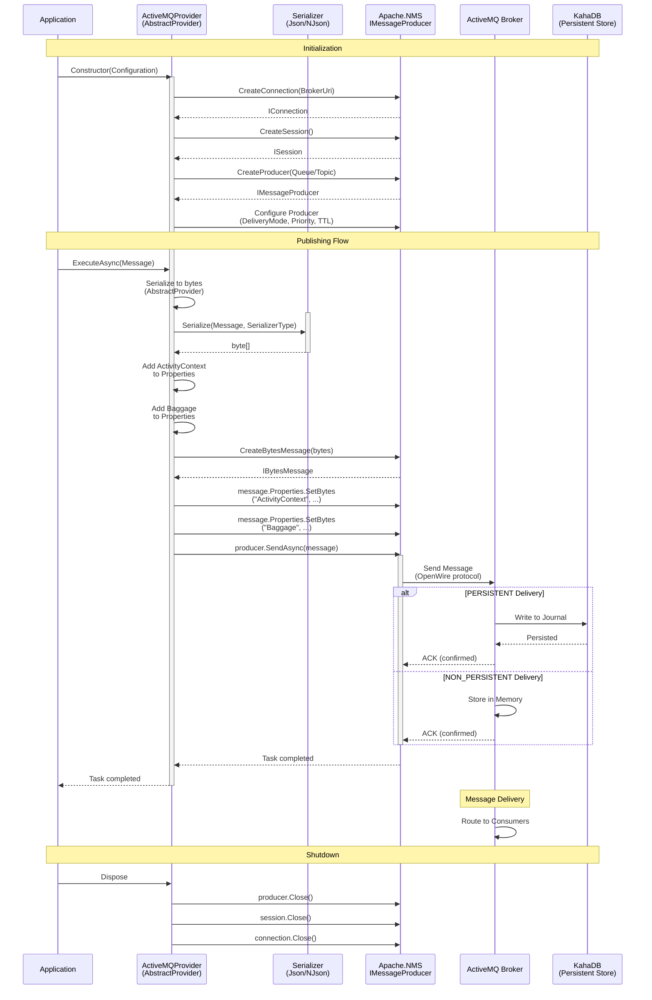
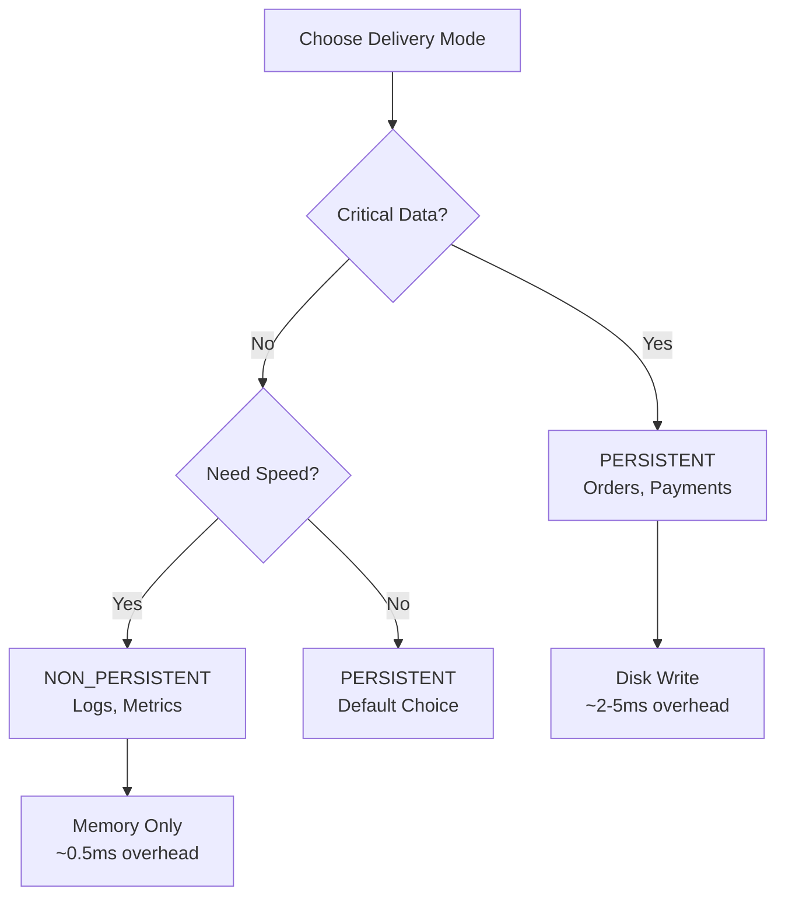

# ThunderPropagator.Providers.DotNet.ActiveMQ

> Apache ActiveMQ Message Publisher - Sends outbound JMS messages to queues and topics

[◂ Back to ActiveMQ](../README.md) | [◂ Back to Documentation](../../README.md)

## Contents

- [Overview](#overview)
- [Architecture](#architecture)
- [Files](#files)
- [Configuration](#configuration)
- [Dependencies](#dependencies)
- [API Reference](#api-reference)
- [Examples](#examples)
- [Advanced Patterns](#advanced-patterns)
- [Best Practices](#best-practices)
- [Performance Optimization](#performance-optimization)
- [Troubleshooting](#troubleshooting)
- [See Also](#see-also)

## Overview

**Type**: Message Publisher (Provider)  
**Target Frameworks**: .NET 8, 9, 10  
**Package**: ThunderPropagator.Providers.DotNet.ActiveMQ

The ActiveMQ Provider is an **AbstractProvider** implementation that publishes JMS 1.1/2.0 compliant messages to Apache ActiveMQ Classic brokers. It supports queues, topics, persistent/non-persistent delivery, message priority, time-to-live (TTL), transactional publishing, and automatic serialization via ThunderPropagator's provider infrastructure.

### Key Features

- ✅ **Automatic Serialization**: AbstractProvider handles JSON/Newtonsoft.Json/NetJSON serialization
- ✅ **Dual Destination Types**: Queue (point-to-point) and Topic (publish-subscribe)
- ✅ **Delivery Modes**: PERSISTENT (disk) or NON_PERSISTENT (memory)
- ✅ **Message Priority**: 0 (lowest) to 9 (highest) priority levels
- ✅ **Time-To-Live (TTL)**: Automatic message expiration
- ✅ **Transactional Publishing**: Atomic batch publishing with commit/rollback
- ✅ **Message Properties**: JMS standard headers + custom properties
- ✅ **Request/Reply Pattern**: JMSReplyTo and JMSCorrelationID support
- ✅ **Message Groups**: JMSXGroupID for ordered delivery
- ✅ **OpenTelemetry Integration**: W3C Trace Context and Baggage propagation
- ✅ **Failover Transport**: Automatic reconnection to clustered brokers
- ✅ **Delivery Delay**: Scheduled message delivery (ActiveMQ 5.13+)
- ✅ **Compression**: Message compression for large payloads

### When to Use This Provider

| Use Case | Recommendation |
|----------|----------------|
| **Task Distribution** | ✅ Queue publishing (load-balanced consumption) |
| **Event Broadcasting** | ✅ Topic publishing (all subscribers receive) |
| **Guaranteed Delivery** | ✅ PERSISTENT delivery mode |
| **High Throughput** | ✅ NON_PERSISTENT delivery mode |
| **Priority Processing** | ✅ Message priority (0-9) |
| **Time-Sensitive Messages** | ✅ TTL (auto-expiration) |
| **Atomic Batch Publishing** | ✅ Transactional sessions |
| **Request/Reply** | ✅ JMSReplyTo + CorrelationID |
| **Ordered Processing** | ✅ Message groups (JMSXGroupID) |
| **Scheduled Delivery** | ✅ Delivery delay (future timestamp) |

## Architecture



### Publishing Flow

1. **Initialization**:
   - Create `IConnection` to ActiveMQ broker (via `ActiveMQFeeviderConnectionFactory`)
   - Create `ISession` with acknowledgment mode
   - Create `IMessageProducer` for destination (queue or topic)
   - Configure producer (delivery mode, priority, TTL)

2. **Message Publishing**:
   - Application calls `ExecuteAsync(TActiveMQProviderMessage)`
   - `AbstractProvider` serializes message to `byte[]` (automatic)
   - Provider creates `IBytesMessage` from bytes
   - Attach `ActivityContext` and `Baggage` to message properties (OpenTelemetry)
   - Call `producer.SendAsync(message)`
   - Broker confirms delivery (PERSISTENT writes to disk, NON_PERSISTENT to memory)

3. **Delivery Modes**:
   - **PERSISTENT**: Broker writes to KahaDB journal → survives restart
   - **NON_PERSISTENT**: In-memory only → lost on restart, faster

## Files

| File | Lines | Responsibility |
|------|-------|----------------|
| **ActiveMQProvider.cs** | 120 | Core AbstractProvider implementation with IMessageProducer |
| **ActiveMQProviderConfiguration.cs** | 192 | Configuration class with 30+ JMS properties |
| **ActiveMQProviderExtensions.cs** | 21 | DI registration method (AddActiveMQProvider) |
| **ActiveMQProviderMessage.cs** | 5 | Abstract message base class |
| **Total** | **338** | **Complete provider implementation** |

### Key Classes

**ActiveMQProvider**:
- Inherits `AbstractProvider<TActiveMQProviderMessage, TActiveMQProviderConfiguration>`
- Creates `IConnection`, `ISession`, `IMessageProducer` via Apache.NMS
- Overrides `InternalExecuteAsync(byte[], CancellationToken)` (receives serialized bytes from AbstractProvider)
- Creates `IBytesMessage` from bytes
- Attaches `ActivityContext` and `Baggage` to message properties
- Calls `producer.SendAsync(message)` for broker delivery
- Disposes resources on shutdown (`DisposeManagedResourcesAsync`)

## Dependencies

```xml
<!-- JMS Client Library -->
<PackageReference Include="Apache.NMS" Version="2.2.0" />
<PackageReference Include="Apache.NMS.ActiveMQ" Version="2.2.0" />

<!-- ThunderPropagator Framework -->
<PackageReference Include="ThunderPropagator.BuildingBlocks" Version="1.0.1-beta.2" />
<PackageReference Include="ThunderPropagator.Feeviders.ActiveMQ.SharedKernel" Version="1.0.1-beta.2" />

<!-- Infrastructure -->
<PackageReference Include="Microsoft.Extensions.DependencyInjection" Version="9.0.0" />
<PackageReference Include="Microsoft.Extensions.Logging" Version="9.0.0" />
<PackageReference Include="OpenTelemetry.Api" Version="1.10.0" />
```

## Configuration

### Core Properties

| Property | Type | Required | Default | Description |
|----------|------|----------|---------|-------------|
| **BrokerUri** | `Uri` | ✅ | — | Broker connection URI (tcp://host:61616, ssl://host:61617, failover:(...)) |
| **Queue** | `string` | ✅ | — | Destination name (queue or topic) |
| **SerializerType** | `SerializerType` | ✅ | — | Serialization format (Json, NJson, NetJson) |
| **UserName** | `string?` | ❌ | `null` | JAAS authentication username |
| **Password** | `string?` | ❌ | `null` | JAAS authentication password |
| **ClientId** | `string?` | ❌ | `null` | Unique client identifier |
| **ClientIdPrefix** | `string?` | ❌ | `null` | Prefix for auto-generated ClientId |

### Producer Properties

| Property | Type | Required | Default | Description |
|----------|------|----------|---------|-------------|
| **DeliveryMode** | `MsgDeliveryMode?` | ❌ | `Persistent` | PERSISTENT (disk) or NON_PERSISTENT (memory) |
| **Priority** | `MsgPriority?` | ❌ | `Normal` (4) | Message priority (0-9, 0=lowest, 9=highest, 4=default) |
| **TimeToLive** | `TimeSpan?` | ❌ | `TimeSpan.Zero` (infinite) | Message expiration (0 = never expires) |
| **ProducerRequestTimeout** | `TimeSpan?` | ❌ | 30 seconds | Producer request timeout |
| **DisableMessageID** | `bool?` | ❌ | `false` | Skip auto-generated JMSMessageID (performance) |
| **DisableMessageTimestamp** | `bool?` | ❌ | `false` | Skip auto-generated JMSTimestamp (performance) |
| **DeliveryDelay** | `TimeSpan?` | ❌ | `TimeSpan.Zero` | Delay before delivery (ActiveMQ 5.13+, scheduled messages) |

### Connection & Performance

| Property | Type | Required | Default | Description |
|----------|------|----------|---------|-------------|
| **UseCompression** | `bool?` | ❌ | `false` | Enable message compression (GZip) |
| **AlwaysSyncSend** | `bool?` | ❌ | `false` | Wait for broker confirmation (slower, guaranteed) |
| **AsyncSend** | `bool?` | ❌ | `false` | Send messages asynchronously (faster, no wait) |
| **AsyncClose** | `bool?` | ❌ | `true` | Close connections asynchronously |
| **CopyMessageOnSend** | `bool?` | ❌ | `true` | Copy message before sending (prevent modification) |
| **RequestTimeout** | `int?` | ❌ | 30000 | Request timeout (ms) |
| **ProducerWindowSize** | `int?` | ❌ | 0 | Producer flow control window (bytes, 0 = disabled) |

### Advanced Properties

| Property | Type | Required | Default | Description |
|----------|------|----------|---------|-------------|
| **MessagePrioritySupported** | `bool?` | ❌ | `true` | Enable message priority queuing |
| **SendAcksAsync** | `bool?` | ❌ | `true` | Send acknowledgments asynchronously |
| **WatchTopicAdvisories** | `bool?` | ❌ | `true` | Subscribe to advisory topics (monitoring) |
| **AuditDepth** | `int?` | ❌ | 2048 | Number of message IDs to track for duplicate detection |
| **AuditMaximumProducerNumber** | `int?` | ❌ | 64 | Max producers to track for duplicate detection |

### Configuration Example

```json
{
  "Messaging": {
    "ActiveMQ": {
      "Producer": {
        "BrokerUri": "tcp://localhost:61616",
        "Queue": "orders",
        "UserName": "admin",
        "Password": "admin",
        "SerializerType": "Json",
        "DeliveryMode": "Persistent",
        "Priority": 4,
        "TimeToLive": "00:30:00",
        "UseCompression": true,
        "AlwaysSyncSend": false,
        "DisableMessageID": false,
        "DisableMessageTimestamp": false
      }
    }
  }
}
```

## API Reference

### ActiveMQProvider Class

```csharp
internal class ActiveMQProvider<TActiveMQProviderMessage, TActiveMQProviderConfiguration> 
    : AbstractProvider<TActiveMQProviderMessage, TActiveMQProviderConfiguration>
    where TActiveMQProviderMessage : ActiveMQProviderMessage
    where TActiveMQProviderConfiguration : ActiveMQProviderConfiguration
{
    // Constructor: Initializes connection, session, producer
    public ActiveMQProvider(
        TActiveMQProviderConfiguration activeMQProviderConfiguration,
        IServiceProvider serviceProvider);
    
    // Override from AbstractProvider
    protected override Task InternalExecuteAsync(
        byte[] bytes, 
        CancellationToken cancellationToken = default);
    
    // Cleanup
    protected override ValueTask DisposeManagedResourcesAsync();
}
```

### ActiveMQProviderMessage Class

```csharp
public abstract class ActiveMQProviderMessage : ProviderMessage
{
    // Inherits from ProviderMessage (ThunderPropagator base class)
    // Define custom properties in derived classes
}

// Example implementation
public class OrderProviderMessage : ActiveMQProviderMessage
{
    public string OrderId { get; set; } = default!;
    public decimal Amount { get; set; }
    public string Status { get; set; } = default!;
}
```

### ActiveMQProviderConfiguration Class

```csharp
public abstract class ActiveMQProviderConfiguration 
    : AbstractProviderConfiguration, 
      IActiveMQFeeviderConfiguration
{
    // Core properties
    public Uri BrokerUri { get; set; }
    public string Queue { get; set; }
    public string? UserName { get; set; }
    public string? Password { get; set; }
    
    // Producer properties
    public MsgDeliveryMode? DeliveryMode { get; set; }
    public MsgPriority? Priority { get; set; }
    public TimeSpan? TimeToLive { get; set; }
    public TimeSpan? ProducerRequestTimeout { get; set; }
    public bool? DisableMessageID { get; set; }
    public bool? DisableMessageTimestamp { get; set; }
    public TimeSpan? DeliveryDelay { get; set; }
    
    // Performance properties
    public bool? UseCompression { get; set; }
    public bool? AlwaysSyncSend { get; set; }
    public bool? AsyncSend { get; set; }
    
    // See Configuration section for complete property list
}
```

### Extension Methods

```csharp
public static class ActiveMQProviderExtensions
{
    // Register provider with DI container
    public static IServiceCollection AddActiveMQProvider<TActiveMQProviderMessage, TActiveMQProviderConfiguration>(
        this IServiceCollection services, 
        IConfigurationRoot configuration, 
        string sectionName)
        where TActiveMQProviderMessage : ActiveMQProviderMessage
        where TActiveMQProviderConfiguration : ActiveMQProviderConfiguration, new();
}
```

## Examples

### 1. Basic Queue Publishing (Persistent)

**Scenario**: Publish order messages to queue with guaranteed delivery

**Configuration** (`appsettings.json`):
```json
{
  "Messaging": {
    "ActiveMQ": {
      "OrderProducer": {
        "BrokerUri": "tcp://localhost:61616",
        "Queue": "orders",
        "UserName": "admin",
        "Password": "admin",
        "SerializerType": "Json",
        "DeliveryMode": "Persistent",
        "Priority": 4
      }
    }
  }
}
```

**Message Definition**:
```csharp
public class OrderProviderMessage : ActiveMQProviderMessage
{
    public string OrderId { get; set; } = default!;
    public string CustomerId { get; set; } = default!;
    public decimal TotalAmount { get; set; }
    public DateTime OrderDate { get; set; } = DateTime.UtcNow;
    public string Status { get; set; } = "Pending";
    public List<OrderItem> Items { get; set; } = new();
}

public class OrderItem
{
    public string ProductId { get; set; } = default!;
    public int Quantity { get; set; }
    public decimal Price { get; set; }
}

public class OrderProviderConfiguration : ActiveMQProviderConfiguration { }
```

**Registration** (`Program.cs`):
```csharp
var builder = WebApplication.CreateBuilder(args);
var configuration = builder.Configuration;

// Register ActiveMQ provider
builder.Services.AddActiveMQProvider<OrderProviderMessage, OrderProviderConfiguration>(
    configuration, "Messaging:ActiveMQ:OrderProducer");

var app = builder.Build();
app.Run();
```

**Usage**:
```csharp
public class OrderService
{
    private readonly ActiveMQProvider<OrderProviderMessage, OrderProviderConfiguration> _provider;
    private readonly ILogger<OrderService> _logger;
    
    public OrderService(
        ActiveMQProvider<OrderProviderMessage, OrderProviderConfiguration> provider,
        ILogger<OrderService> logger)
    {
        _provider = provider;
        _logger = logger;
    }
    
    public async Task CreateOrderAsync(CreateOrderRequest request, CancellationToken cancellationToken)
    {
        var orderId = Guid.NewGuid().ToString();
        
        var orderMessage = new OrderProviderMessage
        {
            OrderId = orderId,
            CustomerId = request.CustomerId,
            TotalAmount = request.Items.Sum(i => i.Price * i.Quantity),
            OrderDate = DateTime.UtcNow,
            Status = "Pending",
            Items = request.Items.Select(i => new OrderItem
            {
                ProductId = i.ProductId,
                Quantity = i.Quantity,
                Price = i.Price
            }).ToList()
        };
        
        _logger.LogInformation("Publishing order {OrderId} to ActiveMQ", orderId);
        
        await _provider.ExecuteAsync(orderMessage, cancellationToken);
        
        _logger.LogInformation("Order {OrderId} published successfully", orderId);
    }
}
```

**Behavior**:
- **PERSISTENT**: Message written to KahaDB (survives broker restart)
- **Priority 4**: Default priority (processed in order with other priority-4 messages)
- **Serialization**: Automatic JSON serialization via AbstractProvider
- **Acknowledgment**: Broker confirms write before returning

### 2. Topic Publishing (Broadcast Events)

**Scenario**: Broadcast audit events to multiple subscribers

**Configuration**:
```json
{
  "Messaging": {
    "ActiveMQ": {
      "AuditProducer": {
        "BrokerUri": "tcp://localhost:61616",
        "Queue": "topic://audit.events",
        "SerializerType": "Json",
        "DeliveryMode": "Persistent",
        "Priority": 5
      }
    }
  }
}
```

**Message Definition**:
```csharp
public class AuditEventProviderMessage : ActiveMQProviderMessage
{
    public string EventId { get; set; } = Guid.NewGuid().ToString();
    public string EventType { get; set; } = default!;
    public string UserId { get; set; } = default!;
    public string Action { get; set; } = default!;
    public DateTime Timestamp { get; set; } = DateTime.UtcNow;
    public Dictionary<string, object> Metadata { get; set; } = new();
}

public class AuditProviderConfiguration : ActiveMQProviderConfiguration { }
```

**Registration**:
```csharp
builder.Services.AddActiveMQProvider<AuditEventProviderMessage, AuditProviderConfiguration>(
    configuration, "Messaging:ActiveMQ:AuditProducer");
```

**Usage** (Audit Logger Middleware):
```csharp
public class AuditMiddleware
{
    private readonly RequestDelegate _next;
    private readonly ActiveMQProvider<AuditEventProviderMessage, AuditProviderConfiguration> _auditProvider;
    
    public AuditMiddleware(
        RequestDelegate next,
        ActiveMQProvider<AuditEventProviderMessage, AuditProviderConfiguration> auditProvider)
    {
        _next = next;
        _auditProvider = auditProvider;
    }
    
    public async Task InvokeAsync(HttpContext context)
    {
        var userId = context.User.FindFirst(ClaimTypes.NameIdentifier)?.Value ?? "anonymous";
        
        // Log request
        await _auditProvider.ExecuteAsync(new AuditEventProviderMessage
        {
            EventType = "HTTP_REQUEST",
            UserId = userId,
            Action = $"{context.Request.Method} {context.Request.Path}",
            Metadata = new Dictionary<string, object>
            {
                ["Method"] = context.Request.Method,
                ["Path"] = context.Request.Path.Value!,
                ["Query"] = context.Request.QueryString.Value!,
                ["UserAgent"] = context.Request.Headers["User-Agent"].ToString()
            }
        });
        
        await _next(context);
        
        // Log response
        await _auditProvider.ExecuteAsync(new AuditEventProviderMessage
        {
            EventType = "HTTP_RESPONSE",
            UserId = userId,
            Action = $"{context.Request.Method} {context.Request.Path} → {context.Response.StatusCode}",
            Metadata = new Dictionary<string, object>
            {
                ["StatusCode"] = context.Response.StatusCode,
                ["ContentType"] = context.Response.ContentType ?? "unknown"
            }
        });
    }
}
```

**Behavior**:
- **Topic**: All subscribers receive copy of each message
- **Durable Subscribers**: Messages queued for offline subscribers (if configured)
- **Broadcast**: Audit logger, analytics, compliance all receive events

### 3. Message Priority (Express vs Standard)

**Scenario**: Prioritize express orders over standard orders

**Configuration** (Express):
```json
{
  "Messaging": {
    "ActiveMQ": {
      "ExpressOrderProducer": {
        "BrokerUri": "tcp://localhost:61616",
        "Queue": "orders",
        "SerializerType": "Json",
        "DeliveryMode": "Persistent",
        "Priority": 9
      }
    }
  }
}
```

**Configuration** (Standard):
```json
{
  "Messaging": {
    "ActiveMQ": {
      "StandardOrderProducer": {
        "BrokerUri": "tcp://localhost:61616",
        "Queue": "orders",
        "SerializerType": "Json",
        "DeliveryMode": "Persistent",
        "Priority": 4
      }
    }
  }
}
```

**Message Definition**:
```csharp
public class OrderProviderMessage : ActiveMQProviderMessage
{
    public string OrderId { get; set; } = default!;
    public string OrderType { get; set; } = default!; // "Express" or "Standard"
    public decimal Amount { get; set; }
}

public class ExpressOrderConfiguration : ActiveMQProviderConfiguration { }
public class StandardOrderConfiguration : ActiveMQProviderConfiguration { }
```

**Registration**:
```csharp
// Express producer (Priority 9)
builder.Services.AddActiveMQProvider<OrderProviderMessage, ExpressOrderConfiguration>(
    configuration, "Messaging:ActiveMQ:ExpressOrderProducer");

// Standard producer (Priority 4)
builder.Services.AddActiveMQProvider<OrderProviderMessage, StandardOrderConfiguration>(
    configuration, "Messaging:ActiveMQ:StandardOrderProducer");
```

**Usage** (Order Service):
```csharp
public class OrderService
{
    private readonly ActiveMQProvider<OrderProviderMessage, ExpressOrderConfiguration> _expressProvider;
    private readonly ActiveMQProvider<OrderProviderMessage, StandardOrderConfiguration> _standardProvider;
    
    public async Task PublishOrderAsync(OrderProviderMessage order, bool isExpress, CancellationToken ct)
    {
        if (isExpress)
        {
            // Priority 9 (delivered first)
            await _expressProvider.ExecuteAsync(order, ct);
        }
        else
        {
            // Priority 4 (default)
            await _standardProvider.ExecuteAsync(order, ct);
        }
    }
}
```

**Broker Configuration** (Enable Priority Queues):
```xml
<destinationPolicy>
  <policyMap>
    <policyEntries>
      <policyEntry queue="orders">
        <prioritizedMessages useCache="true"/>
      </policyEntry>
    </policyEntries>
  </policyMap>
</destinationPolicy>
```

**Behavior**:
- **Priority 9**: Express orders delivered before priority-4 messages
- **Priority 4**: Standard orders processed in order (after express)
- **Queue Depth**: Priority only matters when queue depth > 0 (otherwise FIFO)

### 4. Time-To-Live (TTL) for Expiration

**Scenario**: Time-sensitive promotional offers expire after 1 hour

**Configuration**:
```json
{
  "Messaging": {
    "ActiveMQ": {
      "PromotionProducer": {
        "BrokerUri": "tcp://localhost:61616",
        "Queue": "promotions",
        "SerializerType": "Json",
        "DeliveryMode": "Persistent",
        "TimeToLive": "01:00:00"
      }
    }
  }
}
```

**Message Definition**:
```csharp
public class PromotionProviderMessage : ActiveMQProviderMessage
{
    public string PromotionId { get; set; } = default!;
    public string PromotionCode { get; set; } = default!;
    public decimal DiscountPercentage { get; set; }
    public DateTime ExpiresAt { get; set; }
}

public class PromotionProviderConfiguration : ActiveMQProviderConfiguration { }
```

**Usage**:
```csharp
public class PromotionService
{
    private readonly ActiveMQProvider<PromotionProviderMessage, PromotionProviderConfiguration> _provider;
    
    public async Task SendFlashSaleAsync(string promotionCode, decimal discount, CancellationToken ct)
    {
        await _provider.ExecuteAsync(new PromotionProviderMessage
        {
            PromotionId = Guid.NewGuid().ToString(),
            PromotionCode = promotionCode,
            DiscountPercentage = discount,
            ExpiresAt = DateTime.UtcNow.AddHours(1)
        }, ct);
    }
}
```

**Behavior**:
- **TTL**: 1 hour (3,600,000 ms)
- **JMSExpiration**: Auto-calculated by broker (send timestamp + TTL)
- **Expired Messages**: Moved to `ActiveMQ.DLQ` (Dead Letter Queue)
- **Consumer**: Never receives expired messages (broker filters)

**Dead Letter Queue Monitoring**:
```csharp
// Monitor DLQ for expired promotions
public class DLQMonitor
{
    public async Task MonitorExpiredPromotionsAsync()
    {
        var dlqConsumer = session.CreateConsumer(session.GetQueue("ActiveMQ.DLQ"));
        
        dlqConsumer.Listener += message =>
        {
            var originalDestination = message.Properties.GetString("originalDestination");
            if (originalDestination == "promotions")
            {
                Console.WriteLine($"Promotion expired: {message.NMSMessageId}");
            }
        };
    }
}
```

### 5. Transactional Publishing (Batch Commit)

**Scenario**: Publish multiple related messages atomically (all or nothing)

**Configuration**:
```json
{
  "Messaging": {
    "ActiveMQ": {
      "TransactionalProducer": {
        "BrokerUri": "tcp://localhost:61616",
        "Queue": "orders",
        "SerializerType": "Json",
        "DeliveryMode": "Persistent",
        "AcknowledgementMode": "SessionTransacted"
      }
    }
  }
}
```

**Custom Provider with Transactions**:
```csharp
// Note: Extend ActiveMQProvider for transaction support
// This example shows conceptual implementation

public class TransactionalOrderService
{
    private readonly IConnection _connection;
    private readonly ISession _session;
    private readonly IMessageProducer _producer;
    
    public TransactionalOrderService(IActiveMQFeeviderConfiguration config)
    {
        _connection = ActiveMQFeeviderConnectionFactory.CreateConnection(config);
        _connection.Start();
        
        // Create transacted session
        _session = _connection.CreateSession(AcknowledgementMode.Transacted);
        _producer = _session.CreateProducer(_session.GetQueue("orders"));
    }
    
    public async Task PublishOrderBatchAsync(List<OrderProviderMessage> orders, CancellationToken ct)
    {
        try
        {
            // Publish multiple messages
            foreach (var order in orders)
            {
                var bytes = order.ToNJsonBytes(); // Serialize
                var message = await _session.CreateBytesMessageAsync(bytes);
                await _producer.SendAsync(message);
            }
            
            // Commit all messages atomically
            await _session.CommitAsync();
            
            Console.WriteLine($"Published {orders.Count} orders (committed)");
        }
        catch (Exception ex)
        {
            // Rollback all messages
            await _session.RollbackAsync();
            
            Console.WriteLine($"Failed to publish orders (rolled back): {ex.Message}");
            throw;
        }
    }
}
```

**Behavior**:
- **Atomic**: All messages sent or none
- **Commit**: `session.Commit()` flushes all pending messages
- **Rollback**: `session.Rollback()` discards all pending messages
- **Performance**: ~50% slower than non-transactional (broker overhead)

### 6. Request/Reply with Correlation ID

**Scenario**: Validate order synchronously (send request, wait for response)

**Request Configuration**:
```json
{
  "Messaging": {
    "ActiveMQ": {
      "ValidationRequestProducer": {
        "BrokerUri": "tcp://localhost:61616",
        "Queue": "validation.requests",
        "SerializerType": "Json",
        "DeliveryMode": "NonPersistent",
        "TimeToLive": "00:00:30"
      }
    }
  }
}
```

**Message Definition**:
```csharp
public class ValidationRequestProviderMessage : ActiveMQProviderMessage
{
    public string RequestId { get; set; } = default!;
    public string OrderId { get; set; } = default!;
    public string ReplyToQueue { get; set; } = default!;
    public string CorrelationId { get; set; } = default!;
}

public class ValidationRequestConfiguration : ActiveMQProviderConfiguration { }
```

**Usage** (Request/Reply Client):
```csharp
public class OrderValidationClient
{
    private readonly ActiveMQProvider<ValidationRequestProviderMessage, ValidationRequestConfiguration> _provider;
    private readonly IConnection _connection;
    
    public async Task<ValidationResult> ValidateOrderAsync(string orderId, CancellationToken ct)
    {
        var session = _connection.CreateSession();
        var tempQueue = session.CreateTemporaryQueue();
        var consumer = session.CreateConsumer(tempQueue);
        
        var correlationId = Guid.NewGuid().ToString();
        var tcs = new TaskCompletionSource<ValidationResult>();
        
        // Setup response listener
        consumer.Listener += message =>
        {
            if (message.Properties.GetString("JMSCorrelationID") == correlationId)
            {
                var response = DeserializeResponse(message);
                tcs.SetResult(response);
            }
        };
        
        // Send request
        await _provider.ExecuteAsync(new ValidationRequestProviderMessage
        {
            RequestId = Guid.NewGuid().ToString(),
            OrderId = orderId,
            ReplyToQueue = tempQueue.QueueName,
            CorrelationId = correlationId
        }, ct);
        
        // Wait for response (with timeout)
        using var cts = CancellationTokenSource.CreateLinkedTokenSource(ct);
        cts.CancelAfter(TimeSpan.FromSeconds(30));
        
        try
        {
            return await tcs.Task.WaitAsync(cts.Token);
        }
        finally
        {
            await consumer.CloseAsync();
            await tempQueue.DeleteAsync();
        }
    }
}
```

**Behavior**:
- **JMSReplyTo**: Temporary queue for responses
- **JMSCorrelationID**: Link request to response
- **Temporary Queue**: Auto-deleted when connection closes
- **Timeout**: 30 seconds (avoid blocking indefinitely)

## Advanced Patterns

### 1. Persistent vs Non-Persistent Delivery Modes

| Delivery Mode | Storage | Performance | Reliability | Use Case |
|---------------|---------|-------------|-------------|----------|
| **PERSISTENT** | KahaDB disk | 50K-100K msg/s | Survives restart | Orders, payments, critical data |
| **NON_PERSISTENT** | Memory only | 150K-300K msg/s | Lost on restart | Telemetry, logs, real-time updates |

**Configuration**:
```csharp
// PERSISTENT (default)
DeliveryMode = MsgDeliveryMode.Persistent;

// NON_PERSISTENT
DeliveryMode = MsgDeliveryMode.NonPersistent;
```

**Per-Message Override** (Conceptual):
```csharp
// Default persistent
producer.DeliveryMode = MsgDeliveryMode.Persistent;

// Send specific message as non-persistent
producer.Send(message, MsgDeliveryMode.NonPersistent, MsgPriority.Normal, TimeSpan.Zero);
```

**Decision Matrix**:


### 2. Message Priority Strategies

**Priority Levels** (0-9):
- **0-3**: Low priority (background tasks, bulk processing)
- **4**: Normal priority (default)
- **5-6**: Above normal (important orders)
- **7-9**: High priority (express, critical alerts)

**Configuration**:
```json
{
  "Priority": 9
}
```

**Use Case Matrix**:
| Priority | Use Case | Example |
|----------|----------|---------|
| **9 (Highest)** | Critical alerts, express orders | System failures, VIP customers |
| **7-8** | Important operations | Premium orders, time-sensitive |
| **4 (Default)** | Standard processing | Regular orders, general tasks |
| **1-3 (Low)** | Background, batch | Bulk imports, analytics |
| **0 (Lowest)** | Least urgent | Maintenance, cleanup |

**Broker Configuration Required**:
```xml
<policyEntry queue="orders">
  <prioritizedMessages useCache="true"/>
</policyEntry>
```

**Performance Impact**:
- **Without Priority**: FIFO (first-in-first-out)
- **With Priority**: ~10-20% overhead (broker sorts messages)
- **Effective Only When**: Queue depth > 0 (otherwise FIFO)

### 3. Message Groups (Ordered Delivery)

**Purpose**: Ensure related messages processed in order by same consumer

**Custom Message Properties** (Conceptual):
```csharp
// Producer sets group ID (requires direct NMS access)
var message = session.CreateBytesMessage(bytes);
message.Properties.SetString("JMSXGroupID", "customer-123");
message.Properties.SetInt("JMSXGroupSeq", sequenceNumber);
await producer.SendAsync(message);
```

**Behavior**:
- All messages with same `JMSXGroupID` route to same consumer
- Consumer processes messages in `JMSXGroupSeq` order
- Group "locked" to consumer until close (`JMSXGroupSeq = -1`)

**Use Cases**:
- **Customer Orders**: All orders for customer processed sequentially
- **Session Management**: All requests for session handled by same server
- **State Machines**: Process events for entity in order

### 4. Delivery Delay (Scheduled Messages)

**Purpose**: Delay message delivery until future timestamp (ActiveMQ 5.13+)

**Configuration**:
```json
{
  "DeliveryDelay": "00:05:00"
}
```

**Use Cases**:
| Delay | Use Case |
|-------|----------|
| **5 minutes** | Order confirmation reminder (if not paid) |
| **1 hour** | Abandoned cart notification |
| **24 hours** | Subscription renewal reminder |
| **7 days** | Inactive user re-engagement |

**Absolute Time Scheduling** (Conceptual):
```csharp
// Send at specific timestamp (requires direct NMS access)
var deliverAt = new DateTime(2024, 12, 31, 23, 59, 59, DateTimeKind.Utc);
var delayMs = (deliverAt - DateTime.UtcNow).TotalMilliseconds;

message.Properties.SetLong("AMQ_SCHEDULED_DELAY", (long)delayMs);
await producer.SendAsync(message);
```

**Recurring Messages** (Cron-like):
```csharp
// Repeat every 1 hour for 10 times
message.Properties.SetString("AMQ_SCHEDULED_CRON", "0 0 * * * ?");
message.Properties.SetInt("AMQ_SCHEDULED_REPEAT", 10);
message.Properties.SetLong("AMQ_SCHEDULED_PERIOD", 3600000); // 1 hour in ms
```

**Broker Configuration** (Enable Scheduler):
```xml
<broker xmlns="http://activemq.apache.org/schema/core" 
        schedulerSupport="true">
```

### 5. Compression for Large Messages

**Purpose**: Reduce network bandwidth for large payloads

**Configuration**:
```json
{
  "UseCompression": true
}
```

**Compression Ratios** (Typical):
| Message Type | Original Size | Compressed Size | Ratio |
|--------------|---------------|-----------------|-------|
| **JSON (nested)** | 100 KB | 20 KB | 80% |
| **XML** | 150 KB | 30 KB | 80% |
| **Plain Text** | 50 KB | 15 KB | 70% |
| **Binary (images)** | 500 KB | 490 KB | 2% |

**When to Use**:
- ✅ Large text payloads (JSON, XML, CSV)
- ✅ Network bandwidth limited
- ✅ Message size > 10 KB

**When NOT to Use**:
- ❌ Already compressed (images, video, archives)
- ❌ Small messages (< 1 KB, compression overhead)
- ❌ High CPU usage concern (compression is CPU-intensive)

**Performance Impact**:
- **Compression**: ~1-5 ms per message (CPU overhead)
- **Network Transfer**: ~70-80% reduction (bandwidth savings)
- **Decompression**: ~0.5-2 ms per message (consumer-side)

### 6. Synchronous vs Asynchronous Send

| Mode | Configuration | Behavior | Performance | Use Case |
|------|---------------|----------|-------------|----------|
| **Synchronous** | `AlwaysSyncSend = true` | Wait for broker ACK | Slower, guaranteed | Critical transactions |
| **Asynchronous** | `AsyncSend = true` | Fire-and-forget | Faster, best-effort | High throughput |
| **Auto (Default)** | Neither set | Persistent=sync, Non-persistent=async | Balanced | General use |

**Configuration**:
```json
{
  "AlwaysSyncSend": true
}
```

**Behavior**:
- **Synchronous**: `await producer.SendAsync()` waits for broker confirmation
- **Asynchronous**: `await producer.SendAsync()` returns immediately (no wait)
- **Persistent Messages**: Default synchronous (ensure durability)
- **Non-Persistent Messages**: Default asynchronous (performance)

### 7. OpenTelemetry Distributed Tracing

**Automatic Context Propagation**:
```csharp
// Provider automatically attaches Activity.Current context
protected override async Task InternalExecuteAsync(byte[] bytes, CancellationToken ct)
{
    var message = await _session.CreateBytesMessageAsync(bytes);
    
    // Attach W3C Trace Context
    if (Activity.Current?.Context is not null)
    {
        message.Properties.SetBytes(nameof(ActivityContext), 
            Activity.Current.Context.ToNJsonBytes());
    }
    
    // Attach Baggage
    message.Properties.SetBytes(nameof(Baggage), 
        Baggage.Current.ToNJsonBytes());
    
    await _producer.SendAsync(message);
}
```

**Usage** (Create Span):
```csharp
using var activity = ActivitySource.StartActivity("PublishOrder", ActivityKind.Producer);
activity?.SetTag("messaging.system", "activemq");
activity?.SetTag("messaging.destination", "orders");
activity?.SetTag("messaging.operation", "publish");

await _provider.ExecuteAsync(orderMessage);
```

**Trace Propagation**:
1. **Producer**: Creates `Activity` with TraceId, SpanId
2. **Provider**: Attaches `ActivityContext` to message properties
3. **Broker**: Routes message to consumer
4. **Feeder**: Extracts `ActivityContext` from properties
5. **Consumer**: Creates child `Activity` with same TraceId (linked span)

**End-to-End Trace**:
```
TraceId: 4bf92f3577b34da6a3ce929d0e0e4736
├─ Span: PublishOrder (Producer) [Duration: 5ms]
│  ├─ messaging.system: activemq
│  ├─ messaging.destination: orders
│  └─ messaging.operation: publish
└─ Span: ConsumeOrder (Consumer) [Duration: 150ms]
   ├─ messaging.system: activemq
   ├─ messaging.destination: orders
   └─ messaging.operation: consume
```

## Best Practices

### 1. Delivery Mode Selection

✅ **Do**:
- Use **PERSISTENT** for critical data (orders, payments, transactions)
- Use **NON_PERSISTENT** for ephemeral data (logs, metrics, telemetry)
- Consider message value vs performance trade-off

❌ **Don't**:
- Use PERSISTENT for high-volume non-critical data (performance impact)
- Use NON_PERSISTENT for business-critical data (data loss risk)

### 2. Message Priority Usage

✅ **Do**:
- Reserve high priority (7-9) for critical/express messages
- Use default priority (4) for standard operations
- Configure broker with `<prioritizedMessages>` policy

❌ **Don't**:
- Mark all messages as high priority (defeats purpose)
- Use priority without broker configuration (no effect)
- Rely on priority for strict ordering (use message groups instead)

### 3. TTL Configuration

✅ **Do**:
- Set reasonable TTL for time-sensitive messages (offers, alerts)
- Monitor Dead Letter Queue (DLQ) for expired messages
- Use TTL to prevent stale data consumption

❌ **Don't**:
- Set TTL too short (messages expire before consumption)
- Set TTL too long (stale messages processed)
- Forget to monitor DLQ (missed expired messages)

### 4. Connection Management

✅ **Do**:
- Reuse connections (expensive to create)
- Configure failover transport for HA
- Handle connection failures gracefully

❌ **Don't**:
- Create new connection per message (resource leak)
- Ignore connection errors (silent failures)
- Share producer across threads without synchronization

### 5. Error Handling

✅ **Do**:
- Log exceptions with context (order ID, message details)
- Implement retry logic for transient failures
- Use transactions for atomic operations

❌ **Don't**:
- Swallow exceptions silently
- Retry indefinitely (infinite loop)
- Ignore send failures (data loss)

### 6. Compression Strategy

✅ **Do**:
- Enable compression for large text messages (> 10 KB)
- Test compression ratio (ensure benefit)
- Monitor CPU usage (compression overhead)

❌ **Don't**:
- Compress already compressed data (images, archives)
- Compress small messages (< 1 KB, overhead > benefit)
- Ignore CPU impact (compression is CPU-intensive)

### 7. Monitoring & Observability

✅ **Do**:
- Use OpenTelemetry for distributed tracing
- Monitor producer send rate (messages/sec)
- Alert on send failures (exception rate)
- Track message size (compression effectiveness)

❌ **Don't**:
- Deploy without monitoring (blind to issues)
- Ignore performance metrics (slow sends)
- Skip distributed tracing (debugging difficult)

## Performance Optimization

### 1. Delivery Mode Impact

| Mode | Throughput | Latency | Reliability |
|------|------------|---------|-------------|
| **PERSISTENT** | 50K-100K msg/s | 2-5 ms | High (survives restart) |
| **NON_PERSISTENT** | 150K-300K msg/s | 0.5-1 ms | Low (lost on restart) |

**Recommendation**: Use NON_PERSISTENT for ~3x throughput (if acceptable data loss)

### 2. Asynchronous Send

**Synchronous** (default for PERSISTENT):
- `AlwaysSyncSend = true`
- Wait for broker ACK (~2-5 ms)
- Guaranteed delivery confirmation

**Asynchronous**:
- `AsyncSend = true`
- Fire-and-forget (~0.5 ms)
- No delivery confirmation

**Performance**: Async ~4x faster (no wait for ACK)

### 3. Disable Message ID/Timestamp

**Overhead** (Per Message):
- **MessageID**: ~0.1-0.2 ms (UUID generation + broker tracking)
- **Timestamp**: ~0.05 ms (system time + serialization)

**Configuration**:
```json
{
  "DisableMessageID": true,
  "DisableMessageTimestamp": true
}
```

**Use Case**: High-throughput scenarios where ID/timestamp not needed (logging, metrics)

**Warning**: Disabling MessageID prevents duplicate detection and message tracking

### 4. Compression Trade-off

| Message Size | Compression Time | Network Time (Uncompressed) | Network Time (Compressed) | Total Benefit |
|--------------|------------------|------------------------------|-------------------------------|---------------|
| **10 KB** | 1 ms | 5 ms | 1 ms | +1 ms (slower) |
| **100 KB** | 5 ms | 50 ms | 10 ms | -35 ms (faster) |
| **1 MB** | 50 ms | 500 ms | 100 ms | -350 ms (faster) |

**Recommendation**: Enable compression for messages > 100 KB

### 5. Producer Window Size (Flow Control)

**Configuration**:
```json
{
  "ProducerWindowSize": 1048576
}
```

**Behavior**:
- **0 (default)**: No flow control (producer sends unlimited)
- **> 0**: Max bytes pending ACK (backpressure if exceeded)

**Use Case**: Prevent producer overwhelming broker (memory protection)

### 6. Batching (Transactional Sessions)

**Single Message** (Auto-commit):
- Overhead: ~2-5 ms per message (commit + ACK)

**Batch (Transacted Session)**:
- Overhead: ~5 ms for entire batch (single commit)
- Example: 100 messages × 2 ms = 200 ms → Batch: 5 ms (40x faster)

**Recommendation**: Use transactions for bulk publishing (100+ messages)

## Troubleshooting

### 1. Message Send Failures

**Symptoms**: Exceptions thrown from `ExecuteAsync`, messages not delivered

**Causes**:
- Broker unreachable (network issue, broker down)
- Authentication failure (wrong credentials)
- Destination not found (misconfigured queue/topic name)
- Quota exceeded (broker memory limit)

**Solutions**:
```csharp
try
{
    await _provider.ExecuteAsync(message);
}
catch (NMSConnectionException ex)
{
    // Connection issue (broker unreachable)
    Logger.LogError(ex, "Connection failed, retrying...");
    await Task.Delay(TimeSpan.FromSeconds(5));
    // Retry logic
}
catch (NMSSecurityException ex)
{
    // Authentication failed
    Logger.LogError(ex, "Authentication failed, check credentials");
    throw;
}
catch (NMSException ex)
{
    // Generic NMS error
    Logger.LogError(ex, "Failed to send message: {Message}", ex.Message);
    throw;
}
```

### 2. Slow Send Performance

**Symptoms**: High latency (> 10 ms per message), low throughput

**Causes**:
- Synchronous send with PERSISTENT mode (disk write)
- Network latency (remote broker)
- Broker under load (high CPU/memory)
- Large messages without compression

**Solutions**:
```csharp
// Enable async send (faster, no ACK wait)
AsyncSend = true;

// Use NON_PERSISTENT (3x faster, memory-only)
DeliveryMode = MsgDeliveryMode.NonPersistent;

// Enable compression (large messages)
UseCompression = true;

// Disable MessageID/Timestamp (small overhead reduction)
DisableMessageID = true;
DisableMessageTimestamp = true;

// Use failover with load balancing
BrokerUri = new Uri("failover:(tcp://broker1:61616,tcp://broker2:61616)?randomize=true");
```

### 3. Connection Failures

**Symptoms**: `NMSConnectionException`, connection drops intermittently

**Causes**:
- Network instability
- Broker restart
- Firewall timeout (idle connections)
- Max connections exceeded (broker limit)

**Solutions**:
```csharp
// Configure failover transport
BrokerUri = new Uri("failover:(tcp://broker1:61616,tcp://broker2:61616)?maxReconnectAttempts=-1");

// Enable keepalive (prevent firewall timeout)
// Note: Configure via NMS connection factory properties

// Connection pool (reuse connections)
services.AddSingleton<IConnectionFactory>(sp =>
{
    var config = sp.GetRequiredService<ActiveMQProviderConfiguration>();
    return new ConnectionFactory(config.BrokerUri);
});
```

### 4. Messages Not Delivered

**Symptoms**: No exceptions, but consumers don't receive messages

**Causes**:
- Wrong destination name (typo in queue/topic)
- Topic without subscribers (messages dropped)
- Message expired (TTL elapsed)
- Message selector filters all messages (consumer-side)

**Solutions**:
```csharp
// Verify destination name
Console.WriteLine($"Publishing to: {config.Queue}");

// Check broker admin console
// http://localhost:8161/admin/queues.jsp

// Monitor queue depth (enqueued count)
// If enqueued count not increasing → producer issue
// If enqueued count increasing → consumer issue

// Disable TTL temporarily (test expiration)
TimeToLive = TimeSpan.Zero; // Never expire
```

### 5. Memory Leaks

**Symptoms**: Application memory grows over time, eventual OutOfMemoryException

**Causes**:
- Connections not disposed
- Sessions not disposed
- Producers not disposed
- Large message payloads accumulated

**Solutions**:
```csharp
// Ensure proper disposal (AbstractProvider handles this)
public class ActiveMQProvider : AbstractProvider, IAsyncDisposable
{
    protected override async ValueTask DisposeManagedResourcesAsync()
    {
        try
        {
            await _producer.CloseAsync();
        }
        catch (Exception ex)
        {
            Logger.LogWarning(ex, "Exception while closing producer");
        }
        
        // Dispose all resources
        _producer?.Dispose();
        _session?.Dispose();
        _connection?.Dispose();
    }
}

// Monitor memory usage
// Use memory profiler (dotMemory, ANTS)
// Check for undisposed connections
```

## See Also

- [**ActiveMQ System Overview**](../README.md) - Apache ActiveMQ architecture, features, and concepts
- [**Feeders.ActiveMQ**](../Feeders.ActiveMQ/README.md) - ActiveMQ message consumer implementation
- [**Feeviders.ActiveMQ.SharedKernel**](../Feeviders.ActiveMQ.SharedKernel/README.md) - Shared configuration, connection factory
- [**Providers.DotNet.SharedKernel**](../../SharedKernel/Providers.DotNet.SharedKernel/README.md) - Core provider abstractions
- [**Apache ActiveMQ Documentation**](https://activemq.apache.org/components/classic/documentation) - Official broker documentation
- [**Apache.NMS API Reference**](https://github.com/apache/activemq-nms-api) - .NET Messaging API for ActiveMQ

---

**Next Steps**:
1. Configure [delivery mode](#persistent-vs-non-persistent-delivery-modes) (PERSISTENT vs NON_PERSISTENT)
2. Set [message priority](#message-priority-strategies) for critical messages
3. Configure [TTL](#time-to-live-ttl-for-expiration) for time-sensitive data
4. Enable [compression](#compression-for-large-messages) for large payloads
5. Implement [distributed tracing](#opentelemetry-distributed-tracing) with OpenTelemetry
