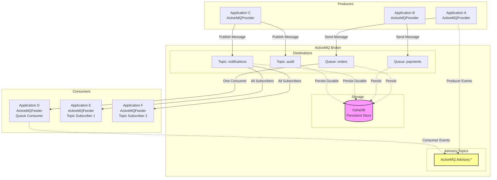
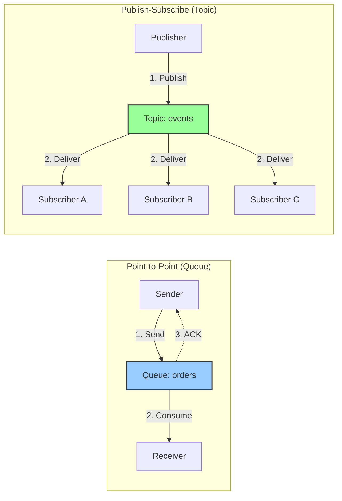

# Apache ActiveMQ Integration

## Overview

**Apache ActiveMQ Classic** is a powerful open-source, JMS 1.1/2.0 compliant message broker that provides enterprise-grade messaging capabilities for distributed applications. As part of the Apache Software Foundation, ActiveMQ has been battle-tested in production environments for over 15 years, offering reliable messaging patterns including point-to-point queues, publish-subscribe topics, request/reply, and message routing.

### What is ActiveMQ?

Apache ActiveMQ is a **message-oriented middleware (MOM)** broker that enables applications to communicate asynchronously via messages. It supports multiple protocols (OpenWire, AMQP, MQTT, STOMP), multiple language clients, and both persistent and non-persistent message delivery modes.

**Key Characteristics**:
- ✅ **JMS Compliance**: Full JMS 1.1 and JMS 2.0 API support
- ✅ **Dual Messaging Models**: Point-to-point (queues) and publish-subscribe (topics)
- ✅ **Message Persistence**: Pluggable storage (KahaDB, JDBC, LevelDB, Memory)
- ✅ **Transactions**: Local and XA distributed transactions
- ✅ **Message Selectors**: SQL-92 based filtering for targeted consumption
- ✅ **Clustering**: Network of Brokers for load balancing and failover
- ✅ **Advisory Messages**: Built-in monitoring via special topics
- ✅ **Virtual Destinations**: Message routing and topic-to-queue fan-out

### ActiveMQ vs ActiveMQ Artemis

| Feature | ActiveMQ Classic | ActiveMQ Artemis |
|---------|------------------|------------------|
| **Maturity** | 15+ years (mature) | Newer architecture (HornetQ-based) |
| **Protocol** | OpenWire (primary), AMQP, STOMP, MQTT | AMQP 1.0 (primary), OpenWire, STOMP, MQTT |
| **Performance** | High (50K-200K msg/s) | Higher (200K-1M+ msg/s) |
| **Storage** | KahaDB (journal-based) | Journal (optimized for speed) |
| **Architecture** | Master-Slave, Network of Brokers | Shared-nothing replication |
| **JMS Version** | 1.1, 2.0 | 2.0 (primary) |
| **Use Cases** | Enterprise integration, legacy systems | High-performance, cloud-native, microservices |
| **Community** | Established, stable | Growing, modern |

**ThunderPropagator.Feeviders.ActiveMQ** targets **ActiveMQ Classic** using the Apache.NMS client library.

## Architecture



### Component Diagram



## Key Features

### 1. JMS Destinations

**Queues (Point-to-Point)**:
- Single consumer receives each message
- Load balancing across multiple consumers
- Messages persist until consumed or expired
- Use case: Task distribution, command processing

**Topics (Publish-Subscribe)**:
- All subscribers receive each message
- Non-durable: Messages lost if subscriber offline
- Durable: Messages queued for offline subscribers
- Use case: Event broadcasting, notifications

### 2. Message Selectors

SQL-92 subset for server-side filtering:
```sql
-- Filter by priority
JMSPriority > 5

-- Filter by custom properties
OrderType = 'Premium' AND Amount > 1000

-- Complex conditions
(Status = 'Pending' OR Status = 'Processing') AND Region IN ('US', 'EU')
```

**Benefits**:
- Reduce network traffic (broker filters)
- Target specific consumers
- Implement routing logic without code changes

### 3. Durable Subscriptions

For topics, ensures message delivery even if subscriber disconnects:
- Requires ClientID (unique per connection) + Durable subscriber name
- Broker queues messages until subscriber reconnects
- Use case: Critical event processing, audit logs

### 4. Message Groups

Guarantees ordered delivery of related messages:
- Set `JMSXGroupID` property (e.g., `CustomerId`)
- All messages with same GroupID route to same consumer
- Use case: Process orders for same customer sequentially

### 5. Transactions

**Local Transactions** (Single broker):
```csharp
session.TransactionMode = Transacted;
// Consume messages, produce responses
session.Commit(); // or session.Rollback();
```

**XA Transactions** (Distributed):
- Coordinate with databases, other message brokers
- Two-phase commit (2PC)
- Use case: Debit account + send payment message atomically

### 6. Request/Reply Pattern

1. Requestor sends message with `JMSReplyTo` (temporary queue) and `JMSCorrelationID`
2. Replier processes message, sends response to `JMSReplyTo` with same `JMSCorrelationID`
3. Requestor correlates response using `JMSCorrelationID`

### 7. Network of Brokers

Cluster multiple ActiveMQ brokers for:
- **Load balancing**: Distribute consumers across brokers
- **Failover**: Automatic reconnection if broker fails
- **Geo-distribution**: Regional brokers forward messages
- **Scalability**: Horizontal scaling of broker infrastructure

Configuration:
```xml
<networkConnectors>
  <networkConnector uri="static:(tcp://broker1:61616,tcp://broker2:61616)"/>
</networkConnectors>
```

### 8. Advisory Messages

Special topics providing broker statistics:
- `ActiveMQ.Advisory.Consumer.Queue.{queueName}`: Consumer added/removed
- `ActiveMQ.Advisory.Producer.Queue.{queueName}`: Producer added/removed
- `ActiveMQ.Advisory.MessageConsumed.Queue.{queueName}`: Message consumption stats
- `ActiveMQ.Advisory.MessageDelivered.Queue.{queueName}`: Message delivery stats

Use case: Health monitoring, dynamic scaling

## Performance Characteristics

| Scenario | Throughput | Latency | Notes |
|----------|------------|---------|-------|
| **Persistent Queue** | 50K-100K msg/s | 1-5 ms | KahaDB disk write overhead |
| **Non-Persistent Queue** | 150K-300K msg/s | <1 ms | In-memory only (lost on restart) |
| **Persistent Topic (Durable)** | 40K-80K msg/s | 2-8 ms | Per-subscriber queue creation |
| **Non-Persistent Topic** | 200K-500K msg/s | <1 ms | Broadcast without disk write |
| **Transactional** | 30K-60K msg/s | 5-15 ms | Commit overhead |
| **Message Selector** | -10% to -30% | +0.5-2 ms | Broker-side filtering cost |

**Factors Influencing Performance**:
- **Persistence**: Persistent messages ~50% slower due to disk I/O
- **Message Size**: Larger messages (>100KB) reduce throughput
- **Acknowledgment Mode**: AUTO vs CLIENT vs TRANSACTED
- **Number of Consumers**: More consumers increase broker CPU
- **Network Latency**: Remote producers/consumers add RTT overhead

## Project Structure

This repository contains three ActiveMQ integration projects:

| Project | Type | Purpose | Lines of Code |
|---------|------|---------|---------------|
| [**ThunderPropagator.Feeders.ActiveMQ**](Feeders.ActiveMQ/README.md) | Consumer | JMS message consumption (queues/topics) | 192 |
| [**ThunderPropagator.Providers.DotNet.ActiveMQ**](Providers.DotNet.ActiveMQ/README.md) | Publisher | JMS message publishing (queues/topics) | 192 |
| [**ThunderPropagator.Feeviders.ActiveMQ.SharedKernel**](Feeviders.ActiveMQ.SharedKernel/README.md) | Shared | Common configuration, connection factory | 127 |
| **Total** | — | — | **511** |

## Quick Start

### Prerequisites

1. **ActiveMQ Broker** (Docker):
```bash
docker run -d --name activemq \
  -p 61616:61616 \
  -p 8161:8161 \
  apache/activemq-classic:latest
```

Access Web Console: http://localhost:8161 (admin/admin)

2. **NuGet Packages**:
```bash
dotnet add package ThunderPropagator.Feeders.ActiveMQ
dotnet add package ThunderPropagator.Providers.DotNet.ActiveMQ
```

### Basic Queue Example

**1. Define Configuration**:
```csharp
public class OrderQueueConfiguration : ActiveMQFeederConfiguration
{
    // Inherited: BrokerUri, Queue, etc.
}

public class OrderMessage : ActiveMQFeederMessage
{
    public string OrderId { get; set; } = default!;
    public decimal Amount { get; set; }
    public string Status { get; set; } = default!;
}
```

**2. Configure Consumer (Feeder)**:
```json
{
  "Messaging": {
    "ActiveMQ": {
      "Consumer": {
        "BrokerUri": "tcp://localhost:61616",
        "Queue": "orders",
        "UserName": "admin",
        "Password": "admin",
        "SerializerType": "Json"
      }
    }
  }
}
```

```csharp
services.AddActiveMQFeeder<OrderChannel, OrderMessage, OrderQueueConfiguration>(
    configuration, "Messaging:ActiveMQ:Consumer");
```

**3. Configure Producer (Provider)**:
```json
{
  "Messaging": {
    "ActiveMQ": {
      "Producer": {
        "BrokerUri": "tcp://localhost:61616",
        "Queue": "orders",
        "DeliveryMode": "Persistent",
        "Priority": 4,
        "SerializerType": "Json"
      }
    }
  }
}
```

```csharp
services.AddActiveMQProvider<OrderProviderMessage, OrderProviderConfiguration>(
    configuration, "Messaging:ActiveMQ:Producer");
```

**4. Publish Messages**:
```csharp
var provider = serviceProvider.GetRequiredService<ActiveMQProvider<OrderProviderMessage, OrderProviderConfiguration>>();

await provider.ExecuteAsync(new OrderProviderMessage
{
    OrderId = "ORD-12345",
    Amount = 599.99m,
    Status = "Pending"
});
```

**5. Consume Messages**:
```csharp
public class OrderFeederHandler : IFeederHandler<OrderChannel, OrderMessage>
{
    public async Task HandleAsync(FeederReceivedMessage<OrderMessage> feederReceivedMessage, 
        CancellationToken cancellationToken = default)
    {
        var order = feederReceivedMessage.Message;
        Console.WriteLine($"Processing order {order.OrderId} - ${order.Amount}");
        
        // Business logic here
        await ProcessOrderAsync(order);
    }
}
```

## ActiveMQ Concepts Deep Dive

### 1. Destinations

**Queue (Point-to-Point)**:
- Physical: Single queue, one consumer receives each message
- Logical: Multiple consumers compete (round-robin by default)
- Acknowledgment: Consumer acks message → removed from queue
- Persistence: Messages survive broker restart (if persistent)

**Topic (Publish-Subscribe)**:
- Physical: No storage (non-durable) or per-subscriber queue (durable)
- Logical: All subscribers receive copy of message
- Acknowledgment: Per-subscriber ack (independent)
- Persistence: Durable subscribers get queued messages when offline

**Temporary Destinations**:
- `ITemporaryQueue`, `ITemporaryTopic`
- Lifetime: Tied to connection (auto-deleted on disconnect)
- Use case: Request/reply pattern (anonymous reply-to destination)

### 2. Acknowledgment Modes

| Mode | Behavior | Use Case |
|------|----------|----------|
| **AUTO_ACKNOWLEDGE** | Session auto-acks after `MessageListener.OnMessage` returns successfully | Default, simplest |
| **CLIENT_ACKNOWLEDGE** | Application calls `message.Acknowledge()` explicitly | Manual control, batch ack |
| **DUPS_OK_ACKNOWLEDGE** | Lazy acks (broker doesn't wait), possible duplicates on failure | High throughput, idempotent consumers |
| **SESSION_TRANSACTED** | Acks via `session.Commit()`, rollback via `session.Rollback()` | Atomic processing (all-or-nothing) |

**CLIENT_ACKNOWLEDGE Example**:
```csharp
session.AcknowledgementMode = AcknowledgementMode.ClientAcknowledge;

consumer.Listener += async message =>
{
    try
    {
        await ProcessMessageAsync(message);
        await message.AcknowledgeAsync(); // Explicit ack
    }
    catch (Exception ex)
    {
        // Message redelivered (not acked)
        Logger.LogError(ex, "Processing failed, message will redeliver");
    }
};
```

### 3. Message Properties

**JMS Standard Headers**:
- `JMSMessageID`: Unique message identifier (auto-generated)
- `JMSTimestamp`: Broker timestamp (milliseconds since epoch)
- `JMSCorrelationID`: Link request/response
- `JMSReplyTo`: Destination for replies (IDestination)
- `JMSType`: Application-defined message type (string)
- `JMSPriority`: 0 (lowest) to 9 (highest), default 4
- `JMSExpiration`: Expiration timestamp (0 = never)
- `JMSDeliveryMode`: PERSISTENT (1) or NON_PERSISTENT (2)
- `JMSRedelivered`: True if message redelivered after failure

**Custom Properties**:
```csharp
message.Properties.SetString("OrderType", "Premium");
message.Properties.SetInt("Quantity", 100);
message.Properties.SetDouble("Price", 19.99);
message.Properties.SetBool("ExpressShipping", true);
```

**JMSX Standard Extensions**:
- `JMSXGroupID`: Message group identifier (for ordering)
- `JMSXGroupSeq`: Sequence number within group
- `JMSXDeliveryCount`: Redelivery attempt count

### 4. Message Selectors (SQL-92 Subset)

**Syntax**:
```sql
-- Comparison operators
JMSPriority > 5
Amount >= 1000
Status = 'Pending'
Region <> 'APAC'

-- Logical operators
(Status = 'Pending' OR Status = 'Processing') AND Priority > 3

-- BETWEEN
Amount BETWEEN 100 AND 500

-- IN
Region IN ('US', 'EU', 'APAC')

-- LIKE (wildcard matching)
OrderId LIKE 'ORD-%'

-- IS NULL / IS NOT NULL
CouponCode IS NOT NULL
```

**Performance Considerations**:
- Selectors evaluated at broker (CPU overhead)
- Complex selectors (~10-30% throughput reduction)
- Index custom properties for better performance (broker config)

### 5. Message Groups

**Purpose**: Ensure related messages processed in order by same consumer

**Setup**:
```csharp
// Producer sets group ID
message.Properties.SetString("JMSXGroupID", customerId);
message.Properties.SetInt("JMSXGroupSeq", sequenceNumber);

// Broker routes all messages with same JMSXGroupID to same consumer
// Consumer processes messages in sequence order
```

**Use Cases**:
- **Order Processing**: All orders for customer processed sequentially
- **Session Management**: All requests for session handled by same server
- **State Machines**: Process events for entity in order

**Group Close**:
```csharp
message.Properties.SetInt("JMSXGroupSeq", -1); // Close group (allow reassignment)
```

### 6. Transactions

**Local Transaction (Single Broker)**:
```csharp
var session = connection.CreateSession(AcknowledgementMode.Transacted);

try
{
    // Consume message
    var message = await consumer.ReceiveAsync();
    
    // Process business logic
    await ProcessMessageAsync(message);
    
    // Produce response
    await producer.SendAsync(responseMessage);
    
    // Commit: Ack consumed message + send produced message
    await session.CommitAsync();
}
catch (Exception ex)
{
    // Rollback: Redeliver consumed message + discard produced message
    await session.RollbackAsync();
    throw;
}
```

**XA Distributed Transaction** (ActiveMQ + Database):
- Use `TransactionScope` (.NET)
- Requires XA-capable database (SQL Server, Oracle, PostgreSQL)
- Two-phase commit (prepare + commit)
- Performance: ~50% slower than local transactions

### 7. Persistent vs Non-Persistent Delivery

| Delivery Mode | Storage | Performance | Reliability | Use Case |
|---------------|---------|-------------|-------------|----------|
| **PERSISTENT** | KahaDB disk | 50K-100K msg/s | Survives restart | Orders, payments, critical data |
| **NON_PERSISTENT** | Memory only | 150K-300K msg/s | Lost on restart | Telemetry, logs, real-time updates |

**Configuration**:
```csharp
// Producer-level default
producer.DeliveryMode = MsgDeliveryMode.Persistent;

// Per-message override
producer.Send(message, MsgDeliveryMode.NonPersistent, MsgPriority.Normal, TimeSpan.Zero);
```

### 8. Failover Transport

**Automatic Reconnection**:
```csharp
BrokerUri = new Uri("failover:(tcp://broker1:61616,tcp://broker2:61616)?randomize=false&maxReconnectAttempts=5&initialReconnectDelay=1000");
```

**Options**:
- `randomize`: Connect to random broker (load balance)
- `maxReconnectAttempts`: Max reconnection attempts (-1 = infinite)
- `initialReconnectDelay`: Initial delay (ms)
- `maxReconnectDelay`: Max delay (ms, exponential backoff)
- `useExponentialBackOff`: Enable exponential backoff
- `backOffMultiplier`: Backoff multiplier (default 2.0)

**Network of Brokers** (Cluster):
```xml
<networkConnectors>
  <networkConnector uri="static:(tcp://broker1:61616,tcp://broker2:61616)"
    dynamicOnly="true"
    duplex="true" />
</networkConnectors>
```

## Best Practices

### 1. Destination Selection

| Requirement | Recommended Destination |
|-------------|-------------------------|
| **One Consumer** | Queue |
| **Multiple Consumers (Load Balance)** | Queue (competing consumers) |
| **All Consumers Get Copy** | Topic (non-durable or durable) |
| **Guarantee Delivery (Offline Consumers)** | Topic (durable subscription) |
| **No Guarantee (Fire-and-Forget)** | Topic (non-durable) |
| **Temporary Reply Destination** | TemporaryQueue |

### 2. Acknowledgment Strategy

- **AUTO_ACKNOWLEDGE**: Default, use unless specific requirements
- **CLIENT_ACKNOWLEDGE**: Batch processing, manual retry logic
- **DUPS_OK_ACKNOWLEDGE**: High throughput, idempotent consumers
- **SESSION_TRANSACTED**: Atomic processing, exactly-once semantics

### 3. Message Selector Optimization

✅ **Do**:
- Use indexed properties (configure broker)
- Simple conditions (`Priority > 5`)
- Filter at broker (reduce network traffic)

❌ **Don't**:
- Complex calculations (`Amount * 0.8 > 100`)
- Regular expressions (use `LIKE` instead)
- Overly complex conditions (split into multiple queues)

### 4. Connection Pooling

```csharp
// Singleton connection factory
services.AddSingleton<IConnectionFactory>(sp =>
{
    var config = sp.GetRequiredService<ActiveMQConfiguration>();
    return new ConnectionFactory(config.BrokerUri);
});

// Scoped connections (for transactions)
services.AddScoped<IConnection>(sp =>
{
    var factory = sp.GetRequiredService<IConnectionFactory>();
    var connection = factory.CreateConnection();
    connection.Start();
    return connection;
});
```

### 5. Transaction Boundaries

- **Keep transactions short**: Hold locks on broker resources
- **Batch related operations**: Consume + process + produce in single transaction
- **Handle rollback**: Ensure idempotency (message may redeliver)
- **Avoid distributed transactions**: Use local transactions when possible (performance)

### 6. Message Priority

- **Default**: Priority 4 (middle)
- **High Priority**: 7-9 (express orders, critical alerts)
- **Low Priority**: 0-3 (bulk processing, background tasks)
- **Configure Broker**: Enable `prioritizedMessages` on destination

```xml
<policyEntry queue="orders">
  <prioritizedMessages useCache="true" />
</policyEntry>
```

### 7. Monitoring

**Advisory Topics**:
```csharp
// Subscribe to consumer events
var advisoryTopic = session.GetTopic("ActiveMQ.Advisory.Consumer.Queue.orders");
var advisoryConsumer = session.CreateConsumer(advisoryTopic);

advisoryConsumer.Listener += message =>
{
    // Parse advisory message (consumer added/removed)
    Console.WriteLine($"Consumer event: {message.NMSType}");
};
```

**JMX Metrics** (via Web Console):
- Queue depth (enqueued, dequeued, inflight)
- Consumer count (active consumers)
- Producer count (active producers)
- Average enqueue/dequeue time

## Troubleshooting

### 1. Messages Not Consumed

**Symptoms**: Messages in queue, consumer connected, no consumption

**Causes**:
- Message selector excludes all messages
- Consumer prefetch buffer full (slow processing)
- Session transaction not committed
- Connection not started (`connection.Start()`)

**Solutions**:
```csharp
// Check selector
Console.WriteLine($"Selector: {consumer.MessageSelector}");

// Reduce prefetch (if slow consumer)
connectionFactory.PrefetchPolicy.QueuePrefetch = 10;

// Ensure connection started
connection.Start();

// Check transaction mode
if (session.Transacted)
{
    await session.CommitAsync(); // Commit after processing
}
```

### 2. Message Redelivery Loop

**Symptoms**: Same message redelivered repeatedly, consumer keeps failing

**Causes**:
- Unhandled exception in consumer
- No acknowledgment (CLIENT_ACKNOWLEDGE mode)
- Transaction always rolls back

**Solutions**:
```csharp
// Configure redelivery policy (broker config)
<redeliveryPolicy>
  <redeliveryPolicy maximumRedeliveries="5" 
                     redeliveryDelay="5000" 
                     useExponentialBackOff="true" 
                     backOffMultiplier="2" />
</redeliveryPolicy>

// Dead Letter Queue (DLQ)
// After max redeliveries, message moved to ActiveMQ.DLQ
```

### 3. Connection Failover Issues

**Symptoms**: Connection fails to reconnect after broker restart

**Causes**:
- Incorrect failover URI
- Max reconnect attempts exceeded
- Network connectivity issues

**Solutions**:
```csharp
// Increase reconnect attempts
BrokerUri = new Uri("failover:(tcp://localhost:61616)?maxReconnectAttempts=-1"); // Infinite

// Add multiple brokers
BrokerUri = new Uri("failover:(tcp://broker1:61616,tcp://broker2:61616)");

// Enable logging
connectionFactory.ConnectionListener += (connection, eventArgs) =>
{
    Console.WriteLine($"Connection event: {eventArgs.EventType}");
};
```

### 4. Slow Consumer (Queue Depth Growing)

**Symptoms**: Queue depth increases, messages not consumed fast enough

**Causes**:
- Consumer processing too slow
- Insufficient consumers (scale horizontally)
- Large message size (serialization overhead)
- Network latency (remote consumers)

**Solutions**:
```csharp
// Scale consumers horizontally (multiple instances)
// Each consumes from same queue (load balancing)

// Reduce prefetch (if processing is slow)
connectionFactory.PrefetchPolicy.QueuePrefetch = 1; // Fetch one at a time

// Use message compression
connectionFactory.UseCompression = true;

// Optimize processing (async/await, parallel tasks)
consumer.Listener += async message =>
{
    await Task.Run(() => ProcessMessageAsync(message));
};
```

### 5. Durable Subscription Not Working

**Symptoms**: Messages not queued for offline subscriber

**Causes**:
- ClientID not set (required for durable subscriptions)
- Durable subscriber name not unique
- Topic subscription unsubscribed (deleted)

**Solutions**:
```csharp
// Set ClientID (unique per connection)
connectionFactory.ClientId = "client-123";

// Create durable subscriber
var consumer = session.CreateDurableConsumer(topic, "my-durable-sub");

// Unsubscribe to delete durable subscription
session.Unsubscribe("my-durable-sub");
```

## Comparison: ActiveMQ vs Other Brokers

| Feature | ActiveMQ Classic | RabbitMQ | Kafka | NATS |
|---------|------------------|----------|-------|------|
| **Messaging Model** | JMS (Queue/Topic) | AMQP (Exchange/Queue) | Log-based | Pub/Sub |
| **Throughput** | 50K-200K msg/s | 50K-100K msg/s | 500K-1M+ msg/s | 1M-10M+ msg/s |
| **Latency** | 1-5 ms | 1-10 ms | 5-50 ms | <1 ms |
| **Persistence** | KahaDB | RabbitMQ store | Kafka log | JetStream |
| **Ordering** | Message groups | Per-queue | Per-partition | Per-subject |
| **Replay** | No | No | Yes (offset) | Yes (JetStream) |
| **Transactions** | Yes (XA) | Yes (local) | No (idempotent) | No |
| **Message Selectors** | Yes (SQL-92) | No | No | No |
| **Durable Subscriptions** | Yes | Yes | Yes (consumer groups) | Yes (JetStream) |
| **Use Case** | Enterprise integration | Microservices | Event streaming | IoT, real-time |

## See Also

- [**Feeders.ActiveMQ**](Feeders.ActiveMQ/README.md) - JMS message consumer implementation
- [**Providers.DotNet.ActiveMQ**](Providers.DotNet.ActiveMQ/README.md) - JMS message publisher implementation
- [**Feeviders.ActiveMQ.SharedKernel**](Feeviders.ActiveMQ.SharedKernel/README.md) - Shared configuration and utilities
- [**SharedKernel Documentation**](../SharedKernel/README.md) - Core abstractions for all feeders/providers
- [**Apache ActiveMQ Official Documentation**](https://activemq.apache.org/components/classic/) - Official broker documentation
- [**Apache.NMS GitHub**](https://github.com/apache/activemq-nms-api) - .NET Messaging API for ActiveMQ

---

**Next Steps**:
1. Choose destination type: [Queue](Feeders.ActiveMQ/README.md#basic-queue-consumption) or [Topic](Feeders.ActiveMQ/README.md#basic-topic-subscription)
2. Configure [Feeder](Feeders.ActiveMQ/README.md) (consumer) and [Provider](Providers.DotNet.ActiveMQ/README.md) (producer)
3. Implement message selectors for [targeted consumption](Feeders.ActiveMQ/README.md#message-selectors-for-filtering)
4. Set up [transactions](Providers.DotNet.ActiveMQ/README.md#transactional-publishing) for atomic operations
5. Monitor via [advisory messages](Feeviders.ActiveMQ.SharedKernel/README.md#advisory-message-monitoring)
