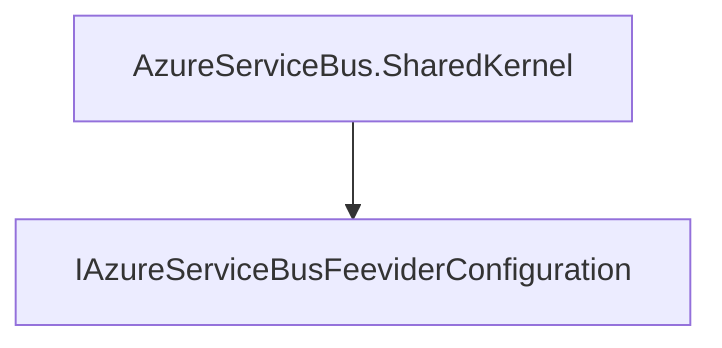

# AzureServiceBus.SharedKernel

## Contents

- [Overview](#overview)
- [Files](#files)
- [Types and Members](#types-and-members)
- [Validation and Constraints](#validation-and-constraints)
- [Package Dependencies](#package-dependencies)
- [Diagrams](#diagrams)
- [Examples](#examples)
- [See Also](#see-also)

## Overview

The **AzureServiceBus.SharedKernel** area groups 1 documented type, including `IAzureServiceBusFeeviderConfiguration`. It provides the contracts and implementation used by this part of ThunderPropagator.Feeviders.

## Files

| File | Primary type(s)/symbol(s) | LOC (approx.) | Responsibility |
|---|---|---:|---|
| `AssemblyInfo.cs` | — | 9 | Contains the assembly info implementation or configuration. |
| `IAzureServiceBusFeeviderConfiguration.cs` | `IAzureServiceBusFeeviderConfiguration` | 7 | Defines IAzureServiceBusFeeviderConfiguration and its related behavior. |
| `ServiceBusClientFactory.cs` | `ServiceBusClientFactory` | 16 | Defines ServiceBusClientFactory and its related behavior. |
| `ServiceBusEntityPath.cs` | `ServiceBusEntityPath` | 17 | Defines ServiceBusEntityPath and its related behavior. |
| `ServiceBusMessagePropagation.cs` | `ServiceBusMessagePropagation` | 36 | Defines ServiceBusMessagePropagation and its related behavior. |
| `ThunderPropagator.Feeviders.AzureServiceBus.SharedKernel.csproj` | — | 16 | Defines project build targets, dependencies, and package metadata. |

## Types and Members

| Type | Kind | Summary | Inherits/Implements | Key Members |
|---|---|---|---|---|
| [`IAzureServiceBusFeeviderConfiguration`](#iazureservicebusfeeviderconfiguration) | interface | Represents the IAzureServiceBusFeeviderConfiguration interface. | — | — |

### IAzureServiceBusFeeviderConfiguration

- **Kind:** interface
- **Namespace:** `ThunderPropagator.Feeviders.AzureServiceBus.SharedKernel`
- **Inherits/implements:** None declared
- **Attributes:** None detected
- **Key members:** Refer to the API surface in the source package
- **Summary:** Represents the IAzureServiceBusFeeviderConfiguration interface.
- **Thread safety:** Follow the lifetime and concurrency guarantees of the owning component; no additional guarantee is inferred.

**Usage recipe**

```csharp
// Resolve IAzureServiceBusFeeviderConfiguration from the configured service container or construct it with its declared dependencies.
```

[↑ Back to top](#contents)

## Validation and Constraints

Inputs are validated at component boundaries. Callers should provide non-null required values and handle domain or argument exceptions without retrying invalid requests unchanged.

## Package Dependencies

| Package | Version | Description | Links |
|---|---|---|---|
| `Apache.NMS` | `2.2.0` | External dependency used by the repository. | [Registry](https://www.nuget.org/packages/Apache.NMS) |
| `Apache.NMS.ActiveMQ` | `2.2.0` | External dependency used by the repository. | [Registry](https://www.nuget.org/packages/Apache.NMS.ActiveMQ) |
| `AWSSDK.SimpleNotificationService` | `4.0.100.5` | External dependency used by the repository. | [Registry](https://www.nuget.org/packages/AWSSDK.SimpleNotificationService) |
| `AWSSDK.SQS` | `4.0.100.5` | External dependency used by the repository. | [Registry](https://www.nuget.org/packages/AWSSDK.SQS) |
| `Azure.Identity` | `1.21.0` | External dependency used by the repository. | [Registry](https://www.nuget.org/packages/Azure.Identity) |
| `Azure.Messaging.ServiceBus` | `7.20.2` | External dependency used by the repository. | [Registry](https://www.nuget.org/packages/Azure.Messaging.ServiceBus) |
| `Confluent.Kafka` | `2.15.0` | External dependency used by the repository. | [Registry](https://www.nuget.org/packages/Confluent.Kafka) |
| `Confluent.SchemaRegistry` | `2.15.0` | External dependency used by the repository. | [Registry](https://www.nuget.org/packages/Confluent.SchemaRegistry) |
| `Confluent.SchemaRegistry.Serdes.Avro` | `2.15.0` | External dependency used by the repository. | [Registry](https://www.nuget.org/packages/Confluent.SchemaRegistry.Serdes.Avro) |
| `Confluent.SchemaRegistry.Serdes.Json` | `2.15.0` | External dependency used by the repository. | [Registry](https://www.nuget.org/packages/Confluent.SchemaRegistry.Serdes.Json) |
| `DotPulsar` | `5.3.1` | External dependency used by the repository. | [Registry](https://www.nuget.org/packages/DotPulsar) |
| `Google.Cloud.PubSub.V1` | `3.36.0` | External dependency used by the repository. | [Registry](https://www.nuget.org/packages/Google.Cloud.PubSub.V1) |
| `Google.Protobuf` | `3.35.1` | External dependency used by the repository. | [Registry](https://www.nuget.org/packages/Google.Protobuf) |
| `Grpc.Net.Client` | `2.80.0` | External dependency used by the repository. | [Registry](https://www.nuget.org/packages/Grpc.Net.Client) |
| `Grpc.Tools` | `2.83.0` | External dependency used by the repository. | [Registry](https://www.nuget.org/packages/Grpc.Tools) |
| `JetBrains.Annotations` | `2026.2.0` | External dependency used by the repository. | [Registry](https://www.nuget.org/packages/JetBrains.Annotations) |
| `Microsoft.AspNetCore.Connections.Abstractions` | `10.*` | External dependency used by the repository. | [Registry](https://www.nuget.org/packages/Microsoft.AspNetCore.Connections.Abstractions) |
| `Microsoft.Extensions.Configuration.Binder` | `10.*` | External dependency used by the repository. | [Registry](https://www.nuget.org/packages/Microsoft.Extensions.Configuration.Binder) |
| `Microsoft.Extensions.Diagnostics.HealthChecks` | `10.*` | External dependency used by the repository. | [Registry](https://www.nuget.org/packages/Microsoft.Extensions.Diagnostics.HealthChecks) |
| `Microsoft.Extensions.Http.Resilience` | `10.*` | External dependency used by the repository. | [Registry](https://www.nuget.org/packages/Microsoft.Extensions.Http.Resilience) |
| `MQTTnet` | `5.2.0.1603` | External dependency used by the repository. | [Registry](https://www.nuget.org/packages/MQTTnet) |
| `NATS.Net` | `3.0.1` | External dependency used by the repository. | [Registry](https://www.nuget.org/packages/NATS.Net) |
| `NetMQ` | `4.0.4.2` | External dependency used by the repository. | [Registry](https://www.nuget.org/packages/NetMQ) |
| `NJsonSchema.Annotations` | `11.6.1` | External dependency used by the repository. | [Registry](https://www.nuget.org/packages/NJsonSchema.Annotations) |
| `OpenTelemetry.Api` | `1.17.0` | External dependency used by the repository. | [Registry](https://www.nuget.org/packages/OpenTelemetry.Api) |
| `RabbitMQ.Client` | `7.2.1` | External dependency used by the repository. | [Registry](https://www.nuget.org/packages/RabbitMQ.Client) |
| `StackExchange.Redis` | `3.0.17` | External dependency used by the repository. | [Registry](https://www.nuget.org/packages/StackExchange.Redis) |

## Diagrams

### Component overview



The diagram shows the direct components documented by the **AzureServiceBus.SharedKernel** area.

## Examples

Start with `IAzureServiceBusFeeviderConfiguration` as the primary entry point for this folder, then follow its linked contracts and collaborators.

## See Also

- [Parent area](../README.md)
- [Feeders.AzureServiceBus](../Feeders.AzureServiceBus/README.md)
- [Providers.DotNet.AzureServiceBus](../Providers.DotNet.AzureServiceBus/README.md)

[↑ Back to top](#contents)
