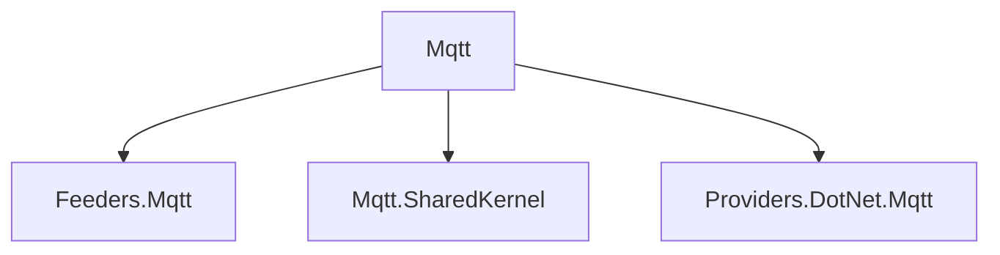

# Mqtt

## Contents

- [Overview](#overview)
- [Files](#files)
- [Package Dependencies](#package-dependencies)
- [Diagrams](#diagrams)
- [Examples](#examples)
- [See Also](#see-also)

## Overview

The **Mqtt** area organizes 3 direct sub-areas. Each child is documented separately so responsibilities and APIs remain easy to navigate.

## Files

*None.*

### Direct child areas

- [Feeders.Mqtt](./Feeders.Mqtt/README.md) `Types:3` `Files:7`
- [Mqtt.SharedKernel](./Mqtt.SharedKernel/README.md) `Types:1` `Files:4`
- [Providers.DotNet.Mqtt](./Providers.DotNet.Mqtt/README.md) `Types:3` `Files:6`

## Package Dependencies

| Package | Version | Description | Links |
|---|---|---|---|
| `Apache.NMS` | `2.2.0` | External dependency used by the repository. | [Registry](https://www.nuget.org/packages/Apache.NMS) |
| `Apache.NMS.ActiveMQ` | `2.2.0` | External dependency used by the repository. | [Registry](https://www.nuget.org/packages/Apache.NMS.ActiveMQ) |
| `AWSSDK.SimpleNotificationService` | `4.0.100.5` | External dependency used by the repository. | [Registry](https://www.nuget.org/packages/AWSSDK.SimpleNotificationService) |
| `AWSSDK.SQS` | `4.0.100.5` | External dependency used by the repository. | [Registry](https://www.nuget.org/packages/AWSSDK.SQS) |
| `Azure.Identity` | `1.21.0` | External dependency used by the repository. | [Registry](https://www.nuget.org/packages/Azure.Identity) |
| `Azure.Messaging.ServiceBus` | `7.20.2` | External dependency used by the repository. | [Registry](https://www.nuget.org/packages/Azure.Messaging.ServiceBus) |
| `Confluent.Kafka` | `2.15.0` | External dependency used by the repository. | [Registry](https://www.nuget.org/packages/Confluent.Kafka) |
| `Confluent.SchemaRegistry` | `2.15.0` | External dependency used by the repository. | [Registry](https://www.nuget.org/packages/Confluent.SchemaRegistry) |
| `Confluent.SchemaRegistry.Serdes.Avro` | `2.15.0` | External dependency used by the repository. | [Registry](https://www.nuget.org/packages/Confluent.SchemaRegistry.Serdes.Avro) |
| `Confluent.SchemaRegistry.Serdes.Json` | `2.15.0` | External dependency used by the repository. | [Registry](https://www.nuget.org/packages/Confluent.SchemaRegistry.Serdes.Json) |
| `DotPulsar` | `5.3.1` | External dependency used by the repository. | [Registry](https://www.nuget.org/packages/DotPulsar) |
| `Google.Cloud.PubSub.V1` | `3.36.0` | External dependency used by the repository. | [Registry](https://www.nuget.org/packages/Google.Cloud.PubSub.V1) |
| `Google.Protobuf` | `3.35.1` | External dependency used by the repository. | [Registry](https://www.nuget.org/packages/Google.Protobuf) |
| `Grpc.Net.Client` | `2.80.0` | External dependency used by the repository. | [Registry](https://www.nuget.org/packages/Grpc.Net.Client) |
| `Grpc.Tools` | `2.83.0` | External dependency used by the repository. | [Registry](https://www.nuget.org/packages/Grpc.Tools) |
| `JetBrains.Annotations` | `2026.2.0` | External dependency used by the repository. | [Registry](https://www.nuget.org/packages/JetBrains.Annotations) |
| `Microsoft.AspNetCore.Connections.Abstractions` | `10.*` | External dependency used by the repository. | [Registry](https://www.nuget.org/packages/Microsoft.AspNetCore.Connections.Abstractions) |
| `Microsoft.Extensions.Configuration.Binder` | `10.*` | External dependency used by the repository. | [Registry](https://www.nuget.org/packages/Microsoft.Extensions.Configuration.Binder) |
| `Microsoft.Extensions.Diagnostics.HealthChecks` | `10.*` | External dependency used by the repository. | [Registry](https://www.nuget.org/packages/Microsoft.Extensions.Diagnostics.HealthChecks) |
| `Microsoft.Extensions.Http.Resilience` | `10.*` | External dependency used by the repository. | [Registry](https://www.nuget.org/packages/Microsoft.Extensions.Http.Resilience) |
| `MQTTnet` | `5.2.0.1603` | External dependency used by the repository. | [Registry](https://www.nuget.org/packages/MQTTnet) |
| `NATS.Net` | `3.0.1` | External dependency used by the repository. | [Registry](https://www.nuget.org/packages/NATS.Net) |
| `NetMQ` | `4.0.4.2` | External dependency used by the repository. | [Registry](https://www.nuget.org/packages/NetMQ) |
| `NJsonSchema.Annotations` | `11.6.1` | External dependency used by the repository. | [Registry](https://www.nuget.org/packages/NJsonSchema.Annotations) |
| `OpenTelemetry.Api` | `1.17.0` | External dependency used by the repository. | [Registry](https://www.nuget.org/packages/OpenTelemetry.Api) |
| `RabbitMQ.Client` | `7.2.1` | External dependency used by the repository. | [Registry](https://www.nuget.org/packages/RabbitMQ.Client) |
| `StackExchange.Redis` | `3.0.17` | External dependency used by the repository. | [Registry](https://www.nuget.org/packages/StackExchange.Redis) |

## Diagrams

### Component overview

The diagram shows the direct components documented by the **Mqtt** area.

## Examples

Choose the child area that matches the required capability; parent documentation intentionally does not duplicate child implementation details.

## See Also

- [Parent area](../README.md)
- [ActiveMQ](../ActiveMQ/README.md)
- [AwsSqs](../AwsSqs/README.md)
- [AzureServiceBus](../AzureServiceBus/README.md)
- [GcpPubSub](../GcpPubSub/README.md)
- [Grpc](../Grpc/README.md)
- [Kafka](../Kafka/README.md)
- [NATS](../NATS/README.md)
- [Pulsar](../Pulsar/README.md)
- [RabbitMQ](../RabbitMQ/README.md)
- [RedisPubSub](../RedisPubSub/README.md)
- [SharedKernel](../SharedKernel/README.md)
- [TcpSocket](../TcpSocket/README.md)
- [UdpClient](../UdpClient/README.md)
- [WebApi](../WebApi/README.md)
- [WebSocket](../WebSocket/README.md)
- [ZeroMQ](../ZeroMQ/README.md)

[↑ Back to top](#contents)
