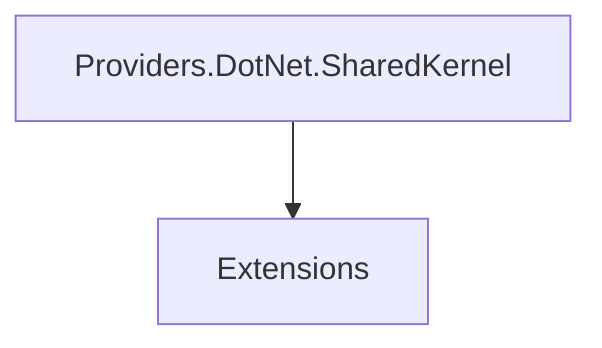

# Providers.DotNet.SharedKernel

## Contents

- [Overview](#overview)
- [Files](#files)
- [Types and Members](#types-and-members)
- [Serialization and Contracts](#serialization-and-contracts)
- [Validation and Constraints](#validation-and-constraints)
- [Package Dependencies](#package-dependencies)
- [Diagrams](#diagrams)
- [Examples](#examples)
- [See Also](#see-also)

## Overview

The **Providers.DotNet.SharedKernel** area groups 7 documented types, including `AbstractProvider`, `IAbstractProviderConfiguration`, `AbstractProviderConfiguration`, `IFormatDeserializer`, `IFeederMessageSerializer`. It provides the contracts and implementation used by this part of ThunderPropagator.Feeviders.

## Files

| File | Primary type(s)/symbol(s) | LOC (approx.) | Responsibility |
|---|---|---:|---|
| `AbstractProvider.cs` | `AbstractProvider` | 36 | Defines AbstractProvider and its related behavior. |
| `AbstractProviderConfiguration.cs` | `IAbstractProviderConfiguration`, `AbstractProviderConfiguration` | 21 | Defines IAbstractProviderConfiguration, AbstractProviderConfiguration and its related behavior. |
| `AssemblyInfo.cs` | — | 3 | Contains the assembly info implementation or configuration. |
| `FeederMessageSerializer.cs` | `FeederMessageSerializer` | 36 | Defines FeederMessageSerializer and its related behavior. |
| `FormatDeserializerInvoker.cs` | `IFormatDeserializer` | 5 | Defines IFormatDeserializer and its related behavior. |
| `IFeederMessageSerializer.cs` | `IFeederMessageSerializer` | 12 | Defines IFeederMessageSerializer and its related behavior. |
| `IProvider.cs` | `IProvider`, `IProvider` | 12 | Defines IProvider, IProvider and its related behavior. |
| `ProviderSerializerValidationHostedService.cs` | `ProviderSerializerValidationHostedService` | 21 | Defines ProviderSerializerValidationHostedService and its related behavior. |
| `ThunderPropagator.Providers.DotNet.SharedKernel.csproj` | — | 11 | Defines project build targets, dependencies, and package metadata. |

### Direct child areas

- [Extensions](./Extensions/README.md) `Types:1` `Files:1`

## Types and Members

| Type | Kind | Summary | Inherits/Implements | Key Members |
|---|---|---|---|---|
| [`AbstractProvider`](#abstractprovider) | class | Represents the AbstractProvider class. | `DisposableObject,` | `Logger`, `ExecuteAsync(…)`, `InternalExecuteAsync(…)`, `InternalExecuteAsync(…)` |
| [`IAbstractProviderConfiguration`](#iabstractproviderconfiguration) | interface | Represents the IAbstractProviderConfiguration interface. | `IServiceConfiguration` | — |
| [`AbstractProviderConfiguration`](#abstractproviderconfiguration) | class | Represents the AbstractProviderConfiguration class. | `ServiceConfiguration,` | — |
| [`IFormatDeserializer`](#iformatdeserializer) | delegate | Represents the IFormatDeserializer delegate. | — | — |
| [`IFeederMessageSerializer`](#ifeedermessageserializer) | interface | Represents the IFeederMessageSerializer interface. | — | — |
| [`IProvider`](#iprovider) | interface | Represents the IProvider interface. | `IDisposable;` | — |
| [`IProvider`](#iprovider) | interface | Represents the IProvider interface. | `IProvider` | — |

### AbstractProvider

- **Kind:** class
- **Namespace:** `ThunderPropagator.Providers.DotNet.SharedKernel`
- **Inherits/implements:** `DisposableObject,`
- **Attributes:** None detected
- **Key members:** `Logger`, `ExecuteAsync(…)`, `InternalExecuteAsync(…)`, `InternalExecuteAsync(…)`
- **Summary:** Represents the AbstractProvider class.
- **Thread safety:** Follow the lifetime and concurrency guarantees of the owning component; no additional guarantee is inferred.

**Usage recipe**

```csharp
// Resolve AbstractProvider from the configured service container or construct it with its declared dependencies.
```

[↑ Back to top](#contents)

### IAbstractProviderConfiguration

- **Kind:** interface
- **Namespace:** `ThunderPropagator.Providers.DotNet.SharedKernel`
- **Inherits/implements:** `IServiceConfiguration`
- **Attributes:** None detected
- **Key members:** Refer to the API surface in the source package
- **Summary:** Represents the IAbstractProviderConfiguration interface.
- **Thread safety:** Follow the lifetime and concurrency guarantees of the owning component; no additional guarantee is inferred.

**Usage recipe**

```csharp
// Resolve IAbstractProviderConfiguration from the configured service container or construct it with its declared dependencies.
```

[↑ Back to top](#contents)

### AbstractProviderConfiguration

- **Kind:** class
- **Namespace:** `ThunderPropagator.Providers.DotNet.SharedKernel`
- **Inherits/implements:** `ServiceConfiguration,`
- **Attributes:** None detected
- **Key members:** Refer to the API surface in the source package
- **Summary:** Represents the AbstractProviderConfiguration class.
- **Thread safety:** Follow the lifetime and concurrency guarantees of the owning component; no additional guarantee is inferred.

**Usage recipe**

```csharp
// Resolve AbstractProviderConfiguration from the configured service container or construct it with its declared dependencies.
```

[↑ Back to top](#contents)

### IFormatDeserializer

- **Kind:** delegate
- **Namespace:** `ThunderPropagator.Providers.DotNet.SharedKernel`
- **Inherits/implements:** None declared
- **Attributes:** None detected
- **Key members:** Refer to the API surface in the source package
- **Summary:** Represents the IFormatDeserializer delegate.
- **Thread safety:** Follow the lifetime and concurrency guarantees of the owning component; no additional guarantee is inferred.

**Usage recipe**

```csharp
// Resolve IFormatDeserializer from the configured service container or construct it with its declared dependencies.
```

[↑ Back to top](#contents)

### IFeederMessageSerializer

- **Kind:** interface
- **Namespace:** `ThunderPropagator.Providers.DotNet.SharedKernel`
- **Inherits/implements:** None declared
- **Attributes:** None detected
- **Key members:** Refer to the API surface in the source package
- **Summary:** Represents the IFeederMessageSerializer interface.
- **Thread safety:** Follow the lifetime and concurrency guarantees of the owning component; no additional guarantee is inferred.

**Usage recipe**

```csharp
// Resolve IFeederMessageSerializer from the configured service container or construct it with its declared dependencies.
```

[↑ Back to top](#contents)

### IProvider

- **Kind:** interface
- **Namespace:** `ThunderPropagator.Providers.DotNet.SharedKernel`
- **Inherits/implements:** `IDisposable;`
- **Attributes:** None detected
- **Key members:** Refer to the API surface in the source package
- **Summary:** Represents the IProvider interface.
- **Thread safety:** Follow the lifetime and concurrency guarantees of the owning component; no additional guarantee is inferred.

**Usage recipe**

```csharp
// Resolve IProvider from the configured service container or construct it with its declared dependencies.
```

[↑ Back to top](#contents)

### IProvider

- **Kind:** interface
- **Namespace:** `ThunderPropagator.Providers.DotNet.SharedKernel`
- **Inherits/implements:** `IProvider`
- **Attributes:** None detected
- **Key members:** Refer to the API surface in the source package
- **Summary:** Represents the IProvider interface.
- **Thread safety:** Follow the lifetime and concurrency guarantees of the owning component; no additional guarantee is inferred.

**Usage recipe**

```csharp
// Resolve IProvider from the configured service container or construct it with its declared dependencies.
```

[↑ Back to top](#contents)

## Serialization and Contracts

Serialization behavior is part of the public wire or persistence contract in this area. Preserve field names, ordering rules, content negotiation, and backward-compatibility expectations when changing these types.

## Validation and Constraints

Inputs are validated at component boundaries. Callers should provide non-null required values and handle domain or argument exceptions without retrying invalid requests unchanged.

## Package Dependencies

| Package | Version | Description | Links |
|---|---|---|---|
| `Apache.NMS` | `2.2.0` | External dependency used by the repository. | [Registry](https://www.nuget.org/packages/Apache.NMS) |
| `Apache.NMS.ActiveMQ` | `2.2.0` | External dependency used by the repository. | [Registry](https://www.nuget.org/packages/Apache.NMS.ActiveMQ) |
| `AWSSDK.SimpleNotificationService` | `4.0.100.5` | External dependency used by the repository. | [Registry](https://www.nuget.org/packages/AWSSDK.SimpleNotificationService) |
| `AWSSDK.SQS` | `4.0.100.5` | External dependency used by the repository. | [Registry](https://www.nuget.org/packages/AWSSDK.SQS) |
| `Azure.Identity` | `1.21.0` | External dependency used by the repository. | [Registry](https://www.nuget.org/packages/Azure.Identity) |
| `Azure.Messaging.ServiceBus` | `7.20.2` | External dependency used by the repository. | [Registry](https://www.nuget.org/packages/Azure.Messaging.ServiceBus) |
| `Confluent.Kafka` | `2.15.0` | External dependency used by the repository. | [Registry](https://www.nuget.org/packages/Confluent.Kafka) |
| `Confluent.SchemaRegistry` | `2.15.0` | External dependency used by the repository. | [Registry](https://www.nuget.org/packages/Confluent.SchemaRegistry) |
| `Confluent.SchemaRegistry.Serdes.Avro` | `2.15.0` | External dependency used by the repository. | [Registry](https://www.nuget.org/packages/Confluent.SchemaRegistry.Serdes.Avro) |
| `Confluent.SchemaRegistry.Serdes.Json` | `2.15.0` | External dependency used by the repository. | [Registry](https://www.nuget.org/packages/Confluent.SchemaRegistry.Serdes.Json) |
| `DotPulsar` | `5.3.1` | External dependency used by the repository. | [Registry](https://www.nuget.org/packages/DotPulsar) |
| `Google.Cloud.PubSub.V1` | `3.36.0` | External dependency used by the repository. | [Registry](https://www.nuget.org/packages/Google.Cloud.PubSub.V1) |
| `Google.Protobuf` | `3.35.1` | External dependency used by the repository. | [Registry](https://www.nuget.org/packages/Google.Protobuf) |
| `Grpc.Net.Client` | `2.80.0` | External dependency used by the repository. | [Registry](https://www.nuget.org/packages/Grpc.Net.Client) |
| `Grpc.Tools` | `2.83.0` | External dependency used by the repository. | [Registry](https://www.nuget.org/packages/Grpc.Tools) |
| `JetBrains.Annotations` | `2026.2.0` | External dependency used by the repository. | [Registry](https://www.nuget.org/packages/JetBrains.Annotations) |
| `Microsoft.AspNetCore.Connections.Abstractions` | `10.*` | External dependency used by the repository. | [Registry](https://www.nuget.org/packages/Microsoft.AspNetCore.Connections.Abstractions) |
| `Microsoft.Extensions.Configuration.Binder` | `10.*` | External dependency used by the repository. | [Registry](https://www.nuget.org/packages/Microsoft.Extensions.Configuration.Binder) |
| `Microsoft.Extensions.Diagnostics.HealthChecks` | `10.*` | External dependency used by the repository. | [Registry](https://www.nuget.org/packages/Microsoft.Extensions.Diagnostics.HealthChecks) |
| `Microsoft.Extensions.Http.Resilience` | `10.*` | External dependency used by the repository. | [Registry](https://www.nuget.org/packages/Microsoft.Extensions.Http.Resilience) |
| `MQTTnet` | `5.2.0.1603` | External dependency used by the repository. | [Registry](https://www.nuget.org/packages/MQTTnet) |
| `NATS.Net` | `3.0.1` | External dependency used by the repository. | [Registry](https://www.nuget.org/packages/NATS.Net) |
| `NetMQ` | `4.0.4.2` | External dependency used by the repository. | [Registry](https://www.nuget.org/packages/NetMQ) |
| `NJsonSchema.Annotations` | `11.6.1` | External dependency used by the repository. | [Registry](https://www.nuget.org/packages/NJsonSchema.Annotations) |
| `OpenTelemetry.Api` | `1.17.0` | External dependency used by the repository. | [Registry](https://www.nuget.org/packages/OpenTelemetry.Api) |
| `RabbitMQ.Client` | `7.2.1` | External dependency used by the repository. | [Registry](https://www.nuget.org/packages/RabbitMQ.Client) |
| `StackExchange.Redis` | `3.0.17` | External dependency used by the repository. | [Registry](https://www.nuget.org/packages/StackExchange.Redis) |

## Diagrams

### Component overview



The diagram shows the direct components documented by the **Providers.DotNet.SharedKernel** area.

## Examples

Start with `AbstractProvider` as the primary entry point for this folder, then follow its linked contracts and collaborators.

## See Also

- [Parent area](../README.md)
- [Feeders.SharedKernel](../Feeders.SharedKernel/README.md)

[↑ Back to top](#contents)
