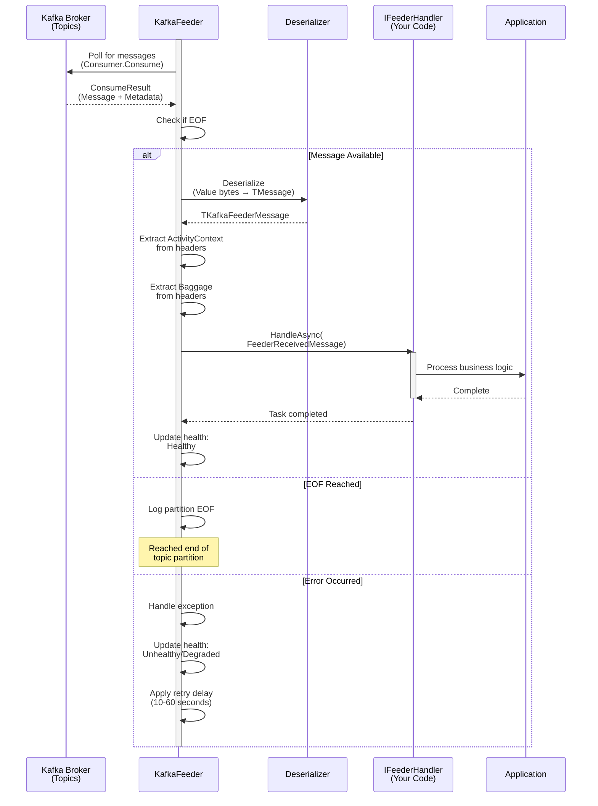

# ThunderPropagator.Feeders.Kafka

> Apache Kafka Message Consumer - Receives and processes inbound messages from Kafka topics

[◂ Back to Kafka](../README.md) | [◂ Back to Documentation](../../README.md)

## Contents

- [Overview](#overview)
- [Architecture](#architecture)
- [Files](#files)
- [Configuration](#configuration)
- [Dependencies](#dependencies)
- [Examples](#examples)
- [See Also](#see-also)

## Overview

**Type**: Message Consumer (Feeder)  
**Target Frameworks**: .NET 8, 9, 10  
**Package**: ThunderPropagator.Feeders.Kafka

The Kafka Feeder is an **IterativeFeeder** implementation that provides high-performance, reliable message consumption from Apache Kafka topics. It follows a pull-based consumption model with comprehensive error handling, health monitoring, and distributed tracing support.

### Key Features

- ✅ **Multi-Topic Subscription**: Subscribe to multiple Kafka topics simultaneously
- ✅ **Consumer Groups**: Reliable parallel processing with configurable consumer groups
- ✅ **Multiple Serialization Formats**: JSON, Newtonsoft.Json, NetJSON, Avro, Schema Registry JSON
- ✅ **Schema Registry Integration**: Full support for Confluent Schema Registry
- ✅ **OpenTelemetry Integration**: Built-in distributed tracing with Activity context and Baggage propagation
- ✅ **Health Monitoring**: Real-time health status reporting with topic-level granularity
- ✅ **Automatic Offset Management**: Configurable commit strategies (auto, manual)
- ✅ **Partition EOF Detection**: Graceful handling of partition end scenarios
- ✅ **Error Recovery**: Intelligent retry logic with exponential backoff

## Architecture



## Files

**Total**: 9 C# source files

| File | LOC | Responsibility |
|------|-----|----------------|
| KafkaFeeder.cs | ~184 | Main feeder implementation - manages message consumption lifecycle, health monitoring, and error handling |
| KafkaFeederConfiguration.cs | ~103 | Configuration class - inherits from Confluent's ConsumerConfig with additional ThunderPropagator settings |
| KafkaFeederMessage.cs | ~6 | Abstract message base class - provides type safety for Kafka messages |
| KafkaFeederExtensions.cs | ~60 | DI registration extensions - AddKafkaFeeder, AddKafkaFeederResolver, UseKafkaFeederResolver |
| AbstractKafkaDeserializer.cs | ~50 | Base deserializer with enrichment script support and OpenTelemetry integration |
| KafkaJsonDeserializer.cs | ~35 | System.Text.Json deserializer implementation |
| KafkaNJsonDeserializer.cs | ~35 | Newtonsoft.Json deserializer implementation |
| KafkaNetJsonDeserializer.cs | ~35 | NetJSON high-performance deserializer implementation |
| AssemblyInfo.cs | ~10 | Assembly metadata and internals visibility |

### Key Implementation Details

#### KafkaFeeder.cs

```csharp
internal sealed class KafkaFeeder<TChannel, TKafkaFeederMessage, TKafkaFeederConfiguration> 
    : IterativeFeeder<TChannel, TKafkaFeederMessage, TKafkaFeederConfiguration>
    where TChannel : class, IChannel
    where TKafkaFeederMessage : KafkaFeederMessage
    where TKafkaFeederConfiguration : KafkaFeederConfiguration
{
    // Confluent Kafka consumer instance
    private readonly IConsumer<string, TKafkaFeederMessage> _consumer;
    
    // Health check name format: feeder_Kafka_{GroupId}_{Topic1}_{Topic2}
    // Health tags include: ["Kafka", "orders", "order-updates"]
    
    // Supports multiple deserializers based on configuration:
    // - KafkaSerializerType.Json → System.Text.Json
    // - KafkaSerializerType.NJson → Newtonsoft.Json  
    // - KafkaSerializerType.NetJson → NetJSON
    // - KafkaSerializerType.SchemaJson → Confluent Schema Registry JSON
    // - KafkaSerializerType.Avro → Confluent Schema Registry Avro
}
```

**Core Methods**:
- `ReceiveAsync()`: Main consumption loop - returns `IAsyncEnumerable<FeederReceivedMessage<T>>`
- `HandleExceptionAsync()`: Error handling with exponential backoff (10-60 seconds)
- `StopAsync()`: Graceful shutdown with consumer close
- `DisposeManagedResources()`: Cleanup of consumer and schema registry

#### KafkaFeederConfiguration.cs

Inherits from Confluent's `ConsumerConfig` and implements `IAbstractFeederConfiguration`:

```csharp
public abstract class KafkaFeederConfiguration : ConsumerConfig, IAbstractFeederConfiguration
{
    public bool IsEnabled { get; set; }  // Feature flag
    public Guid Id { get; set; }  // Unique feeder identifier
    public string[] TopicNames { get; set; }  // Comma-separated topics
    public string? SchemaRegistryUrl { get; set; }  // Optional for Avro/Schema JSON
    public KafkaSerializerType SerializerType { get; set; }  // Serialization format
    public string? EnrichmentScript { get; set; }  // Optional C# script for message enrichment
    public string[]? MetadataReferences { get; set; }  // Assemblies for enrichment script
}
```

All standard Kafka consumer settings are available through base class inheritance.

## Configuration

### Installation

```bash
# Add GitHub Packages source (one-time setup)
dotnet nuget add source https://nuget.pkg.github.com/KiarashMinoo/index.json \
  -n github -u YOUR_USERNAME -p YOUR_GITHUB_TOKEN --store-password-in-clear-text

# Install package
dotnet add package ThunderPropagator.Feeders.Kafka
```

### Registration

```csharp
// Startup.cs or Program.cs
public void ConfigureServices(IServiceCollection services)
{
    // Define your channel
    services.AddSingleton<OrderChannel>();
    
    // Register handler
    services.AddScoped<IFeederHandler<OrderChannel, OrderMessage>, OrderMessageHandler>();
    
    // Register Kafka feeder
    services.AddKafkaFeeder<OrderChannel, OrderMessage, OrderFeederConfiguration>(
        configuration, "Messaging:Kafka:Orders");
}
```

### Configuration (appsettings.json)

```json
{
  "Messaging": {
    "Kafka": {
      "Orders": {
        "IsEnabled": true,
        "BootstrapServers": "localhost:9092",
        "GroupId": "order-processor-group",
        "TopicNames": "orders,order-updates",
        "AutoOffsetReset": "Earliest",
        "EnableAutoCommit": true,
        "AutoCommitIntervalMs": 5000,
        "SessionTimeoutMs": 6000,
        "MaxPollIntervalMs": 300000,
        "SerializerType": "Json",
        "SchemaRegistryUrl": "http://localhost:8081",
        "EnrichmentScript": "message.ProcessedAt = DateTime.UtcNow; return message;"
      }
    }
  }
}
```

## Dependencies

### ThunderPropagator Packages

| Package | Version | Description |
|---------|---------|-------------|
| ThunderPropagator | 1.0.1-beta.5 | Core streaming framework with Channel and Feeder abstractions |
| ThunderPropagator.BuildingBlocks | 1.0.1-beta.4 | Common utilities, serialization helpers, and OpenTelemetry extensions |

**Package References** (from `.csproj`):
```xml
<ItemGroup>
    <PackageReference Include="$(ThunderPropagatorPackageId)"/>
    <PackageReference Include="OpenTelemetry.Api"/>
</ItemGroup>
```

### Confluent Kafka Packages

| Package | Version | Purpose |
|---------|---------|---------|
| Confluent.Kafka | 2.12.0 | Apache Kafka .NET client library |
| Confluent.SchemaRegistry | 2.12.0 | Schema Registry client for schema management |
| Confluent.SchemaRegistry.Serdes.Avro | 2.12.0 | Avro serialization with Schema Registry |
| Confluent.SchemaRegistry.Serdes.Json | 2.12.0 | JSON serialization with Schema Registry |

**Package References** (from `.csproj`):
```xml
<ItemGroup>
    <PackageReference Include="Confluent.Kafka"/>
    <PackageReference Include="Confluent.SchemaRegistry"/>
    <PackageReference Include="Confluent.SchemaRegistry.Serdes.Avro"/>
    <PackageReference Include="Confluent.SchemaRegistry.Serdes.Json"/>
</ItemGroup>
```

### Project References

| Project | Purpose |
|---------|---------|
| ThunderPropagator.Feeders.SharedKernel | Core feeder abstractions and utilities |

All dependencies managed via [Directory.Packages.props](../../../Directory.Packages.props) with central package version control.

## Examples

### Basic Order Processing

```csharp
using ThunderPropagator.Application.Channels;
using ThunderPropagator.Application.Feeders;
using ThunderPropagator.Feeders.Kafka;

// 1. Define your message
public class OrderMessage : KafkaFeederMessage
{
    public string OrderId { get; set; } = default!;
    public string CustomerId { get; set; } = default!;
    public decimal TotalAmount { get; set; }
    public DateTime OrderDate { get; set; }
    public string Status { get; set; } = "Pending";
    public List<OrderItem> Items { get; set; } = new();
}

public class OrderItem
{
    public string ProductId { get; set; } = default!;
    public int Quantity { get; set; }
    public decimal UnitPrice { get; set; }
}

// 2. Define your channel
public class OrderChannel : IChannel
{
    public ChannelMetadata Metadata => new()
    {
        ChannelKey = Guid.Parse("a1b2c3d4-e5f6-4a5b-8c9d-0e1f2a3b4c5d"),
        ChannelName = "OrderProcessing"
    };
}

// 3. Define your configuration
public class OrderFeederConfiguration : KafkaFeederConfiguration
{
    public OrderFeederConfiguration()
    {
        // Connection
        BootstrapServers = "localhost:9092";
        SecurityProtocol = SecurityProtocol.Plaintext;
        
        // Consumer Group
        GroupId = "order-processor-v1";
        AutoOffsetReset = AutoOffsetReset.Earliest;
        EnableAutoCommit = true;
        AutoCommitIntervalMs = 5000;
        
        // Topics
        TopicNames = new[] { "orders", "order-updates", "order-cancellations" };
        
        // Serialization
        SerializerType = KafkaSerializerType.Json;
        
        // Performance tuning
        FetchMinBytes = 1;
        FetchMaxBytes = 52428800;  // 50 MB
        MaxPartitionFetchBytes = 1048576;  // 1 MB
    }
}

// 4. Implement your handler
public class OrderFeederHandler : IFeederHandler<OrderChannel, OrderMessage>
{
    private readonly ILogger<OrderFeederHandler> _logger;
    private readonly IOrderService _orderService;
    private readonly INotificationService _notificationService;

    public OrderFeederHandler(
        ILogger<OrderFeederHandler> logger,
        IOrderService orderService,
        INotificationService notificationService)
    {
        _logger = logger;
        _orderService = orderService;
        _notificationService = notificationService;
    }

    public async Task HandleAsync(
        FeederReceivedMessage<OrderMessage> receivedMessage,
        CancellationToken cancellationToken = default)
    {
        var order = receivedMessage.Message;
        
        // Access Kafka metadata
        var topic = receivedMessage.Metadata?["Topic"]?.ToString();
        var offset = receivedMessage.Metadata?["Offset"]?.ToString();
        
        _logger.LogInformation(
            "Processing order {OrderId} from customer {CustomerId} (Amount: {Amount:C}). " +
            "Topic: {Topic}, Offset: {Offset}",
            order.OrderId, order.CustomerId, order.TotalAmount, topic, offset);
        
        // Distributed tracing context is automatically propagated
        using var activity = Activity.Current;
        activity?.SetTag("order.id", order.OrderId);
        activity?.SetTag("order.amount", order.TotalAmount);
        
        try
        {
            // Validate order
            if (order.Items.Count == 0)
            {
                _logger.LogWarning("Order {OrderId} has no items", order.OrderId);
                return;
            }
            
            // Process based on status
            switch (order.Status.ToLower())
            {
                case "pending":
                    await _orderService.ProcessNewOrderAsync(order, cancellationToken);
                    await _notificationService.SendOrderConfirmationAsync(
                        order.CustomerId, order.OrderId, cancellationToken);
                    break;
                    
                case "updated":
                    await _orderService.UpdateOrderAsync(order, cancellationToken);
                    break;
                    
                case "cancelled":
                    await _orderService.CancelOrderAsync(order.OrderId, cancellationToken);
                    await _notificationService.SendCancellationNoticeAsync(
                        order.CustomerId, order.OrderId, cancellationToken);
                    break;
                    
                default:
                    _logger.LogWarning("Unknown order status: {Status}", order.Status);
                    break;
            }
            
            _logger.LogInformation(
                "Successfully processed order {OrderId}", order.OrderId);
        }
        catch (Exception ex)
        {
            _logger.LogError(ex, 
                "Failed to process order {OrderId}", order.OrderId);
            
            // Re-throw to trigger feeder error handling
            throw;
        }
    }
}

// 5. Register in Startup
public class Startup
{
    public void ConfigureServices(IServiceCollection services)
    {
        // Register channel
        services.AddSingleton<OrderChannel>();
        
        // Register handler
        services.AddScoped<IFeederHandler<OrderChannel, OrderMessage>, OrderFeederHandler>();
        
        // Register Kafka feeder
        services.AddKafkaFeeder<OrderChannel, OrderMessage, OrderFeederConfiguration>(
            Configuration, "Messaging:Kafka:Orders");
        
        // Your other services
        services.AddScoped<IOrderService, OrderService>();
        services.AddScoped<INotificationService, NotificationService>();
    }
}
```

### Avro Schema Registry Example

```csharp
using Avro;
using Avro.Specific;
using Confluent.SchemaRegistry.Serdes;

// 1. Message with Avro schema
public class AvroOrderMessage : KafkaFeederMessage, ISpecificRecord
{
    public string OrderId { get; set; } = default!;
    public double Amount { get; set; }
    public long Timestamp { get; set; }
    
    // Avro schema definition
    public static Schema _SCHEMA = Schema.Parse(@"{
        ""type"": ""record"",
        ""name"": ""AvroOrder"",
        ""namespace"": ""com.thunderpropagator.orders"",
        ""fields"": [
            {""name"": ""orderId"", ""type"": ""string""},
            {""name"": ""amount"", ""type"": ""double""},
            {""name"": ""timestamp"", ""type"": ""long""}
        ]
    }");
    
    public Schema Schema => _SCHEMA;
    
    public object Get(int fieldPos)
    {
        return fieldPos switch
        {
            0 => OrderId,
            1 => Amount,
            2 => Timestamp,
            _ => throw new AvroRuntimeException($"Bad index {fieldPos}")
        };
    }
    
    public void Put(int fieldPos, object fieldValue)
    {
        switch (fieldPos)
        {
            case 0: OrderId = (string)fieldValue; break;
            case 1: Amount = (double)fieldValue; break;
            case 2: Timestamp = (long)fieldValue; break;
            default: throw new AvroRuntimeException($"Bad index {fieldPos}");
        }
    }
}

// 2. Configuration with Schema Registry
public class AvroOrderConfiguration : KafkaFeederConfiguration
{
    public AvroOrderConfiguration()
    {
        BootstrapServers = "localhost:9092";
        GroupId = "avro-order-processor";
        TopicNames = new[] { "orders-avro" };
        
        // Use Avro serialization with Schema Registry
        SerializerType = KafkaSerializerType.Avro;
        SchemaRegistryUrl = "http://localhost:8081";
    }
}

// 3. Register
services.AddKafkaFeeder<OrderChannel, AvroOrderMessage, AvroOrderConfiguration>(
    configuration, "Messaging:Kafka:AvroOrders");
```

### Message Enrichment with C# Scripting

```csharp
public class EnrichedOrderConfiguration : KafkaFeederConfiguration
{
    public EnrichedOrderConfiguration()
    {
        BootstrapServers = "localhost:9092";
        GroupId = "enriched-order-processor";
        TopicNames = new[] { "orders" };
        SerializerType = KafkaSerializerType.Json;
        
        // Enrichment script - executed on each message after deserialization
        EnrichmentScript = @"
            using System;
            using NodaTime;
            
            // Add processing timestamp
            message.ProcessedAt = DateTime.UtcNow;
            
            // Add timezone-aware timestamp
            message.ProcessedAtUtc = SystemClock.Instance.GetCurrentInstant();
            
            // Calculate total with tax
            message.TotalWithTax = message.TotalAmount * 1.08m;
            
            // Set priority based on amount
            message.Priority = message.TotalAmount > 1000 ? ""High"" : ""Normal"";
            
            return message;
        ";
        
        // Assemblies needed for enrichment script
        MetadataReferences = new[] 
        { 
            "NodaTime.dll",
            "System.Runtime.dll"
        };
    }
}
```

### Health Monitoring

```csharp
// Health checks are automatically registered with the following format:
// Name: feeder_Kafka_{GroupId}_{Topic1}_{Topic2}...
// Tags: ["Kafka", "topic1", "topic2", ...]

// Example: feeder_Kafka_order-processor-v1_orders_order-updates_order-cancellations
// Tags: ["Kafka", "orders", "order-updates", "order-cancellations"]

// Configure health check endpoint
public void Configure(IApplicationBuilder app)
{
    app.UseHealthChecks("/health/kafka", new HealthCheckOptions
    {
        Predicate = check => check.Tags.Contains("Kafka"),
        ResponseWriter = async (context, report) =>
        {
            context.Response.ContentType = "application/json";
            
            var result = new
            {
                status = report.Status.ToString(),
                timestamp = DateTime.UtcNow,
                checks = report.Entries.Select(e => new
                {
                    name = e.Key,
                    status = e.Value.Status.ToString(),
                    description = e.Value.Description,
                    duration = e.Value.Duration.TotalMilliseconds,
                    tags = e.Value.Tags,
                    exception = e.Value.Exception?.Message
                })
            };
            
            await context.Response.WriteAsync(
                JsonSerializer.Serialize(result, new JsonSerializerOptions { WriteIndented = true }));
        }
    });
}

// Health statuses:
// - Healthy: Normal operation, messages being processed
// - Degraded: Non-fatal errors (e.g., transient Kafka errors)
// - Unhealthy: Fatal errors (e.g., unknown topic, authentication failure)
```

## See Also

- [Kafka System Overview](../README.md) - Complete Kafka integration guide
- [ThunderPropagator.Providers.DotNet.Kafka](../Providers.DotNet.Kafka/README.md) - Kafka message publisher
- [Feeders.SharedKernel](../../SharedKernel/Feeders.SharedKernel/README.md) - Core feeder abstractions
- [Confluent.Kafka Documentation](https://docs.confluent.io/kafka-clients/dotnet/current/overview.html)
- [Apache Kafka Documentation](https://kafka.apache.org/documentation/)

---

**Project**: ThunderPropagator.Feeders.Kafka  
**Version**: 1.0.1-beta.2  
**Generated**: December 29, 2025
