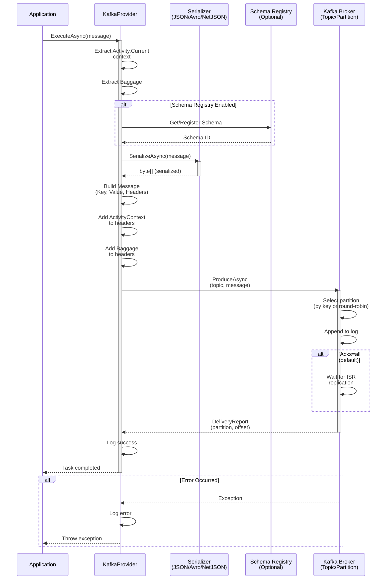

# ThunderPropagator.Providers.DotNet.Kafka

> Apache Kafka Message Publisher - Publishes outbound messages to Kafka topics

[◂ Back to Kafka](../README.md) | [◂ Back to Documentation](../../README.md)

## Contents

- [Overview](#overview)
- [Architecture](#architecture)
- [Files](#files)
- [Configuration](#configuration)
  - [DI Registration](#di-registration)
  - [Configuration File](#configuration-file)
  - [Configuration Properties](#configuration-properties)
- [Dependencies](#dependencies)
- [API Reference](#api-reference)
  - [KafkaProvider](#kafkaprovider)
  - [KafkaProviderMessage](#kafkaprovidermessage)
  - [KafkaProviderConfiguration](#kafkaproviderconfiguration)
  - [KafkaProviderExtensions](#kafkaproviderextensions)
  - [Serializers](#serializers)
- [Examples](#examples)
  - [Basic Publishing](#basic-publishing)
  - [Avro Schema Registry](#avro-schema-registry)
  - [Partitioning Strategies](#partitioning-strategies)
  - [Transactional Publishing](#transactional-publishing)
  - [Error Handling & Retries](#error-handling--retries)
- [Publishing Patterns](#publishing-patterns)
  - [At-Most-Once](#at-most-once)
  - [At-Least-Once](#at-least-once)
  - [Exactly-Once (Transactional)](#exactly-once-transactional)
- [Performance Notes](#performance-notes)
  - [Batching](#batching)
  - [Compression](#compression)
  - [Partition Selection](#partition-selection)
  - [Idempotent Producer](#idempotent-producer)
- [OpenTelemetry Integration](#opentelemetry-integration)
- [See Also](#see-also)

## Overview

**Type**: Message Publisher (Provider)  
**Target Frameworks**: .NET 8, 9, 10  
**Package**: ThunderPropagator.Providers.DotNet.Kafka

The Kafka Provider is an **AbstractProvider** implementation that provides high-performance, reliable message publishing to Apache Kafka topics. It follows a push-based production model with comprehensive serialization support, distributed tracing, and Schema Registry integration.

### Key Features

- ✅ **High-Throughput Publishing**: Optimized for high-volume message production
- ✅ **Multiple Serialization Formats**: JSON, Newtonsoft.Json, NetJSON, Avro, Schema Registry JSON
- ✅ **Schema Registry Integration**: Full support for Confluent Schema Registry
- ✅ **OpenTelemetry Integration**: Built-in distributed tracing with Activity context and Baggage propagation
- ✅ **Flexible Partitioning**: Key-based partitioning with automatic or custom partition selection
- ✅ **Transactional Support**: Exactly-once semantics with transactional producers
- ✅ **Idempotent Production**: Built-in duplicate message prevention
- ✅ **Automatic Retry**: Configurable retry logic with exponential backoff
- ✅ **Error Handling**: Comprehensive error handling with detailed logging
- ✅ **Acknowledgment Control**: Configurable acknowledgment levels (none, leader, all)

## Architecture



### Component Flow

1. **Application** calls `ExecuteAsync(message, cancellationToken)` on the provider
2. **KafkaProvider** extracts tracing context (Activity, Baggage) from current execution
3. **Serializer** converts the message object to bytes using the configured format:
   - **JSON** (System.Text.Json) - Default, high performance
   - **NJson** (Newtonsoft.Json) - Legacy compatibility, flexible
   - **NetJSON** - Ultra-high performance
   - **SchemaJson** - Schema Registry with JSON encoding
   - **Avro** - Binary serialization with Schema Registry
4. **Schema Registry** (optional) validates schema and provides schema IDs
5. **Headers** enriched with distributed tracing metadata (ActivityContext, Baggage)
6. **Kafka Broker** receives message and assigns partition/offset
7. **Acknowledgment** returned based on configured `Acks` setting

## Files

**Total**: 8 C# source files

| File | LOC | Responsibility |
|------|-----|----------------|
| [KafkaProvider.cs](../../../Feeviders/Kafka/ThunderPropagator.Providers.DotNet.Kafka/KafkaProvider.cs) | ~85 | Main provider implementation - manages message production lifecycle, serialization, and OpenTelemetry integration |
| [KafkaProviderConfiguration.cs](../../../Feeviders/Kafka/ThunderPropagator.Providers.DotNet.Kafka/KafkaProviderConfiguration.cs) | ~65 | Configuration class - inherits from Confluent's ProducerConfig with additional ThunderPropagator settings |
| [KafkaProviderMessage.cs](../../../Feeviders/Kafka/ThunderPropagator.Providers.DotNet.Kafka/KafkaProviderMessage.cs) | ~9 | Abstract message base class - provides type safety and key property for Kafka messages |
| [KafkaProviderExtensions.cs](../../../Feeviders/Kafka/ThunderPropagator.Providers.DotNet.Kafka/KafkaProviderExtensions.cs) | ~18 | DI registration extension - AddKafkaProvider method |
| [AbstractKafkaSerializer.cs](../../../Feeviders/Kafka/ThunderPropagator.Providers.DotNet.Kafka/KafkaSerializers/AbstractKafkaSerializer.cs) | ~35 | Base serializer with error handling and null/ignore type support |
| [KafkaJsonSerializer.cs](../../../Feeviders/Kafka/ThunderPropagator.Providers.DotNet.Kafka/KafkaSerializers/KafkaJsonSerializer.cs) | ~20 | System.Text.Json serializer implementation |
| [KafkaNJsonSerializer.cs](../../../Feeviders/Kafka/ThunderPropagator.Providers.DotNet.Kafka/KafkaSerializers/KafkaNJsonSerializer.cs) | ~25 | Newtonsoft.Json serializer implementation with TypeNameHandling |
| [KafkaNetJsonSerializer.cs](../../../Feeviders/Kafka/ThunderPropagator.Providers.DotNet.Kafka/KafkaSerializers/KafkaNetJsonSerializer.cs) | ~25 | NetJSON high-performance serializer with type information |

### Key Implementation Details

#### KafkaProvider.cs

```csharp
internal sealed class KafkaProvider<TKafkaProviderMessage, TKafkaProviderConfiguration> 
    : AbstractProvider<TKafkaProviderMessage, TKafkaProviderConfiguration>
    where TKafkaProviderMessage : KafkaProviderMessage
    where TKafkaProviderConfiguration : KafkaProviderConfiguration
{
    private readonly IProducer<string, TKafkaProviderMessage> _producer;
    private CachedSchemaRegistryClient? _schemaRegistry;

    // Initializes producer with configured serializer
    public KafkaProvider(TKafkaProviderConfiguration config, IServiceProvider serviceProvider)
    {
        _producer = new ProducerBuilder<string, TKafkaProviderMessage>(config)
            .SetKeySerializer(Serializers.Utf8)
            .SetValueSerializer(GetSerializer())
            .SetErrorHandler((_, e) => Logger.LogError("Error: {Reason}", e.Reason))
            .Build();
    }

    // Main publish method with tracing support
    protected override async Task InternalExecuteAsync(
        TKafkaProviderMessage feederMessage, 
        CancellationToken cancellationToken)
    {
        var message = new Message<string, TKafkaProviderMessage>
        {
            Key = feederMessage.KafkaProviderKey,
            Value = feederMessage
        };

        // Add distributed tracing headers
        if (Activity.Current?.Context is not null)
            message.Headers.Add(nameof(ActivityContext), 
                Activity.Current.Context.ToNJsonBytes());

        message.Headers.Add(nameof(Baggage), Baggage.Current.ToNJsonBytes());

        await _producer.ProduceAsync(
            _kafkaProviderConfiguration.TopicName,
            message,
            cancellationToken);
    }
}
```

**Responsibilities:**
- ✅ Producer initialization with serializer selection
- ✅ Message publishing with key-based partitioning
- ✅ ActivityContext and Baggage propagation to headers
- ✅ Schema Registry client management (lazy initialization)
- ✅ Error handling and logging
- ✅ Lifecycle management (IDisposable from base class)

#### Serializer Selection Logic

```csharp
SetValueSerializer(
    config.SerializerType switch
    {
        KafkaSerializerType.Json => new KafkaJsonSerializer<T>(this).AsSyncOverAsync(),
        KafkaSerializerType.NJson => new KafkaNJsonSerializer<T>(this).AsSyncOverAsync(),
        KafkaSerializerType.NetJson => new KafkaNetJsonSerializer<T>(this).AsSyncOverAsync(),
        KafkaSerializerType.SchemaJson => new JsonSerializer<T>(SchemaRegistryClient).AsSyncOverAsync(),
        KafkaSerializerType.Avro => new AvroSerializer<T>(SchemaRegistryClient).AsSyncOverAsync(),
        _ => throw new ArgumentOutOfRangeException()
    })
```

## Configuration

### DI Registration

Register the Kafka provider in your `Program.cs` or `Startup.cs`:

```csharp
using ThunderPropagator.Providers.DotNet.Kafka;

// Register Kafka provider with configuration section binding
services.AddKafkaProvider<MyKafkaMessage, MyKafkaProviderConfiguration>(
    configuration, 
    "Messaging:KafkaProvider");
```

**Type Parameters:**
- `TKafkaProviderMessage` - Your message type extending `KafkaProviderMessage`
- `TKafkaProviderConfiguration` - Your configuration type extending `KafkaProviderConfiguration`

### Configuration File

**appsettings.json** example:

```json
{
  "Messaging": {
    "KafkaProvider": {
      "TopicName": "user-events",
      "BootstrapServers": "localhost:9092",
      "SerializerType": "Json",
      "Acks": "All",
      "EnableIdempotence": true,
      "MaxInFlight": 5,
      "LingerMs": 10,
      "BatchSize": 16384,
      "CompressionType": "Snappy"
    }
  }
}
```

**With Schema Registry (Avro):**

```json
{
  "Messaging": {
    "KafkaProvider": {
      "TopicName": "payment-events",
      "BootstrapServers": "kafka:9092",
      "SerializerType": "Avro",
      "SchemaRegistryUrl": "http://schema-registry:8081",
      "Acks": "All",
      "EnableIdempotence": true,
      "MaxInFlight": 1,
      "TransactionalId": "payment-producer-1"
    }
  }
}
```

**High-Throughput Configuration:**

```json
{
  "Messaging": {
    "KafkaProvider": {
      "TopicName": "high-volume-logs",
      "BootstrapServers": "kafka1:9092,kafka2:9092,kafka3:9092",
      "SerializerType": "NetJson",
      "Acks": "Leader",
      "EnableIdempotence": false,
      "LingerMs": 100,
      "BatchSize": 1048576,
      "CompressionType": "Lz4",
      "RequestTimeoutMs": 30000,
      "RetryBackoffMs": 500
    }
  }
}
```

### Configuration Properties

#### Custom Properties

| Property | Type | Required | Default | Description |
|----------|------|----------|---------|-------------|
| `TopicName` | string | ✅ Yes | - | Target Kafka topic name |
| `SerializerType` | enum | ❌ No | `Json` | Serialization format: `Json`, `NJson`, `NetJson`, `SchemaJson`, `Avro` |
| `SchemaRegistryUrl` | string | ❌ No* | - | Schema Registry endpoint (required for `Avro`/`SchemaJson`) |

*Required when using `Avro` or `SchemaJson` serializers

#### Confluent ProducerConfig Properties (Inherited)

All [Confluent.Kafka ProducerConfig](https://docs.confluent.io/platform/current/clients/dotnet.html) properties are available:

**Core Settings:**

| Property | Type | Default | Description |
|----------|------|---------|-------------|
| `BootstrapServers` | string | ✅ Required | Kafka broker endpoints (comma-separated) |
| `Acks` | enum | `All` | Acknowledgment level: `None`, `Leader`, `All` |
| `EnableIdempotence` | bool | `false` | Enable idempotent producer (prevents duplicates) |
| `TransactionalId` | string | `null` | Unique ID for transactional producer |
| `MaxInFlight` | int | `5` | Max unacknowledged requests (set to `1` for strict ordering) |

**Performance Tuning:**

| Property | Type | Default | Description |
|----------|------|---------|-------------|
| `LingerMs` | int | `0` | Delay before sending batch (trades latency for throughput) |
| `BatchSize` | int | `16384` | Maximum batch size in bytes (16KB default) |
| `CompressionType` | enum | `None` | Compression: `None`, `Gzip`, `Snappy`, `Lz4`, `Zstd` |
| `BufferMemory` | long | `33554432` | Total memory for buffering (32MB) |
| `MaxRequestSize` | int | `1048576` | Maximum request size (1MB) |

**Reliability:**

| Property | Type | Default | Description |
|----------|------|---------|-------------|
| `RequestTimeoutMs` | int | `30000` | Request timeout (30 seconds) |
| `MessageTimeoutMs` | int | `300000` | Message delivery timeout (5 minutes) |
| `RetryBackoffMs` | int | `100` | Backoff between retries |
| `Retries` | int | `2147483647` | Max retry attempts (effectively infinite) |

**Security:**

| Property | Type | Default | Description |
|----------|------|---------|-------------|
| `SecurityProtocol` | enum | `Plaintext` | `Plaintext`, `Ssl`, `SaslPlaintext`, `SaslSsl` |
| `SaslMechanism` | enum | - | SASL mechanism: `Plain`, `ScramSha256`, `ScramSha512`, `Gssapi` |
| `SaslUsername` | string | - | SASL username |
| `SaslPassword` | string | - | SASL password |
| `SslCaLocation` | string | - | CA certificate location |
| `SslCertificateLocation` | string | - | Client certificate location |
| `SslKeyLocation` | string | - | Client key location |

## Dependencies

### NuGet Packages

```xml
<ItemGroup>
  <!-- Confluent Kafka Client -->
  <PackageReference Include="Confluent.Kafka" />
  
  <!-- Schema Registry Support (Avro/JSON Schema) -->
  <PackageReference Include="Confluent.SchemaRegistry" />
  <PackageReference Include="Confluent.SchemaRegistry.Serdes.Avro" />
  <PackageReference Include="Confluent.SchemaRegistry.Serdes.Json" />
</ItemGroup>
```

### Project References

- **ThunderPropagator.Providers.DotNet.SharedKernel** - Base provider abstractions
- **ThunderPropagator.BuildingBlocks** - Serialization helpers, extensions

### Framework Dependencies

- .NET 8, 9, or 10
- Microsoft.Extensions.DependencyInjection
- Microsoft.Extensions.Logging
- OpenTelemetry.Api

## API Reference

### KafkaProvider

**Type**: Internal sealed class (public in DEBUG builds)  
**Namespace**: `ThunderPropagator.Providers.DotNet.Kafka`  
**Inherits**: `AbstractProvider<TKafkaProviderMessage, TKafkaProviderConfiguration>`

```csharp
internal sealed class KafkaProvider<TKafkaProviderMessage, TKafkaProviderConfiguration>
    where TKafkaProviderMessage : KafkaProviderMessage
    where TKafkaProviderConfiguration : KafkaProviderConfiguration
```

#### Constructor

```csharp
public KafkaProvider(
    TKafkaProviderConfiguration kafkaProviderConfiguration,
    IServiceProvider serviceProvider)
```

**Parameters:**
- `kafkaProviderConfiguration` - Kafka-specific configuration
- `serviceProvider` - DI service provider for resolving dependencies

**Behavior:**
- Initializes `IProducer<string, TKafkaProviderMessage>` with configured serializer
- Sets up error handler for production errors
- Configures key serializer (UTF-8) and value serializer based on `SerializerType`

#### Methods

##### InternalExecuteAsync

```csharp
protected override async Task InternalExecuteAsync(
    TKafkaProviderMessage feederMessage,
    CancellationToken cancellationToken = default)
```

**Purpose**: Publishes message to Kafka topic with distributed tracing support

**Process:**
1. Creates `Message<string, T>` with key and value
2. Adds `ActivityContext` to headers (if `Activity.Current` exists)
3. Adds `Baggage` to headers
4. Calls `_producer.ProduceAsync(topic, message, cancellationToken)`
5. Logs errors if production fails

**Throws:**
- `Exception` - Rethrows any production errors after logging

#### Properties

##### SchemaRegistryClient

```csharp
private ISchemaRegistryClient SchemaRegistryClient
```

**Type**: Lazy-initialized `CachedSchemaRegistryClient`  
**Purpose**: Provides Schema Registry access for Avro/SchemaJson serializers  
**Throws**: `InvalidOperationException` if `SchemaRegistryUrl` is not configured

### KafkaProviderMessage

**Type**: Public abstract class  
**Namespace**: `ThunderPropagator.Providers.DotNet.Kafka`  
**Inherits**: `FeederMessage`

```csharp
public abstract class KafkaProviderMessage : FeederMessage
{
    protected KafkaProviderMessage(string key);
    
    public string KafkaProviderKey { get; }
}
```

#### Constructor

```csharp
protected KafkaProviderMessage(string key)
```

**Parameters:**
- `key` - Kafka message key for partitioning

#### Properties

##### KafkaProviderKey

```csharp
public string KafkaProviderKey { get; }
```

**Purpose**: Message key used for:
- Partition selection (messages with same key go to same partition)
- Compaction (in log-compacted topics)
- Ordering guarantees (within partition)

**Example:**
```csharp
public class UserEventMessage : KafkaProviderMessage
{
    public UserEventMessage(string userId, string eventType) 
        : base(userId) // Use userId as key for partitioning
    {
        EventType = eventType;
    }

    public string EventType { get; }
}
```

### KafkaProviderConfiguration

**Type**: Public abstract class  
**Namespace**: `ThunderPropagator.Providers.DotNet.Kafka`  
**Inherits**: `ProducerConfig`, `IAbstractProviderConfiguration`

```csharp
public abstract class KafkaProviderConfiguration : ProducerConfig, IAbstractProviderConfiguration
```

#### Properties

##### TopicName

```csharp
public required string TopicName { get; set; }
```

**Purpose**: Target Kafka topic for message production  
**Required**: Yes

##### SchemaRegistryUrl

```csharp
public string? SchemaRegistryUrl { get; set; }
```

**Purpose**: Schema Registry endpoint URL  
**Required**: Only for `Avro` and `SchemaJson` serializers

##### SerializerType

```csharp
public KafkaSerializerType SerializerType { get; set; }
```

**Type**: `KafkaSerializerType` enum  
**Default**: `KafkaSerializerType.Json`  
**Values:**
- `Json` - System.Text.Json (default)
- `NJson` - Newtonsoft.Json
- `NetJson` - NetJSON (high-performance)
- `SchemaJson` - Schema Registry with JSON encoding
- `Avro` - Binary Avro with Schema Registry

#### Methods

##### ToProducerConfig

```csharp
public ProducerConfig ToProducerConfig()
```

**Returns**: Pure `ProducerConfig` without custom properties  
**Purpose**: Extracts only Confluent-compatible configuration

### KafkaProviderExtensions

**Type**: Public static class  
**Namespace**: `ThunderPropagator.Providers.DotNet.Kafka`

```csharp
public static class KafkaProviderExtensions
```

#### Methods

##### AddKafkaProvider

```csharp
public static IServiceCollection AddKafkaProvider<TKafkaProviderMessage, TKafkaProviderConfiguration>(
    this IServiceCollection services,
    IConfigurationRoot configuration,
    string sectionName)
    where TKafkaProviderMessage : KafkaProviderMessage
    where TKafkaProviderConfiguration : KafkaProviderConfiguration, new()
```

**Purpose**: Registers Kafka provider in DI container

**Parameters:**
- `services` - Service collection
- `configuration` - Application configuration root
- `sectionName` - Configuration section path (e.g., `"Messaging:Kafka"`)

**Returns**: `IServiceCollection` for chaining

**Behavior:**
1. Creates `TKafkaProviderConfiguration` instance
2. Binds configuration section to instance
3. Registers configuration as singleton
4. Registers `KafkaProvider<T, TConfig>` as provider implementation

**Example:**
```csharp
services.AddKafkaProvider<OrderEventMessage, OrderKafkaProviderConfig>(
    configuration,
    "Kafka:OrderEvents");
```

### Serializers

#### AbstractKafkaSerializer&lt;T&gt;

**Type**: Internal abstract class  
**Implements**: `IAsyncSerializer<T>`

```csharp
internal abstract class AbstractKafkaSerializer<T> : IAsyncSerializer<T>
{
    protected abstract Task<byte[]> InternalSerializeAsync(T data);
}
```

**Purpose**: Base serializer with error handling and special type support

**Supported Special Types:**
- `Null` - Returns empty byte array
- `Ignore` - Throws `NotSupportedException`

#### KafkaJsonSerializer&lt;T&gt;

```csharp
internal sealed class KafkaJsonSerializer<T> : AbstractKafkaSerializer<T>
    where T : notnull
```

**Serializer**: System.Text.Json  
**Performance**: High (fastest pure .NET serializer)  
**Features**: Modern, high-performance, minimal allocations

#### KafkaNJsonSerializer&lt;T&gt;

```csharp
internal sealed class KafkaNJsonSerializer<T> : AbstractKafkaSerializer<T>
    where T : notnull
```

**Serializer**: Newtonsoft.Json  
**Performance**: Medium  
**Features**: `TypeNameHandling.Auto` for polymorphism support  
**Use Case**: Legacy compatibility, complex object graphs

#### KafkaNetJsonSerializer&lt;T&gt;

```csharp
internal sealed class KafkaNetJsonSerializer<T> : AbstractKafkaSerializer<T>
    where T : notnull
```

**Serializer**: NetJSON  
**Performance**: Very High (fastest third-party)  
**Features**: `IncludeTypeInformation = true`  
**Use Case**: Ultra-high-throughput scenarios

## Examples

### Basic Publishing

**Scenario:** Simple event publishing with JSON serialization

```csharp
// 1. Define message type
public class OrderCreatedMessage : KafkaProviderMessage
{
    public OrderCreatedMessage(string orderId) : base(orderId)
    {
        OrderId = orderId;
        Timestamp = DateTimeOffset.UtcNow;
    }

    public string OrderId { get; }
    public DateTimeOffset Timestamp { get; }
    public decimal Amount { get; init; }
    public string CustomerId { get; init; } = string.Empty;
}

// 2. Define configuration
public class OrderKafkaProviderConfiguration : KafkaProviderConfiguration
{
}

// 3. Configure in appsettings.json
{
  "Kafka": {
    "OrderEvents": {
      "TopicName": "order-created",
      "BootstrapServers": "localhost:9092",
      "SerializerType": "Json",
      "Acks": "All"
    }
  }
}

// 4. Register in DI
services.AddKafkaProvider<OrderCreatedMessage, OrderKafkaProviderConfiguration>(
    configuration,
    "Kafka:OrderEvents");

// 5. Use in application code
public class OrderService
{
    private readonly IProvider<OrderCreatedMessage> _provider;

    public OrderService(IProvider<OrderCreatedMessage> provider)
    {
        _provider = provider;
    }

    public async Task CreateOrderAsync(Order order)
    {
        // Business logic...
        
        // Publish event
        var message = new OrderCreatedMessage(order.Id)
        {
            Amount = order.TotalAmount,
            CustomerId = order.CustomerId
        };

        await _provider.ExecuteAsync(message);
    }
}
```

### Avro Schema Registry

**Scenario:** Strongly-typed messages with schema evolution support

```csharp
// 1. Define Avro-compatible message
public class PaymentProcessedMessage : KafkaProviderMessage
{
    public PaymentProcessedMessage(string paymentId) : base(paymentId)
    {
        PaymentId = paymentId;
    }

    [Required]
    public string PaymentId { get; }
    
    [Required]
    public decimal Amount { get; init; }
    
    [Required]
    public string Currency { get; init; } = "USD";
    
    public string? TransactionId { get; init; }
    
    [Required]
    public DateTimeOffset ProcessedAt { get; init; }
}

// 2. Configuration with Schema Registry
{
  "Kafka": {
    "Payments": {
      "TopicName": "payment-events",
      "BootstrapServers": "kafka:9092",
      "SerializerType": "Avro",
      "SchemaRegistryUrl": "http://schema-registry:8081",
      "Acks": "All",
      "EnableIdempotence": true,
      "MaxInFlight": 5
    }
  }
}

// 3. Register
services.AddKafkaProvider<PaymentProcessedMessage, PaymentKafkaProviderConfiguration>(
    configuration,
    "Kafka:Payments");

// 4. Usage
public class PaymentProcessor
{
    private readonly IProvider<PaymentProcessedMessage> _provider;

    public async Task ProcessPaymentAsync(Payment payment)
    {
        // Process payment...
        
        var message = new PaymentProcessedMessage(payment.Id)
        {
            Amount = payment.Amount,
            Currency = payment.Currency,
            TransactionId = payment.TransactionId,
            ProcessedAt = DateTimeOffset.UtcNow
        };

        // Automatic schema validation and registration
        await _provider.ExecuteAsync(message);
    }
}
```

**Benefits:**
- ✅ Automatic schema registration
- ✅ Schema evolution compatibility checks
- ✅ Smaller payload size (binary encoding)
- ✅ Strong typing enforcement

### Partitioning Strategies

**Scenario:** Controlling message distribution across partitions

#### User-Based Partitioning

```csharp
// Messages for same user always go to same partition
public class UserActivityMessage : KafkaProviderMessage
{
    public UserActivityMessage(string userId, string activityType) 
        : base(userId) // Key determines partition
    {
        UserId = userId;
        ActivityType = activityType;
        Timestamp = DateTimeOffset.UtcNow;
    }

    public string UserId { get; }
    public string ActivityType { get; }
    public DateTimeOffset Timestamp { get; }
}

// Usage
var message = new UserActivityMessage("user-123", "login");
await _provider.ExecuteAsync(message); // All user-123 messages → same partition
```

#### Round-Robin (Null Key)

```csharp
// Distribute messages evenly across all partitions
public class LogMessage : KafkaProviderMessage
{
    public LogMessage() : base(Guid.NewGuid().ToString()) // Random key
    {
    }

    public string Level { get; init; } = "INFO";
    public string Message { get; init; } = string.Empty;
}
```

#### Tenant-Based Partitioning

```csharp
// Partition by tenant for multi-tenant systems
public class TenantEventMessage : KafkaProviderMessage
{
    public TenantEventMessage(string tenantId, string eventType)
        : base(tenantId) // Ensures tenant isolation
    {
        TenantId = tenantId;
        EventType = eventType;
    }

    public string TenantId { get; }
    public string EventType { get; }
}
```

**Partitioning Best Practices:**
- ✅ Use consistent keys for messages that need ordering
- ✅ Balance partition distribution (avoid hot partitions)
- ✅ Consider cardinality (number of unique keys)
- ✅ Use null keys for maximum parallelism

### Transactional Publishing

**Scenario:** Exactly-once semantics with transactional producer

```csharp
// Configuration for transactional producer
{
  "Kafka": {
    "Transactions": {
      "TopicName": "financial-transactions",
      "BootstrapServers": "kafka:9092",
      "SerializerType": "Avro",
      "SchemaRegistryUrl": "http://schema-registry:8081",
      "TransactionalId": "financial-producer-1",
      "EnableIdempotence": true,
      "MaxInFlight": 1,
      "Acks": "All"
    }
  }
}

// Message type
public class FinancialTransactionMessage : KafkaProviderMessage
{
    public FinancialTransactionMessage(string transactionId) : base(transactionId)
    {
        TransactionId = transactionId;
    }

    public string TransactionId { get; }
    public decimal Amount { get; init; }
    public string FromAccount { get; init; } = string.Empty;
    public string ToAccount { get; init; } = string.Empty;
}

// Service with transactional semantics
public class FinancialService
{
    private readonly IProvider<FinancialTransactionMessage> _provider;
    private readonly IDbConnection _dbConnection;

    public async Task ProcessTransferAsync(Transfer transfer)
    {
        // Database transaction
        using var dbTx = _dbConnection.BeginTransaction();
        
        try
        {
            // Update database
            await UpdateAccountsAsync(transfer, dbTx);
            
            // Publish to Kafka (transactional)
            var message = new FinancialTransactionMessage(transfer.Id)
            {
                Amount = transfer.Amount,
                FromAccount = transfer.FromAccountId,
                ToAccount = transfer.ToAccountId
            };
            
            await _provider.ExecuteAsync(message);
            
            // Commit both transactions
            dbTx.Commit();
        }
        catch
        {
            dbTx.Rollback();
            throw;
        }
    }
}
```

**Key Configuration:**
- `TransactionalId` - Unique producer identifier
- `EnableIdempotence = true` - Prevents duplicates
- `MaxInFlight = 1` - Strict ordering
- `Acks = All` - Full replication acknowledgment

### Error Handling & Retries

**Scenario:** Robust error handling with automatic retries

```csharp
// Configuration with retry settings
{
  "Kafka": {
    "Reliable": {
      "TopicName": "critical-events",
      "BootstrapServers": "kafka1:9092,kafka2:9092,kafka3:9092",
      "SerializerType": "Json",
      "Acks": "All",
      "RequestTimeoutMs": 30000,
      "MessageTimeoutMs": 300000,
      "RetryBackoffMs": 500,
      "Retries": 2147483647,
      "EnableIdempotence": true
    }
  }
}

// Service with comprehensive error handling
public class ResilientPublisher
{
    private readonly IProvider<CriticalEventMessage> _provider;
    private readonly ILogger<ResilientPublisher> _logger;

    public async Task PublishWithRetryAsync(CriticalEventMessage message)
    {
        var attempt = 0;
        var maxAttempts = 3;
        
        while (attempt < maxAttempts)
        {
            try
            {
                attempt++;
                
                using var activity = new Activity("PublishEvent").Start();
                activity.SetTag("attempt", attempt);
                activity.SetTag("eventType", message.EventType);
                
                await _provider.ExecuteAsync(message);
                
                _logger.LogInformation(
                    "Successfully published event {EventId} on attempt {Attempt}",
                    message.EventId,
                    attempt);
                
                return; // Success
            }
            catch (ProduceException<string, CriticalEventMessage> ex) when (ex.Error.IsRetriable())
            {
                _logger.LogWarning(
                    "Retriable error on attempt {Attempt}: {Error}",
                    attempt,
                    ex.Error.Reason);
                
                if (attempt >= maxAttempts)
                {
                    _logger.LogError(
                        ex,
                        "Failed to publish event {EventId} after {Attempts} attempts",
                        message.EventId,
                        maxAttempts);
                    throw;
                }
                
                var delay = TimeSpan.FromMilliseconds(Math.Pow(2, attempt) * 100);
                await Task.Delay(delay);
            }
            catch (Exception ex)
            {
                _logger.LogError(
                    ex,
                    "Non-retriable error publishing event {EventId}",
                    message.EventId);
                throw;
            }
        }
    }
}
```

**Error Types:**
- **Retriable Errors**: Network issues, broker unavailable, timeout
- **Non-Retriable Errors**: Serialization failure, invalid topic, authorization
- **Built-in Retry**: Confluent client handles automatic retries (configured via `Retries`)

## Publishing Patterns

### At-Most-Once

**Guarantee**: Message may be lost, but never duplicated  
**Use Case**: Metrics, logs, non-critical telemetry

```json
{
  "Acks": "None",
  "EnableIdempotence": false,
  "Retries": 0,
  "RequestTimeoutMs": 5000
}
```

**Characteristics:**
- ⚡ Lowest latency
- ⚡ Highest throughput
- ⚠️ No delivery guarantee
- ⚠️ Possible message loss

### At-Least-Once

**Guarantee**: Message will be delivered, may be duplicated  
**Use Case**: Most applications (default)

```json
{
  "Acks": "All",
  "EnableIdempotence": false,
  "Retries": 2147483647,
  "RequestTimeoutMs": 30000
}
```

**Characteristics:**
- ✅ Delivery guarantee
- ⚠️ Possible duplicates
- ⚠️ Consumer must be idempotent
- ⚖️ Balanced latency/throughput

### Exactly-Once (Transactional)

**Guarantee**: Message delivered exactly once  
**Use Case**: Financial transactions, critical data

```json
{
  "TransactionalId": "unique-producer-id",
  "EnableIdempotence": true,
  "Acks": "All",
  "MaxInFlight": 1,
  "Retries": 2147483647
}
```

**Characteristics:**
- ✅ No duplicates
- ✅ Atomic writes
- ⚠️ Highest latency
- ⚠️ Lowest throughput

## Performance Notes

### Batching

**Configuration:**
```json
{
  "LingerMs": 10,
  "BatchSize": 16384,
  "BufferMemory": 33554432
}
```

**LingerMs Tuning:**
- `0` (default) - Send immediately (low latency)
- `5-10ms` - Good balance
- `100ms+` - Maximum throughput, higher latency

**BatchSize Guidelines:**
- Default: `16384` (16KB)
- High throughput: `1048576` (1MB)
- Consider `MaxRequestSize` limit

### Compression

**Comparison:**

| Type | CPU | Compression Ratio | Speed | Use Case |
|------|-----|-------------------|-------|----------|
| **None** | Lowest | 1.0x | Fastest | Low-latency, small messages |
| **Snappy** | Low | 1.5-2x | Fast | General purpose |
| **Lz4** | Low | 1.5-2x | Very Fast | High throughput |
| **Gzip** | High | 2-3x | Slow | Bandwidth-constrained |
| **Zstd** | Medium | 2-3x | Fast | Best balance |

**Configuration:**
```json
{
  "CompressionType": "Lz4"
}
```

**Recommendations:**
- ✅ Enable compression for > 1KB messages
- ✅ Use `Lz4` or `Snappy` for most workloads
- ✅ Use `Zstd` for bandwidth-sensitive deployments
- ⚠️ Avoid `Gzip` unless bandwidth is critical

### Partition Selection

**Key-Based (Default):**
```csharp
new KafkaProviderMessage(userId) // Hash(userId) % partitions
```

**Benefits:**
- ✅ Maintains ordering per key
- ✅ Co-location of related messages
- ⚠️ Potential hot partitions

**Round-Robin (No Key):**
```csharp
new KafkaProviderMessage(Guid.NewGuid().ToString())
```

**Benefits:**
- ✅ Balanced distribution
- ✅ Maximum parallelism
- ⚠️ No ordering guarantees

### Idempotent Producer

**Configuration:**
```json
{
  "EnableIdempotence": true,
  "MaxInFlight": 5
}
```

**Enabled (`true`):**
- ✅ Exactly-once semantics per partition
- ✅ No duplicate messages
- ⚠️ Slight performance overhead
- ⚠️ Requires Kafka 0.11+

**Disabled (`false`):**
- ⚡ Lowest latency
- ⚠️ Possible duplicates on retry
- ⚠️ Requires idempotent consumers

## OpenTelemetry Integration

The Kafka Provider automatically integrates with OpenTelemetry for distributed tracing.

### Automatic Context Propagation

```csharp
// Activity context automatically added to message headers
protected override async Task InternalExecuteAsync(
    TKafkaProviderMessage message,
    CancellationToken cancellationToken)
{
    var kafkaMessage = new Message<string, TKafkaProviderMessage>
    {
        Key = message.KafkaProviderKey,
        Value = message
    };

    // Automatic: Activity context → headers
    if (Activity.Current?.Context is not null)
        kafkaMessage.Headers.Add(
            nameof(ActivityContext),
            Activity.Current.Context.ToNJsonBytes());

    // Automatic: Baggage → headers
    kafkaMessage.Headers.Add(
        nameof(Baggage),
        Baggage.Current.ToNJsonBytes());

    await _producer.ProduceAsync(topic, kafkaMessage, cancellationToken);
}
```

### Tracing Attributes

Messages include standard OpenTelemetry attributes:

| Attribute | Value | Description |
|-----------|-------|-------------|
| `messaging.system` | `kafka` | Messaging system identifier |
| `messaging.destination` | `{topic}` | Target topic name |
| `messaging.kafka.message_key` | `{key}` | Message key |
| `messaging.kafka.partition` | `{partition}` | Assigned partition |
| `messaging.kafka.offset` | `{offset}` | Message offset |

### Example Trace

```
Span: POST /api/orders (HTTP)
  Span: OrderService.CreateOrder (Application)
    Span: KafkaProvider.ExecuteAsync (Producer)
      attributes:
        - messaging.system: kafka
        - messaging.destination: order-created
        - messaging.kafka.message_key: order-123
        - messaging.kafka.partition: 2
        - messaging.kafka.offset: 54321
```

### Consumer Correlation

Kafka Feeders automatically extract context from headers:

```csharp
// In KafkaFeeder
var activityContext = headers.GetActivityContext();
var baggage = headers.GetBaggage();

using var activity = new Activity("ProcessMessage")
    .SetParentId(activityContext.TraceId, activityContext.SpanId)
    .Start();

foreach (var (key, value) in baggage)
    Baggage.SetBaggage(key, value);
```

**End-to-End Trace:**
```
Producer → KafkaProvider → Kafka Broker → KafkaFeeder → Consumer
    |____________ Trace ID: abc123 propagated ____________|
```

## See Also

- **[Kafka Feeder](../Feeders.Kafka/README.md)** - Message consumption from Kafka
- **[Kafka System Overview](../README.md)** - Architecture and patterns
- **[Providers.DotNet.SharedKernel](../../SharedKernel/Providers.DotNet.SharedKernel/README.md)** - Base provider abstractions
- **[Feeders.SharedKernel](../../SharedKernel/Feeders.SharedKernel/README.md)** - Core feeder abstractions
- **[Official Confluent Documentation](https://docs.confluent.io/platform/current/clients/dotnet.html)** - Confluent .NET Client

---

**[⬆ Back to Top](#thunderpropagatorprovidersdotnetkafka)** | **[◂ Documentation Home](../../README.md)**
