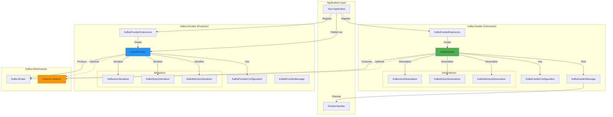

# Apache Kafka Integration

> High-throughput distributed event streaming platform with Schema Registry support

[◂ Back to Documentation](../README.md)

## Contents

- [Overview](#overview)
- [Architecture](#architecture)
- [Projects](#projects)
- [Features](#features)
- [Configuration](#configuration)
- [Examples](#examples)
- [See Also](#see-also)

## Overview

The Kafka integration provides enterprise-grade support for Apache Kafka, the industry-leading distributed event streaming platform. This implementation offers:

- **Multiple Serialization Formats**: JSON, Newtonsoft.Json, NetJSON, Avro, and Schema Registry JSON
- **Schema Registry Integration**: Full support for Confluent Schema Registry with Avro and JSON schemas
- **Consumer Groups**: Reliable message consumption with configurable consumer groups
- **Producer Acknowledgments**: Configurable acknowledgment modes for reliability
- **OpenTelemetry**: Built-in distributed tracing with activity context propagation
- **Health Monitoring**: Real-time health status with topic-level granularity

## Architecture



## Projects

| Project | Type | LOC | Description |
|---------|------|-----|-------------|
| [**Feeders.Kafka**](Feeders.Kafka/README.md) | Consumer | ~600 | Kafka message consumer with multiple deserialization strategies |
| [**Providers.DotNet.Kafka**](Providers.DotNet.Kafka/README.md) | Publisher | ~400 | Kafka message producer with reliability guarantees |

## Features

### Feeder (Consumer) Features

- ✅ **IterativeFeeder Pattern**: Pull-based consumption with async enumerable
- ✅ **Consumer Groups**: Configurable group IDs for parallel processing
- ✅ **Multiple Topics**: Subscribe to multiple topics simultaneously
- ✅ **Auto Offset Management**: Configurable commit strategies
- ✅ **Schema Registry**: Avro and JSON schema support via Confluent Schema Registry
- ✅ **Error Handling**: Graceful degradation with health status reporting
- ✅ **Partition EOF Detection**: Handle end-of-partition scenarios

### Provider (Publisher) Features

- ✅ **AbstractProvider Pattern**: Automatic serialization and delivery
- ✅ **Acknowledgment Modes**: Configurable acks (-1, 0, 1, all)
- ✅ **Partitioning**: Key-based message routing to partitions
- ✅ **Compression**: Built-in support for gzip, snappy, lz4, zstd
- ✅ **Idempotence**: Exactly-once semantics with idempotent producer
- ✅ **Schema Evolution**: Schema Registry integration for managed evolution

## Configuration

### Feeder Configuration

```csharp
public class OrderFeederConfiguration : KafkaFeederConfiguration
{
    public OrderFeederConfiguration()
    {
        // Connection
        BootstrapServers = "localhost:9092";
        
        // Consumer Group
        GroupId = "order-processor-group";
        AutoOffsetReset = AutoOffsetReset.Earliest;
        
        // Topics
        TopicNames = new[] { "orders", "order-updates" };
        
        // Serialization
        SerializerType = KafkaSerializerType.Json;
        
        // Optional: Schema Registry
        SchemaRegistryUrl = "http://localhost:8081";
        
        // Optional: Enrichment (C# scripting)
        EnrichmentScript = @"
            message.ProcessedAt = DateTime.UtcNow;
            return message;
        ";
    }
}
```

### Provider Configuration

```csharp
public class NotificationProviderConfiguration : KafkaProviderConfiguration
{
    public NotificationProviderConfiguration()
    {
        // Connection
        BootstrapServers = "localhost:9092";
        
        // Topic
        TopicName = "notifications";
        
        // Reliability
        Acks = Acks.All;  // Wait for all replicas
        EnableIdempotence = true;
        MaxInFlight = 5;
        
        // Compression
        CompressionType = CompressionType.Lz4;
        
        // Serialization
        SerializerType = KafkaSerializerType.Json;
        
        // Optional: Schema Registry
        SchemaRegistryUrl = "http://localhost:8081";
    }
}
```

## Examples

### Complete Feeder Example

```csharp
// 1. Define your message
public class OrderMessage : KafkaFeederMessage
{
    public string OrderId { get; set; } = default!;
    public string CustomerId { get; set; } = default!;
    public decimal Amount { get; set; }
    public DateTime OrderDate { get; set; }
    public string Status { get; set; } = "Pending";
}

// 2. Define your channel
public class OrderChannel : IChannel
{
    public ChannelMetadata Metadata => new()
    {
        ChannelKey = Guid.Parse("12345678-1234-1234-1234-123456789012"),
        ChannelName = "OrderProcessing"
    };
}

// 3. Implement your handler
public class OrderFeederHandler : IFeederHandler<OrderChannel, OrderMessage>
{
    private readonly ILogger<OrderFeederHandler> _logger;

    public OrderFeederHandler(ILogger<OrderFeederHandler> logger)
    {
        _logger = logger;
    }

    public async Task HandleAsync(
        FeederReceivedMessage<OrderMessage> receivedMessage,
        CancellationToken cancellationToken = default)
    {
        var order = receivedMessage.Message;
        
        _logger.LogInformation(
            "Processing order {OrderId} for customer {CustomerId}, Amount: {Amount}",
            order.OrderId, order.CustomerId, order.Amount);
        
        // Access metadata
        var topic = receivedMessage.Metadata?["Topic"];
        var offset = receivedMessage.Metadata?["Offset"];
        
        _logger.LogDebug("Consumed from topic {Topic} at offset {Offset}", topic, offset);
        
        // Your business logic here
        await ProcessOrderAsync(order, cancellationToken);
    }

    private async Task ProcessOrderAsync(OrderMessage order, CancellationToken ct)
    {
        // Simulate processing
        await Task.Delay(100, ct);
        // Update database, send notifications, etc.
    }
}

// 4. Register in Startup.cs or Program.cs
public void ConfigureServices(IServiceCollection services)
{
    // Register channel
    services.AddSingleton<OrderChannel>();
    
    // Register handler
    services.AddScoped<IFeederHandler<OrderChannel, OrderMessage>, OrderFeederHandler>();
    
    // Register Kafka feeder
    services.AddKafkaFeeder<OrderChannel, OrderMessage, OrderFeederConfiguration>(
        configuration, "Messaging:Kafka:Orders");
}
```

### Complete Provider Example

```csharp
// 1. Define your message
public class NotificationMessage : KafkaProviderMessage
{
    public string UserId { get; set; } = default!;
    public string Type { get; set; } = "Email";
    public string Subject { get; set; } = default!;
    public string Content { get; set; } = default!;
    public DateTime SentAt { get; set; } = DateTime.UtcNow;
    
    // Key for partitioning - messages for same user go to same partition
    public override string KafkaProviderKey => UserId;
}

// 2. Register in Startup
services.AddKafkaProvider<NotificationMessage, NotificationProviderConfiguration>(
    configuration, "Messaging:Kafka:Notifications");

// 3. Use in your service
public class NotificationService
{
    private readonly IProvider<NotificationMessage> _kafkaProvider;
    private readonly ILogger<NotificationService> _logger;

    public NotificationService(
        IProvider<NotificationMessage> kafkaProvider,
        ILogger<NotificationService> logger)
    {
        _kafkaProvider = kafkaProvider;
        _logger = logger;
    }

    public async Task SendNotificationAsync(string userId, string subject, string content)
    {
        var notification = new NotificationMessage
        {
            UserId = userId,
            Subject = subject,
            Content = content,
            Type = "Email"
        };

        try
        {
            await _kafkaProvider.ExecuteAsync(notification);
            
            _logger.LogInformation(
                "Notification sent to Kafka for user {UserId}", userId);
        }
        catch (Exception ex)
        {
            _logger.LogError(ex, 
                "Failed to send notification for user {UserId}", userId);
            throw;
        }
    }
}
```

### Schema Registry with Avro

```csharp
// 1. Configuration with Schema Registry
public class AvroOrderConfiguration : KafkaFeederConfiguration
{
    public AvroOrderConfiguration()
    {
        BootstrapServers = "localhost:9092";
        GroupId = "avro-order-consumer";
        TopicNames = new[] { "orders-avro" };
        SerializerType = KafkaSerializerType.Avro;
        SchemaRegistryUrl = "http://localhost:8081";
    }
}

// 2. Message with Avro attributes
[AvroSchema(@"{
    ""type"": ""record"",
    ""name"": ""AvroOrder"",
    ""fields"": [
        {""name"": ""orderId"", ""type"": ""string""},
        {""name"": ""amount"", ""type"": ""double""},
        {""name"": ""timestamp"", ""type"": ""long""}
    ]
}")]
public class AvroOrderMessage : KafkaFeederMessage
{
    public string OrderId { get; set; } = default!;
    public double Amount { get; set; }
    public long Timestamp { get; set; }
}

// 3. Register with Avro serialization
services.AddKafkaFeeder<OrderChannel, AvroOrderMessage, AvroOrderConfiguration>(
    configuration, "Messaging:Kafka:AvroOrders");
```

### Health Monitoring

```csharp
// Health checks are automatically registered
// Access via health endpoints
public void Configure(IApplicationBuilder app)
{
    app.UseHealthChecks("/health", new HealthCheckOptions
    {
        Predicate = check => check.Tags.Contains("Kafka"),
        ResponseWriter = async (context, report) =>
        {
            context.Response.ContentType = "application/json";
            var result = JsonSerializer.Serialize(new
            {
                status = report.Status.ToString(),
                checks = report.Entries.Select(e => new
                {
                    name = e.Key,
                    status = e.Value.Status.ToString(),
                    description = e.Value.Description,
                    tags = e.Value.Tags
                })
            });
            await context.Response.WriteAsync(result);
        }
    });
}

// Health name format: feeder_Kafka_{GroupId}_{Topics}
// Example: feeder_Kafka_order-processor_orders_order-updates
```

## See Also

- [Feeders.Kafka](Feeders.Kafka/README.md) - Detailed Kafka Feeder documentation
- [Providers.DotNet.Kafka](Providers.DotNet.Kafka/README.md) - Detailed Kafka Provider documentation
- [SharedKernel](../SharedKernel/README.md) - Core abstractions and patterns
- [Confluent.Kafka Documentation](https://docs.confluent.io/kafka-clients/dotnet/current/overview.html)
- [Apache Kafka Documentation](https://kafka.apache.org/documentation/)

---

**Documentation Version**: 1.0.1-beta.2 | **Generated**: December 29, 2025
