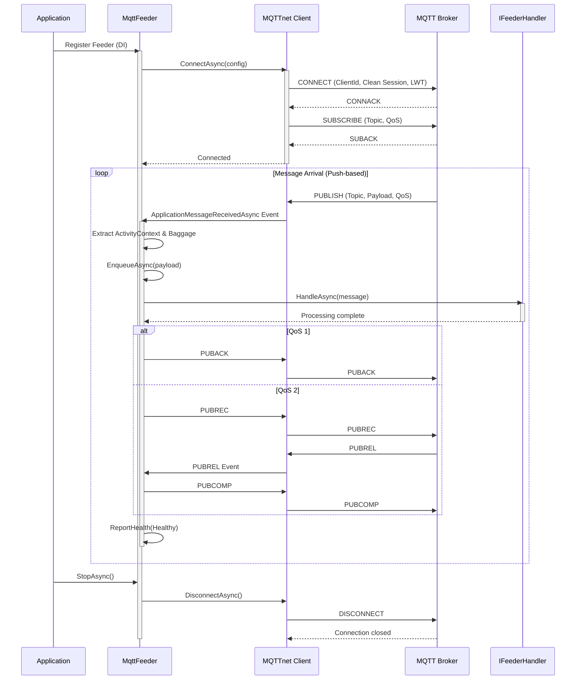

# ThunderPropagator.Feeders.Mqtt

Enterprise-grade MQTT message consumption (subscriber) implementation using the DelegativeFeeder pattern for push-based, event-driven message processing. Built on MQTTnet, this feeder provides reliable, low-latency MQTT topic subscription with support for QoS levels, wildcards, persistent sessions, and Last Will Testament.

## Overview

The MQTT Feeder implements a **push-based consumption model** where the MQTT broker pushes messages to the client via event callbacks. This contrasts with pull-based feeders (Kafka, Pulsar) where the client explicitly fetches messages.

### Architecture



### Key Characteristics

| Feature | Value |
|---------|-------|
| **Base Class** | `DelegativeFeeder<TChannel, TMqttFeederMessage, TMqttFeederConfiguration>` |
| **Consumption Model** | Push-based (event-driven) via `ApplicationMessageReceivedAsync` |
| **Concurrency** | Single-threaded event handling, internal queue for backpressure |
| **Message Ordering** | Preserved per subscription (MQTT guarantees order per topic) |
| **Acknowledgment** | Automatic (QoS 0: none, QoS 1: PUBACK, QoS 2: 4-way handshake) |
| **Health Monitoring** | `feeder_Mqtt_{Topic}` with connection status |
| **OpenTelemetry** | Automatic trace propagation via user properties |

## Files

| File | Lines | Responsibility |
|------|-------|----------------|
| **MqttFeeder.cs** | 137 | Core feeder implementation (connection, subscription, event handling) |
| **MqttFeederConfiguration.cs** | 33 | Feeder-specific configuration (Id, SerializerType, enrichment) |
| **MqttFeederMessage.cs** | 6 | Abstract base class for MQTT messages consumed by feeder |
| **MqttFeederExtensions.cs** | 60 | DI registration extensions (`AddMqttFeeder`) |

**Total**: 4 files, 236 lines of code

## Dependencies

### NuGet Packages

```xml
<PackageReference Include="MQTTnet" Version="4.x" />
<PackageReference Include="ThunderPropagator" Version="1.0.x" />
<PackageReference Include="ThunderPropagator.BuildingBlocks" Version="1.0.x" />
<PackageReference Include="Microsoft.Extensions.DependencyInjection" Version="9.x" />
<PackageReference Include="Microsoft.Extensions.Logging" Version="9.x" />
<PackageReference Include="OpenTelemetry.Api" Version="1.x" />
```

### Project References

- **[ThunderPropagator.Feeviders.Mqtt.SharedKernel](../Feeviders.Mqtt.SharedKernel/README.md)**: Shared configuration (`MqttFeeviderConfiguration`) and utilities
- **[ThunderPropagator.Providers.DotNet.Mqtt](../Providers.DotNet.Mqtt/README.md)**: Complementary publisher implementation

## Configuration

### MqttFeederConfiguration Properties

Extends `MqttFeeviderConfiguration` (40+ connection properties) with feeder-specific settings:

| Property | Type | Default | Description |
|----------|------|---------|-------------|
| **Id** | `Guid` | `Guid.NewGuid()` | Unique feeder instance identifier |
| **SerializerType** | `SerializerType` | `Json` | Deserialization format: `Json`, `NJson`, `NetJson` |
| **EnrichmentScript** | `string?` | `null` | C# script to enrich messages post-deserialization |
| **MetadataReferences** | `string[]?` | `null` | Assembly references for enrichment script compilation |

### Inherited Configuration (from MqttFeeviderConfiguration)

#### Connection Settings

| Property | Type | Required | Description |
|----------|------|----------|-------------|
| **Host** | `string` | ✅ | MQTT broker hostname (e.g., `mqtt.example.com`) |
| **Port** | `int?` | ✅ | Broker port (1883 plain, 8883 TLS, 1884 WebSocket) |
| **ClientId** | `string` | ✅ | Unique client identifier (persistent sessions require consistent ID) |
| **Topic** | `string` | ✅ | Subscription topic (supports wildcards: `+`, `#`) |
| **Username** | `string?` | ❌ | Authentication username |
| **Password** | `string?` | ❌ | Authentication password (required if Username set) |
| **KeepAlivePeriod** | `TimeSpan?` | `15s` | Ping interval to detect broken connections |
| **Timeout** | `TimeSpan?` | `30s` | Connection timeout |

#### Session Management

| Property | Type | Default | Description |
|----------|------|---------|-------------|
| **CleanSession** | `bool?` | `true` | MQTT 3.1.1: `false` = persistent session (queue messages offline) |
| **CleanStart** | `bool?` | `true` | MQTT 5.0 replacement for CleanSession |
| **SessionExpiryInterval** | `uint?` | `0` | MQTT 5.0: Session lifetime in seconds (0 = expire on disconnect) |

#### Quality of Service

| Property | Type | Default | Description |
|----------|------|---------|-------------|
| **QualityOfServiceLevel** | `MqttQualityOfServiceLevel?` | `AtMostOnce` | `AtMostOnce` (QoS 0), `AtLeastOnce` (QoS 1), `ExactlyOnce` (QoS 2) |

#### Advanced Subscription

| Property | Type | Default | Description |
|----------|------|---------|-------------|
| **SubscriptionIdentifier** | `uint?` | `null` | MQTT 5.0: Numeric identifier for subscription tracking |

#### Security (TLS/SSL)

| Property | Type | Default | Description |
|----------|------|---------|-------------|
| **TlsOptions** | `MqttClientTlsOptions?` | `null` | TLS configuration (certificates, protocols, validation) |

#### MQTT 5.0 Features

| Property | Type | Default | Description |
|----------|------|---------|-------------|
| **ReceiveMaximum** | `ushort?` | `65535` | Max concurrent in-flight QoS 1/2 messages |
| **MaximumPacketSize** | `uint?` | `268435455` | Max packet size (bytes) client can handle |
| **TopicAliasMaximum** | `ushort?` | `0` | Max topic aliases (bandwidth optimization) |
| **RequestResponseInformation** | `bool?` | `false` | Request response topic from broker |
| **RequestProblemInformation** | `bool?` | `true` | Request detailed error information |
| **UserProperties** | `Dictionary<string, string>?` | `null` | Custom metadata sent in CONNECT packet |

#### Protocol Options

| Property | Type | Default | Description |
|----------|------|---------|-------------|
| **ProtocolVersion** | `MqttProtocolVersion?` | `V500` | `V310` (3.1.0), `V311` (3.1.1), `V500` (5.0) |
| **WithoutPacketFragmentation** | `bool` | `false` | Disable packet fragmentation for large messages |
| **NoKeepAlive** | `bool` | `false` | Disable keep-alive mechanism |

### Configuration Example (appsettings.json)

```json
{
  "MqttFeeder": {
    "IsEnabled": true,
    "Host": "mqtt.example.com",
    "Port": 1883,
    "ClientId": "sensor-subscriber-001",
    "Topic": "sensors/+/temperature",
    "Username": "mqtt-user",
    "Password": "secure-password",
    
    "QualityOfServiceLevel": 1,
    "CleanSession": false,
    "SessionExpiryInterval": 3600,
    "KeepAlivePeriod": "00:00:30",
    
    "SerializerType": "Json",
    "EnrichmentScript": null,
    
    "ProtocolVersion": 5,
    "ReceiveMaximum": 100,
    "MaximumPacketSize": 1048576
  }
}
```

## API Reference

### MqttFeeder<TChannel, TMqttFeederMessage, TMqttFeederConfiguration>

```csharp
internal sealed class MqttFeeder<TChannel, TMqttFeederMessage, TMqttFeederConfiguration>
    : DelegativeFeeder<TChannel, TMqttFeederMessage, TMqttFeederConfiguration>
    where TChannel : class, IChannel
    where TMqttFeederMessage : MqttFeederMessage
    where TMqttFeederConfiguration : MqttFeederConfiguration
```

**Constructor**:
```csharp
public MqttFeeder(
    TChannel channel,
    TMqttFeederConfiguration mqttFeederConfiguration,
    IFeederHandler<TChannel, TMqttFeederMessage> feederHandler,
    IServiceProvider serviceProvider)
```

**Key Methods**:
- `StartAsync(CancellationToken)`: Connects to broker, subscribes to topics
- `StopAsync(CancellationToken)`: Gracefully disconnects
- `ApplicationMessageReceivedAsync` event handler: Processes incoming messages

**Health Monitoring**:
- `HealthName`: `"feeder_Mqtt_{Topic}"`
- `HealthTags`: `["Mqtt", "{Topic}"]`

### MqttFeederMessage

```csharp
public abstract class MqttFeederMessage : FeederMessage
```

Base class for all MQTT feeder messages. Inherits serialization and metadata capabilities from `FeederMessage`.

### MqttFeederConfiguration

```csharp
public abstract class MqttFeederConfiguration : MqttFeeviderConfiguration, IAbstractFeederConfiguration
```

**Properties**:
- `Guid Id`: Unique feeder identifier
- `SerializerType SerializerType`: Message deserialization format
- `string? EnrichmentScript`: Optional C# enrichment script
- `string[]? MetadataReferences`: Assemblies for script compilation

### Extension Methods

```csharp
public static class MqttFeederExtensions
```

**AddMqttFeeder**:
```csharp
public static IServiceCollection AddMqttFeeder<TChannel, TMqttFeederMessage, TMqttFeederConfiguration>(
    this IServiceCollection services,
    IConfigurationRoot configurationRoot,
    string configurationSectionName)
    where TChannel : class, IChannel
    where TMqttFeederMessage : MqttFeederMessage
    where TMqttFeederConfiguration : MqttFeederConfiguration
```

Registers MQTT feeder in DI container, binding configuration from specified section.

## Examples

### Example 1: Basic Subscription (QoS 0)

Simple fire-and-forget subscription for high-frequency telemetry:

```csharp
// Message model
public class TelemetryMessage : MqttFeederMessage
{
    public string DeviceId { get; set; } = null!;
    public double Value { get; set; }
    public DateTime Timestamp { get; set; }
}

// Configuration
public class TelemetryFeederConfig : MqttFeederConfiguration
{
}

// appsettings.json
{
  "TelemetryMqtt": {
    "Host": "mqtt.iot.local",
    "Port": 1883,
    "ClientId": "telemetry-consumer",
    "Topic": "sensors/telemetry",
    "QualityOfServiceLevel": 0,  // At-most-once (no ack overhead)
    "CleanSession": true,         // No session persistence
    "KeepAlivePeriod": "00:01:00",
    "SerializerType": "Json"
  }
}

// Handler
public class TelemetryChannel : Channel<TelemetryChannel> { }

public class TelemetryHandler : IFeederHandler<TelemetryChannel, TelemetryMessage>
{
    private readonly ILogger<TelemetryHandler> _logger;

    public TelemetryHandler(ILogger<TelemetryHandler> logger)
    {
        _logger = logger;
    }

    public Task HandleAsync(TelemetryMessage message, CancellationToken cancellationToken)
    {
        _logger.LogDebug(
            "Telemetry: {DeviceId} = {Value} at {Timestamp}",
            message.DeviceId, message.Value, message.Timestamp);

        // Process high-frequency data (no need for guaranteed delivery)
        return Task.CompletedTask;
    }
}

// Registration
services.AddMqttFeeder<TelemetryChannel, TelemetryMessage, TelemetryFeederConfig>(
    configuration, "TelemetryMqtt");
```

### Example 2: Topic Wildcards (Multi-Room Sensors)

Subscribe to multiple topics using wildcards:

```csharp
// Message model
public class RoomSensorMessage : MqttFeederMessage
{
    public string Room { get; set; } = null!;
    public string SensorType { get; set; } = null!;
    public double Value { get; set; }
    public string Unit { get; set; } = null!;
}

// Configuration
public class RoomSensorConfig : MqttFeederConfiguration
{
}

// appsettings.json
{
  "RoomSensorMqtt": {
    "Host": "mqtt.smarthome.local",
    "Port": 1883,
    "ClientId": "room-sensor-aggregator",
    "Topic": "home/+/sensors/#",  // Wildcard: all rooms, all sensor types
    "QualityOfServiceLevel": 1,
    "CleanSession": false,
    "SerializerType": "Json"
  }
}

// Handler with topic parsing
public class RoomSensorChannel : Channel<RoomSensorChannel> { }

public class RoomSensorHandler : IFeederHandler<RoomSensorChannel, RoomSensorMessage>
{
    private readonly ILogger<RoomSensorHandler> _logger;

    public RoomSensorHandler(ILogger<RoomSensorHandler> logger)
    {
        _logger = logger;
    }

    public Task HandleAsync(RoomSensorMessage message, CancellationToken cancellationToken)
    {
        // Topic format: home/{room}/sensors/{sensorType}
        // Example: home/livingroom/sensors/temperature
        
        _logger.LogInformation(
            "Sensor reading: {Room} - {SensorType} = {Value} {Unit}",
            message.Room, message.SensorType, message.Value, message.Unit);

        // Aggregate sensor data across all rooms
        return Task.CompletedTask;
    }
}

// Registration
services.AddMqttFeeder<RoomSensorChannel, RoomSensorMessage, RoomSensorConfig>(
    configuration, "RoomSensorMqtt");
```

**Matched Topics**:
- ✅ `home/livingroom/sensors/temperature`
- ✅ `home/bedroom/sensors/humidity`
- ✅ `home/kitchen/sensors/motion`
- ❌ `office/meeting/sensors/temperature` (different namespace)

### Example 3: QoS 1 with Persistent Session

Guaranteed message delivery with offline queuing:

```csharp
// Message model
public class CommandMessage : MqttFeederMessage
{
    public string CommandId { get; set; } = null!;
    public string DeviceId { get; set; } = null!;
    public string Action { get; set; } = null!;
    public Dictionary<string, object>? Parameters { get; set; }
}

// Configuration
public class CommandFeederConfig : MqttFeederConfiguration
{
}

// appsettings.json
{
  "CommandMqtt": {
    "Host": "mqtt.iot.local",
    "Port": 1883,
    "ClientId": "command-processor-001",  // Consistent ClientId for session persistence
    "Topic": "devices/+/commands",
    "QualityOfServiceLevel": 1,            // At-least-once (PUBACK)
    "CleanSession": false,                 // Persistent session
    "SessionExpiryInterval": 86400,        // 24 hours (MQTT 5.0)
    "KeepAlivePeriod": "00:00:30",
    "SerializerType": "Json",
    "ProtocolVersion": 5
  }
}

// Handler with idempotency
public class CommandChannel : Channel<CommandChannel> { }

public class CommandHandler : IFeederHandler<CommandChannel, CommandMessage>
{
    private readonly ILogger<CommandHandler> _logger;
    private readonly HashSet<string> _processedCommands = new();

    public CommandHandler(ILogger<CommandHandler> logger)
    {
        _logger = logger;
    }

    public async Task HandleAsync(CommandMessage message, CancellationToken cancellationToken)
    {
        // QoS 1 can deliver duplicates - implement idempotency
        if (_processedCommands.Contains(message.CommandId))
        {
            _logger.LogWarning("Duplicate command ignored: {CommandId}", message.CommandId);
            return;
        }

        _logger.LogInformation(
            "Processing command: {CommandId} - {Action} on {DeviceId}",
            message.CommandId, message.Action, message.DeviceId);

        // Execute command
        await ExecuteDeviceCommandAsync(message, cancellationToken);

        _processedCommands.Add(message.CommandId);
    }

    private Task ExecuteDeviceCommandAsync(CommandMessage command, CancellationToken cancellationToken)
    {
        // Command execution logic
        return Task.CompletedTask;
    }
}

// Registration
services.AddMqttFeeder<CommandChannel, CommandMessage, CommandFeederConfig>(
    configuration, "CommandMqtt");
```

**Behavior**:
- Messages queued while client offline (network drop, app restart)
- Redelivered on reconnect (at-least-once guarantee)
- Idempotency handling prevents duplicate processing

### Example 4: QoS 2 (Exactly-Once) for Critical Messages

4-way handshake for billing/financial transactions:

```csharp
// Message model
public class TransactionMessage : MqttFeederMessage
{
    public string TransactionId { get; set; } = null!;
    public string AccountId { get; set; } = null!;
    public decimal Amount { get; set; }
    public string Currency { get; set; } = "USD";
    public DateTime Timestamp { get; set; }
}

// Configuration
public class TransactionFeederConfig : MqttFeederConfiguration
{
}

// appsettings.json
{
  "TransactionMqtt": {
    "Host": "mqtt.finance.local",
    "Port": 8883,  // TLS port
    "ClientId": "transaction-processor",
    "Topic": "billing/transactions",
    "QualityOfServiceLevel": 2,  // Exactly-once (4-way handshake)
    "CleanSession": false,
    "SessionExpiryInterval": 3600,
    "SerializerType": "Json",
    "TlsOptions": {
      "UseTls": true,
      "SslProtocol": "Tls12"
    }
  }
}

// Handler (no idempotency needed - exactly-once guaranteed)
public class TransactionChannel : Channel<TransactionChannel> { }

public class TransactionHandler : IFeederHandler<TransactionChannel, TransactionMessage>
{
    private readonly ILogger<TransactionHandler> _logger;
    private readonly ITransactionService _transactionService;

    public TransactionHandler(
        ILogger<TransactionHandler> logger,
        ITransactionService transactionService)
    {
        _logger = logger;
        _transactionService = transactionService;
    }

    public async Task HandleAsync(TransactionMessage message, CancellationToken cancellationToken)
    {
        _logger.LogInformation(
            "Processing transaction: {TransactionId} - {Amount} {Currency} for {AccountId}",
            message.TransactionId, message.Amount, message.Currency, message.AccountId);

        // Direct processing - exactly-once guaranteed by MQTT QoS 2
        await _transactionService.ProcessTransactionAsync(
            message.TransactionId,
            message.AccountId,
            message.Amount,
            message.Currency,
            cancellationToken);

        _logger.LogInformation("Transaction completed: {TransactionId}", message.TransactionId);
    }
}

// Registration
services.AddMqttFeeder<TransactionChannel, TransactionMessage, TransactionFeederConfig>(
    configuration, "TransactionMqtt");
```

**QoS 2 Flow**:
1. Broker → Client: PUBLISH
2. Client → Broker: PUBREC (received)
3. Broker → Client: PUBREL (release)
4. Client → Broker: PUBCOMP (complete)

No duplicates, no message loss.

### Example 5: Last Will Testament (Device Monitoring)

Automatic offline notification when client disconnects:

```csharp
// Message model
public class DeviceStatusMessage : MqttFeederMessage
{
    public string DeviceId { get; set; } = null!;
    public string Status { get; set; } = null!;  // "online", "offline"
    public DateTime Timestamp { get; set; }
}

// Configuration (LWT configured in SharedKernel)
public class DeviceStatusConfig : MqttFeederConfiguration
{
}

// appsettings.json
{
  "DeviceStatusMqtt": {
    "Host": "mqtt.iot.local",
    "Port": 1883,
    "ClientId": "device-monitor",
    "Topic": "devices/+/status",
    "QualityOfServiceLevel": 1,
    "CleanSession": false,
    "SerializerType": "Json",
    
    // Last Will Testament (published by broker on ungraceful disconnect)
    "Payload": "{\"DeviceId\":\"device-monitor\",\"Status\":\"offline\",\"Timestamp\":\"2025-01-01T00:00:00Z\"}",
    "QualityOfServiceLevel": 1,
    "Retain": true,  // Retain LWT for immediate visibility
    "DelayInterval": 5  // MQTT 5.0: Wait 5 seconds before publishing LWT
  }
}

// Handler
public class DeviceStatusChannel : Channel<DeviceStatusChannel> { }

public class DeviceStatusHandler : IFeederHandler<DeviceStatusChannel, DeviceStatusMessage>
{
    private readonly ILogger<DeviceStatusHandler> _logger;
    private readonly IDeviceMonitoringService _monitoringService;

    public DeviceStatusHandler(
        ILogger<DeviceStatusHandler> logger,
        IDeviceMonitoringService monitoringService)
    {
        _logger = logger;
        _monitoringService = monitoringService;
    }

    public async Task HandleAsync(DeviceStatusMessage message, CancellationToken cancellationToken)
    {
        _logger.LogInformation(
            "Device status: {DeviceId} = {Status} at {Timestamp}",
            message.DeviceId, message.Status, message.Timestamp);

        if (message.Status == "offline")
        {
            _logger.LogWarning("Device offline detected: {DeviceId}", message.DeviceId);
            await _monitoringService.RaiseOfflineAlertAsync(message.DeviceId, cancellationToken);
        }
        else
        {
            await _monitoringService.UpdateDeviceStatusAsync(
                message.DeviceId, message.Status, cancellationToken);
        }
    }
}

// Registration
services.AddMqttFeeder<DeviceStatusChannel, DeviceStatusMessage, DeviceStatusConfig>(
    configuration, "DeviceStatusMqtt");
```

**LWT Behavior**:
- Normal disconnect (graceful): LWT not published
- Crash/network failure: Broker publishes LWT after `DelayInterval`
- Retained LWT: New subscribers see latest device status

### Example 6: Message Enrichment Script

Post-deserialization transformation using C# script:

```csharp
// Message model
public class SensorMessage : MqttFeederMessage
{
    public string SensorId { get; set; } = null!;
    public double RawValue { get; set; }
    
    // Enrichment properties (populated by script)
    public double CalibratedValue { get; set; }
    public string Location { get; set; } = null!;
    public string AlertLevel { get; set; } = "normal";
}

// Configuration
public class SensorFeederConfig : MqttFeederConfiguration
{
}

// appsettings.json
{
  "SensorMqtt": {
    "Host": "mqtt.sensors.local",
    "Port": 1883,
    "ClientId": "sensor-consumer",
    "Topic": "sensors/+/readings",
    "QualityOfServiceLevel": 1,
    "SerializerType": "Json",
    
    "EnrichmentScript": "message.CalibratedValue = message.RawValue * 1.05; message.Location = GetSensorLocation(message.SensorId); if (message.CalibratedValue > 100) { message.AlertLevel = \"critical\"; } else if (message.CalibratedValue > 75) { message.AlertLevel = \"warning\"; }",
    "MetadataReferences": [
      "System.Runtime",
      "MyApp.SensorMapping"
    ]
  }
}

// Handler
public class SensorChannel : Channel<SensorChannel> { }

public class SensorHandler : IFeederHandler<SensorChannel, SensorMessage>
{
    private readonly ILogger<SensorHandler> _logger;

    public SensorHandler(ILogger<SensorHandler> logger)
    {
        _logger = logger;
    }

    public Task HandleAsync(SensorMessage message, CancellationToken cancellationToken)
    {
        // Message already enriched by script
        _logger.LogInformation(
            "Sensor {SensorId} ({Location}): Raw={RawValue}, Calibrated={CalibratedValue}, Alert={AlertLevel}",
            message.SensorId, message.Location, message.RawValue, 
            message.CalibratedValue, message.AlertLevel);

        if (message.AlertLevel != "normal")
        {
            _logger.LogWarning("Alert: {AlertLevel} for sensor {SensorId}", 
                message.AlertLevel, message.SensorId);
        }

        return Task.CompletedTask;
    }
}

// Registration
services.AddMqttFeeder<SensorChannel, SensorMessage, SensorFeederConfig>(
    configuration, "SensorMqtt");
```

## Advanced Patterns

### Pattern 1: QoS Selection Strategy

Choose appropriate QoS based on message criticality:

```csharp
// QoS 0: High-frequency telemetry (acceptable loss)
public class TelemetryConfig : MqttFeederConfiguration
{
    // appsettings.json: "QualityOfServiceLevel": 0
}
// Use case: Temperature readings every second (losing 1 reading is acceptable)

// QoS 1: Commands/notifications (at-least-once)
public class NotificationConfig : MqttFeederConfiguration
{
    // appsettings.json: "QualityOfServiceLevel": 1
}
// Use case: Device control commands (duplicates handled via idempotency)

// QoS 2: Financial transactions (exactly-once)
public class BillingConfig : MqttFeederConfiguration
{
    // appsettings.json: "QualityOfServiceLevel": 2
}
// Use case: Payment processing (no duplicates, no loss)
```

**Decision Matrix**:

| Scenario | Frequency | Criticality | Loss Acceptable? | Duplicates OK? | QoS |
|----------|-----------|-------------|------------------|----------------|-----|
| Telemetry | High (1/sec+) | Low | Yes | N/A | 0 |
| Alerts | Low | High | No | Yes (idempotent) | 1 |
| Commands | Medium | High | No | Yes (idempotent) | 1 |
| Transactions | Low | Critical | No | No | 2 |

### Pattern 2: Clean vs Persistent Sessions

```csharp
// Clean Session: Stateless, always-connected services
public class RealtimeStreamConfig : MqttFeederConfiguration
{
    // appsettings.json
    // "CleanSession": true
    // "SessionExpiryInterval": 0  // Expire immediately (MQTT 5.0)
}
// Use case: Live dashboard (only interested in current data)

// Persistent Session: Mobile apps, intermittent connectivity
public class MobileAppConfig : MqttFeederConfiguration
{
    // appsettings.json
    // "CleanSession": false
    // "ClientId": "mobile-app-user123"  // Consistent ID required
    // "SessionExpiryInterval": 3600      // 1 hour
}
// Use case: Mobile app (queue messages while backgrounded/offline)

// Long-lived Persistent Session: IoT devices with deep sleep
public class IoTDeviceConfig : MqttFeederConfiguration
{
    // appsettings.json
    // "CleanSession": false
    // "ClientId": "iot-sensor-xyz789"
    // "SessionExpiryInterval": 86400  // 24 hours
}
// Use case: Battery-powered sensor (wakes every 10 minutes, sleeps between)
```

**Session Lifecycle**:

| Clean Session | Client Online | Client Offline | Reconnect Behavior |
|---------------|---------------|----------------|--------------------|
| `true` | Active subscription | Session destroyed | Start fresh, no queued messages |
| `false` | Active subscription | Session persists (broker queues QoS 1/2 messages) | Resume session, receive queued messages |

### Pattern 3: Topic Hierarchy Design

Organize topics for efficient wildcard subscriptions:

```csharp
// Pattern: {domain}/{location}/{deviceType}/{deviceId}/{metric}

// Multi-level wildcard (all sensors in all buildings)
public class AllSensorsConfig : MqttFeederConfiguration
{
    // Topic: "sensors/#"
    // Matches: sensors/building1/temperature/sensor1/value
    //          sensors/building2/humidity/sensor5/value
}

// Single-level wildcard (all sensors of specific type in all buildings)
public class TemperatureSensorsConfig : MqttFeederConfiguration
{
    // Topic: "sensors/+/temperature/+/value"
    // Matches: sensors/building1/temperature/sensor1/value
    //          sensors/building2/temperature/sensor3/value
    // Excludes: sensors/building1/humidity/sensor2/value
}

// Specific building, all sensor types
public class Building1Config : MqttFeederConfiguration
{
    // Topic: "sensors/building1/#"
    // Matches: sensors/building1/temperature/sensor1/value
    //          sensors/building1/humidity/sensor2/value
}

// Handler extracts location from topic
public class SensorHandler : IFeederHandler<SensorChannel, SensorMessage>
{
    public Task HandleAsync(SensorMessage message, CancellationToken cancellationToken)
    {
        // Access original topic via metadata (injected by MqttFeeder)
        var topic = message.Metadata?["ApplicationMessage.Topic"] as string;
        // Parse: sensors/building1/temperature/sensor1/value
        var parts = topic?.Split('/');
        var building = parts?[1];
        var sensorType = parts?[2];
        var sensorId = parts?[3];

        // Process with location context
        return Task.CompletedTask;
    }
}
```

### Pattern 4: Retained Message Consumption

Handle retained messages (latest topic state):

```csharp
// Configuration
public class DeviceStateConfig : MqttFeederConfiguration
{
    // appsettings.json
    // "Topic": "devices/+/state"
    // Broker automatically delivers retained message on subscribe
}

// Handler differentiates initial retained message vs live updates
public class DeviceStateHandler : IFeederHandler<DeviceStateChannel, DeviceStateMessage>
{
    private readonly HashSet<string> _initialRetained = new();

    public Task HandleAsync(DeviceStateMessage message, CancellationToken cancellationToken)
    {
        var topic = message.Metadata?["ApplicationMessage.Topic"] as string ?? "";
        var retain = message.Metadata?["ApplicationMessage.Retain"] as bool? ?? false;

        if (retain && !_initialRetained.Contains(topic))
        {
            // First message on this topic (retained from previous session)
            _initialRetained.Add(topic);
            // Initialize state from retained message
            return Task.CompletedTask;
        }

        // Live update
        return Task.CompletedTask;
    }
}
```

### Pattern 5: Connection Resilience

Handle broker reconnection automatically:

```csharp
// Configuration for robust reconnection
public class ResilientConfig : MqttFeederConfiguration
{
    // appsettings.json
    // "KeepAlivePeriod": "00:00:30"      // Detect disconnects within 30s
    // "Timeout": "00:01:00"              // Connection timeout
    // "CleanSession": false              // Preserve session on reconnect
    // "SessionExpiryInterval": 3600      // 1-hour session lifetime
}

// MqttFeeder handles reconnection internally via MQTTnet's auto-reconnect
// No manual retry logic needed in handler
```

**MQTTnet Auto-Reconnect Behavior**:
- Exponential backoff: 1s → 2s → 4s → 8s → 16s → 30s (max)
- Automatic resubscription after reconnect
- Queued messages delivered (persistent sessions)

### Pattern 6: Health Monitoring Integration

Monitor MQTT feeder health via health checks:

```csharp
// Registration with health checks
services.AddMqttFeeder<MyChannel, MyMessage, MyConfig>(
    configuration, "Mqtt");

services.AddHealthChecks()
    .AddCheck<MqttFeederHealthCheck>("mqtt-feeder");

// Custom health check
public class MqttFeederHealthCheck : IHealthCheck
{
    private readonly IFeederHealthReporter _healthReporter;

    public MqttFeederHealthCheck(IFeederHealthReporter healthReporter)
    {
        _healthReporter = healthReporter;
    }

    public Task<HealthCheckResult> CheckHealthAsync(
        HealthCheckContext context,
        CancellationToken cancellationToken = default)
    {
        // MqttFeeder reports health via ReportHealth()
        // Health name: "feeder_Mqtt_{Topic}"
        var health = _healthReporter.GetHealth("feeder_Mqtt_sensors/+/readings");

        return Task.FromResult(health.Status switch
        {
            HealthStatus.Healthy => HealthCheckResult.Healthy("MQTT feeder connected"),
            HealthStatus.Degraded => HealthCheckResult.Degraded("MQTT feeder degraded"),
            HealthStatus.Unhealthy => HealthCheckResult.Unhealthy("MQTT feeder disconnected", health.Exception),
            _ => HealthCheckResult.Unhealthy("Unknown health status")
        });
    }
}

// Health endpoint (ASP.NET Core)
app.MapHealthChecks("/health", new HealthCheckOptions
{
    ResponseWriter = UIResponseWriter.WriteHealthCheckUIResponse
});
```

### Pattern 7: Backpressure Handling

DelegativeFeeder uses internal queue for backpressure:

```csharp
// Configuration (inherited from DelegativeFeeder)
public class HighThroughputConfig : MqttFeederConfiguration
{
    // Internal queue configuration (base class properties)
    // QueueCapacity: Defaults to unbounded
    // Consumer processes messages sequentially from queue
}

// Handler with async processing
public class HighThroughputHandler : IFeederHandler<MyChannel, MyMessage>
{
    private readonly IMessageProcessor _processor;

    public async Task HandleAsync(MyMessage message, CancellationToken cancellationToken)
    {
        // MqttFeeder enqueues message immediately (non-blocking)
        // Handler processes from queue at its own pace

        await _processor.ProcessAsync(message, cancellationToken);
        
        // If processing is slow, queue grows (in-memory)
        // Monitor queue depth via metrics
    }
}
```

**Queue Behavior**:
- MQTT broker pushes messages → `ApplicationMessageReceivedAsync` event
- `MqttFeeder.EnqueueAsync()` adds to internal queue (fast)
- `DelegativeFeeder.ReceiveAsync()` dequeues for handler (async)
- Backpressure: If handler slow, queue grows in memory

## Best Practices

### 1. Topic Naming Conventions

✅ **Good**:
```
sensors/building1/temperature
devices/device123/status
alerts/critical/zone5
```

❌ **Bad**:
```
sensor_data          // Too generic
Sensors/Temperature  // Mixed case (case-sensitive!)
sensors//temperature // Double slash
/sensors/temperature // Leading slash
```

### 2. QoS Selection

- **QoS 0**: Telemetry, metrics, high-frequency data (acceptable loss)
- **QoS 1**: Commands, alerts, events (tolerate duplicates)
- **QoS 2**: Transactions, billing, critical state changes (no duplicates)

Higher QoS = higher latency and bandwidth overhead. Choose minimum required level.

### 3. Clean Session Strategy

- **Clean=true**: Ephemeral clients, always-connected, no offline queuing
- **Clean=false**: Mobile, IoT, intermittent connectivity, require offline queuing

Persistent sessions require consistent `ClientId` across connections.

### 4. Keep-Alive Tuning

```csharp
// Low-latency network
KeepAlivePeriod = TimeSpan.FromSeconds(30);

// High-latency/mobile network
KeepAlivePeriod = TimeSpan.FromSeconds(120);

// Battery-powered device
KeepAlivePeriod = TimeSpan.FromMinutes(5);
NoKeepAlive = false;  // Enable keep-alive
```

### 5. Security

Always use TLS in production:
```csharp
config.Port = 8883;  // TLS port
config.TlsOptions = new MqttClientTlsOptions
{
    UseTls = true,
    SslProtocol = SslProtocols.Tls12 | SslProtocols.Tls13
};
```

### 6. Idempotency (QoS 1/2)

QoS 1 allows duplicates - implement idempotency:
```csharp
private readonly HashSet<string> _processedIds = new();

public Task HandleAsync(MyMessage message, CancellationToken cancellationToken)
{
    if (_processedIds.Contains(message.MessageId))
        return Task.CompletedTask;  // Ignore duplicate

    _processedIds.Add(message.MessageId);
    // Process message
}
```

QoS 2 guarantees exactly-once - no idempotency needed (but adds overhead).

### 7. Resource Cleanup

`MqttFeeder` automatically handles cleanup:
- `StopAsync()`: Graceful disconnect
- `DisposeManagedResources()`: Disposes MQTT client

No manual cleanup required in handlers.

## Troubleshooting

### Issue: Messages Not Received

**Symptoms**: Feeder starts, but `HandleAsync` never called

**Possible Causes**:
1. **Topic mismatch**: Check publisher topic matches subscriber topic/wildcards
2. **QoS mismatch**: Ensure broker supports QoS level
3. **Authentication failure**: Check username/password
4. **Firewall**: Ensure port 1883 (plain) or 8883 (TLS) is open

**Diagnosis**:
```csharp
// Enable debug logging
services.AddLogging(builder => builder.SetMinimumLevel(LogLevel.Debug));

// Check health status
var health = healthReporter.GetHealth("feeder_Mqtt_{Topic}");
// Healthy = connected, Unhealthy = disconnected
```

### Issue: Duplicate Messages (QoS 1)

**Symptoms**: Handler receives same message multiple times

**Cause**: QoS 1 guarantees at-least-once delivery (duplicates possible)

**Solution**: Implement idempotency (see Best Practices)

### Issue: Connection Drops Frequently

**Symptoms**: Constant reconnections, `Unhealthy` health status

**Possible Causes**:
1. **Keep-alive too short**: Increase `KeepAlivePeriod`
2. **Network instability**: Use persistent session (`CleanSession=false`)
3. **Broker resource limits**: Check broker connection limits

**Solution**:
```csharp
config.KeepAlivePeriod = TimeSpan.FromSeconds(120);  // Increase
config.CleanSession = false;                         // Persistent session
config.SessionExpiryInterval = 3600;                 // 1-hour session
```

### Issue: High Memory Usage

**Symptoms**: Application memory grows over time

**Cause**: Internal queue growth (slow handler, high message rate)

**Solution**:
1. Optimize handler performance (async I/O, parallel processing)
2. Increase handler concurrency
3. Monitor queue depth (via metrics)
4. Consider QoS 0 if loss acceptable (no queuing)

### Issue: Old/Stale Messages After Reconnect

**Symptoms**: Receive old messages after reconnecting

**Cause**: Persistent session (`CleanSession=false`) queued messages while offline

**Expected Behavior**: This is correct! Persistent sessions preserve messages.

**Solutions**:
- Use `CleanSession=true` if old messages unwanted
- Check message timestamps, discard stale
- Use MQTT 5.0 `MessageExpiryInterval` (time-to-live)

## Cross-References

### Related Documentation
- **[System Overview](../README.md)**: MQTT concepts, broker compatibility, use cases
- **[Providers.DotNet.Mqtt](../Providers.DotNet.Mqtt/README.md)**: Publishing messages to MQTT topics
- **[Feeviders.Mqtt.SharedKernel](../Feeviders.Mqtt.SharedKernel/README.md)**: Shared configuration and utilities

### ThunderPropagator Framework
- **Feeders.SharedKernel**: Base feeder abstractions (`DelegativeFeeder`, `IFeederHandler`)
- **BuildingBlocks**: Serialization (`SerializerType`), enrichment scripts, OpenTelemetry

### External Resources
- [MQTTnet GitHub](https://github.com/dotnet/MQTTnet)
- [MQTT 3.1.1 Specification](https://docs.oasis-open.org/mqtt/mqtt/v3.1.1/mqtt-v3.1.1.html)
- [MQTT 5.0 Specification](https://docs.oasis-open.org/mqtt/mqtt/v5.0/mqtt-v5.0.html)
- [mosquitto Broker](https://mosquitto.org/)

---

**Next**: Explore [Providers.DotNet.Mqtt](../Providers.DotNet.Mqtt/README.md) for publishing MQTT messages or [SharedKernel](../Feeviders.Mqtt.SharedKernel/README.md) for advanced configuration.
