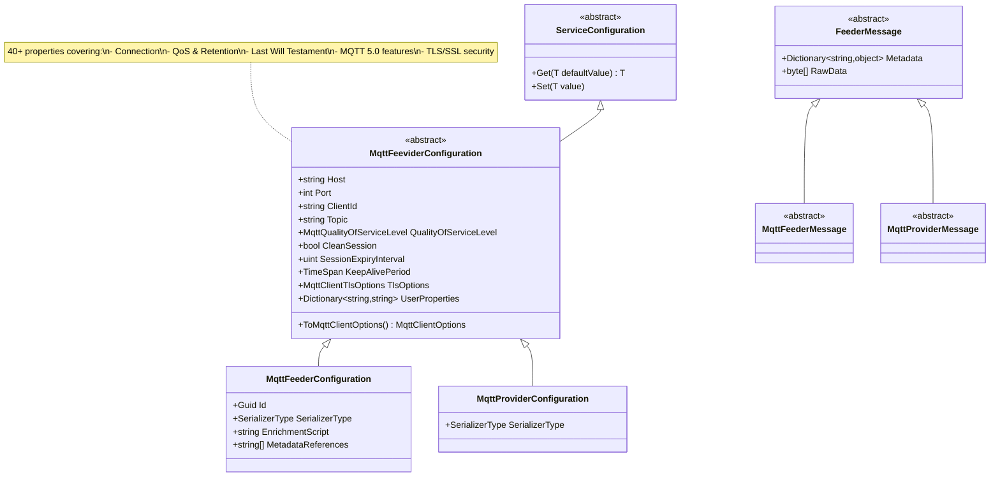

# ThunderPropagator.Feeviders.Mqtt.SharedKernel

Shared configuration abstractions, message models, and utilities for MQTT integration within the ThunderPropagator framework. Provides a unified configuration base for both Feeders (subscribers) and Providers (publishers) with comprehensive support for MQTT 3.1.1 and MQTT 5.0 features.

## Overview

The SharedKernel serves as the foundation for MQTT integration, offering:
- **Unified Configuration**: Single configuration class (`MqttFeeviderConfiguration`) inherited by both Feeders and Providers
- **MQTT Protocol Support**: Full MQTT 3.1.1 and MQTT 5.0 feature coverage
- **Connection Management**: TLS/SSL, authentication, keep-alive, session persistence
- **Message Abstractions**: Base message models with serialization support
- **Builder Pattern**: `ToMqttClientOptions()` method for MQTTnet integration

This design ensures consistency across publishers and subscribers while minimizing duplication.

### Architecture



## Files

| File | Lines | Responsibility |
|------|-------|----------------|
| **MqttFeeviderConfiguration.cs** | 410 | Core MQTT configuration (connection, QoS, LWT, TLS, MQTT 5.0) |

**Total**: 1 file, 410 lines of code

Note: `MqttFeederConfiguration`, `MqttProviderConfiguration`, `MqttFeederMessage`, and `MqttProviderMessage` are defined in their respective Feeder/Provider projects but inherit from SharedKernel abstractions.

## Dependencies

### NuGet Packages

```xml
<PackageReference Include="MQTTnet" Version="4.x" />
<PackageReference Include="ThunderPropagator.BuildingBlocks" Version="1.0.x" />
<PackageReference Include="Microsoft.Extensions.DependencyInjection" Version="9.x" />
```

### Project References

- **ThunderPropagator.BuildingBlocks**: `ServiceConfiguration` base class, serialization helpers
- **MQTTnet**: MQTT client library, protocol implementation

## Configuration Properties

### Connection Properties

| Property | Type | Required | Default | Description |
|----------|------|----------|---------|-------------|
| **Host** | `string` | ✅ | - | MQTT broker hostname or IP address (e.g., `mqtt.example.com`, `192.168.1.100`) |
| **Port** | `int?` | ✅ | `1883` | Broker port (1883 plain, 8883 TLS, 1884 WebSocket) |
| **ClientId** | `string` | ✅ | - | Unique client identifier (max 23 chars for MQTT 3.1.1, unlimited for MQTT 5.0) |
| **EndPoint** | `string?` | ❌ | `null` | Alternative endpoint specification (IP:Port or URI) |
| **ConnectionUri** | `string?` | ❌ | `null` | Full MQTT URI (e.g., `mqtt://mqtt.example.com:1883`) |
| **AddressFamily** | `AddressFamily?` | ❌ | `Unspecified` | IPv4 (`InterNetwork`) or IPv6 (`InterNetworkV6`) |
| **TcpServerAddressFamily** | `AddressFamily` | ❌ | `Unspecified` | Address family for TCP server connection |
| **ProtocolType** | `ProtocolType?` | ❌ | `Tcp` | Network protocol (`Tcp`, `Udp`) |

### Authentication & Security

| Property | Type | Required | Default | Description |
|----------|------|----------|---------|-------------|
| **Username** | `string?` | ❌ | `null` | Authentication username |
| **Password** | `string?` | ❌ | `null` | Authentication password (required if `Username` set) |
| **TlsOptions** | `MqttClientTlsOptions?` | ❌ | `null` | TLS/SSL configuration (server certificates, client certificates, protocol versions) |
| **EnhancedAuthenticationMethod** | `string?` | ❌ | `null` | MQTT 5.0: Authentication method (e.g., `SCRAM-SHA-256`) |
| **EnhancedAuthenticationData** | `string?` | ❌ | `null` | MQTT 5.0: Authentication data (base64-encoded) |

### Topic & QoS

| Property | Type | Required | Default | Description |
|----------|------|----------|---------|-------------|
| **Topic** | `string` | ✅ | - | Topic for publish/subscribe (supports wildcards `+`, `#` for subscriptions) |
| **QualityOfServiceLevel** | `MqttQualityOfServiceLevel?` | ❌ | `AtMostOnce` | `AtMostOnce` (QoS 0), `AtLeastOnce` (QoS 1), `ExactlyOnce` (QoS 2) |
| **Retain** | `bool?` | ❌ | `false` | Broker retains message as last value for topic |

### Session Management

| Property | Type | Required | Default | Description |
|----------|------|----------|---------|-------------|
| **CleanSession** | `bool?` | ❌ | `true` | MQTT 3.1.1: `false` = persistent session (queue messages offline) |
| **CleanStart** | `bool?` | ❌ | `true` | MQTT 5.0: Replaces `CleanSession` flag |
| **SessionExpiryInterval** | `uint?` | ❌ | `0` | MQTT 5.0: Session lifetime in seconds (0 = expire on disconnect) |

### Keep-Alive & Timeouts

| Property | Type | Required | Default | Description |
|----------|------|----------|---------|-------------|
| **KeepAlivePeriod** | `TimeSpan?` | ❌ | `00:00:15` | Ping interval to detect broken connections (typically 15-60 seconds) |
| **Timeout** | `TimeSpan?` | ❌ | `00:00:30` | Connection timeout |
| **NoKeepAlive** | `bool` | ❌ | `false` | Disable keep-alive mechanism |

### Last Will Testament (LWT)

Published by broker when client disconnects ungracefully:

| Property | Type | Required | Default | Description |
|----------|------|----------|---------|-------------|
| **Payload** | `string?` | ❌ | `null` | LWT message payload (UTF-8 string) |
| **DelayInterval** | `uint?` | ❌ | `0` | MQTT 5.0: Delay (seconds) before publishing LWT |
| **MessageExpiryInterval** | `uint?` | ❌ | `null` | MQTT 5.0: LWT TTL (seconds) |
| **ContentType** | `string?` | ❌ | `null` | MQTT 5.0: LWT MIME type (e.g., `application/json`) |
| **ResponseTopic** | `string?` | ❌ | `null` | MQTT 5.0: Response topic for LWT |
| **CorrelationData** | `string?` | ❌ | `null` | MQTT 5.0: Correlation identifier for LWT |
| **PayloadFormatIndicator** | `MqttPayloadFormatIndicator?` | ❌ | `null` | MQTT 5.0: `Unspecified` or `Utf8` |
| **WillUserProperties** | `Dictionary<string, string>?` | ❌ | `null` | MQTT 5.0: Custom LWT metadata |

### MQTT 5.0 Protocol Features

| Property | Type | Required | Default | Description |
|----------|------|----------|---------|-------------|
| **ProtocolVersion** | `MqttProtocolVersion?` | ❌ | `V500` | MQTT version: `V310`, `V311`, `V500` |
| **MaximumPacketSize** | `uint?` | ❌ | `268435455` | Max packet size (bytes) client can handle |
| **ReceiveMaximum** | `ushort?` | ❌ | `65535` | Max concurrent in-flight QoS 1/2 messages |
| **TopicAliasMaximum** | `ushort?` | ❌ | `0` | Max topic aliases (bandwidth optimization) |
| **RequestResponseInformation** | `bool?` | ❌ | `false` | Request response information from broker |
| **RequestProblemInformation** | `bool?` | ❌ | `true` | Request detailed error information |
| **UserProperties** | `Dictionary<string, string>?` | ❌ | `null` | Custom metadata sent in CONNECT packet |

### MQTT 5.0 Message Properties

| Property | Type | Required | Default | Description |
|----------|------|----------|---------|-------------|
| **MessageExpiryInterval** | `uint?` | ❌ | `null` | Message TTL (seconds) for time-sensitive data |
| **ContentType** | `string?` | ❌ | `null` | MIME type (e.g., `application/json`, `text/plain`) |
| **ResponseTopic** | `string?` | ❌ | `null` | Topic for request/response pattern |
| **CorrelationData** | `string?` | ❌ | `null` | Link requests to responses |
| **PayloadFormatIndicator** | `MqttPayloadFormatIndicator?` | ❌ | `null` | Payload format: `Unspecified` or `Utf8` |

### Subscription Features (Feeder-specific)

| Property | Type | Required | Default | Description |
|----------|------|----------|---------|-------------|
| **SubscriptionIdentifier** | `uint?` | ❌ | `null` | MQTT 5.0: Numeric identifier for subscription tracking |

### Advanced Options

| Property | Type | Required | Default | Description |
|----------|------|----------|---------|-------------|
| **WithoutPacketFragmentation** | `bool` | ❌ | `false` | Disable packet fragmentation for large messages |
| **TryPrivate** | `bool?` | ❌ | `null` | MQTT 5.0: Request private connection (broker-specific) |
| **IsEnabled** | `bool` | ❌ | `false` | Enable/disable feeder/provider dynamically |

## API Reference

### MqttFeeviderConfiguration

```csharp
public abstract class MqttFeeviderConfiguration : ServiceConfiguration
```

Core MQTT configuration class inherited by both `MqttFeederConfiguration` and `MqttProviderConfiguration`.

**Key Methods**:

```csharp
public MqttClientOptions ToMqttClientOptions()
```

Builds `MqttClientOptions` for MQTTnet client from configuration properties. Handles:
- Connection options (Host, Port, ClientId)
- Authentication (Username/Password, Enhanced Auth)
- TLS/SSL configuration
- Last Will Testament
- Session management (CleanSession/CleanStart, SessionExpiryInterval)
- Keep-alive settings
- MQTT 5.0 features (user properties, protocol version, packet sizes)

**Usage**:
```csharp
var config = new MyMqttConfiguration
{
    Host = "mqtt.example.com",
    Port = 1883,
    ClientId = "client-001",
    Topic = "sensors/temperature",
    QualityOfServiceLevel = MqttQualityOfServiceLevel.AtLeastOnce
};

var mqttOptions = config.ToMqttClientOptions();
var mqttClient = mqttFactory.CreateMqttClient();
await mqttClient.ConnectAsync(mqttOptions);
```

### ServiceConfiguration Base Class

```csharp
public abstract class ServiceConfiguration
```

Inherited from `ThunderPropagator.BuildingBlocks.Application.ServiceConfiguration`. Provides property bag functionality:

```csharp
protected T Get<T>(T defaultValue = default)
protected void Set<T>(T value)
```

Allows dynamic property storage without explicit backing fields.

## Examples

### Example 1: Basic Connection Configuration

Minimal configuration for MQTT 3.1.1:

```csharp
public class BasicMqttConfig : MqttFeederConfiguration
{
}

// appsettings.json
{
  "BasicMqtt": {
    "Host": "mqtt.example.com",
    "Port": 1883,
    "ClientId": "basic-client",
    "Topic": "test/topic",
    "QualityOfServiceLevel": 0,
    "CleanSession": true,
    "SerializerType": "Json"
  }
}

// Registration
services.AddMqttFeeder<MyChannel, MyMessage, BasicMqttConfig>(
    configuration, "BasicMqtt");
```

### Example 2: Topic Wildcards & Filters

Subscribe using MQTT wildcards:

```csharp
public class WildcardConfig : MqttFeederConfiguration
{
}

// appsettings.json
{
  "WildcardMqtt": {
    "Host": "mqtt.iot.local",
    "Port": 1883,
    "ClientId": "wildcard-subscriber",
    
    // Wildcard patterns
    "Topic": "sensors/+/temperature",  // Single-level: sensors/room1/temperature, sensors/room2/temperature
    // "Topic": "sensors/#",            // Multi-level: all topics under sensors/
    // "Topic": "sensors/building1/+/#", // Combined: sensors/building1/floor1/..., sensors/building1/floor2/...
    
    "QualityOfServiceLevel": 1,
    "SerializerType": "Json"
  }
}
```

**Wildcard Rules**:
- **`+`**: Matches exactly one topic level (e.g., `sensors/+/temp` matches `sensors/room1/temp` but not `sensors/room1/hvac/temp`)
- **`#`**: Matches zero or more levels (must be last, e.g., `sensors/#` matches `sensors/temp`, `sensors/room1/temp`, `sensors/room1/hvac/temp`)

### Example 3: QoS Levels Configuration

Different QoS for different use cases:

```csharp
// QoS 0: Fire-and-forget (telemetry)
public class TelemetryConfig : MqttFeederConfiguration
{
    // appsettings.json: "QualityOfServiceLevel": 0
}

// QoS 1: At-least-once (commands)
public class CommandConfig : MqttFeederConfiguration
{
    // appsettings.json: "QualityOfServiceLevel": 1
}

// QoS 2: Exactly-once (transactions)
public class TransactionConfig : MqttFeederConfiguration
{
    // appsettings.json: "QualityOfServiceLevel": 2
}
```

**QoS Selection Guide**:

| QoS | Delivery Guarantee | Acknowledgment | Use Case |
|-----|-------------------|----------------|----------|
| **0** | At-most-once | None | Telemetry, high-frequency data |
| **1** | At-least-once | PUBACK | Commands, alerts (handle duplicates) |
| **2** | Exactly-once | PUBREC, PUBREL, PUBCOMP | Transactions, billing |

### Example 4: Persistent Session (Offline Queuing)

Queue messages while client offline:

```csharp
public class PersistentConfig : MqttFeederConfiguration
{
}

// appsettings.json
{
  "PersistentMqtt": {
    "Host": "mqtt.example.com",
    "Port": 1883,
    "ClientId": "persistent-client-001",  // Must be consistent across reconnects
    "Topic": "commands/device001",
    
    // Persistent session (MQTT 3.1.1)
    "CleanSession": false,                // Session preserved on disconnect
    
    // OR MQTT 5.0 alternative
    "CleanStart": false,
    "SessionExpiryInterval": 3600,        // Session expires after 1 hour of disconnect
    
    "QualityOfServiceLevel": 1,           // QoS 1/2 required for queuing
    "SerializerType": "Json"
  }
}

// Behavior:
// 1. Client connects, subscribes to "commands/device001"
// 2. Client disconnects (network drop, app crash)
// 3. Broker queues QoS 1/2 messages sent to "commands/device001"
// 4. Client reconnects with same ClientId
// 5. Broker delivers queued messages
```

**Session Lifecycle**:
- **CleanSession=true**: Ephemeral, no queuing (default)
- **CleanSession=false**: Persistent, broker queues messages while offline

### Example 5: Last Will Testament Configuration

Automatic offline notification:

```csharp
public class LWTConfig : MqttFeederConfiguration
{
}

// appsettings.json
{
  "LWTMqtt": {
    "Host": "mqtt.iot.local",
    "Port": 1883,
    "ClientId": "device-xyz789",
    "Topic": "devices/status",
    
    // Last Will Testament (published by broker on ungraceful disconnect)
    "Payload": "{\"deviceId\":\"xyz789\",\"status\":\"offline\",\"timestamp\":\"2025-01-15T10:00:00Z\"}",
    "QualityOfServiceLevel": 1,
    "Retain": true,                       // Retain LWT for immediate visibility
    "DelayInterval": 5,                   // MQTT 5.0: Wait 5 seconds before publishing LWT
    "MessageExpiryInterval": 3600,        // MQTT 5.0: LWT expires after 1 hour
    
    "SerializerType": "Json"
  }
}

// Usage pattern:
// 1. Client connects, LWT configured in CONNECT packet
// 2. Normal operation: Client publishes {"status":"online"} periodically
// 3. Ungraceful disconnect (crash, network failure): Broker publishes LWT after 5 seconds
// 4. Graceful disconnect: LWT NOT published (client sends DISCONNECT packet)
```

**LWT Use Cases**:
- Device online/offline monitoring
- Session disconnection alerts
- Automated failover triggers

### Example 6: TLS/SSL Configuration

Secure connection with server certificate validation:

```csharp
public class SecureConfig : MqttFeederConfiguration
{
}

// appsettings.json (basic TLS)
{
  "SecureMqtt": {
    "Host": "mqtt.example.com",
    "Port": 8883,  // Standard TLS port
    "ClientId": "secure-client",
    "Topic": "secure/topic",
    "Username": "mqtt-user",
    "Password": "secure-password",
    
    "TlsOptions": {
      "UseTls": true,
      "SslProtocol": "Tls12"  // or "Tls13"
    },
    
    "SerializerType": "Json"
  }
}

// C# configuration (advanced TLS with client certificate)
var tlsOptions = new MqttClientTlsOptions
{
    UseTls = true,
    SslProtocol = System.Security.Authentication.SslProtocols.Tls12 | System.Security.Authentication.SslProtocols.Tls13,
    
    // Server certificate validation
    CertificateValidationHandler = context =>
    {
        // Custom validation logic
        var certificate = context.Certificate;
        
        // Check subject
        if (certificate.Subject != "CN=mqtt.example.com")
            return false;
        
        // Check expiration
        if (DateTime.Parse(certificate.GetExpirationDateString()) < DateTime.UtcNow)
            return false;
        
        return true;
    },
    
    // Client certificate (mutual TLS)
    Certificates = new[]
    {
        new System.Security.Cryptography.X509Certificates.X509Certificate2(
            "client-cert.pfx",
            "cert-password")
    }
};

config.TlsOptions = tlsOptions;
```

### Example 7: MQTT 5.0 Features (User Properties, Response Topic)

Advanced MQTT 5.0 features:

```csharp
public class Mqtt5Config : MqttFeederConfiguration
{
}

// appsettings.json
{
  "Mqtt5": {
    "Host": "mqtt.example.com",
    "Port": 1883,
    "ClientId": "mqtt5-client",
    "Topic": "requests/device-query",
    
    "ProtocolVersion": 5,  // MQTT 5.0
    
    // User Properties (custom metadata)
    "UserProperties": {
      "client-version": "1.0.0",
      "environment": "production",
      "region": "us-west-2"
    },
    
    // Request/Response pattern
    "ResponseTopic": "responses/device-query",
    "CorrelationData": "correlation-id-12345",
    
    // Message properties
    "MessageExpiryInterval": 60,           // 60-second TTL
    "ContentType": "application/json",
    
    // Protocol limits
    "MaximumPacketSize": 1048576,          // 1 MB
    "ReceiveMaximum": 100,                 // Max 100 in-flight messages
    "TopicAliasMaximum": 10,               // Use topic aliases
    
    "RequestResponseInformation": true,
    "RequestProblemInformation": true,
    
    "SerializerType": "Json"
  }
}

// Usage for request/response
// 1. Publisher sends request with ResponseTopic and CorrelationData
// 2. Subscriber receives request, publishes response to ResponseTopic
// 3. Original publisher subscribes to ResponseTopic, matches via CorrelationData
```

### Example 8: High-Performance Configuration

Optimized settings for high-throughput scenarios:

```csharp
public class HighPerfConfig : MqttFeederConfiguration
{
}

// appsettings.json
{
  "HighPerfMqtt": {
    "Host": "mqtt.perf.local",
    "Port": 1883,
    "ClientId": "high-perf-client",
    "Topic": "telemetry/stream",
    
    // Performance optimizations
    "QualityOfServiceLevel": 0,            // Fire-and-forget (lowest overhead)
    "CleanSession": true,                  // No session persistence
    "KeepAlivePeriod": "00:01:00",         // 60-second keep-alive (reduce ping overhead)
    
    "WithoutPacketFragmentation": true,    // Disable fragmentation
    "MaximumPacketSize": 16777216,         // 16 MB packets
    "ReceiveMaximum": 65535,               // Max concurrent messages
    
    "SerializerType": "NetJson",           // Fastest serialization
    
    "ProtocolVersion": 5
  }
}

// Expected throughput: 100,000+ msg/sec (QoS 0, small payloads, local broker)
```

## Advanced Patterns

### Pattern 1: Configuration Validation

Validate configuration at startup:

```csharp
public class ValidatedMqttConfig : MqttFeederConfiguration
{
    public void Validate()
    {
        // Required fields
        ArgumentException.ThrowIfNullOrWhiteSpace(Host, nameof(Host));
        ArgumentException.ThrowIfNullOrWhiteSpace(ClientId, nameof(ClientId));
        ArgumentException.ThrowIfNullOrWhiteSpace(Topic, nameof(Topic));
        
        // Port range
        if (Port is < 1 or > 65535)
            throw new ArgumentOutOfRangeException(nameof(Port), "Port must be between 1 and 65535");
        
        // Username/Password together
        if (!string.IsNullOrWhiteSpace(Username) && string.IsNullOrWhiteSpace(Password))
            throw new InvalidOperationException("Password required when Username is set");
        
        // Persistent session requires consistent ClientId
        if (CleanSession == false && string.IsNullOrWhiteSpace(ClientId))
            throw new InvalidOperationException("ClientId required for persistent sessions");
        
        // MQTT 3.1.1: ClientId max 23 characters
        if (ProtocolVersion == MqttProtocolVersion.V311 && ClientId.Length > 23)
            throw new ArgumentException("ClientId must be <= 23 characters for MQTT 3.1.1", nameof(ClientId));
        
        // QoS 1/2 required for persistent sessions
        if (CleanSession == false && QualityOfServiceLevel == MqttQualityOfServiceLevel.AtMostOnce)
            throw new InvalidOperationException("QoS 1 or 2 required for persistent sessions (QoS 0 messages not queued)");
    }
}

// Registration with validation
services.AddSingleton<ValidatedMqttConfig>(sp =>
{
    var config = configuration.GetSection("ValidatedMqtt").Get<ValidatedMqttConfig>();
    config.Validate();  // Throws on invalid configuration
    return config;
});
```

### Pattern 2: Builder Pattern for Complex Configuration

Fluent API for readable configuration:

```csharp
public class MqttConfigBuilder
{
    private readonly MqttFeederConfiguration _config = new MyMqttConfig();

    public MqttConfigBuilder WithConnection(string host, int port, string clientId)
    {
        _config.Host = host;
        _config.Port = port;
        _config.ClientId = clientId;
        return this;
    }

    public MqttConfigBuilder WithQoS(MqttQualityOfServiceLevel qos)
    {
        _config.QualityOfServiceLevel = qos;
        return this;
    }

    public MqttConfigBuilder WithPersistentSession(uint sessionExpirySeconds = 3600)
    {
        _config.CleanSession = false;
        _config.SessionExpiryInterval = sessionExpirySeconds;
        return this;
    }

    public MqttConfigBuilder WithLastWillTestament(string payload, bool retain = true)
    {
        _config.Payload = payload;
        _config.Retain = retain;
        _config.QualityOfServiceLevel = MqttQualityOfServiceLevel.AtLeastOnce;
        return this;
    }

    public MqttConfigBuilder WithTls(System.Security.Authentication.SslProtocols protocols = System.Security.Authentication.SslProtocols.Tls12)
    {
        _config.Port = 8883;
        _config.TlsOptions = new MqttClientTlsOptions
        {
            UseTls = true,
            SslProtocol = protocols
        };
        return this;
    }

    public MqttConfigBuilder WithAuthentication(string username, string password)
    {
        _config.Username = username;
        _config.Password = password;
        return this;
    }

    public MqttFeederConfiguration Build()
    {
        // Validate before returning
        ArgumentException.ThrowIfNullOrWhiteSpace(_config.Host);
        ArgumentException.ThrowIfNullOrWhiteSpace(_config.ClientId);
        ArgumentException.ThrowIfNullOrWhiteSpace(_config.Topic);
        
        return _config;
    }
}

// Usage
var config = new MqttConfigBuilder()
    .WithConnection("mqtt.example.com", 8883, "secure-client")
    .WithQoS(MqttQualityOfServiceLevel.AtLeastOnce)
    .WithPersistentSession(3600)
    .WithTls()
    .WithAuthentication("user", "pass")
    .WithLastWillTestament("{\"status\":\"offline\"}")
    .Build();

services.AddSingleton(config);
```

### Pattern 3: Connection Pooling Configuration

Reuse connections across multiple publishers/subscribers:

```csharp
// Singleton configuration (shared connection)
services.AddSingleton<MqttProviderConfiguration>(sp =>
{
    var config = new MyMqttProviderConfig
    {
        Host = "mqtt.example.com",
        Port = 1883,
        ClientId = "shared-publisher",
        Topic = "default/topic"  // Override at runtime
    };
    return config;
});

// Multiple providers sharing connection
services.AddSingleton<IProvider<Message1>>(sp =>
{
    var config = sp.GetRequiredService<MqttProviderConfiguration>();
    return new MqttProvider<Message1, MqttProviderConfiguration>(config, sp);
});

services.AddSingleton<IProvider<Message2>>(sp =>
{
    var config = sp.GetRequiredService<MqttProviderConfiguration>();
    return new MqttProvider<Message2, MqttProviderConfiguration>(config, sp);
});

// Usage with dynamic topics
public class MultiTopicPublisher
{
    private readonly IProvider<Message1> _provider1;
    private readonly IProvider<Message2> _provider2;
    private readonly MqttProviderConfiguration _config;

    public async Task PublishToTopic1Async(Message1 message)
    {
        _config.Topic = "topic1";
        await _provider1.ExecuteAsync(message);
    }

    public async Task PublishToTopic2Async(Message2 message)
    {
        _config.Topic = "topic2";
        await _provider2.ExecuteAsync(message);
    }
}
```

### Pattern 4: Environment-Based Configuration

Switch configuration based on environment:

```csharp
// appsettings.Development.json
{
  "Mqtt": {
    "Host": "localhost",
    "Port": 1883,
    "ClientId": "dev-client",
    "Topic": "dev/testing",
    "QualityOfServiceLevel": 0,
    "CleanSession": true,
    "SerializerType": "Json"
  }
}

// appsettings.Production.json
{
  "Mqtt": {
    "Host": "mqtt.prod.example.com",
    "Port": 8883,
    "ClientId": "prod-client-001",
    "Topic": "prod/telemetry",
    "QualityOfServiceLevel": 1,
    "CleanSession": false,
    "SessionExpiryInterval": 3600,
    "SerializerType": "NetJson",
    "TlsOptions": {
      "UseTls": true,
      "SslProtocol": "Tls13"
    },
    "Username": "prod-user",
    "Password": "${MQTT_PASSWORD}"  // Environment variable
  }
}

// Registration
var config = configuration.GetSection("Mqtt").Get<MyMqttConfig>();

// Resolve environment variables
if (!string.IsNullOrEmpty(config.Password) && config.Password.StartsWith("${"))
{
    var envVarName = config.Password.Trim('$', '{', '}');
    config.Password = Environment.GetEnvironmentVariable(envVarName);
}

services.AddSingleton(config);
```

### Pattern 5: Health Monitoring Integration

Monitor MQTT connection health:

```csharp
public class MqttHealthCheck : IHealthCheck
{
    private readonly IMqttClient _mqttClient;
    private readonly MqttFeeviderConfiguration _config;

    public MqttHealthCheck(IMqttClient mqttClient, MqttFeeviderConfiguration config)
    {
        _mqttClient = mqttClient;
        _config = config;
    }

    public Task<HealthCheckResult> CheckHealthAsync(
        HealthCheckContext context,
        CancellationToken cancellationToken = default)
    {
        if (!_mqttClient.IsConnected)
        {
            return Task.FromResult(HealthCheckResult.Unhealthy(
                $"MQTT client disconnected from {_config.Host}:{_config.Port}"));
        }

        var data = new Dictionary<string, object>
        {
            { "host", _config.Host },
            { "port", _config.Port },
            { "clientId", _config.ClientId },
            { "connected", _mqttClient.IsConnected }
        };

        return Task.FromResult(HealthCheckResult.Healthy("MQTT client connected", data));
    }
}

// Registration
services.AddHealthChecks()
    .AddCheck<MqttHealthCheck>("mqtt-connection");

// Health endpoint
app.MapHealthChecks("/health");
```

### Pattern 6: Reconnection Strategy with Exponential Backoff

MQTTnet handles reconnection automatically, but you can customize:

```csharp
public class ReconnectionConfig : MqttFeederConfiguration
{
    // MQTTnet auto-reconnect enabled by default
    // Exponential backoff: 1s → 2s → 4s → 8s → 16s → 30s (max)
}

// appsettings.json
{
  "ReconnectionMqtt": {
    "Host": "mqtt.example.com",
    "Port": 1883,
    "ClientId": "resilient-client",
    "Topic": "resilient/topic",
    
    // Persistent session (resume after reconnect)
    "CleanSession": false,
    "SessionExpiryInterval": 3600,
    
    // Keep-alive for faster disconnection detection
    "KeepAlivePeriod": "00:00:30",
    
    "QualityOfServiceLevel": 1,
    "SerializerType": "Json"
  }
}

// MQTTnet's reconnection behavior:
// 1. Detect disconnect (via keep-alive timeout or network error)
// 2. Wait 1 second, attempt reconnect
// 3. If fails, wait 2 seconds, attempt reconnect
// 4. If fails, wait 4 seconds, attempt reconnect
// 5. Continue doubling until max 30 seconds between attempts
// 6. On reconnect: Resubscribe to topics, deliver queued messages (persistent session)
```

### Pattern 7: Dynamic Topic Resolution

Resolve topics at runtime:

```csharp
public interface ITopicResolver
{
    string ResolveTopic(string baseTopictemplate, params object[] parameters);
}

public class HierarchicalTopicResolver : ITopicResolver
{
    public string ResolveTopic(string template, params object[] parameters)
    {
        // Template: "sensors/{location}/{deviceType}/{deviceId}/{metric}"
        // Parameters: ["building1", "hvac", "unit5", "temperature"]
        // Result: "sensors/building1/hvac/unit5/temperature"
        
        return string.Format(template, parameters);
    }
}

// Usage
public class DynamicTopicPublisher
{
    private readonly IProvider<SensorMessage> _provider;
    private readonly MqttProviderConfiguration _config;
    private readonly ITopicResolver _topicResolver;

    public async Task PublishSensorDataAsync(
        string location,
        string deviceType,
        string deviceId,
        string metric,
        double value)
    {
        // Resolve topic dynamically
        _config.Topic = _topicResolver.ResolveTopic(
            "sensors/{0}/{1}/{2}/{3}",
            location, deviceType, deviceId, metric);
        
        var message = new SensorMessage
        {
            Location = location,
            DeviceType = deviceType,
            DeviceId = deviceId,
            Metric = metric,
            Value = value
        };

        await _provider.ExecuteAsync(message);
    }
}

// Registration
services.AddSingleton<ITopicResolver, HierarchicalTopicResolver>();
```

## Best Practices

### 1. ClientId Selection

✅ **Good**:
```
device-001
sensor-livingroom-temp
mobile-app-user123
```

❌ **Bad**:
```
client               // Too generic (conflicts)
my device            // Spaces (some brokers reject)
aVeryLongClientIdentifierThatExceedsTwentyThreeCharacters  // > 23 chars for MQTT 3.1.1
```

**Recommendations**:
- Unique per client instance
- Max 23 characters for MQTT 3.1.1 (unlimited for MQTT 5.0)
- Alphanumeric + hyphen/underscore
- Consistent for persistent sessions

### 2. Session Management

- **Always-connected services**: `CleanSession=true` (no overhead)
- **Mobile apps**: `CleanSession=false`, `SessionExpiryInterval=3600` (1-hour offline queuing)
- **IoT devices (periodic wake)**: `CleanSession=false`, `SessionExpiryInterval=86400` (24-hour queuing)

### 3. Keep-Alive Tuning

```csharp
// Low-latency network
KeepAlivePeriod = TimeSpan.FromSeconds(15);

// Mobile/unreliable network
KeepAlivePeriod = TimeSpan.FromSeconds(120);

// Battery-powered device
KeepAlivePeriod = TimeSpan.FromMinutes(5);
```

### 4. QoS Selection

- **QoS 0**: Telemetry, metrics (loss acceptable)
- **QoS 1**: Commands, alerts (handle duplicates)
- **QoS 2**: Transactions (no duplicates, no loss)

Use lowest QoS that meets requirements.

### 5. Security Best Practices

Always use TLS in production:
```csharp
config.Port = 8883;
config.TlsOptions = new MqttClientTlsOptions { UseTls = true };
config.Username = "user";
config.Password = Environment.GetEnvironmentVariable("MQTT_PASSWORD");
```

### 6. Configuration Validation

Validate at startup to fail fast:
```csharp
var config = configuration.GetSection("Mqtt").Get<MyMqttConfig>();
config.Validate();  // Throws on invalid config
services.AddSingleton(config);
```

### 7. Protocol Version Selection

- **MQTT 3.1.1**: Maximum compatibility, all brokers
- **MQTT 5.0**: Advanced features (user properties, response topics, message expiry)

Default to MQTT 5.0 unless broker doesn't support it.

## Cross-References

### Related Documentation
- **[System Overview](../README.md)**: MQTT concepts, broker compatibility, use cases
- **[Feeders.Mqtt](../Feeders.Mqtt/README.md)**: Subscriber implementation using SharedKernel configuration
- **[Providers.DotNet.Mqtt](../Providers.DotNet.Mqtt/README.md)**: Publisher implementation using SharedKernel configuration

### ThunderPropagator Framework
- **BuildingBlocks**: `ServiceConfiguration` base class, serialization utilities
- **Feeders.SharedKernel**: Base feeder abstractions
- **Providers.DotNet.SharedKernel**: Base provider abstractions

### External Resources
- [MQTTnet Documentation](https://github.com/dotnet/MQTTnet)
- [MQTT 3.1.1 Specification](https://docs.oasis-open.org/mqtt/mqtt/v3.1.1/mqtt-v3.1.1.html)
- [MQTT 5.0 Specification](https://docs.oasis-open.org/mqtt/mqtt/v5.0/mqtt-v5.0.html)
- [mosquitto Broker](https://mosquitto.org/)
- [HiveMQ Documentation](https://www.hivemq.com/docs/)

---

**Next**: Implement [Feeders.Mqtt](../Feeders.Mqtt/README.md) for subscribing or [Providers.DotNet.Mqtt](../Providers.DotNet.Mqtt/README.md) for publishing using this shared configuration.
