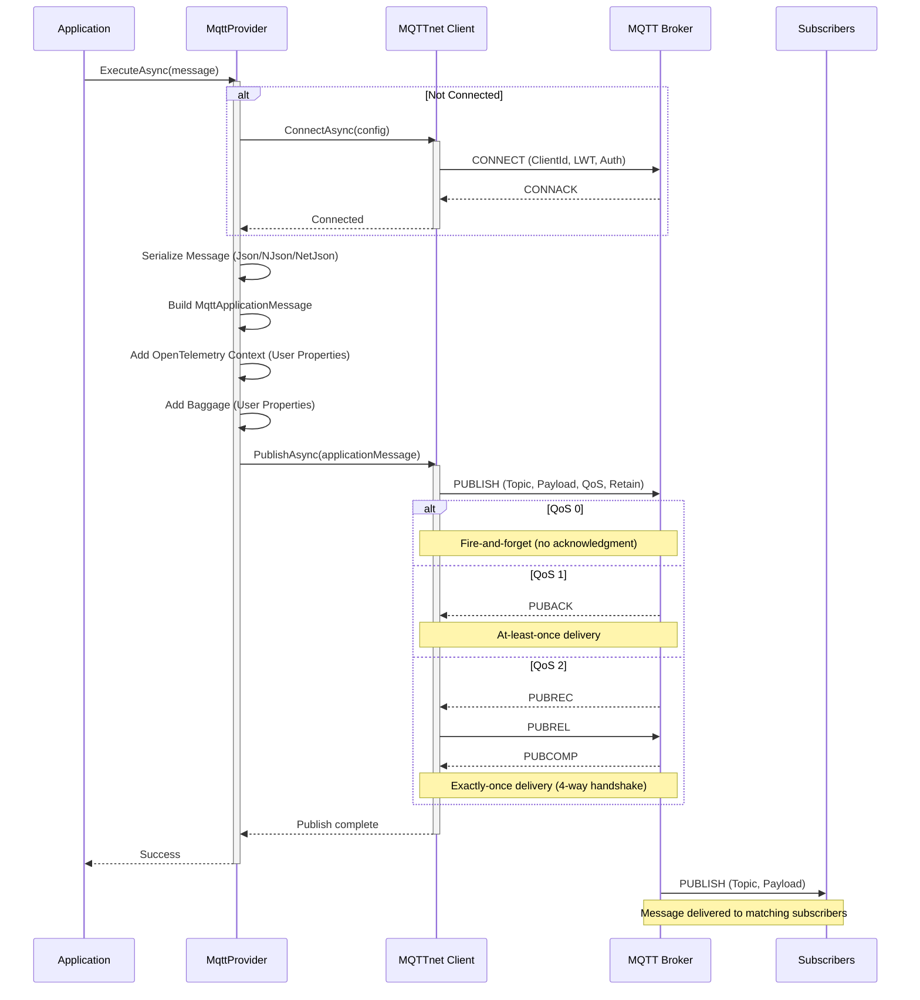

# ThunderPropagator.Providers.DotNet.Mqtt

Enterprise-grade MQTT message publishing (publisher) implementation using the AbstractProvider pattern for reliable, low-latency message delivery to MQTT brokers. Built on MQTTnet, this provider supports QoS levels, retained messages, Last Will Testament, and MQTT 5.0 advanced features.

## Overview

The MQTT Provider implements message publishing with automatic connection management, serialization, and OpenTelemetry distributed tracing integration. Designed for high-throughput scenarios with connection pooling and minimal overhead.

### Architecture



### Key Characteristics

| Feature | Value |
|---------|-------|
| **Base Class** | `AbstractProvider<TMqttProviderMessage, TMqttProviderConfiguration>` |
| **Connection Model** | Persistent connection (reused across multiple publishes) |
| **Serialization** | Automatic via `AbstractProvider` (Json, NJson, NetJson) |
| **QoS Support** | QoS 0 (at-most-once), QoS 1 (at-least-once), QoS 2 (exactly-once) |
| **Retained Messages** | Supported (broker stores latest message per topic) |
| **Last Will Testament** | Configured in connection options (automatic on disconnect) |
| **OpenTelemetry** | Automatic trace context propagation via user properties |
| **Thread Safety** | Connection shared, publishes serialized |

## Files

| File | Lines | Responsibility |
|------|-------|----------------|
| **MqttProvider.cs** | 86 | Core provider implementation (connection, publishing, serialization) |
| **MqttProviderConfiguration.cs** | 15 | Provider-specific configuration (SerializerType) |
| **MqttProviderMessage.cs** | 11 | Abstract base class for MQTT messages published by provider |
| **MqttProviderExtensions.cs** | 24 | DI registration extensions (`AddMqttProvider`) |

**Total**: 4 files, 136 lines of code

## Dependencies

### NuGet Packages

```xml
<PackageReference Include="MQTTnet" Version="4.x" />
<PackageReference Include="ThunderPropagator.BuildingBlocks" Version="1.0.x" />
<PackageReference Include="Microsoft.Extensions.DependencyInjection" Version="9.x" />
<PackageReference Include="Microsoft.Extensions.Logging" Version="9.x" />
<PackageReference Include="OpenTelemetry.Api" Version="1.x" />
```

### Project References

- **[ThunderPropagator.Feeviders.Mqtt.SharedKernel](../Feeviders.Mqtt.SharedKernel/README.md)**: Shared configuration (`MqttFeeviderConfiguration`) and utilities
- **[ThunderPropagator.Feeders.Mqtt](../Feeders.Mqtt/README.md)**: Complementary subscriber implementation

## Configuration

### MqttProviderConfiguration Properties

Extends `MqttFeeviderConfiguration` (40+ connection properties) with provider-specific settings:

| Property | Type | Default | Description |
|----------|------|---------|-------------|
| **SerializerType** | `SerializerType` | `Json` | Serialization format: `Json`, `NJson`, `NetJson` |

### Inherited Configuration (from MqttFeeviderConfiguration)

#### Connection Settings

| Property | Type | Required | Description |
|----------|------|----------|-------------|
| **Host** | `string` | ✅ | MQTT broker hostname (e.g., `mqtt.example.com`) |
| **Port** | `int?` | ✅ | Broker port (1883 plain, 8883 TLS, 1884 WebSocket) |
| **ClientId** | `string` | ✅ | Unique client identifier (persistent connections require consistent ID) |
| **Topic** | `string` | ✅ | Publishing topic (e.g., `sensors/temperature`) |
| **Username** | `string?` | ❌ | Authentication username |
| **Password** | `string?` | ❌ | Authentication password (required if Username set) |
| **KeepAlivePeriod** | `TimeSpan?` | `15s` | Ping interval to detect broken connections |
| **Timeout** | `TimeSpan?` | `30s` | Connection timeout |

#### Quality of Service

| Property | Type | Default | Description |
|----------|------|---------|-------------|
| **QualityOfServiceLevel** | `MqttQualityOfServiceLevel?` | `AtMostOnce` | `AtMostOnce` (QoS 0), `AtLeastOnce` (QoS 1), `ExactlyOnce` (QoS 2) |
| **Retain** | `bool?` | `false` | Broker retains latest message for new subscribers |

#### Last Will Testament (LWT)

Published by broker when client disconnects ungracefully:

| Property | Type | Default | Description |
|----------|------|---------|-------------|
| **Payload** | `string?` | `null` | LWT payload (UTF-8 string, will be encoded) |
| **DelayInterval** | `uint?` | `0` | MQTT 5.0: Delay (seconds) before publishing LWT |
| **MessageExpiryInterval** | `uint?` | `null` | MQTT 5.0: TTL for LWT message (seconds) |
| **ContentType** | `string?` | `null` | MQTT 5.0: MIME type (e.g., `application/json`) |
| **ResponseTopic** | `string?` | `null` | MQTT 5.0: Topic for responses |
| **CorrelationData** | `string?` | `null` | MQTT 5.0: Correlation identifier |
| **PayloadFormatIndicator** | `MqttPayloadFormatIndicator?` | `null` | MQTT 5.0: `Unspecified` or `Utf8` |
| **WillUserProperties** | `Dictionary<string, string>?` | `null` | MQTT 5.0: Custom LWT metadata |

#### MQTT 5.0 Message Properties

| Property | Type | Default | Description |
|----------|------|---------|-------------|
| **UserProperties** | `Dictionary<string, string>?` | `null` | Custom metadata (key-value pairs) |
| **MessageExpiryInterval** | `uint?` | `null` | Message TTL (seconds) for time-sensitive data |
| **ContentType** | `string?` | `null` | MIME type (e.g., `application/json`, `application/octet-stream`) |
| **ResponseTopic** | `string?` | `null` | Topic for request/response pattern |
| **CorrelationData** | `string?` | `null` | Link requests to responses |
| **PayloadFormatIndicator** | `MqttPayloadFormatIndicator?` | `null` | Payload format: `Unspecified` or `Utf8` |

#### Security (TLS/SSL)

| Property | Type | Default | Description |
|----------|------|---------|-------------|
| **TlsOptions** | `MqttClientTlsOptions?` | `null` | TLS configuration (certificates, protocols, validation) |

#### Protocol Options

| Property | Type | Default | Description |
|----------|------|---------|-------------|
| **ProtocolVersion** | `MqttProtocolVersion?` | `V500` | `V310` (3.1.0), `V311` (3.1.1), `V500` (5.0) |
| **WithoutPacketFragmentation** | `bool` | `false` | Disable packet fragmentation for large messages |
| **NoKeepAlive** | `bool` | `false` | Disable keep-alive mechanism |

#### Session Management

| Property | Type | Default | Description |
|----------|------|---------|-------------|
| **CleanSession** | `bool?` | `true` | MQTT 3.1.1: `false` = persistent session |
| **CleanStart** | `bool?` | `true` | MQTT 5.0 replacement for CleanSession |
| **SessionExpiryInterval** | `uint?` | `0` | MQTT 5.0: Session lifetime in seconds |

### Configuration Example (appsettings.json)

```json
{
  "MqttProvider": {
    "Host": "mqtt.example.com",
    "Port": 1883,
    "ClientId": "sensor-publisher-001",
    "Topic": "sensors/livingroom/temperature",
    "Username": "mqtt-user",
    "Password": "secure-password",
    
    "QualityOfServiceLevel": 1,
    "Retain": true,
    "SerializerType": "Json",
    
    "KeepAlivePeriod": "00:00:30",
    "Timeout": "00:01:00",
    
    "ProtocolVersion": 5,
    "MessageExpiryInterval": 3600,
    "ContentType": "application/json",
    "UserProperties": {
      "source": "iot-gateway",
      "version": "1.0"
    }
  }
}
```

## API Reference

### MqttProvider<TMqttProviderMessage, TMqttProviderConfiguration>

```csharp
internal sealed class MqttProvider<TMqttProviderMessage, TMqttProviderConfiguration>
    : AbstractProvider<TMqttProviderMessage, TMqttProviderConfiguration>
    where TMqttProviderMessage : MqttProviderMessage
    where TMqttProviderConfiguration : MqttProviderConfiguration
```

**Constructor**:
```csharp
public MqttProvider(
    TMqttProviderConfiguration mqttProviderConfiguration,
    IServiceProvider serviceProvider)
```

**Key Methods**:
```csharp
protected override Task InternalExecuteAsync(
    TMqttProviderMessage feederMessage,
    CancellationToken cancellationToken = default)
```
- Serializes message based on `SerializerType`
- Builds `MqttApplicationMessage` with topic, payload, QoS, retain flag
- Injects `ActivityContext` and `Baggage` into user properties
- Publishes to broker via `IMqttClient.PublishAsync()`

**Connection Management**:
- Connects lazily on first `ExecuteAsync()` call
- Reuses connection for subsequent publishes (connection pooling)
- Auto-reconnects on disconnection (MQTTnet built-in retry)

**Cleanup**:
```csharp
protected override ValueTask DisposeManagedResourcesAsync()
```
- Gracefully disconnects from broker
- Disposes MQTT client

### MqttProviderMessage

```csharp
public abstract class MqttProviderMessage : FeederMessage
```

Base class for all MQTT provider messages. Inherits serialization and metadata capabilities from `FeederMessage`.

### MqttProviderConfiguration

```csharp
public abstract class MqttProviderConfiguration : MqttFeeviderConfiguration, IAbstractProviderConfiguration
```

**Properties**:
- `SerializerType SerializerType`: Message serialization format (Json, NJson, NetJson)

### Extension Methods

```csharp
public static class MqttProviderExtensions
```

**AddMqttProvider**:
```csharp
public static IServiceCollection AddMqttProvider<TMqttProviderMessage, TMqttProviderConfiguration>(
    this IServiceCollection services,
    IConfigurationRoot configurationRoot,
    string configurationSectionName)
    where TMqttProviderMessage : MqttProviderMessage
    where TMqttProviderConfiguration : MqttProviderConfiguration
```

Registers MQTT provider in DI container, binding configuration from specified section.

## Examples

### Example 1: Basic Publishing (QoS 0)

Fire-and-forget publishing for high-frequency telemetry:

```csharp
// Message model
public class TelemetryMessage : MqttProviderMessage
{
    public string DeviceId { get; set; } = null!;
    public double Value { get; set; }
    public DateTime Timestamp { get; set; }
}

// Configuration
public class TelemetryProviderConfig : MqttProviderConfiguration
{
}

// appsettings.json
{
  "TelemetryMqtt": {
    "Host": "mqtt.iot.local",
    "Port": 1883,
    "ClientId": "telemetry-publisher",
    "Topic": "sensors/telemetry",
    "QualityOfServiceLevel": 0,  // Fire-and-forget (no acknowledgment)
    "Retain": false,              // Don't retain high-frequency data
    "SerializerType": "Json"
  }
}

// Registration
services.AddMqttProvider<TelemetryMessage, TelemetryProviderConfig>(
    configuration, "TelemetryMqtt");

// Usage
public class SensorService
{
    private readonly IProvider<TelemetryMessage> _provider;

    public SensorService(IProvider<TelemetryMessage> provider)
    {
        _provider = provider;
    }

    public async Task PublishTelemetryAsync()
    {
        var message = new TelemetryMessage
        {
            DeviceId = "sensor-001",
            Value = 22.5,
            Timestamp = DateTime.UtcNow
        };

        await _provider.ExecuteAsync(message);
        // Immediate return (no acknowledgment)
    }
}
```

### Example 2: Topic Routing with Dynamic Topics

Publish to different topics per device:

```csharp
// Message model
public class DeviceMessage : MqttProviderMessage
{
    public string DeviceId { get; set; } = null!;
    public string Metric { get; set; } = null!;
    public double Value { get; set; }
}

// Configuration (base topic)
public class DeviceProviderConfig : MqttProviderConfiguration
{
    // Topic format: devices/{deviceId}/{metric}
    // Base configuration in appsettings.json, override at runtime
}

// appsettings.json
{
  "DeviceMqtt": {
    "Host": "mqtt.iot.local",
    "Port": 1883,
    "ClientId": "device-publisher",
    "Topic": "devices/default/metric",  // Overridden at runtime
    "QualityOfServiceLevel": 1,
    "SerializerType": "Json"
  }
}

// Registration
services.AddMqttProvider<DeviceMessage, DeviceProviderConfig>(
    configuration, "DeviceMqtt");

// Usage with dynamic topics
public class DeviceService
{
    private readonly IProvider<DeviceMessage> _provider;
    private readonly DeviceProviderConfig _config;

    public DeviceService(
        IProvider<DeviceMessage> provider,
        DeviceProviderConfig config)
    {
        _provider = provider;
        _config = config;
    }

    public async Task PublishDeviceMetricAsync(string deviceId, string metric, double value)
    {
        // Override topic at runtime
        _config.Topic = $"devices/{deviceId}/{metric}";
        
        var message = new DeviceMessage
        {
            DeviceId = deviceId,
            Metric = metric,
            Value = value
        };

        await _provider.ExecuteAsync(message);
    }
}

// Publish to multiple topics
await deviceService.PublishDeviceMetricAsync("sensor-001", "temperature", 22.5);
// Topic: devices/sensor-001/temperature

await deviceService.PublishDeviceMetricAsync("sensor-002", "humidity", 65.0);
// Topic: devices/sensor-002/humidity
```

### Example 3: QoS 1 with Acknowledgment

Guaranteed delivery for critical commands:

```csharp
// Message model
public class CommandMessage : MqttProviderMessage
{
    public string CommandId { get; set; } = null!;
    public string DeviceId { get; set; } = null!;
    public string Action { get; set; } = null!;
    public Dictionary<string, object>? Parameters { get; set; }
}

// Configuration
public class CommandProviderConfig : MqttProviderConfiguration
{
}

// appsettings.json
{
  "CommandMqtt": {
    "Host": "mqtt.iot.local",
    "Port": 1883,
    "ClientId": "command-publisher",
    "Topic": "devices/commands",
    "QualityOfServiceLevel": 1,  // At-least-once (PUBACK)
    "Retain": false,
    "SerializerType": "Json"
  }
}

// Registration
services.AddMqttProvider<CommandMessage, CommandProviderConfig>(
    configuration, "CommandMqtt");

// Usage
public class CommandService
{
    private readonly IProvider<CommandMessage> _provider;
    private readonly ILogger<CommandService> _logger;

    public CommandService(
        IProvider<CommandMessage> provider,
        ILogger<CommandService> logger)
    {
        _provider = provider;
        _logger = logger;
    }

    public async Task SendCommandAsync(string deviceId, string action, Dictionary<string, object>? parameters)
    {
        var commandId = Guid.NewGuid().ToString();
        var message = new CommandMessage
        {
            CommandId = commandId,
            DeviceId = deviceId,
            Action = action,
            Parameters = parameters
        };

        _logger.LogInformation("Sending command {CommandId} to device {DeviceId}", commandId, deviceId);

        await _provider.ExecuteAsync(message);
        // Returns after PUBACK received from broker (delivery confirmed)

        _logger.LogInformation("Command {CommandId} delivered to broker", commandId);
    }
}
```

### Example 4: QoS 2 (Exactly-Once) for Critical Data

4-way handshake for financial transactions:

```csharp
// Message model
public class TransactionMessage : MqttProviderMessage
{
    public string TransactionId { get; set; } = null!;
    public string AccountId { get; set; } = null!;
    public decimal Amount { get; set; }
    public string Currency { get; set; } = "USD";
}

// Configuration
public class TransactionProviderConfig : MqttProviderConfiguration
{
}

// appsettings.json
{
  "TransactionMqtt": {
    "Host": "mqtt.finance.local",
    "Port": 8883,  // TLS port
    "ClientId": "transaction-publisher",
    "Topic": "billing/transactions",
    "QualityOfServiceLevel": 2,  // Exactly-once (4-way handshake)
    "SerializerType": "Json",
    "TlsOptions": {
      "UseTls": true,
      "SslProtocol": "Tls12"
    }
  }
}

// Registration
services.AddMqttProvider<TransactionMessage, TransactionProviderConfig>(
    configuration, "TransactionMqtt");

// Usage
public class BillingService
{
    private readonly IProvider<TransactionMessage> _provider;
    private readonly ILogger<BillingService> _logger;

    public BillingService(
        IProvider<TransactionMessage> provider,
        ILogger<BillingService> logger)
    {
        _provider = provider;
        _logger = logger;
    }

    public async Task ProcessTransactionAsync(string accountId, decimal amount, string currency)
    {
        var transactionId = Guid.NewGuid().ToString();
        var message = new TransactionMessage
        {
            TransactionId = transactionId,
            AccountId = accountId,
            Amount = amount,
            Currency = currency
        };

        _logger.LogInformation(
            "Processing transaction {TransactionId}: {Amount} {Currency} for account {AccountId}",
            transactionId, amount, currency, accountId);

        await _provider.ExecuteAsync(message);
        // Returns after 4-way handshake complete (exactly-once guaranteed)

        _logger.LogInformation("Transaction {TransactionId} confirmed", transactionId);
    }
}
```

**QoS 2 Flow**:
1. Client → Broker: PUBLISH
2. Broker → Client: PUBREC (received)
3. Client → Broker: PUBREL (release)
4. Broker → Client: PUBCOMP (complete)

No duplicates, no loss.

### Example 5: Retained Messages (Topic State)

Publish latest sensor state for new subscribers:

```csharp
// Message model
public class SensorStateMessage : MqttProviderMessage
{
    public string SensorId { get; set; } = null!;
    public string State { get; set; } = null!;  // "online", "offline", "maintenance"
    public double? LastReading { get; set; }
    public DateTime Timestamp { get; set; }
}

// Configuration
public class SensorStateConfig : MqttProviderConfiguration
{
}

// appsettings.json
{
  "SensorStateMqtt": {
    "Host": "mqtt.iot.local",
    "Port": 1883,
    "ClientId": "sensor-state-publisher",
    "Topic": "sensors/state",
    "QualityOfServiceLevel": 1,
    "Retain": true,  // Broker stores latest message per topic
    "SerializerType": "Json"
  }
}

// Registration
services.AddMqttProvider<SensorStateMessage, SensorStateConfig>(
    configuration, "SensorStateMqtt");

// Usage
public class SensorStateService
{
    private readonly IProvider<SensorStateMessage> _provider;

    public SensorStateService(IProvider<SensorStateMessage> provider)
    {
        _provider = provider;
    }

    public async Task UpdateSensorStateAsync(string sensorId, string state, double? lastReading)
    {
        var message = new SensorStateMessage
        {
            SensorId = sensorId,
            State = state,
            LastReading = lastReading,
            Timestamp = DateTime.UtcNow
        };

        await _provider.ExecuteAsync(message);
        // Broker retains this message
        // New subscribers immediately receive latest state
    }

    // Clear retained message (publish empty payload with Retain=true)
    public async Task ClearSensorStateAsync(string sensorId)
    {
        // Override topic
        var config = _provider as MqttProviderConfiguration;
        if (config != null)
        {
            config.Topic = $"sensors/{sensorId}/state";
        }

        // Publish empty message to clear retained
        var emptyMessage = new SensorStateMessage
        {
            SensorId = sensorId,
            State = string.Empty,
            Timestamp = DateTime.UtcNow
        };

        await _provider.ExecuteAsync(emptyMessage);
    }
}
```

**Retained Message Behavior**:
- Broker stores one retained message per topic
- New subscribers receive retained message immediately
- Publish empty payload with `Retain=true` to clear

### Example 6: MQTT 5.0 Features (User Properties, Response Topic)

Request/response pattern using MQTT 5.0:

```csharp
// Request message
public class DeviceQueryMessage : MqttProviderMessage
{
    public string QueryId { get; set; } = null!;
    public string DeviceId { get; set; } = null!;
    public string Query { get; set; } = null!;  // "status", "config", "diagnostics"
}

// Configuration
public class DeviceQueryConfig : MqttProviderConfiguration
{
}

// appsettings.json
{
  "DeviceQueryMqtt": {
    "Host": "mqtt.iot.local",
    "Port": 1883,
    "ClientId": "query-publisher",
    "Topic": "devices/queries",
    "QualityOfServiceLevel": 1,
    "SerializerType": "Json",
    
    "ProtocolVersion": 5,
    "ResponseTopic": "devices/responses",  // Response topic
    "CorrelationData": "query-correlation",
    "UserProperties": {
      "requestType": "device-query",
      "version": "1.0"
    },
    "MessageExpiryInterval": 30  // 30-second TTL
  }
}

// Registration
services.AddMqttProvider<DeviceQueryMessage, DeviceQueryConfig>(
    configuration, "DeviceQueryMqtt");

// Usage
public class DeviceQueryService
{
    private readonly IProvider<DeviceQueryMessage> _provider;
    private readonly ILogger<DeviceQueryService> _logger;

    public DeviceQueryService(
        IProvider<DeviceQueryMessage> provider,
        ILogger<DeviceQueryService> logger)
    {
        _provider = provider;
        _logger = logger;
    }

    public async Task<string> QueryDeviceAsync(string deviceId, string query)
    {
        var queryId = Guid.NewGuid().ToString();
        var message = new DeviceQueryMessage
        {
            QueryId = queryId,
            DeviceId = deviceId,
            Query = query
        };

        _logger.LogInformation("Sending query {QueryId} to device {DeviceId}", queryId, deviceId);

        await _provider.ExecuteAsync(message);
        
        // Response will arrive on topic: devices/responses
        // With CorrelationData matching query
        // Subscriber listens on devices/responses

        return queryId;
    }
}

// Response subscriber (Feeder on devices/responses)
public class DeviceResponseHandler : IFeederHandler<ResponseChannel, DeviceResponseMessage>
{
    private readonly ILogger<DeviceResponseHandler> _logger;

    public Task HandleAsync(DeviceResponseMessage message, CancellationToken cancellationToken)
    {
        // Match response to request via CorrelationData (from message metadata)
        var correlationData = message.Metadata?["CorrelationData"] as string;
        
        _logger.LogInformation(
            "Received response for query {QueryId} from device {DeviceId}",
            message.QueryId, message.DeviceId);

        return Task.CompletedTask;
    }
}
```

**MQTT 5.0 Request/Response Pattern**:
- Publisher sets `ResponseTopic` and `CorrelationData`
- Subscriber receives request, publishes response to `ResponseTopic`
- Requestor subscribes to `ResponseTopic`, correlates via `CorrelationData`

## Advanced Patterns

### Pattern 1: QoS Selection Guide

Choose appropriate QoS based on message characteristics:

```csharp
// QoS 0: High-frequency, loss-tolerant data
public class TelemetryConfig : MqttProviderConfiguration
{
    // appsettings.json: "QualityOfServiceLevel": 0
    // Use case: Temperature readings every second
    // Rationale: Losing 1 reading is acceptable, minimize overhead
}

// QoS 1: Important commands, tolerate duplicates
public class CommandConfig : MqttProviderConfiguration
{
    // appsettings.json: "QualityOfServiceLevel": 1
    // Use case: Device control commands
    // Rationale: Must be delivered, duplicates handled via idempotency
}

// QoS 2: Critical transactions, no duplicates
public class BillingConfig : MqttProviderConfiguration
{
    // appsettings.json: "QualityOfServiceLevel": 2
    // Use case: Financial transactions
    // Rationale: Exactly-once required, higher latency acceptable
}
```

**Decision Table**:

| Scenario | Loss OK? | Duplicates OK? | Latency Sensitive? | QoS |
|----------|----------|----------------|-------------------|-----|
| Telemetry (temp, pressure) | Yes | N/A | Yes | 0 |
| Alerts | No | Yes (idempotent) | Moderate | 1 |
| Commands | No | Yes (idempotent) | Moderate | 1 |
| Transactions | No | No | No | 2 |
| Status updates | No | Yes | Yes | 1 |

### Pattern 2: Retained Messages for State Management

Publish latest state, retained for new subscribers:

```csharp
// Device online status
public class DeviceStatusConfig : MqttProviderConfiguration
{
    // appsettings.json
    // "Topic": "devices/{deviceId}/status"
    // "Retain": true
    // "QualityOfServiceLevel": 1
}

public async Task UpdateDeviceStatusAsync(string deviceId, string status)
{
    // Override topic per device
    _config.Topic = $"devices/{deviceId}/status";
    
    var message = new DeviceStatusMessage
    {
        DeviceId = deviceId,
        Status = status,  // "online", "offline", "maintenance"
        Timestamp = DateTime.UtcNow
    };

    await _provider.ExecuteAsync(message);
    // Broker retains latest status per device
}

// Latest sensor reading
public class SensorReadingConfig : MqttProviderConfiguration
{
    // "Topic": "sensors/{sensorId}/latest"
    // "Retain": true
}

public async Task PublishLatestReadingAsync(string sensorId, double value)
{
    _config.Topic = $"sensors/{sensorId}/latest";
    
    var message = new SensorReadingMessage
    {
        SensorId = sensorId,
        Value = value,
        Timestamp = DateTime.UtcNow
    };

    await _provider.ExecuteAsync(message);
    // New subscribers immediately see latest reading
}
```

**Use Cases for Retained Messages**:
- Device online/offline status
- Latest sensor readings
- Configuration snapshots
- Current state (open/closed, on/off)

### Pattern 3: Last Will Testament (Automatic Disconnect Notification)

Configure LWT for automatic offline notification:

```csharp
// Configuration
public class DeviceConnectionConfig : MqttProviderConfiguration
{
}

// appsettings.json
{
  "DeviceConnection": {
    "Host": "mqtt.iot.local",
    "Port": 1883,
    "ClientId": "device-xyz789",
    "Topic": "devices/xyz789/status",  // Will topic
    
    // Last Will Testament configuration
    "Payload": "{\"deviceId\":\"xyz789\",\"status\":\"offline\",\"reason\":\"unexpected\"}",
    "QualityOfServiceLevel": 1,
    "Retain": true,
    "DelayInterval": 5,  // MQTT 5.0: Wait 5 seconds before publishing LWT
    
    "SerializerType": "Json"
  }
}

// Normal operation - publish online status
public async Task ConnectDeviceAsync(string deviceId)
{
    // Publish online status (overrides LWT if device online)
    var message = new DeviceStatusMessage
    {
        DeviceId = deviceId,
        Status = "online",
        Timestamp = DateTime.UtcNow
    };

    await _provider.ExecuteAsync(message);
    // If device crashes/disconnects, broker publishes LWT after 5 seconds
}

// Graceful disconnect - no LWT published
public async Task DisconnectDeviceAsync(string deviceId)
{
    // Publish offline status
    var message = new DeviceStatusMessage
    {
        DeviceId = deviceId,
        Status = "offline",
        Timestamp = DateTime.UtcNow
    };

    await _provider.ExecuteAsync(message);
    // Disconnect gracefully - LWT NOT published
    // (Provider.DisposeAsync() disconnects gracefully)
}
```

**LWT Behavior**:
- Configured in CONNECT packet
- Broker monitors connection
- Ungraceful disconnect → Broker publishes LWT
- Graceful disconnect → LWT NOT published

### Pattern 4: Message Expiry (Time-Sensitive Data)

MQTT 5.0 message TTL:

```csharp
// Configuration
public class EventConfig : MqttProviderConfiguration
{
}

// appsettings.json
{
  "EventMqtt": {
    "Host": "mqtt.events.local",
    "Port": 1883,
    "ClientId": "event-publisher",
    "Topic": "events/notifications",
    "QualityOfServiceLevel": 1,
    "SerializerType": "Json",
    
    "ProtocolVersion": 5,
    "MessageExpiryInterval": 60  // 60-second TTL
  }
}

// Usage
public async Task PublishEventAsync(string eventType, string data)
{
    var message = new EventMessage
    {
        EventId = Guid.NewGuid().ToString(),
        EventType = eventType,
        Data = data,
        Timestamp = DateTime.UtcNow
    };

    await _provider.ExecuteAsync(message);
    // Message expires after 60 seconds
    // Subscribers won't receive stale events
}
```

**Use Cases**:
- Flash sales / limited-time offers
- Real-time alerts (expire after X seconds)
- Session tokens / temporary credentials

### Pattern 5: Subject Hierarchies & Dynamic Topics

Organize topics hierarchically for scalability:

```csharp
// Pattern: {domain}/{location}/{device-type}/{device-id}/{metric}

public class HierarchicalPublisherService
{
    private readonly IProvider<SensorMessage> _provider;
    private readonly MqttProviderConfiguration _config;

    public async Task PublishSensorDataAsync(
        string location,
        string deviceType,
        string deviceId,
        string metric,
        double value)
    {
        // Build hierarchical topic
        _config.Topic = $"sensors/{location}/{deviceType}/{deviceId}/{metric}";
        
        var message = new SensorMessage
        {
            Location = location,
            DeviceType = deviceType,
            DeviceId = deviceId,
            Metric = metric,
            Value = value,
            Timestamp = DateTime.UtcNow
        };

        await _provider.ExecuteAsync(message);
    }
}

// Examples:
// sensors/building1/hvac/unit5/temperature → 22.5
// sensors/building1/hvac/unit5/humidity → 65.0
// sensors/building2/lighting/zone3/brightness → 80.0

// Subscribers can use wildcards:
// sensors/building1/# → All sensors in building1
// sensors/+/hvac/+/temperature → All HVAC temperatures across buildings
```

### Pattern 6: OpenTelemetry Distributed Tracing

Automatic trace propagation via user properties:

```csharp
// Publisher (automatic injection)
public async Task PublishWithTracingAsync()
{
    using var activity = Activity.Current?.Source.StartActivity("PublishSensorData");
    activity?.SetTag("sensor.id", "sensor-001");
    activity?.SetTag("sensor.location", "building1");

    var message = new SensorMessage
    {
        SensorId = "sensor-001",
        Value = 22.5
    };

    await _provider.ExecuteAsync(message);
    // MqttProvider automatically injects Activity.Current.Context into user properties
}

// Subscriber (automatic extraction)
public class SensorHandler : IFeederHandler<SensorChannel, SensorMessage>
{
    public async Task HandleAsync(SensorMessage message, CancellationToken cancellationToken)
    {
        // ActivityContext extracted from user properties
        // New Activity created with parent trace ID
        
        using var activity = Activity.Current?.Source.StartActivity("ProcessSensorData");
        activity?.SetTag("sensor.value", message.Value);

        // Processing spans linked to original publish span
        await ProcessSensorDataAsync(message);
    }
}

// Trace visualization:
// PublishSensorData (Publisher)
//   └─ MQTT Publish (MqttProvider)
//       └─ ProcessSensorData (Subscriber)
//           └─ StoreSensorData (Database)
```

**User Properties Injected**:
- `ActivityContext`: Trace ID, Span ID, Trace Flags
- `Baggage`: Key-value baggage items

### Pattern 7: Connection Pooling & Reuse

Provider reuses connection across publishes:

```csharp
// Registration (singleton)
services.AddSingleton<IProvider<MyMessage>, MqttProvider<MyMessage, MyConfig>>();

// Usage in high-throughput scenario
public class HighThroughputPublisher
{
    private readonly IProvider<MyMessage> _provider;

    public HighThroughputPublisher(IProvider<MyMessage> provider)
    {
        _provider = provider;  // Single connection shared
    }

    public async Task PublishBatchAsync(IEnumerable<MyMessage> messages)
    {
        foreach (var message in messages)
        {
            await _provider.ExecuteAsync(message);
            // Reuses same connection (no reconnect overhead)
        }
    }
}

// Connection lifecycle:
// 1. First ExecuteAsync() → Connects to broker
// 2. Subsequent ExecuteAsync() → Reuses connection
// 3. Dispose() → Disconnects gracefully
```

**Performance Benefits**:
- No connection overhead per publish
- Lower broker resource usage
- Reduced network round-trips

## Performance Optimization

### Payload Size Reduction

Minimize payload to reduce bandwidth:

```csharp
// ❌ Verbose JSON (82 bytes)
{
  "sensorIdentifier": "sensor-001",
  "measurementValue": 22.5,
  "measurementTimestamp": "2025-01-15T10:30:00Z",
  "measurementUnit": "celsius"
}

// ✅ Compact JSON (48 bytes)
{
  "id": "sensor-001",
  "val": 22.5,
  "ts": "2025-01-15T10:30:00Z",
  "unit": "C"
}

// ✅ NetJson (most compact)
config.SerializerType = SerializerType.NetJson;  // Fastest serialization
```

### QoS Overhead Analysis

| QoS | Network Round-Trips | Overhead (bytes) | Throughput (msg/sec) |
|-----|--------------------|--------------------|---------------------|
| **0** | 0 (fire-and-forget) | 0 | 100,000+ |
| **1** | 1 (PUBACK) | ~4 | 50,000-70,000 |
| **2** | 3 (PUBREC, PUBREL, PUBCOMP) | ~12 | 20,000-30,000 |

*Single-threaded publisher, local broker, 100-byte payload*

### Batch Publishing

Publish multiple messages efficiently:

```csharp
public async Task PublishBatchAsync(IEnumerable<SensorMessage> messages)
{
    var tasks = messages.Select(msg => _provider.ExecuteAsync(msg));
    await Task.WhenAll(tasks);
    // Parallel publishes (limited by broker concurrency)
}
```

## Best Practices

### 1. QoS Selection

- **QoS 0**: Telemetry, metrics (acceptable loss)
- **QoS 1**: Commands, alerts (tolerate duplicates)
- **QoS 2**: Transactions, critical data (no duplicates)

Use lowest QoS that meets requirements.

### 2. Topic Design

✅ **Good**:
```
sensors/building1/temperature
devices/device123/status
alerts/critical/zone5
```

❌ **Bad**:
```
data                 // Too generic
Sensors/Temp         // Mixed case
sensors//temp        // Double slash
/sensors/temp        // Leading slash
```

### 3. Retained Messages

Use retained messages for:
- Latest state (device status, sensor reading)
- Configuration snapshots
- Current values (on/off, open/closed)

Avoid for:
- High-frequency data (causes broker overhead)
- Transient events (commands, alerts)

### 4. Connection Management

- Register provider as singleton (connection pooling)
- Let MQTTnet handle auto-reconnect
- Dispose provider on shutdown (graceful disconnect)

### 5. Security

Always use TLS in production:
```csharp
config.Port = 8883;  // TLS port
config.TlsOptions = new MqttClientTlsOptions
{
    UseTls = true,
    SslProtocol = SslProtocols.Tls12 | SslProtocols.Tls13
};
```

### 6. Message Expiry (MQTT 5.0)

Set TTL for time-sensitive data:
```csharp
config.MessageExpiryInterval = 60;  // 60-second expiry
```

### 7. Monitoring

Track publish metrics:
- Publish rate (msg/sec)
- Publish latency (ms)
- Connection status (connected/disconnected)
- Error rate

## Troubleshooting

### Issue: Publish Hangs Indefinitely

**Symptoms**: `ExecuteAsync()` never returns

**Possible Causes**:
1. **Connection timeout**: Broker unreachable
2. **QoS 2 deadlock**: Broker not responding to PUBREL

**Diagnosis**:
```csharp
// Enable debug logging
services.AddLogging(builder => builder.SetMinimumLevel(LogLevel.Debug));

// Set timeout
config.Timeout = TimeSpan.FromSeconds(30);
```

### Issue: Messages Not Delivered

**Symptoms**: Subscribers don't receive messages

**Possible Causes**:
1. **Topic mismatch**: Publisher topic doesn't match subscriber wildcards
2. **QoS mismatch**: Broker doesn't support QoS level
3. **Broker offline**: Connection established but broker not running

**Diagnosis**:
```csharp
// Check connection status
if (_mqttClient.IsConnected)
{
    _logger.LogInformation("Connected to broker");
}

// Test with MQTT client tool (mosquitto_sub)
// mosquitto_sub -h mqtt.example.com -t "sensors/#"
```

### Issue: High Publish Latency

**Symptoms**: `ExecuteAsync()` takes long time to complete

**Possible Causes**:
1. **QoS 2 overhead**: 4-way handshake adds latency
2. **Network latency**: High RTT to broker
3. **Serialization overhead**: Large payloads

**Solutions**:
```csharp
// 1. Lower QoS if acceptable
config.QualityOfServiceLevel = MqttQualityOfServiceLevel.AtMostOnce;

// 2. Use faster serialization
config.SerializerType = SerializerType.NetJson;

// 3. Reduce payload size
// Use compact field names, remove unnecessary data

// 4. Batch publishes
await Task.WhenAll(messages.Select(m => _provider.ExecuteAsync(m)));
```

### Issue: Connection Drops Frequently

**Symptoms**: Repeated reconnections

**Possible Causes**:
1. **Keep-alive too short**: Broker closes idle connection
2. **Network instability**: Unreliable network
3. **Broker resource limits**: Too many connections

**Solutions**:
```csharp
// Increase keep-alive
config.KeepAlivePeriod = TimeSpan.FromSeconds(120);

// Enable persistent session (MQTT will queue while reconnecting)
config.CleanSession = false;
config.SessionExpiryInterval = 3600;

// MQTTnet auto-reconnects with exponential backoff
```

### Issue: Retained Messages Not Working

**Symptoms**: New subscribers don't receive retained message

**Possible Causes**:
1. **Retain flag not set**: `Retain = false` in configuration
2. **Broker doesn't support retention**: Check broker capabilities
3. **Empty payload published**: Clears retained message

**Diagnosis**:
```csharp
// Verify configuration
_logger.LogInformation("Retain flag: {Retain}", config.Retain);

// Test with MQTT client
// mosquitto_pub -h mqtt.example.com -t "test/topic" -m "retained" -r
// mosquitto_sub -h mqtt.example.com -t "test/topic" (should receive immediately)
```

## Cross-References

### Related Documentation
- **[System Overview](../README.md)**: MQTT concepts, broker compatibility, use cases
- **[Feeders.Mqtt](../Feeders.Mqtt/README.md)**: Subscribing to MQTT topics
- **[Feeviders.Mqtt.SharedKernel](../Feeviders.Mqtt.SharedKernel/README.md)**: Shared configuration and utilities

### ThunderPropagator Framework
- **Providers.DotNet.SharedKernel**: Base provider abstractions (`AbstractProvider`)
- **BuildingBlocks**: Serialization (`SerializerType`), OpenTelemetry integration

### External Resources
- [MQTTnet GitHub](https://github.com/dotnet/MQTTnet)
- [MQTT 3.1.1 Specification](https://docs.oasis-open.org/mqtt/mqtt/v3.1.1/mqtt-v3.1.1.html)
- [MQTT 5.0 Specification](https://docs.oasis-open.org/mqtt/mqtt/v5.0/mqtt-v5.0.html)
- [mosquitto Broker](https://mosquitto.org/)

---

**Next**: Explore [Feeders.Mqtt](../Feeders.Mqtt/README.md) for subscribing to MQTT topics or [SharedKernel](../Feeviders.Mqtt.SharedKernel/README.md) for advanced configuration.
