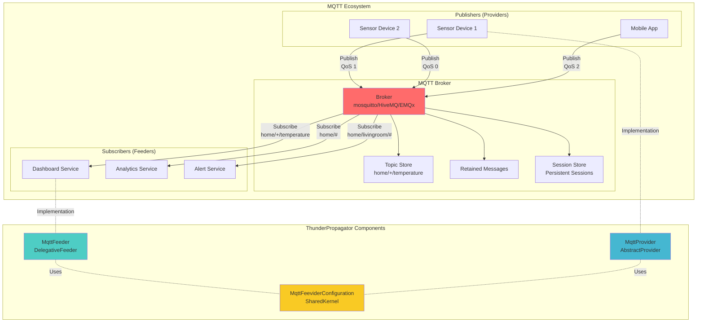

# MQTT Messaging System

## Overview

MQTT (Message Queuing Telemetry Transport) is a lightweight, publish-subscribe messaging protocol designed for constrained devices and low-bandwidth, high-latency, or unreliable networks. Widely adopted in IoT (Internet of Things), MQTT provides efficient, battery-conserving communication ideal for sensor networks, mobile applications, and embedded systems.

The ThunderPropagator MQTT integration delivers enterprise-grade MQTT capabilities with:
- **Protocol Support**: MQTT 3.1.1 and MQTT 5.0
- **Quality of Service**: QoS 0 (at-most-once), QoS 1 (at-least-once), QoS 2 (exactly-once)
- **Session Management**: Clean vs persistent sessions for offline message queuing
- **Advanced Features**: Last Will Testament (LWT), retained messages, topic wildcards
- **Security**: TLS/SSL encryption, username/password authentication, client certificates
- **Client Library**: Built on MQTTnet (high-performance .NET MQTT library)

### MQTT vs Other Protocols

| Feature | MQTT | Kafka | RabbitMQ | NATS |
|---------|------|-------|----------|------|
| **Primary Use Case** | IoT, sensors, mobile | Event streaming, analytics | Enterprise messaging | Cloud-native microservices |
| **Protocol Overhead** | Very low (~2 bytes header) | Medium | Medium | Low |
| **Delivery Guarantees** | QoS 0/1/2 | At-least-once | At-least-once, Exactly-once | At-most-once (JetStream adds persistence) |
| **Persistent Storage** | Optional (sessions) | Yes (log-based) | Yes (durable queues) | Optional (JetStream streams) |
| **Topic Wildcards** | `+` (single), `#` (multi) | No | Routing keys with `*`, `#` | `*` (single), `>` (multi) |
| **Network Efficiency** | Excellent (designed for constrained networks) | Good | Good | Excellent |
| **Battery Optimization** | Yes (keep-alive, QoS 0) | No | No | No |

## Architecture



## Key Features

### 1. Quality of Service (QoS) Levels

MQTT provides three levels of message delivery guarantees:

| QoS Level | Name | Guarantee | Use Case | Overhead |
|-----------|------|-----------|----------|----------|
| **QoS 0** | At most once | Fire-and-forget, no acknowledgment | Temperature readings, telemetry | Lowest |
| **QoS 1** | At least once | Acknowledged, possible duplicates | Command execution, notifications | Medium |
| **QoS 2** | Exactly once | 4-way handshake, no duplicates | Financial transactions, billing | Highest |

**QoS 0 Flow**:
```
Publisher → PUBLISH → Broker → PUBLISH → Subscriber
```

**QoS 1 Flow**:
```
Publisher → PUBLISH → Broker → PUBACK → Publisher
Broker → PUBLISH → Subscriber → PUBACK → Broker
```

**QoS 2 Flow**:
```
Publisher → PUBLISH → Broker → PUBREC → Publisher
Publisher → PUBREL → Broker → PUBCOMP → Publisher
Broker → PUBLISH → Subscriber → PUBREC → Broker
Broker → PUBREL → Subscriber → PUBCOMP → Broker
```

### 2. Topic Hierarchies & Wildcards

MQTT topics use hierarchical structure with `/` separators:

```
home/livingroom/temperature
home/livingroom/humidity
home/bedroom/temperature
home/kitchen/light/status
```

**Wildcard Subscriptions**:
- **`+` (Single-level)**: Matches one level
  - `home/+/temperature` → matches `home/livingroom/temperature`, `home/bedroom/temperature`
  - Does NOT match `home/livingroom/sensor1/temperature` (too many levels)
- **`#` (Multi-level)**: Matches zero or more levels (must be last)
  - `home/#` → matches all topics under `home/`
  - `home/livingroom/#` → matches `home/livingroom/temperature`, `home/livingroom/light/status`

### 3. Last Will Testament (LWT)

Broker-published message when client disconnects ungracefully (e.g., network failure, crash):

```csharp
// Configure LWT during connection
config.Topic = "devices/status";
config.Payload = "offline";
config.QualityOfServiceLevel = MqttQualityOfServiceLevel.AtLeastOnce;
config.Retain = true;
config.DelayInterval = 5; // MQTT 5.0: delay 5 seconds before publishing LWT
```

**Use Cases**:
- Device online/offline status monitoring
- Session disconnection alerts
- Automated failover triggers

### 4. Retained Messages

Broker stores the last message published with `Retain=true`:

```csharp
// Publish retained message (latest sensor reading)
var message = new MySensorMessage 
{ 
    Temperature = 22.5,
    Timestamp = DateTime.UtcNow 
};
await provider.ExecuteAsync(message); // Retain=true in config

// New subscribers immediately receive latest value
```

**Use Cases**:
- Current sensor state (latest temperature, humidity)
- Device configuration snapshots
- Status flags (online/offline)

### 5. Persistent Sessions (Clean Session Flag)

**Clean Session = true** (MQTT 3.1.1) / **Clean Start = true** (MQTT 5.0):
- Broker discards session state on disconnect
- No message queuing while offline
- Lightweight, ideal for always-connected clients

**Clean Session = false** / **Clean Start = false**:
- Broker stores session state (subscriptions, QoS 1/2 queued messages)
- Messages delivered when client reconnects
- Ideal for intermittent connectivity (mobile devices, sensors)

```csharp
// Persistent session configuration
config.CleanSession = false; // MQTT 3.1.1
config.SessionExpiryInterval = 3600; // MQTT 5.0: 1-hour session expiry
```

### 6. MQTT 5.0 Enhancements

MQTT 5.0 adds enterprise features while maintaining backward compatibility:

| Feature | Description | Use Case |
|---------|-------------|----------|
| **User Properties** | Key-value metadata pairs | Custom headers, correlation IDs |
| **Response Topic** | Topic for request/response pattern | RPC-style communication |
| **Correlation Data** | Link requests to responses | Async request tracking |
| **Message Expiry** | TTL for time-sensitive messages | Event expiration, stale data prevention |
| **Topic Aliases** | Numeric shortcuts for long topics | Bandwidth optimization |
| **Reason Codes** | Detailed error information | Enhanced debugging |
| **Server Keep-Alive** | Broker overrides client setting | Network optimization |
| **Session Expiry Interval** | Flexible session lifetime | Replace Clean Session flag |

## Projects

The MQTT integration consists of three interconnected projects:

| Project | Description | Documentation |
|---------|-------------|---------------|
| **[Feeders.Mqtt](Feeders.Mqtt/README.md)** | Message consumption (subscriber) using DelegativeFeeder | Push-based event-driven consumption |
| **[Providers.DotNet.Mqtt](Providers.DotNet.Mqtt/README.md)** | Message publishing (publisher) using AbstractProvider | Outbound message delivery with QoS |
| **[Feeviders.Mqtt.SharedKernel](Feeviders.Mqtt.SharedKernel/README.md)** | Shared configuration, models, utilities | Common MQTT configuration and message abstractions |

### Component Relationships

```
Application Code
    ↓
Feeders.Mqtt (Subscribe) ←→ SharedKernel (Config/Models) ←→ Providers.DotNet.Mqtt (Publish)
    ↓                                                              ↓
MQTTnet Library                                              MQTTnet Library
    ↓                                                              ↓
MQTT Broker (mosquitto, HiveMQ, EMQx)
```

## Quick Start

### Basic Publisher (Provider)

```csharp
// 1. Define message model
public class TemperatureMessage : MqttProviderMessage
{
    public string SensorId { get; set; } = null!;
    public double Temperature { get; set; }
    public DateTime Timestamp { get; set; }
}

// 2. Configure provider
public class TemperatureProviderConfig : MqttProviderConfiguration
{
    // Configured via appsettings.json
}

// appsettings.json
{
  "Mqtt": {
    "Host": "mqtt.example.com",
    "Port": 1883,
    "ClientId": "temperature-publisher",
    "Topic": "home/livingroom/temperature",
    "QualityOfServiceLevel": 1, // At-least-once
    "Retain": true, // Retain latest reading
    "SerializerType": "Json"
  }
}

// 3. Register provider
services.AddMqttProvider<TemperatureMessage, TemperatureProviderConfig>(
    configuration, "Mqtt");

// 4. Publish messages
public class SensorService
{
    private readonly IProvider<TemperatureMessage> _provider;

    public SensorService(IProvider<TemperatureMessage> provider)
    {
        _provider = provider;
    }

    public async Task PublishReadingAsync()
    {
        var message = new TemperatureMessage
        {
            SensorId = "sensor-001",
            Temperature = 22.5,
            Timestamp = DateTime.UtcNow
        };

        await _provider.ExecuteAsync(message);
    }
}
```

### Basic Subscriber (Feeder)

```csharp
// 1. Define message model
public class TemperatureMessage : MqttFeederMessage
{
    public string SensorId { get; set; } = null!;
    public double Temperature { get; set; }
    public DateTime Timestamp { get; set; }
}

// 2. Configure feeder
public class TemperatureFeederConfig : MqttFeederConfiguration
{
    // Configured via appsettings.json
}

// appsettings.json
{
  "Mqtt": {
    "Host": "mqtt.example.com",
    "Port": 1883,
    "ClientId": "temperature-subscriber",
    "Topic": "home/+/temperature", // Wildcard: all rooms
    "QualityOfServiceLevel": 1,
    "CleanSession": false, // Persistent session
    "SerializerType": "Json"
  }
}

// 3. Implement handler
public class TemperatureChannel : Channel<TemperatureChannel>
{
}

public class TemperatureHandler : IFeederHandler<TemperatureChannel, TemperatureMessage>
{
    private readonly ILogger<TemperatureHandler> _logger;

    public TemperatureHandler(ILogger<TemperatureHandler> logger)
    {
        _logger = logger;
    }

    public async Task HandleAsync(TemperatureMessage message, CancellationToken cancellationToken)
    {
        _logger.LogInformation(
            "Temperature reading: {SensorId} = {Temperature}°C at {Timestamp}",
            message.SensorId, message.Temperature, message.Timestamp);

        // Process temperature reading
        if (message.Temperature > 30)
        {
            _logger.LogWarning("High temperature alert: {Temperature}°C", message.Temperature);
        }

        await Task.CompletedTask;
    }
}

// 4. Register feeder
services.AddMqttFeeder<TemperatureChannel, TemperatureMessage, TemperatureFeederConfig>(
    configuration, "Mqtt");
```

## MQTT Concepts

### Topic Design Best Practices

**Hierarchical Structure**:
```
{namespace}/{location}/{device}/{sensor}/{metric}

Examples:
  factory/zone1/machine5/temperature
  retail/store12/pos3/transaction
  home/livingroom/light/status
```

**Recommendations**:
- Use lowercase letters
- Avoid special characters (except `-`, `_`)
- Keep depth reasonable (3-5 levels)
- Start specific, generalize with wildcards
- Avoid leading/trailing slashes

**Anti-patterns**:
```
// ❌ Too generic
data/sensor

// ❌ Too deep
company/division/department/team/project/service/instance/metric

// ❌ Mixed case (topics are case-sensitive)
Home/LivingRoom/Temperature vs home/livingroom/temperature

// ❌ Special characters
home/living room/temp  // space
home/living$room/temp  // $
```

### Session Management Strategies

| Scenario | Clean Session | Session Expiry | Rationale |
|----------|---------------|----------------|-----------|
| **Always-connected server** | true | N/A | No offline queuing needed, lower overhead |
| **Mobile app** | false | 1 hour | Handle network drops, queue messages while backgrounded |
| **IoT sensor (periodic)** | false | 24 hours | Long sleep intervals, resume on wake |
| **Ephemeral client** | true | N/A | One-time connection, no state persistence |

### Keep-Alive Tuning

Keep-alive prevents broker from closing idle connections:

```csharp
config.KeepAlivePeriod = TimeSpan.FromSeconds(30); // Ping broker every 30s
config.NoKeepAlive = false; // Enable keep-alive
```

**Guidelines**:
- **Low-latency networks**: 30-60 seconds
- **High-latency/unstable networks**: 120-300 seconds
- **Battery-powered devices**: Higher values to reduce overhead
- **Critical connections**: Lower values for faster disconnection detection

### Security Considerations

**Transport Layer Security (TLS/SSL)**:
```csharp
config.TlsOptions = new MqttClientTlsOptions
{
    UseTls = true,
    CertificateValidationHandler = context =>
    {
        // Validate server certificate
        return context.Certificate.Subject == "CN=mqtt.example.com";
    },
    Certificates = new[] { clientCertificate }, // Client certificate (mutual TLS)
    SslProtocol = System.Security.Authentication.SslProtocols.Tls12 | System.Security.Authentication.SslProtocols.Tls13
};
```

**Authentication**:
```csharp
// Username/password
config.Username = "mqtt-user";
config.Password = "secure-password";

// Enhanced authentication (MQTT 5.0)
config.EnhancedAuthenticationMethod = "SCRAM-SHA-256";
config.EnhancedAuthenticationData = "auth-token-base64";
```

## Performance Characteristics

### QoS Overhead Comparison

| QoS | Messages/Sec (Single Client) | Latency (ms) | Bandwidth Overhead |
|-----|------------------------------|--------------|-------------------|
| **QoS 0** | 100,000+ | <1 | Minimal (2-byte header) |
| **QoS 1** | 50,000-70,000 | 1-3 | +4 bytes (PUBACK) |
| **QoS 2** | 20,000-30,000 | 3-10 | +12 bytes (PUBREC, PUBREL, PUBCOMP) |

*Benchmarks: Single-threaded client, local mosquitto broker, 100-byte payload*

### Payload Size Optimization

**MQTT Header Sizes**:
- **Fixed Header**: 2 bytes (minimum)
- **Variable Header**: Topic length + 2 bytes + properties (MQTT 5.0)
- **Payload**: Your message content

**Example**:
```
Topic: "home/livingroom/temperature" (27 bytes)
Payload: {"temp": 22.5} (14 bytes)
Total: ~45 bytes (including headers)

vs Kafka minimum: ~100 bytes (with metadata)
vs HTTP POST: ~200+ bytes (headers)
```

### Connection Pooling

For high-throughput publishers:
```csharp
// Single persistent connection per provider instance
// Shared across multiple ExecuteAsync() calls
services.AddSingleton<IProvider<MyMessage>>(...); // Reuses connection
```

## Use Cases

### IoT Sensor Networks
- **Temperature/humidity monitoring**: QoS 0, retained messages
- **Device status**: QoS 1, Last Will Testament
- **Firmware updates**: QoS 2 (exactly-once)

### Mobile Applications
- **Push notifications**: QoS 1, persistent sessions
- **Location tracking**: QoS 0 (frequent updates)
- **Chat messages**: QoS 1 or QoS 2 (depending on criticality)

### Industrial Automation
- **Equipment telemetry**: QoS 0, high-frequency sampling
- **Control commands**: QoS 2, exactly-once guarantees
- **Alarm events**: QoS 1, retained messages

### Smart Home
- **Sensor readings**: QoS 0, topic hierarchies (`home/+/temperature`)
- **Device control**: QoS 1, response topics (MQTT 5.0)
- **Status updates**: QoS 1, retained messages

## Broker Compatibility

The ThunderPropagator MQTT implementation (via MQTTnet) is compatible with:

| Broker | MQTT 3.1.1 | MQTT 5.0 | Notes |
|--------|-----------|----------|-------|
| **mosquitto** | ✅ | ✅ (v2.0+) | Lightweight, open-source, popular for IoT |
| **HiveMQ** | ✅ | ✅ | Enterprise-grade, clustering, plugins |
| **EMQx** | ✅ | ✅ | High-performance, distributed, 10M+ connections |
| **AWS IoT Core** | ✅ | ❌ | Managed service, AWS integration |
| **Azure IoT Hub** | ✅ | ❌ | Managed service, Azure integration |
| **VerneMQ** | ✅ | ✅ (partial) | Distributed, Erlang-based |
| **RabbitMQ (plugin)** | ✅ | ❌ | MQTT plugin for RabbitMQ broker |

## Additional Resources

### Documentation
- [Feeders.Mqtt README](Feeders.Mqtt/README.md) — Detailed subscriber implementation guide
- [Providers.DotNet.Mqtt README](Providers.DotNet.Mqtt/README.md) — Publisher configuration and patterns
- [Feeviders.Mqtt.SharedKernel README](Feeviders.Mqtt.SharedKernel/README.md) — Shared configuration reference

### External References
- [MQTT 3.1.1 Specification](https://docs.oasis-open.org/mqtt/mqtt/v3.1.1/mqtt-v3.1.1.html)
- [MQTT 5.0 Specification](https://docs.oasis-open.org/mqtt/mqtt/v5.0/mqtt-v5.0.html)
- [MQTTnet Documentation](https://github.com/dotnet/MQTTnet)
- [mosquitto Broker](https://mosquitto.org/)
- [HiveMQ Documentation](https://www.hivemq.com/docs/)

---

**Next Steps**:
1. Review [Feeders.Mqtt](Feeders.Mqtt/README.md) for subscriber implementation patterns
2. Explore [Providers.DotNet.Mqtt](Providers.DotNet.Mqtt/README.md) for publisher configuration
3. Configure [SharedKernel](Feeviders.Mqtt.SharedKernel/README.md) for advanced connection options
