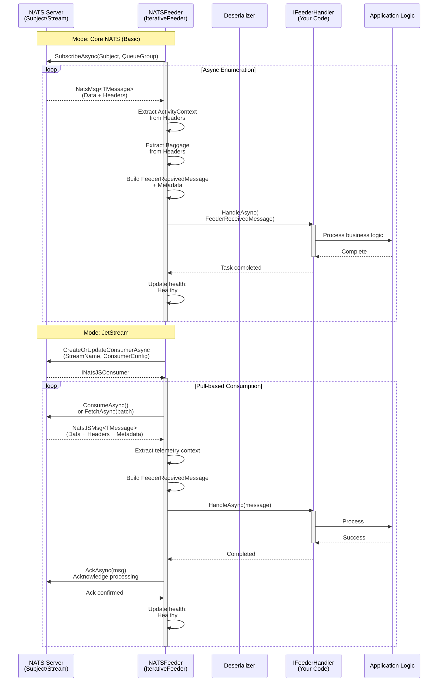

# ThunderPropagator.Feeders.NATS

> NATS Message Consumer - Receives and processes inbound messages from NATS subjects and JetStream streams

[◂ Back to NATS](../README.md) | [◂ Back to Documentation](../../README.md)

## Contents

- [Overview](#overview)
- [Architecture](#architecture)
- [Files](#files)
- [Configuration](#configuration)
- [Dependencies](#dependencies)
- [API Reference](#api-reference)
- [Examples](#examples)
- [Advanced Patterns](#advanced-patterns)
- [Best Practices](#best-practices)
- [Troubleshooting](#troubleshooting)
- [See Also](#see-also)

## Overview

**Type**: Message Consumer (Feeder)  
**Target Frameworks**: .NET 8, 9, 10  
**Package**: ThunderPropagator.Feeders.NATS

The NATS Feeder is an **IterativeFeeder** implementation that provides high-performance message consumption from both Core NATS (basic pub/sub) and JetStream (persistent streams). It follows a pull-based consumption model with comprehensive error handling, subject-based routing, health monitoring, and distributed tracing support.

### Key Features

- ✅ **Dual Mode Support**: Core NATS (fire-and-forget) and JetStream (persistent streaming)
- ✅ **Subject Wildcards**: Subscribe with `*` (single token) or `>` (multi-token) patterns
- ✅ **Queue Groups**: Load-balanced distribution across consumers (Core NATS)
- ✅ **Pull-Based Consumption**: Client-controlled backpressure with FetchAsync (JetStream)
- ✅ **Durable Consumers**: Resume from last acknowledged position (JetStream)
- ✅ **Automatic Acknowledgments**: Configurable ack after processing (JetStream)
- ✅ **Multiple Serialization**: JSON, Newtonsoft.Json, NetJSON support
- ✅ **OpenTelemetry Integration**: Built-in W3C Trace Context and Baggage propagation
- ✅ **Health Monitoring**: Real-time connection and stream health reporting
- ✅ **Async Iteration**: IAsyncEnumerable for efficient message streaming
- ✅ **Message Enrichment**: Optional C# script-based message transformation

## Architecture



## Files

**Total**: 4 C# source files (excluding AssemblyInfo)

| File | LOC | Responsibility |
|------|-----|----------------|
| [NatsFeeder.cs](../../../Feeviders/NATS/ThunderPropagator.Feeders.NATS/NatsFeeder.cs) | ~105 | Main feeder implementation - manages Core NATS and JetStream consumption, health monitoring, OpenTelemetry context extraction |
| [NatsFeederConfiguration.cs](../../../Feeviders/NATS/ThunderPropagator.Feeders.NATS/NatsFeederConfiguration.cs) | ~87 | Configuration class - extends AbstractNatsFeevidersConfiguration with feeder-specific settings (subject, consumer config, serialization) |
| [NatsFeederMessage.cs](../../../Feeviders/NATS/ThunderPropagator.Feeders.NATS/NatsFeederMessage.cs) | ~5 | Abstract message base class - provides type safety for NATS messages |
| [NatsFeederExtensions.cs](../../../Feeviders/NATS/ThunderPropagator.Feeders.NATS/NatsFeederExtensions.cs) | ~52 | DI registration extensions - AddNatsFeeder, AddNatsFeederResolver, UseNatsFeederResolver |

### Key Implementation Details

#### NatsFeeder.cs

```csharp
internal sealed class NatsFeeder<TChannel, TNatsFeederMessage, TNatsFeederConfiguration> 
    : IterativeFeeder<TChannel, TNatsFeederMessage, TNatsFeederConfiguration>
    where TChannel : class, IChannel
    where TNatsFeederMessage : NatsFeederMessage
    where TNatsFeederConfiguration : NatsFeederConfiguration
{
    private readonly INatsClient _client;
    private INatsJSConsumer? _natsJsConsumer;
    private readonly Task? _jetStreamInitTask;
    
    // Async initialization for JetStream consumer
    private async Task InitializeJetStreamConsumerAsync(CancellationToken cancellationToken)
    {
        _natsJsConsumer = await _client.CreateJetStreamContext()
            .CreateOrUpdateConsumerAsync(
                FeederConfiguration.StreamName!,
                FeederConfiguration.ConsumerConfig!,
                cancellationToken);
    }
    
    // Main consumption loop - returns IAsyncEnumerable for streaming
    protected override async IAsyncEnumerable<FeederReceivedMessage<TNatsFeederMessage>> 
        ReceiveAsync([EnumeratorCancellation] CancellationToken cancellationToken)
    {
        switch (FeederConfiguration.MessagingType)
        {
            case MessagingType.Basic:
                // Core NATS: fire-and-forget pub/sub
                await foreach (var message in _client.SubscribeAsync<TNatsFeederMessage>(
                    FeederConfiguration.Subject,
                    queueGroup: FeederConfiguration.QueueGroup,
                    cancellationToken: cancellationToken))
                {
                    if (message.Data != null)
                        yield return MessageConsumed(message.Data, message.Headers);
                }
                break;
                
            case MessagingType.JetStream:
                // JetStream: persistent, acknowledged consumption
                await _jetStreamInitTask!;  // Ensure consumer initialized
                
                await foreach (var message in _natsJsConsumer!.ConsumeAsync<TNatsFeederMessage>(
                    cancellationToken: cancellationToken))
                {
                    if (message.Data != null)
                        yield return MessageConsumed(message.Data, message.Headers);
                    
                    // Automatic acknowledgment after processing
                    await message.AckAsync(cancellationToken: cancellationToken);
                }
                break;
        }
    }
    
    // Extract OpenTelemetry context from message headers
    private FeederReceivedMessage<TNatsFeederMessage> MessageConsumed(
        TNatsFeederMessage message, NatsHeaders? headers)
    {
        ActivityContext? activityContext = null;
        if (headers?.TryGetValue(nameof(ActivityContext), out var activityContextStr) == true)
            activityContext = activityContextStr.ToString().FromNJsonBase64<ActivityContext>();
        
        Baggage? baggage = null;
        if (headers?.TryGetValue(nameof(Baggage), out var baggageStr) == true)
            baggage = baggageStr.ToString().FromNJsonBase64<Baggage>();
        
        return new FeederReceivedMessage<TNatsFeederMessage>(
            message, activityContext, baggage);
    }
}
```

**Key Design Decisions**:
- **IterativeFeeder**: Pull-based consumption with IAsyncEnumerable
- **Dual Mode**: Switch between Core NATS and JetStream via MessagingType enum
- **Lazy Initialization**: JetStream consumer created asynchronously in background task
- **Health Tracking**: Sets HealthName as `feeder_NATS_{Subject}_{ConsumerName}`
- **OpenTelemetry**: Extracts ActivityContext and Baggage from message headers
- **Auto-Ack**: Automatic acknowledgment after HandleAsync completes (JetStream)

#### NatsFeederConfiguration.cs

```csharp
public abstract class NatsFeederConfiguration : AbstractNatsFeevidersConfiguration, 
    IAbstractFeederConfiguration
{
    // Feeder lifecycle
    public Guid Id { get; set; }                    // Unique feeder identifier
    public string? EnrichmentScript { get; set; }   // C# script for transformation
    public string[]? MetadataReferences { get; set; } // Script assembly refs
    
    // Core NATS properties
    public string Subject { get; set; }             // Subject pattern (required)
    public string? QueueGroup { get; set; }         // Queue group for load balancing
    public int? MaxMsgs { get; set; }               // Max messages to receive
    public TimeSpan? Timeout { get; set; }          // Subscription timeout
    public TimeSpan? IdleTimeout { get; set; }      // Idle timeout
    
    // JetStream properties
    public string? StreamName { get; set; }         // Stream name (required for JetStream)
    public ConsumerConfig? ConsumerConfig { get; set; } // Consumer configuration
    
    // Advanced options
    public NatsSubChannelOpts? ChannelOpts { get; set; }  // Subscription channel options
    public NatsSvcConfig? NatsSvcConfig { get; set; }     // Service configuration
    
    // Inherited from AbstractNatsFeevidersConfiguration:
    // Url, Name, AuthOpts, TlsOpts, MessagingType, SerializerType, etc.
}
```

## Configuration

### Installation

```bash
# Add GitHub Packages source (one-time setup)
dotnet nuget add source https://nuget.pkg.github.com/KiarashMinoo/index.json \
  -n github -u YOUR_USERNAME -p YOUR_GITHUB_TOKEN --store-password-in-clear-text

# Install package
dotnet add package ThunderPropagator.Feeders.NATS
```

### Registration

```csharp
// Startup.cs or Program.cs
public void ConfigureServices(IServiceCollection services)
{
    // Define your channel
    services.AddSingleton<OrderChannel>();
    
    // Register handler
    services.AddScoped<IFeederHandler<OrderChannel, OrderMessage>, OrderMessageHandler>();
    
    // Register NATS feeder
    services.AddNatsFeeder<OrderChannel, OrderMessage, OrderFeederConfiguration>(
        configuration, "Messaging:NATS:Orders");
}
```

### Configuration Properties

#### Core NATS Configuration (appsettings.json)

```json
{
  "Messaging": {
    "NATS": {
      "Orders": {
        "IsEnabled": true,
        "Url": "nats://localhost:4222",
        "Name": "OrderConsumer",
        "MessagingType": 0,  // 0 = Basic (Core NATS)
        "Subject": "orders.created",
        "QueueGroup": "order-processors",
        "SerializerType": 0,  // 0 = Json, 1 = NJson, 2 = NetJson
        "MaxMsgs": 1000,
        "Timeout": "00:01:00",
        "IdleTimeout": "00:00:30"
      }
    }
  }
}
```

#### JetStream Configuration (appsettings.json)

```json
{
  "Messaging": {
    "NATS": {
      "Orders": {
        "IsEnabled": true,
        "Url": "nats://localhost:4222",
        "Name": "OrderProcessor",
        "MessagingType": 1,  // 1 = JetStream
        "Subject": "orders.created",
        "StreamName": "ORDERS",
        "SerializerType": 0,
        "ConsumerConfig": {
          "Name": "order-processor",
          "DurableName": "order-processor-durable",
          "Description": "Processes order creation events",
          "AckPolicy": 1,  // 1 = Explicit (manual ack)
          "DeliverPolicy": 0,  // 0 = All (start from beginning)
          "MaxDeliver": 5,
          "AckWait": 30000000000,  // 30 seconds (nanoseconds)
          "MaxAckPending": 1000,
          "FilterSubjects": ["orders.created", "orders.updated"],
          "ReplayPolicy": 0,  // 0 = Instant
          "MaxBatch": 100,
          "MaxBytes": 1048576,
          "MaxExpires": 5000000000,  // 5 seconds (nanoseconds)
          "InactiveThreshold": 300000000000  // 5 minutes (nanoseconds)
        }
      }
    }
  }
}
```

### Configuration Reference

#### NatsFeederConfiguration Properties

| Property | Type | Default | Description |
|----------|------|---------|-------------|
| **Id** | `Guid` | `Guid.NewGuid()` | Unique feeder identifier |
| **IsEnabled** | `bool` | `false` | Feature flag for feeder |
| **Subject** | `string` | *(required)* | NATS subject pattern (e.g., `orders.created`, `telemetry.*`) |
| **QueueGroup** | `string?` | `null` | Queue group name for load balancing (Core NATS only) |
| **MessagingType** | `MessagingType` | `Basic` | `Basic` (Core NATS) or `JetStream` |
| **StreamName** | `string?` | `null` | JetStream stream name (required for JetStream) |
| **ConsumerConfig** | `ConsumerConfig?` | `null` | JetStream consumer configuration |
| **SerializerType** | `SerializerType` | `Json` | `Json`, `NJson`, or `NetJson` |
| **EnrichmentScript** | `string?` | `null` | C# script for message enrichment |
| **MetadataReferences** | `string[]?` | `null` | Assembly references for enrichment script |
| **MaxMsgs** | `int?` | `null` | Maximum messages to consume |
| **Timeout** | `TimeSpan?` | `null` | Subscription timeout |
| **IdleTimeout** | `TimeSpan?` | `null` | Idle timeout before unsubscribe |

#### ConsumerConfig Properties (JetStream)

| Property | Type | Description |
|----------|------|-------------|
| **Name** | `string` | Consumer name (required) |
| **DurableName** | `string?` | Durable name - enables persistence across disconnects |
| **Description** | `string?` | Human-readable description |
| **AckPolicy** | `AckPolicy` | `Explicit` (manual), `All` (batch), `None` (no acks) |
| **DeliverPolicy** | `DeliverPolicy` | `All`, `Last`, `New`, `ByStartSequence`, `ByStartTime` |
| **OptStartSeq** | `ulong?` | Starting sequence number (for `ByStartSequence`) |
| **OptStartTime** | `DateTime?` | Starting timestamp (for `ByStartTime`) |
| **AckWait** | `TimeSpan` | Time to wait for ack before redelivery (default: 30s) |
| **MaxDeliver** | `int` | Max redelivery attempts (default: unlimited) |
| **MaxAckPending** | `int` | Max unacknowledged messages (default: 1000) |
| **FilterSubjects** | `string[]?` | Subject filter for consumer (e.g., `["orders.created"]`) |
| **ReplayPolicy** | `ReplayPolicy` | `Instant` (as fast as possible) or `Original` (original timing) |
| **MaxBatch** | `int` | Max messages per pull (default: 100) |
| **MaxBytes** | `long` | Max bytes per pull (default: 1MB) |
| **MaxExpires** | `TimeSpan` | Max wait time for pull request (default: 5s) |
| **InactiveThreshold** | `TimeSpan` | Ephemeral consumer deletion threshold (default: 5min) |
| **Replicas** | `int` | Consumer replica count for HA (default: 1) |
| **MemoryStorage** | `bool` | Use memory storage instead of file (default: false) |

#### Inherited Connection Properties (from AbstractNatsFeevidersConfiguration)

| Property | Type | Default | Description |
|----------|------|---------|-------------|
| **Url** | `string` | `nats://localhost:4222` | NATS server URL |
| **Name** | `string` | `NATS .NET Client` | Client connection name |
| **AuthOpts** | `NatsAuthOpts` | `Default` | Authentication (token, user/pass, JWT, NKey) |
| **TlsOpts** | `NatsTlsOpts` | `Default` | TLS/SSL configuration |
| **PingInterval** | `TimeSpan` | `2min` | Ping interval for keepalive |
| **MaxPingOut** | `int` | `2` | Max unanswered pings before disconnect |
| **ConnectTimeout** | `TimeSpan` | `2s` | Connection timeout |
| **ReconnectWaitMin** | `TimeSpan` | `2s` | Min wait before reconnect |
| **ReconnectWaitMax** | `TimeSpan` | `5s` | Max wait before reconnect |
| **MaxReconnectRetry** | `int` | `-1` | Max reconnect attempts (-1 = unlimited) |

## Dependencies

### NuGet Packages

| Package | Version | Purpose |
|---------|---------|---------|
| **NATS.Net** | Latest | Official NATS .NET client with JetStream support |
| **NATS.Client.Core** | Latest | Core NATS client functionality |
| **NATS.Client.JetStream** | Latest | JetStream extensions and models |
| **ThunderPropagator** | 1.0.1 | Core framework abstractions |
| **ThunderPropagator.BuildingBlocks** | 1.0.1 | Shared utilities and helpers |
| **ThunderPropagator.Feeviders.NATS.SharedKernel** | 1.0.1 | NATS-specific utilities and serializers |
| **OpenTelemetry.Api** | Latest | Distributed tracing and context propagation |
| **Microsoft.Extensions.DependencyInjection** | Latest | Dependency injection |
| **Microsoft.Extensions.Logging** | Latest | Logging abstractions |
| **Microsoft.Extensions.Hosting** | Latest | Background service hosting |

### Project References

```xml
<ItemGroup>
  <PackageReference Include="NATS.Net" />
  <PackageReference Include="OpenTelemetry.Api" />
  <ProjectReference Include="..\..\SharedKernel\ThunderPropagator.Feeders.SharedKernel" />
  <ProjectReference Include="..\ThunderPropagator.Feeviders.NATS.SharedKernel" />
</ItemGroup>
```

## API Reference

### NatsFeeder<TChannel, TNatsFeederMessage, TNatsFeederConfiguration>

**Namespace**: `ThunderPropagator.Feeders.NATS`

**Base Class**: `IterativeFeeder<TChannel, TNatsFeederMessage, TNatsFeederConfiguration>`

```csharp
internal sealed class NatsFeeder<TChannel, TNatsFeederMessage, TNatsFeederConfiguration>
    where TChannel : class, IChannel
    where TNatsFeederMessage : NatsFeederMessage
    where TNatsFeederConfiguration : NatsFeederConfiguration
```

#### Constructor

```csharp
public NatsFeeder(
    TChannel channel,
    TNatsFeederConfiguration feederConfiguration,
    IFeederHandler<TChannel, TNatsFeederMessage> feederHandler,
    IServiceProvider serviceProvider)
```

#### Protected Methods

```csharp
// Main consumption loop - yields messages as they arrive
protected override IAsyncEnumerable<FeederReceivedMessage<TNatsFeederMessage>> 
    ReceiveAsync(CancellationToken cancellationToken);

// Cleanup NATS client on disposal
protected override ValueTask DisposeManagedResourcesAsync();
```

### NatsFeederMessage

**Namespace**: `ThunderPropagator.Feeders.NATS`

**Base Class**: `FeederMessage`

```csharp
public abstract class NatsFeederMessage : FeederMessage;
```

Abstract base class for all NATS feeder messages. Inherit from this to define your message types:

```csharp
public class OrderCreatedMessage : NatsFeederMessage
{
    public string OrderId { get; set; }
    public decimal Amount { get; set; }
    public DateTime CreatedAt { get; set; }
}
```

### NatsFeederConfiguration

**Namespace**: `ThunderPropagator.Feeders.NATS`

**Base Class**: `AbstractNatsFeevidersConfiguration`

**Implements**: `IAbstractFeederConfiguration`

```csharp
public abstract class NatsFeederConfiguration : AbstractNatsFeevidersConfiguration, 
    IAbstractFeederConfiguration
{
    public Guid Id { get; set; }
    public string? EnrichmentScript { get; set; }
    public string[]? MetadataReferences { get; set; }
    public string Subject { get; set; }
    public string? QueueGroup { get; set; }
    public string? StreamName { get; set; }
    public ConsumerConfig? ConsumerConfig { get; set; }
    // ... (see Configuration Reference for full list)
}
```

### Extension Methods

**Namespace**: `ThunderPropagator.Feeders.NATS`

#### AddNatsFeeder

```csharp
public static IServiceCollection AddNatsFeeder<TChannel, TNatsFeederMessage, TNatsFeederConfiguration>(
    this IServiceCollection services,
    IConfigurationRoot configuration,
    string sectionName)
    where TChannel : class, IChannel
    where TNatsFeederMessage : NatsFeederMessage
    where TNatsFeederConfiguration : NatsFeederConfiguration, new()
```

Registers a NATS feeder with configuration binding.

**Example**:
```csharp
services.AddNatsFeeder<OrderChannel, OrderMessage, OrderFeederConfig>(
    configuration, "Messaging:NATS:Orders");
```

#### AddNatsFeederResolver

```csharp
public static IServiceCollection AddNatsFeederResolver<TChannel, TNatsFeederMessage, TNatsFeederConfiguration>(
    this IServiceCollection services)
    where TChannel : class, IChannel
    where TNatsFeederMessage : NatsFeederMessage
    where TNatsFeederConfiguration : NatsFeederConfiguration, new()
```

Registers a resolver for dynamic feeder creation.

**Example**:
```csharp
services.AddNatsFeederResolver<OrderChannel, OrderMessage, OrderFeederConfig>();
```

#### UseNatsFeederResolver

```csharp
public static IApplicationBuilder UseNatsFeederResolver<TChannel, TNatsFeederMessage, TNatsFeederConfiguration>(
    this IApplicationBuilder app,
    Guid channelKey,
    TNatsFeederConfiguration natsFeederConfiguration)
    where TChannel : class, IChannel
    where TNatsFeederMessage : NatsFeederMessage
    where TNatsFeederConfiguration : NatsFeederConfiguration
```

Activates a dynamically configured feeder.

**Example**:
```csharp
app.UseNatsFeederResolver<OrderChannel, OrderMessage, OrderFeederConfig>(
    channelGuid, feederConfig);
```

## Examples

### Example 1: Basic Core NATS Consumption

Simple fire-and-forget message consumption with subject wildcards.

```csharp
// Message definition
public class TelemetryMessage : NatsFeederMessage
{
    public string Sensor { get; set; }
    public double Temperature { get; set; }
    public DateTime Timestamp { get; set; }
}

// Configuration
public class TelemetryFeederConfig : NatsFeederConfiguration
{
    // Override in code or use appsettings.json
}

// Handler
public class TelemetryHandler : IFeederHandler<TelemetryChannel, TelemetryMessage>
{
    private readonly ILogger<TelemetryHandler> _logger;
    
    public TelemetryHandler(ILogger<TelemetryHandler> logger)
    {
        _logger = logger;
    }
    
    public async Task HandleAsync(TelemetryMessage message, CancellationToken cancellationToken)
    {
        _logger.LogInformation(
            "Sensor {Sensor}: {Temperature}°C at {Timestamp}",
            message.Sensor, message.Temperature, message.Timestamp);
        
        // Process telemetry data
        await Task.CompletedTask;
    }
}

// Registration (Startup.cs)
services.AddSingleton<TelemetryChannel>();
services.AddScoped<IFeederHandler<TelemetryChannel, TelemetryMessage>, TelemetryHandler>();
services.AddNatsFeeder<TelemetryChannel, TelemetryMessage, TelemetryFeederConfig>(
    configuration, "Messaging:NATS:Telemetry");

// appsettings.json
{
  "Messaging": {
    "NATS": {
      "Telemetry": {
        "IsEnabled": true,
        "Url": "nats://localhost:4222",
        "MessagingType": 0,  // Basic
        "Subject": "telemetry.sensors.temperature.*",
        "SerializerType": 0  // Json
      }
    }
  }
}
```

### Example 2: Subject Wildcards with Routing

Consume messages from multiple subjects using wildcards.

```csharp
public class EventMessage : NatsFeederMessage
{
    public string EventType { get; set; }
    public string UserId { get; set; }
    public Dictionary<string, object> Metadata { get; set; }
}

public class EventFeederConfig : NatsFeederConfiguration { }

public class EventHandler : IFeederHandler<EventChannel, EventMessage>
{
    public async Task HandleAsync(EventMessage message, CancellationToken cancellationToken)
    {
        // Access subject from Activity tags if needed
        var activity = Activity.Current;
        var subject = activity?.Tags.FirstOrDefault(t => t.Key == "messaging.subject").Value;
        
        // Route based on subject pattern
        if (subject?.StartsWith("events.user") == true)
        {
            // Handle user events
        }
        else if (subject?.StartsWith("events.system") == true)
        {
            // Handle system events
        }
        
        await Task.CompletedTask;
    }
}

// appsettings.json
{
  "Messaging": {
    "NATS": {
      "Events": {
        "IsEnabled": true,
        "Url": "nats://localhost:4222",
        "MessagingType": 0,
        "Subject": "events.>",  // Match all events.* subjects
        "SerializerType": 0
      }
    }
  }
}
```

### Example 3: Queue Group Load Balancing (Core NATS)

Distribute work across multiple consumer instances.

```csharp
public class JobMessage : NatsFeederMessage
{
    public string JobId { get; set; }
    public string JobType { get; set; }
    public Dictionary<string, object> Parameters { get; set; }
}

public class JobFeederConfig : NatsFeederConfiguration { }

public class JobHandler : IFeederHandler<JobChannel, JobMessage>
{
    private readonly ILogger<JobHandler> _logger;
    
    public JobHandler(ILogger<JobHandler> logger)
    {
        _logger = logger;
    }
    
    public async Task HandleAsync(JobMessage message, CancellationToken cancellationToken)
    {
        _logger.LogInformation("Processing job {JobId} of type {JobType}", 
            message.JobId, message.JobType);
        
        // Process job (long-running work)
        await Task.Delay(5000, cancellationToken);
        
        _logger.LogInformation("Completed job {JobId}", message.JobId);
    }
}

// appsettings.json
{
  "Messaging": {
    "NATS": {
      "Jobs": {
        "IsEnabled": true,
        "Url": "nats://localhost:4222",
        "MessagingType": 0,
        "Subject": "jobs.processing",
        "QueueGroup": "job-workers",  // Load balance across instances
        "SerializerType": 0
      }
    }
  }
}

// Deploy multiple instances - each joins the "job-workers" queue group
// NATS distributes messages in round-robin fashion
```

### Example 4: JetStream Durable Consumer

Process critical messages with guaranteed delivery and resume capability.

```csharp
public class OrderMessage : NatsFeederMessage
{
    public string OrderId { get; set; }
    public decimal Amount { get; set; }
    public string CustomerId { get; set; }
    public DateTime CreatedAt { get; set; }
}

public class OrderFeederConfig : NatsFeederConfiguration { }

public class OrderHandler : IFeederHandler<OrderChannel, OrderMessage>
{
    private readonly IOrderService _orderService;
    private readonly ILogger<OrderHandler> _logger;
    
    public OrderHandler(IOrderService orderService, ILogger<OrderHandler> logger)
    {
        _orderService = orderService;
        _logger = logger;
    }
    
    public async Task HandleAsync(OrderMessage message, CancellationToken cancellationToken)
    {
        _logger.LogInformation("Processing order {OrderId} for customer {CustomerId}",
            message.OrderId, message.CustomerId);
        
        try
        {
            await _orderService.ProcessOrderAsync(message, cancellationToken);
            _logger.LogInformation("Successfully processed order {OrderId}", message.OrderId);
        }
        catch (Exception ex)
        {
            _logger.LogError(ex, "Failed to process order {OrderId}", message.OrderId);
            throw;  // Will trigger redelivery
        }
    }
}

// appsettings.json
{
  "Messaging": {
    "NATS": {
      "Orders": {
        "IsEnabled": true,
        "Url": "nats://localhost:4222",
        "MessagingType": 1,  // JetStream
        "Subject": "orders.created",
        "StreamName": "ORDERS",
        "SerializerType": 0,
        "ConsumerConfig": {
          "Name": "order-processor",
          "DurableName": "order-processor-durable",
          "Description": "Processes order creation events",
          "AckPolicy": 1,  // Explicit (manual ack)
          "DeliverPolicy": 0,  // All (start from first message)
          "MaxDeliver": 5,  // Retry up to 5 times
          "AckWait": 30000000000,  // 30 seconds
          "MaxAckPending": 1000,
          "FilterSubjects": ["orders.created"],
          "ReplayPolicy": 0  // Instant
        }
      }
    }
  }
}
```

### Example 5: JetStream with Pull Consumer Batch Processing

Fetch messages in batches for efficient processing.

```csharp
public class AuditLogMessage : NatsFeederMessage
{
    public string EventId { get; set; }
    public string Action { get; set; }
    public string UserId { get; set; }
    public DateTime Timestamp { get; set; }
    public Dictionary<string, object> Details { get; set; }
}

public class AuditFeederConfig : NatsFeederConfiguration { }

public class AuditHandler : IFeederHandler<AuditChannel, AuditLogMessage>
{
    private readonly IAuditRepository _repository;
    private readonly List<AuditLogMessage> _batch = new();
    private const int BatchSize = 100;
    
    public AuditHandler(IAuditRepository repository)
    {
        _repository = repository;
    }
    
    public async Task HandleAsync(AuditLogMessage message, CancellationToken cancellationToken)
    {
        _batch.Add(message);
        
        if (_batch.Count >= BatchSize)
        {
            await _repository.BulkInsertAsync(_batch, cancellationToken);
            _batch.Clear();
        }
    }
}

// appsettings.json
{
  "Messaging": {
    "NATS": {
      "Audit": {
        "IsEnabled": true,
        "Url": "nats://localhost:4222",
        "MessagingType": 1,
        "Subject": "audit.logs",
        "StreamName": "AUDIT_LOGS",
        "SerializerType": 0,
        "ConsumerConfig": {
          "Name": "audit-processor",
          "DurableName": "audit-processor-durable",
          "AckPolicy": 1,
          "DeliverPolicy": 0,
          "MaxBatch": 100,  // Pull 100 messages at a time
          "MaxBytes": 1048576,  // 1MB max per pull
          "MaxExpires": 5000000000,  // 5 second pull timeout
          "AckWait": 60000000000  // 60 seconds
        }
      }
    }
  }
}
```

### Example 6: Message Enrichment with C# Script

Transform messages using enrichment scripts.

```csharp
public class RawEventMessage : NatsFeederMessage
{
    public string EventType { get; set; }
    public Dictionary<string, object> Data { get; set; }
}

// appsettings.json
{
  "Messaging": {
    "NATS": {
      "Events": {
        "IsEnabled": true,
        "Url": "nats://localhost:4222",
        "MessagingType": 0,
        "Subject": "events.raw",
        "SerializerType": 0,
        "EnrichmentScript": "message.Data[\"ProcessedAt\"] = DateTime.UtcNow; message.Data[\"Version\"] = \"2.0\"; return message;",
        "MetadataReferences": ["System.Runtime", "System.Collections"]
      }
    }
  }
}
```

## Advanced Patterns

### Pattern 1: Core NATS vs JetStream Decision Matrix

Choose the right mode for your use case.

| Requirement | Core NATS | JetStream | Notes |
|-------------|-----------|-----------|-------|
| **At-most-once delivery** | ✅ | ❌ | Fire-and-forget, no guarantees |
| **At-least-once delivery** | ❌ | ✅ | Requires explicit acks |
| **Exactly-once delivery** | ❌ | ⚠️ | Requires idempotency + deduplication |
| **Message persistence** | ❌ | ✅ | JetStream stores messages |
| **Replay capability** | ❌ | ✅ | Replay from any point |
| **Ultra-low latency** | ✅ | ❌ | Core NATS < 1ms, JetStream ~5ms |
| **High throughput** | ✅ | ⚠️ | Core NATS 10M+/sec, JetStream 1M+/sec |
| **Message ordering** | ❌ | ✅ | Per-subject ordering guaranteed |
| **Acknowledgments** | ❌ | ✅ | Publisher confirms + consumer acks |

**Decision Guidelines**:

```csharp
// Use Core NATS for:
public class TelemetryFeederConfig : NatsFeederConfiguration
{
    public override MessagingType MessagingType => MessagingType.Basic;
    public override string Subject => "telemetry.sensors.*";
}
// - High-frequency telemetry (OK to lose occasional message)
// - Real-time notifications (transient data)
// - Service discovery heartbeats
// - Request/reply RPC patterns

// Use JetStream for:
public class OrderFeederConfig : NatsFeederConfiguration
{
    public override MessagingType MessagingType => MessagingType.JetStream;
    public override string StreamName => "ORDERS";
    public override ConsumerConfig ConsumerConfig => new()
    {
        DurableName = "order-processor",
        AckPolicy = ConsumerConfigAckPolicy.Explicit
    };
}
// - Critical business transactions (orders, payments)
// - Event sourcing / CQRS
// - Work queues with retries
// - Audit logging / compliance
```

### Pattern 2: Durable vs Ephemeral Consumers (JetStream)

Understand consumer lifecycle and state management.

**Durable Consumer** (Survives Disconnects):
```csharp
public class DurableConsumerConfig : NatsFeederConfiguration
{
    public override string StreamName => "ORDERS";
    public override ConsumerConfig ConsumerConfig => new()
    {
        Name = "order-processor",
        DurableName = "order-processor-durable",  // ✅ Durable
        AckPolicy = ConsumerConfigAckPolicy.Explicit,
        DeliverPolicy = ConsumerConfigDeliverPolicy.All
    };
}

// Behavior:
// - Consumer state persisted on NATS server
// - Resumes from last acknowledged message after restart
// - Multiple instances can share same durable consumer (competing consumers)
// - Ideal for production workloads requiring guaranteed processing

// Use cases:
// ✅ Order processing
// ✅ Payment processing
// ✅ Critical event handlers
```

**Ephemeral Consumer** (Temporary):
```csharp
public class EphemeralConsumerConfig : NatsFeederConfiguration
{
    public override string StreamName => "LOGS";
    public override ConsumerConfig ConsumerConfig => new()
    {
        Name = "log-viewer",
        // No DurableName ❌ = Ephemeral
        AckPolicy = ConsumerConfigAckPolicy.None,  // No acks needed
        DeliverPolicy = ConsumerConfigDeliverPolicy.Last,  // Start from latest
        InactiveThreshold = TimeSpan.FromMinutes(5)  // Auto-delete after 5min
    };
}

// Behavior:
// - Consumer deleted when client disconnects or inactive
// - Starts fresh on reconnect (per DeliverPolicy)
// - Ideal for real-time tailing / monitoring

// Use cases:
// ✅ Log tailing
// ✅ Real-time dashboards
// ✅ Temporary subscriptions
```

### Pattern 3: At-Least-Once Delivery with Idempotency

Guarantee message processing exactly once despite redelivery.

```csharp
public class PaymentMessage : NatsFeederMessage
{
    public string PaymentId { get; set; }  // Idempotency key
    public decimal Amount { get; set; }
    public string AccountId { get; set; }
}

public class PaymentHandler : IFeederHandler<PaymentChannel, PaymentMessage>
{
    private readonly IPaymentService _paymentService;
    private readonly IDistributedCache _cache;
    
    public async Task HandleAsync(PaymentMessage message, CancellationToken cancellationToken)
    {
        var idempotencyKey = $"payment:{message.PaymentId}";
        
        // Check if already processed
        var existing = await _cache.GetStringAsync(idempotencyKey, cancellationToken);
        if (existing != null)
        {
            // Already processed - skip (idempotent)
            return;
        }
        
        try
        {
            // Process payment
            await _paymentService.ProcessPaymentAsync(message, cancellationToken);
            
            // Mark as processed (store for 7 days)
            await _cache.SetStringAsync(idempotencyKey, "processed",
                new DistributedCacheEntryOptions
                {
                    AbsoluteExpirationRelativeToNow = TimeSpan.FromDays(7)
                },
                cancellationToken);
        }
        catch (Exception)
        {
            // Don't cache failures - allow retry
            throw;
        }
    }
}

// Configuration
{
  "ConsumerConfig": {
    "AckPolicy": 1,  // Explicit
    "MaxDeliver": 5,  // Retry up to 5 times
    "AckWait": 30000000000  // 30 seconds
  }
}
```

### Pattern 4: Pull Consumer with Backpressure Control

Control message flow rate for resource-constrained processing.

```csharp
public class ImageProcessingMessage : NatsFeederMessage
{
    public string ImageId { get; set; }
    public string ImageUrl { get; set; }
}

public class ImageFeederConfig : NatsFeederConfiguration
{
    public override ConsumerConfig ConsumerConfig => new()
    {
        Name = "image-processor",
        DurableName = "image-processor",
        AckPolicy = ConsumerConfigAckPolicy.Explicit,
        MaxAckPending = 10,  // ✅ Limit to 10 unacked messages (backpressure)
        MaxBatch = 5,  // Fetch 5 messages at a time
        MaxExpires = TimeSpan.FromSeconds(10),  // Wait up to 10s per pull
        AckWait = TimeSpan.FromMinutes(5)  // 5 minutes to process + ack
    };
}

public class ImageHandler : IFeederHandler<ImageChannel, ImageProcessingMessage>
{
    private readonly IImageService _imageService;
    private readonly SemaphoreSlim _semaphore = new(3);  // Max 3 concurrent
    
    public async Task HandleAsync(ImageProcessingMessage message, CancellationToken cancellationToken)
    {
        await _semaphore.WaitAsync(cancellationToken);
        try
        {
            // CPU/Memory intensive image processing
            await _imageService.ProcessImageAsync(message.ImageUrl, cancellationToken);
        }
        finally
        {
            _semaphore.Release();
        }
    }
}

// Behavior:
// - MaxAckPending = 10 limits in-flight messages
// - MaxBatch = 5 fetches 5 messages per pull
// - Semaphore(3) limits concurrent processing to 3
// - Result: Controlled resource utilization with backpressure
```

### Pattern 5: Subject Hierarchies and Wildcards

Design scalable subject namespaces with wildcard routing.

```csharp
// Subject Hierarchy Design
// Format: <domain>.<entity>.<region>.<action>

// Examples:
// orders.retail.us-east.created
// orders.retail.us-west.created
// orders.wholesale.eu-west.created
// orders.wholesale.eu-north.updated

// Wildcard Patterns:

// 1. Single region monitoring
public class UsEastOrderConfig : NatsFeederConfiguration
{
    public override string Subject => "orders.*.us-east.*";  // All US-East orders
}

// 2. All retail orders
public class RetailOrderConfig : NatsFeederConfiguration
{
    public override string Subject => "orders.retail.>";  // All retail orders globally
}

// 3. All order creations globally
public class OrderCreationConfig : NatsFeederConfiguration
{
    public override string Subject => "orders.*.*.created";  // All order creations
}

// 4. Everything in orders domain
public class AllOrdersConfig : NatsFeederConfiguration
{
    public override string Subject => "orders.>";  // All orders, any depth
}

// Handler with subject routing
public class OrderHandler : IFeederHandler<OrderChannel, OrderMessage>
{
    public async Task HandleAsync(OrderMessage message, CancellationToken cancellationToken)
    {
        // Extract subject from Activity tags
        var activity = Activity.Current;
        var subject = activity?.GetTagItem("messaging.subject")?.ToString();
        
        // Parse subject tokens
        var tokens = subject?.Split('.');  // ["orders", "retail", "us-east", "created"]
        var businessUnit = tokens?[1];     // "retail" or "wholesale"
        var region = tokens?[2];           // "us-east", "eu-west", etc.
        var action = tokens?[3];           // "created", "updated", etc.
        
        // Route based on subject
        if (businessUnit == "retail")
        {
            await ProcessRetailOrderAsync(message, region, cancellationToken);
        }
        else if (businessUnit == "wholesale")
        {
            await ProcessWholesaleOrderAsync(message, region, cancellationToken);
        }
    }
}
```

### Pattern 6: JetStream Consumer Filters

Filter messages at consumer level for efficient subject-based routing.

```csharp
public class MultiSubjectFeederConfig : NatsFeederConfiguration
{
    public override string StreamName => "ORDERS";
    public override ConsumerConfig ConsumerConfig => new()
    {
        Name = "order-fulfillment",
        DurableName = "order-fulfillment",
        AckPolicy = ConsumerConfigAckPolicy.Explicit,
        FilterSubjects = new[]
        {
            "orders.*.*.created",   // All order creations
            "orders.*.*.confirmed"  // All order confirmations
        }
        // Won't receive "orders.*.*.cancelled" or other subjects
    };
}

// Stream captures ALL order subjects
public class OrderProviderConfig : NatsProviderConfiguration
{
    public override StreamConfig StreamConfig => new()
    {
        Name = "ORDERS",
        Subjects = new[] { "orders.>" },  // Capture all order.* subjects
        MaxAge = TimeSpan.FromDays(30),
        Storage = StreamConfigStorage.File
    };
}

// Each consumer filters to specific subjects
// Consumer A: ["orders.*.*.created", "orders.*.*.confirmed"]
// Consumer B: ["orders.*.*.cancelled"]
// Consumer C: ["orders.retail.>"]  // All retail orders
```

### Pattern 7: Health Monitoring with JetStream Stats

Expose detailed consumer and stream health metrics.

```csharp
public class MonitoredFeederConfig : NatsFeederConfiguration
{
    // Health check name format: feeder_NATS_{Subject}_{ConsumerName}
    // Example: "feeder_NATS_orders.created_order-processor"
    
    public override string StreamName => "ORDERS";
    public override ConsumerConfig ConsumerConfig => new()
    {
        Name = "order-processor",
        DurableName = "order-processor"
    };
}

// Health check integration
public class NatsHealthCheck : IHealthCheck
{
    private readonly INatsClient _client;
    
    public async Task<HealthCheckResult> CheckHealthAsync(
        HealthCheckContext context,
        CancellationToken cancellationToken = default)
    {
        try
        {
            var jsContext = _client.CreateJetStreamContext();
            var consumerInfo = await jsContext.GetConsumerAsync("ORDERS", "order-processor", cancellationToken);
            
            var data = new Dictionary<string, object>
            {
                { "StreamName", consumerInfo.Config.Name },
                { "NumPending", consumerInfo.NumPending },  // Messages waiting
                { "NumAckPending", consumerInfo.NumAckPending },  // Unacknowledged
                { "NumRedelivered", consumerInfo.NumRedelivered },  // Redelivery count
                { "NumWaiting", consumerInfo.NumWaiting },  // Pull requests waiting
                { "LastDelivered", consumerInfo.Delivered.StreamSeq }
            };
            
            if (consumerInfo.NumAckPending > 1000)
            {
                return HealthCheckResult.Degraded("High number of unacknowledged messages", data: data);
            }
            
            return HealthCheckResult.Healthy("Consumer healthy", data);
        }
        catch (Exception ex)
        {
            return HealthCheckResult.Unhealthy("NATS consumer unhealthy", ex);
        }
    }
}

// Registration
services.AddHealthChecks()
    .AddCheck<NatsHealthCheck>("nats-consumer");
```

## Best Practices

### Subject Design

1. **Use hierarchical naming**: `<domain>.<entity>.<region>.<action>`
   ```
   ✅ orders.retail.us-east.created
   ❌ order_created_retail_us_east
   ```

2. **Keep subjects shallow**: 3-5 tokens optimal for routing performance
   ```
   ✅ orders.us.created (3 tokens)
   ❌ company.division.team.app.module.service.orders.region.us.type.created (11 tokens)
   ```

3. **Avoid subject explosion**: Don't include unique IDs in subjects
   ```
   ✅ orders.created (publish order ID in message body)
   ❌ orders.created.12345-67890-abcde (creates millions of subjects)
   ```

4. **Design for wildcards**: Plan subject hierarchies to enable useful wildcards
   ```
   ✅ telemetry.cpu.server1
       telemetry.cpu.server2
       telemetry.memory.server1
       → Subscribe: telemetry.cpu.* (all CPU metrics)
   
   ❌ server1.telemetry.cpu
       server2.telemetry.cpu
       → Subscribe: *.telemetry.cpu (inefficient)
   ```

### Consumer Configuration

1. **Always use DurableName for production workloads**:
   ```csharp
   ConsumerConfig.DurableName = "order-processor-durable";  // Survives restarts
   ```

2. **Set reasonable MaxDeliver for retries**:
   ```csharp
   ConsumerConfig.MaxDeliver = 5;  // Retry up to 5 times, then DLQ
   ```

3. **Configure AckWait based on processing time**:
   ```csharp
   ConsumerConfig.AckWait = TimeSpan.FromSeconds(30);  // 30s to process + ack
   ```

4. **Use MaxAckPending for backpressure**:
   ```csharp
   ConsumerConfig.MaxAckPending = 100;  // Limit in-flight messages
   ```

5. **Choose appropriate AckPolicy**:
   ```csharp
   // At-least-once: Explicit (manual ack)
   ConsumerConfig.AckPolicy = ConsumerConfigAckPolicy.Explicit;
   
   // Batch ack: All (ack N also acks < N)
   ConsumerConfig.AckPolicy = ConsumerConfigAckPolicy.All;
   
   // Fire-and-forget: None (no acks)
   ConsumerConfig.AckPolicy = ConsumerConfigAckPolicy.None;
   ```

### Error Handling

1. **Implement idempotency for at-least-once delivery**:
   ```csharp
   var idempotencyKey = $"payment:{message.PaymentId}";
   if (await _cache.ExistsAsync(idempotencyKey))
       return;  // Already processed
   ```

2. **Use exponential backoff for transient failures**:
   ```csharp
   ConsumerConfig.BackOff = new[]
   {
       TimeSpan.FromSeconds(1),   // 1st retry after 1s
       TimeSpan.FromSeconds(5),   // 2nd retry after 5s
       TimeSpan.FromSeconds(30),  // 3rd retry after 30s
       TimeSpan.FromMinutes(5)    // 4th retry after 5min
   };
   ```

3. **Dead letter queue for poison messages**:
   ```csharp
   // After MaxDeliver attempts, implement DLQ pattern
   if (deliveryAttempt >= MaxDeliver)
   {
       await _natsProvider.ExecuteAsync(
           new DlqMessage { OriginalSubject = subject, Data = message },
           cancellationToken);
       await msg.AckAsync();  // Ack to remove from stream
       return;
   }
   ```

### Performance Optimization

1. **Batch pulls for high throughput**:
   ```csharp
   ConsumerConfig.MaxBatch = 100;  // Pull 100 messages at once
   ConsumerConfig.MaxBytes = 1048576;  // 1MB max per pull
   ```

2. **Reuse NatsClient instances** (connection pooling):
   ```csharp
   services.AddSingleton<INatsClient>(sp => 
       NatsClientFactory.CreateClient(config, loggerFactory));
   ```

3. **Use appropriate serializer for payload size**:
   ```csharp
   // NetJSON fastest for large messages
   SerializerType = SerializerType.NetJson;
   
   // System.Text.Json good balance
   SerializerType = SerializerType.Json;
   ```

4. **Adjust pull timing for latency vs throughput**:
   ```csharp
   // Low latency: Small batch, short expires
   ConsumerConfig.MaxBatch = 10;
   ConsumerConfig.MaxExpires = TimeSpan.FromMilliseconds(100);
   
   // High throughput: Large batch, longer expires
   ConsumerConfig.MaxBatch = 1000;
   ConsumerConfig.MaxExpires = TimeSpan.FromSeconds(5);
   ```

## Troubleshooting

### Issue: Messages not being received

**Symptoms**: Feeder registered but no messages arriving

**Diagnosis**:
```csharp
// 1. Check NATS server connectivity
var client = NatsClientFactory.CreateClient(config, loggerFactory);
var isConnected = client.Connection.IsConnected;

// 2. Verify subject pattern
// Core NATS: Subject must match exactly or with wildcards
// JetStream: Check FilterSubjects in ConsumerConfig

// 3. Check stream/consumer exists (JetStream)
var jsContext = client.CreateJetStreamContext();
var consumerInfo = await jsContext.GetConsumerAsync(streamName, consumerName);
Console.WriteLine($"Pending: {consumerInfo.NumPending}");  // Should show messages
```

**Solutions**:
- Verify `Url` is correct and NATS server is running
- Check firewall rules (default port: 4222)
- Verify subject pattern matches published messages
- For JetStream, ensure stream captures the subject (check StreamConfig.Subjects)
- Check consumer FilterSubjects doesn't exclude messages

### Issue: High redelivery count (JetStream)

**Symptoms**: `NumRedelivered` high in consumer stats

**Diagnosis**:
```csharp
// Check consumer config
var consumerInfo = await jsContext.GetConsumerAsync(streamName, consumerName);
Console.WriteLine($"Redelivered: {consumerInfo.NumRedelivered}");
Console.WriteLine($"AckWait: {consumerInfo.Config.AckWait}");
Console.WriteLine($"MaxDeliver: {consumerInfo.Config.MaxDeliver}");
```

**Solutions**:
1. **Increase AckWait**: Processing taking longer than ack timeout
   ```csharp
   ConsumerConfig.AckWait = TimeSpan.FromMinutes(5);  // Increase from default
   ```

2. **Fix handler exceptions**: Exceptions prevent ack, causing redelivery
   ```csharp
   try
   {
       await ProcessMessageAsync(message);
   }
   catch (TransientException ex)
   {
       // Log and throw - allow retry
       _logger.LogWarning(ex, "Transient failure, will retry");
       throw;
   }
   catch (PermanentException ex)
   {
       // Log and swallow - don't retry poison message
       _logger.LogError(ex, "Permanent failure, moving to DLQ");
       await SendToDlqAsync(message);
       // Don't throw - message will be acked
   }
   ```

3. **Implement idempotency**: Ensure handler is safe to retry
   ```csharp
   var key = $"processed:{message.Id}";
   if (await _cache.ExistsAsync(key))
       return;  // Already processed
   ```

### Issue: High memory usage

**Symptoms**: Application memory growing unbounded

**Diagnosis**:
```csharp
// Check MaxAckPending and MaxBatch
var config = feederConfiguration.ConsumerConfig;
Console.WriteLine($"MaxAckPending: {config.MaxAckPending}");  // In-flight limit
Console.WriteLine($"MaxBatch: {config.MaxBatch}");  // Pull size
```

**Solutions**:
1. **Reduce MaxAckPending**: Limit in-flight messages
   ```csharp
   ConsumerConfig.MaxAckPending = 100;  // Down from 1000 default
   ```

2. **Reduce MaxBatch**: Smaller pull batches
   ```csharp
   ConsumerConfig.MaxBatch = 10;  // Down from 100+
   ```

3. **Add backpressure**: Semaphore to limit concurrent processing
   ```csharp
   private readonly SemaphoreSlim _semaphore = new(10);  // Max 10 concurrent
   
   public async Task HandleAsync(TMessage message, CancellationToken ct)
   {
       await _semaphore.WaitAsync(ct);
       try
       {
           await ProcessAsync(message, ct);
       }
       finally
       {
           _semaphore.Release();
       }
   }
   ```

### Issue: Consumer not resuming after restart

**Symptoms**: JetStream consumer starts from beginning/latest instead of last processed

**Diagnosis**:
```csharp
// Check if DurableName is set
var config = feederConfiguration.ConsumerConfig;
Console.WriteLine($"DurableName: {config.DurableName ?? "NOT SET"}");  // Should have value
```

**Solutions**:
1. **Set DurableName**: Required for persistence
   ```csharp
   ConsumerConfig.DurableName = "order-processor-durable";  // Add this
   ```

2. **Use same consumer name**: Must match across restarts
   ```csharp
   ConsumerConfig.Name = "order-processor";  // Keep consistent
   ConsumerConfig.DurableName = "order-processor-durable";  // Keep consistent
   ```

### Issue: "consumer not found" error (JetStream)

**Symptoms**: Exception on feeder startup

**Diagnosis**:
```csharp
// Check consumer exists
var jsContext = client.CreateJetStreamContext();
try
{
    var consumer = await jsContext.GetConsumerAsync(streamName, consumerName);
    Console.WriteLine($"Consumer exists: {consumer.Config.Name}");
}
catch (NatsJSApiException ex)
{
    Console.WriteLine($"Consumer not found: {ex.Error.Description}");
}
```

**Solutions**:
1. **Use CreateOrUpdateConsumerAsync**: Auto-creates consumer
   ```csharp
   // NatsFeeder already does this - check stream exists first
   var stream = await jsContext.GetStreamAsync(streamName);
   ```

2. **Create stream first**: Stream must exist before consumer
   ```csharp
   // Provider creates stream automatically via StreamConfig
   // Or create manually:
   await jsContext.CreateStreamAsync(new StreamConfig
   {
       Name = "ORDERS",
       Subjects = new[] { "orders.>" }
   });
   ```

## See Also

- [**NATS System Overview**](../README.md) - Architecture and concepts
- [**Providers.DotNet.NATS**](../Providers.DotNet.NATS/README.md) - Message publishing guide
- [**Feeviders.NATS.SharedKernel**](../Feeviders.NATS.SharedKernel/README.md) - Shared configuration and utilities
- [NATS Documentation](https://docs.nats.io/) - Official NATS documentation
- [JetStream Guide](https://docs.nats.io/nats-concepts/jetstream) - JetStream concepts and patterns
- [NATS.Net Client](https://github.com/nats-io/nats.net) - .NET client library

---

**Related Projects**:
- [Kafka Feeder](../../Kafka/Feeders.Kafka/README.md) - Similar pull-based consumer for Kafka
- [RabbitMQ Feeder](../../RabbitMQ/Feeders.RabbitMQ/README.md) - Push-based AMQP consumer
