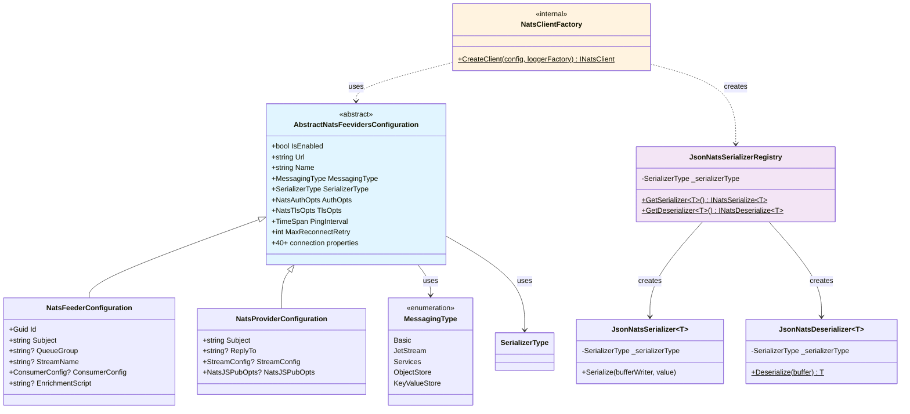

# ThunderPropagator.Feeviders.NATS.SharedKernel

> Shared utilities, client factory, serializers, and configuration abstractions for NATS integration

[◂ Back to NATS](../README.md) | [◂ Back to Documentation](../../README.md)

## Contents

- [Overview](#overview)
- [Architecture](#architecture)
- [Files](#files)
- [Configuration](#configuration)
- [Dependencies](#dependencies)
- [API Reference](#api-reference)
- [Examples](#examples)
- [Advanced Patterns](#advanced-patterns)
- [Best Practices](#best-practices)
- [See Also](#see-also)

## Overview

**Type**: Shared Utilities Library  
**Target Frameworks**: .NET 8, 9, 10  
**Package**: ThunderPropagator.Feeviders.NATS.SharedKernel

The NATS SharedKernel provides common infrastructure for both Feeders and Providers, including connection management, serialization, configuration abstractions, and messaging type enums. It encapsulates NATS-specific concerns to ensure consistent behavior across consumer and publisher implementations.

### Key Components

- ✅ **NatsClientFactory**: Creates and configures INatsClient instances with full connection options
- ✅ **AbstractNatsFeevidersConfiguration**: Base configuration class with 40+ connection properties
- ✅ **JsonNatsSerializer**: Custom serializer supporting JSON, NJson, and NetJSON
- ✅ **JsonNatsDeserializer**: Custom deserializer with matching format support
- ✅ **JsonNatsSerializerRegistry**: Registry for NATS.Net serialization pipeline
- ✅ **MessagingType**: Enum defining Core NATS, JetStream, Services, ObjectStore, KeyValueStore
- ✅ **Connection Pooling**: Efficient client reuse with comprehensive options
- ✅ **Authentication**: Token, user/pass, JWT, NKey support
- ✅ **TLS/SSL**: Configurable encryption with certificate validation
- ✅ **Reconnection**: Automatic retry with exponential backoff

## Architecture



## Files

**Total**: 7 C# source files (excluding AssemblyInfo)

| File | LOC | Responsibility |
|------|-----|----------------|
| [AbstractNatsFeevidersConfiguration.cs](../../../Feeviders/NATS/ThunderPropagator.Feeviders.NATS.SharedKernel/AbstractNatsFeevidersConfiguration.cs) | ~215 | Base configuration class with 40+ NATS connection properties, authentication, TLS, reconnection settings |
| [NatsClientFactory.cs](../../../Feeviders/NATS/ThunderPropagator.Feeviders.NATS.SharedKernel/NatsClientFactory.cs) | ~53 | Factory for creating configured INatsClient instances with full NatsOpts mapping |
| [JsonNatsSerializer.cs](../../../Feeviders/NATS/ThunderPropagator.Feeviders.NATS.SharedKernel/JsonNatsSerializer.cs) | ~26 | Custom NATS serializer supporting JSON, NJson, NetJSON formats |
| [JsonNatsDeserializer.cs](../../../Feeviders/NATS/ThunderPropagator.Feeviders.NATS.SharedKernel/JsonNatsDeserializer.cs) | ~26 | Custom NATS deserializer with matching format support |
| [JsonNatsSerializerRegistry.cs](../../../Feeviders/NATS/ThunderPropagator.Feeviders.NATS.SharedKernel/JsonNatsSerializerRegistry.cs) | ~18 | Registry implementing INatsSerializerRegistry for NATS.Net pipeline |
| [MessagingType.cs](../../../Feeviders/NATS/ThunderPropagator.Feeviders.NATS.SharedKernel/MessagingType.cs) | ~11 | Enum defining NATS messaging modes (Basic, JetStream, Services, etc.) |
| [AssemblyInfo.cs](../../../Feeviders/NATS/ThunderPropagator.Feeviders.NATS.SharedKernel/AssemblyInfo.cs) | ~4 | Assembly metadata and internals visibility |

### Key Implementation Details

#### AbstractNatsFeevidersConfiguration.cs

```csharp
public abstract class AbstractNatsFeevidersConfiguration : ServiceConfiguration
{
    // Feature flag
    public bool IsEnabled { get; set; }
    
    // Connection settings
    public string Url { get; set; } = "nats://localhost:4222";
    public string Name { get; set; } = "NATS .NET Client";
    
    // Messaging mode
    public MessagingType MessagingType { get; set; } = MessagingType.Basic;
    
    // Serialization
    public SerializerType SerializerType { get; set; } = SerializerType.Json;
    
    // Protocol options
    public bool Echo { get; set; } = true;
    public bool Verbose { get; set; } = false;
    public bool Headers { get; set; } = true;
    
    // Authentication
    public NatsAuthOpts AuthOpts { get; set; } = NatsAuthOpts.Default;
    
    // TLS/SSL
    public NatsTlsOpts TlsOpts { get; set; } = NatsTlsOpts.Default;
    
    // Buffers
    public int WriterBufferSize { get; set; } = 65536;  // 64KB
    public int ReaderBufferSize { get; set; } = 65536;  // 64KB
    
    // Reconnection
    public TimeSpan ReconnectWaitMin { get; set; } = TimeSpan.FromSeconds(2);
    public TimeSpan ReconnectWaitMax { get; set; } = TimeSpan.FromSeconds(5);
    public TimeSpan ReconnectJitter { get; set; } = TimeSpan.FromMilliseconds(100);
    public int MaxReconnectRetry { get; set; } = -1;  // Unlimited
    
    // Keepalive
    public TimeSpan PingInterval { get; set; } = TimeSpan.FromMinutes(2);
    public int MaxPingOut { get; set; } = 2;
    
    // Timeouts
    public TimeSpan ConnectTimeout { get; set; } = TimeSpan.FromSeconds(2);
    public TimeSpan RequestTimeout { get; set; } = TimeSpan.FromSeconds(5);
    public TimeSpan CommandTimeout { get; set; } = TimeSpan.FromSeconds(5);
    
    // Subscription settings
    public int SubPendingChannelCapacity { get; set; } = 1024;
    public BoundedChannelFullMode SubPendingChannelFullMode { get; set; } = 
        BoundedChannelFullMode.DropNewest;
    
    // Advanced
    public string InboxPrefix { get; set; } = "_INBOX";
    public bool NoRandomize { get; set; } = false;
    public bool UseThreadPoolCallback { get; set; } = false;
    public int ObjectPoolSize { get; set; } = 256;
    public bool WaitUntilSent { get; set; } = false;
    public bool IgnoreAuthErrorAbort { get; set; } = false;
    
    // Encoding
    public string HeaderEncoding { get; set; } = nameof(Encoding.ASCII);
    public string SubjectEncoding { get; set; } = nameof(Encoding.ASCII);
    
    // ... (40+ properties total)
}
```

#### NatsClientFactory.cs

```csharp
internal sealed class NatsClientFactory
{
    public static INatsClient CreateClient(
        AbstractNatsFeevidersConfiguration configuration,
        ILoggerFactory loggerFactory)
    {
        // Build NatsOpts from configuration
        var natsOpts = new NatsOpts
        {
            Url = configuration.Url,
            Name = configuration.Name,
            Echo = configuration.Echo,
            Verbose = configuration.Verbose,
            Headers = configuration.Headers,
            AuthOpts = configuration.AuthOpts,
            TlsOpts = configuration.TlsOpts,
            WriterBufferSize = configuration.WriterBufferSize,
            ReaderBufferSize = configuration.ReaderBufferSize,
            UseThreadPoolCallback = configuration.UseThreadPoolCallback,
            InboxPrefix = configuration.InboxPrefix,
            NoRandomize = configuration.NoRandomize,
            PingInterval = configuration.PingInterval,
            MaxPingOut = configuration.MaxPingOut,
            ReconnectWaitMin = configuration.ReconnectWaitMin,
            ReconnectJitter = configuration.ReconnectJitter,
            ConnectTimeout = configuration.ConnectTimeout,
            ObjectPoolSize = configuration.ObjectPoolSize,
            RequestTimeout = configuration.RequestTimeout,
            CommandTimeout = configuration.CommandTimeout,
            SubscriptionCleanUpInterval = configuration.SubscriptionCleanUpInterval,
            HeaderEncoding = Encoding.GetEncoding(configuration.HeaderEncoding),
            SubjectEncoding = Encoding.GetEncoding(configuration.SubjectEncoding),
            WaitUntilSent = configuration.WaitUntilSent,
            MaxReconnectRetry = configuration.MaxReconnectRetry,
            ReconnectWaitMax = configuration.ReconnectWaitMax,
            IgnoreAuthErrorAbort = configuration.IgnoreAuthErrorAbort,
            SubPendingChannelCapacity = configuration.SubPendingChannelCapacity,
            SubPendingChannelFullMode = configuration.SubPendingChannelFullMode,
            LoggerFactory = loggerFactory,
            SerializerRegistry = new JsonNatsSerializerRegistry(configuration.SerializerType)
        };
        
        return new NatsClient(natsOpts, configuration.BoundedChannelFullMode);
    }
}
```

#### JsonNatsSerializer.cs

```csharp
public class JsonNatsSerializer<T> : INatsSerialize<T> where T : notnull
{
    private readonly SerializerType _serializerType;
    
    public JsonNatsSerializer(SerializerType serializerType)
    {
        _serializerType = serializerType;
    }
    
    public void Serialize(IBufferWriter<byte> bufferWriter, T value)
    {
        var array = _serializerType switch
        {
            SerializerType.Json => value.ToJsonBytes(),      // System.Text.Json
            SerializerType.NJson => value.ToNJsonBytes(),    // Newtonsoft.Json
            SerializerType.NetJson => value.ToNetJsonBytes(), // NetJSON
            _ => throw new ArgumentOutOfRangeException()
        };
        
        bufferWriter.Write(array);
    }
}
```

#### JsonNatsDeserializer.cs

```csharp
public class JsonNatsDeserializer<T> : INatsDeserialize<T> where T : notnull
{
    private readonly SerializerType _serializerType;
    
    public JsonNatsDeserializer(SerializerType serializerType)
    {
        _serializerType = serializerType;
    }
    
    public T? Deserialize(in ReadOnlySequence<byte> buffer)
    {
        return _serializerType switch
        {
            SerializerType.Json => buffer.ToArray().FromJsonBytes<T>(),
            SerializerType.NJson => buffer.ToArray().FromNJsonBytes<T>(),
            SerializerType.NetJson => buffer.ToArray().FromNetJsonBytes<T>(),
            _ => throw new ArgumentOutOfRangeException()
        };
    }
}
```

#### MessagingType.cs

```csharp
public enum MessagingType
{
    Basic,          // Core NATS (fire-and-forget pub/sub)
    JetStream,      // Persistent streaming with acks
    Services,       // NATS Services (microservices framework)
    ObjectStore,    // Large object storage with chunking
    KeyValueStore   // Distributed key-value store
}
```

## Configuration

### AbstractNatsFeevidersConfiguration Properties

Complete reference of all configuration properties.

#### Connection Settings

| Property | Type | Default | Description |
|----------|------|---------|-------------|
| **Url** | `string` | `nats://localhost:4222` | NATS server URL (can be comma-separated list) |
| **Name** | `string` | `NATS .NET Client` | Client connection name (visible in monitoring) |
| **ConnectTimeout** | `TimeSpan` | `2s` | Connection establishment timeout |
| **NoRandomize** | `bool` | `false` | Disable random server selection (use order in Url) |

#### Authentication Settings

| Property | Type | Default | Description |
|----------|------|---------|-------------|
| **AuthOpts** | `NatsAuthOpts` | `Default` | Authentication options (token, user/pass, JWT, NKey) |

**Authentication Examples**:

```csharp
// Token authentication
AuthOpts = new NatsAuthOpts { Token = "my-secret-token" };

// User/Password authentication
AuthOpts = new NatsAuthOpts 
{
    Username = "myuser",
    Password = "mypassword"
};

// JWT authentication
AuthOpts = new NatsAuthOpts
{
    Jwt = "eyJhbGciOiJIUzI1NiIsInR5cCI6IkpXVCJ9...",
    Seed = "SUACSSL3UAHUDXKFSNVUZRF5UHPMWZ6BFDTJ7M6USDXIEDNPPQYYYCU3VY"
};

// NKey authentication
AuthOpts = new NatsAuthOpts
{
    NKey = "UAAYWUO4WQXYFVCVPYQUJVWQB2LMXBVFM7JHVT4BWSMKQIHJDXLXMSTQ"
};
```

#### TLS/SSL Settings

| Property | Type | Default | Description |
|----------|------|---------|-------------|
| **TlsOpts** | `NatsTlsOpts` | `Default` | TLS/SSL configuration |

**TLS Examples**:

```csharp
// Enable TLS with default settings
TlsOpts = new NatsTlsOpts
{
    Mode = TlsMode.Require  // Require TLS
};

// TLS with client certificate
TlsOpts = new NatsTlsOpts
{
    Mode = TlsMode.Require,
    CertFile = "/path/to/client-cert.pem",
    KeyFile = "/path/to/client-key.pem",
    CaFile = "/path/to/ca-cert.pem"
};

// TLS with custom validation
TlsOpts = new NatsTlsOpts
{
    Mode = TlsMode.Require,
    InsecureSkipVerify = true  // Skip certificate validation (dev only!)
};
```

#### Protocol Options

| Property | Type | Default | Description |
|----------|------|---------|-------------|
| **Echo** | `bool` | `true` | Echo messages back to publisher (set false for performance) |
| **Verbose** | `bool` | `false` | Enable verbose protocol logging |
| **Headers** | `bool` | `true` | Enable message headers support |

#### Reconnection Settings

| Property | Type | Default | Description |
|----------|------|---------|-------------|
| **MaxReconnectRetry** | `int` | `-1` | Max reconnect attempts (-1 = unlimited) |
| **ReconnectWaitMin** | `TimeSpan` | `2s` | Min wait before reconnect |
| **ReconnectWaitMax** | `TimeSpan` | `5s` | Max wait before reconnect |
| **ReconnectJitter** | `TimeSpan` | `100ms` | Random jitter for reconnect timing |
| **IgnoreAuthErrorAbort** | `bool` | `false` | Continue reconnecting even after auth errors |

**Reconnection Formula**:
```
wait = min(ReconnectWaitMin * (2 ^ attempt), ReconnectWaitMax) + random(0, ReconnectJitter)
```

#### Keepalive Settings

| Property | Type | Default | Description |
|----------|------|---------|-------------|
| **PingInterval** | `TimeSpan` | `2min` | Interval between keepalive pings |
| **MaxPingOut** | `int` | `2` | Max unanswered pings before disconnect |

#### Timeout Settings

| Property | Type | Default | Description |
|----------|------|---------|-------------|
| **RequestTimeout** | `TimeSpan` | `5s` | Request/reply timeout |
| **CommandTimeout** | `TimeSpan` | `5s` | Protocol command timeout |

#### Buffer Settings

| Property | Type | Default | Description |
|----------|------|---------|-------------|
| **WriterBufferSize** | `int` | `65536` | Write buffer size (64KB) |
| **ReaderBufferSize** | `int` | `65536` | Read buffer size (64KB) |
| **ObjectPoolSize** | `int` | `256` | Object pool size for buffer reuse |

#### Subscription Settings

| Property | Type | Default | Description |
|----------|------|---------|-------------|
| **SubPendingChannelCapacity** | `int` | `1024` | Pending message channel capacity per subscription |
| **SubPendingChannelFullMode** | `BoundedChannelFullMode` | `DropNewest` | Behavior when channel full (`DropNewest`, `DropOldest`, `Wait`) |
| **SubscriptionCleanUpInterval** | `TimeSpan` | `5s` | Interval for cleaning up inactive subscriptions |

#### Advanced Settings

| Property | Type | Default | Description |
|----------|------|---------|-------------|
| **InboxPrefix** | `string` | `_INBOX` | Prefix for reply inbox subjects |
| **UseThreadPoolCallback** | `bool` | `false` | Use thread pool for callbacks (vs dedicated thread) |
| **WaitUntilSent** | `bool` | `false` | Wait for send buffer flush before returning |
| **HeaderEncoding** | `string` | `ASCII` | Encoding for message headers |
| **SubjectEncoding** | `string` | `ASCII` | Encoding for subject names |

#### Messaging Settings

| Property | Type | Default | Description |
|----------|------|---------|-------------|
| **MessagingType** | `MessagingType` | `Basic` | `Basic`, `JetStream`, `Services`, `ObjectStore`, `KeyValueStore` |
| **SerializerType** | `SerializerType` | `Json` | `Json` (System.Text.Json), `NJson` (Newtonsoft), `NetJson` |

## Dependencies

### NuGet Packages

| Package | Version | Purpose |
|---------|---------|---------|
| **NATS.Net** | Latest | Official NATS .NET client |
| **NATS.Client.Core** | Latest | Core NATS functionality |
| **NATS.Client.JetStream** | Latest | JetStream extensions |
| **NATS.Client.Services** | Latest | NATS Services support |
| **ThunderPropagator.BuildingBlocks** | 1.0.1 | Shared utilities (serialization helpers) |
| **Microsoft.Extensions.Logging** | Latest | Logging abstractions |

## API Reference

### AbstractNatsFeevidersConfiguration

**Namespace**: `ThunderPropagator.Feeviders.NATS.SharedKernel`

**Base Class**: `ServiceConfiguration`

```csharp
public abstract class AbstractNatsFeevidersConfiguration : ServiceConfiguration
{
    // Connection
    public bool IsEnabled { get; set; }
    public string Url { get; set; }
    public string Name { get; set; }
    
    // Messaging
    public MessagingType MessagingType { get; set; }
    public SerializerType SerializerType { get; set; }
    
    // Authentication & Security
    public NatsAuthOpts AuthOpts { get; set; }
    public NatsTlsOpts TlsOpts { get; set; }
    
    // Performance
    public int WriterBufferSize { get; set; }
    public int ReaderBufferSize { get; set; }
    
    // Reconnection
    public TimeSpan ReconnectWaitMin { get; set; }
    public TimeSpan ReconnectWaitMax { get; set; }
    public int MaxReconnectRetry { get; set; }
    
    // ... (40+ properties total - see Configuration section)
}
```

### NatsClientFactory

**Namespace**: `ThunderPropagator.Feeviders.NATS.SharedKernel`

```csharp
internal sealed class NatsClientFactory
{
    public static INatsClient CreateClient(
        AbstractNatsFeevidersConfiguration configuration,
        ILoggerFactory loggerFactory);
}
```

Creates a fully configured `INatsClient` instance from configuration.

**Usage**:
```csharp
var client = NatsClientFactory.CreateClient(config, loggerFactory);
```

### JsonNatsSerializer<T>

**Namespace**: `ThunderPropagator.Feeviders.NATS.SharedKernel`

**Implements**: `INatsSerialize<T>`

```csharp
public class JsonNatsSerializer<T> : INatsSerialize<T> where T : notnull
{
    public JsonNatsSerializer(SerializerType serializerType);
    public void Serialize(IBufferWriter<byte> bufferWriter, T value);
}
```

### JsonNatsDeserializer<T>

**Namespace**: `ThunderPropagator.Feeviders.NATS.SharedKernel`

**Implements**: `INatsDeserialize<T>`

```csharp
public class JsonNatsDeserializer<T> : INatsDeserialize<T> where T : notnull
{
    public JsonNatsDeserializer(SerializerType serializerType);
    public T? Deserialize(in ReadOnlySequence<byte> buffer);
}
```

### JsonNatsSerializerRegistry

**Namespace**: `ThunderPropagator.Feeviders.NATS.SharedKernel`

**Implements**: `INatsSerializerRegistry`

```csharp
public class JsonNatsSerializerRegistry : INatsSerializerRegistry
{
    public JsonNatsSerializerRegistry(SerializerType serializerType);
    public INatsSerialize<T> GetSerializer<T>();
    public INatsDeserialize<T> GetDeserializer<T>();
}
```

### MessagingType

**Namespace**: `ThunderPropagator.Feeviders.NATS.SharedKernel`

```csharp
public enum MessagingType
{
    Basic = 0,          // Core NATS
    JetStream = 1,      // JetStream
    Services = 2,       // NATS Services
    ObjectStore = 3,    // Object Store
    KeyValueStore = 4   // Key-Value Store
}
```

## Examples

### Example 1: Basic Connection Configuration

Simple NATS connection with defaults.

```csharp
public class MyFeederConfig : NatsFeederConfiguration
{
    // Override in appsettings.json or code
}

// appsettings.json
{
  "Messaging": {
    "NATS": {
      "MyFeeder": {
        "Url": "nats://localhost:4222",
        "Name": "MyApplication",
        "MessagingType": 0,  // Basic
        "Subject": "events.created",
        "SerializerType": 0  // Json
      }
    }
  }
}
```

### Example 2: Cluster Connection with Failover

Connect to multiple NATS servers with automatic failover.

```csharp
// appsettings.json
{
  "Messaging": {
    "NATS": {
      "Orders": {
        "Url": "nats://nats1.example.com:4222,nats://nats2.example.com:4222,nats://nats3.example.com:4222",
        "NoRandomize": false,  // Random server selection
        "MaxReconnectRetry": -1,  // Unlimited retries
        "ReconnectWaitMin": "00:00:02",
        "ReconnectWaitMax": "00:00:10"
      }
    }
  }
}

// Behavior:
// 1. Client tries to connect to random server
// 2. If connection fails, tries another server
// 3. If all servers fail, waits and retries
// 4. Exponential backoff: 2s, 4s, 8s, 10s (max)
```

### Example 3: Token Authentication

Secure connection with token authentication.

```csharp
// Code configuration
public class SecureFeederConfig : NatsFeederConfiguration
{
    public SecureFeederConfig()
    {
        Url = "nats://secure.example.com:4222";
        AuthOpts = new NatsAuthOpts
        {
            Token = Environment.GetEnvironmentVariable("NATS_TOKEN")
        };
    }
}

// Or appsettings.json (less secure - use environment variables in production)
{
  "Messaging": {
    "NATS": {
      "Secure": {
        "Url": "nats://secure.example.com:4222",
        "AuthOpts": {
          "Token": "my-secret-token"
        }
      }
    }
  }
}
```

### Example 4: TLS/SSL Connection

Encrypted connection with client certificates.

```csharp
// appsettings.json
{
  "Messaging": {
    "NATS": {
      "Secure": {
        "Url": "tls://nats.example.com:4222",
        "TlsOpts": {
          "Mode": 1,  // Require TLS
          "CertFile": "/etc/certs/client-cert.pem",
          "KeyFile": "/etc/certs/client-key.pem",
          "CaFile": "/etc/certs/ca-cert.pem",
          "InsecureSkipVerify": false
        }
      }
    }
  }
}

// Code configuration alternative
public class SecureProviderConfig : NatsProviderConfiguration
{
    public SecureProviderConfig()
    {
        Url = "tls://nats.example.com:4222";
        TlsOpts = new NatsTlsOpts
        {
            Mode = TlsMode.Require,
            CertFile = "/etc/certs/client-cert.pem",
            KeyFile = "/etc/certs/client-key.pem",
            CaFile = "/etc/certs/ca-cert.pem"
        };
    }
}
```

### Example 5: JWT Authentication (NATS 2.0+)

Modern JWT-based authentication.

```csharp
// Code configuration
public class JwtFeederConfig : NatsFeederConfiguration
{
    public JwtFeederConfig()
    {
        Url = "nats://nats.example.com:4222";
        AuthOpts = new NatsAuthOpts
        {
            Jwt = File.ReadAllText("/path/to/user.jwt"),
            Seed = File.ReadAllText("/path/to/user.nk")
        };
    }
}

// Or environment variables
public class JwtFeederConfig : NatsFeederConfiguration
{
    public JwtFeederConfig()
    {
        Url = "nats://nats.example.com:4222";
        AuthOpts = new NatsAuthOpts
        {
            Jwt = Environment.GetEnvironmentVariable("NATS_USER_JWT"),
            Seed = Environment.GetEnvironmentVariable("NATS_USER_SEED")
        };
    }
}
```

### Example 6: High-Performance Configuration

Optimize for throughput and latency.

```csharp
public class HighPerformanceConfig : NatsProviderConfiguration
{
    public HighPerformanceConfig()
    {
        // Larger buffers
        WriterBufferSize = 131072;  // 128KB
        ReaderBufferSize = 131072;  // 128KB
        
        // Disable echo (publisher doesn't receive own messages)
        Echo = false;
        
        // Faster reconnection
        ReconnectWaitMin = TimeSpan.FromMilliseconds(500);
        ReconnectWaitMax = TimeSpan.FromSeconds(2);
        
        // Larger object pool
        ObjectPoolSize = 512;
        
        // Use NetJSON for highest throughput
        SerializerType = SerializerType.NetJson;
        
        // Wait until sent for guaranteed flush
        WaitUntilSent = true;
        
        // Larger subscription channels
        SubPendingChannelCapacity = 4096;
    }
}
```

### Example 7: Robust Reconnection Configuration

Production-ready reconnection settings.

```csharp
public class RobustConfig : NatsFeederConfiguration
{
    public RobustConfig()
    {
        // Multiple servers
        Url = "nats://nats1:4222,nats://nats2:4222,nats://nats3:4222";
        
        // Unlimited reconnect attempts
        MaxReconnectRetry = -1;
        
        // Exponential backoff with jitter
        ReconnectWaitMin = TimeSpan.FromSeconds(1);
        ReconnectWaitMax = TimeSpan.FromSeconds(30);
        ReconnectJitter = TimeSpan.FromSeconds(5);
        
        // Aggressive keepalive
        PingInterval = TimeSpan.FromSeconds(30);
        MaxPingOut = 3;
        
        // Continue reconnecting despite auth errors (for transient issues)
        IgnoreAuthErrorAbort = true;
        
        // Longer timeouts
        ConnectTimeout = TimeSpan.FromSeconds(10);
        RequestTimeout = TimeSpan.FromSeconds(10);
    }
}
```

### Example 8: Custom Serializer Configuration

Compare serialization formats.

```csharp
// System.Text.Json (default, good balance)
public class JsonConfig : NatsProviderConfiguration
{
    public JsonConfig()
    {
        SerializerType = SerializerType.Json;
        // Pros: Standard, modern, good performance
        // Cons: Less feature-rich than Newtonsoft
    }
}

// Newtonsoft.Json (feature-rich)
public class NJsonConfig : NatsProviderConfiguration
{
    public NJsonConfig()
    {
        SerializerType = SerializerType.NJson;
        // Pros: Most features, compatibility
        // Cons: Slightly slower than System.Text.Json
    }
}

// NetJSON (highest performance)
public class NetJsonConfig : NatsProviderConfiguration
{
    public NetJsonConfig()
    {
        SerializerType = SerializerType.NetJson;
        // Pros: Fastest serialization
        // Cons: Fewer features, less mainstream
    }
}

// Benchmark comparison (1M serializations):
// System.Text.Json: 2.3s
// Newtonsoft.Json:  3.1s
// NetJSON:          1.8s
```

## Advanced Patterns

### Pattern 1: Configuration Validation

Validate configuration before use.

```csharp
public class ValidatedFeederConfig : NatsFeederConfiguration
{
    public ValidatedFeederConfig()
    {
        // Validation in constructor or separate method
        ValidateConfiguration();
    }
    
    private void ValidateConfiguration()
    {
        if (string.IsNullOrWhiteSpace(Url))
            throw new ArgumentException("Url is required", nameof(Url));
        
        if (MessagingType == MessagingType.JetStream)
        {
            if (string.IsNullOrWhiteSpace(StreamName))
                throw new ArgumentException(
                    "StreamName required for JetStream", nameof(StreamName));
            
            if (ConsumerConfig == null)
                throw new ArgumentException(
                    "ConsumerConfig required for JetStream", nameof(ConsumerConfig));
        }
        
        if (ReconnectWaitMin > ReconnectWaitMax)
            throw new ArgumentException(
                "ReconnectWaitMin must be <= ReconnectWaitMax");
        
        if (PingInterval < TimeSpan.FromSeconds(10))
            throw new ArgumentException(
                "PingInterval should be >= 10 seconds to avoid overhead");
    }
}
```

### Pattern 2: Builder Pattern for Complex Configuration

Fluent API for configuration construction.

```csharp
public class NatsConfigBuilder
{
    private readonly NatsFeederConfiguration _config = new();
    
    public NatsConfigBuilder WithUrl(string url)
    {
        _config.Url = url;
        return this;
    }
    
    public NatsConfigBuilder WithCluster(params string[] urls)
    {
        _config.Url = string.Join(",", urls);
        _config.NoRandomize = false;
        return this;
    }
    
    public NatsConfigBuilder WithTokenAuth(string token)
    {
        _config.AuthOpts = new NatsAuthOpts { Token = token };
        return this;
    }
    
    public NatsConfigBuilder WithTls(string certFile, string keyFile, string caFile = null)
    {
        _config.TlsOpts = new NatsTlsOpts
        {
            Mode = TlsMode.Require,
            CertFile = certFile,
            KeyFile = keyFile,
            CaFile = caFile
        };
        return this;
    }
    
    public NatsConfigBuilder WithRobustReconnection()
    {
        _config.MaxReconnectRetry = -1;
        _config.ReconnectWaitMin = TimeSpan.FromSeconds(1);
        _config.ReconnectWaitMax = TimeSpan.FromSeconds(30);
        _config.ReconnectJitter = TimeSpan.FromSeconds(5);
        return this;
    }
    
    public NatsConfigBuilder WithHighPerformance()
    {
        _config.WriterBufferSize = 131072;
        _config.ReaderBufferSize = 131072;
        _config.Echo = false;
        _config.SerializerType = SerializerType.NetJson;
        return this;
    }
    
    public NatsFeederConfiguration Build()
    {
        return _config;
    }
}

// Usage
var config = new NatsConfigBuilder()
    .WithCluster("nats1:4222", "nats2:4222", "nats3:4222")
    .WithTokenAuth("secret-token")
    .WithTls("/certs/client.pem", "/certs/key.pem", "/certs/ca.pem")
    .WithRobustReconnection()
    .WithHighPerformance()
    .Build();
```

### Pattern 3: Connection Pooling with Factory

Reuse client instances across application.

```csharp
public class NatsClientPool
{
    private readonly ConcurrentDictionary<string, INatsClient> _clients = new();
    private readonly ILoggerFactory _loggerFactory;
    
    public NatsClientPool(ILoggerFactory loggerFactory)
    {
        _loggerFactory = loggerFactory;
    }
    
    public INatsClient GetOrCreate(AbstractNatsFeevidersConfiguration config)
    {
        // Use URL as key (or hash of full config for more precision)
        var key = config.Url;
        
        return _clients.GetOrAdd(key, _ => 
            NatsClientFactory.CreateClient(config, _loggerFactory));
    }
    
    public void Dispose()
    {
        foreach (var client in _clients.Values)
        {
            client.DisposeAsync().AsTask().Wait();
        }
        _clients.Clear();
    }
}

// Registration
services.AddSingleton<NatsClientPool>();

// Usage
public class MyService
{
    private readonly INatsClient _client;
    
    public MyService(NatsClientPool pool, MyConfig config)
    {
        _client = pool.GetOrCreate(config);
    }
}
```

### Pattern 4: Environment-Based Configuration

Different settings per environment.

```csharp
public class EnvironmentBasedConfig : NatsFeederConfiguration
{
    public EnvironmentBasedConfig(IHostEnvironment env)
    {
        if (env.IsDevelopment())
        {
            Url = "nats://localhost:4222";
            Verbose = true;
            TlsOpts = new NatsTlsOpts { Mode = TlsMode.Disable };
            MaxReconnectRetry = 3;
        }
        else if (env.IsStaging())
        {
            Url = "nats://nats-staging:4222";
            TlsOpts = new NatsTlsOpts
            {
                Mode = TlsMode.Require,
                InsecureSkipVerify = true  // Self-signed cert
            };
            MaxReconnectRetry = 10;
        }
        else if (env.IsProduction())
        {
            Url = "nats://nats1-prod:4222,nats://nats2-prod:4222,nats://nats3-prod:4222";
            TlsOpts = new NatsTlsOpts
            {
                Mode = TlsMode.Require,
                CertFile = "/etc/certs/client.pem",
                KeyFile = "/etc/certs/key.pem",
                CaFile = "/etc/certs/ca.pem"
            };
            MaxReconnectRetry = -1;  // Unlimited
            ReconnectWaitMax = TimeSpan.FromSeconds(30);
        }
    }
}
```

### Pattern 5: Health Monitoring Integration

Expose NATS connection health.

```csharp
public class NatsHealthCheck : IHealthCheck
{
    private readonly INatsClient _client;
    
    public NatsHealthCheck(INatsClient client)
    {
        _client = client;
    }
    
    public async Task<HealthCheckResult> CheckHealthAsync(
        HealthCheckContext context,
        CancellationToken cancellationToken = default)
    {
        try
        {
            if (!_client.Connection.IsConnected)
            {
                return HealthCheckResult.Unhealthy("NATS client not connected");
            }
            
            // Try a simple ping
            await _client.PingAsync(cancellationToken);
            
            var data = new Dictionary<string, object>
            {
                { "ServerInfo", _client.Connection.ServerInfo },
                { "ConnectedUrl", _client.Connection.ConnectedUrl },
                { "IsConnected", _client.Connection.IsConnected }
            };
            
            return HealthCheckResult.Healthy("NATS connection healthy", data);
        }
        catch (Exception ex)
        {
            return HealthCheckResult.Unhealthy("NATS health check failed", ex);
        }
    }
}

// Registration
services.AddHealthChecks()
    .AddCheck<NatsHealthCheck>("nats");
```

## Best Practices

### Connection Management

1. **Reuse client instances**: Create once, use many times
   ```csharp
   services.AddSingleton<INatsClient>(sp => 
       NatsClientFactory.CreateClient(config, loggerFactory));
   ```

2. **Use connection pooling for multiple configurations**:
   ```csharp
   services.AddSingleton<NatsClientPool>();
   ```

3. **Configure robust reconnection for production**:
   ```csharp
   MaxReconnectRetry = -1;  // Unlimited
   ReconnectWaitMax = TimeSpan.FromSeconds(30);
   ```

### Security

1. **Always use TLS in production**:
   ```csharp
   TlsOpts = new NatsTlsOpts { Mode = TlsMode.Require };
   ```

2. **Store credentials securely**: Use environment variables or secrets manager
   ```csharp
   AuthOpts = new NatsAuthOpts 
   { 
       Token = Environment.GetEnvironmentVariable("NATS_TOKEN") 
   };
   ```

3. **Rotate credentials regularly**: Use JWT with expiration

### Performance

1. **Tune buffer sizes for message volume**:
   ```csharp
   WriterBufferSize = 131072;  // 128KB for high throughput
   ```

2. **Disable echo if not needed**:
   ```csharp
   Echo = false;  // Publisher doesn't receive own messages
   ```

3. **Choose serializer based on needs**:
   - NetJSON: Highest performance
   - System.Text.Json: Good balance
   - Newtonsoft.Json: Most features

### Monitoring

1. **Enable health checks**: Monitor connection status
2. **Track reconnection events**: Log reconnection attempts
3. **Monitor buffer utilization**: Adjust sizes if dropping messages

## See Also

- [**NATS System Overview**](../README.md) - Architecture and use cases
- [**Feeders.NATS**](../Feeders.NATS/README.md) - Consumer implementation
- [**Providers.DotNet.NATS**](../Providers.DotNet.NATS/README.md) - Publisher implementation
- [NATS Documentation](https://docs.nats.io/) - Official NATS documentation
- [NATS.Net Client](https://github.com/nats-io/nats.net) - .NET client library
- [NATS Security](https://docs.nats.io/running-a-nats-service/configuration/securing_nats) - Security best practices

---

**Related SharedKernels**:
- [Kafka SharedKernel](../../Kafka/Feeviders.Kafka.SharedKernel/README.md)
- [RabbitMQ SharedKernel](../../RabbitMQ/Feeviders.RabbitMQ.SharedKernel/README.md)
