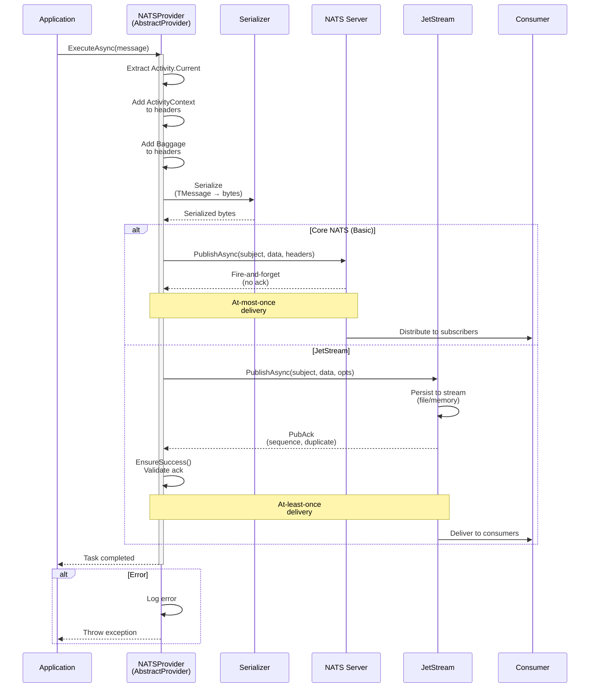

# ThunderPropagator.Providers.DotNet.NATS

> NATS Message Publisher - Publishes outbound messages to NATS subjects and JetStream streams

[◂ Back to NATS](../README.md) | [◂ Back to Documentation](../../README.md)

## Contents

- [Overview](#overview)
- [Architecture](#architecture)
- [Files](#files)
- [Configuration](#configuration)
- [Dependencies](#dependencies)
- [API Reference](#api-reference)
- [Examples](#examples)
- [Advanced Patterns](#advanced-patterns)
- [Best Practices](#best-practices)
- [Troubleshooting](#troubleshooting)
- [See Also](#see-also)

## Overview

**Type**: Message Publisher (Provider)  
**Target Frameworks**: .NET 8, 9, 10  
**Package**: ThunderPropagator.Providers.DotNet.NATS

The NATS Provider is an **AbstractProvider** implementation that enables high-performance message publishing to both Core NATS (fire-and-forget) and JetStream (persistent with acknowledgments). It provides automatic serialization, OpenTelemetry integration, stream initialization, and comprehensive error handling for reliable message delivery.

### Key Features

- ✅ **Dual Mode Support**: Core NATS (at-most-once) and JetStream (at-least-once with PubAck)
- ✅ **Subject-Based Routing**: Hierarchical addressing with dynamic subject resolution
- ✅ **Stream Auto-Initialization**: Automatic JetStream stream creation and configuration
- ✅ **Publisher Confirms**: PubAck validation for guaranteed delivery (JetStream)
- ✅ **Message Headers**: Custom metadata via NatsHeaders with W3C propagation
- ✅ **Idempotent Publishing**: Message ID-based deduplication (JetStream)
- ✅ **Multiple Serialization**: JSON, Newtonsoft.Json, NetJSON support
- ✅ **OpenTelemetry Integration**: Built-in distributed tracing with Activity and Baggage
- ✅ **Request/Reply Pattern**: Built-in request/reply support (Core NATS)
- ✅ **Connection Pooling**: Efficient NatsClient reuse
- ✅ **Async Publishing**: Full async/await pattern with cancellation support

## Architecture



## Files

**Total**: 4 C# source files (excluding AssemblyInfo)

| File | LOC | Responsibility |
|------|-----|----------------|
| [NatsProvider.cs](../../../Feeviders/NATS/ThunderPropagator.Providers.DotNet.NATS/NatsProvider.cs) | ~97 | Main provider implementation - manages Core NATS and JetStream publishing, stream initialization, OpenTelemetry header propagation |
| [NatsProviderConfiguration.cs](../../../Feeviders/NATS/ThunderPropagator.Providers.DotNet.NATS/NatsProviderConfiguration.cs) | ~30 | Configuration class - extends AbstractNatsFeevidersConfiguration with provider-specific settings (subject, stream config, publish options) |
| [NatsProviderMessage.cs](../../../Feeviders/NATS/ThunderPropagator.Providers.DotNet.NATS/NatsProviderMessage.cs) | ~5 | Abstract message base class - provides type safety for NATS messages |
| [NatsProviderExtensions.cs](../../../Feeviders/NATS/ThunderPropagator.Providers.DotNet.NATS/NatsProviderExtensions.cs) | ~21 | DI registration extension - AddNatsProvider |

### Key Implementation Details

#### NatsProvider.cs

```csharp
internal sealed class NatsProvider<TNatsProviderMessage, TNatsProviderConfiguration> 
    : AbstractProvider<TNatsProviderMessage, TNatsProviderConfiguration>
    where TNatsProviderMessage : NatsProviderMessage
    where TNatsProviderConfiguration : NatsProviderConfiguration
{
    private readonly INatsClient _client;
    private readonly INatsJSContext? _jetStreamContext;
    private readonly Task? _jetStreamInitTask;
    
    public NatsProvider(
        TNatsProviderConfiguration natsProviderConfiguration,
        IServiceProvider serviceProvider)
        : base(serviceProvider)
    {
        _client = NatsClientFactory.CreateClient(
            natsProviderConfiguration, 
            serviceProvider.GetRequiredService<ILoggerFactory>());
        
        if (natsProviderConfiguration.MessagingType == MessagingType.JetStream)
        {
            _jetStreamContext = _client.CreateJetStreamContext();
            _jetStreamInitTask = InitializeJetStreamContextAsync(
                natsProviderConfiguration.StreamConfig!,
                applicationLifetime.ApplicationStopping);
        }
    }
    
    protected override async Task InternalExecuteAsync(
        TNatsProviderMessage feederMessage,
        CancellationToken cancellationToken = default)
    {
        try
        {
            // Build headers with OpenTelemetry context
            var natsHeaders = new NatsHeaders();
            
            if (Activity.Current?.Context is not null)
                natsHeaders.Add(nameof(ActivityContext), 
                    Activity.Current.Context.ToNJsonBase64());
            
            natsHeaders.Add(nameof(Baggage), Baggage.Current.ToNJsonBase64());
            
            switch (_natsProviderConfiguration.MessagingType)
            {
                case MessagingType.Basic:
                    // Core NATS: fire-and-forget
                    await _client.PublishAsync(
                        subject: _natsProviderConfiguration.Subject,
                        replyTo: _natsProviderConfiguration.ReplyTo,
                        data: feederMessage,
                        cancellationToken: cancellationToken);
                    break;
                    
                case MessagingType.JetStream:
                    // JetStream: persistent with ack
                    await _jetStreamInitTask!;  // Ensure stream initialized
                    
                    var ack = await _jetStreamContext!.PublishAsync(
                        subject: _natsProviderConfiguration.Subject,
                        data: feederMessage,
                        opts: _natsProviderConfiguration.NatsJSPubOpts,
                        cancellationToken: cancellationToken);
                    
                    ack.EnsureSuccess();  // Throw if ack indicates error
                    break;
            }
        }
        catch (Exception exception)
        {
            Logger.LogError(exception,
                "Error publishing message to Subject {Subject}.",
                _natsProviderConfiguration.Subject);
            throw;
        }
    }
    
    private async Task InitializeJetStreamContextAsync(
        StreamConfig streamConfig,
        CancellationToken cancellationToken)
    {
        try
        {
            await _jetStreamContext!.CreateStreamAsync(streamConfig, cancellationToken);
        }
        catch (NatsJSApiException ex) when (ex.Error.Code == 400 && 
            ex.Error.Description?.Contains("stream name already in use") == true)
        {
            // Stream exists - this is OK
            Logger.LogDebug("Stream {StreamName} already exists", streamConfig.Name);
        }
        catch (Exception ex)
        {
            Logger.LogError(ex, "Failed to initialize JetStream stream {StreamName}",
                streamConfig.Name);
            throw;
        }
    }
}
```

**Key Design Decisions**:
- **AbstractProvider**: Inherits automatic serialization from base class
- **Dual Mode**: Switch between Core NATS and JetStream via MessagingType
- **Lazy Initialization**: JetStream stream created asynchronously in background task
- **PubAck Validation**: `EnsureSuccess()` throws if JetStream ack indicates error
- **OpenTelemetry**: Injects ActivityContext and Baggage into message headers
- **Connection Management**: NatsClient disposed via DisposeManagedResourcesAsync

#### NatsProviderConfiguration.cs

```csharp
public abstract class NatsProviderConfiguration : AbstractNatsFeevidersConfiguration, 
    IAbstractProviderConfiguration
{
    public string Subject { get; set; }             // Target subject (required)
    public string? ReplyTo { get; set; }            // Reply-to subject (optional, Core NATS)
    public StreamConfig? StreamConfig { get; set; } // JetStream stream config (required for JetStream)
    public NatsJSPubOpts? NatsJSPubOpts { get; set; }  // JetStream publish options
    
    // Inherited from AbstractNatsFeevidersConfiguration:
    // Url, Name, AuthOpts, TlsOpts, MessagingType, SerializerType, etc.
}
```

## Configuration

### Installation

```bash
# Add GitHub Packages source (one-time setup)
dotnet nuget add source https://nuget.pkg.github.com/KiarashMinoo/index.json \
  -n github -u YOUR_USERNAME -p YOUR_GITHUB_TOKEN --store-password-in-clear-text

# Install package
dotnet add package ThunderPropagator.Providers.DotNet.NATS
```

### Registration

```csharp
// Startup.cs or Program.cs
public void ConfigureServices(IServiceCollection services)
{
    // Register NATS provider
    services.AddNatsProvider<OrderMessage, OrderProviderConfiguration>(
        configuration, "Messaging:NATS:Orders");
}

// Usage in application code
public class OrderService
{
    private readonly IProvider<OrderMessage, OrderProviderConfiguration> _provider;
    
    public OrderService(IProvider<OrderMessage, OrderProviderConfiguration> provider)
    {
        _provider = provider;
    }
    
    public async Task CreateOrderAsync(Order order, CancellationToken ct)
    {
        var message = new OrderMessage
        {
            OrderId = order.Id,
            Amount = order.Amount,
            CreatedAt = DateTime.UtcNow
        };
        
        await _provider.ExecuteAsync(message, ct);
    }
}
```

### Configuration Properties

#### Core NATS Configuration (appsettings.json)

```json
{
  "Messaging": {
    "NATS": {
      "Orders": {
        "Url": "nats://localhost:4222",
        "Name": "OrderPublisher",
        "MessagingType": 0,  // 0 = Basic (Core NATS)
        "Subject": "orders.created",
        "ReplyTo": "orders.replies",
        "SerializerType": 0  // 0 = Json, 1 = NJson, 2 = NetJson
      }
    }
  }
}
```

#### JetStream Configuration (appsettings.json)

```json
{
  "Messaging": {
    "NATS": {
      "Orders": {
        "Url": "nats://localhost:4222",
        "Name": "OrderPublisher",
        "MessagingType": 1,  // 1 = JetStream
        "Subject": "orders.created",
        "SerializerType": 0,
        "StreamConfig": {
          "Name": "ORDERS",
          "Description": "Order events stream",
          "Subjects": ["orders.>"],
          "Retention": 0,  // 0 = Limits, 1 = Interest, 2 = WorkQueue
          "MaxAge": 604800000000000,  // 7 days (nanoseconds)
          "MaxBytes": 1073741824,  // 1GB
          "MaxMsgs": 1000000,  // 1M messages
          "MaxMsgSize": 1048576,  // 1MB per message
          "Storage": 0,  // 0 = File, 1 = Memory
          "Replicas": 3,  // 3-way replication
          "NoAck": false,
          "Discard": 0,  // 0 = Old, 1 = New
          "MaxConsumers": -1,  // Unlimited
          "MaxMsgsPerSubject": -1,  // Unlimited
          "DuplicateWindow": 120000000000  // 2 min (nanoseconds)
        },
        "NatsJSPubOpts": {
          "MsgId": null,  // Set dynamically for idempotency
          "ExpectedLastMsgId": null,
          "ExpectedLastSubjectSequence": null,
          "ExpectedStream": "ORDERS",
          "Timeout": 5000000000,  // 5 seconds (nanoseconds)
          "Headers": {}
        }
      }
    }
  }
}
```

### Configuration Reference

#### NatsProviderConfiguration Properties

| Property | Type | Default | Description |
|----------|------|---------|-------------|
| **Subject** | `string` | *(required)* | Target NATS subject (e.g., `orders.created`) |
| **ReplyTo** | `string?` | `null` | Reply-to subject for request/reply pattern (Core NATS) |
| **MessagingType** | `MessagingType` | `Basic` | `Basic` (Core NATS) or `JetStream` |
| **StreamConfig** | `StreamConfig?` | `null` | JetStream stream configuration (required for JetStream) |
| **NatsJSPubOpts** | `NatsJSPubOpts?` | `null` | JetStream publish options (idempotency, expectations) |
| **SerializerType** | `SerializerType` | `Json` | `Json`, `NJson`, or `NetJson` |

#### StreamConfig Properties (JetStream)

| Property | Type | Default | Description |
|----------|------|---------|-------------|
| **Name** | `string` | *(required)* | Stream name (uppercase convention) |
| **Description** | `string?` | `null` | Human-readable description |
| **Subjects** | `string[]` | *(required)* | Subject patterns to capture (e.g., `["orders.>"]`) |
| **Retention** | `Retention` | `Limits` | `Limits` (size/age/count), `Interest` (no consumers = delete), `WorkQueue` (ack = delete) |
| **MaxAge** | `TimeSpan` | `0` (unlimited) | Message TTL (e.g., 7 days) |
| **MaxBytes** | `long` | `-1` (unlimited) | Max stream size in bytes |
| **MaxMsgs** | `long` | `-1` (unlimited) | Max message count |
| **MaxMsgSize** | `int` | `-1` (unlimited) | Max individual message size |
| **Storage** | `Storage` | `File` | `File` (persistent) or `Memory` (ephemeral) |
| **Replicas** | `int` | `1` | Replication factor (1-5) for HA |
| **NoAck** | `bool` | `false` | Disable acknowledgments (fire-and-forget within JetStream) |
| **Discard** | `Discard` | `Old` | `Old` (remove oldest on limit), `New` (reject new on limit) |
| **MaxConsumers** | `int` | `-1` (unlimited) | Max consumers allowed |
| **MaxMsgsPerSubject** | `long` | `-1` (unlimited) | Max messages per subject |
| **DuplicateWindow** | `TimeSpan` | `2min` | Deduplication window for MsgId |
| **Placement** | `Placement?` | `null` | Cluster placement constraints |
| **Mirror** | `StreamSource?` | `null` | Mirror configuration |
| **Sources** | `StreamSource[]?` | `null` | Source streams for aggregation |

#### NatsJSPubOpts Properties

| Property | Type | Default | Description |
|----------|------|---------|-------------|
| **MsgId** | `string?` | `null` | Message ID for deduplication (idempotency key) |
| **ExpectedLastMsgId** | `string?` | `null` | Expected last message ID (optimistic concurrency) |
| **ExpectedLastSubjectSequence** | `ulong?` | `null` | Expected last sequence for subject |
| **ExpectedStream** | `string?` | `null` | Expected stream name (validation) |
| **Timeout** | `TimeSpan` | `5s` | Publish timeout |
| **Headers** | `NatsHeaders?` | `null` | Custom headers (in addition to auto-added OpenTelemetry headers) |

#### Inherited Connection Properties

| Property | Type | Default | Description |
|----------|------|---------|-------------|
| **Url** | `string` | `nats://localhost:4222` | NATS server URL (can be comma-separated list) |
| **Name** | `string` | `NATS .NET Client` | Client connection name |
| **AuthOpts** | `NatsAuthOpts` | `Default` | Authentication (token, user/pass, JWT, NKey) |
| **TlsOpts** | `NatsTlsOpts` | `Default` | TLS/SSL configuration |
| **ConnectTimeout** | `TimeSpan` | `2s` | Connection timeout |
| **PingInterval** | `TimeSpan` | `2min` | Keepalive ping interval |
| **MaxReconnectRetry** | `int` | `-1` (unlimited) | Max reconnect attempts |

## Dependencies

### NuGet Packages

| Package | Version | Purpose |
|---------|---------|---------|
| **NATS.Net** | Latest | Official NATS .NET client with JetStream support |
| **NATS.Client.Core** | Latest | Core NATS client functionality |
| **NATS.Client.JetStream** | Latest | JetStream extensions and models |
| **ThunderPropagator** | 1.0.1 | Core framework abstractions |
| **ThunderPropagator.BuildingBlocks** | 1.0.1 | Shared utilities and helpers |
| **ThunderPropagator.Providers.DotNet.SharedKernel** | 1.0.1 | Provider base classes |
| **ThunderPropagator.Feeviders.NATS.SharedKernel** | 1.0.1 | NATS-specific utilities and serializers |
| **OpenTelemetry.Api** | Latest | Distributed tracing and context propagation |
| **Microsoft.Extensions.DependencyInjection** | Latest | Dependency injection |
| **Microsoft.Extensions.Logging** | Latest | Logging abstractions |

### Project References

```xml
<ItemGroup>
  <PackageReference Include="NATS.Net" />
  <PackageReference Include="OpenTelemetry.Api" />
  <ProjectReference Include="..\..\SharedKernel\ThunderPropagator.Providers.DotNet.SharedKernel" />
  <ProjectReference Include="..\ThunderPropagator.Feeviders.NATS.SharedKernel" />
</ItemGroup>
```

## API Reference

### NatsProvider<TNatsProviderMessage, TNatsProviderConfiguration>

**Namespace**: `ThunderPropagator.Providers.DotNet.NATS`

**Base Class**: `AbstractProvider<TNatsProviderMessage, TNatsProviderConfiguration>`

```csharp
internal sealed class NatsProvider<TNatsProviderMessage, TNatsProviderConfiguration>
    where TNatsProviderMessage : NatsProviderMessage
    where TNatsProviderConfiguration : NatsProviderConfiguration
```

#### Constructor

```csharp
public NatsProvider(
    TNatsProviderConfiguration natsProviderConfiguration,
    IServiceProvider serviceProvider)
```

#### Protected Methods

```csharp
// Main publish method - called by ExecuteAsync
protected override Task InternalExecuteAsync(
    TNatsProviderMessage feederMessage,
    CancellationToken cancellationToken = default);

// Cleanup NATS client on disposal
protected override ValueTask DisposeManagedResourcesAsync();
```

### NatsProviderMessage

**Namespace**: `ThunderPropagator.Providers.DotNet.NATS`

**Base Class**: `FeederMessage`

```csharp
public abstract class NatsProviderMessage : FeederMessage;
```

Abstract base class for all NATS provider messages. Inherit from this to define your message types:

```csharp
public class OrderCreatedMessage : NatsProviderMessage
{
    public string OrderId { get; set; }
    public decimal Amount { get; set; }
    public string CustomerId { get; set; }
}
```

### NatsProviderConfiguration

**Namespace**: `ThunderPropagator.Providers.DotNet.NATS`

**Base Class**: `AbstractNatsFeevidersConfiguration`

**Implements**: `IAbstractProviderConfiguration`

```csharp
public abstract class NatsProviderConfiguration : AbstractNatsFeevidersConfiguration, 
    IAbstractProviderConfiguration
{
    public string Subject { get; set; }
    public string? ReplyTo { get; set; }
    public StreamConfig? StreamConfig { get; set; }
    public NatsJSPubOpts? NatsJSPubOpts { get; set; }
}
```

### Extension Methods

**Namespace**: `ThunderPropagator.Providers.DotNet.NATS`

#### AddNatsProvider

```csharp
public static IServiceCollection AddNatsProvider<TNatsProviderMessage, TNatsProviderConfiguration>(
    this IServiceCollection services,
    IConfigurationRoot configuration,
    string sectionName)
    where TNatsProviderMessage : NatsProviderMessage
    where TNatsProviderConfiguration : NatsProviderConfiguration, new()
```

Registers a NATS provider with configuration binding.

**Example**:
```csharp
services.AddNatsProvider<OrderMessage, OrderProviderConfig>(
    configuration, "Messaging:NATS:Orders");
```

## Examples

### Example 1: Basic Core NATS Publishing

Simple fire-and-forget message publishing.

```csharp
// Message definition
public class TelemetryMessage : NatsProviderMessage
{
    public string Sensor { get; set; }
    public double Temperature { get; set; }
    public DateTime Timestamp { get; set; }
}

// Configuration
public class TelemetryProviderConfig : NatsProviderConfiguration { }

// Registration (Startup.cs)
services.AddNatsProvider<TelemetryMessage, TelemetryProviderConfig>(
    configuration, "Messaging:NATS:Telemetry");

// Usage
public class SensorService
{
    private readonly IProvider<TelemetryMessage, TelemetryProviderConfig> _provider;
    
    public SensorService(IProvider<TelemetryMessage, TelemetryProviderConfig> provider)
    {
        _provider = provider;
    }
    
    public async Task PublishReadingAsync(string sensor, double temp, CancellationToken ct)
    {
        var message = new TelemetryMessage
        {
            Sensor = sensor,
            Temperature = temp,
            Timestamp = DateTime.UtcNow
        };
        
        await _provider.ExecuteAsync(message, ct);
    }
}

// appsettings.json
{
  "Messaging": {
    "NATS": {
      "Telemetry": {
        "Url": "nats://localhost:4222",
        "MessagingType": 0,  // Basic
        "Subject": "telemetry.sensors.temperature",
        "SerializerType": 0  // Json
      }
    }
  }
}
```

### Example 2: Subject Routing with Dynamic Subjects

Publish to different subjects based on message content.

```csharp
public class EventMessage : NatsProviderMessage
{
    public string EventType { get; set; }
    public string Region { get; set; }
    public Dictionary<string, object> Data { get; set; }
}

public class EventProviderConfig : NatsProviderConfiguration { }

public class EventService
{
    private readonly IProvider<EventMessage, EventProviderConfig> _provider;
    private readonly EventProviderConfig _config;
    
    public EventService(
        IProvider<EventMessage, EventProviderConfig> provider,
        EventProviderConfig config)
    {
        _provider = provider;
        _config = config;
    }
    
    public async Task PublishEventAsync(EventMessage message, CancellationToken ct)
    {
        // Dynamically set subject based on message content
        var originalSubject = _config.Subject;
        _config.Subject = $"events.{message.Region}.{message.EventType}";
        
        try
        {
            await _provider.ExecuteAsync(message, ct);
        }
        finally
        {
            _config.Subject = originalSubject;  // Restore
        }
    }
}

// Publishes to:
// - "events.us.login" for US login events
// - "events.eu.purchase" for EU purchase events
// - etc.
```

### Example 3: JetStream with PubAck Confirmation

Publish critical messages with guaranteed delivery.

```csharp
public class OrderMessage : NatsProviderMessage
{
    public string OrderId { get; set; }
    public decimal Amount { get; set; }
    public string CustomerId { get; set; }
}

public class OrderProviderConfig : NatsProviderConfiguration { }

// Registration
services.AddNatsProvider<OrderMessage, OrderProviderConfig>(
    configuration, "Messaging:NATS:Orders");

// Usage
public class OrderService
{
    private readonly IProvider<OrderMessage, OrderProviderConfig> _provider;
    private readonly ILogger<OrderService> _logger;
    
    public async Task CreateOrderAsync(Order order, CancellationToken ct)
    {
        var message = new OrderMessage
        {
            OrderId = order.Id,
            Amount = order.Amount,
            CustomerId = order.CustomerId
        };
        
        try
        {
            await _provider.ExecuteAsync(message, ct);
            _logger.LogInformation("Order {OrderId} published successfully", order.Id);
        }
        catch (NatsJSApiException ex) when (ex.Error.Code == 503)
        {
            _logger.LogError("JetStream unavailable: {Error}", ex.Error.Description);
            throw;
        }
        catch (Exception ex)
        {
            _logger.LogError(ex, "Failed to publish order {OrderId}", order.Id);
            throw;
        }
    }
}

// appsettings.json
{
  "Messaging": {
    "NATS": {
      "Orders": {
        "Url": "nats://localhost:4222",
        "MessagingType": 1,  // JetStream
        "Subject": "orders.created",
        "SerializerType": 0,
        "StreamConfig": {
          "Name": "ORDERS",
          "Subjects": ["orders.>"],
          "MaxAge": 604800000000000,  // 7 days
          "Storage": 0,  // File
          "Replicas": 3  // HA
        }
      }
    }
  }
}
```

### Example 4: Idempotent Publishing with Message IDs

Prevent duplicate messages using deduplication.

```csharp
public class PaymentMessage : NatsProviderMessage
{
    public string PaymentId { get; set; }
    public decimal Amount { get; set; }
    public string AccountId { get; set; }
}

public class PaymentProviderConfig : NatsProviderConfiguration { }

public class PaymentService
{
    private readonly IProvider<PaymentMessage, PaymentProviderConfig> _provider;
    private readonly PaymentProviderConfig _config;
    
    public async Task ProcessPaymentAsync(Payment payment, CancellationToken ct)
    {
        var message = new PaymentMessage
        {
            PaymentId = payment.Id,
            Amount = payment.Amount,
            AccountId = payment.AccountId
        };
        
        // Set message ID for deduplication
        _config.NatsJSPubOpts = new NatsJSPubOpts
        {
            MsgId = $"payment-{payment.Id}",  // Idempotency key
            ExpectedStream = "PAYMENTS"
        };
        
        try
        {
            await _provider.ExecuteAsync(message, ct);
        }
        catch (NatsJSApiException ex) when (ex.Error.Code == 400 && 
            ex.Error.Description?.Contains("duplicate") == true)
        {
            // Duplicate message - already published within deduplication window
            // This is OK - idempotent behavior
            return;
        }
    }
}

// appsettings.json
{
  "Messaging": {
    "NATS": {
      "Payments": {
        "Url": "nats://localhost:4222",
        "MessagingType": 1,
        "Subject": "payments.processed",
        "SerializerType": 0,
        "StreamConfig": {
          "Name": "PAYMENTS",
          "Subjects": ["payments.>"],
          "DuplicateWindow": 120000000000  // 2 minutes
        }
      }
    }
  }
}
```

### Example 5: Request/Reply Pattern (Core NATS)

Implement RPC-style request/reply communication.

```csharp
public class UserQueryMessage : NatsProviderMessage
{
    public string UserId { get; set; }
}

public class UserQueryProviderConfig : NatsProviderConfiguration { }

public class UserService
{
    private readonly INatsClient _client;
    
    public UserService(INatsClient client)
    {
        _client = client;
    }
    
    public async Task<UserResponse> GetUserAsync(string userId, CancellationToken ct)
    {
        var request = new UserQueryMessage { UserId = userId };
        
        // Request/reply with 5-second timeout
        var reply = await _client.RequestAsync<UserQueryMessage, UserResponse>(
            subject: "rpc.user-service.getUser",
            data: request,
            requestOpts: new NatsSubOpts { Timeout = TimeSpan.FromSeconds(5) },
            cancellationToken: ct);
        
        return reply.Data;
    }
}

// Server-side responder (separate service)
public class UserResponder
{
    private readonly INatsClient _client;
    private readonly IUserRepository _repository;
    
    public async Task StartAsync(CancellationToken ct)
    {
        await foreach (var request in _client.SubscribeAsync<UserQueryMessage>(
            "rpc.user-service.getUser", cancellationToken: ct))
        {
            var user = await _repository.GetUserAsync(request.Data.UserId, ct);
            var response = new UserResponse { User = user };
            
            // Reply to the sender
            await _client.PublishAsync(
                subject: request.ReplyTo!,
                data: response,
                cancellationToken: ct);
        }
    }
}
```

### Example 6: Custom Headers and Metadata

Add custom headers for routing or metadata.

```csharp
public class AuditLogMessage : NatsProviderMessage
{
    public string Action { get; set; }
    public string UserId { get; set; }
    public DateTime Timestamp { get; set; }
}

public class AuditProviderConfig : NatsProviderConfiguration { }

public class AuditService
{
    private readonly IProvider<AuditLogMessage, AuditProviderConfig> _provider;
    private readonly AuditProviderConfig _config;
    
    public async Task LogActionAsync(string action, string userId, CancellationToken ct)
    {
        var message = new AuditLogMessage
        {
            Action = action,
            UserId = userId,
            Timestamp = DateTime.UtcNow
        };
        
        // Add custom headers
        _config.NatsJSPubOpts = new NatsJSPubOpts
        {
            Headers = new NatsHeaders
            {
                { "X-Severity", "INFO" },
                { "X-Source", "UserService" },
                { "X-CorrelationId", Guid.NewGuid().ToString() }
            }
        };
        
        await _provider.ExecuteAsync(message, ct);
    }
}
```

## Advanced Patterns

### Pattern 1: Core NATS vs JetStream Publishing Decision

Choose the appropriate publishing mode based on requirements.

| Requirement | Core NATS | JetStream | Notes |
|-------------|-----------|-----------|-------|
| **Guaranteed Delivery** | ❌ | ✅ | JetStream provides PubAck confirmation |
| **Ultra-Low Latency** | ✅ | ❌ | Core NATS < 1ms, JetStream ~5ms |
| **High Throughput** | ✅ | ⚠️ | Core NATS 10M+/sec, JetStream 1M+/sec |
| **Persistence** | ❌ | ✅ | JetStream stores messages durably |
| **Replay Capability** | ❌ | ✅ | Consumers can replay historical messages |
| **Deduplication** | ❌ | ✅ | Message ID-based deduplication |
| **Message Ordering** | ❌ | ✅ | Per-subject ordering guaranteed |

**Decision Tree**:

```csharp
// Use Core NATS when:
// - OK to lose occasional message (at-most-once)
// - Ultra-low latency required (< 1ms)
// - Ephemeral/transient data (telemetry, heartbeats)
// - No replay needed
public class TelemetryProviderConfig : NatsProviderConfiguration
{
    public override MessagingType MessagingType => MessagingType.Basic;
}

// Use JetStream when:
// - Guaranteed delivery required (at-least-once)
// - Messages must persist (event sourcing, audit logs)
// - Replay capability needed
// - Deduplication required (idempotency)
public class OrderProviderConfig : NatsProviderConfiguration
{
    public override MessagingType MessagingType => MessagingType.JetStream;
    public override StreamConfig StreamConfig => new()
    {
        Name = "ORDERS",
        Subjects = new[] { "orders.>" }
    };
}
```

### Pattern 2: Stream Configuration Patterns

Design JetStream streams for different use cases.

**Event Sourcing Stream** (Keep Everything):
```csharp
public class EventSourcingProviderConfig : NatsProviderConfiguration
{
    public override StreamConfig StreamConfig => new()
    {
        Name = "EVENTS",
        Subjects = new[] { "events.>" },
        Retention = StreamConfigRetention.Limits,  // Retain by limits
        MaxAge = TimeSpan.FromDays(365),  // 1 year
        MaxBytes = 107_374_182_400,  // 100GB
        MaxMsgs = -1,  // Unlimited count
        Storage = StreamConfigStorage.File,  // Persistent
        Replicas = 3,  // 3-way replication
        Discard = StreamConfigDiscard.Old  // Remove oldest on limit
    };
}
```

**Work Queue Stream** (Delete After Ack):
```csharp
public class WorkQueueProviderConfig : NatsProviderConfiguration
{
    public override StreamConfig StreamConfig => new()
    {
        Name = "JOBS",
        Subjects = new[] { "jobs.>" },
        Retention = StreamConfigRetention.WorkQueue,  // Delete on ack ✅
        MaxAge = TimeSpan.FromHours(24),  // 24h max (safety net)
        Storage = StreamConfigStorage.File,
        Replicas = 3
    };
}
```

**Hot Cache Stream** (Memory-Backed):
```csharp
public class CacheProviderConfig : NatsProviderConfiguration
{
    public override StreamConfig StreamConfig => new()
    {
        Name = "CACHE",
        Subjects = new[] { "cache.>" },
        Retention = StreamConfigRetention.Limits,
        MaxAge = TimeSpan.FromMinutes(15),  // Short TTL
        MaxBytes = 1_073_741_824,  // 1GB
        Storage = StreamConfigStorage.Memory,  // In-memory ✅ (fast)
        Replicas = 1,  // No replication for cache
        Discard = StreamConfigDiscard.Old
    };
}
```

**Interest-Based Stream** (Delete When No Consumers):
```csharp
public class NotificationProviderConfig : NatsProviderConfiguration
{
    public override StreamConfig StreamConfig => new()
    {
        Name = "NOTIFICATIONS",
        Subjects = new[] { "notifications.>" },
        Retention = StreamConfigRetention.Interest,  // Delete when no interest ✅
        MaxAge = TimeSpan.FromHours(1),  // 1h max
        Storage = StreamConfigStorage.File,
        Replicas = 1
    };
}
```

### Pattern 3: Exactly-Once Publishing with Idempotency

Implement exactly-once semantics using message IDs and deduplication.

```csharp
public class ExactlyOnceService
{
    private readonly IProvider<PaymentMessage, PaymentProviderConfig> _provider;
    private readonly PaymentProviderConfig _config;
    private readonly ILogger<ExactlyOnceService> _logger;
    
    public async Task PublishPaymentAsync(Payment payment, CancellationToken ct)
    {
        // Generate deterministic message ID
        var messageId = $"payment-{payment.Id}-{payment.Version}";
        
        _config.NatsJSPubOpts = new NatsJSPubOpts
        {
            MsgId = messageId,  // Deduplication key
            ExpectedStream = "PAYMENTS",
            Timeout = TimeSpan.FromSeconds(5)
        };
        
        int retryCount = 0;
        const int maxRetries = 3;
        
        while (retryCount < maxRetries)
        {
            try
            {
                await _provider.ExecuteAsync(new PaymentMessage
                {
                    PaymentId = payment.Id,
                    Amount = payment.Amount
                }, ct);
                
                _logger.LogInformation("Payment {PaymentId} published (MsgId: {MsgId})",
                    payment.Id, messageId);
                return;  // Success
            }
            catch (NatsJSApiException ex) when (ex.Error.Code == 400 && 
                ex.Error.Description?.Contains("duplicate") == true)
            {
                // Duplicate detected within deduplication window
                // Message already published - this is OK (exactly-once)
                _logger.LogInformation(
                    "Payment {PaymentId} already published (duplicate MsgId: {MsgId})",
                    payment.Id, messageId);
                return;  // Success (idempotent)
            }
            catch (Exception ex)
            {
                retryCount++;
                _logger.LogWarning(ex,
                    "Failed to publish payment {PaymentId} (attempt {Attempt}/{MaxRetries})",
                    payment.Id, retryCount, maxRetries);
                
                if (retryCount >= maxRetries)
                    throw;
                
                await Task.Delay(TimeSpan.FromSeconds(Math.Pow(2, retryCount)), ct);
            }
        }
    }
}

// Configuration
{
  "StreamConfig": {
    "Name": "PAYMENTS",
    "Subjects": ["payments.>"],
    "DuplicateWindow": 300000000000  // 5 minutes (longer for retry window)
  }
}
```

### Pattern 4: Subject Hierarchies for Routing

Design scalable subject namespaces.

```csharp
public class HierarchicalPublisher
{
    private readonly IProvider<EventMessage, EventProviderConfig> _provider;
    private readonly EventProviderConfig _config;
    
    // Subject format: <domain>.<entity>.<region>.<action>
    
    public async Task PublishOrderEventAsync(
        string region, 
        string action, 
        EventMessage message,
        CancellationToken ct)
    {
        // Build hierarchical subject
        _config.Subject = $"orders.retail.{region}.{action}";
        
        // Examples:
        // - orders.retail.us-east.created
        // - orders.retail.eu-west.updated
        // - orders.wholesale.apac.cancelled
        
        await _provider.ExecuteAsync(message, ct);
    }
    
    // Consumers can subscribe with wildcards:
    // - "orders.retail.us-east.*" → All US-East retail orders
    // - "orders.*.*.created" → All order creations
    // - "orders.>" → All orders (any depth)
}
```

### Pattern 5: OpenTelemetry Distributed Tracing

Automatic trace context propagation across services.

```csharp
public class TracedPublisher
{
    private readonly IProvider<OrderMessage, OrderProviderConfig> _provider;
    private readonly ActivitySource _activitySource;
    
    public TracedPublisher(
        IProvider<OrderMessage, OrderProviderConfig> provider,
        ActivitySource activitySource)
    {
        _provider = provider;
        _activitySource = activitySource;
    }
    
    public async Task PublishOrderAsync(Order order, CancellationToken ct)
    {
        // Create activity for this publish operation
        using var activity = _activitySource.StartActivity(
            "PublishOrder", 
            ActivityKind.Producer);
        
        activity?.SetTag("messaging.system", "nats");
        activity?.SetTag("messaging.destination", "orders.created");
        activity?.SetTag("order.id", order.Id);
        activity?.SetTag("order.amount", order.Amount);
        
        // Add baggage for cross-service context
        Baggage.SetBaggage("tenant.id", order.TenantId);
        Baggage.SetBaggage("correlation.id", order.CorrelationId);
        
        var message = new OrderMessage
        {
            OrderId = order.Id,
            Amount = order.Amount
        };
        
        // Activity context and baggage automatically added to headers by provider
        await _provider.ExecuteAsync(message, ct);
        
        activity?.SetTag("messaging.status", "published");
    }
}

// Consumer receives headers with:
// - "ActivityContext": base64-encoded W3C trace context
// - "Baggage": base64-encoded baggage (tenant.id, correlation.id)
// Consumer feeder automatically extracts and restores context
```

### Pattern 6: Stream Mirroring and Aggregation

Mirror or aggregate streams across clusters.

**Mirror Stream** (Read Replica):
```csharp
public class MirrorProviderConfig : NatsProviderConfiguration
{
    public override StreamConfig StreamConfig => new()
    {
        Name = "ORDERS_MIRROR",  // Mirror in different datacenter
        Mirror = new StreamSource
        {
            Name = "ORDERS",  // Source stream
            OptStartSeq = 0,  // Mirror from beginning
            FilterSubject = "orders.>"  // Mirror all subjects
        },
        Storage = StreamConfigStorage.File,
        Replicas = 3
    };
}
```

**Aggregation Stream** (Multi-Source):
```csharp
public class AggregationProviderConfig : NatsProviderConfiguration
{
    public override StreamConfig StreamConfig => new()
    {
        Name = "ALL_EVENTS",  // Aggregate multiple streams
        Sources = new[]
        {
            new StreamSource
            {
                Name = "ORDERS",
                FilterSubject = "orders.created"  // Only order creations
            },
            new StreamSource
            {
                Name = "PAYMENTS",
                FilterSubject = "payments.processed"  // Only processed payments
            },
            new StreamSource
            {
                Name = "SHIPMENTS",
                FilterSubject = "shipments.>"  // All shipment events
            }
        },
        Storage = StreamConfigStorage.File,
        Replicas = 1
    };
}
```

### Pattern 7: Publisher Confirms with Optimistic Concurrency

Use expected sequence numbers for optimistic locking.

```csharp
public class OptimisticLockingPublisher
{
    private readonly IProvider<AccountUpdateMessage, AccountProviderConfig> _provider;
    private readonly AccountProviderConfig _config;
    
    public async Task UpdateAccountAsync(
        Account account, 
        ulong expectedSequence,
        CancellationToken ct)
    {
        _config.NatsJSPubOpts = new NatsJSPubOpts
        {
            MsgId = $"account-{account.Id}-v{account.Version}",
            ExpectedLastSubjectSequence = expectedSequence,  // Optimistic lock ✅
            ExpectedStream = "ACCOUNTS"
        };
        
        try
        {
            await _provider.ExecuteAsync(new AccountUpdateMessage
            {
                AccountId = account.Id,
                Balance = account.Balance,
                Version = account.Version
            }, ct);
        }
        catch (NatsJSApiException ex) when (ex.Error.Code == 400 &&
            ex.Error.Description?.Contains("expected") == true)
        {
            // Optimistic lock failed - sequence mismatch
            throw new ConcurrencyException(
                $"Account {account.Id} was modified by another process", ex);
        }
    }
}
```

## Best Practices

### Subject Design

1. **Use hierarchical naming**: `<domain>.<entity>.<region>.<action>`
2. **Keep shallow**: 3-5 tokens optimal for performance
3. **Avoid IDs in subjects**: Include in message body instead
4. **Design for wildcards**: Enable useful subscription patterns
5. **Use lowercase**: Convention for subject names

### Stream Configuration

1. **Set realistic limits**: Prevent unbounded growth
   ```csharp
   MaxAge = TimeSpan.FromDays(7);  // Limit retention
   MaxBytes = 10_737_418_240;  // 10GB max
   MaxMsgs = 10_000_000;  // 10M messages
   ```

2. **Choose appropriate storage**: File for durability, Memory for speed
   ```csharp
   Storage = StreamConfigStorage.File;  // Production
   Storage = StreamConfigStorage.Memory;  // Caching/testing
   ```

3. **Enable replication for HA**: 3+ replicas for critical streams
   ```csharp
   Replicas = 3;  // Survive 1 node failure
   Replicas = 5;  // Survive 2 node failures
   ```

4. **Set deduplication window**: Match your retry window
   ```csharp
   DuplicateWindow = TimeSpan.FromMinutes(5);  // 5 min retry window
   ```

### Idempotency

1. **Always use message IDs for critical operations**:
   ```csharp
   MsgId = $"payment-{payment.Id}";  // Deterministic ID
   ```

2. **Generate deterministic IDs**: Include version/timestamp if needed
   ```csharp
   MsgId = $"order-{order.Id}-{order.Version}";
   ```

3. **Handle duplicate errors gracefully**:
   ```csharp
   catch (NatsJSApiException ex) when (ex.Error.Description?.Contains("duplicate") == true)
   {
       // Already published - OK
       return;
   }
   ```

### Error Handling

1. **Implement retry with exponential backoff**:
   ```csharp
   for (int i = 0; i < 3; i++)
   {
       try
       {
           await _provider.ExecuteAsync(message, ct);
           return;
       }
       catch (NatsJSException)
       {
           await Task.Delay(TimeSpan.FromSeconds(Math.Pow(2, i)), ct);
       }
   }
   ```

2. **Distinguish transient vs permanent failures**:
   ```csharp
   catch (NatsJSApiException ex) when (ex.Error.Code == 503)
   {
       // Transient - JetStream temporarily unavailable
       throw;  // Retry
   }
   catch (NatsJSApiException ex) when (ex.Error.Code == 400)
   {
       // Permanent - validation error
       _logger.LogError("Invalid message: {Error}", ex.Error.Description);
       // Don't retry
   }
   ```

### Performance

1. **Reuse NatsClient**: Connection pooling
   ```csharp
   services.AddSingleton<INatsClient>(sp => 
       NatsClientFactory.CreateClient(config, loggerFactory));
   ```

2. **Batch related publishes**: Reduce round trips
   ```csharp
   var tasks = messages.Select(m => _provider.ExecuteAsync(m, ct));
   await Task.WhenAll(tasks);
   ```

3. **Choose serializer wisely**: NetJSON fastest, System.Text.Json balanced
   ```csharp
   SerializerType = SerializerType.NetJson;  // High throughput
   SerializerType = SerializerType.Json;  // Good balance
   ```

## Troubleshooting

### Issue: "stream not found" error

**Symptoms**: NatsJSApiException on publish

**Diagnosis**:
```csharp
// Check if stream exists
var jsContext = client.CreateJetStreamContext();
try
{
    var stream = await jsContext.GetStreamAsync("ORDERS");
    Console.WriteLine($"Stream exists: {stream.Config.Name}");
}
catch (NatsJSApiException ex)
{
    Console.WriteLine($"Stream not found: {ex.Error.Description}");
}
```

**Solutions**:
- Provider auto-creates stream on initialization
- Ensure `StreamConfig` is properly configured
- Check NATS server JetStream is enabled (`nats-server -js`)

### Issue: Publish timeout

**Symptoms**: Task times out waiting for PubAck

**Diagnosis**:
```csharp
// Check timeout setting
Console.WriteLine($"Timeout: {config.NatsJSPubOpts?.Timeout}");
```

**Solutions**:
- Increase timeout: `Timeout = TimeSpan.FromSeconds(10)`
- Check network latency
- Verify JetStream server performance
- Check stream replication factor (more replicas = higher latency)

### Issue: Duplicate messages not being rejected

**Symptoms**: Same message ID published multiple times

**Diagnosis**:
```csharp
// Check deduplication window
var stream = await jsContext.GetStreamAsync("ORDERS");
Console.WriteLine($"DuplicateWindow: {stream.Config.DuplicateWindow}");
```

**Solutions**:
- Set `DuplicateWindow` in StreamConfig
- Ensure `MsgId` is being set consistently
- Check if retry window exceeds deduplication window

### Issue: High memory usage

**Symptoms**: Provider consuming excessive memory

**Solutions**:
- Check for message leaks in application code
- Reduce message size
- Verify NatsClient disposal
- Check for unbounded task queuing

## See Also

- [**NATS System Overview**](../README.md) - Architecture and concepts
- [**Feeders.NATS**](../Feeders.NATS/README.md) - Message consumption guide
- [**Feeviders.NATS.SharedKernel**](../Feeviders.NATS.SharedKernel/README.md) - Shared utilities
- [NATS Documentation](https://docs.nats.io/) - Official NATS docs
- [JetStream Guide](https://docs.nats.io/nats-concepts/jetstream) - JetStream patterns
- [NATS.Net Client](https://github.com/nats-io/nats.net) - .NET client

---

**Related Projects**:
- [Kafka Provider](../../Kafka/Providers.DotNet.Kafka/README.md) - Kafka publishing
- [RabbitMQ Provider](../../RabbitMQ/Providers.DotNet.RabbitMQ/README.md) - AMQP publishing
