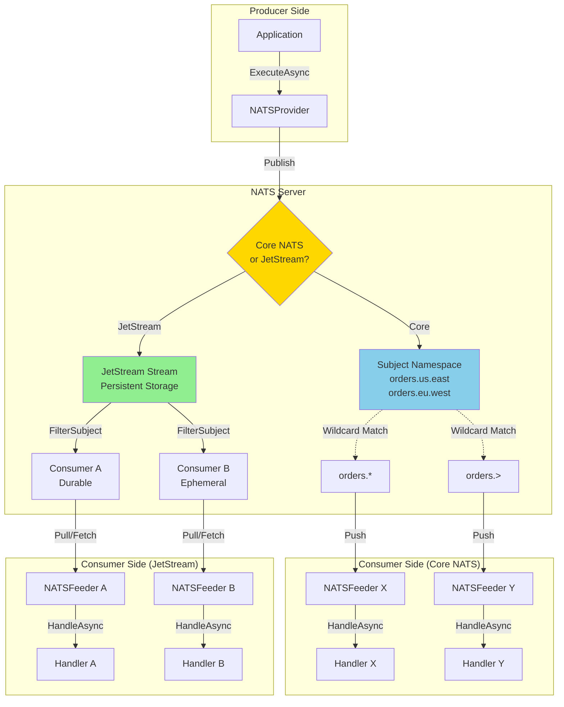

# NATS Messaging Integration

> Cloud-native messaging with Core NATS and JetStream - High-performance pub/sub with optional persistence

[◂ Back to Documentation](../README.md)

## Contents

- [Overview](#overview)
- [Architecture](#architecture)
- [Projects](#projects)
- [Key Features](#key-features)
- [Core NATS vs JetStream](#core-nats-vs-jetstream)
- [Quick Start](#quick-start)
- [NATS Concepts](#nats-concepts)
- [Use Cases](#use-cases)
- [Performance](#performance)
- [See Also](#see-also)

## Overview

The **NATS integration** provides comprehensive support for both Core NATS (fire-and-forget pub/sub) and JetStream (persistent streaming), enabling cloud-native messaging from simple event distribution to durable, acknowledged message processing. NATS excels at high-performance, low-latency communication with elegant subject-based addressing and powerful wildcard routing.

### Why NATS?

- **Extreme performance**: Million+ messages/sec with sub-millisecond latencies
- **Lightweight**: Written in Go, minimal resource footprint
- **Subject-based routing**: Intuitive hierarchical addressing (e.g., `orders.us.east.widgets`)
- **Wildcard subscriptions**: `*` (single token) and `>` (multi-token) patterns
- **Dual modes**: Core NATS (at-most-once) + JetStream (persistence, acks, replay)
- **Cloud-native**: Kubernetes-ready, CNCF-incubated project
- **Multi-tenancy**: Accounts and secure isolation
- **Built-in patterns**: Request/reply, queue groups, KV store, object store

## Architecture



## Projects

| Project | Type | Description | Documentation |
|---------|------|-------------|---------------|
| **Feeders.NATS** | Consumer | Pull-based feeder using NATS.Net for Core NATS and JetStream consumption | [README](Feeders.NATS/README.md) (893 lines) |
| **Providers.DotNet.NATS** | Publisher | Message publisher with Core NATS and JetStream support | [README](Providers.DotNet.NATS/README.md) (926 lines) |
| **Feeviders.NATS.SharedKernel** | Utilities | Client factory, serializers, and configuration abstractions | [README](Feeviders.NATS.SharedKernel/README.md) (984 lines) |

## Key Features

### Feeder (Consumer) Features

- ✅ **Dual Mode Support**: Core NATS (basic pub/sub) and JetStream (persistent streams)
- ✅ **Pull-based Consumption**: Client controls message fetching with backpressure
- ✅ **Subject Wildcards**: Subscribe with `*` (single token) or `>` (multi-token)
- ✅ **Queue Groups**: Load-balanced message distribution (Core NATS)
- ✅ **Durable Consumers**: Resume from last acknowledged position (JetStream)
- ✅ **Ephemeral Consumers**: Temporary subscriptions (JetStream)
- ✅ **Automatic Acks**: Configurable acknowledgment after processing (JetStream)
- ✅ **Filter Subjects**: Consumer-level subject filtering (JetStream)
- ✅ **Multiple Serialization**: JSON, Newtonsoft.Json, NetJSON support
- ✅ **OpenTelemetry**: Built-in distributed tracing with W3C context propagation
- ✅ **Health Monitoring**: Real-time connection and stream health reporting

### Provider (Publisher) Features

- ✅ **Core NATS Publishing**: Fire-and-forget messaging with minimal latency
- ✅ **JetStream Publishing**: Persistent messages with PubAck confirmation
- ✅ **Subject Routing**: Hierarchical subject addressing (e.g., `orders.us.east`)
- ✅ **Request/Reply**: Built-in request/reply pattern (Core NATS)
- ✅ **Message Headers**: Custom metadata via NatsHeaders
- ✅ **Idempotent Publishing**: Message ID-based deduplication (JetStream)
- ✅ **Stream Creation**: Automatic JetStream stream initialization
- ✅ **Publisher Confirms**: PubAck validation for guaranteed delivery (JetStream)
- ✅ **Connection Pooling**: Efficient NATS client reuse
- ✅ **Serialization**: JSON, NJson, NetJSON support

## Core NATS vs JetStream

### Core NATS (Fire-and-Forget)

**Best For**: Low-latency events, ephemeral data, high-throughput scenarios

| Feature | Behavior |
|---------|----------|
| **Persistence** | None - messages exist only in-flight |
| **Acknowledgments** | None - at-most-once delivery |
| **Replay** | Not supported |
| **Ordering** | No guarantees (subject to network latency) |
| **Performance** | Extremely fast (sub-millisecond) |
| **Use Cases** | Telemetry, sensor data, real-time notifications |

**Example Subject Patterns**:
```
telemetry.sensors.temperature.room1
events.user.login
notifications.alert.critical
```

### JetStream (Persistent Streaming)

**Best For**: Critical messages, event sourcing, durable queues, guaranteed delivery

| Feature | Behavior |
|---------|----------|
| **Persistence** | Durable storage (file or memory-backed) |
| **Acknowledgments** | Explicit/All/None - at-least-once or exactly-once |
| **Replay** | Full replay from any point (by sequence, time, or policy) |
| **Ordering** | Guaranteed per-subject ordering |
| **Performance** | High throughput with persistence overhead (~100μs) |
| **Use Cases** | Order processing, event sourcing, work queues |

**Delivery Policies**:
- `All`: Start from first available message
- `Last`: Start from most recent message
- `New`: Only receive new messages
- `ByStartSequence`: Start from specific sequence number
- `ByStartTime`: Start from specific timestamp

**Ack Policies**:
- `Explicit`: Manual ack per message (at-least-once)
- `All`: Ack automatically acknowledges all prior messages
- `None`: No acks required (fire-and-forget within JetStream)

## Quick Start

### Installation

```bash
# Add GitHub Packages source (one-time setup)
dotnet nuget add source https://nuget.pkg.github.com/KiarashMinoo/index.json \
  -n github -u YOUR_USERNAME -p YOUR_GITHUB_TOKEN --store-password-in-clear-text

# Install NATS packages
dotnet add package ThunderPropagator.Feeders.NATS
dotnet add package ThunderPropagator.Providers.DotNet.NATS
```

### Basic Core NATS Pub/Sub

```csharp
// Configuration
public class TelemetryMessage : NatsFeederMessage
{
    public string Sensor { get; set; }
    public double Temperature { get; set; }
    public DateTime Timestamp { get; set; }
}

public class TelemetryFeederConfig : NatsFeederConfiguration
{
    // Subject with wildcard to match all rooms
    public override string Subject => "telemetry.sensors.temperature.*";
    public override MessagingType MessagingType => MessagingType.Basic;
}

// Feeder registration
services.AddNatsFeeder<TelemetryChannel, TelemetryMessage, TelemetryFeederConfig>(
    configuration, "Messaging:NATS:Telemetry");

// Provider registration
services.AddNatsProvider<TelemetryMessage, TelemetryProviderConfig>(
    configuration, "Messaging:NATS:Telemetry");

// appsettings.json
{
  "Messaging": {
    "NATS": {
      "Telemetry": {
        "Url": "nats://localhost:4222",
        "Subject": "telemetry.sensors.temperature.room1",
        "MessagingType": 0  // Basic
      }
    }
  }
}
```

### JetStream with Durable Consumer

```csharp
// Order processing with guaranteed delivery
public class OrderMessage : NatsFeederMessage
{
    public string OrderId { get; set; }
    public decimal Amount { get; set; }
}

public class OrderFeederConfig : NatsFeederConfiguration
{
    public override string Subject => "orders.created";
    public override MessagingType MessagingType => MessagingType.JetStream;
    public override string StreamName => "ORDERS";
    public override ConsumerConfig ConsumerConfig => new()
    {
        Name = "order-processor",
        DurableName = "order-processor-durable",  // Survives restarts
        AckPolicy = ConsumerConfigAckPolicy.Explicit,  // Manual acks
        DeliverPolicy = ConsumerConfigDeliverPolicy.All,  // Process all messages
        MaxDeliver = 5,  // Retry up to 5 times
        AckWait = TimeSpan.FromSeconds(30),  // 30s to ack before redelivery
        FilterSubjects = new[] { "orders.created", "orders.updated" }
    };
}

// appsettings.json
{
  "Messaging": {
    "NATS": {
      "Orders": {
        "Url": "nats://localhost:4222",
        "Subject": "orders.created",
        "MessagingType": 1,  // JetStream
        "StreamName": "ORDERS",
        "ConsumerConfig": {
          "Name": "order-processor",
          "DurableName": "order-processor-durable",
          "AckPolicy": 1,  // Explicit
          "DeliverPolicy": 0,  // All
          "MaxDeliver": 5,
          "AckWait": 30000000000  // 30s in nanoseconds
        }
      }
    }
  }
}
```

## NATS Concepts

### Subject-Based Addressing

NATS uses hierarchical subject names with `.` delimiters:

```
orders.us.east.widgets
orders.us.west.gadgets
orders.eu.north.widgets
telemetry.sensors.temperature.room42
events.user.1234.login
```

### Wildcard Subscriptions

| Wildcard | Matches | Example |
|----------|---------|---------|
| `*` | Single token | `orders.*.east` matches `orders.us.east`, `orders.ca.east` |
| `>` | One or more tokens at end | `orders.>` matches `orders.us.east`, `orders.eu.north.widgets` |

**Important**: Wildcards only work in Core NATS subscriptions and JetStream FilterSubjects, not in publish subjects.

### Queue Groups (Core NATS)

Distribute messages across multiple consumers for load balancing:

```csharp
// All consumers with same QueueGroup receive messages in round-robin fashion
public class WorkerFeederConfig : NatsFeederConfiguration
{
    public override string Subject => "work.jobs";
    public override string QueueGroup => "worker-pool";  // Load balancing
}
```

**Behavior**:
- Only one member of the queue group receives each message
- Automatic load distribution
- No ordering guarantees across queue members

### JetStream Streams

Persistent, replicated, ordered message logs:

```csharp
public class OrderProviderConfig : NatsProviderConfiguration
{
    public override string Subject => "orders.created";
    public override StreamConfig StreamConfig => new()
    {
        Name = "ORDERS",
        Subjects = new[] { "orders.>" },  // Capture all order subjects
        Retention = StreamConfigRetention.Limits,  // Retain by limits
        MaxAge = TimeSpan.FromDays(7),  // Keep 7 days
        MaxBytes = 1_000_000_000,  // 1GB max storage
        MaxMsgs = 1_000_000,  // 1M messages max
        Storage = StreamConfigStorage.File,  // Persistent to disk
        Replicas = 3,  // 3-way replication for HA
        Discard = StreamConfigDiscard.Old  // Remove oldest on limit
    };
}
```

### JetStream Consumers

Stateful subscriptions to streams:

**Durable Consumers**:
- Named with `DurableName`
- Persist across client disconnects
- Resume from last acknowledged position
- Ideal for guaranteed processing

**Ephemeral Consumers**:
- No `DurableName` specified
- Deleted when client disconnects
- Start fresh on reconnect
- Ideal for temporary subscriptions

### Acknowledgments (JetStream)

**Explicit Ack** (At-Least-Once):
```csharp
await message.AckAsync();  // Manual ack after processing
```

**All Ack** (Batch Ack):
```csharp
// Acknowledging message N also acks all messages < N
await message.AckAsync();
```

**None Ack** (Fire-and-Forget):
```csharp
// No acks required - JetStream persistence without delivery guarantees
ConsumerConfig.AckPolicy = ConsumerConfigAckPolicy.None;
```

## Use Cases

### Core NATS Use Cases

| Use Case | Subject Pattern | Why Core NATS? |
|----------|----------------|----------------|
| **Telemetry/Metrics** | `telemetry.cpu.server1` | High throughput, ephemeral data |
| **Real-time Notifications** | `notifications.alert.critical` | Low latency, transient events |
| **Service Discovery** | `discovery.service.api-gateway` | Lightweight heartbeats |
| **Request/Reply RPC** | `rpc.user-service.getUser` | Built-in request/reply pattern |

### JetStream Use Cases

| Use Case | Subject Pattern | Why JetStream? |
|----------|----------------|----------------|
| **Order Processing** | `orders.created` | Guaranteed delivery, replay |
| **Event Sourcing** | `events.account.>` | Full event history, ordering |
| **Work Queues** | `jobs.processing.batch` | Durable queues, retries |
| **Audit Logs** | `audit.user.action` | Long-term persistence, compliance |
| **Change Data Capture** | `cdc.database.users` | Ordered changes, replay |

## Performance

### Core NATS Benchmarks

| Metric | Value | Notes |
|--------|-------|-------|
| **Throughput** | 10M+ msgs/sec | Single NATS server, small messages |
| **Latency** | < 1ms p99 | Intra-datacenter |
| **Overhead** | ~500 bytes | Per message (headers + protocol) |
| **Fanout** | 10,000+ subscribers | Subject-based routing |

### JetStream Benchmarks

| Metric | Value | Notes |
|--------|-------|-------|
| **Throughput** | 1M+ msgs/sec | File-backed storage |
| **Latency** | < 5ms p99 | Includes persistence |
| **Ack Latency** | ~100μs | PubAck confirmation |
| **Storage** | File or Memory | Configurable per stream |

### Optimization Tips

1. **Batch Pulls**: Fetch multiple messages per request (JetStream)
   ```csharp
   ConsumerConfig.MaxBatch = 100;
   ConsumerConfig.MaxBytes = 1_000_000;
   ```

2. **Subject Design**: Keep subjects shallow (3-5 tokens) for faster routing
   ```
   ✅ orders.us.created
   ❌ company.division.team.app.module.orders.region.us.type.created
   ```

3. **Connection Pooling**: Reuse NatsClient instances
   ```csharp
   services.AddSingleton<INatsClient>(sp => 
       NatsClientFactory.CreateClient(config, loggerFactory));
   ```

4. **Queue Groups**: Distribute load across consumers (Core NATS)
   ```csharp
   QueueGroup = "worker-pool";  // Load balance across instances
   ```

5. **Durable Consumers**: Use for mission-critical processing (JetStream)
   ```csharp
   DurableName = "order-processor";  // Survive restarts
   ```

## See Also

- [**Feeders.NATS**](Feeders.NATS/README.md) - Consumer implementation deep dive
- [**Providers.DotNet.NATS**](Providers.DotNet.NATS/README.md) - Publisher implementation guide
- [**Feeviders.NATS.SharedKernel**](Feeviders.NATS.SharedKernel/README.md) - Shared utilities and configuration
- [NATS Official Documentation](https://docs.nats.io/) - Protocol and server documentation
- [JetStream Guide](https://docs.nats.io/nats-concepts/jetstream) - Persistent streaming concepts
- [NATS.Net Client](https://github.com/nats-io/nats.net) - Official .NET client library

---

**Next Steps**:
1. Review [Feeders.NATS](Feeders.NATS/README.md) for consumer implementation
2. Explore [Providers.DotNet.NATS](Providers.DotNet.NATS/README.md) for publisher patterns
3. Check [Feeviders.NATS.SharedKernel](Feeviders.NATS.SharedKernel/README.md) for configuration details
