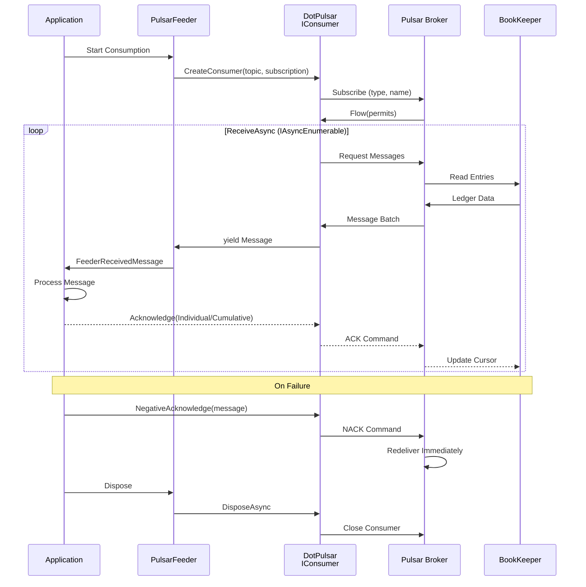

# ThunderPropagator.Feeders.Pulsar

## Overview

**ThunderPropagator.Feeders.Pulsar** provides a high-performance, pull-based message consumer for Apache Pulsar using the DotPulsar client library. As an `IterativeFeeder` implementation, it offers seamless integration with ThunderPropagator's channel-based architecture while supporting all Pulsar subscription types (Exclusive, Failover, Shared, Key_Shared), schema validation, dead letter topics, and comprehensive observability.

### Key Features

- ✅ **Pull-Based Consumption**: Leverages `IAsyncEnumerable` for efficient, backpressure-aware message streaming
- ✅ **All Subscription Types**: Exclusive, Failover, Shared, and Key_Shared for flexible consumption patterns
- ✅ **Schema Validation**: JSON, Avro, and Protobuf schema enforcement with evolution support
- ✅ **Dead Letter Topics**: Automatic routing of unprocessable messages after max retries
- ✅ **Multi-Tenancy**: Full support for Pulsar's tenant/namespace/topic hierarchy
- ✅ **Acknowledgment Control**: Individual, cumulative, and negative acknowledgments
- ✅ **OpenTelemetry**: Distributed tracing with Activity context propagation
- ✅ **Health Monitoring**: Built-in health checks with consumer stats integration
- ✅ **TLS/Authentication**: Client certificates, token-based auth, and OAuth2 support
- ✅ **.NET 8/9/10**: Multi-targeted for latest runtime features

### When to Use This Feeder

| Use Case | Recommendation |
|----------|----------------|
| **Sequential Processing** | ✅ Exclusive subscription (single active consumer) |
| **High Availability + Ordering** | ✅ Failover subscription (active-standby) |
| **Maximum Throughput** | ✅ Shared subscription (round-robin to multiple consumers) |
| **Per-Key Ordering** | ✅ Key_Shared subscription (key-based routing with scale) |
| **Multi-Tenant Workloads** | ✅ Tenant/namespace isolation with resource quotas |
| **Schema Enforcement** | ✅ Avro/JSON/Protobuf validation at consumption |
| **Geo-Replicated Topics** | ✅ Consume from replicated topics across datacenters |

## Architecture



### Pull-Based Consumption Flow

Unlike push-based feeders (WebSocket, MQTT), PulsarFeeder uses **pull semantics**:

1. **Prefetch Buffer**: DotPulsar maintains internal queue (`MessagePrefetchCount`)
2. **Async Enumeration**: `ReceiveAsync()` returns `IAsyncEnumerable<FeederReceivedMessage<T>>`
3. **Backpressure**: Consumer controls flow by consuming iterator (no overflow)
4. **Acknowledgment**: Explicit ack required (individual or cumulative)
5. **Redelivery**: Unacknowledged messages redeliver after timeout or NACK

## Project Structure

### Files

| File | Lines | Responsibility |
|------|-------|----------------|
| **PulsarFeeder.cs** | 63 | Core IterativeFeeder implementation with DotPulsar IConsumer |
| **PulsarFeederConfiguration.cs** | 71 | Configuration class extending AbstractPulsarFeevidersConfiguration |
| **PulsarFeederExtensions.cs** | 53 | DI registration methods (AddPulsarFeeder, resolver patterns) |
| **PulsarFeederMessage.cs** | 5 | Abstract message base class |
| **Total** | **192** | **Complete feeder implementation** |

### Dependencies

```xml
<PackageReference Include="DotPulsar" Version="3.3.1" />
<PackageReference Include="ThunderPropagator" Version="1.0.1-beta.2" />
<PackageReference Include="ThunderPropagator.BuildingBlocks" Version="1.0.1-beta.2" />
<PackageReference Include="ThunderPropagator.Feeviders.Pulsar.SharedKernel" Version="1.0.1-beta.2" />
<PackageReference Include="Microsoft.Extensions.DependencyInjection" Version="9.0.0" />
<PackageReference Include="OpenTelemetry.Api" Version="1.10.0" />
```

## Configuration

### PulsarFeederConfiguration Properties

| Property | Type | Default | Description |
|----------|------|---------|-------------|
| **Core** ||||
| `Id` | `Guid` | `Guid.NewGuid()` | Unique feeder instance identifier |
| `IsEnabled` | `bool` | `false` | Enable/disable feeder processing |
| `ServiceUrl` | `Uri` | *Required* | Pulsar broker URL (`pulsar://` or `pulsar+ssl://`) |
| `Topic` | `string` | *Required* | Full topic name (e.g., `persistent://tenant/namespace/topic`) |
| `SubscriptionName` | `string` | *Required* | Subscription identifier (durable cursor) |
| **Consumer** ||||
| `SubscriptionType` | `SubscriptionType?` | `Exclusive` | Exclusive, Failover, Shared, or Key_Shared |
| `ConsumerName` | `string?` | Auto-generated | Consumer identifier (visible in stats) |
| `InitialPosition` | `SubscriptionInitialPosition?` | `Latest` | Latest (new messages) or Earliest (reprocess all) |
| `MessagePrefetchCount` | `uint?` | `1000` | Prefetch buffer size (higher = more throughput) |
| `PriorityLevel` | `int?` | `null` | Consumer priority (0 = highest, Failover only) |
| `ReadCompacted` | `bool?` | `false` | Read only latest value per key (compacted topics) |
| **Serialization** ||||
| `SerializerType` | `SerializerType` | `Json` | Json, NJson, NetJson (see JsonSchema implementation) |
| `EnrichmentScript` | `string?` | `null` | C# script for message enrichment (optional) |
| `MetadataReferences` | `string[]?` | `null` | Additional assemblies for enrichment scripts |
| **Connection** ||||
| `EncryptionPolicy` | `EncryptionPolicy?` | `null` | EnforceEncrypted, EnforceUnencrypted (TLS control) |
| `KeepAliveInterval` | `TimeSpan?` | `30s` | Heartbeat interval to detect dead connections |
| `ListenerName` | `string?` | `null` | Advertised listener for client routing |
| `RetryInterval` | `TimeSpan?` | `3s` | Reconnection backoff interval |
| `VerifyCertificateAuthority` | `bool?` | `true` | Validate server certificate against CA (TLS) |
| `VerifyCertificateName` | `bool?` | `true` | Validate server certificate hostname (TLS) |
| `CloseInactiveConnectionsInterval` | `TimeSpan?` | `60s` | Close idle connections after duration |
| **Authentication** ||||
| `AuthenticateUsingClientCertificate` | `CertificateModel?` | `null` | Client certificate for mutual TLS (X.509 path/thumbprint) |
| `TrustedCertificateAuthority` | `CertificateModel?` | `null` | CA certificate for server validation (PEM path) |

### SubscriptionType Values

| Type | Behavior | Ordering | Use Case |
|------|----------|----------|----------|
| `Exclusive` | Single active consumer | Full (publish order) | Sequential processing, state machines |
| `Failover` | Multiple consumers, one active (leader election) | Full (active consumer) | HA + ordering (financial transactions) |
| `Shared` | Multiple active consumers (round-robin) | None | Stateless, max throughput (log aggregation) |
| `Key_Shared` | Multiple active consumers (key-based routing) | Per-key | Per-entity processing with scale (user tasks) |

### InitialPosition Values

| Value | Behavior | Use Case |
|-------|----------|----------|
| `Latest` | Consume new messages only (default) | Real-time processing |
| `Earliest` | Reprocess all messages from beginning | Historical replay, reprocessing |

## API Reference

### PulsarFeeder Class

```csharp
internal sealed class PulsarFeeder<TChannel, TPulsarFeederMessage, TPulsarFeederConfiguration>
    : IterativeFeeder<TChannel, TPulsarFeederMessage, TPulsarFeederConfiguration>, IFeature
    where TChannel : class, IChannel
    where TPulsarFeederMessage : PulsarFeederMessage
    where TPulsarFeederConfiguration : PulsarFeederConfiguration
```

**Constructor**:
```csharp
public PulsarFeeder(
    TChannel channel,
    TPulsarFeederConfiguration feederConfiguration,
    IFeederHandler<TChannel, TPulsarFeederMessage> feederHandler,
    IServiceProvider serviceProvider)
```

**Key Methods**:
```csharp
// Core consumption method (overrides IterativeFeeder)
protected override IAsyncEnumerable<FeederReceivedMessage<TPulsarFeederMessage>> 
    ReceiveAsync(CancellationToken cancellationToken = default);

// Cleanup
protected override ValueTask DisposeManagedResourcesAsync();
```

**Inherited Properties**:
```csharp
public string HealthName { get; init; }        // Auto-set: "feeder_Pulsar_{Topic}_{SubscriptionName}"
public string[] HealthTags { get; init; }      // ["Pulsar", topic, subscription]
protected ILogger Logger { get; }              // Injected logger
```

### PulsarFeederMessage Class

```csharp
public abstract class PulsarFeederMessage : FeederMessage
{
    // Inherits Dictionary<string, object> functionality
    // Store custom metadata: message["key"] = value
    
    // Built-in keys (set by PulsarFeeder):
    // - "ActivityContext" (ActivityContext) — OpenTelemetry tracing
    // - "Baggage" (Baggage) — Distributed context propagation
}
```

### PulsarFeederConfiguration Class

```csharp
public abstract class PulsarFeederConfiguration 
    : AbstractPulsarFeevidersConfiguration, IAbstractFeederConfiguration
{
    // Required properties
    public Guid Id { get; set; }
    public string Topic { get; set; }
    public string SubscriptionName { get; set; }
    
    // Consumer settings
    public SubscriptionType? SubscriptionType { get; set; }
    public string? ConsumerName { get; set; }
    public SubscriptionInitialPosition? InitialPosition { get; set; }
    public uint? MessagePrefetchCount { get; set; }
    public int? PriorityLevel { get; set; }
    public bool? ReadCompacted { get; set; }
    
    // Serialization
    public SerializerType SerializerType { get; set; }
    public string? EnrichmentScript { get; set; }
    public string[]? MetadataReferences { get; set; }
}
```

### Extension Methods

```csharp
// Standard DI registration
public static IServiceCollection AddPulsarFeeder<TChannel, TPulsarFeederMessage, TPulsarFeederConfiguration>(
    this IServiceCollection services,
    IConfigurationRoot configuration,
    string sectionName)
    where TChannel : class, IChannel
    where TPulsarFeederMessage : PulsarFeederMessage
    where TPulsarFeederConfiguration : PulsarFeederConfiguration, new();

// Resolver pattern for multi-tenant scenarios
public static IServiceCollection AddPulsarFeederResolver<TChannel, TPulsarFeederMessage, TPulsarFeederConfiguration>(
    this IServiceCollection services)
    where TChannel : class, IChannel
    where TPulsarFeederMessage : PulsarFeederMessage
    where TPulsarFeederConfiguration : PulsarFeederConfiguration, new();

public static IApplicationBuilder UsePulsarFeederResolver<TChannel, TPulsarFeederMessage, TPulsarFeederConfiguration>(
    this IApplicationBuilder app,
    Guid channelKey,
    TPulsarFeederConfiguration pulsarFeederConfiguration)
    where TChannel : class, IChannel
    where TPulsarFeederMessage : PulsarFeederMessage
    where TPulsarFeederConfiguration : PulsarFeederConfiguration;
```

## Examples

### 1. Basic Exclusive Subscription (Single Consumer)

**Use Case**: Sequential order processing with guaranteed ordering.

```csharp
// Message definition
public class OrderMessage : PulsarFeederMessage
{
    public string OrderId { get; set; }
    public decimal Amount { get; set; }
    public string Status { get; set; }
    public DateTimeOffset CreatedAt { get; set; }
}

// Configuration
public class OrderFeederConfig : PulsarFeederConfiguration { }

// Handler
public class OrderFeederHandler : IFeederHandler<OrderChannel, OrderMessage>
{
    private readonly ILogger<OrderFeederHandler> _logger;
    private readonly IOrderService _orderService;

    public OrderFeederHandler(
        ILogger<OrderFeederHandler> logger,
        IOrderService orderService)
    {
        _logger = logger;
        _orderService = orderService;
    }

    public async Task HandleAsync(
        OrderChannel channel,
        FeederReceivedMessage<OrderMessage> receivedMessage,
        CancellationToken cancellationToken = default)
    {
        var order = receivedMessage.Message;
        
        _logger.LogInformation(
            "Processing order {OrderId} with amount ${Amount}",
            order.OrderId, order.Amount);

        try
        {
            await _orderService.ProcessOrderAsync(order, cancellationToken);
            _logger.LogInformation("Order {OrderId} processed successfully", order.OrderId);
        }
        catch (Exception ex)
        {
            _logger.LogError(ex, "Failed to process order {OrderId}", order.OrderId);
            throw; // Trigger redelivery
        }
    }
}

// DI Registration
services.AddPulsarFeeder<OrderChannel, OrderMessage, OrderFeederConfig>(
    configuration, "Messaging:Pulsar:OrderFeeder");

services.AddTransient<IFeederHandler<OrderChannel, OrderMessage>, OrderFeederHandler>();

// appsettings.json
{
  "Messaging": {
    "Pulsar": {
      "OrderFeeder": {
        "IsEnabled": true,
        "ServiceUrl": "pulsar://localhost:6650",
        "Topic": "persistent://public/default/orders",
        "SubscriptionName": "order-processor",
        "SubscriptionType": "Exclusive",  // Single active consumer
        "InitialPosition": "Latest",
        "MessagePrefetchCount": 500,
        "SerializerType": "Json"
      }
    }
  }
}
```

### 2. Failover Subscription (High Availability)

**Use Case**: Active-standby consumers for HA with ordering preservation.

```csharp
// Message definition
public class PaymentMessage : PulsarFeederMessage
{
    public string PaymentId { get; set; }
    public string OrderId { get; set; }
    public decimal Amount { get; set; }
    public string Provider { get; set; }
}

// Configuration
public class PaymentFeederConfig : PulsarFeederConfiguration { }

// Handler
public class PaymentFeederHandler : IFeederHandler<PaymentChannel, PaymentMessage>
{
    private readonly ILogger<PaymentFeederHandler> _logger;
    private readonly IPaymentGateway _gateway;

    public PaymentFeederHandler(
        ILogger<PaymentFeederHandler> logger,
        IPaymentGateway gateway)
    {
        _logger = logger;
        _gateway = gateway;
    }

    public async Task HandleAsync(
        PaymentChannel channel,
        FeederReceivedMessage<PaymentMessage> receivedMessage,
        CancellationToken cancellationToken = default)
    {
        var payment = receivedMessage.Message;
        
        _logger.LogInformation(
            "Processing payment {PaymentId} for order {OrderId}",
            payment.PaymentId, payment.OrderId);

        try
        {
            var result = await _gateway.ProcessPaymentAsync(
                payment.PaymentId,
                payment.Amount,
                payment.Provider,
                cancellationToken);

            if (!result.Success)
            {
                _logger.LogWarning(
                    "Payment {PaymentId} failed: {Reason}",
                    payment.PaymentId, result.Reason);
                throw new PaymentFailedException(result.Reason);
            }

            _logger.LogInformation("Payment {PaymentId} succeeded", payment.PaymentId);
        }
        catch (Exception ex)
        {
            _logger.LogError(ex, "Payment processing error: {PaymentId}", payment.PaymentId);
            throw;
        }
    }
}

// DI Registration (deploy on multiple instances)
services.AddPulsarFeeder<PaymentChannel, PaymentMessage, PaymentFeederConfig>(
    configuration, "Messaging:Pulsar:PaymentFeeder");

services.AddTransient<IFeederHandler<PaymentChannel, PaymentMessage>, PaymentFeederHandler>();

// appsettings.json
{
  "Messaging": {
    "Pulsar": {
      "PaymentFeeder": {
        "IsEnabled": true,
        "ServiceUrl": "pulsar://localhost:6650",
        "Topic": "persistent://public/default/payments",
        "SubscriptionName": "payment-processor",
        "SubscriptionType": "Failover",  // One active, others standby
        "ConsumerName": "payment-consumer-1",  // Unique per instance
        "PriorityLevel": 0,  // 0 = highest priority (preferred leader)
        "InitialPosition": "Latest",
        "MessagePrefetchCount": 1000,
        "SerializerType": "Json",
        "KeepAliveInterval": "00:00:30"  // Detect failures in 30s
      }
    }
  }
}

// Deploy instance 2 with PriorityLevel: 1 (standby)
// Deploy instance 3 with PriorityLevel: 2 (standby)
// If instance 1 fails, instance 2 becomes active automatically
```

### 3. Shared Subscription (Maximum Throughput)

**Use Case**: Stateless log aggregation with horizontal scaling.

```csharp
// Message definition
public class LogMessage : PulsarFeederMessage
{
    public string LogId { get; set; }
    public string Source { get; set; }
    public string Level { get; set; }
    public string Message { get; set; }
    public DateTimeOffset Timestamp { get; set; }
}

// Configuration
public class LogFeederConfig : PulsarFeederConfiguration { }

// Handler (stateless processing)
public class LogFeederHandler : IFeederHandler<LogChannel, LogMessage>
{
    private readonly ILogger<LogFeederHandler> _logger;
    private readonly ILogAggregator _aggregator;

    public LogFeederHandler(
        ILogger<LogFeederHandler> logger,
        ILogAggregator aggregator)
    {
        _logger = logger;
        _aggregator = aggregator;
    }

    public async Task HandleAsync(
        LogChannel channel,
        FeederReceivedMessage<LogMessage> receivedMessage,
        CancellationToken cancellationToken = default)
    {
        var log = receivedMessage.Message;

        // Stateless processing (no ordering required)
        await _aggregator.IndexLogAsync(
            log.LogId,
            log.Source,
            log.Level,
            log.Message,
            log.Timestamp,
            cancellationToken);

        _logger.LogDebug("Indexed log {LogId} from {Source}", log.LogId, log.Source);
    }
}

// DI Registration
services.AddPulsarFeeder<LogChannel, LogMessage, LogFeederConfig>(
    configuration, "Messaging:Pulsar:LogFeeder");

services.AddTransient<IFeederHandler<LogChannel, LogMessage>, LogFeederHandler>();

// appsettings.json
{
  "Messaging": {
    "Pulsar": {
      "LogFeeder": {
        "IsEnabled": true,
        "ServiceUrl": "pulsar://pulsar.example.com:6650",
        "Topic": "persistent://logs/production/application-logs",
        "SubscriptionName": "log-aggregator",
        "SubscriptionType": "Shared",  // Round-robin to all consumers
        "ConsumerName": "log-consumer-{HOSTNAME}",  // Unique per pod
        "InitialPosition": "Latest",
        "MessagePrefetchCount": 2000,  // High prefetch for throughput
        "SerializerType": "Json"
      }
    }
  }
}

// Deploy 10+ instances for horizontal scaling
// Each instance receives ~10% of messages (round-robin)
```

### 4. Key_Shared Subscription (Per-Key Ordering)

**Use Case**: Per-user task processing with horizontal scaling and ordering.

```csharp
// Message definition
public class UserTaskMessage : PulsarFeederMessage
{
    public string TaskId { get; set; }
    public string UserId { get; set; }  // Key for routing
    public string TaskType { get; set; }
    public string Payload { get; set; }
    public int SequenceNumber { get; set; }
}

// Configuration
public class UserTaskFeederConfig : PulsarFeederConfiguration { }

// Handler
public class UserTaskFeederHandler : IFeederHandler<UserTaskChannel, UserTaskMessage>
{
    private readonly ILogger<UserTaskFeederHandler> _logger;
    private readonly IUserTaskService _taskService;

    public UserTaskFeederHandler(
        ILogger<UserTaskFeederHandler> logger,
        IUserTaskService taskService)
    {
        _logger = logger;
        _taskService = taskService;
    }

    public async Task HandleAsync(
        UserTaskChannel channel,
        FeederReceivedMessage<UserTaskMessage> receivedMessage,
        CancellationToken cancellationToken = default)
    {
        var task = receivedMessage.Message;

        // All tasks for same UserId processed in order by same consumer
        _logger.LogInformation(
            "Processing task {TaskId} (seq {Seq}) for user {UserId}",
            task.TaskId, task.SequenceNumber, task.UserId);

        try
        {
            await _taskService.ExecuteTaskAsync(
                task.UserId,
                task.TaskType,
                task.Payload,
                cancellationToken);

            _logger.LogInformation(
                "Completed task {TaskId} for user {UserId}",
                task.TaskId, task.UserId);
        }
        catch (Exception ex)
        {
            _logger.LogError(ex,
                "Task execution failed: {TaskId} (user: {UserId})",
                task.TaskId, task.UserId);
            throw;
        }
    }
}

// DI Registration
services.AddPulsarFeeder<UserTaskChannel, UserTaskMessage, UserTaskFeederConfig>(
    configuration, "Messaging:Pulsar:UserTaskFeeder");

services.AddTransient<IFeederHandler<UserTaskChannel, UserTaskMessage>, UserTaskFeederHandler>();

// appsettings.json
{
  "Messaging": {
    "Pulsar": {
      "UserTaskFeeder": {
        "IsEnabled": true,
        "ServiceUrl": "pulsar://pulsar.example.com:6650",
        "Topic": "persistent://tasks/production/user-tasks",
        "SubscriptionName": "user-task-processor",
        "SubscriptionType": "Key_Shared",  // Key-based routing with scale
        "ConsumerName": "task-consumer-{POD_NAME}",
        "InitialPosition": "Latest",
        "MessagePrefetchCount": 1000,
        "SerializerType": "Json"
      }
    }
  }
}

// Producer must set message key (UserId):
// message["key"] = userId;
// All messages with same key go to same consumer (ordering preserved)
// Different keys distributed across consumers (horizontal scaling)
```

### 5. Schema Validation (JSON Schema)

**Use Case**: Enforce message structure with JSON schema validation.

```csharp
// Message definition with validation attributes
public class ProductMessage : PulsarFeederMessage
{
    [Required]
    public string ProductId { get; set; }
    
    [Required, MinLength(3)]
    public string Name { get; set; }
    
    [Range(0.01, 1000000)]
    public decimal Price { get; set; }
    
    [Required]
    public string Category { get; set; }
    
    public Dictionary<string, string> Attributes { get; set; }
}

// Configuration
public class ProductFeederConfig : PulsarFeederConfiguration { }

// Handler
public class ProductFeederHandler : IFeederHandler<ProductChannel, ProductMessage>
{
    private readonly ILogger<ProductFeederHandler> _logger;
    private readonly IProductCatalog _catalog;

    public ProductFeederHandler(
        ILogger<ProductFeederHandler> logger,
        IProductCatalog catalog)
    {
        _logger = logger;
        _catalog = catalog;
    }

    public async Task HandleAsync(
        ProductChannel channel,
        FeederReceivedMessage<ProductMessage> receivedMessage,
        CancellationToken cancellationToken = default)
    {
        var product = receivedMessage.Message;

        // Schema already validated by JsonSchema<T>
        _logger.LogInformation(
            "Updating product {ProductId}: {Name} (${Price})",
            product.ProductId, product.Name, product.Price);

        await _catalog.UpsertProductAsync(
            product.ProductId,
            product.Name,
            product.Price,
            product.Category,
            product.Attributes,
            cancellationToken);

        _logger.LogInformation("Product {ProductId} updated", product.ProductId);
    }
}

// DI Registration
services.AddPulsarFeeder<ProductChannel, ProductMessage, ProductFeederConfig>(
    configuration, "Messaging:Pulsar:ProductFeeder");

services.AddTransient<IFeederHandler<ProductChannel, ProductMessage>, ProductFeederHandler>();

// appsettings.json
{
  "Messaging": {
    "Pulsar": {
      "ProductFeeder": {
        "IsEnabled": true,
        "ServiceUrl": "pulsar://localhost:6650",
        "Topic": "persistent://catalog/production/products",
        "SubscriptionName": "product-catalog-sync",
        "SubscriptionType": "Exclusive",
        "InitialPosition": "Latest",
        "SerializerType": "Json"  // JSON schema validation via JsonSchema<T>
      }
    }
  }
}

// JsonSchema<ProductMessage> automatically validates:
// - Required properties present
// - String lengths within bounds
// - Numeric ranges valid
// - Type correctness
// Invalid messages throw exception (trigger redelivery or DLQ)
```

### 6. Dead Letter Topic (Poison Message Handling)

**Use Case**: Route unprocessable messages to DLQ after max retries.

```csharp
// Message definition
public class WebhookMessage : PulsarFeederMessage
{
    public string WebhookId { get; set; }
    public string Url { get; set; }
    public string Payload { get; set; }
    public int RetryCount { get; set; }
}

// Configuration
public class WebhookFeederConfig : PulsarFeederConfiguration { }

// Handler
public class WebhookFeederHandler : IFeederHandler<WebhookChannel, WebhookMessage>
{
    private readonly ILogger<WebhookFeederHandler> _logger;
    private readonly IHttpClientFactory _httpFactory;

    public WebhookFeederHandler(
        ILogger<WebhookFeederHandler> logger,
        IHttpClientFactory httpFactory)
    {
        _logger = logger;
        _httpFactory = httpFactory;
    }

    public async Task HandleAsync(
        WebhookChannel channel,
        FeederReceivedMessage<WebhookMessage> receivedMessage,
        CancellationToken cancellationToken = default)
    {
        var webhook = receivedMessage.Message;

        _logger.LogInformation(
            "Delivering webhook {WebhookId} to {Url} (attempt {Retry})",
            webhook.WebhookId, webhook.Url, webhook.RetryCount + 1);

        try
        {
            var client = _httpFactory.CreateClient();
            var response = await client.PostAsync(
                webhook.Url,
                new StringContent(webhook.Payload, Encoding.UTF8, "application/json"),
                cancellationToken);

            response.EnsureSuccessStatusCode();
            
            _logger.LogInformation(
                "Webhook {WebhookId} delivered successfully",
                webhook.WebhookId);
        }
        catch (HttpRequestException ex)
        {
            _logger.LogWarning(ex,
                "Webhook {WebhookId} delivery failed (will retry)",
                webhook.WebhookId);
            
            webhook.RetryCount++;
            throw; // Trigger redelivery (up to MaxRedeliverCount)
        }
    }
}

// DI Registration
services.AddPulsarFeeder<WebhookChannel, WebhookMessage, WebhookFeederConfig>(
    configuration, "Messaging:Pulsar:WebhookFeeder");

services.AddTransient<IFeederHandler<WebhookChannel, WebhookMessage>, WebhookFeederHandler>();

// appsettings.json
{
  "Messaging": {
    "Pulsar": {
      "WebhookFeeder": {
        "IsEnabled": true,
        "ServiceUrl": "pulsar://localhost:6650",
        "Topic": "persistent://webhooks/production/outbound",
        "SubscriptionName": "webhook-delivery",
        "SubscriptionType": "Shared",
        "InitialPosition": "Latest",
        "SerializerType": "Json"
      }
    }
  }
}

// Note: Dead letter configuration is set at namespace level via Pulsar admin:
// pulsar-admin namespaces set-subscription-dispatch-rate \
//   webhooks/production \
//   --max-redelivery-count 3 \
//   --dead-letter-topic persistent://webhooks/production/outbound-dlq

// After 3 failed delivery attempts, message moves to DLQ
// Setup separate consumer for DLQ to handle poison messages:
// - Log for manual investigation
// - Alert operations team
// - Store in error database
```

## Advanced Patterns

### 1. Subscription Mode Selection Guide

Choose the right subscription type based on requirements:

```csharp
// Decision Matrix
public static class SubscriptionModeSelector
{
    public static SubscriptionType SelectMode(ProcessingRequirements requirements)
    {
        return requirements switch
        {
            // Strict ordering + single consumer
            { RequiresOrdering: true, RequiresHA: false } 
                => SubscriptionType.Exclusive,
            
            // Strict ordering + high availability
            { RequiresOrdering: true, RequiresHA: true } 
                => SubscriptionType.Failover,
            
            // Per-key ordering + horizontal scaling
            { RequiresPerKeyOrdering: true, RequiresScale: true } 
                => SubscriptionType.Key_Shared,
            
            // No ordering + maximum throughput
            { RequiresOrdering: false, RequiresScale: true } 
                => SubscriptionType.Shared,
            
            _ => SubscriptionType.Exclusive // Safe default
        };
    }
}

// Usage
public class ProcessingRequirements
{
    public bool RequiresOrdering { get; set; }
    public bool RequiresHA { get; set; }
    public bool RequiresPerKeyOrdering { get; set; }
    public bool RequiresScale { get; set; }
}

// Example: Financial transactions
var transactionMode = SubscriptionModeSelector.SelectMode(new ProcessingRequirements
{
    RequiresOrdering = true,    // Sequential processing
    RequiresHA = true,          // No downtime
    RequiresScale = false       // Single consumer acceptable
});
// Result: Failover (active-standby with ordering)

// Example: User session events
var sessionMode = SubscriptionModeSelector.SelectMode(new ProcessingRequirements
{
    RequiresPerKeyOrdering = true,  // Per-user ordering
    RequiresScale = true            // Handle millions of users
});
// Result: Key_Shared (per-key ordering + scale)
```

### 2. Acknowledgment Strategy (Individual vs Cumulative)

```csharp
// Individual Acknowledgment (Shared/Key_Shared)
public class IndividualAckHandler : IFeederHandler<EventChannel, EventMessage>
{
    private readonly ILogger<IndividualAckHandler> _logger;

    public async Task HandleAsync(
        EventChannel channel,
        FeederReceivedMessage<EventMessage> receivedMessage,
        CancellationToken cancellationToken = default)
    {
        var message = receivedMessage.Message;

        try
        {
            await ProcessEventAsync(message, cancellationToken);
            
            // Individual ack: Only this message acknowledged
            // Other messages in batch can fail independently
            _logger.LogDebug("Event {EventId} acknowledged individually", message.EventId);
        }
        catch (Exception ex)
        {
            _logger.LogWarning(ex, "Event {EventId} processing failed", message.EventId);
            throw; // This message redelivered, others continue
        }
    }
}

// Cumulative Acknowledgment (Exclusive/Failover)
public class CumulativeAckHandler : IFeederHandler<OrderChannel, OrderMessage>
{
    private readonly ILogger<CumulativeAckHandler> _logger;
    private readonly List<OrderMessage> _batch = new();

    public async Task HandleAsync(
        OrderChannel channel,
        FeederReceivedMessage<OrderMessage> receivedMessage,
        CancellationToken cancellationToken = default)
    {
        var order = receivedMessage.Message;
        _batch.Add(order);

        // Process orders in sequence
        if (_batch.Count >= 10) // Batch size
        {
            await ProcessOrderBatchAsync(_batch, cancellationToken);
            
            // Cumulative ack: Acknowledges last message + all prior messages
            _logger.LogInformation("Batch of {Count} orders acknowledged cumulatively", _batch.Count);
            _batch.Clear();
        }
    }
}

// Recommendation:
// - Individual Ack: Use with Shared/Key_Shared (out-of-order processing)
// - Cumulative Ack: Use with Exclusive/Failover (sequential processing, better throughput)
```

### 3. Negative Acknowledgment for Immediate Retry

```csharp
public class SmartRetryHandler : IFeederHandler<TaskChannel, TaskMessage>
{
    private readonly ILogger<SmartRetryHandler> _logger;
    private readonly ITaskService _taskService;

    public async Task HandleAsync(
        TaskChannel channel,
        FeederReceivedMessage<TaskMessage> receivedMessage,
        CancellationToken cancellationToken = default)
    {
        var task = receivedMessage.Message;

        try
        {
            await _taskService.ExecuteAsync(task, cancellationToken);
        }
        catch (TransientException ex) // Retryable error
        {
            _logger.LogWarning(ex,
                "Task {TaskId} failed with transient error, triggering immediate retry",
                task.TaskId);
            
            // Negative acknowledgment: Redeliver immediately (no timeout wait)
            // Note: Pulsar auto-handles negative acks (cannot manually call from feeder)
            throw; // Framework triggers redelivery
        }
        catch (PermanentException ex) // Non-retryable error
        {
            _logger.LogError(ex,
                "Task {TaskId} failed permanently, moving to DLQ",
                task.TaskId);
            
            // Don't retry, let it fail (moves to DLQ after max retries)
            throw;
        }
    }
}

// Configuration for negative ack behavior
{
  "Messaging": {
    "Pulsar": {
      "TaskFeeder": {
        "NegativeAckRedeliveryDelay": "00:00:01"  // 1s delay before retry (Pulsar admin setting)
      }
    }
  }
}

// Set redelivery delay at namespace level (Pulsar CLI):
// pulsar-admin namespaces set-redelivery-delay \
//   tenant/namespace --delay 1s
```

### 4. Consumer Priority (Failover Mode)

```csharp
// Deploy multiple instances with different priorities
// Instance 1 (Preferred Leader) - appsettings.json
{
  "Messaging": {
    "Pulsar": {
      "OrderFeeder": {
        "SubscriptionType": "Failover",
        "ConsumerName": "order-consumer-primary",
        "PriorityLevel": 0  // Highest priority (preferred active)
      }
    }
  }
}

// Instance 2 (Standby) - appsettings.json
{
  "Messaging": {
    "Pulsar": {
      "OrderFeeder": {
        "SubscriptionType": "Failover",
        "ConsumerName": "order-consumer-secondary",
        "PriorityLevel": 1  // Lower priority (standby)
      }
    }
  }
}

// Instance 3 (Tertiary Standby) - appsettings.json
{
  "Messaging": {
    "Pulsar": {
      "OrderFeeder": {
        "SubscriptionType": "Failover",
        "ConsumerName": "order-consumer-tertiary",
        "PriorityLevel": 2  // Lowest priority (last resort)
      }
    }
  }
}

// Behavior:
// - Instance 1 (priority 0) becomes active leader
// - Instances 2 and 3 remain idle (standby)
// - If instance 1 disconnects, instance 2 becomes active
// - If instance 2 also fails, instance 3 becomes active
// - When instance 1 reconnects, it reclaims leadership (priority 0)
```

### 5. Read Compacted Topics

**Use Case**: Read only the latest value per key (e.g., user profile updates).

```csharp
// Message definition (compacted topic requires keys)
public class UserProfileMessage : PulsarFeederMessage
{
    public string UserId { get; set; }  // Key
    public string Name { get; set; }
    public string Email { get; set; }
    public DateTimeOffset UpdatedAt { get; set; }
}

// Configuration
public class UserProfileFeederConfig : PulsarFeederConfiguration { }

// Handler
public class UserProfileFeederHandler : IFeederHandler<UserProfileChannel, UserProfileMessage>
{
    private readonly ILogger<UserProfileFeederHandler> _logger;
    private readonly IUserProfileCache _cache;

    public UserProfileFeederHandler(
        ILogger<UserProfileFeederHandler> logger,
        IUserProfileCache cache)
    {
        _logger = logger;
        _cache = cache;
    }

    public async Task HandleAsync(
        UserProfileChannel channel,
        FeederReceivedMessage<UserProfileMessage> receivedMessage,
        CancellationToken cancellationToken = default)
    {
        var profile = receivedMessage.Message;

        // Only latest profile per UserId received (compaction)
        _logger.LogInformation(
            "Updating cache for user {UserId}: {Name} ({Email})",
            profile.UserId, profile.Name, profile.Email);

        await _cache.SetAsync(
            profile.UserId,
            profile,
            cancellationToken);
    }
}

// DI Registration
services.AddPulsarFeeder<UserProfileChannel, UserProfileMessage, UserProfileFeederConfig>(
    configuration, "Messaging:Pulsar:UserProfileFeeder");

// appsettings.json
{
  "Messaging": {
    "Pulsar": {
      "UserProfileFeeder": {
        "IsEnabled": true,
        "ServiceUrl": "pulsar://localhost:6650",
        "Topic": "persistent://users/production/profiles",
        "SubscriptionName": "profile-cache-sync",
        "SubscriptionType": "Exclusive",
        "InitialPosition": "Earliest",  // Rebuild cache from all profiles
        "ReadCompacted": true,  // Read only latest value per UserId
        "SerializerType": "Json"
      }
    }
  }
}

// Enable topic compaction (Pulsar admin):
// pulsar-admin topics compact persistent://users/production/profiles

// Producer must set message key:
// message["key"] = userId;

// Benefits:
// - Reduce message volume (skip intermediate updates)
// - Fast cache rebuild (only latest state per key)
// - Storage savings (compaction removes old values)
```

### 6. Multi-Tenant Consumption

**Use Case**: Consume from multiple tenants with isolation.

```csharp
// Multi-tenant configuration factory
public class TenantFeederConfigFactory
{
    public static OrderFeederConfig CreateForTenant(string tenantId, string environment)
    {
        return new OrderFeederConfig
        {
            Id = Guid.NewGuid(),
            IsEnabled = true,
            ServiceUrl = new Uri("pulsar://pulsar.example.com:6650"),
            Topic = $"persistent://{tenantId}/{environment}/orders",
            SubscriptionName = $"{tenantId}-order-processor",
            SubscriptionType = SubscriptionType.Shared,
            ConsumerName = $"{tenantId}-consumer-{Environment.MachineName}",
            InitialPosition = SubscriptionInitialPosition.Latest,
            MessagePrefetchCount = 1000,
            SerializerType = SerializerType.Json
        };
    }
}

// Resolver pattern for dynamic tenant registration
public class TenantFeederRegistrar
{
    private readonly IServiceProvider _serviceProvider;
    private readonly IApplicationBuilder _app;

    public TenantFeederRegistrar(
        IServiceProvider serviceProvider,
        IApplicationBuilder app)
    {
        _serviceProvider = serviceProvider;
        _app = app;
    }

    public void RegisterTenantFeeders(IEnumerable<string> tenantIds, string environment)
    {
        foreach (var tenantId in tenantIds)
        {
            var channelKey = Guid.NewGuid();
            var config = TenantFeederConfigFactory.CreateForTenant(tenantId, environment);

            _app.UsePulsarFeederResolver<OrderChannel, OrderMessage, OrderFeederConfig>(
                channelKey,
                config);

            Console.WriteLine($"Registered feeder for tenant {tenantId}: {config.Topic}");
        }
    }
}

// Startup configuration
public class Startup
{
    public void ConfigureServices(IServiceCollection services)
    {
        // Register resolver support
        services.AddPulsarFeederResolver<OrderChannel, OrderMessage, OrderFeederConfig>();
        services.AddTransient<IFeederHandler<OrderChannel, OrderMessage>, OrderFeederHandler>();
    }

    public void Configure(IApplicationBuilder app)
    {
        // Fetch tenant list from database
        var tenantIds = new[] { "tenant-acme", "tenant-contoso", "tenant-fabrikam" };
        
        var registrar = new TenantFeederRegistrar(app.ApplicationServices, app);
        registrar.RegisterTenantFeeders(tenantIds, "production");
    }
}

// Result:
// - persistent://tenant-acme/production/orders
// - persistent://tenant-contoso/production/orders
// - persistent://tenant-fabrikam/production/orders
// Each with isolated subscription and consumer
```

### 7. Health Monitoring with Consumer Stats

```csharp
// Custom health check using Pulsar consumer metrics
public class PulsarFeederHealthCheck : IHealthCheck
{
    private readonly ILogger<PulsarFeederHealthCheck> _logger;
    private readonly OrderFeederConfig _config;
    // Note: Real implementation would track consumer stats via DotPulsar

    public PulsarFeederHealthCheck(
        ILogger<PulsarFeederHealthCheck> logger,
        OrderFeederConfig config)
    {
        _logger = logger;
        _config = config;
    }

    public async Task<HealthCheckResult> CheckHealthAsync(
        HealthCheckContext context,
        CancellationToken cancellationToken = default)
    {
        try
        {
            // In production, query consumer stats via Pulsar admin API
            var stats = await GetConsumerStatsAsync(_config.Topic, _config.SubscriptionName, cancellationToken);

            var data = new Dictionary<string, object>
            {
                ["topic"] = _config.Topic,
                ["subscription"] = _config.SubscriptionName,
                ["backlog"] = stats.Backlog,
                ["messageRate"] = stats.MessageRateOut,
                ["lastConsumedTimestamp"] = stats.LastConsumedTimestamp
            };

            if (stats.Backlog > 100000)
            {
                _logger.LogWarning(
                    "High backlog detected: {Backlog} messages on {Topic}/{Subscription}",
                    stats.Backlog, _config.Topic, _config.SubscriptionName);

                return HealthCheckResult.Degraded(
                    $"High backlog: {stats.Backlog} messages",
                    data: data);
            }

            if (DateTimeOffset.UtcNow - stats.LastConsumedTimestamp > TimeSpan.FromMinutes(5))
            {
                _logger.LogError(
                    "Consumer stalled: No messages consumed in 5 minutes on {Topic}/{Subscription}",
                    _config.Topic, _config.SubscriptionName);

                return HealthCheckResult.Unhealthy(
                    "Consumer stalled (no activity for 5 minutes)",
                    data: data);
            }

            return HealthCheckResult.Healthy("Consumer operational", data: data);
        }
        catch (Exception ex)
        {
            _logger.LogError(ex, "Health check failed for {Topic}/{Subscription}",
                _config.Topic, _config.SubscriptionName);

            return HealthCheckResult.Unhealthy(
                $"Health check error: {ex.Message}",
                exception: ex);
        }
    }

    private async Task<ConsumerStats> GetConsumerStatsAsync(
        string topic,
        string subscription,
        CancellationToken cancellationToken)
    {
        // Call Pulsar admin API: GET /admin/v2/persistent/{tenant}/{namespace}/{topic}/stats
        // Parse JSON response for subscription stats
        // Return ConsumerStats POCO
        await Task.Delay(10, cancellationToken); // Placeholder
        return new ConsumerStats
        {
            Backlog = 150,
            MessageRateOut = 125.5,
            LastConsumedTimestamp = DateTimeOffset.UtcNow.AddSeconds(-30)
        };
    }

    private class ConsumerStats
    {
        public long Backlog { get; set; }
        public double MessageRateOut { get; set; }
        public DateTimeOffset LastConsumedTimestamp { get; set; }
    }
}

// Registration
services.AddHealthChecks()
    .AddCheck<PulsarFeederHealthCheck>(
        "pulsar-order-feeder",
        tags: new[] { "pulsar", "feeders", "orders" });

// Health endpoint returns:
// {
//   "status": "Healthy",
//   "checks": {
//     "pulsar-order-feeder": {
//       "status": "Healthy",
//       "description": "Consumer operational",
//       "data": {
//         "topic": "persistent://public/default/orders",
//         "subscription": "order-processor",
//         "backlog": 150,
//         "messageRate": 125.5,
//         "lastConsumedTimestamp": "2025-12-29T10:30:45Z"
//       }
//     }
//   }
// }
```

## Best Practices

### 1. Subscription Mode Selection
- **Exclusive**: Default for sequential processing (state machines, saga orchestration)
- **Failover**: Use when downtime is unacceptable but ordering required (payments, financial transactions)
- **Shared**: Stateless workloads with maximum throughput (log aggregation, analytics ingestion)
- **Key_Shared**: Per-entity ordering with horizontal scaling (per-user tasks, tenant-specific processing)

### 2. Prefetch Buffer Tuning
```csharp
// High-throughput workloads
{
  "MessagePrefetchCount": 5000  // Large buffer, reduce broker RTT
}

// Low-latency workloads
{
  "MessagePrefetchCount": 100  // Small buffer, minimize processing delay
}

// Memory-constrained environments
{
  "MessagePrefetchCount": 500  // Balance memory usage vs throughput
}
```

### 3. Error Handling Strategy
- Throw exceptions for transient errors (trigger redelivery)
- Use dead letter topics for poison messages (configure max retries at namespace level)
- Implement circuit breakers for downstream service failures
- Log correlation IDs (Activity.Current.TraceId) for distributed tracing

### 4. Acknowledgment Timing
- Acknowledge **after** successful processing (at-least-once semantics)
- Never acknowledge before processing (risk data loss)
- Use cumulative ack for batch processing (Exclusive/Failover)
- Use individual ack for independent message processing (Shared/Key_Shared)

### 5. Configuration Management
- Store sensitive data (certificates, tokens) in Azure Key Vault / AWS Secrets Manager
- Use environment-specific appsettings (appsettings.Production.json)
- Validate required properties at startup (ServiceUrl, Topic, SubscriptionName)
- Use resolver pattern for multi-tenant scenarios

### 6. Monitoring and Observability
- Enable OpenTelemetry distributed tracing
- Monitor consumer backlog via Pulsar admin API
- Alert on high lag (> threshold message count)
- Track message processing duration (percentiles p50, p95, p99)
- Log structured data (JSON format) for centralized logging

### 7. Performance Optimization
- Increase `MessagePrefetchCount` for throughput (default 1000)
- Use Shared/Key_Shared for horizontal scaling
- Enable compaction for key-value topics (reduce reprocessing time)
- Use partitioned topics for higher broker throughput
- Deploy consumers close to Pulsar brokers (reduce network latency)

## Troubleshooting

### 1. Feeder Not Receiving Messages
**Symptoms**: No messages consumed despite messages published to topic.

**Possible Causes**:
- Wrong subscription type (e.g., Key_Shared but producer not setting keys)
- Topic name mismatch (tenant/namespace case-sensitive)
- InitialPosition set to Latest (missing historical messages)
- Consumer crashed before acknowledging (messages went to other consumers)

**Debug Steps**:
```bash
# Verify topic exists
pulsar-admin topics list persistent://tenant/namespace

# Check topic stats (message rate, storage size)
pulsar-admin topics stats persistent://tenant/namespace/topic

# Verify subscription exists
pulsar-admin topics subscriptions persistent://tenant/namespace/topic

# Check subscription stats (backlog, consumer count)
pulsar-admin topics stats-internal persistent://tenant/namespace/topic
```

**Solutions**:
```csharp
// Set InitialPosition to Earliest for historical replay
{
  "InitialPosition": "Earliest"
}

// Verify topic name format (must include tenant/namespace)
{
  "Topic": "persistent://public/default/orders"  // Not "orders"
}

// For Key_Shared, ensure producer sets message keys
// (Otherwise messages route to single consumer)
```

### 2. High Consumer Lag
**Symptoms**: Backlog growing, messages not processed in time.

**Possible Causes**:
- Slow message processing (blocking I/O, heavy computation)
- Single consumer bottleneck (Exclusive/Failover mode)
- Insufficient consumer resources (CPU, memory)
- Downstream service latency

**Solutions**:
```csharp
// Switch to Shared for horizontal scaling
{
  "SubscriptionType": "Shared"  // Distribute to multiple consumers
}

// Increase prefetch buffer (reduce broker RTT)
{
  "MessagePrefetchCount": 5000
}

// Optimize handler (use async I/O, parallel processing)
public async Task HandleAsync(...)
{
    // Bad: Blocking I/O
    // var result = _service.ProcessSync(message);
    
    // Good: Async I/O
    var result = await _service.ProcessAsync(message, cancellationToken);
}

// Deploy more consumer instances (Kubernetes HPA)
kubectl scale deployment order-consumer --replicas=10
```

### 3. Message Redelivery Loops
**Symptoms**: Same message redelivered repeatedly, never acknowledged.

**Possible Causes**:
- Handler throws exception every time (non-retryable error)
- Dead letter topic not configured (infinite retries)
- Acknowledgment timeout too short

**Solutions**:
```csharp
// Implement smart retry logic
public async Task HandleAsync(...)
{
    try
    {
        await ProcessAsync(message);
    }
    catch (ValidationException ex)  // Non-retryable
    {
        _logger.LogError(ex, "Invalid message, moving to DLQ");
        // Let Pulsar move to DLQ after max retries
        throw;
    }
    catch (HttpRequestException ex)  // Retryable
    {
        _logger.LogWarning(ex, "Transient error, will retry");
        throw;
    }
}
```

Configure dead letter topic at namespace level:
```bash
pulsar-admin namespaces set-subscription-dispatch-rate \
  tenant/namespace \
  --max-redelivery-count 3 \
  --dead-letter-topic persistent://tenant/namespace/topic-dlq
```

### 4. Connection Timeouts
**Symptoms**: Consumer disconnects frequently, "Connection refused" errors.

**Possible Causes**:
- Incorrect ServiceUrl (wrong host/port)
- Firewall blocking connections
- TLS misconfiguration
- KeepAlive interval too long (dead connection detection delayed)

**Solutions**:
```csharp
// Verify ServiceUrl
{
  "ServiceUrl": "pulsar://pulsar.example.com:6650"  // TCP
  // or
  "ServiceUrl": "pulsar+ssl://pulsar.example.com:6651"  // TLS
}

// Reduce keep-alive for faster failure detection
{
  "KeepAliveInterval": "00:00:15"  // 15 seconds (default 30s)
}

// Enable TLS with certificate validation
{
  "ServiceUrl": "pulsar+ssl://pulsar.example.com:6651",
  "EncryptionPolicy": "EnforceEncrypted",
  "TrustedCertificateAuthority": {
    "Path": "/etc/ssl/certs/ca-bundle.crt"
  },
  "VerifyCertificateAuthority": true,
  "VerifyCertificateName": true
}
```

### 5. Schema Deserialization Failures
**Symptoms**: Exceptions during message deserialization, "Cannot deserialize" errors.

**Possible Causes**:
- Message schema mismatch (producer/consumer using different types)
- SerializerType mismatch (producer uses Avro, consumer uses JSON)
- Missing required properties in message

**Solutions**:
```csharp
// Ensure consistent serializer type
// Producer
{
  "SerializerType": "Json"
}

// Consumer
{
  "SerializerType": "Json"  // Must match producer
}

// Use nullable properties for optional fields
public class OrderMessage : PulsarFeederMessage
{
    public string OrderId { get; set; }  // Required
    public string? Notes { get; set; }   // Optional (nullable)
}

// Add default values for backward compatibility
public decimal Amount { get; set; } = 0m;
```

## Related Documentation

- [System Overview](../README.md) — Apache Pulsar architecture and concepts
- [Providers.DotNet.Pulsar](../Providers.DotNet.Pulsar/README.md) — Message publisher implementation
- [Feeviders.Pulsar.SharedKernel](../Feeviders.Pulsar.SharedKernel/README.md) — Configuration and utilities
- [Feeders.SharedKernel](../../SharedKernel/Feeders.SharedKernel/README.md) — Core abstractions
- [Main README](../../../README.md) — Framework overview

---

**Version**: 1.0.1-beta.2  
**Last Updated**: December 2025  
**License**: See project root LICENSE file
