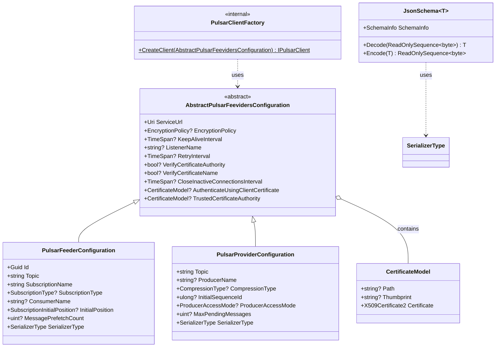

# ThunderPropagator.Feeviders.Pulsar.SharedKernel

## Overview

**ThunderPropagator.Feeviders.Pulsar.SharedKernel** provides common abstractions, configuration models, and utilities shared between Pulsar feeders (consumers) and providers (publishers). This shared kernel ensures consistent behavior, simplifies configuration management, and provides reusable components for Apache Pulsar integration within the ThunderPropagator ecosystem.

### Key Components

- ✅ **AbstractPulsarFeevidersConfiguration**: Base configuration class with connection, authentication, and TLS settings
- ✅ **PulsarClientFactory**: Factory for creating configured IPulsarClient instances with connection pooling
- ✅ **JsonSchema<T>**: Custom ISchema implementation supporting JSON, NJson, and NetJson serialization
- ✅ **Certificate Management**: Support for mutual TLS with X.509 client certificates
- ✅ **Connection Pooling**: Efficient resource management for shared PulsarClient instances
- ✅ **Configuration Validation**: Ensures required properties are set before client creation
- ✅ **.NET 8/9/10**: Multi-targeted for latest runtime features

### Shared Configuration Philosophy

Both feeders and providers extend `AbstractPulsarFeevidersConfiguration`, inheriting:
- **Connection settings**: ServiceUrl, KeepAliveInterval, RetryInterval
- **TLS/encryption**: EncryptionPolicy, certificate validation flags
- **Authentication**: Client certificates, trusted CA certificates
- **Lifecycle management**: CloseInactiveConnectionsInterval

This ensures consistent connection behavior across all Pulsar integration points.

## Architecture



### Configuration Inheritance Hierarchy

```
ServiceConfiguration (BuildingBlocks)
    └── AbstractPulsarFeevidersConfiguration (SharedKernel)
        ├── PulsarFeederConfiguration (Feeders.Pulsar)
        │   └── Concrete implementations (e.g., OrderFeederConfig)
        └── PulsarProviderConfiguration (Providers.DotNet.Pulsar)
            └── Concrete implementations (e.g., OrderProviderConfig)
```

**Inherited Properties**:
- `Get<T>(T defaultValue)` / `Set<T>(T value)` — Type-safe property bag
- Configuration binding from IConfiguration
- JSON serialization support

## Project Structure

### Files

| File | Lines | Responsibility |
|------|-------|----------------|
| **AbstractPulsarFeevidersConfiguration.cs** | 66 | Base configuration with connection and authentication settings |
| **PulsarClientFactory.cs** | 38 | Factory for creating configured IPulsarClient instances |
| **JsonSchema.cs** | 47 | Custom ISchema<T> implementation for JSON/NJson/NetJson serialization |
| **Total** | **151** | **Complete shared kernel** |

### Dependencies

```xml
<PackageReference Include="DotPulsar" Version="3.3.1" />
<PackageReference Include="ThunderPropagator.BuildingBlocks" Version="1.0.1-beta.2" />
<PackageReference Include="System.Text.Json" Version="9.0.1" />
<PackageReference Include="Newtonsoft.Json" Version="13.0.3" />
<PackageReference Include="NetJSON" Version="1.4.4" />
```

## Configuration Properties

### AbstractPulsarFeevidersConfiguration

| Property | Type | Default | Description |
|----------|------|---------|-------------|
| **Core** ||||
| `IsEnabled` | `bool` | `false` | Enable/disable feeder or provider |
| **Connection** ||||
| `ServiceUrl` | `Uri` | *Required* | Pulsar broker URL (e.g., `pulsar://localhost:6650`, `pulsar+ssl://pulsar.example.com:6651`) |
| `ListenerName` | `string?` | `null` | Advertised listener name for client routing (multi-NIC brokers) |
| `KeepAliveInterval` | `TimeSpan?` | `30s` | Heartbeat interval for connection health checks |
| `RetryInterval` | `TimeSpan?` | `3s` | Reconnection backoff interval after disconnection |
| `CloseInactiveConnectionsInterval` | `TimeSpan?` | `60s` | Close idle connections after specified duration |
| **Encryption/TLS** ||||
| `EncryptionPolicy` | `EncryptionPolicy?` | `null` | `EnforceEncrypted` (TLS required), `EnforceUnencrypted` (disable TLS) |
| `VerifyCertificateAuthority` | `bool?` | `true` | Validate server certificate against trusted CA |
| `VerifyCertificateName` | `bool?` | `true` | Validate server certificate hostname matches ServiceUrl |
| `TrustedCertificateAuthority` | `CertificateModel?` | `null` | CA certificate for server validation (PEM file path or thumbprint) |
| **Authentication** ||||
| `AuthenticateUsingClientCertificate` | `CertificateModel?` | `null` | Client certificate for mutual TLS (X.509 file path or thumbprint) |

### EncryptionPolicy Enum

| Value | Description | Use Case |
|-------|-------------|----------|
| `EnforceEncrypted` | Require TLS connection (fail if unencrypted) | Production environments (secure by default) |
| `EnforceUnencrypted` | Prohibit TLS (plain TCP only) | Local development, testing |
| `null` (Default) | Allow both encrypted and unencrypted | Flexible (not recommended for production) |

### CertificateModel Properties

| Property | Type | Description |
|----------|------|-------------|
| `Path` | `string?` | File path to certificate (`.pfx`, `.pem`, `.crt`) |
| `Thumbprint` | `string?` | Certificate thumbprint (hex string, Windows certificate store) |
| `Password` | `string?` | Password for encrypted certificate files (`.pfx`) |
| `Certificate` | `X509Certificate2` | Loaded certificate instance (read-only) |

**Loading Strategies**:
```csharp
// From file path
var certModel = new CertificateModel
{
    Path = "/etc/ssl/certs/client-cert.pfx",
    Password = "secret"
};

// From Windows certificate store (thumbprint)
var certModel = new CertificateModel
{
    Thumbprint = "A1B2C3D4E5F6..."
};
```

## API Reference

### AbstractPulsarFeevidersConfiguration Class

```csharp
public abstract class AbstractPulsarFeevidersConfiguration : ServiceConfiguration
{
    // Core
    public bool IsEnabled { get; set; }
    
    // Connection
    public Uri ServiceUrl { get; set; }
    public EncryptionPolicy? EncryptionPolicy { get; set; }
    public TimeSpan? KeepAliveInterval { get; set; }
    public string? ListenerName { get; set; }
    public TimeSpan? RetryInterval { get; set; }
    public bool? VerifyCertificateAuthority { get; set; }
    public bool? VerifyCertificateName { get; set; }
    public TimeSpan? CloseInactiveConnectionsInterval { get; set; }
    
    // Authentication
    public CertificateModel? AuthenticateUsingClientCertificate { get; set; }
    public CertificateModel? TrustedCertificateAuthority { get; set; }
}
```

### PulsarClientFactory Class

```csharp
internal sealed class PulsarClientFactory
{
    public static IPulsarClient CreateClient(AbstractPulsarFeevidersConfiguration configuration);
}
```

**Usage**:
```csharp
var config = new OrderFeederConfiguration
{
    ServiceUrl = new Uri("pulsar://localhost:6650"),
    KeepAliveInterval = TimeSpan.FromSeconds(30)
};

// Create client with all configuration applied
var client = PulsarClientFactory.CreateClient(config);

// Use with consumer
var consumer = client.CreateConsumer<OrderMessage>(
    new ConsumerOptions<OrderMessage>("my-subscription", "my-topic", schema));

// Use with producer
var producer = client.CreateProducer<OrderMessage>(
    new ProducerOptions<OrderMessage>("my-topic", schema));
```

**Configuration Applied**:
1. ServiceUrl (required)
2. EncryptionPolicy (TLS enforcement)
3. KeepAliveInterval (heartbeat)
4. ListenerName (routing hint)
5. RetryInterval (reconnection backoff)
6. VerifyCertificateAuthority (CA validation)
7. VerifyCertificateName (hostname validation)
8. CloseInactiveConnectionsInterval (idle timeout)
9. AuthenticateUsingClientCertificate (client cert)
10. TrustedCertificateAuthority (CA cert)

### JsonSchema<T> Class

```csharp
public sealed class JsonSchema<T> : ISchema<T> where T : notnull
{
    public SchemaInfo SchemaInfo { get; }
    
    public JsonSchema(SerializerType serializerType);
    
    public T Decode(ReadOnlySequence<byte> bytes, byte[]? schemaVersion = null);
    public ReadOnlySequence<byte> Encode(T message);
}
```

**Supported SerializerTypes**:
- `SerializerType.Json` — System.Text.Json (default .NET serializer)
- `SerializerType.NJson` — Newtonsoft.Json (JSON.NET)
- `SerializerType.NetJson` — NetJSON (high-performance JSON library)

**Example**:
```csharp
// Create schema for message type
var schema = new JsonSchema<OrderMessage>(SerializerType.Json);

// Use with DotPulsar
var producer = client.CreateProducer(
    new ProducerOptions<OrderMessage>("my-topic", schema));

var consumer = client.CreateConsumer(
    new ConsumerOptions<OrderMessage>("my-subscription", "my-topic", schema));

// Automatic serialization/deserialization
await producer.Send(new OrderMessage { OrderId = "123", Amount = 99.99m });
await foreach (var message in consumer.Messages())
{
    var order = message.Value();  // Deserialized OrderMessage
    Console.WriteLine($"Order {order.OrderId}: ${order.Amount}");
}
```

## Examples

### 1. Basic Connection Configuration

**Use Case**: Connect to local Pulsar standalone instance.

```csharp
public class LocalPulsarConfig : PulsarFeederConfiguration
{
    // Inherits ServiceUrl and other properties
}

// appsettings.json
{
  "Messaging": {
    "Pulsar": {
      "LocalFeeder": {
        "IsEnabled": true,
        "ServiceUrl": "pulsar://localhost:6650",
        "Topic": "persistent://public/default/events",
        "SubscriptionName": "local-consumer",
        "SerializerType": "Json"
      }
    }
  }
}

// DI registration
services.AddPulsarFeeder<EventChannel, EventMessage, LocalPulsarConfig>(
    configuration, "Messaging:Pulsar:LocalFeeder");

// PulsarClientFactory creates client:
// - ServiceUrl: pulsar://localhost:6650
// - Default KeepAliveInterval: 30s
// - Default RetryInterval: 3s
// - No TLS (plain TCP)
```

### 2. TLS/SSL Configuration (Production)

**Use Case**: Secure connection to production Pulsar cluster with TLS.

```csharp
public class SecurePulsarConfig : PulsarProviderConfiguration
{
    // Inherits all AbstractPulsarFeevidersConfiguration properties
}

// appsettings.json
{
  "Messaging": {
    "Pulsar": {
      "SecureProvider": {
        "IsEnabled": true,
        "ServiceUrl": "pulsar+ssl://pulsar.example.com:6651",
        "Topic": "persistent://production/events/orders",
        "EncryptionPolicy": "EnforceEncrypted",
        "VerifyCertificateAuthority": true,
        "VerifyCertificateName": true,
        "TrustedCertificateAuthority": {
          "Path": "/etc/ssl/certs/ca-bundle.crt"
        },
        "SerializerType": "Json"
      }
    }
  }
}

// DI registration
services.AddPulsarProvider<OrderMessage, SecurePulsarConfig>(
    configuration, "Messaging:Pulsar:SecureProvider");

// PulsarClientFactory creates client with TLS:
// - ServiceUrl: pulsar+ssl://pulsar.example.com:6651
// - EncryptionPolicy: EnforceEncrypted (fail if TLS unavailable)
// - VerifyCertificateAuthority: true (validate server cert against CA)
// - VerifyCertificateName: true (validate hostname matches cert CN)
// - TrustedCertificateAuthority: Custom CA cert loaded from /etc/ssl/certs/ca-bundle.crt
```

### 3. Mutual TLS (Client Certificate Authentication)

**Use Case**: Authenticate client using X.509 certificate (mutual TLS).

```csharp
public class MutualTlsConfig : PulsarFeederConfiguration
{
    // Inherits authentication properties
}

// appsettings.json
{
  "Messaging": {
    "Pulsar": {
      "MutualTlsFeeder": {
        "IsEnabled": true,
        "ServiceUrl": "pulsar+ssl://secure-pulsar.example.com:6651",
        "Topic": "persistent://secure/production/transactions",
        "SubscriptionName": "secure-consumer",
        "EncryptionPolicy": "EnforceEncrypted",
        "AuthenticateUsingClientCertificate": {
          "Path": "/etc/ssl/private/client-cert.pfx",
          "Password": "${CLIENT_CERT_PASSWORD}"
        },
        "TrustedCertificateAuthority": {
          "Path": "/etc/ssl/certs/company-ca.crt"
        },
        "SerializerType": "Json"
      }
    }
  }
}

// DI registration
services.AddPulsarFeeder<TransactionChannel, TransactionMessage, MutualTlsConfig>(
    configuration, "Messaging:Pulsar:MutualTlsFeeder");

// PulsarClientFactory creates client with mutual TLS:
// - Client certificate: Loaded from /etc/ssl/private/client-cert.pfx
// - Server certificate: Validated against /etc/ssl/certs/company-ca.crt
// - Both client and server authenticate each other (mutual TLS)

// Pulsar broker validates:
// 1. Client certificate signed by trusted CA
// 2. Client certificate not expired
// 3. Client certificate subject/DN matches authorized list
```

### 4. Connection Pooling (Shared Client)

**Use Case**: Reuse single PulsarClient across multiple feeders and providers.

```csharp
// Startup configuration
public class Startup
{
    public void ConfigureServices(IServiceCollection services)
    {
        // Option 1: Singleton PulsarClient (manual management)
        services.AddSingleton<IPulsarClient>(sp =>
        {
            var config = sp.GetRequiredService<IConfiguration>();
            var serviceUrl = config.GetValue<string>("Pulsar:ServiceUrl");
            
            return PulsarClient.Builder()
                .ServiceUrl(new Uri(serviceUrl))
                .Build();
        });

        // Option 2: Let PulsarClientFactory manage (automatic configuration)
        // Each feeder/provider creates its own client (less efficient but simpler)
        services.AddPulsarFeeder<OrderChannel, OrderMessage, OrderFeederConfig>(
            configuration, "Messaging:Pulsar:OrderFeeder");
        
        services.AddPulsarProvider<OrderMessage, OrderProviderConfig>(
            configuration, "Messaging:Pulsar:OrderProvider");
    }
}

// For maximum efficiency, inject shared IPulsarClient into custom factories
public class SharedClientFeederFactory
{
    private readonly IPulsarClient _sharedClient;

    public SharedClientFeederFactory(IPulsarClient sharedClient)
    {
        _sharedClient = sharedClient;
    }

    public IConsumer<TMessage> CreateConsumer<TMessage>(
        string topic,
        string subscription,
        ISchema<TMessage> schema)
        where TMessage : notnull
    {
        return _sharedClient.CreateConsumer(
            new ConsumerOptions<TMessage>(subscription, topic, schema));
    }
}

// Benefits:
// - Single TCP connection to broker (reduced overhead)
// - Shared keep-alive and heartbeat threads
// - Lower memory footprint
// - Simplified connection monitoring
```

### 5. Environment-Based Configuration

**Use Case**: Different settings per environment (dev, staging, production).

```csharp
// appsettings.Development.json
{
  "Messaging": {
    "Pulsar": {
      "EventFeeder": {
        "IsEnabled": true,
        "ServiceUrl": "pulsar://localhost:6650",
        "Topic": "persistent://public/default/events",
        "SubscriptionName": "dev-consumer",
        "KeepAliveInterval": "00:00:30",
        "RetryInterval": "00:00:03",
        "SerializerType": "Json"
      }
    }
  }
}

// appsettings.Production.json
{
  "Messaging": {
    "Pulsar": {
      "EventFeeder": {
        "IsEnabled": true,
        "ServiceUrl": "pulsar+ssl://pulsar-prod.example.com:6651",
        "Topic": "persistent://production/events/critical",
        "SubscriptionName": "prod-consumer-{HOSTNAME}",
        "EncryptionPolicy": "EnforceEncrypted",
        "KeepAliveInterval": "00:00:15",  // Faster failure detection
        "RetryInterval": "00:00:05",  // Longer backoff
        "VerifyCertificateAuthority": true,
        "TrustedCertificateAuthority": {
          "Path": "/etc/ssl/certs/prod-ca.crt"
        },
        "SerializerType": "Json"
      }
    }
  }
}

// DI registration (automatic environment selection)
services.AddPulsarFeeder<EventChannel, EventMessage, EventFeederConfig>(
    configuration, "Messaging:Pulsar:EventFeeder");

// Configuration loaded based on ASPNETCORE_ENVIRONMENT:
// - Development: Local Pulsar, plain TCP, 30s keep-alive
// - Production: Secure Pulsar, TLS required, 15s keep-alive, certificate validation
```

### 6. Custom Listener Name (Multi-NIC Brokers)

**Use Case**: Route clients to specific broker network interfaces.

```csharp
// Scenario: Pulsar broker has multiple NICs
// - Internal network: 10.0.0.100:6650 (fast, local datacenter)
// - External network: 52.1.2.3:6650 (slow, internet)
// - ServiceUrl returns external IP by default
// - ListenerName overrides to use internal network

// appsettings.json
{
  "Messaging": {
    "Pulsar": {
      "InternalFeeder": {
        "ServiceUrl": "pulsar://pulsar-broker.example.com:6650",
        "ListenerName": "internal",  // Route to internal listener
        "Topic": "persistent://public/default/events",
        "SubscriptionName": "internal-consumer",
        "SerializerType": "Json"
      }
    }
  }
}

// Broker configuration (server-side, Pulsar admin):
// conf/broker.conf:
// advertisedListeners=internal:pulsar://10.0.0.100:6650,external:pulsar://52.1.2.3:6650

// Client behavior:
// 1. Connect to pulsar-broker.example.com:6650 (resolves to 52.1.2.3)
// 2. Broker returns advertised listeners
// 3. Client sees ListenerName=internal, switches to 10.0.0.100:6650
// 4. All subsequent communication uses internal network (faster)

// Use cases:
// - Kubernetes internal DNS vs external DNS
// - VPN access vs public access
// - High-speed interconnect vs internet
```

### 7. Connection Health Monitoring

**Use Case**: Monitor connection health and reconnection behavior.

```csharp
public class ConnectionHealthMonitor
{
    private readonly ILogger<ConnectionHealthMonitor> _logger;
    private readonly OrderFeederConfig _config;

    public ConnectionHealthMonitor(
        ILogger<ConnectionHealthMonitor> logger,
        OrderFeederConfig config)
    {
        _logger = logger;
        _config = config;
    }

    public void LogConnectionSettings()
    {
        _logger.LogInformation(
            "Pulsar connection settings: ServiceUrl={ServiceUrl}, KeepAlive={KeepAlive}, Retry={Retry}",
            _config.ServiceUrl,
            _config.KeepAliveInterval ?? TimeSpan.FromSeconds(30),
            _config.RetryInterval ?? TimeSpan.FromSeconds(3));

        if (_config.EncryptionPolicy == EncryptionPolicy.EnforceEncrypted)
        {
            _logger.LogInformation("TLS enforced (secure connection required)");
        }
        else
        {
            _logger.LogWarning("TLS not enforced (insecure connection allowed)");
        }

        if (_config.AuthenticateUsingClientCertificate != null)
        {
            _logger.LogInformation(
                "Client certificate authentication enabled: {CertPath}",
                _config.AuthenticateUsingClientCertificate.Path);
        }
    }

    public async Task<HealthCheckResult> CheckConnectionHealthAsync(
        IPulsarClient client,
        CancellationToken cancellationToken = default)
    {
        try
        {
            // Attempt to create test consumer (validates connection)
            var schema = new JsonSchema<TestMessage>(SerializerType.Json);
            var consumer = client.CreateConsumer(
                new ConsumerOptions<TestMessage>(
                    "health-check",
                    "persistent://public/default/health",
                    schema));

            await consumer.DisposeAsync();

            return HealthCheckResult.Healthy("Pulsar connection operational");
        }
        catch (Exception ex)
        {
            _logger.LogError(ex, "Pulsar connection health check failed");
            return HealthCheckResult.Unhealthy(
                "Connection failed",
                exception: ex);
        }
    }
}

// Registration
services.AddHealthChecks()
    .AddCheck<ConnectionHealthMonitor>("pulsar-connection");

// Monitor reconnection attempts:
// - KeepAliveInterval: 30s (detect dead connections)
// - RetryInterval: 3s (backoff between reconnect attempts)
// - Logs "Connection lost, retrying in 3s..." on disconnect
// - Logs "Connection restored" on successful reconnection
```

### 8. High-Performance Configuration

**Use Case**: Optimize for maximum throughput with aggressive tuning.

```csharp
// appsettings.json
{
  "Messaging": {
    "Pulsar": {
      "HighPerformanceFeeder": {
        "IsEnabled": true,
        "ServiceUrl": "pulsar://pulsar.example.com:6650",
        "Topic": "persistent://logs/production/high-volume",
        "SubscriptionName": "log-aggregator",
        "SubscriptionType": "Shared",
        "MessagePrefetchCount": 5000,  // Large prefetch buffer
        "KeepAliveInterval": "00:00:60",  // Longer keep-alive (reduce overhead)
        "RetryInterval": "00:00:01",  // Fast reconnect
        "CloseInactiveConnectionsInterval": "00:05:00",  // Keep connections longer
        "SerializerType": "NetJson"  // Fastest JSON serializer
      }
    }
  }
}

// Provider configuration
{
  "Messaging": {
    "Pulsar": {
      "HighPerformanceProvider": {
        "IsEnabled": true,
        "ServiceUrl": "pulsar://pulsar.example.com:6650",
        "Topic": "persistent://logs/production/high-volume",
        "CompressionType": "LZ4",  // Fast compression
        "MaxPendingMessages": 10000,  // Large batch buffer
        "KeepAliveInterval": "00:00:60",
        "RetryInterval": "00:00:01",
        "CloseInactiveConnectionsInterval": "00:05:00",
        "SerializerType": "NetJson"
      }
    }
  }
}

// Tuning explanation:
// - MessagePrefetchCount: 5000 (reduce broker RTT, batch fetches)
// - MaxPendingMessages: 10000 (accumulate large batches before send)
// - CompressionType: LZ4 (fast compression, 2-3x ratio)
// - KeepAliveInterval: 60s (reduce heartbeat overhead)
// - CloseInactiveConnectionsInterval: 5 minutes (reuse connections longer)
// - SerializerType: NetJSON (fastest serialization library)

// Trade-offs:
// - Higher memory usage (large buffers)
// - Increased latency (larger batches)
// - Longer failure detection (60s keep-alive)
// - Optimal for: High-volume log aggregation, analytics ingestion
```

## Advanced Patterns

### 1. Configuration Validation

Ensure required properties are set before client creation:

```csharp
public static class PulsarConfigurationValidator
{
    public static void Validate(AbstractPulsarFeevidersConfiguration config)
    {
        if (config.ServiceUrl == null)
        {
            throw new InvalidOperationException(
                "ServiceUrl is required for Pulsar configuration");
        }

        if (config.EncryptionPolicy == EncryptionPolicy.EnforceEncrypted
            && config.ServiceUrl.Scheme != "pulsar+ssl")
        {
            throw new InvalidOperationException(
                "ServiceUrl must use 'pulsar+ssl://' scheme when EncryptionPolicy is EnforceEncrypted");
        }

        if (config.AuthenticateUsingClientCertificate != null
            && config.EncryptionPolicy != EncryptionPolicy.EnforceEncrypted)
        {
            throw new InvalidOperationException(
                "Client certificate authentication requires EncryptionPolicy.EnforceEncrypted");
        }

        if (config.KeepAliveInterval.HasValue
            && config.KeepAliveInterval.Value < TimeSpan.FromSeconds(5))
        {
            throw new InvalidOperationException(
                "KeepAliveInterval must be at least 5 seconds (avoid excessive heartbeat overhead)");
        }
    }
}

// Usage in startup
public class Startup
{
    public void ConfigureServices(IServiceCollection services)
    {
        var config = new OrderFeederConfig();
        configuration.GetSection("Messaging:Pulsar:OrderFeeder").Bind(config);

        // Validate before registration
        PulsarConfigurationValidator.Validate(config);

        services.AddSingleton(config);
        services.AddPulsarFeeder<OrderChannel, OrderMessage, OrderFeederConfig>(
            configuration, "Messaging:Pulsar:OrderFeeder");
    }
}
```

### 2. Builder Pattern for Complex Configuration

Fluent API for programmatic configuration:

```csharp
public class PulsarConfigurationBuilder<TConfig>
    where TConfig : AbstractPulsarFeevidersConfiguration, new()
{
    private readonly TConfig _config = new();

    public PulsarConfigurationBuilder<TConfig> WithServiceUrl(string url)
    {
        _config.ServiceUrl = new Uri(url);
        return this;
    }

    public PulsarConfigurationBuilder<TConfig> WithTls(
        string caCertPath,
        string? clientCertPath = null,
        string? clientCertPassword = null)
    {
        _config.EncryptionPolicy = EncryptionPolicy.EnforceEncrypted;
        _config.VerifyCertificateAuthority = true;
        _config.VerifyCertificateName = true;
        _config.TrustedCertificateAuthority = new CertificateModel { Path = caCertPath };

        if (clientCertPath != null)
        {
            _config.AuthenticateUsingClientCertificate = new CertificateModel
            {
                Path = clientCertPath,
                Password = clientCertPassword
            };
        }

        return this;
    }

    public PulsarConfigurationBuilder<TConfig> WithKeepAlive(TimeSpan interval)
    {
        _config.KeepAliveInterval = interval;
        return this;
    }

    public PulsarConfigurationBuilder<TConfig> WithRetry(TimeSpan interval)
    {
        _config.RetryInterval = interval;
        return this;
    }

    public TConfig Build()
    {
        PulsarConfigurationValidator.Validate(_config);
        return _config;
    }
}

// Usage
var config = new PulsarConfigurationBuilder<OrderFeederConfig>()
    .WithServiceUrl("pulsar+ssl://pulsar.example.com:6651")
    .WithTls(
        caCertPath: "/etc/ssl/certs/ca.crt",
        clientCertPath: "/etc/ssl/private/client.pfx",
        clientCertPassword: "secret")
    .WithKeepAlive(TimeSpan.FromSeconds(30))
    .WithRetry(TimeSpan.FromSeconds(5))
    .Build();

// Additional feeder-specific configuration
config.Topic = "persistent://production/events/orders";
config.SubscriptionName = "order-processor";
config.SubscriptionType = SubscriptionType.Exclusive;

services.AddSingleton(config);
```

### 3. Connection Pool Management

Implement custom connection pooling for multi-tenant scenarios:

```csharp
public class PulsarClientPool : IDisposable
{
    private readonly ConcurrentDictionary<string, IPulsarClient> _clients = new();
    private readonly ILogger<PulsarClientPool> _logger;

    public PulsarClientPool(ILogger<PulsarClientPool> logger)
    {
        _logger = logger;
    }

    public IPulsarClient GetOrCreateClient(
        string tenantId,
        AbstractPulsarFeevidersConfiguration config)
    {
        return _clients.GetOrAdd(tenantId, _ =>
        {
            _logger.LogInformation(
                "Creating new Pulsar client for tenant {TenantId} to {ServiceUrl}",
                tenantId, config.ServiceUrl);

            return PulsarClientFactory.CreateClient(config);
        });
    }

    public void RemoveClient(string tenantId)
    {
        if (_clients.TryRemove(tenantId, out var client))
        {
            _logger.LogInformation("Removing Pulsar client for tenant {TenantId}", tenantId);
            client.DisposeAsync().AsTask().Wait();
        }
    }

    public void Dispose()
    {
        foreach (var (tenantId, client) in _clients)
        {
            _logger.LogInformation("Disposing Pulsar client for tenant {TenantId}", tenantId);
            client.DisposeAsync().AsTask().Wait();
        }
        _clients.Clear();
    }
}

// Registration
services.AddSingleton<PulsarClientPool>();

// Usage in multi-tenant feeder
public class TenantAwareFeeder
{
    private readonly PulsarClientPool _clientPool;
    private readonly ILogger<TenantAwareFeeder> _logger;

    public TenantAwareFeeder(
        PulsarClientPool clientPool,
        ILogger<TenantAwareFeeder> logger)
    {
        _clientPool = clientPool;
        _logger = logger;
    }

    public async Task StartConsumingAsync(
        string tenantId,
        OrderFeederConfig config,
        CancellationToken cancellationToken = default)
    {
        var client = _clientPool.GetOrCreateClient(tenantId, config);
        var schema = new JsonSchema<OrderMessage>(SerializerType.Json);
        var consumer = client.CreateConsumer(
            new ConsumerOptions<OrderMessage>(config.SubscriptionName, config.Topic, schema));

        _logger.LogInformation("Started consuming for tenant {TenantId}", tenantId);

        await foreach (var message in consumer.Messages(cancellationToken))
        {
            var order = message.Value();
            _logger.LogInformation(
                "Tenant {TenantId}: Processing order {OrderId}",
                tenantId, order.OrderId);
        }
    }
}
```

### 4. Dynamic Topic Resolution

Resolve topics dynamically based on tenant/namespace:

```csharp
public class TopicResolver
{
    private readonly string _tenantId;
    private readonly string _environment;

    public TopicResolver(string tenantId, string environment)
    {
        _tenantId = tenantId;
        _environment = environment;
    }

    public string ResolveTopic(string topicName, TopicPersistence persistence = TopicPersistence.Persistent)
    {
        var persistencePrefix = persistence == TopicPersistence.Persistent
            ? "persistent"
            : "non-persistent";

        return $"{persistencePrefix}://{_tenantId}/{_environment}/{topicName}";
    }

    public string ResolveDeadLetterTopic(string topicName)
    {
        return ResolveTopic($"{topicName}-dlq", TopicPersistence.Persistent);
    }
}

public enum TopicPersistence
{
    Persistent,
    NonPersistent
}

// Usage
var resolver = new TopicResolver("acme-corp", "production");

var orderTopic = resolver.ResolveTopic("orders");
// Result: "persistent://acme-corp/production/orders"

var dlqTopic = resolver.ResolveDeadLetterTopic("orders");
// Result: "persistent://acme-corp/production/orders-dlq"

var cacheTopic = resolver.ResolveTopic("cache-invalidation", TopicPersistence.NonPersistent);
// Result: "non-persistent://acme-corp/production/cache-invalidation"

// Integration with configuration
public class DynamicTopicConfig : PulsarFeederConfiguration
{
    public void SetTopic(string tenantId, string environment, string topicName)
    {
        var resolver = new TopicResolver(tenantId, environment);
        Topic = resolver.ResolveTopic(topicName);
    }
}

var config = new DynamicTopicConfig();
config.SetTopic("customer-123", "production", "events");
// config.Topic = "persistent://customer-123/production/events"
```

### 5. Serializer Selection Strategy

Choose optimal serializer based on requirements:

```csharp
public static class SerializerSelector
{
    public static SerializerType SelectSerializer(SerializationRequirements requirements)
    {
        return requirements switch
        {
            // Maximum performance (native .NET)
            { RequiresMaxPerformance: true, AllowsExternalDependencies: false }
                => SerializerType.Json,  // System.Text.Json (fastest native)

            // Maximum compatibility (popular library)
            { RequiresCompatibility: true }
                => SerializerType.NJson,  // Newtonsoft.Json (widely supported)

            // Maximum throughput (third-party library)
            { RequiresMaxThroughput: true, AllowsExternalDependencies: true }
                => SerializerType.NetJson,  // NetJSON (fastest overall)

            // Complex types, polymorphism
            { RequiresPolymorphism: true }
                => SerializerType.NJson,  // Newtonsoft.Json (type handling)

            _ => SerializerType.Json  // Safe default
        };
    }
}

public class SerializationRequirements
{
    public bool RequiresMaxPerformance { get; set; }
    public bool RequiresCompatibility { get; set; }
    public bool RequiresMaxThroughput { get; set; }
    public bool RequiresPolymorphism { get; set; }
    public bool AllowsExternalDependencies { get; set; }
}

// Performance benchmark (1000 messages, 1KB JSON each):
// - System.Text.Json (Json): 15ms serialize, 18ms deserialize
// - Newtonsoft.Json (NJson): 22ms serialize, 28ms deserialize
// - NetJSON (NetJson): 8ms serialize, 10ms deserialize
// Winner: NetJSON (but requires external NuGet package)
```

## Best Practices

### 1. Connection Settings
- **KeepAliveInterval**: 30s (default) for stable networks, 15s for faster failure detection
- **RetryInterval**: 3-5s (exponential backoff in production)
- **CloseInactiveConnectionsInterval**: 60s (default), increase for long-lived connections

### 2. TLS Configuration
- Always use `EnforceEncrypted` in production
- Validate certificates (`VerifyCertificateAuthority: true`)
- Store certificates in secure vaults (Azure Key Vault, AWS Secrets Manager)
- Rotate certificates regularly (monitor expiration)

### 3. Client Certificate Authentication
- Use mutual TLS for sensitive topics (payments, PII)
- Generate unique certificates per service (not shared)
- Revoke compromised certificates immediately
- Monitor certificate expiration (alert 30 days before)

### 4. Connection Pooling
- Reuse `IPulsarClient` instances across feeders/providers
- Register as singleton in DI container
- Dispose gracefully on application shutdown
- Monitor connection count (avoid leaks)

### 5. Topic Naming
- Use full format: `persistent://tenant/namespace/topic`
- Namespace for environment isolation: `acme/production`, `acme/staging`
- Topic for entity type: `orders`, `payments`, `events`
- Dead letter suffix: `orders-dlq`, `payments-dlq`

### 6. Serialization
- Use `SerializerType.Json` for .NET-only systems (fastest native)
- Use `SerializerType.NetJson` for maximum throughput (requires NuGet package)
- Use `SerializerType.NJson` for complex types and polymorphism

### 7. Health Monitoring
- Implement health checks for connection status
- Monitor keep-alive failures (detect dead connections)
- Alert on reconnection storms (excessive retries)
- Track connection lifecycle (create, reconnect, dispose)

## Related Documentation

- [System Overview](../README.md) — Apache Pulsar architecture and concepts
- [Feeders.Pulsar](../Feeders.Pulsar/README.md) — Message consumer implementation
- [Providers.DotNet.Pulsar](../Providers.DotNet.Pulsar/README.md) — Message publisher implementation
- [Main README](../../../README.md) — Framework overview

---

**Version**: 1.0.1-beta.2  
**Last Updated**: December 2025  
**License**: See project root LICENSE file
