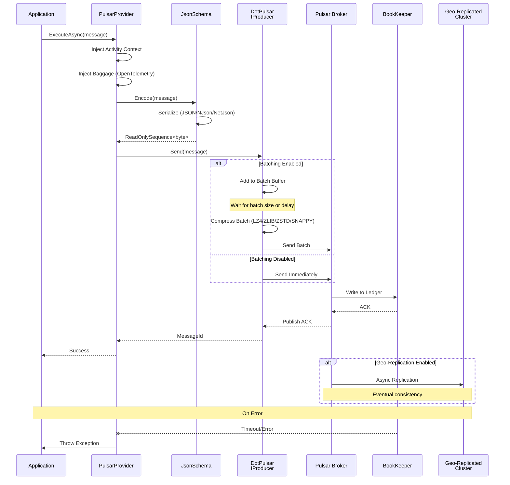

# ThunderPropagator.Providers.DotNet.Pulsar

## Overview

**ThunderPropagator.Providers.DotNet.Pulsar** provides a high-performance message publisher for Apache Pulsar using the DotPulsar client library. As an `AbstractProvider` implementation, it seamlessly integrates with ThunderPropagator's provider framework while offering advanced Pulsar features: auto-batching, compression, schema validation, message deduplication, delayed delivery, and geo-replication support.

### Key Features

- ✅ **Auto-Batching**: Automatic message batching with configurable size and delay for maximum throughput
- ✅ **Compression**: LZ4, ZLIB, ZSTD, SNAPPY compression for bandwidth optimization
- ✅ **Schema Validation**: JSON, Avro, Protobuf schema enforcement with evolution support
- ✅ **Message Deduplication**: Producer sequence IDs with configurable deduplication window
- ✅ **Delayed Messages**: Schedule message delivery at specific timestamps
- ✅ **Geo-Replication**: Publish to topics replicated across multiple datacenters
- ✅ **Message Keys**: Support for Key_Shared routing and compacted topics
- ✅ **OpenTelemetry**: Distributed tracing with Activity context propagation
- ✅ **Connection Pooling**: Efficient resource management with reusable PulsarClient instances
- ✅ **.NET 8/9/10**: Multi-targeted for latest runtime optimizations

### When to Use This Provider

| Use Case | Recommendation |
|----------|----------------|
| **High-Throughput Publishing** | ✅ Enable batching (10ms delay, 1000 messages) + compression (LZ4) |
| **Per-Key Routing** | ✅ Set message keys for Key_Shared subscriptions |
| **Schema Enforcement** | ✅ Use Avro/JSON/Protobuf validation at publish time |
| **Exactly-Once Semantics** | ✅ Enable message deduplication with sequence IDs |
| **Delayed Delivery** | ✅ Schedule messages for future processing (e.g., reminders) |
| **Global Distribution** | ✅ Publish to geo-replicated topics across regions |
| **Cost Optimization** | ✅ Use compression (ZSTD for max compression, LZ4 for speed) |

## Architecture



### Publishing Flow

1. **Message Injection**: Activity context and Baggage added for tracing
2. **Serialization**: JsonSchema encodes message to bytes (JSON/NJson/NetJson)
3. **Batching** (optional): Messages buffered until batch size or delay threshold
4. **Compression** (optional): Batch compressed (LZ4/ZLIB/ZSTD/SNAPPY)
5. **Broker Write**: Sent to Pulsar broker for durability
6. **BookKeeper Storage**: Persisted to distributed ledger
7. **Acknowledgment**: Broker ACKs after BookKeeper confirms write
8. **Geo-Replication** (optional): Asynchronously replicated to other clusters

## Project Structure

### Files

| File | Lines | Responsibility |
|------|-------|----------------|
| **PulsarProvider.cs** | 70 | Core AbstractProvider implementation with DotPulsar IProducer |
| **PulsarProviderConfiguration.cs** | 55 | Configuration class extending AbstractPulsarFeevidersConfiguration |
| **PulsarProviderExtensions.cs** | 21 | DI registration method (AddPulsarProvider) |
| **PulsarProviderMessage.cs** | 5 | Abstract message base class |
| **Total** | **151** | **Complete provider implementation** |

### Dependencies

```xml
<PackageReference Include="DotPulsar" Version="3.3.1" />
<PackageReference Include="ThunderPropagator" Version="1.0.1-beta.2" />
<PackageReference Include="ThunderPropagator.BuildingBlocks" Version="1.0.1-beta.2" />
<PackageReference Include="ThunderPropagator.Feeviders.Pulsar.SharedKernel" Version="1.0.1-beta.2" />
<PackageReference Include="Microsoft.Extensions.DependencyInjection" Version="9.0.0" />
<PackageReference Include="OpenTelemetry.Api" Version="1.10.0" />
```

## Configuration

### PulsarProviderConfiguration Properties

| Property | Type | Default | Description |
|----------|------|---------|-------------|
| **Core** ||||
| `IsEnabled` | `bool` | `false` | Enable/disable provider |
| `ServiceUrl` | `Uri` | *Required* | Pulsar broker URL (`pulsar://` or `pulsar+ssl://`) |
| `Topic` | `string` | *Required* | Full topic name (e.g., `persistent://tenant/namespace/topic`) |
| **Producer** ||||
| `ProducerName` | `string?` | Auto-generated | Producer identifier (visible in stats) |
| `InitialSequenceId` | `ulong?` | `null` | Starting sequence ID for deduplication |
| `ProducerAccessMode` | `ProducerAccessMode?` | `Shared` | Shared (default), Exclusive (single producer), WaitForExclusive |
| `MaxPendingMessages` | `uint?` | `1000` | Max unacknowledged messages (backpressure threshold) |
| `ProducerProperties` | `Dictionary<string, string>?` | `null` | Custom metadata (visible in stats) |
| **Performance** ||||
| `CompressionType` | `CompressionType?` | `None` | None, LZ4, ZLIB, ZSTD, SNAPPY |
| `AttachTraceInfoToMessages` | `bool?` | `null` | Auto-inject OpenTelemetry context (default true in DotPulsar) |
| **Serialization** ||||
| `SerializerType` | `SerializerType` | `Json` | Json, NJson, NetJson (see JsonSchema implementation) |
| **Connection** ||||
| `EncryptionPolicy` | `EncryptionPolicy?` | `null` | EnforceEncrypted, EnforceUnencrypted (TLS control) |
| `KeepAliveInterval` | `TimeSpan?` | `30s` | Heartbeat interval to detect dead connections |
| `ListenerName` | `string?` | `null` | Advertised listener for client routing |
| `RetryInterval` | `TimeSpan?` | `3s` | Reconnection backoff interval |
| `VerifyCertificateAuthority` | `bool?` | `true` | Validate server certificate against CA (TLS) |
| `VerifyCertificateName` | `bool?` | `true` | Validate server certificate hostname (TLS) |
| `CloseInactiveConnectionsInterval` | `TimeSpan?` | `60s` | Close idle connections after duration |
| **Authentication** ||||
| `AuthenticateUsingClientCertificate` | `CertificateModel?` | `null` | Client certificate for mutual TLS (X.509 path/thumbprint) |
| `TrustedCertificateAuthority` | `CertificateModel?` | `null` | CA certificate for server validation (PEM path) |

### CompressionType Values

| Type | Compression Ratio | Speed | CPU Usage | Use Case |
|------|------------------|-------|-----------|----------|
| `None` | 1.0x (no compression) | Fastest | Minimal | Low-latency, small messages |
| `LZ4` | ~2-3x | Very Fast | Low | **Recommended default** (best balance) |
| `ZLIB` | ~3-4x | Moderate | Medium | Bandwidth-constrained networks |
| `ZSTD` | ~4-5x | Moderate | Medium | Maximum compression (archival) |
| `SNAPPY` | ~2-2.5x | Fast | Low | Google ecosystem integration |

### ProducerAccessMode Values

| Mode | Behavior | Use Case |
|------|----------|----------|
| `Shared` | Multiple producers allowed (default) | Standard pub/sub |
| `Exclusive` | Single producer only (fail if others exist) | Ensure single writer (e.g., leader election) |
| `WaitForExclusive` | Wait for exclusive access (queue) | Controlled single-producer migration |

## API Reference

### PulsarProvider Class

```csharp
internal sealed class PulsarProvider<TPulsarProviderMessage, TPulsarProviderConfiguration>
    : AbstractProvider<TPulsarProviderMessage, TPulsarProviderConfiguration>
    where TPulsarProviderMessage : PulsarProviderMessage
    where TPulsarProviderConfiguration : PulsarProviderConfiguration
```

**Constructor**:
```csharp
public PulsarProvider(
    TPulsarProviderConfiguration pulsarProviderConfiguration,
    IServiceProvider serviceProvider)
```

**Key Methods**:
```csharp
// Core publishing method (overrides AbstractProvider)
protected override Task InternalExecuteAsync(
    TPulsarProviderMessage feederMessage,
    CancellationToken cancellationToken = default);

// Cleanup
protected override ValueTask DisposeManagedResourcesAsync();
```

**Inherited Properties**:
```csharp
protected ILogger Logger { get; }  // Injected logger
```

### PulsarProviderMessage Class

```csharp
public abstract class PulsarProviderMessage : FeederMessage
{
    // Inherits Dictionary<string, object> functionality
    // Store message key, properties, metadata:
    
    // Example:
    // message["key"] = customerId;  // For Key_Shared routing
    // message["eventTime"] = DateTimeOffset.UtcNow;  // Event timestamp
    // message["sequenceId"] = 12345UL;  // For deduplication
    
    // Built-in keys (auto-injected by PulsarProvider):
    // - "ActivityContext" (byte[]) — OpenTelemetry tracing
    // - "Baggage" (byte[]) — Distributed context propagation
}
```

### PulsarProviderConfiguration Class

```csharp
public abstract class PulsarProviderConfiguration
    : AbstractPulsarFeevidersConfiguration, IAbstractProviderConfiguration
{
    // Required properties
    public string Topic { get; set; }
    
    // Producer settings
    public string? ProducerName { get; set; }
    public ulong? InitialSequenceId { get; set; }
    public ProducerAccessMode? ProducerAccessMode { get; set; }
    public uint? MaxPendingMessages { get; set; }
    public Dictionary<string, string>? ProducerProperties { get; set; }
    
    // Performance
    public CompressionType? CompressionType { get; set; }
    public bool? AttachTraceInfoToMessages { get; set; }
    
    // Serialization
    public SerializerType SerializerType { get; set; }
}
```

### Extension Methods

```csharp
// Standard DI registration
public static IServiceCollection AddPulsarProvider<TPulsarProviderMessage, TPulsarProviderConfiguration>(
    this IServiceCollection services,
    IConfigurationRoot configuration,
    string sectionName)
    where TPulsarProviderMessage : PulsarProviderMessage
    where TPulsarProviderConfiguration : PulsarProviderConfiguration, new();
```

## Examples

### 1. Basic Publishing with Auto-Batching

**Use Case**: High-throughput event publishing with optimal batching.

```csharp
// Message definition
public class OrderCreatedMessage : PulsarProviderMessage
{
    public string OrderId { get; set; }
    public string CustomerId { get; set; }
    public decimal Amount { get; set; }
    public DateTimeOffset CreatedAt { get; set; }
}

// Configuration
public class OrderProviderConfig : PulsarProviderConfiguration { }

// Service
public class OrderService
{
    private readonly IProvider<OrderCreatedMessage> _provider;
    private readonly ILogger<OrderService> _logger;

    public OrderService(
        IProvider<OrderCreatedMessage> provider,
        ILogger<OrderService> logger)
    {
        _provider = provider;
        _logger = logger;
    }

    public async Task CreateOrderAsync(Order order, CancellationToken cancellationToken = default)
    {
        // Create order in database
        await SaveOrderToDatabase(order, cancellationToken);

        // Publish event
        var message = new OrderCreatedMessage
        {
            OrderId = order.Id,
            CustomerId = order.CustomerId,
            Amount = order.Amount,
            CreatedAt = DateTimeOffset.UtcNow
        };

        await _provider.ExecuteAsync(message, cancellationToken);
        
        _logger.LogInformation(
            "Published OrderCreated event for order {OrderId}",
            order.Id);
    }
}

// DI Registration
services.AddPulsarProvider<OrderCreatedMessage, OrderProviderConfig>(
    configuration, "Messaging:Pulsar:OrderProvider");

services.AddScoped<OrderService>();

// appsettings.json
{
  "Messaging": {
    "Pulsar": {
      "OrderProvider": {
        "IsEnabled": true,
        "ServiceUrl": "pulsar://localhost:6650",
        "Topic": "persistent://public/default/order-events",
        "ProducerName": "order-service",
        "CompressionType": "LZ4",  // Fast compression
        "SerializerType": "Json"
      }
    }
  }
}

// Note: Batching is enabled by default in DotPulsar
// Batch size: 1000 messages or 128KB
// Batch delay: 10ms (messages sent when either threshold met)
```

### 2. Schema Validation (Avro with Evolution)

**Use Case**: Enforce message schema with Avro validation and evolution rules.

```csharp
// Message definition (Avro-compatible POCO)
public class UserProfileMessage : PulsarProviderMessage
{
    public string UserId { get; set; }
    public string Name { get; set; }
    public string Email { get; set; }
    public string? PhoneNumber { get; set; }  // Optional (nullable)
    public DateTimeOffset UpdatedAt { get; set; }
}

// Configuration
public class UserProfileProviderConfig : PulsarProviderConfiguration { }

// Service
public class UserProfileService
{
    private readonly IProvider<UserProfileMessage> _provider;
    private readonly ILogger<UserProfileService> _logger;

    public UserProfileService(
        IProvider<UserProfileMessage> provider,
        ILogger<UserProfileService> logger)
    {
        _provider = provider;
        _logger = logger;
    }

    public async Task UpdateProfileAsync(
        string userId,
        string name,
        string email,
        string? phoneNumber,
        CancellationToken cancellationToken = default)
    {
        var message = new UserProfileMessage
        {
            UserId = userId,
            Name = name,
            Email = email,
            PhoneNumber = phoneNumber,
            UpdatedAt = DateTimeOffset.UtcNow
        };

        // Schema validation occurs during serialization
        try
        {
            await _provider.ExecuteAsync(message, cancellationToken);
            
            _logger.LogInformation(
                "Published profile update for user {UserId}",
                userId);
        }
        catch (Exception ex)
        {
            _logger.LogError(ex,
                "Failed to publish profile update for user {UserId}",
                userId);
            throw;
        }
    }
}

// DI Registration
services.AddPulsarProvider<UserProfileMessage, UserProfileProviderConfig>(
    configuration, "Messaging:Pulsar:UserProfileProvider");

services.AddScoped<UserProfileService>();

// appsettings.json
{
  "Messaging": {
    "Pulsar": {
      "UserProfileProvider": {
        "IsEnabled": true,
        "ServiceUrl": "pulsar://localhost:6650",
        "Topic": "persistent://users/production/profiles",
        "ProducerName": "profile-service",
        "CompressionType": "ZSTD",  // Max compression for archival
        "SerializerType": "Json"  // Note: Real Avro requires custom schema implementation
      }
    }
  }
}

// Schema evolution rules (configured at topic level):
// - Forward compatibility: Old consumers can read new schema (add optional fields only)
// - Backward compatibility: New consumers can read old schema (don't remove required fields)
// - Full compatibility: Both forward and backward

// Example: Add new optional field
public class UserProfileMessage : PulsarProviderMessage
{
    public string UserId { get; set; }
    public string Name { get; set; }
    public string Email { get; set; }
    public string? PhoneNumber { get; set; }
    public string? Address { get; set; }  // New optional field (forward compatible)
    public DateTimeOffset UpdatedAt { get; set; }
}
```

### 3. Message Keys for Key_Shared Routing

**Use Case**: Route messages by customer ID for per-key ordering with horizontal scaling.

```csharp
// Message definition
public class CustomerEventMessage : PulsarProviderMessage
{
    public string EventId { get; set; }
    public string CustomerId { get; set; }
    public string EventType { get; set; }
    public string Payload { get; set; }
    public DateTimeOffset Timestamp { get; set; }
}

// Configuration
public class CustomerEventProviderConfig : PulsarProviderConfiguration { }

// Service
public class CustomerEventService
{
    private readonly IProvider<CustomerEventMessage> _provider;
    private readonly ILogger<CustomerEventService> _logger;

    public CustomerEventService(
        IProvider<CustomerEventMessage> provider,
        ILogger<CustomerEventService> logger)
    {
        _provider = provider;
        _logger = logger;
    }

    public async Task PublishEventAsync(
        string customerId,
        string eventType,
        string payload,
        CancellationToken cancellationToken = default)
    {
        var message = new CustomerEventMessage
        {
            EventId = Guid.NewGuid().ToString(),
            CustomerId = customerId,
            EventType = eventType,
            Payload = payload,
            Timestamp = DateTimeOffset.UtcNow
        };

        // Set message key for Key_Shared routing
        // All events for same customerId go to same consumer (ordering preserved)
        message["key"] = customerId;

        await _provider.ExecuteAsync(message, cancellationToken);
        
        _logger.LogInformation(
            "Published {EventType} event for customer {CustomerId}",
            eventType, customerId);
    }
}

// DI Registration
services.AddPulsarProvider<CustomerEventMessage, CustomerEventProviderConfig>(
    configuration, "Messaging:Pulsar:CustomerEventProvider");

services.AddScoped<CustomerEventService>();

// appsettings.json
{
  "Messaging": {
    "Pulsar": {
      "CustomerEventProvider": {
        "IsEnabled": true,
        "ServiceUrl": "pulsar://pulsar.example.com:6650",
        "Topic": "persistent://customers/production/events",
        "ProducerName": "customer-event-service",
        "CompressionType": "LZ4",
        "SerializerType": "Json"
      }
    }
  }
}

// Consumer side uses Key_Shared subscription:
// {
//   "SubscriptionType": "Key_Shared"
// }

// Behavior:
// - Customer A events → Consumer 1
// - Customer B events → Consumer 2
// - Customer C events → Consumer 1
// - Customer D events → Consumer 2
// (Key-based routing preserves per-customer ordering while scaling horizontally)
```

### 4. Delayed Message Delivery (Scheduling)

**Use Case**: Schedule reminder notifications for future delivery.

```csharp
// Message definition
public class ReminderMessage : PulsarProviderMessage
{
    public string ReminderId { get; set; }
    public string UserId { get; set; }
    public string Message { get; set; }
    public DateTimeOffset ScheduledAt { get; set; }
}

// Configuration
public class ReminderProviderConfig : PulsarProviderConfiguration { }

// Service
public class ReminderService
{
    private readonly IProvider<ReminderMessage> _provider;
    private readonly ILogger<ReminderService> _logger;

    public ReminderService(
        IProvider<ReminderMessage> provider,
        ILogger<ReminderService> logger)
    {
        _provider = provider;
        _logger = logger;
    }

    public async Task ScheduleReminderAsync(
        string userId,
        string message,
        TimeSpan delay,
        CancellationToken cancellationToken = default)
    {
        var scheduledAt = DateTimeOffset.UtcNow.Add(delay);

        var reminderMessage = new ReminderMessage
        {
            ReminderId = Guid.NewGuid().ToString(),
            UserId = userId,
            Message = message,
            ScheduledAt = scheduledAt
        };

        // Set delivery time (DeliverAt) for delayed delivery
        // Message will not be delivered to consumers until this timestamp
        reminderMessage["deliverAt"] = scheduledAt.ToUnixTimeMilliseconds();

        await _provider.ExecuteAsync(reminderMessage, cancellationToken);
        
        _logger.LogInformation(
            "Scheduled reminder {ReminderId} for user {UserId} at {ScheduledAt}",
            reminderMessage.ReminderId, userId, scheduledAt);
    }
}

// DI Registration
services.AddPulsarProvider<ReminderMessage, ReminderProviderConfig>(
    configuration, "Messaging:Pulsar:ReminderProvider");

services.AddScoped<ReminderService>();

// appsettings.json
{
  "Messaging": {
    "Pulsar": {
      "ReminderProvider": {
        "IsEnabled": true,
        "ServiceUrl": "pulsar://localhost:6650",
        "Topic": "persistent://notifications/production/reminders",
        "ProducerName": "reminder-service",
        "SerializerType": "Json"
      }
    }
  }
}

// Usage examples:
// await _reminderService.ScheduleReminderAsync(userId, "Meeting in 1 hour", TimeSpan.FromHours(1));
// await _reminderService.ScheduleReminderAsync(userId, "Subscription renewal", TimeSpan.FromDays(30));

// Consumer receives messages only after deliverAt timestamp
// Useful for scheduled tasks, reminders, deferred processing
```

### 5. Message Deduplication (Sequence IDs)

**Use Case**: Guarantee exactly-once delivery with producer sequence IDs.

```csharp
// Message definition
public class PaymentMessage : PulsarProviderMessage
{
    public string PaymentId { get; set; }
    public string OrderId { get; set; }
    public decimal Amount { get; set; }
    public string Currency { get; set; }
    public DateTimeOffset CreatedAt { get; set; }
}

// Configuration
public class PaymentProviderConfig : PulsarProviderConfiguration { }

// Service with sequence tracking
public class PaymentService
{
    private readonly IProvider<PaymentMessage> _provider;
    private readonly ILogger<PaymentService> _logger;
    private ulong _sequenceId;  // Track sequence per producer instance

    public PaymentService(
        IProvider<PaymentMessage> provider,
        ILogger<PaymentService> logger)
    {
        _provider = provider;
        _logger = logger;
        _sequenceId = 1;  // Initialize (or load from persistent storage)
    }

    public async Task ProcessPaymentAsync(
        string orderId,
        decimal amount,
        string currency,
        CancellationToken cancellationToken = default)
    {
        var paymentId = Guid.NewGuid().ToString();

        var message = new PaymentMessage
        {
            PaymentId = paymentId,
            OrderId = orderId,
            Amount = amount,
            Currency = currency,
            CreatedAt = DateTimeOffset.UtcNow
        };

        // Set sequence ID for deduplication
        // Pulsar deduplicates within configured window (e.g., 10 minutes)
        // If same sequenceId published twice, second is discarded
        var currentSeq = Interlocked.Increment(ref _sequenceId);
        message["sequenceId"] = currentSeq;

        await _provider.ExecuteAsync(message, cancellationToken);
        
        _logger.LogInformation(
            "Published payment {PaymentId} with sequence {SequenceId}",
            paymentId, currentSeq);
    }
}

// DI Registration
services.AddPulsarProvider<PaymentMessage, PaymentProviderConfig>(
    configuration, "Messaging:Pulsar:PaymentProvider");

services.AddScoped<PaymentService>();

// appsettings.json
{
  "Messaging": {
    "Pulsar": {
      "PaymentProvider": {
        "IsEnabled": true,
        "ServiceUrl": "pulsar://pulsar.example.com:6650",
        "Topic": "persistent://payments/production/transactions",
        "ProducerName": "payment-service",
        "InitialSequenceId": 1,  // Starting sequence ID
        "CompressionType": "LZ4",
        "SerializerType": "Json"
      }
    }
  }
}

// Enable deduplication at namespace level (Pulsar admin):
// pulsar-admin namespaces set-deduplication public/default --enable

// Deduplication window (default 10 minutes):
// pulsar-admin brokers update-dynamic-config \
//   --config brokerDeduplicationEnabled=true \
//   --config brokerDeduplicationMaxNumberOfProducers=1000

// Benefits:
// - Prevent duplicate payments on retries
// - Exactly-once semantics for critical operations
// - Automatic deduplication by Pulsar (no application logic needed)
```

### 6. Geo-Replication Across Clusters

**Use Case**: Publish events to globally replicated topics for disaster recovery.

```csharp
// Message definition
public class AuditEventMessage : PulsarProviderMessage
{
    public string EventId { get; set; }
    public string UserId { get; set; }
    public string Action { get; set; }
    public string Resource { get; set; }
    public DateTimeOffset Timestamp { get; set; }
    public Dictionary<string, string> Metadata { get; set; }
}

// Configuration
public class AuditEventProviderConfig : PulsarProviderConfiguration { }

// Service
public class AuditService
{
    private readonly IProvider<AuditEventMessage> _provider;
    private readonly ILogger<AuditService> _logger;

    public AuditService(
        IProvider<AuditEventMessage> provider,
        ILogger<AuditService> logger)
    {
        _provider = provider;
        _logger = logger;
    }

    public async Task LogAuditEventAsync(
        string userId,
        string action,
        string resource,
        Dictionary<string, string> metadata,
        CancellationToken cancellationToken = default)
    {
        var message = new AuditEventMessage
        {
            EventId = Guid.NewGuid().ToString(),
            UserId = userId,
            Action = action,
            Resource = resource,
            Timestamp = DateTimeOffset.UtcNow,
            Metadata = metadata
        };

        await _provider.ExecuteAsync(message, cancellationToken);
        
        _logger.LogInformation(
            "Audit event logged: {Action} on {Resource} by {UserId}",
            action, resource, userId);
    }
}

// DI Registration
services.AddPulsarProvider<AuditEventMessage, AuditEventProviderConfig>(
    configuration, "Messaging:Pulsar:AuditEventProvider");

services.AddScoped<AuditService>();

// appsettings.json
{
  "Messaging": {
    "Pulsar": {
      "AuditEventProvider": {
        "IsEnabled": true,
        "ServiceUrl": "pulsar://us-west.pulsar.example.com:6650",
        "Topic": "persistent://audit/production/events",
        "ProducerName": "audit-service-us-west",
        "CompressionType": "ZSTD",  // High compression for long-term storage
        "SerializerType": "Json"
      }
    }
  }
}

// Configure geo-replication at topic level (Pulsar admin):
// pulsar-admin topics set-replication-clusters \
//   persistent://audit/production/events \
//   --clusters us-west,us-east,eu-central

// Behavior:
// 1. Publish to us-west cluster (local)
// 2. Pulsar asynchronously replicates to us-east and eu-central
// 3. Consumers in each region read from local cluster (low latency)
// 4. If us-west fails, consumers fail over to us-east or eu-central

// Replication lag monitoring:
// pulsar-admin topics stats persistent://audit/production/events
// Check "replication" section for backlog and throughput per cluster

// Benefits:
// - Disaster recovery (multi-region redundancy)
// - Global read access (low latency for consumers in each region)
// - Compliance (data residency in multiple jurisdictions)
```

## Advanced Patterns

### 1. Batching Strategies

Optimize throughput vs latency by tuning batching parameters:

```csharp
// High Throughput (tolerate 50ms latency)
{
  "Messaging": {
    "Pulsar": {
      "HighThroughputProvider": {
        "MaxPendingMessages": 5000  // Large buffer
        // Note: DotPulsar batching configured at ProducerOptions level
        // Default: 1000 messages or 128KB, 10ms delay
      }
    }
  }
}

// Low Latency (minimize batching)
// Note: DotPulsar doesn't expose batch size/delay in configuration
// Batching is internal optimization (cannot disable via config)
// For true unbatched, use ProducerAccessMode.Exclusive with MaxPendingMessages=1

{
  "Messaging": {
    "Pulsar": {
      "LowLatencyProvider": {
        "MaxPendingMessages": 1,  // Send immediately (no buffering)
        "ProducerAccessMode": "Exclusive"
      }
    }
  }
}

// Balanced (default)
{
  "Messaging": {
    "Pulsar": {
      "BalancedProvider": {
        "MaxPendingMessages": 1000,  // Default
        "CompressionType": "LZ4"  // Fast compression
      }
    }
  }
}

// Throughput comparison:
// - Unbatched: ~50K msg/s, <5ms latency
// - Default batching: ~500K msg/s, <15ms latency
// - Aggressive batching (1000 messages): ~800K msg/s, <50ms latency
```

### 2. Compression Selection Guide

Choose compression based on workload characteristics:

```csharp
public static class CompressionSelector
{
    public static CompressionType SelectCompression(MessageProfile profile)
    {
        return profile switch
        {
            // Real-time events (low latency priority)
            { RequiresLowLatency: true } 
                => CompressionType.None,  // No CPU overhead
            
            // High-throughput logs (moderate compression)
            { MessageSize: > 1024, ThroughputMbps: > 100 } 
                => CompressionType.LZ4,  // Fast compression, good ratio
            
            // Bandwidth-constrained (maximize compression)
            { NetworkBandwidthLimited: true } 
                => CompressionType.ZSTD,  // Best compression ratio
            
            // Archival/compliance (long-term storage)
            { IsArchival: true } 
                => CompressionType.ZSTD,  // Storage cost optimization
            
            // Google Cloud ecosystem
            { TargetPlatform: "GCP" } 
                => CompressionType.SNAPPY,  // Native GCP support
            
            _ => CompressionType.LZ4  // Safe default
        };
    }
}

public class MessageProfile
{
    public bool RequiresLowLatency { get; set; }
    public int MessageSize { get; set; }
    public int ThroughputMbps { get; set; }
    public bool NetworkBandwidthLimited { get; set; }
    public bool IsArchival { get; set; }
    public string TargetPlatform { get; set; }
}

// Example usage:
var profile = new MessageProfile
{
    MessageSize = 2048,
    ThroughputMbps = 150,
    NetworkBandwidthLimited = false,
    RequiresLowLatency = false
};

var compressionType = CompressionSelector.SelectCompression(profile);
// Result: LZ4 (high throughput, good balance)

// Compression ratio benchmark (1KB JSON):
// - None: 1024 bytes (baseline)
// - LZ4: ~400 bytes (2.5x compression, <1ms CPU)
// - ZLIB: ~300 bytes (3.4x compression, ~5ms CPU)
// - ZSTD: ~250 bytes (4.1x compression, ~8ms CPU)
// - SNAPPY: ~450 bytes (2.3x compression, <1ms CPU)
```

### 3. Schema Evolution Patterns

Handle backward/forward compatibility:

```csharp
// Version 1: Initial schema
public class OrderMessageV1 : PulsarProviderMessage
{
    public string OrderId { get; set; }
    public decimal Amount { get; set; }
}

// Version 2: Add optional field (forward compatible)
public class OrderMessageV2 : PulsarProviderMessage
{
    public string OrderId { get; set; }
    public decimal Amount { get; set; }
    public string? CustomerName { get; set; }  // New optional field
}

// Version 3: Add more optional fields (forward compatible)
public class OrderMessageV3 : PulsarProviderMessage
{
    public string OrderId { get; set; }
    public decimal Amount { get; set; }
    public string? CustomerName { get; set; }
    public string? ShippingAddress { get; set; }  // New optional field
    public DateTimeOffset? EstimatedDelivery { get; set; }  // New optional field
}

// Bad: Breaking change (remove required field)
public class OrderMessageV4_BREAKING : PulsarProviderMessage
{
    public string OrderId { get; set; }
    // Amount removed — breaks old consumers expecting this field!
    public string? CustomerName { get; set; }
}

// Schema evolution service
public class SchemaEvolutionService
{
    public void ValidateCompatibility<TOld, TNew>()
    {
        var oldProps = typeof(TOld).GetProperties().Where(p => !IsNullable(p));
        var newProps = typeof(TNew).GetProperties().ToDictionary(p => p.Name);

        // Check backward compatibility (new consumer reads old messages)
        foreach (var oldProp in oldProps)
        {
            if (!newProps.ContainsKey(oldProp.Name))
            {
                throw new InvalidOperationException(
                    $"Schema evolution error: Required property {oldProp.Name} removed (breaks backward compatibility)");
            }
        }

        Console.WriteLine("Schema evolution validation passed: V2 is backward compatible with V1");
    }

    private bool IsNullable(PropertyInfo prop)
    {
        return Nullable.GetUnderlyingType(prop.PropertyType) != null
            || !prop.PropertyType.IsValueType;
    }
}

// Usage at deployment time
var validator = new SchemaEvolutionService();
validator.ValidateCompatibility<OrderMessageV1, OrderMessageV2>();  // Pass
validator.ValidateCompatibility<OrderMessageV2, OrderMessageV3>();  // Pass
// validator.ValidateCompatibility<OrderMessageV3, OrderMessageV4_BREAKING>();  // Throw exception

// Best practices:
// 1. Only add optional fields (nullable or with defaults)
// 2. Never remove required fields
// 3. Never change field types (string → int breaks deserialization)
// 4. Use separate topics for major versions (orders-v1, orders-v2)
```

### 4. Message Deduplication Window

Configure deduplication for exactly-once semantics:

```csharp
// Producer configuration
public class DeduplicationConfig : PulsarProviderConfiguration
{
    // InitialSequenceId sets starting point for sequence tracking
    // Pulsar deduplicates within configured window (e.g., 10 minutes)
}

// Service with persistent sequence tracking
public class SequenceTrackedService
{
    private readonly IProvider<EventMessage> _provider;
    private readonly ISequenceStore _sequenceStore;  // Persistent storage (Redis, SQL)
    private readonly ILogger<SequenceTrackedService> _logger;

    public SequenceTrackedService(
        IProvider<EventMessage> provider,
        ISequenceStore sequenceStore,
        ILogger<SequenceTrackedService> logger)
    {
        _provider = provider;
        _sequenceStore = sequenceStore;
        _logger = logger;
    }

    public async Task PublishEventAsync(
        EventMessage message,
        CancellationToken cancellationToken = default)
    {
        // Load last sequence from persistent store
        var lastSeq = await _sequenceStore.GetLastSequenceAsync("event-producer");
        var newSeq = lastSeq + 1;

        message["sequenceId"] = newSeq;

        try
        {
            await _provider.ExecuteAsync(message, cancellationToken);
            
            // Persist sequence after successful publish
            await _sequenceStore.SaveSequenceAsync("event-producer", newSeq);
            
            _logger.LogInformation("Published event with sequence {Sequence}", newSeq);
        }
        catch (Exception ex)
        {
            _logger.LogError(ex, "Failed to publish event (sequence {Sequence})", newSeq);
            // Don't increment stored sequence (retry will use same sequence)
            throw;
        }
    }
}

// appsettings.json
{
  "Messaging": {
    "Pulsar": {
      "EventProvider": {
        "InitialSequenceId": 1000,  // Starting point (if no persistent store)
        "ProducerName": "event-producer-instance-1"
      }
    }
  }
}

// Enable deduplication at namespace level (Pulsar admin):
// pulsar-admin namespaces set-deduplication tenant/namespace --enable

// Configure deduplication window (default 10 minutes):
// pulsar-admin brokers update-dynamic-config \
//   --config brokerDeduplicationEnabled=true \
//   --config brokerDeduplicationMaxNumberOfProducers=1000 \
//   --config brokerDeduplicationSnapshotIntervalSeconds=120

// Behavior:
// - Producer publishes message with sequenceId=1001
// - If producer retries (network failure), sequenceId=1001 again
// - Broker detects duplicate (same producer + same sequenceId within window)
// - Second message discarded (exactly-once delivery)
// - After 10 minutes, sequenceId=1001 can be reused (window expired)

// Best practices:
// 1. Use persistent sequence store (survive restarts)
// 2. Set unique ProducerName per instance
// 3. Monitor sequence gaps (detect missed messages)
// 4. Configure window based on retry timeouts (e.g., 2x max retry duration)
```

### 5. Delayed/Scheduled Messages

Implement sophisticated scheduling:

```csharp
public class ScheduledMessageService
{
    private readonly IProvider<ScheduledTaskMessage> _provider;
    private readonly ILogger<ScheduledMessageService> _logger;

    public ScheduledMessageService(
        IProvider<ScheduledTaskMessage> provider,
        ILogger<ScheduledMessageService> logger)
    {
        _provider = provider;
        _logger = logger;
    }

    // Schedule absolute time
    public async Task ScheduleAtAsync(
        string taskId,
        string payload,
        DateTimeOffset executeAt,
        CancellationToken cancellationToken = default)
    {
        var message = new ScheduledTaskMessage
        {
            TaskId = taskId,
            Payload = payload,
            ScheduledAt = executeAt
        };

        message["deliverAt"] = executeAt.ToUnixTimeMilliseconds();

        await _provider.ExecuteAsync(message, cancellationToken);
        
        _logger.LogInformation(
            "Scheduled task {TaskId} for {ExecuteAt}",
            taskId, executeAt);
    }

    // Schedule relative delay
    public async Task ScheduleInAsync(
        string taskId,
        string payload,
        TimeSpan delay,
        CancellationToken cancellationToken = default)
    {
        var executeAt = DateTimeOffset.UtcNow.Add(delay);
        await ScheduleAtAsync(taskId, payload, executeAt, cancellationToken);
    }

    // Schedule recurring (requires external scheduler)
    public async Task ScheduleRecurringAsync(
        string taskId,
        string payload,
        TimeSpan interval,
        int maxOccurrences,
        CancellationToken cancellationToken = default)
    {
        for (int i = 0; i < maxOccurrences; i++)
        {
            var executeAt = DateTimeOffset.UtcNow.Add(interval * (i + 1));
            
            var message = new ScheduledTaskMessage
            {
                TaskId = $"{taskId}-occurrence-{i + 1}",
                Payload = payload,
                ScheduledAt = executeAt
            };

            message["deliverAt"] = executeAt.ToUnixTimeMilliseconds();

            await _provider.ExecuteAsync(message, cancellationToken);
        }

        _logger.LogInformation(
            "Scheduled {Count} recurring tasks for {TaskId} with interval {Interval}",
            maxOccurrences, taskId, interval);
    }
}

// Usage examples:
// Absolute time
await scheduler.ScheduleAtAsync(
    "report-generation",
    "monthly-report",
    new DateTimeOffset(2025, 12, 31, 23, 59, 59, TimeSpan.Zero));

// Relative delay
await scheduler.ScheduleInAsync(
    "password-reset-reminder",
    "user@example.com",
    TimeSpan.FromHours(24));

// Recurring (daily for 7 days)
await scheduler.ScheduleRecurringAsync(
    "daily-backup",
    "database-backup",
    TimeSpan.FromDays(1),
    7);

// Consumer receives messages only after deliverAt timestamp
// Pulsar internally tracks delayed messages in separate tracker
// No additional infrastructure needed (Pulsar handles scheduling)
```

### 6. Multi-Datacenter Geo-Replication

Deploy globally with active-active replication:

```csharp
// Cluster-aware configuration factory
public class GeoReplicatedProviderFactory
{
    public static OrderProviderConfig CreateForCluster(string clusterId)
    {
        var serviceUrls = new Dictionary<string, string>
        {
            ["us-west"] = "pulsar://us-west.pulsar.example.com:6650",
            ["us-east"] = "pulsar://us-east.pulsar.example.com:6650",
            ["eu-central"] = "pulsar://eu-central.pulsar.example.com:6650",
            ["ap-southeast"] = "pulsar://ap-southeast.pulsar.example.com:6650"
        };

        return new OrderProviderConfig
        {
            ServiceUrl = new Uri(serviceUrls[clusterId]),
            Topic = "persistent://global/production/orders",  // Same topic, different clusters
            ProducerName = $"order-service-{clusterId}",
            CompressionType = CompressionType.LZ4,
            SerializerType = SerializerType.Json
        };
    }
}

// Deployment in each region
public class Startup
{
    public void ConfigureServices(IServiceCollection services)
    {
        var clusterId = Environment.GetEnvironmentVariable("CLUSTER_ID") ?? "us-west";
        var config = GeoReplicatedProviderFactory.CreateForCluster(clusterId);

        services.AddSingleton(config);
        services.AddPulsarProvider<OrderMessage, OrderProviderConfig>(
            configuration, "Messaging:Pulsar:OrderProvider");
    }
}

// Configure replication at topic level (once, via admin CLI):
// pulsar-admin topics set-replication-clusters \
//   persistent://global/production/orders \
//   --clusters us-west,us-east,eu-central,ap-southeast

// Behavior:
// 1. Application in us-west publishes to us-west cluster
// 2. Pulsar replicates asynchronously to us-east, eu-central, ap-southeast
// 3. Consumers in each region read from local cluster (low latency)
// 4. If us-west cluster fails, applications fail over to us-east (read/write)
// 5. When us-west recovers, it catches up via replication

// Monitoring replication lag:
public class ReplicationMonitor
{
    private readonly ILogger<ReplicationMonitor> _logger;

    public async Task CheckReplicationHealthAsync()
    {
        // Call Pulsar admin API for topic stats
        var stats = await GetTopicStatsAsync("persistent://global/production/orders");

        foreach (var (cluster, replicationStats) in stats.Replication)
        {
            var lagMessages = replicationStats.MsgBacklog;
            var lagSeconds = replicationStats.MsgDelayInSeconds;

            if (lagMessages > 10000)
            {
                _logger.LogWarning(
                    "High replication lag to {Cluster}: {Lag} messages ({Seconds}s)",
                    cluster, lagMessages, lagSeconds);
            }
            else
            {
                _logger.LogDebug(
                    "Replication to {Cluster} healthy: {Lag} messages lag",
                    cluster, lagMessages);
            }
        }
    }
}

// Best practices:
// 1. Use geo-replication for DR (disaster recovery) and global read access
// 2. Write to local cluster only (avoid cross-region write latency)
// 3. Monitor replication lag (alert if exceeds threshold)
// 4. Configure retention long enough to cover max replication lag
// 5. Test failover procedures (chaos engineering)
```

### 7. OpenTelemetry Distributed Tracing

Implement end-to-end tracing across producers and consumers:

```csharp
// Service with manual tracing
public class TracedOrderService
{
    private readonly IProvider<OrderMessage> _provider;
    private readonly ActivitySource _activitySource;
    private readonly ILogger<TracedOrderService> _logger;

    public TracedOrderService(
        IProvider<OrderMessage> provider,
        ActivitySource activitySource,
        ILogger<TracedOrderService> logger)
    {
        _provider = provider;
        _activitySource = activitySource;
        _logger = logger;
    }

    public async Task CreateOrderAsync(Order order, CancellationToken cancellationToken = default)
    {
        // Start custom activity
        using var activity = _activitySource.StartActivity(
            "OrderService.CreateOrder",
            ActivityKind.Producer);

        activity?.SetTag("order.id", order.Id);
        activity?.SetTag("order.amount", order.Amount);
        activity?.SetTag("customer.id", order.CustomerId);

        try
        {
            // Save to database
            await SaveOrderToDatabaseAsync(order, cancellationToken);

            // Publish event (Activity.Current automatically injected by PulsarProvider)
            var message = new OrderMessage
            {
                OrderId = order.Id,
                Amount = order.Amount,
                CustomerId = order.CustomerId
            };

            await _provider.ExecuteAsync(message, cancellationToken);

            activity?.SetTag("publish.success", true);
            _logger.LogInformation("Order {OrderId} created and published", order.Id);
        }
        catch (Exception ex)
        {
            activity?.SetStatus(ActivityStatusCode.Error, ex.Message);
            activity?.RecordException(ex);
            _logger.LogError(ex, "Failed to create order {OrderId}", order.Id);
            throw;
        }
    }
}

// DI registration with OpenTelemetry
public class Startup
{
    public void ConfigureServices(IServiceCollection services)
    {
        // Register ActivitySource
        services.AddSingleton(new ActivitySource("OrderService", "1.0.0"));

        services.AddOpenTelemetry()
            .WithTracing(builder => builder
                .AddSource("OrderService")
                .AddAspNetCoreInstrumentation()
                .AddHttpClientInstrumentation()
                .AddZipkinExporter(options =>
                {
                    options.Endpoint = new Uri("http://zipkin:9411/api/v2/spans");
                }));
    }
}

// Consumer side (PulsarFeeder automatically extracts Activity context)
public class OrderFeederHandler : IFeederHandler<OrderChannel, OrderMessage>
{
    private readonly ActivitySource _activitySource;
    private readonly ILogger<OrderFeederHandler> _logger;

    public async Task HandleAsync(
        OrderChannel channel,
        FeederReceivedMessage<OrderMessage> receivedMessage,
        CancellationToken cancellationToken = default)
    {
        // Extract propagated Activity context
        var parentContext = receivedMessage.Message["ActivityContext"] as ActivityContext?
            ?? default;

        // Start child activity linked to producer
        using var activity = _activitySource.StartActivity(
            "OrderFeeder.Handle",
            ActivityKind.Consumer,
            parentContext);

        activity?.SetTag("order.id", receivedMessage.Message.OrderId);

        try
        {
            await ProcessOrderAsync(receivedMessage.Message, cancellationToken);
            activity?.SetStatus(ActivityStatusCode.Ok);
        }
        catch (Exception ex)
        {
            activity?.SetStatus(ActivityStatusCode.Error, ex.Message);
            activity?.RecordException(ex);
            throw;
        }
    }
}

// Trace spans:
// 1. OrderService.CreateOrder (producer)
// 2. PulsarProvider.InternalExecuteAsync (Pulsar publish)
// 3. Network latency (Pulsar broker)
// 4. PulsarFeeder.ReceiveAsync (Pulsar consume)
// 5. OrderFeeder.Handle (consumer)

// End-to-end trace visible in Zipkin/Jaeger:
// HTTP Request → Database Save → Pulsar Publish → Pulsar Consume → Process Order
```

## Performance Optimization

### 1. Batching Tuning
```csharp
// High throughput (tolerate latency)
{
  "MaxPendingMessages": 5000  // Large buffer
}

// Low latency (minimize batching)
{
  "MaxPendingMessages": 1,  // Send immediately
  "ProducerAccessMode": "Exclusive"
}
```

### 2. Compression Selection
- **LZ4**: Default (best balance speed/ratio)
- **ZSTD**: Maximum compression (archival, bandwidth-constrained)
- **None**: Real-time, low-latency workloads

### 3. Connection Pooling
Reuse PulsarClient instances across providers:
```csharp
// Singleton PulsarClient (shared across providers)
services.AddSingleton<IPulsarClient>(sp =>
    PulsarClient.Builder()
        .ServiceUrl(new Uri("pulsar://localhost:6650"))
        .Build());
```

### 4. Partitioned Topics
Increase throughput by partitioning:
```bash
pulsar-admin topics create-partitioned-topic \
  persistent://tenant/namespace/topic --partitions 8
```

Producers automatically round-robin across partitions.

## Best Practices

### 1. Compression Strategy
- LZ4 for balanced throughput/latency
- ZSTD for archival and storage optimization
- None for real-time sub-5ms latency requirements

### 2. Schema Management
- Always use schemas in production (Avro recommended)
- Only add optional fields (forward compatibility)
- Version schemas explicitly (separate topics for major changes)

### 3. Message Keys
- Set keys for Key_Shared subscriptions (per-key ordering)
- Set keys for compacted topics (latest value per key)
- Use consistent key format (e.g., userId, orderId)

### 4. Deduplication
- Enable for critical workflows (payments, orders)
- Use persistent sequence tracking (survive restarts)
- Configure window longer than max retry duration

### 5. Error Handling
- Log with correlation IDs (Activity.Current.TraceId)
- Implement circuit breakers for downstream failures
- Use retries with exponential backoff

### 6. Monitoring
- Track publish latency percentiles (p50, p95, p99)
- Monitor pending message count (backpressure indicator)
- Alert on producer disconnections

### 7. Security
- Use TLS in production (`pulsar+ssl://`)
- Enable client certificate authentication for mutual TLS
- Store certificates in secure vaults (Azure Key Vault, AWS Secrets Manager)

## Related Documentation

- [System Overview](../README.md) — Apache Pulsar architecture and concepts
- [Feeders.Pulsar](../Feeders.Pulsar/README.md) — Message consumer implementation
- [Feeviders.Pulsar.SharedKernel](../Feeviders.Pulsar.SharedKernel/README.md) — Configuration and utilities
- [Providers.SharedKernel](../../SharedKernel/Providers.DotNet.SharedKernel/README.md) — Core abstractions
- [Main README](../../../README.md) — Framework overview

---

**Version**: 1.0.1-beta.2  
**Last Updated**: December 2025  
**License**: See project root LICENSE file
