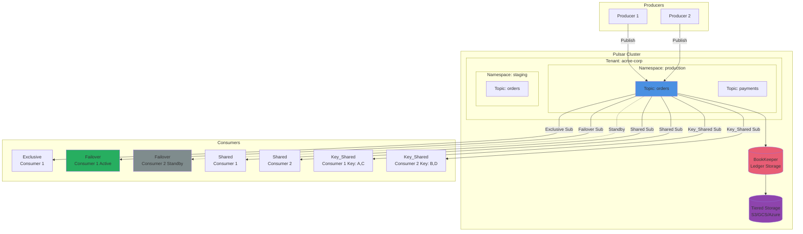

# Apache Pulsar Messaging System

## Overview

Apache Pulsar is a cloud-native, distributed messaging and streaming platform originally developed by Yahoo and now part of the Apache Software Foundation. ThunderPropagator provides comprehensive abstractions for Pulsar through its **Feeviders** framework, enabling seamless integration of Pulsar's advanced pub/sub capabilities, multi-tenancy, geo-replication, and tiered storage into your .NET applications.

### Why Apache Pulsar?

Pulsar combines the best features of traditional messaging systems and distributed log systems:

- **Multi-Tenancy**: Native tenant and namespace isolation with resource quotas and authentication
- **Geo-Replication**: Asynchronous replication across multiple datacenters for disaster recovery
- **Tiered Storage**: Offload historical data to cost-effective cloud storage (S3/GCS/Azure) while maintaining hot data in BookKeeper
- **Flexible Subscriptions**: Exclusive, Failover, Shared, and Key_Shared subscription types for different consumption patterns
- **Schema Management**: Built-in schema registry with Avro, JSON, and Protobuf support
- **Guaranteed Ordering**: Per-key ordering with Key_Shared subscriptions
- **Durability**: Leverages Apache BookKeeper for distributed, replicated log storage
- **Functions & SQL**: Serverless compute (Pulsar Functions) and SQL query capabilities (Presto/Trino integration)

### Key Features

| Feature | Description |
|---------|-------------|
| **Multi-Tenant Architecture** | Isolated tenants → namespaces → topics with independent policies |
| **Subscription Modes** | Exclusive (single consumer), Failover (active-standby), Shared (round-robin), Key_Shared (per-key routing) |
| **Schema Validation** | Enforce message structure with Avro, JSON, Protobuf schemas and evolution rules |
| **Message Deduplication** | Producer sequence IDs with configurable deduplication window |
| **Delayed Messages** | Schedule message delivery at specific timestamps |
| **Dead Letter Topics** | Automatic routing of unprocessable messages after max retries |
| **Tiered Storage** | Offload cold data to S3/GCS/Azure while maintaining read access |
| **Geo-Replication** | Cross-datacenter topic replication for global applications |
| **OpenTelemetry** | Full distributed tracing and metrics integration |
| **.NET 8/9/10** | Multi-targeted for latest .NET versions |

## Architecture



### Multi-Tenancy Hierarchy

Pulsar's organizational structure provides isolation and policy management:

```
Cluster
└── Tenant (acme-corp)
    ├── Namespace (production)
    │   ├── Policies (retention, TTL, deduplication, replication, quotas)
    │   └── Topics
    │       ├── persistent://acme-corp/production/orders
    │       ├── persistent://acme-corp/production/payments
    │       └── persistent://acme-corp/production/inventory
    └── Namespace (staging)
        └── Topics
            ├── persistent://acme-corp/staging/orders
            └── persistent://acme-corp/staging/test-events
```

**Topic Types**:
- `persistent://` — Durably stored in BookKeeper (default)
- `non-persistent://` — In-memory only, no durability guarantees

**Partitioned Topics**: Horizontally scaled topics split into N partitions for higher throughput.

## Pulsar vs Other Messaging Systems

| Feature | Pulsar | Kafka | RabbitMQ | NATS |
|---------|--------|-------|----------|------|
| **Architecture** | Segmented log + BookKeeper | Segmented log | Message broker | Distributed messaging |
| **Multi-Tenancy** | Native (tenants/namespaces) | Manual (topics/ACLs) | Virtual hosts | Accounts |
| **Subscription Modes** | 4 (Exclusive, Failover, Shared, Key_Shared) | 1 (Consumer groups) | Multiple | Queue groups |
| **Geo-Replication** | Built-in, asynchronous | Mirror Maker 2 | Shovel/Federation | Leaf nodes |
| **Tiered Storage** | Native (S3/GCS/Azure) | Tiered storage (requires config) | Not supported | Not supported |
| **Ordering Guarantees** | Per-key (Key_Shared) or partition | Per-partition | Per-queue | Per-subject |
| **Schema Registry** | Built-in | Confluent (separate) | Not built-in | Not built-in |
| **Message TTL** | Namespace/message-level | Topic-level | Queue-level | Not supported |
| **Functions** | Pulsar Functions (serverless) | Kafka Streams | Not supported | Not supported |
| **Storage Separation** | Yes (compute/storage decoupled) | No (brokers store data) | No | No |
| **Protocol** | Binary (Pulsar protocol) | Binary (Kafka protocol) | AMQP 0.9.1 | NATS protocol |
| **SQL Queries** | Presto/Trino integration | ksqlDB | Not supported | Not supported |

**When to Choose Pulsar**:
- ✅ Multi-tenant SaaS platforms requiring strict isolation
- ✅ Global applications needing geo-replication
- ✅ Large-scale systems with cost-sensitive storage (tiered offloading)
- ✅ Per-key ordering with horizontal scaling (Key_Shared subscriptions)
- ✅ Flexible consumption patterns (exclusive, failover, shared)
- ✅ Schema validation and evolution requirements

## Project Catalog

### Feeders (Message Consumers)
- **[ThunderPropagator.Feeders.Pulsar](Feeders.Pulsar/README.md)** — Pull-based IterativeFeeder for consuming messages with DotPulsar
  - Supports all subscription types (Exclusive, Failover, Shared, Key_Shared)
  - Schema validation (Avro/JSON/Protobuf)
  - Dead letter topics for poison messages
  - Consumer stats and health monitoring

### Providers (Message Publishers)
- **[ThunderPropagator.Providers.DotNet.Pulsar](Providers.DotNet.Pulsar/README.md)** — AbstractProvider for publishing messages to Pulsar
  - Auto-batching and compression (LZ4, ZLIB, ZSTD, SNAPPY)
  - Schema validation with evolution
  - Message deduplication and delayed delivery
  - Geo-replication support

### Shared Kernel
- **[ThunderPropagator.Feeviders.Pulsar.SharedKernel](Feeviders.Pulsar.SharedKernel/README.md)** — Common abstractions and utilities
  - Configuration base classes
  - PulsarClientFactory for connection management
  - JsonSchema implementation for DotPulsar
  - TLS/authentication helpers

## Quick Start

### Prerequisites

```bash
# Start Pulsar standalone (includes BookKeeper and ZooKeeper)
docker run -d -p 6650:6650 -p 8080:8080 \
  --name pulsar-standalone \
  apachepulsar/pulsar:latest \
  bin/pulsar standalone
```

### Basic Consumer (Exclusive Subscription)

```csharp
// 1. Define your message
public class OrderMessage : PulsarFeederMessage
{
    public string OrderId { get; set; }
    public decimal Amount { get; set; }
    public DateTimeOffset CreatedAt { get; set; }
}

// 2. Configure the feeder
public class OrderFeederConfiguration : PulsarFeederConfiguration
{
    // ServiceUrl, Topic, and SubscriptionName are required
}

// 3. Implement the handler
public class OrderFeederHandler : IFeederHandler<OrderChannel, OrderMessage>
{
    public async Task HandleAsync(
        OrderChannel channel,
        FeederReceivedMessage<OrderMessage> receivedMessage,
        CancellationToken cancellationToken = default)
    {
        var order = receivedMessage.Message;
        Console.WriteLine($"Processing order {order.OrderId} for ${order.Amount}");
        
        // Business logic here
        await ProcessOrderAsync(order, cancellationToken);
    }
}

// 4. Register in DI
services.AddPulsarFeeder<OrderChannel, OrderMessage, OrderFeederConfiguration>(
    configuration, "Messaging:Pulsar:OrderFeeder");

// Configuration in appsettings.json
{
  "Messaging": {
    "Pulsar": {
      "OrderFeeder": {
        "ServiceUrl": "pulsar://localhost:6650",
        "Topic": "persistent://public/default/orders",
        "SubscriptionName": "order-processor",
        "SubscriptionType": "Exclusive",
        "SerializerType": "Json"
      }
    }
  }
}
```

### Basic Producer

```csharp
// 1. Define your message
public class OrderMessage : PulsarProviderMessage
{
    public string OrderId { get; set; }
    public decimal Amount { get; set; }
}

// 2. Configure the provider
public class OrderProviderConfiguration : PulsarProviderConfiguration
{
    // ServiceUrl and Topic are required
}

// 3. Register in DI
services.AddPulsarProvider<OrderMessage, OrderProviderConfiguration>(
    configuration, "Messaging:Pulsar:OrderProvider");

// 4. Publish messages
public class OrderService
{
    private readonly IProvider<OrderMessage> _provider;

    public OrderService(IProvider<OrderMessage> provider)
    {
        _provider = provider;
    }

    public async Task CreateOrderAsync(Order order)
    {
        var message = new OrderMessage
        {
            OrderId = order.Id,
            Amount = order.Amount
        };

        await _provider.ExecuteAsync(message);
        Console.WriteLine($"Order {order.Id} published to Pulsar");
    }
}

// Configuration
{
  "Messaging": {
    "Pulsar": {
      "OrderProvider": {
        "ServiceUrl": "pulsar://localhost:6650",
        "Topic": "persistent://public/default/orders",
        "CompressionType": "LZ4",
        "SerializerType": "Json"
      }
    }
  }
}
```

## Pulsar Concepts

### 1. Subscription Types

Pulsar offers four subscription modes to match different consumption patterns:

#### Exclusive (Default)
- **Single active consumer** per subscription
- **Ordering guaranteed** (messages delivered in publish order)
- **Use case**: Sequential processing, stateful consumers

```csharp
{
  "SubscriptionType": "Exclusive"
}
```

#### Failover
- **Multiple consumers**, one active (leader), others standby
- **Automatic failover** when active consumer disconnects
- **Ordering preserved** (active consumer receives all messages)
- **Use case**: High availability with ordering requirements

```csharp
{
  "SubscriptionType": "Failover"
}
```

#### Shared
- **Multiple active consumers** (round-robin distribution)
- **No ordering guarantee** (messages distributed across consumers)
- **High throughput** (horizontal scaling)
- **Use case**: Stateless processing, maximum parallelism

```csharp
{
  "SubscriptionType": "Shared"
}
```

#### Key_Shared
- **Multiple active consumers** with key-based routing
- **Per-key ordering** (messages with same key → same consumer)
- **Horizontal scaling** with ordering guarantees
- **Use case**: Per-tenant processing, session-based workloads

```csharp
// Producer sets message key
message["key"] = customerId; // All messages for customer go to same consumer

// Consumer configuration
{
  "SubscriptionType": "Key_Shared"
}
```

### 2. Acknowledgment Types

#### Individual Acknowledgment
Acknowledge specific messages independently:

```csharp
await consumer.Acknowledge(message1, cancellationToken);
await consumer.Acknowledge(message3, cancellationToken);
// message2 remains unacknowledged (will redeliver after timeout)
```

#### Cumulative Acknowledgment
Acknowledge a message and all prior messages:

```csharp
await consumer.AcknowledgeCumulative(message3, cancellationToken);
// Acknowledges message1, message2, and message3
```

**Recommendation**: Use Individual Ack for Shared/Key_Shared, Cumulative Ack for Exclusive/Failover.

### 3. Negative Acknowledgment

Trigger immediate redelivery without waiting for acknowledgment timeout:

```csharp
try
{
    await ProcessMessageAsync(message);
}
catch (RetryableException)
{
    await consumer.NegativeAcknowledge(message, cancellationToken);
    // Message redelivered to next available consumer
}
```

### 4. Schema Management

Pulsar validates message structure at publish and consumption:

```csharp
// Schema types
public enum SchemaType
{
    Bytes,    // Raw bytes (no validation)
    String,   // UTF-8 text
    Json,     // JSON schema validation
    Avro,     // Avro binary with schema registry
    Protobuf  // Protocol Buffers
}
```

**Schema Evolution**:
- **Forward compatibility**: Old consumers can read new schema (add optional fields)
- **Backward compatibility**: New consumers can read old schema (remove fields)
- **Full compatibility**: Both directions

### 5. Dead Letter Topics

Automatically route unprocessable messages after max retries:

```csharp
{
  "SubscriptionName": "order-processor",
  "MaxRedeliverCount": 3,  // After 3 failed attempts...
  "DeadLetterTopic": "persistent://public/default/orders-dlq"  // ...send here
}
```

### 6. Message TTL and Retention

**TTL (Time-To-Live)**: Expire unread messages after duration
```csharp
// Set at namespace level (via Pulsar admin)
pulsar-admin namespaces set-message-ttl public/default --messageTTL 86400  // 24 hours
```

**Retention**: Keep acknowledged messages for specified time/size
```csharp
// Set at namespace level
pulsar-admin namespaces set-retention public/default \
  --size 10G --time 7d  // Keep 7 days or 10GB
```

### 7. Tiered Storage

Offload historical segments to cost-effective cloud storage while maintaining read access:

```csharp
// Configure tiered storage (admin operation)
pulsar-admin namespaces set-offload-threshold public/default --size 100M

// Offload to S3
pulsar-admin topics offload persistent://public/default/orders \
  --size-threshold 100M
```

**Benefits**:
- Reduce BookKeeper storage costs (hot data only)
- Unlimited historical retention in S3/GCS/Azure
- Transparent read access (automatic fetch from tiered storage)

## Performance Characteristics

### Throughput Comparison

| Scenario | Throughput | Latency (p99) | Notes |
|----------|-----------|---------------|-------|
| **Single Producer** | ~100K msg/s | <10ms | 1KB messages, no batching |
| **Batched Producer** | ~800K msg/s | <20ms | 1KB messages, 10ms batch delay |
| **Partitioned Topic (8)** | ~800K msg/s | <15ms | 8 partitions, 8 producers |
| **Key_Shared (8 consumers)** | ~600K msg/s | <25ms | Per-key ordering preserved |
| **Geo-Replicated** | ~50K msg/s | <100ms | Cross-datacenter latency |

### Storage Performance

| Storage Layer | Write Latency | Read Latency | Cost |
|---------------|---------------|--------------|------|
| **BookKeeper (Hot)** | <5ms | <3ms | High (SSD) |
| **Tiered S3 (Warm)** | N/A | <50ms | Low (object storage) |
| **Tiered GCS (Cold)** | N/A | <100ms | Very Low |

### Subscription Mode Overhead

| Mode | Throughput | Ordering | Failover Time | Complexity |
|------|-----------|----------|---------------|------------|
| **Exclusive** | Baseline | Full | N/A (single consumer) | Low |
| **Failover** | Baseline | Full | <1s (leader election) | Medium |
| **Shared** | 5-8x (multi-consumer) | None | N/A | Low |
| **Key_Shared** | 4-6x (multi-consumer) | Per-key | N/A | Medium |

## Best Practices

### 1. Topic Naming
Use hierarchical tenant/namespace structure:
```csharp
// Good
"persistent://acme-corp/production/orders.created"
"persistent://acme-corp/staging/payments.processed"

// Avoid
"orders"  // No tenant/namespace isolation
"persistent://public/default/ORDERS_PROD"  // Unclear hierarchy
```

### 2. Subscription Strategy
- **Exclusive**: Sequential processing, stateful operations
- **Failover**: High availability + ordering (e.g., financial transactions)
- **Shared**: Stateless, maximum throughput (e.g., log aggregation)
- **Key_Shared**: Per-entity processing with scale (e.g., per-user tasks)

### 3. Schema Validation
Always use schemas for production (Avro recommended for performance):
```csharp
{
  "SchemaType": "Avro",
  "SchemaInfo": {
    "Name": "Order",
    "Schema": "{\"type\":\"record\",\"name\":\"Order\",\"fields\":[...]}"
  }
}
```

### 4. Batching Configuration
Balance latency vs throughput:
```csharp
// High throughput (tolerate 50ms latency)
{
  "BatchingMaxMessages": 1000,
  "BatchingMaxPublishDelay": "00:00:00.050"  // 50ms
}

// Low latency (sacrifice throughput)
{
  "BatchingEnabled": false  // Disable batching
}
```

### 5. Multi-Tenancy Isolation
Use tenants and namespaces for workload separation:
```csharp
// Customer isolation
persistent://customer-123/production/events
persistent://customer-456/production/events

// Environment isolation
persistent://acme/production/orders
persistent://acme/staging/orders
persistent://acme/development/orders
```

### 6. Geo-Replication Planning
Enable replication for critical topics only (bandwidth cost):
```csharp
// Enable replication (admin CLI)
pulsar-admin topics set-replication-clusters \
  persistent://acme/production/orders \
  --clusters us-west,us-east,eu-central
```

### 7. Monitoring and Observability
Enable OpenTelemetry tracing:
```csharp
{
  "AttachTraceInfoToMessages": true  // Provider injects Activity context
}
```

Monitor consumer lag:
```bash
pulsar-admin topics stats persistent://tenant/namespace/topic
# Check "backlog" field in each subscription
```

## Troubleshooting

### 1. "ServiceUrl not configured"
**Cause**: Missing or invalid ServiceUrl in configuration.

**Solution**:
```csharp
{
  "ServiceUrl": "pulsar://localhost:6650"  // Required
}
```

For TLS:
```csharp
{
  "ServiceUrl": "pulsar+ssl://pulsar.example.com:6651",
  "TrustedCertificateAuthority": {
    "Path": "ca-cert.pem"
  }
}
```

### 2. Consumer Not Receiving Messages
**Possible Causes**:
- Wrong subscription type (e.g., Key_Shared but producer not setting keys)
- Topic name mismatch (case-sensitive, tenant/namespace required)
- Consumer crashed before acknowledging (messages redelivered to other consumers)

**Debug Steps**:
```bash
# Check topic stats
pulsar-admin topics stats persistent://tenant/namespace/topic

# Verify subscription exists
pulsar-admin topics subscriptions persistent://tenant/namespace/topic

# Check consumer connection
pulsar-admin topics lookup persistent://tenant/namespace/topic
```

### 3. High Consumer Lag
**Causes**:
- Slow message processing
- Single consumer bottleneck (Exclusive/Failover)
- Insufficient consumer resources

**Solutions**:
```csharp
// Switch to Shared for horizontal scaling
{
  "SubscriptionType": "Shared",
  "MessagePrefetchCount": 1000  // Increase prefetch buffer
}

// Or partition the topic (admin operation)
pulsar-admin topics create-partitioned-topic \
  persistent://tenant/namespace/topic --partitions 8
```

### 4. Message Deduplication Not Working
**Cause**: Deduplication disabled at namespace level (off by default).

**Solution**:
```bash
# Enable deduplication for namespace
pulsar-admin namespaces set-deduplication public/default --enable

# Set sequence ID in producer
{
  "InitialSequenceId": 1000  // Start from specific ID
}
```

### 5. Schema Evolution Failure
**Cause**: Incompatible schema change (e.g., removing required field).

**Solutions**:
- Use forward-compatible changes (add optional fields only)
- Version schemas explicitly (separate topics per version)
- Configure schema compatibility:
```bash
pulsar-admin schemas set-compatibility \
  persistent://tenant/namespace/topic \
  --compatibility FORWARD
```

## Additional Resources

- **Pulsar Documentation**: https://pulsar.apache.org/docs/
- **DotPulsar Client**: https://github.com/apache/pulsar-dotpulsar
- **BookKeeper**: https://bookkeeper.apache.org/
- **Pulsar Functions**: https://pulsar.apache.org/docs/functions-overview/
- **Schema Registry**: https://pulsar.apache.org/docs/schema-get-started/
- **Tiered Storage**: https://pulsar.apache.org/docs/tiered-storage-overview/

## Related Documentation

- [Feeders.Pulsar README](Feeders.Pulsar/README.md) — Consumer implementation details
- [Providers.DotNet.Pulsar README](Providers.DotNet.Pulsar/README.md) — Producer implementation details
- [Feeviders.Pulsar.SharedKernel README](Feeviders.Pulsar.SharedKernel/README.md) — Configuration and utilities
- [SharedKernel README](../SharedKernel/README.md) — Core abstractions
- [Main README](../../README.md) — Framework overview

---

**Version**: 1.0.1-beta.2  
**Last Updated**: December 2025  
**License**: See project root LICENSE file
