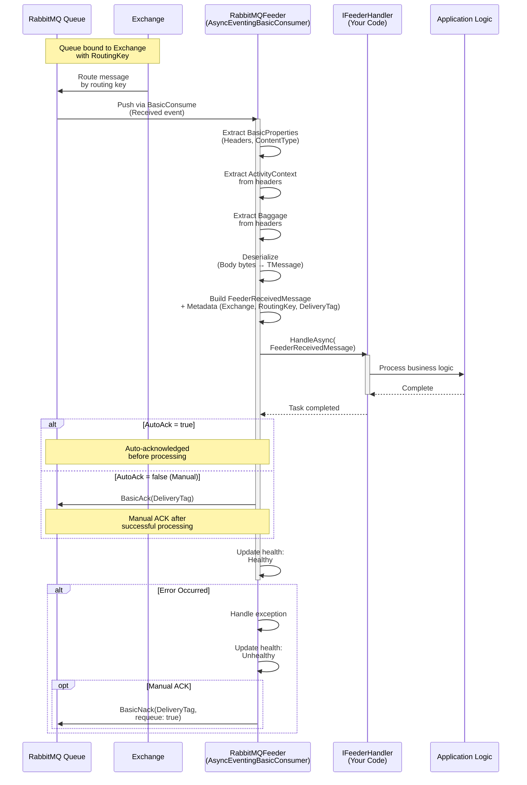

# ThunderPropagator.Feeders.RabbitMQ

> AMQP Message Consumer - Receives and processes inbound messages from RabbitMQ queues

[◂ Back to RabbitMQ](../README.md) | [◂ Back to Documentation](../../README.md)

## Contents

- [Overview](#overview)
- [Architecture](#architecture)
- [Files](#files)
- [Configuration](#configuration)
- [Dependencies](#dependencies)
- [API Reference](#api-reference)
- [Examples](#examples)
- [Advanced Patterns](#advanced-patterns)
- [See Also](#see-also)

## Overview

**Type**: Message Consumer (Feeder)  
**Target Frameworks**: .NET 8, 9, 10  
**Package**: ThunderPropagator.Feeders.RabbitMQ

The RabbitMQ Feeder is a **DelegativeFeeder** implementation that provides reliable AMQP 0.9.1 message consumption from RabbitMQ queues. It follows a push-based consumption model using `AsyncEventingBasicConsumer` for non-blocking message handling with comprehensive error recovery, health monitoring, and distributed tracing support.

### Key Features

- ✅ **AsyncEventingBasicConsumer**: Non-blocking async message handling with event-driven architecture
- ✅ **Queue Binding**: Automatic queue declaration and exchange binding with routing keys
- ✅ **Auto-reconnection**: Automatic recovery from connection failures with topology restoration
- ✅ **Prefetch Control**: QoS settings for controlled message flow and load balancing
- ✅ **Flexible Acknowledgments**: Auto-ack or manual-ack modes for guaranteed processing
- ✅ **Multiple Serialization Formats**: JSON, Newtonsoft.Json, NetJSON support
- ✅ **OpenTelemetry Integration**: Built-in W3C Trace Context propagation via message headers
- ✅ **Health Monitoring**: Real-time connection and consumption health reporting
- ✅ **Exchange Types**: Support for direct, topic, fanout, and headers exchanges
- ✅ **Message Enrichment**: Optional C# script-based message transformation

## Architecture



## Files

**Total**: 5 C# source files

| File | LOC | Responsibility |
|------|-----|----------------|
| [RabbitMQFeeder.cs](../../../Feeviders/RabbitMQ/ThunderPropagator.Feeders.RabbitMQ/RabbitMQFeeder.cs) | ~153 | Main feeder implementation - manages AsyncEventingBasicConsumer lifecycle, health monitoring, and OpenTelemetry context extraction |
| [RabbitMQFeederConfiguration.cs](../../../Feeviders/RabbitMQ/ThunderPropagator.Feeders.RabbitMQ/RabbitMQFeederConfiguration.cs) | ~31 | Configuration class - extends RabbitMQFeeviderConfiguration with feeder-specific settings (serialization, enrichment) |
| [RabbitMQFeederMessage.cs](../../../Feeviders/RabbitMQ/ThunderPropagator.Feeders.RabbitMQ/RabbitMQFeederMessage.cs) | ~8 | Abstract message base class - provides type safety for RabbitMQ messages |
| [RabbitMQFeederExtensions.cs](../../../Feeviders/RabbitMQ/ThunderPropagator.Feeders.RabbitMQ/RabbitMQFeederExtensions.cs) | ~58 | DI registration extensions - AddRabbitMQFeeder, AddRabbitMQFeederResolver, UseRabbitMQFeederResolver |
| [AssemblyInfo.cs](../../../Feeviders/RabbitMQ/ThunderPropagator.Feeders.RabbitMQ/AssemblyInfo.cs) | ~10 | Assembly metadata and internals visibility |

### Key Implementation Details

#### RabbitMQFeeder.cs

```csharp
internal sealed class RabbitMQFeeder<TChannel, TRabbitMQFeederMessage, TRabbitMQFeederConfiguration> 
    : DelegativeFeeder<TChannel, TRabbitMQFeederMessage, TRabbitMQFeederConfiguration>
    where TChannel : class, IChannel
    where TRabbitMQFeederMessage : RabbitMQFeederMessage
    where TRabbitMQFeederConfiguration : RabbitMQFeederConfiguration
{
    private IChannel? _channel;
    private IConnection? _connection;
    private AsyncEventingBasicConsumer? _consumer;
    
    private readonly TextMapPropagator _propagator = Propagators.DefaultTextMapPropagator;
    
    // Initialization in background task
    private async Task StartAsync(CancellationToken cancellationToken)
    {
        // Create RabbitMQ connection and channel
        (_connection, _channel) = await RabbitMQFeeviderConnectionFactory
            .InitializeChannelAsync(FeederConfiguration, cancellationToken);
        
        // Setup async consumer
        _consumer = new AsyncEventingBasicConsumer(_channel);
        
        // Register event handler
        _consumer.ReceivedAsync += async (_, eventArgs) =>
        {
            // Extract OpenTelemetry context from BasicProperties
            var parentContext = _propagator.Extract(default, 
                eventArgs.BasicProperties, 
                ExtractTraceContextFromBasicProperties);
            
            // Delegate to base class for deserialization and handler invocation
            await ReceiveAsync(
                eventArgs.Body.ToArray(),
                parentContext.ActivityContext,
                parentContext.Baggage,
                new Dictionary<string, object?>
                {
                    { nameof(eventArgs.Exchange), eventArgs.Exchange },
                    { nameof(eventArgs.ConsumerTag), eventArgs.ConsumerTag },
                    { nameof(eventArgs.DeliveryTag), eventArgs.DeliveryTag },
                    { nameof(eventArgs.RoutingKey), eventArgs.RoutingKey },
                },
                cancellationToken);
            
            ReportHealth(HealthStatus.Healthy);
        };
        
        // Start consuming
        await _channel.BasicConsumeAsync(
            FeederConfiguration.Queue, 
            FeederConfiguration.AutoAck, 
            _consumer, 
            cancellationToken: cancellationToken);
    }
    
    private IEnumerable<string> ExtractTraceContextFromBasicProperties(
        IReadOnlyBasicProperties props, string key)
    {
        if (props.Headers?.TryGetValue(key, out var value) == true 
            && value is byte[] bytes)
            return [Encoding.UTF8.GetString(bytes)];
        return [];
    }
}
```

**Key Design Decisions:**
- **Push-based**: Uses `AsyncEventingBasicConsumer` for event-driven consumption
- **DelegativeFeeder**: Inherits queue-based processing from base class
- **Health tracking**: Sets `HealthName` as `feeder_RabbitMQ_{Queue}`
- **OpenTelemetry**: Extracts trace context from message headers using W3C format
- **Automatic recovery**: RabbitMQ.Client's built-in topology recovery on reconnection

## Configuration

### RabbitMQFeederConfiguration Properties

```csharp
public abstract class RabbitMQFeederConfiguration : RabbitMQFeeviderConfiguration, IAbstractFeederConfiguration
{
    // Feeder-specific properties
    public Guid Id { get; set; }                    // Unique feeder identifier
    public SerializerType SerializerType { get; set; }  // Json, NJson, NetJson
    public string? EnrichmentScript { get; set; }   // C# script for message transformation
    public string[]? MetadataReferences { get; set; } // Script assembly references
    
    // Inherited from RabbitMQFeeviderConfiguration (see SharedKernel docs)
    public string HostName { get; set; }            // RabbitMQ server hostname
    public int Port { get; set; }                   // AMQP port (default: 5672)
    public string? UserName { get; set; }           // Authentication username
    public string? Password { get; set; }           // Authentication password
    public string? VirtualHost { get; set; }        // Virtual host (default: "/")
    public string Queue { get; set; }               // Queue name (required)
    public string Exchange { get; set; }            // Exchange name (default: "")
    public string RoutingKey { get; set; }          // Routing key (default: Queue name)
    public bool AutoAck { get; set; }               // Auto-acknowledge messages (default: true)
    public bool Durable { get; set; }               // Durable queue (default: false)
    public bool Exclusive { get; set; }             // Exclusive queue (default: false)
    public bool AutoDelete { get; set; }            // Auto-delete queue (default: false)
    public Dictionary<string, object?>? Arguments { get; set; } // Queue arguments
    
    // Advanced connection properties (inherited)
    public bool? AutomaticRecoveryEnabled { get; set; }  // Default: true
    public TimeSpan? NetworkRecoveryInterval { get; set; } // Default: 5s
    public ushort? ConsumerDispatchConcurrency { get; set; } // Default: 1
    public TimeSpan? RequestedConnectionTimeout { get; set; }
    public TimeSpan? SocketReadTimeout { get; set; }
    public TimeSpan? SocketWriteTimeout { get; set; }
    public SslOption? Ssl { get; set; }             // TLS/SSL configuration
    public bool? TopologyRecoveryEnabled { get; set; } // Default: true
    public ushort? RequestedChannelMax { get; set; }
    public uint? RequestedFrameMax { get; set; }
    public TimeSpan? RequestedHeartbeat { get; set; }
    public string? ClientProvidedName { get; set; } // Client identification
}
```

### Configuration Example (appsettings.json)

```json
{
  "Messaging": {
    "RabbitMQ": {
      "IsEnabled": true,
      "HostName": "localhost",
      "Port": 5672,
      "UserName": "guest",
      "Password": "guest",
      "VirtualHost": "/",
      "Queue": "orders-queue",
      "Exchange": "orders-exchange",
      "RoutingKey": "orders.*",
      "AutoAck": false,
      "Durable": true,
      "Exclusive": false,
      "AutoDelete": false,
      "SerializerType": "Json",
      "AutomaticRecoveryEnabled": true,
      "NetworkRecoveryInterval": "00:00:05",
      "ConsumerDispatchConcurrency": 1,
      "ClientProvidedName": "OrderProcessingService"
    }
  }
}
```

## Dependencies

### NuGet Packages

| Package | Version | Purpose |
|---------|---------|---------|
| **ThunderPropagator.Feeders.SharedKernel** | 1.0.1-beta.2 | Base feeder abstractions (DelegativeFeeder) |
| **ThunderPropagator.Feeviders.RabbitMQ.SharedKernel** | 1.0.1-beta.2 | Shared configuration and connection factory |
| **RabbitMQ.Client** | 7.0+ | Official RabbitMQ .NET client with async support |
| **OpenTelemetry.Api** | Latest | Distributed tracing primitives |
| **Microsoft.Extensions.Logging** | 8.0+ | Structured logging abstractions |
| **Microsoft.Extensions.DependencyInjection** | 8.0+ | Service registration |

### Project References

```xml
<ItemGroup>
  <ProjectReference Include="..\..\SharedKernel\ThunderPropagator.Feeders.SharedKernel\ThunderPropagator.Feeders.SharedKernel.csproj"/>
  <ProjectReference Include="..\ThunderPropagator.Feeviders.RabbitMQ.SharedKernel\ThunderPropagator.Feeviders.RabbitMQ.SharedKernel.csproj"/>
</ItemGroup>
```

## API Reference

### RabbitMQFeeder Class

```csharp
internal sealed class RabbitMQFeeder<TChannel, TRabbitMQFeederMessage, TRabbitMQFeederConfiguration>
    : DelegativeFeeder<TChannel, TRabbitMQFeederMessage, TRabbitMQFeederConfiguration>
    where TChannel : class, IChannel
    where TRabbitMQFeederMessage : RabbitMQFeederMessage
    where TRabbitMQFeederConfiguration : RabbitMQFeederConfiguration
```

**Properties:**
- `HealthName` (string): Health check identifier (`feeder_RabbitMQ_{Queue}`)
- `HealthTags` (List<string>): Tags for health monitoring (`["RabbitMQ", "{Queue}"]`)
- `Logger` (ILogger): Structured logger instance

**Lifecycle Methods:**
- `StartAsync(CancellationToken)`: Initializes connection, channel, and consumer
- `StopAsync(CancellationToken)`: Gracefully closes channel and connection
- `DisposeManagedResourcesAsync()`: Disposes RabbitMQ resources

**Internal Methods:**
- `ExtractTraceContextFromBasicProperties(IReadOnlyBasicProperties, string)`: Extracts W3C trace context from message headers

### RabbitMQFeederMessage Class

```csharp
public abstract class RabbitMQFeederMessage : FeederMessage
{
    // Inherit from this class to define your message types
}
```

**Inherited Properties (from FeederMessage):**
- `MessageMetadata` (Dictionary<string, object?>): Exchange, RoutingKey, DeliveryTag, ConsumerTag

**Example Implementation:**
```csharp
public class OrderCreatedMessage : RabbitMQFeederMessage
{
    public string OrderId { get; set; }
    public decimal Amount { get; set; }
    public DateTime CreatedAt { get; set; }
}
```

### Extension Methods

#### AddRabbitMQFeeder

```csharp
public static IServiceCollection AddRabbitMQFeeder<TChannel, TRabbitMQFeederMessage, TRabbitMQFeederConfiguration>(
    this IServiceCollection services,
    IConfigurationRoot configuration,
    string sectionName)
    where TChannel : class, IChannel
    where TRabbitMQFeederMessage : RabbitMQFeederMessage
    where TRabbitMQFeederConfiguration : RabbitMQFeederConfiguration, new()
```

**Purpose**: Registers a single RabbitMQ feeder with DI container

**Example:**
```csharp
services.AddRabbitMQFeeder<OrderChannel, OrderMessage, OrderRabbitMQConfig>(
    configuration, "Messaging:RabbitMQ");
```

#### AddRabbitMQFeederResolver

```csharp
public static IServiceCollection AddRabbitMQFeederResolver<TChannel, TRabbitMQFeederMessage, TRabbitMQFeederConfiguration>(
    this IServiceCollection services)
    where TChannel : class, IChannel
    where TRabbitMQFeederMessage : RabbitMQFeederMessage
    where TRabbitMQFeederConfiguration : RabbitMQFeederConfiguration, new()
```

**Purpose**: Registers feeder resolver for dynamic multi-instance management

**Example:**
```csharp
services.AddRabbitMQFeederResolver<OrderChannel, OrderMessage, OrderRabbitMQConfig>();
```

#### UseRabbitMQFeederResolver

```csharp
public static IApplicationBuilder UseRabbitMQFeederResolver<TChannel, TRabbitMQFeederMessage, TRabbitMQFeederConfiguration>(
    this IApplicationBuilder app,
    Guid channelKey,
    TRabbitMQFeederConfiguration rabbitMQFeederConfiguration)
    where TChannel : class, IChannel
    where TRabbitMQFeederMessage : RabbitMQFeederMessage
    where TRabbitMQFeederConfiguration : RabbitMQFeederConfiguration
```

**Purpose**: Activates a dynamically configured feeder instance

**Example:**
```csharp
app.UseRabbitMQFeederResolver<OrderChannel, OrderMessage, OrderRabbitMQConfig>(
    channelId, runtimeConfig);
```

## Examples

### Example 1: Basic Feeder Setup

```csharp
// 1. Define your message type
public class PaymentProcessedMessage : RabbitMQFeederMessage
{
    public string PaymentId { get; set; }
    public decimal Amount { get; set; }
    public string Currency { get; set; }
    public DateTime ProcessedAt { get; set; }
}

// 2. Define configuration
public class PaymentRabbitMQFeederConfiguration : RabbitMQFeederConfiguration
{
    // Inherits all RabbitMQ properties
}

// 3. Create handler
public class PaymentFeederHandler : IFeederHandler<PaymentChannel, PaymentProcessedMessage>
{
    private readonly ILogger<PaymentFeederHandler> _logger;
    
    public PaymentFeederHandler(ILogger<PaymentFeederHandler> logger)
    {
        _logger = logger;
    }
    
    public async Task HandleAsync(
        FeederReceivedMessage<PaymentProcessedMessage> receivedMessage,
        CancellationToken cancellationToken = default)
    {
        var message = receivedMessage.Message;
        
        _logger.LogInformation(
            "Processing payment {PaymentId} for {Amount} {Currency}",
            message.PaymentId, message.Amount, message.Currency);
        
        // Your business logic here
        await ProcessPaymentAsync(message, cancellationToken);
        
        _logger.LogInformation("Payment {PaymentId} processed successfully", 
            message.PaymentId);
    }
    
    private async Task ProcessPaymentAsync(
        PaymentProcessedMessage message, 
        CancellationToken cancellationToken)
    {
        // Implementation
        await Task.CompletedTask;
    }
}

// 4. Register in Program.cs
var builder = WebApplication.CreateBuilder(args);

builder.Services.AddRabbitMQFeeder<PaymentChannel, PaymentProcessedMessage, PaymentRabbitMQFeederConfiguration>(
    builder.Configuration, "Messaging:RabbitMQ");

builder.Services.AddScoped<IFeederHandler<PaymentChannel, PaymentProcessedMessage>, PaymentFeederHandler>();

var app = builder.Build();
app.Run();
```

**appsettings.json:**
```json
{
  "Messaging": {
    "RabbitMQ": {
      "IsEnabled": true,
      "HostName": "localhost",
      "Port": 5672,
      "UserName": "guest",
      "Password": "guest",
      "Queue": "payments-queue",
      "Exchange": "payments-exchange",
      "RoutingKey": "payment.processed",
      "AutoAck": false,
      "Durable": true,
      "SerializerType": "Json"
    }
  }
}
```

### Example 2: Topic Exchange with Wildcards

```csharp
// Configuration for topic exchange pattern
public class NotificationRabbitMQFeederConfiguration : RabbitMQFeederConfiguration
{
    // Automatically inherits Exchange, RoutingKey, etc.
}

// Message types
public class NotificationMessage : RabbitMQFeederMessage
{
    public string Type { get; set; }  // email, sms, push
    public string Recipient { get; set; }
    public string Content { get; set; }
}

// Handler with routing key pattern matching
public class NotificationFeederHandler : IFeederHandler<NotificationChannel, NotificationMessage>
{
    private readonly ILogger<NotificationFeederHandler> _logger;
    
    public async Task HandleAsync(
        FeederReceivedMessage<NotificationMessage> receivedMessage,
        CancellationToken cancellationToken)
    {
        var message = receivedMessage.Message;
        
        // Access routing key from metadata
        var routingKey = receivedMessage.MessageMetadata?["RoutingKey"] as string;
        
        _logger.LogInformation(
            "Received notification via routing key {RoutingKey}: {Type} to {Recipient}",
            routingKey, message.Type, message.Recipient);
        
        // Route to appropriate handler based on message type
        await message.Type switch
        {
            "email" => SendEmailAsync(message, cancellationToken),
            "sms" => SendSmsAsync(message, cancellationToken),
            "push" => SendPushAsync(message, cancellationToken),
            _ => Task.CompletedTask
        };
    }
    
    private async Task SendEmailAsync(NotificationMessage msg, CancellationToken ct)
    {
        // Email implementation
        await Task.CompletedTask;
    }
    
    private async Task SendSmsAsync(NotificationMessage msg, CancellationToken ct)
    {
        // SMS implementation
        await Task.CompletedTask;
    }
    
    private async Task SendPushAsync(NotificationMessage msg, CancellationToken ct)
    {
        // Push notification implementation
        await Task.CompletedTask;
    }
}
```

**appsettings.json:**
```json
{
  "Messaging": {
    "RabbitMQ": {
      "HostName": "localhost",
      "Queue": "notifications-queue",
      "Exchange": "notifications-topic",
      "RoutingKey": "notification.*",  // Matches notification.email, notification.sms, etc.
      "Durable": true,
      "AutoAck": false
    }
  }
}
```

### Example 3: Manual Acknowledgments with Error Handling

```csharp
public class OrderProcessingHandler : IFeederHandler<OrderChannel, OrderMessage>
{
    private readonly ILogger<OrderProcessingHandler> _logger;
    private readonly IOrderService _orderService;
    
    public OrderProcessingHandler(
        ILogger<OrderProcessingHandler> logger,
        IOrderService orderService)
    {
        _logger = logger;
        _orderService = orderService;
    }
    
    public async Task HandleAsync(
        FeederReceivedMessage<OrderMessage> receivedMessage,
        CancellationToken cancellationToken)
    {
        var message = receivedMessage.Message;
        var deliveryTag = receivedMessage.MessageMetadata?["DeliveryTag"] as ulong? ?? 0;
        
        try
        {
            _logger.LogInformation("Processing order {OrderId}", message.OrderId);
            
            // Business logic with retries
            await _orderService.ProcessOrderAsync(message, cancellationToken);
            
            // Manual ACK happens automatically on successful completion
            // (DelegativeFeeder handles this)
            
            _logger.LogInformation("Order {OrderId} processed successfully", 
                message.OrderId);
        }
        catch (ValidationException ex)
        {
            _logger.LogWarning(ex, 
                "Order {OrderId} validation failed - will not requeue", 
                message.OrderId);
            
            // Don't requeue invalid messages
            // ACK to remove from queue
            throw; // Rethrow to mark as failed but acknowledged
        }
        catch (Exception ex)
        {
            _logger.LogError(ex, 
                "Order {OrderId} processing failed - will requeue", 
                message.OrderId);
            
            // Transient error - requeue for retry
            // NACK happens automatically on exception
            throw; // Rethrow to trigger requeue
        }
    }
}
```

**appsettings.json with Dead Letter Exchange:**
```json
{
  "Messaging": {
    "RabbitMQ": {
      "HostName": "localhost",
      "Queue": "orders-queue",
      "Exchange": "orders-exchange",
      "RoutingKey": "order.created",
      "AutoAck": false,
      "Durable": true,
      "Arguments": {
        "x-dead-letter-exchange": "orders-dlx",
        "x-dead-letter-routing-key": "order.failed",
        "x-message-ttl": 300000
      }
    }
  }
}
```

### Example 4: Dynamic Multi-Tenant Feeder

```csharp
// Use feeder resolver for runtime configuration
public class TenantOnboardingService
{
    private readonly IFeederManager<TenantChannel, TenantMessage, TenantRabbitMQConfig> _feederManager;
    private readonly ILogger<TenantOnboardingService> _logger;
    
    public TenantOnboardingService(
        IFeederManager<TenantChannel, TenantMessage, TenantRabbitMQConfig> feederManager,
        ILogger<TenantOnboardingService> logger)
    {
        _feederManager = feederManager;
        _logger = logger;
    }
    
    public async Task OnboardTenantAsync(
        string tenantId, 
        CancellationToken cancellationToken)
    {
        // Create tenant-specific configuration at runtime
        var config = new TenantRabbitMQConfig
        {
            Id = Guid.NewGuid(),
            HostName = "rabbitmq.example.com",
            Queue = $"tenant-{tenantId}-events",
            Exchange = "tenant-events",
            RoutingKey = $"tenant.{tenantId}.*",
            Durable = true,
            AutoAck = false,
            SerializerType = SerializerType.Json
        };
        
        // Start feeder dynamically
        var channelKey = Guid.NewGuid();
        _feederManager.UseFeeder(channelKey, config, cancellationToken);
        
        _logger.LogInformation(
            "Started RabbitMQ feeder for tenant {TenantId} on queue {Queue}",
            tenantId, config.Queue);
    }
    
    public void OffboardTenant(Guid channelKey)
    {
        _feederManager.StopFeeder(channelKey);
        _logger.LogInformation("Stopped feeder for channel {ChannelKey}", channelKey);
    }
}

// Register resolver in Program.cs
builder.Services.AddRabbitMQFeederResolver<TenantChannel, TenantMessage, TenantRabbitMQConfig>();
builder.Services.AddSingleton<TenantOnboardingService>();
```

### Example 5: Message Enrichment with C# Script

```csharp
// Configuration with enrichment script
{
  "Messaging": {
    "RabbitMQ": {
      "HostName": "localhost",
      "Queue": "enriched-orders-queue",
      "EnrichmentScript": @"
        // Add computed fields to the message
        message.ProcessedAt = DateTime.UtcNow;
        message.TotalWithTax = message.Amount * 1.15m;
        message.Priority = message.Amount > 1000 ? 'High' : 'Normal';
        return message;
      ",
      "MetadataReferences": [
        "System.Runtime",
        "System.Linq"
      ]
    }
  }
}
```

**Note**: Enrichment scripts are executed via Roslyn C# scripting engine before message deserialization.

## Advanced Patterns

### Pattern 1: Work Queue (Load Balancing)

Multiple consumers on the same queue distribute messages round-robin:

```csharp
// Instance 1
builder.Services.AddRabbitMQFeeder<WorkChannel, WorkMessage, WorkRabbitMQConfig>(
    configuration, "Messaging:WorkQueue");

// Instance 2 (separate process/pod)
builder.Services.AddRabbitMQFeeder<WorkChannel, WorkMessage, WorkRabbitMQConfig>(
    configuration, "Messaging:WorkQueue"); // Same queue

// Configuration
{
  "Messaging": {
    "WorkQueue": {
      "Queue": "work-queue",
      "Durable": true,
      "AutoAck": false
      // No need for consumer groups - RabbitMQ handles distribution
    }
  }
}
```

### Pattern 2: Pub/Sub (Fanout Exchange)

Broadcast messages to all subscribers:

```csharp
// Subscriber 1 - Audit Service
{
  "Queue": "audit-queue",
  "Exchange": "events-fanout",
  "RoutingKey": ""  // Ignored for fanout
}

// Subscriber 2 - Analytics Service
{
  "Queue": "analytics-queue",
  "Exchange": "events-fanout",
  "RoutingKey": ""
}
```

### Pattern 3: Routing (Direct Exchange)

Exact routing key matching:

```csharp
{
  "Queue": "error-logs-queue",
  "Exchange": "logs-direct",
  "RoutingKey": "error"  // Only receives messages with routing key "error"
}
```

### Pattern 4: Topics (Pattern Matching)

Wildcard routing:

```csharp
{
  "Queue": "all-user-events-queue",
  "Exchange": "events-topic",
  "RoutingKey": "user.#"  // Matches user.created, user.updated.email, etc.
}

{
  "Queue": "critical-events-queue",
  "Exchange": "events-topic",
  "RoutingKey": "*.critical"  // Matches order.critical, payment.critical, etc.
}
```

**Wildcard Rules:**
- `*` (star): Matches exactly one word
- `#` (hash): Matches zero or more words

### Pattern 5: Priority Queues

```csharp
{
  "Queue": "priority-orders-queue",
  "Durable": true,
  "Arguments": {
    "x-max-priority": 10  // Enable priority 0-10
  }
}

// Publisher sets priority in BasicProperties
// Feeder processes higher priority messages first
```

### Pattern 6: Message TTL and DLX

```csharp
{
  "Queue": "orders-with-timeout-queue",
  "Durable": true,
  "Arguments": {
    "x-message-ttl": 60000,  // 60 seconds
    "x-dead-letter-exchange": "orders-dlx",
    "x-dead-letter-routing-key": "orders.expired"
  }
}
```

### Pattern 7: Health Monitoring

```csharp
// In Program.cs
builder.Services.AddHealthChecks()
    .AddCheck("rabbitmq-feeder", () =>
    {
        // Health status automatically reported by feeder
        // Check via /health endpoint
        return HealthCheckResult.Healthy();
    });

// Health name format: feeder_RabbitMQ_{Queue}
// Example: feeder_RabbitMQ_orders-queue
```

## Performance Considerations

### Best Practices

1. **Prefetch Count**: Set to number of concurrent handlers to prevent overwhelming consumers
   ```json
   {
     "ConsumerDispatchConcurrency": 10  // Process 10 messages concurrently
   }
   ```

2. **Manual ACK**: Use `AutoAck: false` for guaranteed processing
   ```json
   {
     "AutoAck": false  // Prevents message loss on crashes
   }
   ```

3. **Connection Recovery**: Enable automatic recovery for resilience
   ```json
   {
     "AutomaticRecoveryEnabled": true,
     "NetworkRecoveryInterval": "00:00:05",
     "TopologyRecoveryEnabled": true
   }
   ```

4. **Durable Queues**: Survive broker restarts
   ```json
   {
     "Durable": true,
     "AutoDelete": false
   }
   ```

5. **Heartbeats**: Keep connections alive through firewalls
   ```json
   {
     "RequestedHeartbeat": "00:00:30"  // 30 seconds
   }
   ```

### Throughput Optimization

- **Batch processing**: Consume multiple messages before ACKing
- **Parallel handlers**: Increase `ConsumerDispatchConcurrency`
- **Connection pooling**: Reuse connections across channels
- **Serialization**: Use `NetJson` for high-performance scenarios

## Troubleshooting

### Common Issues

**1. Connection Refused**
```
Error: "None of the specified endpoints were reachable"
```
- Verify `HostName` and `Port` in configuration
- Check firewall rules
- Ensure RabbitMQ is running: `docker ps` or `systemctl status rabbitmq-server`

**2. Authentication Failed**
```
Error: "ACCESS_REFUSED - Login was refused"
```
- Verify `UserName` and `Password`
- Check RabbitMQ user permissions: `rabbitmqctl list_users`

**3. Queue Not Found**
```
Error: "NOT_FOUND - no queue 'xxx' in vhost '/'"
```
- Ensure queue is declared before consuming
- Check `VirtualHost` matches queue location
- Verify queue isn't `Exclusive` to another connection

**4. Messages Not Being Consumed**
```
Messages in queue but handler not invoked
```
- Check `IsEnabled: true` in configuration
- Verify feeder is registered in DI
- Check logs for exceptions during `StartAsync`
- Ensure correct `RoutingKey` binding

**5. Memory Leaks**
```
Consumer memory grows over time
```
- Dispose resources in handler
- Don't hold references to `FeederReceivedMessage`
- Monitor with `dotnet-counters`

## See Also

### Related Documentation

- [RabbitMQ System Overview](../README.md) - Complete RabbitMQ integration guide
- [Providers.DotNet.RabbitMQ](../Providers.DotNet.RabbitMQ/README.md) - Message publishing
- [Feeviders.RabbitMQ.SharedKernel](../Feeviders.RabbitMQ.SharedKernel/README.md) - Shared utilities and configuration
- [Feeders.SharedKernel](../../SharedKernel/Feeders.SharedKernel/README.md) - Base feeder abstractions

### External Resources

- [RabbitMQ .NET Client Documentation](https://www.rabbitmq.com/dotnet-api-guide.html)
- [AMQP 0.9.1 Protocol Specification](https://www.rabbitmq.com/resources/specs/amqp0-9-1.pdf)
- [RabbitMQ Tutorials](https://www.rabbitmq.com/tutorials/tutorial-one-dotnet.html)
- [Exchange Types Explained](https://www.rabbitmq.com/tutorials/amqp-concepts.html)
- [Best Practices](https://www.cloudamqp.com/blog/part1-rabbitmq-best-practice.html)

### Framework Documentation

- [ThunderPropagator Documentation](../../README.md)
- [OpenTelemetry Integration](../../README.md#observability)
- [Health Checks](../../README.md#health-monitoring)
