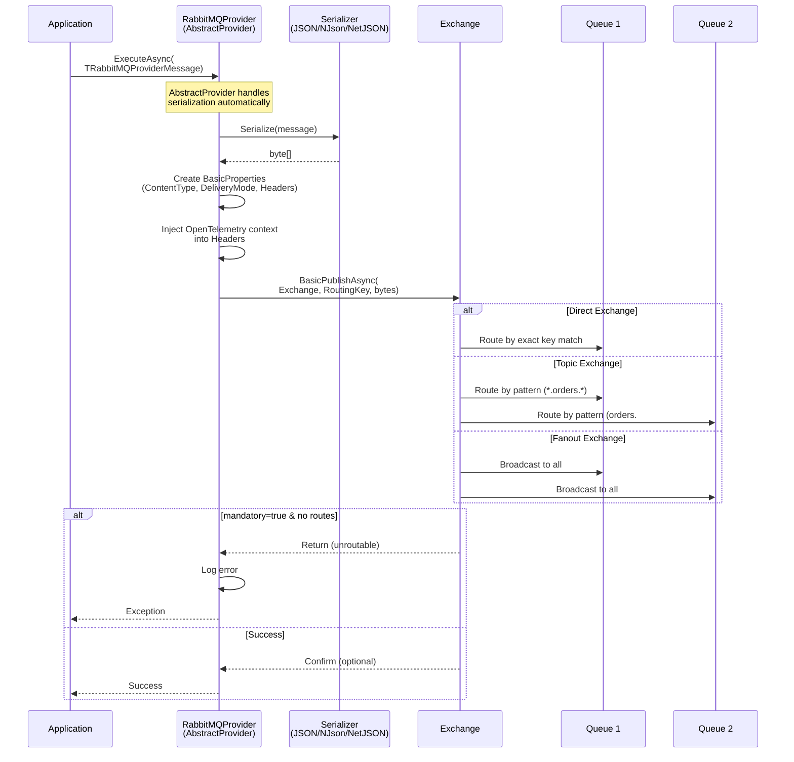

# ThunderPropagator.Providers.DotNet.RabbitMQ

> AMQP Message Publisher - Publishes outbound messages to RabbitMQ exchanges

[◂ Back to RabbitMQ](../README.md) | [◂ Back to Documentation](../../README.md)

## Contents

- [Overview](#overview)
- [Architecture](#architecture)
- [Files](#files)
- [Configuration](#configuration)
- [Dependencies](#dependencies)
- [API Reference](#api-reference)
- [Examples](#examples)
- [Advanced Patterns](#advanced-patterns)
- [See Also](#see-also)

## Overview

**Type**: Message Publisher (Provider)  
**Target Frameworks**: .NET 8, 9, 10  
**Package**: ThunderPropagator.Providers.DotNet.RabbitMQ

The RabbitMQ Provider is an **AbstractProvider** implementation that publishes messages to RabbitMQ exchanges using AMQP 0.9.1 protocol. It provides reliable message publishing with automatic serialization, connection management, OpenTelemetry integration, and publisher confirms support.

### Key Features

- ✅ **Exchange Routing**: Publish to direct, topic, fanout, or headers exchanges
- ✅ **Routing Keys**: Flexible message routing with pattern-based targeting
- ✅ **Persistent Messages**: Durable message delivery with disk persistence (DeliveryMode.Persistent)
- ✅ **Multiple Serialization Formats**: JSON, Newtonsoft.Json, NetJSON support
- ✅ **OpenTelemetry Integration**: Automatic W3C Trace Context propagation via message headers
- ✅ **Connection Pooling**: Efficient channel reuse across publish operations
- ✅ **Mandatory Publishing**: Ensures messages are routed to at least one queue
- ✅ **Automatic Serialization**: Message objects automatically serialized via AbstractProvider
- ✅ **Background Initialization**: Non-blocking connection setup
- ✅ **Error Handling**: Comprehensive exception logging and retry support

## Architecture



## Files

**Total**: 5 C# source files

| File | LOC | Responsibility |
|------|-----|----------------|
| [RabbitMQProvider.cs](../../../Feeviders/RabbitMQ/ThunderPropagator.Providers.DotNet.RabbitMQ/RabbitMQProvider.cs) | ~111 | Main provider implementation - manages connection, channel, message publishing, and OpenTelemetry context injection |
| [RabbitMQProviderConfiguration.cs](../../../Feeviders/RabbitMQ/ThunderPropagator.Providers.DotNet.RabbitMQ/RabbitMQProviderConfiguration.cs) | ~14 | Configuration class - extends RabbitMQFeeviderConfiguration with serialization settings |
| [RabbitMQProviderMessage.cs](../../../Feeviders/RabbitMQ/ThunderPropagator.Providers.DotNet.RabbitMQ/RabbitMQProviderMessage.cs) | ~8 | Abstract message base class - provides type safety for RabbitMQ messages |
| [RabbitMQProviderExtensions.cs](../../../Feeviders/RabbitMQ/ThunderPropagator.Providers.DotNet.RabbitMQ/RabbitMQProviderExtensions.cs) | ~27 | DI registration extension - AddRabbitMQProvider |
| [AssemblyInfo.cs](../../../Feeviders/RabbitMQ/ThunderPropagator.Providers.DotNet.RabbitMQ/AssemblyInfo.cs) | ~10 | Assembly metadata and internals visibility |

### Key Implementation Details

#### RabbitMQProvider.cs

```csharp
internal sealed class RabbitMQProvider<TRabbitMQProviderMessage, TRabbitMQProviderConfiguration>
    : AbstractProvider<TRabbitMQProviderMessage, TRabbitMQProviderConfiguration>
    where TRabbitMQProviderMessage : RabbitMQProviderMessage
    where TRabbitMQProviderConfiguration : RabbitMQProviderConfiguration
{
    private readonly TRabbitMQProviderConfiguration _rabbitMQProviderConfiguration;
    private IConnection? _connection;
    private IChannel? _channel;
    
    public RabbitMQProvider(
        TRabbitMQProviderConfiguration rabbitMQProviderConfiguration,
        IServiceProvider serviceProvider)
        : base(serviceProvider)
    {
        _rabbitMQProviderConfiguration = rabbitMQProviderConfiguration;
        
        // Initialize connection in background task
        _ = Task.Run(async () =>
        {
            try
            {
                (_connection, _channel) = await RabbitMQFeeviderConnectionFactory
                    .InitializeChannelAsync(
                        _rabbitMQProviderConfiguration, 
                        applicationLifetime.ApplicationStopping);
            }
            catch (Exception ex)
            {
                logger?.LogError(ex, "Failed to initialize RabbitMQ channel");
            }
        }, applicationLifetime.ApplicationStopping);
    }
    
    protected override async Task InternalExecuteAsync(
        byte[] bytes, 
        CancellationToken cancellationToken = default)
    {
        if (_channel is null)
            return;
        
        try
        {
            // Create message properties
            var channelProperties = new BasicProperties
            {
                ContentType = "application/json",
                DeliveryMode = DeliveryModes.Persistent  // Durable messages
            };
            
            // Inject OpenTelemetry context into headers
            if (Activity.Current?.Context is not null)
            {
                RabbitMQProviderExtensions.Propagator
                    .Inject(
                        new PropagationContext(Activity.Current.Context, Baggage.Current),
                        channelProperties,
                        (properties, key, value) =>
                        {
                            properties.Headers ??= new Dictionary<string, object?>();
                            properties.Headers[key] = value;
                        });
            }
            
            // Publish message
            await _channel.BasicPublishAsync(
                _rabbitMQProviderConfiguration.Exchange,
                _rabbitMQProviderConfiguration.RoutingKey,
                body: new ReadOnlyMemory<byte>(bytes),
                basicProperties: channelProperties,
                cancellationToken: cancellationToken,
                mandatory: true);  // Ensure message is routed
        }
        catch (Exception exception)
        {
            Logger.LogError(exception,
                "Error publishing message to queue {Queue}",
                _rabbitMQProviderConfiguration.Queue);
            throw;
        }
    }
    
    protected override async ValueTask DisposeManagedResourcesAsync()
    {
        if (_channel is not null)
            await _channel.CloseAsync();
        
        if (_connection is not null)
            await _connection.CloseAsync();
        
        if (_channel is not null)
            await _channel.DisposeAsync();
        
        if (_connection is not null)
            await _connection.DisposeAsync();
    }
}
```

**Key Design Decisions:**
- **Inherits AbstractProvider**: Automatic serialization and error handling
- **Background initialization**: Non-blocking connection setup in constructor
- **Persistent messages**: Default `DeliveryMode.Persistent` for durability
- **Mandatory publishing**: `mandatory: true` ensures messages are routed
- **OpenTelemetry**: Injects trace context into message headers
- **Resource cleanup**: Proper async disposal of connections and channels

## Configuration

### RabbitMQProviderConfiguration Properties

```csharp
public abstract class RabbitMQProviderConfiguration : RabbitMQFeeviderConfiguration, IAbstractProviderConfiguration
{
    // Provider-specific property
    public SerializerType SerializerType { get; set; }  // Json, NJson, NetJson
    
    // Inherited from RabbitMQFeeviderConfiguration (see SharedKernel docs)
    public string HostName { get; set; }            // RabbitMQ server hostname
    public int Port { get; set; }                   // AMQP port (default: 5672)
    public string? UserName { get; set; }           // Authentication username
    public string? Password { get; set; }           // Authentication password
    public string? VirtualHost { get; set; }        // Virtual host (default: "/")
    public string Queue { get; set; }               // Target queue name (for metadata)
    public string Exchange { get; set; }            // Target exchange (required)
    public string RoutingKey { get; set; }          // Routing key for message routing
    
    // Advanced connection properties
    public bool? AutomaticRecoveryEnabled { get; set; }  // Default: true
    public TimeSpan? NetworkRecoveryInterval { get; set; } // Default: 5s
    public TimeSpan? RequestedConnectionTimeout { get; set; }
    public TimeSpan? SocketReadTimeout { get; set; }
    public TimeSpan? SocketWriteTimeout { get; set; }
    public SslOption? Ssl { get; set; }             // TLS/SSL configuration
    public ushort? RequestedChannelMax { get; set; }
    public uint? RequestedFrameMax { get; set; }
    public TimeSpan? RequestedHeartbeat { get; set; }
    public string? ClientProvidedName { get; set; } // Client identification
    public Uri? Uri { get; set; }                   // Connection URI (alternative to individual settings)
}
```

### Configuration Example (appsettings.json)

```json
{
  "Messaging": {
    "RabbitMQ": {
      "Publisher": {
        "HostName": "rabbitmq.example.com",
        "Port": 5672,
        "UserName": "publisher-user",
        "Password": "secure-password",
        "VirtualHost": "/production",
        "Exchange": "orders-exchange",
        "RoutingKey": "order.created",
        "SerializerType": "Json",
        "AutomaticRecoveryEnabled": true,
        "NetworkRecoveryInterval": "00:00:05",
        "RequestedHeartbeat": "00:00:30",
        "ClientProvidedName": "OrderService-Publisher"
      }
    }
  }
}
```

## Dependencies

### NuGet Packages

| Package | Version | Purpose |
|---------|---------|---------|
| **ThunderPropagator.Providers.DotNet.SharedKernel** | 1.0.1-beta.2 | Base provider abstractions (AbstractProvider) |
| **ThunderPropagator.Feeviders.RabbitMQ.SharedKernel** | 1.0.1-beta.2 | Shared configuration and connection factory |
| **RabbitMQ.Client** | 7.0+ | Official RabbitMQ .NET client with async support |
| **OpenTelemetry.Api** | Latest | Distributed tracing primitives |
| **Microsoft.Extensions.Logging** | 8.0+ | Structured logging abstractions |
| **Microsoft.Extensions.DependencyInjection** | 8.0+ | Service registration |

### Project References

```xml
<ItemGroup>
  <ProjectReference Include="..\..\SharedKernel\ThunderPropagator.Providers.DotNet.SharedKernel\ThunderPropagator.Providers.DotNet.SharedKernel.csproj"/>
  <ProjectReference Include="..\ThunderPropagator.Feeviders.RabbitMQ.SharedKernel\ThunderPropagator.Feeviders.RabbitMQ.SharedKernel.csproj"/>
</ItemGroup>
```

## API Reference

### RabbitMQProvider Class

```csharp
internal sealed class RabbitMQProvider<TRabbitMQProviderMessage, TRabbitMQProviderConfiguration>
    : AbstractProvider<TRabbitMQProviderMessage, TRabbitMQProviderConfiguration>
    where TRabbitMQProviderMessage : RabbitMQProviderMessage
    where TRabbitMQProviderConfiguration : RabbitMQProviderConfiguration
```

**Properties:**
- `Logger` (ILogger): Structured logger instance (inherited)

**Public Methods:**
- `ExecuteAsync(TRabbitMQProviderMessage, CancellationToken)`: Publishes message (inherited from AbstractProvider)

**Protected Methods:**
- `InternalExecuteAsync(byte[], CancellationToken)`: Core publishing logic with OpenTelemetry injection
- `DisposeManagedResourcesAsync()`: Cleanup connections and channels

### RabbitMQProviderMessage Class

```csharp
public abstract class RabbitMQProviderMessage : FeederMessage
{
    // Inherit from this class to define your message types
}
```

**Example Implementation:**
```csharp
public class OrderCreatedMessage : RabbitMQProviderMessage
{
    public string OrderId { get; set; }
    public string CustomerId { get; set; }
    public decimal TotalAmount { get; set; }
    public List<OrderItem> Items { get; set; }
    public DateTime CreatedAt { get; set; }
}
```

### Extension Methods

#### AddRabbitMQProvider

```csharp
public static IServiceCollection AddRabbitMQProvider<TRabbitMQProviderMessage, TRabbitMQProviderConfiguration>(
    this IServiceCollection services,
    IConfigurationRoot configuration,
    string sectionName)
    where TRabbitMQProviderMessage : RabbitMQProviderMessage
    where TRabbitMQProviderConfiguration : RabbitMQProviderConfiguration, new()
```

**Purpose**: Registers RabbitMQ provider with DI container

**Parameters:**
- `services`: Service collection
- `configuration`: Application configuration
- `sectionName`: Configuration section path (e.g., "Messaging:RabbitMQ:Publisher")

**Example:**
```csharp
services.AddRabbitMQProvider<OrderCreatedMessage, OrderRabbitMQProviderConfig>(
    configuration, "Messaging:RabbitMQ:Publisher");
```

## Examples

### Example 1: Basic Message Publishing

```csharp
// 1. Define your message type
public class PaymentProcessedMessage : RabbitMQProviderMessage
{
    public string PaymentId { get; set; }
    public string OrderId { get; set; }
    public decimal Amount { get; set; }
    public string Currency { get; set; }
    public DateTime ProcessedAt { get; set; }
}

// 2. Define configuration
public class PaymentRabbitMQProviderConfiguration : RabbitMQProviderConfiguration
{
    // Inherits all RabbitMQ properties
}

// 3. Register provider in Program.cs
var builder = WebApplication.CreateBuilder(args);

builder.Services.AddRabbitMQProvider<PaymentProcessedMessage, PaymentRabbitMQProviderConfiguration>(
    builder.Configuration, "Messaging:RabbitMQ:Publisher");

var app = builder.Build();

// 4. Use provider in your service
public class PaymentService
{
    private readonly IProvider<PaymentProcessedMessage> _provider;
    private readonly ILogger<PaymentService> _logger;
    
    public PaymentService(
        IProvider<PaymentProcessedMessage> provider,
        ILogger<PaymentService> logger)
    {
        _provider = provider;
        _logger = logger;
    }
    
    public async Task ProcessPaymentAsync(
        PaymentRequest request, 
        CancellationToken cancellationToken)
    {
        // Process payment logic...
        var payment = await ChargeCustomerAsync(request);
        
        // Publish event
        var message = new PaymentProcessedMessage
        {
            PaymentId = payment.Id,
            OrderId = request.OrderId,
            Amount = request.Amount,
            Currency = request.Currency,
            ProcessedAt = DateTime.UtcNow
        };
        
        await _provider.ExecuteAsync(message, cancellationToken);
        
        _logger.LogInformation(
            "Published payment processed event for {PaymentId}",
            payment.Id);
    }
}

app.Run();
```

**appsettings.json:**
```json
{
  "Messaging": {
    "RabbitMQ": {
      "Publisher": {
        "HostName": "localhost",
        "Port": 5672,
        "UserName": "guest",
        "Password": "guest",
        "Exchange": "payments-exchange",
        "RoutingKey": "payment.processed",
        "SerializerType": "Json"
      }
    }
  }
}
```

### Example 2: Topic Exchange with Dynamic Routing Keys

```csharp
// Define message types with routing information
public class NotificationMessage : RabbitMQProviderMessage
{
    public string NotificationType { get; set; }  // email, sms, push
    public string Recipient { get; set; }
    public string Subject { get; set; }
    public string Body { get; set; }
}

// Service with dynamic routing
public class NotificationPublisher
{
    private readonly IProvider<NotificationMessage> _provider;
    
    public async Task SendEmailNotificationAsync(
        string recipient, 
        string subject, 
        string body)
    {
        var message = new NotificationMessage
        {
            NotificationType = "email",
            Recipient = recipient,
            Subject = subject,
            Body = body
        };
        
        // Message will be routed with "notification.email" key
        await _provider.ExecuteAsync(message);
    }
    
    public async Task SendSmsNotificationAsync(
        string phoneNumber, 
        string text)
    {
        var message = new NotificationMessage
        {
            NotificationType = "sms",
            Recipient = phoneNumber,
            Body = text
        };
        
        // Message will be routed with "notification.sms" key
        await _provider.ExecuteAsync(message);
    }
}
```

**appsettings.json:**
```json
{
  "Messaging": {
    "RabbitMQ": {
      "Publisher": {
        "Exchange": "notifications-topic",
        "RoutingKey": "notification.{NotificationType}",  // Template pattern
        "SerializerType": "Json"
      }
    }
  }
}
```

**Exchange Configuration (via Management UI or CLI):**
```bash
# Create topic exchange
rabbitmqadmin declare exchange name=notifications-topic type=topic durable=true

# Bind queues with patterns
rabbitmqadmin declare binding source=notifications-topic destination=email-queue routing_key="notification.email"
rabbitmqadmin declare binding source=notifications-topic destination=sms-queue routing_key="notification.sms"
rabbitmqadmin declare binding source=notifications-topic destination=all-notifications routing_key="notification.*"
```

### Example 3: Publishing with Custom Headers and Properties

```csharp
public class OrderCreatedMessage : RabbitMQProviderMessage
{
    public string OrderId { get; set; }
    public decimal Amount { get; set; }
    
    // Add custom metadata
    public Dictionary<string, object> CustomHeaders { get; set; }
}

public class OrderPublisher
{
    private readonly IProvider<OrderCreatedMessage> _provider;
    
    public async Task PublishOrderAsync(Order order)
    {
        var message = new OrderCreatedMessage
        {
            OrderId = order.Id,
            Amount = order.TotalAmount,
            CustomHeaders = new Dictionary<string, object>
            {
                { "x-priority", order.Amount > 1000 ? 10 : 5 },
                { "x-customer-tier", order.Customer.Tier },
                { "x-source-system", "order-api" }
            }
        };
        
        await _provider.ExecuteAsync(message);
    }
}
```

**Note**: Custom headers are automatically included in BasicProperties when using AbstractProvider.

### Example 4: Multi-Environment Configuration

```csharp
// Development environment
{
  "Messaging": {
    "RabbitMQ": {
      "Publisher": {
        "HostName": "localhost",
        "Port": 5672,
        "Exchange": "dev-orders-exchange"
      }
    }
  }
}

// Production environment (appsettings.Production.json)
{
  "Messaging": {
    "RabbitMQ": {
      "Publisher": {
        "HostName": "rabbitmq-cluster.production.svc.cluster.local",
        "Port": 5672,
        "UserName": "prod-publisher",
        "Password": "${RABBITMQ_PASSWORD}",  // From environment variable
        "VirtualHost": "/production",
        "Exchange": "orders-exchange",
        "Ssl": {
          "Enabled": true,
          "ServerName": "rabbitmq-cluster.production.svc.cluster.local",
          "Version": "Tls12"
        },
        "RequestedHeartbeat": "00:00:30",
        "ClientProvidedName": "OrderService-Pod-${POD_NAME}"
      }
    }
  }
}
```

### Example 5: Batch Publishing

```csharp
public class EventBatchPublisher
{
    private readonly IProvider<EventMessage> _provider;
    private readonly ILogger<EventBatchPublisher> _logger;
    
    public async Task PublishBatchAsync(
        IEnumerable<Event> events,
        CancellationToken cancellationToken)
    {
        var publishTasks = events.Select(async evt =>
        {
            var message = new EventMessage
            {
                EventId = evt.Id,
                EventType = evt.Type,
                Payload = evt.Data,
                Timestamp = evt.OccurredAt
            };
            
            try
            {
                await _provider.ExecuteAsync(message, cancellationToken);
                _logger.LogDebug("Published event {EventId}", evt.Id);
            }
            catch (Exception ex)
            {
                _logger.LogError(ex, 
                    "Failed to publish event {EventId}", evt.Id);
                throw;
            }
        });
        
        await Task.WhenAll(publishTasks);
        
        _logger.LogInformation(
            "Published batch of {Count} events", 
            events.Count());
    }
}
```

### Example 6: OpenTelemetry Context Propagation

```csharp
using System.Diagnostics;

public class TracedOrderPublisher
{
    private readonly IProvider<OrderCreatedMessage> _provider;
    private readonly ActivitySource _activitySource;
    
    public TracedOrderPublisher(
        IProvider<OrderCreatedMessage> provider)
    {
        _provider = provider;
        _activitySource = new ActivitySource("OrderService");
    }
    
    public async Task PublishOrderWithTracingAsync(Order order)
    {
        using var activity = _activitySource.StartActivity(
            "PublishOrderCreated",
            ActivityKind.Producer);
        
        activity?.SetTag("order.id", order.Id);
        activity?.SetTag("order.amount", order.TotalAmount);
        
        try
        {
            var message = new OrderCreatedMessage
            {
                OrderId = order.Id,
                Amount = order.TotalAmount,
                CreatedAt = DateTime.UtcNow
            };
            
            // Trace context automatically propagated to message headers
            await _provider.ExecuteAsync(message);
            
            activity?.SetStatus(ActivityStatusCode.Ok);
        }
        catch (Exception ex)
        {
            activity?.SetStatus(ActivityStatusCode.Error, ex.Message);
            activity?.RecordException(ex);
            throw;
        }
    }
}
```

**Trace context flows automatically:**
1. OrderService creates Activity
2. RabbitMQProvider injects context into message headers
3. RabbitMQFeeder extracts context from headers
4. Consumer processes with parent trace context

## Advanced Patterns

### Pattern 1: Fanout Broadcasting

Publish to all subscribers simultaneously:

```csharp
// Configuration
{
  "Exchange": "global-events-fanout",
  "RoutingKey": ""  // Ignored for fanout exchanges
}

// All queues bound to this exchange receive the message
// Use case: System-wide notifications, cache invalidation
```

### Pattern 2: Direct Exchange Routing

Exact routing key matching:

```csharp
// Configuration for different log levels
{
  "Exchange": "logs-direct",
  "RoutingKey": "error"  // Only error-queue receives these
}

// Publish critical logs to dedicated queue
await _errorProvider.ExecuteAsync(new LogMessage { Level = "error", Message = "Critical failure" });
```

### Pattern 3: RPC Pattern (Request/Reply)

```csharp
public class RpcPublisher
{
    private readonly IProvider<RpcRequestMessage> _provider;
    
    public async Task<RpcResponse> CallRemoteProcedureAsync(
        RpcRequest request,
        CancellationToken cancellationToken)
    {
        var correlationId = Guid.NewGuid().ToString();
        var replyQueueName = $"rpc-reply-{correlationId}";
        
        // Setup temporary reply queue (via RabbitMQ API)
        // Publish request with reply-to and correlation-id
        var message = new RpcRequestMessage
        {
            Payload = request.Data,
            CorrelationId = correlationId,
            ReplyTo = replyQueueName
        };
        
        await _provider.ExecuteAsync(message, cancellationToken);
        
        // Wait for response on reply queue (via separate feeder)
        // Return response
    }
}
```

**BasicProperties for RPC:**
```csharp
var properties = new BasicProperties
{
    CorrelationId = correlationId,
    ReplyTo = replyQueueName,
    Expiration = "60000"  // 60 seconds TTL
};
```

### Pattern 4: Publisher Confirms (Guaranteed Delivery)

```csharp
// Enable publisher confirms in channel setup
await _channel.ConfirmSelectAsync(cancellationToken);

// Publish message
await _channel.BasicPublishAsync(exchange, routingKey, body, properties);

// Wait for confirm
await _channel.WaitForConfirmsOrDieAsync(cancellationToken);
```

**Note**: Current implementation doesn't wait for confirms. To add:
1. Extend RabbitMQProviderConfiguration with `EnablePublisherConfirms`
2. Override `InternalExecuteAsync` to call `WaitForConfirmsOrDieAsync`

### Pattern 5: Message Priority

```csharp
public class PriorityOrderPublisher
{
    private readonly IProvider<OrderMessage> _provider;
    
    public async Task PublishOrderAsync(Order order)
    {
        var message = new OrderMessage
        {
            OrderId = order.Id,
            Priority = order.Amount > 10000 ? 10 : 
                       order.Amount > 1000 ? 5 : 1
        };
        
        await _provider.ExecuteAsync(message);
    }
}
```

**Queue configuration:**
```bash
# Create priority queue
rabbitmqadmin declare queue name=priority-orders durable=true arguments='{"x-max-priority":10}'
```

### Pattern 6: Message Expiration (TTL)

```json
{
  "Exchange": "temp-notifications",
  "RoutingKey": "notification.temp",
  "Arguments": {
    "x-message-ttl": 300000  // 5 minutes
  }
}
```

Messages auto-expire if not consumed within TTL.

### Pattern 7: Alternate Exchange (Unroutable Messages)

```bash
# Declare exchange with alternate
rabbitmqadmin declare exchange name=orders-exchange type=topic durable=true arguments='{"alternate-exchange":"unrouted-orders"}'

# Unroutable messages go to alternate exchange
rabbitmqadmin declare exchange name=unrouted-orders type=fanout
rabbitmqadmin declare queue name=unrouted-queue durable=true
rabbitmqadmin declare binding source=unrouted-orders destination=unrouted-queue
```

## Performance Considerations

### Best Practices

1. **Connection Pooling**: Reuse connections, create channels per thread
   ```csharp
   // Provider automatically manages connection pooling
   // One connection, multiple channels
   ```

2. **Batch Publishing**: Use transactions or publisher confirms for batches
   ```csharp
   // Enable confirms for batch
   await channel.ConfirmSelectAsync();
   foreach (var message in batch)
       await provider.ExecuteAsync(message);
   await channel.WaitForConfirmsAsync();
   ```

3. **Persistent Messages**: Use only when durability is required
   ```csharp
   DeliveryMode = DeliveryModes.Persistent  // Default in provider
   ```

4. **Message Size**: Keep messages small (<128KB recommended)
   ```csharp
   // Split large payloads into chunks
   // Or store in blob storage and send reference
   ```

5. **Serialization**: Use NetJSON for high-throughput scenarios
   ```json
   {
     "SerializerType": "NetJson"  // Fastest serialization
   }
   ```

### Throughput Optimization

- **Async operations**: All RabbitMQ operations are async
- **Connection recovery**: Automatic reconnection on failures
- **Heartbeats**: Keep connections alive through load balancers
- **Channel pooling**: Consider channel pool for very high throughput

### Monitoring

```csharp
// Add custom telemetry
using var activity = activitySource.StartActivity("PublishToRabbitMQ");
activity?.SetTag("exchange", config.Exchange);
activity?.SetTag("routing_key", config.RoutingKey);

await provider.ExecuteAsync(message);

activity?.SetTag("message_size", messageBytes.Length);
```

## Troubleshooting

### Common Issues

**1. Connection Failed**
```
Error: "None of the specified endpoints were reachable"
```
- Verify `HostName` and `Port`
- Check network connectivity: `telnet rabbitmq.example.com 5672`
- Ensure RabbitMQ is running

**2. Authentication Failed**
```
Error: "ACCESS_REFUSED - Login was refused"
```
- Verify `UserName` and `Password`
- Check user permissions: `rabbitmqctl list_user_permissions publisher-user`
- Ensure user has write access to exchange

**3. Exchange Not Found**
```
Error: "NOT_FOUND - no exchange 'xxx' in vhost '/'"
```
- Declare exchange before publishing
- Check `VirtualHost` matches exchange location
- Verify exchange name spelling

**4. Messages Not Routed (Mandatory=True)**
```
Error: "NO_ROUTE - message not routed"
```
- Verify exchange-to-queue bindings
- Check routing key matches binding pattern
- Use alternate exchange for unroutable messages

**5. Slow Publishing**
```
High latency on ExecuteAsync calls
```
- Enable publisher confirms only if needed
- Check network latency to broker
- Increase connection timeout settings
- Consider using transactions for batches

**6. Memory Leaks**
```
Provider memory grows over time
```
- Ensure proper disposal (provider implements IAsyncDisposable)
- Don't create new provider instances per message
- Register as singleton or scoped

## See Also

### Related Documentation

- [RabbitMQ System Overview](../README.md) - Complete RabbitMQ integration guide
- [Feeders.RabbitMQ](../Feeders.RabbitMQ/README.md) - Message consumption
- [Feeviders.RabbitMQ.SharedKernel](../Feeviders.RabbitMQ.SharedKernel/README.md) - Shared utilities and configuration
- [Providers.DotNet.SharedKernel](../../SharedKernel/Providers.DotNet.SharedKernel/README.md) - Base provider abstractions

### External Resources

- [RabbitMQ .NET Client Documentation](https://www.rabbitmq.com/dotnet-api-guide.html)
- [AMQP 0.9.1 Protocol Specification](https://www.rabbitmq.com/resources/specs/amqp0-9-1.pdf)
- [Publisher Confirms](https://www.rabbitmq.com/confirms.html#publisher-confirms)
- [Exchange Types](https://www.rabbitmq.com/tutorials/amqp-concepts.html#exchanges)
- [Routing Patterns](https://www.rabbitmq.com/tutorials/tutorial-four-dotnet.html)

### Framework Documentation

- [ThunderPropagator Documentation](../../README.md)
- [OpenTelemetry Integration](../../README.md#observability)
- [Serialization Options](../../README.md#serialization)
