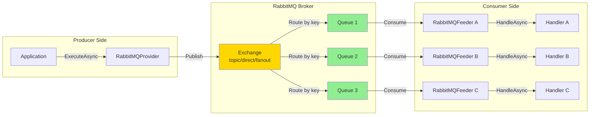

# RabbitMQ Messaging Integration

> AMQP-based message broker integration - Reliable message queuing with exchanges, queues, and routing

[◂ Back to Documentation](../README.md)

## Contents

- [Overview](#overview)
- [Architecture](#architecture)
- [Projects](#projects)
- [Key Features](#key-features)
- [Quick Start](#quick-start)
- [Use Cases](#use-cases)
- [See Also](#see-also)

## Overview

The **RabbitMQ integration** provides comprehensive support for AMQP 0.9.1 protocol, enabling reliable message queuing with advanced routing capabilities. RabbitMQ excels at traditional enterprise messaging patterns with guaranteed delivery, flexible routing via exchanges, and robust durability options.

### Why RabbitMQ?

- **Proven reliability**: Battle-tested in mission-critical systems
- **Flexible routing**: Topic, fanout, direct, and header exchanges
- **Message guarantees**: Publisher confirms and consumer acknowledgments
- **Management tooling**: Rich web UI and CLI tools
- **Multi-protocol**: AMQP, MQTT, STOMP, WebSocket support
- **Clustering**: High availability and horizontal scaling

## Architecture



## Projects

| Project | Type | Description | Documentation |
|---------|------|-------------|---------------|
| **Feeders.RabbitMQ** | Consumer | Push-based feeder using AsyncEventingBasicConsumer for AMQP message consumption | [README](Feeders.RabbitMQ/README.md) (956 lines) |
| **Providers.DotNet.RabbitMQ** | Publisher | Message publisher with exchange routing and delivery confirmations | [README](Providers.DotNet.RabbitMQ/README.md) (976 lines) |
| **Feeviders.RabbitMQ.SharedKernel** | Utilities | Connection factory, configuration helpers, and AMQP utilities | [README](Feeviders.RabbitMQ.SharedKernel/README.md) (1,002 lines) |

## Key Features

### Feeder (Consumer) Features

- ✅ **AsyncEventingBasicConsumer**: Non-blocking async message handling
- ✅ **Auto-reconnection**: Automatic recovery from connection failures
- ✅ **Queue binding**: Dynamic queue-to-exchange binding with routing keys
- ✅ **Prefetch control**: QoS settings for controlled message flow
- ✅ **Manual ACKs**: Optional manual acknowledgment for guaranteed processing
- ✅ **OpenTelemetry**: W3C Trace Context propagation via message properties
- ✅ **Health monitoring**: Real-time connection and consumption health reporting

### Provider (Publisher) Features

- ✅ **Exchange routing**: Publish to topic, direct, fanout, or header exchanges
- ✅ **Routing keys**: Flexible message routing with pattern matching
- ✅ **Message properties**: Custom headers, correlation IDs, reply-to queues
- ✅ **Publisher confirms**: Optional delivery acknowledgments
- ✅ **Persistent messages**: Durable message delivery with disk persistence
- ✅ **Connection pooling**: Efficient channel reuse
- ✅ **Serialization**: JSON, NJson, NetJSON support

## Quick Start

### Installation

```bash
# Add GitHub Packages source
dotnet nuget add source https://nuget.pkg.github.com/KiarashMinoo/index.json \
  -n github -u YOUR_USERNAME -p YOUR_GITHUB_TOKEN --store-password-in-clear-text

# Install RabbitMQ packages
dotnet add package ThunderPropagator.Feeders.RabbitMQ
dotnet add package ThunderPropagator.Providers.DotNet.RabbitMQ
```

### Configuration

```json
{
  "Messaging": {
    "RabbitMQ": {
      "Orders": {
        "IsEnabled": true,
        "HostName": "localhost",
        "Port": 5672,
        "UserName": "guest",
        "Password": "guest",
        "VirtualHost": "/",
        "Exchange": "orders-exchange",
        "ExchangeType": "topic",
        "Queue": "order-processing-queue",
        "RoutingKey": "orders.created",
        "PrefetchCount": 10,
        "AutomaticRecoveryEnabled": true,
        "SerializerType": "Json"
      }
    }
  }
}
```

### Registration

```csharp
// Program.cs
using ThunderPropagator.Feeders.RabbitMQ;
using ThunderPropagator.Providers.DotNet.RabbitMQ;

// Consumer
services.AddRabbitMQFeeder<OrderChannel, OrderMessage, OrderFeederConfig>(
    configuration, "Messaging:RabbitMQ:Orders");

// Publisher
services.AddRabbitMQProvider<OrderMessage, OrderProviderConfig>(
    configuration, "Messaging:RabbitMQ:Orders");
```

### Usage Example

```csharp
// Message definition
public class OrderMessage : RabbitMQFeederMessage
{
    public string OrderId { get; set; } = default!;
    public decimal Amount { get; set; }
    public string Status { get; set; } = "Pending";
}

// Configuration
public class OrderFeederConfig : RabbitMQFeederConfiguration
{
    public OrderFeederConfig()
    {
        Exchange = "orders-exchange";
        ExchangeType = "topic";
        Queue = "order-processing";
        RoutingKey = "orders.*";
        PrefetchCount = 10;
        SerializerType = SerializerType.Json;
    }
}

// Handler
public class OrderMessageHandler : IFeederHandler<OrderChannel, OrderMessage>
{
    public async Task HandleAsync(OrderChannel channel, 
        FeederReceivedMessage<OrderMessage> receivedMessage, 
        CancellationToken cancellationToken)
    {
        var order = receivedMessage.Message;
        
        // Extract routing key from metadata
        var routingKey = receivedMessage.Metadata?["RoutingKey"]?.ToString();
        
        Console.WriteLine($"Processing order {order.OrderId} from route: {routingKey}");
        await ProcessOrderAsync(order, cancellationToken);
    }
    
    private async Task ProcessOrderAsync(OrderMessage order, CancellationToken ct)
    {
        // Business logic here
        await Task.Delay(100, ct); // Simulate work
    }
}

// Publishing
public class OrderService
{
    private readonly IProvider<OrderMessage> _provider;
    
    public async Task CreateOrderAsync(Order order)
    {
        var message = new OrderMessage
        {
            OrderId = order.Id,
            Amount = order.Total,
            Status = "Created"
        };
        
        // Routing key determines which queues receive the message
        message["RoutingKey"] = $"orders.created.{order.Region}";
        
        await _provider.ExecuteAsync(message);
    }
}
```

## Use Cases

### 1. Work Queue Pattern

**Scenario**: Distribute tasks among multiple workers

```csharp
// Configuration: Multiple consumers on same queue
{
  "Queue": "image-processing-queue",
  "PrefetchCount": 1,  // One message at a time per worker
  "Exchange": "tasks",
  "RoutingKey": "images.process"
}

// Workers automatically load-balance
// Worker A: Processing image-001
// Worker B: Processing image-002
// Worker C: Processing image-003
```

### 2. Topic Exchange Routing

**Scenario**: Route messages based on hierarchical topics

```csharp
// Publisher
message["RoutingKey"] = "logs.error.payment";  // Goes to error and payment handlers
message["RoutingKey"] = "logs.info.auth";      // Goes to info and auth handlers

// Consumer A: logs.error.*     (receives all errors)
// Consumer B: logs.*.payment   (receives all payment logs)
// Consumer C: logs.#           (receives everything)
```

### 3. RPC Pattern

**Scenario**: Request-reply messaging

```csharp
// Request
var correlationId = Guid.NewGuid().ToString();
message["CorrelationId"] = correlationId;
message["ReplyTo"] = "rpc-reply-queue";
await _provider.ExecuteAsync(message);

// Response handler
public async Task HandleAsync(OrderChannel channel, 
    FeederReceivedMessage<ResponseMessage> receivedMessage, 
    CancellationToken cancellationToken)
{
    var correlationId = receivedMessage.Metadata?["CorrelationId"];
    // Match request with response using correlationId
}
```

### 4. Priority Queue

**Scenario**: Process high-priority messages first

```csharp
// Configuration
{
  "Queue": "priority-orders",
  "QueueArguments": {
    "x-max-priority": 10
  }
}

// Publishing
message["Priority"] = 9;  // High priority
await _provider.ExecuteAsync(message);
```

### 5. Dead Letter Queues

**Scenario**: Handle failed message processing

```csharp
// Configuration
{
  "Queue": "orders-queue",
  "QueueArguments": {
    "x-dead-letter-exchange": "dlx-exchange",
    "x-dead-letter-routing-key": "failed-orders",
    "x-message-ttl": 60000  // 60 seconds
  }
}

// Messages that aren't acknowledged within TTL go to DLQ
```

## Exchange Types

### Topic Exchange

```csharp
// Pattern matching with * (one word) and # (zero or more words)
"logs.*.critical"   // Matches: logs.app.critical, logs.db.critical
"logs.#"            // Matches: logs, logs.app, logs.app.critical
"*.payment"         // Matches: orders.payment, refunds.payment
```

### Direct Exchange

```csharp
// Exact routing key match
"order-created"     // Only matches queues bound to "order-created"
"payment-processed" // Only matches queues bound to "payment-processed"
```

### Fanout Exchange

```csharp
// Broadcasts to all bound queues (routing key ignored)
// Use case: Notifications, cache invalidation, audit logs
```

### Headers Exchange

```csharp
// Route based on message headers instead of routing key
message["x-match"] = "all";  // Match all headers
message["format"] = "json";
message["type"] = "order";
```

## Performance Characteristics

| Metric | Value | Notes |
|--------|-------|-------|
| **Throughput** | 10K-50K msg/sec | Single node, varies by message size |
| **Latency** | 1-10ms | Network-dependent |
| **Message Size** | Max 512MB | Practical limit ~1MB for performance |
| **Durability** | Configurable | Persistent messages slower but guaranteed |
| **Ordering** | Per queue | FIFO within single queue |
| **Clustering** | Yes | HA with mirrored queues |

## Troubleshooting

### Connection Issues

```csharp
// Enable detailed logging
"Logging": {
  "LogLevel": {
    "ThunderPropagator.Feeders.RabbitMQ": "Debug",
    "RabbitMQ.Client": "Information"
  }
}

// Check AutomaticRecoveryEnabled
config.AutomaticRecoveryEnabled = true;
config.NetworkRecoveryInterval = TimeSpan.FromSeconds(10);
```

### Message Acknowledgment

```csharp
// Manual ACK for guaranteed processing
config.AutoAck = false;  // Default in ThunderPropagator

// Message acknowledged automatically after successful HandleAsync
// On exception, message is negatively acknowledged and requeued
```

### Prefetch Tuning

```csharp
// Low prefetch: Better load balancing, lower throughput
config.PrefetchCount = 1;

// High prefetch: Higher throughput, potential uneven distribution
config.PrefetchCount = 100;

// Recommended: 10-20 for most scenarios
config.PrefetchCount = 10;
```

## See Also

### Project Documentation
- [Feeders.RabbitMQ](Feeders.RabbitMQ/README.md) - Consumer implementation
- [Providers.DotNet.RabbitMQ](Providers.DotNet.RabbitMQ/README.md) - Publisher implementation
- [Feeviders.RabbitMQ.SharedKernel](Feeviders.RabbitMQ.SharedKernel/README.md) - Shared utilities

### Related Systems
- [Kafka](../Kafka/README.md) - Event streaming alternative
- [NATS](../NATS/README.md) - Cloud-native messaging
- [ActiveMQ](../ActiveMQ/README.md) - JMS-compatible broker
- [All Systems](../README.md#systems)

### External Resources
- [RabbitMQ Official Documentation](https://www.rabbitmq.com/documentation.html)
- [AMQP 0-9-1 Protocol Spec](https://www.rabbitmq.com/resources/specs/amqp0-9-1.pdf)
- [RabbitMQ.Client GitHub](https://github.com/rabbitmq/rabbitmq-dotnet-client)
- [RabbitMQ Tutorials](https://www.rabbitmq.com/getstarted.html)

---

**Next**: Explore [Feeders.RabbitMQ](Feeders.RabbitMQ/README.md) for consumer implementation details or [Providers.DotNet.RabbitMQ](Providers.DotNet.RabbitMQ/README.md) for publisher integration.
