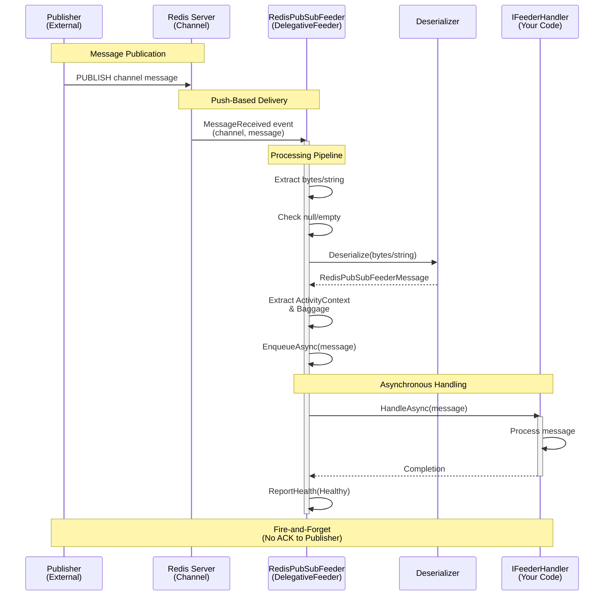

# ThunderPropagator.Feeders.RedisPubSub

> Redis Pub/Sub Message Consumer - Receives and processes inbound messages from Redis channels with pattern subscriptions

[◂ Back to Redis Pub/Sub](../README.md) | [◂ Back to Documentation](../../README.md)

## Contents

- [Overview](#overview)
- [Architecture](#architecture)
- [Files](#files)
- [Configuration](#configuration)
- [Dependencies](#dependencies)
- [API Reference](#api-reference)
- [Examples](#examples)
- [Advanced Patterns](#advanced-patterns)
- [Best Practices](#best-practices)
- [Performance Optimization](#performance-optimization)
- [Troubleshooting](#troubleshooting)
- [See Also](#see-also)

## Overview

**Type**: Message Consumer (Feeder)  
**Target Frameworks**: .NET 8, 9, 10  
**Package**: ThunderPropagator.Feeders.RedisPubSub

The Redis Pub/Sub Feeder is a **DelegativeFeeder** implementation that subscribes to Redis channels using StackExchange.Redis, providing real-time message consumption with pattern matching, automatic deserialization, health monitoring, and distributed tracing support. It operates in a push-based model where Redis actively delivers messages to the subscriber as they are published.

### Key Features

- ✅ **Push-Based Consumption**: Redis actively pushes messages to subscriber (DelegativeFeeder)
- ✅ **Channel Subscriptions**: Subscribe to specific channels by name
- ✅ **Pattern Matching**: Subscribe with glob-style patterns (`channel:*`, `events:user:*`)
- ✅ **Binary & Text Support**: Handles both byte[] and string payloads efficiently
- ✅ **Multiple Serialization**: JSON, Newtonsoft.Json, NetJSON support
- ✅ **Connection Multiplexing**: Single Redis connection for all subscriptions
- ✅ **Automatic Reconnection**: StackExchange.Redis handles network failures
- ✅ **OpenTelemetry Integration**: W3C Trace Context and Baggage propagation
- ✅ **Health Monitoring**: Real-time connection health reporting
- ✅ **Fire-and-Forget**: No acknowledgments or retries (at-most-once delivery)
- ✅ **Message Enrichment**: Optional C# script-based message transformation

### When to Use This Feeder

| Use Case | Recommendation |
|----------|----------------|
| **Real-Time Notifications** | ✅ Instant push notifications to subscribers |
| **Cache Invalidation** | ✅ Broadcast cache clear events across servers |
| **Live Dashboards** | ✅ Real-time metric updates |
| **Event Broadcasting** | ✅ Publish-subscribe pattern |
| **Guaranteed Delivery** | ❌ Use Redis Streams or Kafka instead |
| **Message History** | ❌ Use Redis Streams for replay capability |
| **Load Balancing** | ❌ Use Redis Streams consumer groups |

## Architecture



### Component Responsibilities

| Component | Responsibility |
|-----------|----------------|
| **RedisPubSubFeeder** | Subscribes to Redis channel, dispatches messages to thread pool |
| **IConnectionMultiplexer** | Manages Redis connection with multiplexing and reconnection |
| **ISubscriber** | StackExchange.Redis subscription API |
| **ProcessMessageAsync** | Lightweight handler for MessageReceived event |
| **Deserializer** | Converts bytes/string to strongly-typed message |
| **IFeederHandler** | Application-specific message processing logic |

### Feeder Type: DelegativeFeeder

Unlike `IterativeFeeder` (pull-based), `DelegativeFeeder` operates in a **push model**:

1. **Event Registration**: Subscribe to Redis channel, register MessageReceived event
2. **Push Notification**: Redis pushes messages to subscriber callback
3. **Thread Pool Dispatch**: Lightweight handler dispatches processing to thread pool
4. **Asynchronous Processing**: ReceiveAsync processes message asynchronously
5. **No Iteration**: No explicit ReceiveAsync() loop (handled by Redis client library)

## Files

| File | Lines | Description |
|------|-------|-------------|
| **RedisPubSubFeeder.cs** | 103 | Main feeder implementation (DelegativeFeeder) |
| **RedisPubSubFeederMessage.cs** | 12 | Abstract base class for inbound messages |
| **RedisPubSubFeederConfiguration.cs** | 26 | Feeder configuration properties |
| **RedisPubSubFeederExtensions.cs** | 45 | DI registration extensions |

### File: RedisPubSubFeeder.cs

**Location**: `Feeviders/RedisPubSub/ThunderPropagator.Feeders.RedisPubSub/RedisPubSubFeeder.cs`

**Purpose**: Core feeder class that subscribes to Redis channels and processes incoming messages.

**Key Methods**:

```csharp
internal sealed class RedisPubSubFeeder<TChannel, TRedisPubSubFeederMessage, TRedisPubSubFeederConfiguration> 
    : DelegativeFeeder<TChannel, TRedisPubSubFeederMessage, TRedisPubSubFeederConfiguration>
{
    // Constructor: Initialize connection, subscribe to channel
    public RedisPubSubFeeder(TChannel channel, 
        TRedisPubSubFeederConfiguration redisPubSubFeederConfiguration, 
        IFeederHandler<TChannel, TRedisPubSubFeederMessage> feederHandler, 
        IServiceProvider serviceProvider);
    
    // Message handler: Dispatches processing to thread pool
    private async Task ProcessMessageAsync(RedisChannel _, RedisValue message);
    
    // Cleanup: Unsubscribe and close connection
    protected override async Task StopAsync(CancellationToken cancellationToken = default);
    
    // Resource disposal
    protected override ValueTask DisposeManagedResourcesAsync();
}
```

**Initialization Flow**:
1. Create `IConnectionMultiplexer` from connection string
2. Get `ISubscriber` instance
3. Create `RedisChannel` with pattern mode
4. Subscribe with lightweight lambda: `(channel, msg) => _ = ProcessMessageAsync(channel, msg)`
5. Set health check name and tags

**Processing Flow**:
1. Receive `MessageReceived` event from Redis
2. Check if message is null/empty
3. Attempt binary deserialization (prefer bytes to avoid string allocation)
4. Fallback to string deserialization if binary fails
5. Extract ActivityContext and Baggage for tracing
6. Call `ReceiveAsync()` to enqueue message for handler
7. Report health status

**Performance Optimizations**:
- **Binary Path Preference**: Attempts `(byte[]?)message` before `ToString()` to avoid encoding allocations
- **Fire-and-Forget Dispatch**: `_ = ProcessMessageAsync()` uses discard pattern for async-void semantics
- **Thread Pool Integration**: Processing moved off Redis callback thread immediately

### File: RedisPubSubFeederMessage.cs

**Location**: `Feeviders/RedisPubSub/ThunderPropagator.Feeders.RedisPubSub/RedisPubSubFeederMessage.cs`

**Purpose**: Abstract base class for Redis Pub/Sub feeder messages.

```csharp
namespace ThunderPropagator.Feeders.RedisPubSub
{
    public abstract class RedisPubSubFeederMessage : FeederMessage
    {
        // Inherits:
        // - Dictionary<string, object> for metadata storage
        // - Serialization support
    }
}
```

**Usage**:
```csharp
public class NotificationMessage : RedisPubSubFeederMessage
{
    public string Title { get; set; }
    public string Body { get; set; }
    public DateTime Timestamp { get; set; }
}
```

### File: RedisPubSubFeederConfiguration.cs

**Location**: `Feeviders/RedisPubSub/ThunderPropagator.Feeders.RedisPubSub/RedisPubSubFeederConfiguration.cs`

**Purpose**: Configuration properties for Redis Pub/Sub subscriptions.

```csharp
public abstract class RedisPubSubFeederConfiguration : AbstractFeederConfiguration
{
    // Redis connection string (host:port or Sentinel/Cluster)
    public string ConnectionString { get; set; }
    
    // Channel name or pattern
    public string Channel { get; set; }
    
    // Pattern mode: Auto, Literal, or Pattern
    public RedisChannel.PatternMode PatternMode { get; set; }
}
```

### File: RedisPubSubFeederExtensions.cs

**Location**: `Feeviders/RedisPubSub/ThunderPropagator.Feeders.RedisPubSub/RedisPubSubFeederExtensions.cs`

**Purpose**: Dependency injection registration methods.

```csharp
public static class RedisPubSubFeederExtensions
{
    public static IServiceCollection AddRedisPubSubFeeder<TChannel, TMessage, TConfig>(
        this IServiceCollection services,
        IConfigurationRoot configurationRoot,
        string sectionName)
        where TChannel : class, IChannel
        where TMessage : RedisPubSubFeederMessage
        where TConfig : RedisPubSubFeederConfiguration;
}
```

## Configuration

### Configuration Properties

| Property | Type | Required | Default | Description |
|----------|------|----------|---------|-------------|
| **ConnectionString** | string | ✅ Yes | - | Redis connection string (single-node, Sentinel, or Cluster) |
| **Channel** | string | ✅ Yes | - | Channel name or pattern (e.g., `events`, `log:*`) |
| **PatternMode** | PatternMode | ❌ No | Auto | Subscription mode: Auto, Literal, or Pattern |
| **SerializerType** | SerializerType | ❌ No | NJson | Deserialization format (NJson, Json, Newtonsoft) |
| **IsEnabled** | bool | ❌ No | true | Enable/disable feeder |
| **Id** | Guid | ❌ No | New GUID | Unique feeder instance identifier |
| **EnrichmentScript** | string | ❌ No | null | C# script for message transformation |
| **MetadataReferences** | string[] | ❌ No | null | Assemblies for enrichment script |

### Pattern Mode Options

```csharp
public enum PatternMode
{
    Auto = 0,     // Detect pattern automatically (contains *, ?, [)
    Literal = 1,  // Exact channel name match
    Pattern = 2   // Force pattern subscription (PSUBSCRIBE)
}
```

**Auto Mode** (Recommended):
- Detects `*`, `?`, `[` in channel name
- Uses SUBSCRIBE for literal names
- Uses PSUBSCRIBE for patterns

**Literal Mode**:
- Always uses SUBSCRIBE
- Treats channel as exact string
- Example: `events:*` subscribes to literal channel named "events:*"

**Pattern Mode**:
- Always uses PSUBSCRIBE
- Evaluates glob patterns
- Example: `events:*` matches `events:login`, `events:logout`

### Connection String Formats

#### 1. Single Redis Instance

```json
{
  "ConnectionString": "localhost:6379"
}
```

**Options**:
```
localhost:6379,password=secret,ssl=true,abortConnect=false
```

#### 2. Redis Sentinel (High Availability)

```json
{
  "ConnectionString": "sentinel1:26379,sentinel2:26379,serviceName=mymaster,password=secret"
}
```

**Features**:
- Automatic failover to replica
- Read replicas for load distribution
- Pub/Sub messages not replicated (manual resubscribe)

#### 3. Redis Cluster

```json
{
  "ConnectionString": "node1:6379,node2:6379,node3:6379"
}
```

**Limitations**:
- Pattern subscriptions broadcast to all nodes (performance impact)
- Prefer Sentinel for Pub/Sub workloads

### Configuration Example

**appsettings.json**
```json
{
  "Messaging": {
    "RedisPubSub": {
      "NotificationFeeder": {
        "IsEnabled": true,
        "ConnectionString": "localhost:6379,password=secret,ssl=true",
        "Channel": "notifications:*",
        "PatternMode": "Auto",
        "SerializerType": "NJson"
      },
      "MetricsFeeder": {
        "IsEnabled": true,
        "ConnectionString": "sentinel1:26379,sentinel2:26379,serviceName=mymaster",
        "Channel": "metrics",
        "PatternMode": "Literal",
        "SerializerType": "Json"
      }
    }
  }
}
```

**Configuration Class**
```csharp
public class NotificationFeederConfiguration : RedisPubSubFeederConfiguration
{
    // Inherits ConnectionString, Channel, PatternMode
}
```

**Registration**
```csharp
services.AddRedisPubSubFeeder<NotificationChannel, NotificationMessage, NotificationFeederConfiguration>(
    configuration, "Messaging:RedisPubSub:NotificationFeeder");
```

## Dependencies

### NuGet Packages

| Package | Version | Purpose |
|---------|---------|---------|
| **StackExchange.Redis** | 2.6+ | Redis client library (connection multiplexing, pub/sub) |
| **ThunderPropagator** | 1.0+ | Core streaming framework |
| **ThunderPropagator.BuildingBlocks** | 1.0+ | Serialization and utilities |
| **OpenTelemetry.Api** | 1.7+ | Distributed tracing |
| **Microsoft.Extensions.DependencyInjection** | 8.0+ | Dependency injection |
| **Microsoft.Extensions.Logging** | 8.0+ | Logging abstractions |
| **Microsoft.Extensions.Diagnostics.HealthChecks** | 8.0+ | Health monitoring |

### StackExchange.Redis Features Used

- **IConnectionMultiplexer**: Connection pooling and multiplexing
- **ISubscriber**: Pub/Sub subscription API
- **RedisChannel**: Channel representation with pattern mode
- **RedisValue**: Binary/string value abstraction
- **CommandFlags.FireAndForget**: Low-latency publishing

### Runtime Requirements

- **.NET 8, 9, or 10** runtime
- **Redis Server 5.0+** (Pub/Sub available in all versions)
- **Network Connectivity**: TCP/IP to Redis port 6379 (or custom port)

## API Reference

### RedisPubSubFeeder Class

```csharp
internal sealed class RedisPubSubFeeder<TChannel, TRedisPubSubFeederMessage, TRedisPubSubFeederConfiguration>
    : DelegativeFeeder<TChannel, TRedisPubSubFeederMessage, TRedisPubSubFeederConfiguration>
    where TChannel : class, IChannel
    where TRedisPubSubFeederMessage : RedisPubSubFeederMessage
    where TRedisPubSubFeederConfiguration : RedisPubSubFeederConfiguration
{
    // Properties
    protected override string HealthName { get; }        // Health check identifier
    protected override string[] HealthTags { get; }      // Tags for health monitoring
    
    // Methods
    private async Task ProcessMessageAsync(RedisChannel channel, RedisValue message);
    protected override async Task StopAsync(CancellationToken cancellationToken = default);
    protected override ValueTask DisposeManagedResourcesAsync();
}
```

### IFeederHandler Interface

```csharp
public interface IFeederHandler<TChannel, TMessage>
    where TChannel : IChannel
    where TMessage : FeederMessage
{
    ValueTask HandleAsync(TMessage message, CancellationToken cancellationToken = default);
}
```

**Implementation Example**:
```csharp
public class NotificationHandler : IFeederHandler<NotificationChannel, NotificationMessage>
{
    private readonly ILogger<NotificationHandler> _logger;
    private readonly IHubContext<NotificationHub> _hub;

    public NotificationHandler(ILogger<NotificationHandler> logger, IHubContext<NotificationHub> hub)
    {
        _logger = logger;
        _hub = hub;
    }

    public async ValueTask HandleAsync(NotificationMessage message, CancellationToken cancellationToken)
    {
        _logger.LogInformation("Received notification: {Title}", message.Title);

        // Broadcast to SignalR clients
        await _hub.Clients.All.SendAsync("ReceiveNotification", message, cancellationToken);
    }
}
```

### DI Registration Methods

```csharp
// Method 1: Configuration-based registration
public static IServiceCollection AddRedisPubSubFeeder<TChannel, TMessage, TConfig>(
    this IServiceCollection services,
    IConfigurationRoot configurationRoot,
    string sectionName)
    where TChannel : class, IChannel
    where TMessage : RedisPubSubFeederMessage
    where TConfig : RedisPubSubFeederConfiguration;

// Usage
services.AddRedisPubSubFeeder<NotificationChannel, NotificationMessage, NotificationFeederConfiguration>(
    configuration, "Messaging:RedisPubSub:NotificationFeeder");
```

## Examples

### Example 1: Basic Channel Subscription

**Scenario**: Subscribe to single channel for real-time notifications.

**Configuration** (appsettings.json):
```json
{
  "Messaging": {
    "RedisPubSub": {
      "ConnectionString": "localhost:6379",
      "Channel": "notifications",
      "PatternMode": "Literal",
      "SerializerType": "NJson"
    }
  }
}
```

**Message Definition**:
```csharp
public class NotificationMessage : RedisPubSubFeederMessage
{
    public string Title { get; set; }
    public string Body { get; set; }
    public string UserId { get; set; }
    public DateTime Timestamp { get; set; }
}

public class NotificationFeederConfiguration : RedisPubSubFeederConfiguration { }
```

**Handler**:
```csharp
public class NotificationHandler : IFeederHandler<NotificationChannel, NotificationMessage>
{
    private readonly ILogger<NotificationHandler> _logger;

    public NotificationHandler(ILogger<NotificationHandler> logger)
    {
        _logger = logger;
    }

    public async ValueTask HandleAsync(NotificationMessage message, CancellationToken ct)
    {
        _logger.LogInformation("Notification for user {UserId}: {Title}", 
            message.UserId, message.Title);

        // Process notification
        await SendPushNotificationAsync(message);
    }

    private async Task SendPushNotificationAsync(NotificationMessage message)
    {
        // Implementation
    }
}
```

**Registration**:
```csharp
services.AddRedisPubSubFeeder<NotificationChannel, NotificationMessage, NotificationFeederConfiguration>(
    configuration, "Messaging:RedisPubSub");
```

**Expected Output**:
```
[12:00:00 INF] RedisPubSubFeeder/NotificationChannel on Channel notifications has configured.
[12:00:05 INF] Notification for user user123: New message received
```

### Example 2: Pattern Matching (Multiple Channels)

**Scenario**: Subscribe to all event channels with pattern `events:*`.

**Configuration**:
```json
{
  "ConnectionString": "localhost:6379",
  "Channel": "events:*",
  "PatternMode": "Pattern",
  "SerializerType": "NJson"
}
```

**Message**:
```csharp
public class EventMessage : RedisPubSubFeederMessage
{
    public string EventType { get; set; }
    public string EntityId { get; set; }
    public Dictionary<string, string> Metadata { get; set; }
}
```

**Handler**:
```csharp
public class EventHandler : IFeederHandler<EventChannel, EventMessage>
{
    public async ValueTask HandleAsync(EventMessage message, CancellationToken ct)
    {
        // This handler receives messages from:
        // - events:login
        // - events:logout
        // - events:purchase
        // - events:* (any event channel)

        switch (message.EventType)
        {
            case "login":
                await HandleLoginAsync(message);
                break;
            case "logout":
                await HandleLogoutAsync(message);
                break;
            default:
                await HandleGenericEventAsync(message);
                break;
        }
    }
}
```

**Matching Channels**:
```
✅ events:login     → Matches
✅ events:logout    → Matches
✅ events:purchase  → Matches
❌ logs:info        → No match
❌ events:user:123  → No match (pattern is not hierarchical)
```

### Example 3: Cache Invalidation

**Scenario**: Invalidate distributed caches across multiple servers.

**Configuration**:
```json
{
  "ConnectionString": "localhost:6379",
  "Channel": "cache:invalidate",
  "PatternMode": "Literal",
  "SerializerType": "Json"
}
```

**Message**:
```csharp
public class CacheInvalidationMessage : RedisPubSubFeederMessage
{
    public string CacheKey { get; set; }
    public string[] Patterns { get; set; }
    public DateTime Timestamp { get; set; }
}
```

**Handler**:
```csharp
public class CacheInvalidationHandler : IFeederHandler<CacheChannel, CacheInvalidationMessage>
{
    private readonly IMemoryCache _cache;
    private readonly ILogger<CacheInvalidationHandler> _logger;

    public CacheInvalidationHandler(IMemoryCache cache, ILogger<CacheInvalidationHandler> logger)
    {
        _cache = cache;
        _logger = logger;
    }

    public async ValueTask HandleAsync(CacheInvalidationMessage message, CancellationToken ct)
    {
        if (message.CacheKey != null)
        {
            _cache.Remove(message.CacheKey);
            _logger.LogInformation("Invalidated cache key: {CacheKey}", message.CacheKey);
        }

        if (message.Patterns != null)
        {
            foreach (var pattern in message.Patterns)
            {
                await InvalidateByPatternAsync(pattern);
            }
        }
    }

    private async Task InvalidateByPatternAsync(string pattern)
    {
        // Invalidate all keys matching pattern (custom implementation)
        var matchingKeys = GetMatchingKeys(pattern);
        foreach (var key in matchingKeys)
        {
            _cache.Remove(key);
        }
    }

    private IEnumerable<string> GetMatchingKeys(string pattern)
    {
        // Implementation
        return Enumerable.Empty<string>();
    }
}
```

**Usage**:
```csharp
// Publisher (different server)
await _provider.ExecuteAsync(new CacheInvalidationProviderMessage
{
    CacheKey = "user:123",
    Patterns = new[] { "session:*" },
    Timestamp = DateTime.UtcNow
});

// All servers receive invalidation message instantly
```

### Example 4: Sentinel Failover

**Scenario**: High-availability setup with automatic failover.

**Configuration**:
```json
{
  "ConnectionString": "sentinel1:26379,sentinel2:26379,sentinel3:26379,serviceName=mymaster,password=secret,abortConnect=false",
  "Channel": "events",
  "PatternMode": "Literal",
  "SerializerType": "NJson"
}
```

**Features**:
- **Automatic Failover**: StackExchange.Redis detects master failure and reconnects to promoted replica
- **Reconnection**: `abortConnect=false` allows reconnection attempts
- **Resubscription**: Library automatically resubscribes after reconnection

**Handler**:
```csharp
public class ResilientEventHandler : IFeederHandler<EventChannel, EventMessage>
{
    private readonly ILogger<ResilientEventHandler> _logger;

    public ResilientEventHandler(ILogger<ResilientEventHandler> logger)
    {
        _logger = logger;
    }

    public async ValueTask HandleAsync(EventMessage message, CancellationToken ct)
    {
        // No special handling needed - StackExchange.Redis handles reconnection
        _logger.LogInformation("Received event: {EventType}", message.EventType);
        await ProcessEventAsync(message);
    }

    private async Task ProcessEventAsync(EventMessage message)
    {
        // Business logic
    }
}
```

**Expected Behavior**:
1. Normal operation: Subscribe to master
2. Master failure: Sentinel detects failure
3. Failover: Sentinel promotes replica to master
4. Reconnection: StackExchange.Redis connects to new master
5. Resubscription: Automatically resubscribes to channel
6. Message loss: Messages published during failover are lost (fire-and-forget)

### Example 5: Multiple Serialization Formats

**Scenario**: Different channels use different serialization formats.

**Configuration (JSON)**:
```json
{
  "JsonChannel": {
    "ConnectionString": "localhost:6379",
    "Channel": "json-events",
    "SerializerType": "Json"
  },
  "NJsonChannel": {
    "ConnectionString": "localhost:6379",
    "Channel": "njson-events",
    "SerializerType": "NJson"
  },
  "NewtonsoftChannel": {
    "ConnectionString": "localhost:6379",
    "Channel": "newtonsoft-events",
    "SerializerType": "Newtonsoft"
  }
}
```

**Registration**:
```csharp
// System.Text.Json (fastest, best .NET integration)
services.AddRedisPubSubFeeder<JsonChannel, JsonEventMessage, JsonFeederConfiguration>(
    configuration, "Messaging:RedisPubSub:JsonChannel");

// NetJSON (highest throughput)
services.AddRedisPubSubFeeder<NJsonChannel, NJsonEventMessage, NJsonFeederConfiguration>(
    configuration, "Messaging:RedisPubSub:NJsonChannel");

// Newtonsoft.Json (best compatibility)
services.AddRedisPubSubFeeder<NewtonsoftChannel, NewtonsoftEventMessage, NewtonsoftFeederConfiguration>(
    configuration, "Messaging:RedisPubSub:NewtonsoftChannel");
```

**Performance Comparison**:
| Serializer | Throughput | Latency | Use Case |
|------------|------------|---------|----------|
| **NJson** | Highest | Lowest | High-performance messaging |
| **Json** | High | Low | Standard .NET applications |
| **Newtonsoft** | Medium | Medium | Legacy system compatibility |

### Example 6: Health Monitoring

**Scenario**: Monitor Redis Pub/Sub connection health.

**Configuration**:
```json
{
  "ConnectionString": "localhost:6379",
  "Channel": "health-check",
  "PatternMode": "Literal",
  "SerializerType": "NJson"
}
```

**Health Check Registration**:
```csharp
services.AddHealthChecks()
    .AddCheck<RedisPubSubHealthCheck>("redis_pubsub");
```

**Custom Health Check**:
```csharp
public class RedisPubSubHealthCheck : IHealthCheck
{
    private readonly IConnectionMultiplexer _redis;

    public RedisPubSubHealthCheck(IConnectionMultiplexer redis)
    {
        _redis = redis;
    }

    public async Task<HealthCheckResult> CheckHealthAsync(
        HealthCheckContext context, 
        CancellationToken cancellationToken = default)
    {
        try
        {
            if (_redis.IsConnected)
            {
                var server = _redis.GetServer(_redis.GetEndPoints()[0]);
                var pingLatency = await server.PingAsync();

                return HealthCheckResult.Healthy(
                    $"Redis Pub/Sub connected (ping: {pingLatency.TotalMilliseconds}ms)");
            }
            else
            {
                return HealthCheckResult.Unhealthy("Redis disconnected");
            }
        }
        catch (Exception ex)
        {
            return HealthCheckResult.Unhealthy("Redis health check failed", ex);
        }
    }
}
```

**Feeder Health Reporting**:
```csharp
// RedisPubSubFeeder reports health automatically
HealthName = $"feeder_{nameof(RedisPubSub)}_{_redisPubSubFeederConfiguration.Channel}";
HealthTags = [nameof(RedisPubSub), _redisPubSubFeederConfiguration.Channel];

// Reports Healthy on successful message processing
ReportHealth(HealthStatus.Healthy);

// Reports Unhealthy on exceptions
ReportHealth(HealthStatus.Unhealthy, exception);
```

**Health Endpoint Output**:
```json
{
  "status": "Healthy",
  "totalDuration": "00:00:00.0234567",
  "entries": {
    "feeder_RedisPubSub_notifications": {
      "status": "Healthy",
      "description": "Last message processed successfully",
      "tags": ["RedisPubSub", "notifications"]
    },
    "redis_pubsub": {
      "status": "Healthy",
      "description": "Redis Pub/Sub connected (ping: 0.5ms)"
    }
  }
}
```

### Example 7: OpenTelemetry Integration

**Scenario**: Distributed tracing across microservices via Pub/Sub.

**Configuration**:
```csharp
// OpenTelemetry setup
services.AddOpenTelemetry()
    .WithTracing(builder => builder
        .AddAspNetCoreInstrumentation()
        .AddRedisInstrumentation()
        .AddSource("ThunderPropagator.*")
        .AddJaegerExporter());
```

**Message with Tracing**:
```csharp
public class TracedEventMessage : RedisPubSubFeederMessage
{
    public string EventType { get; set; }
    public string UserId { get; set; }
    public DateTime Timestamp { get; set; }
}
```

**Handler**:
```csharp
public class TracedEventHandler : IFeederHandler<EventChannel, TracedEventMessage>
{
    private readonly ActivitySource _activitySource;
    private readonly ILogger<TracedEventHandler> _logger;

    public TracedEventHandler(ILogger<TracedEventHandler> logger)
    {
        _logger = logger;
        _activitySource = new ActivitySource("ThunderPropagator.Feeders.RedisPubSub");
    }

    public async ValueTask HandleAsync(TracedEventMessage message, CancellationToken ct)
    {
        using var activity = _activitySource.StartActivity("ProcessEvent", ActivityKind.Consumer);
        activity?.SetTag("event.type", message.EventType);
        activity?.SetTag("user.id", message.UserId);

        _logger.LogInformation("Processing event {EventType} for user {UserId}", 
            message.EventType, message.UserId);

        await ProcessEventAsync(message);

        activity?.SetStatus(ActivityStatusCode.Ok);
    }

    private async Task ProcessEventAsync(TracedEventMessage message)
    {
        // Business logic
    }
}
```

**Trace Propagation**:
```
Publisher (Service A)
  └─> Activity: PublishEvent
      └─> Redis PUBLISH
          └─> Subscriber (Service B)
              └─> Activity: ProcessEvent (parent: PublishEvent)
```

**TraceContext Propagation**:
```csharp
// Publisher automatically adds ActivityContext to message
if (Activity.Current?.Context is not null)
    feederMessage.TryAdd(nameof(ActivityContext), Activity.Current.Context.ToNJsonBytes());

// Feeder extracts ActivityContext
var activityContext = message[nameof(ActivityContext)] is ActivityContext ac ? ac : default;
await ReceiveAsync(message, activityContext, baggage).ConfigureAwait(false);
```

## Advanced Patterns

### 1. Pattern Subscriptions

**Problem**: Subscribe to multiple related channels without individual subscriptions.

**Solution**: Use glob-style patterns.

**Example**:
```json
{
  "Channel": "events:user:*",
  "PatternMode": "Pattern"
}
```

**Matching**:
```
✅ events:user:login
✅ events:user:logout
✅ events:user:register
❌ events:admin:action (different prefix)
```

**Performance Consideration**:
- Pattern subscriptions evaluated on **every PUBLISH**
- Avoid overly broad patterns (e.g., `*:*:*`)
- Limit to <100 matching channels for optimal performance

### 2. Channel Sharding

**Problem**: Single channel becomes bottleneck with high throughput.

**Solution**: Shard messages across multiple channels.

**Implementation**:
```csharp
// Publisher
public class ShardedPublisher
{
    private readonly IProvider<EventProviderMessage>[] _providers;
    private int _nextShard = 0;

    public async Task PublishAsync(EventProviderMessage message)
    {
        var shard = Interlocked.Increment(ref _nextShard) % _providers.Length;
        await _providers[shard].ExecuteAsync(message);
    }
}
```

**Configuration**:
```json
{
  "Shard0": { "Channel": "events:shard0" },
  "Shard1": { "Channel": "events:shard1" },
  "Shard2": { "Channel": "events:shard2" },
  "Shard3": { "Channel": "events:shard3" }
}
```

**Subscriber Pattern**:
```json
{
  "Channel": "events:shard*",
  "PatternMode": "Pattern"
}
```

**Benefits**:
- Increased throughput (parallel publishing)
- Load distribution across Redis CPU cores
- Reduced contention on single channel

### 3. Sentinel High Availability

**Problem**: Single Redis instance is single point of failure.

**Solution**: Redis Sentinel for automatic failover.

**Configuration**:
```json
{
  "ConnectionString": "sentinel1:26379,sentinel2:26379,sentinel3:26379,serviceName=mymaster,password=secret,abortConnect=false,connectRetry=3,connectTimeout=5000"
}
```

**Failover Behavior**:
1. Sentinel detects master failure (quorum-based)
2. Sentinel promotes replica to master
3. StackExchange.Redis detects disconnection
4. Library reconnects to new master (automatic)
5. Resubscribes to channels (automatic)
6. **Message loss**: Messages published during failover window are lost

**Monitoring**:
```csharp
_connectionMultiplexer.ConnectionFailed += (sender, args) =>
{
    _logger.LogWarning("Redis connection failed: {EndPoint} - {FailureType}", 
        args.EndPoint, args.FailureType);
};

_connectionMultiplexer.ConnectionRestored += (sender, args) =>
{
    _logger.LogInformation("Redis connection restored: {EndPoint}", args.EndPoint);
};
```

### 4. Cluster Mode Topology

**Problem**: Single Redis node limits scalability.

**Solution**: Redis Cluster for horizontal scaling.

**Configuration**:
```json
{
  "ConnectionString": "node1:6379,node2:6379,node3:6379,node4:6379,node5:6379,node6:6379"
}
```

**Cluster Limitations**:
- **Pattern subscriptions**: Broadcast to **all nodes** (not sharded)
- **Channel mapping**: Pub/Sub not mapped to hash slots
- **Performance**: Pattern subscriptions have O(N) node overhead

**Recommendation**: Use Sentinel for Pub/Sub workloads, Cluster for data operations.

### 5. Reconnection Logic

**Problem**: Handle network failures gracefully.

**Solution**: StackExchange.Redis automatic reconnection.

**Configuration**:
```json
{
  "ConnectionString": "localhost:6379,abortConnect=false,connectRetry=5,connectTimeout=5000,keepAlive=60"
}
```

**Options**:
- `abortConnect=false`: Don't throw on initial connection failure
- `connectRetry=5`: Retry 5 times before giving up
- `connectTimeout=5000`: 5-second timeout per attempt
- `keepAlive=60`: TCP keep-alive every 60 seconds

**Event Handlers**:
```csharp
_connectionMultiplexer.ConnectionFailed += OnConnectionFailed;
_connectionMultiplexer.ConnectionRestored += OnConnectionRestored;
_connectionMultiplexer.ErrorMessage += OnErrorMessage;

private void OnConnectionFailed(object sender, ConnectionFailedEventArgs e)
{
    _logger.LogError("Redis connection failed: {EndPoint} - {FailureType} - {Exception}", 
        e.EndPoint, e.FailureType, e.Exception?.Message);
    
    // Report unhealthy
    ReportHealth(HealthStatus.Unhealthy, e.Exception);
}

private void OnConnectionRestored(object sender, ConnectionFailedEventArgs e)
{
    _logger.LogInformation("Redis connection restored: {EndPoint}", e.EndPoint);
    
    // Resubscription happens automatically
    ReportHealth(HealthStatus.Healthy);
}
```

### 6. Backpressure Handling

**Problem**: Subscriber overwhelmed by high message rate.

**Solution**: Throttle processing with rate limiting.

**Implementation**:
```csharp
public class ThrottledHandler : IFeederHandler<EventChannel, EventMessage>
{
    private readonly SemaphoreSlim _semaphore = new SemaphoreSlim(100); // Max 100 concurrent
    private readonly ILogger<ThrottledHandler> _logger;

    public ThrottledHandler(ILogger<ThrottledHandler> logger)
    {
        _logger = logger;
    }

    public async ValueTask HandleAsync(EventMessage message, CancellationToken ct)
    {
        await _semaphore.WaitAsync(ct);
        try
        {
            await ProcessEventAsync(message);
        }
        finally
        {
            _semaphore.Release();
        }
    }

    private async Task ProcessEventAsync(EventMessage message)
    {
        // Business logic
    }
}
```

**Alternative: Rate Limiting**:
```csharp
private readonly RateLimiter _rateLimiter = new SlidingWindowRateLimiter(
    new SlidingWindowRateLimiterOptions
    {
        Window = TimeSpan.FromSeconds(1),
        PermitLimit = 1000
    });

public async ValueTask HandleAsync(EventMessage message, CancellationToken ct)
{
    using var lease = await _rateLimiter.AcquireAsync(permitCount: 1, ct);
    if (!lease.IsAcquired)
    {
        _logger.LogWarning("Rate limit exceeded, dropping message");
        return;
    }

    await ProcessEventAsync(message);
}
```

**Note**: Redis Pub/Sub does not support consumer-level backpressure. Messages are delivered immediately or lost.

### 7. Binary Payload Optimization

**Problem**: String serialization adds encoding overhead.

**Solution**: Prefer binary payloads.

**Implementation**:
```csharp
// RedisPubSubFeeder prefers binary path
try
{
    // Attempt to get raw bytes - avoids encoding allocations
    var bytes = (byte[]?)message;
    if (bytes is not null && bytes.Length > 0)
    {
        redisPubSubFeederMessage = Deserialize(bytes);
    }
}
catch
{
    // Fall back to string path
    var strMessage = message.ToString();
    redisPubSubFeederMessage = Deserialize(strMessage);
}
```

**Publisher Side**:
```csharp
// Publish binary
var bytes = SerializeToBytes(message);
await _subscriber.PublishAsync(_redisChannel, bytes, CommandFlags.FireAndForget);

// Avoid string path
// var json = JsonSerializer.Serialize(message);
// await _subscriber.PublishAsync(_redisChannel, json); ❌ Forces encoding
```

**Performance**:
- Binary: 0 encoding allocations
- String: 2 encoding allocations (UTF-8 encode + decode)

## Best Practices

### 1. Channel Naming Conventions

```
✅ Good: Hierarchical, domain-driven
- events:user:login
- metrics:api:requests
- cache:invalidate:products

❌ Bad: Generic, flat
- events
- data
- messages
```

**Pattern**: `{domain}:{entity}:{action}`

### 2. Message Size Optimization

```csharp
// ✅ Good: Compact JSON (100 bytes)
{
  "t": "login",
  "u": 123,
  "ts": 1640000000
}

// ❌ Bad: Verbose JSON (500 bytes)
{
  "EventType": "UserLoginEvent",
  "UserId": 123,
  "Timestamp": "2021-12-20T12:00:00Z",
  "Metadata": {
    "IpAddress": "192.168.1.1",
    "UserAgent": "Mozilla/5.0..."
  }
}
```

**Target**: <1KB per message

### 3. Error Handling

```csharp
public async ValueTask HandleAsync(EventMessage message, CancellationToken ct)
{
    try
    {
        await ProcessEventAsync(message);
    }
    catch (Exception ex)
    {
        _logger.LogError(ex, "Failed to process message");
        
        // No retry - Pub/Sub is fire-and-forget
        // Consider dead-letter queue for critical messages
    }
}
```

**Rule**: Handle errors locally, no automatic retries.

### 4. Connection Reuse

```csharp
// ✅ Good: Singleton ConnectionMultiplexer
services.AddSingleton<IConnectionMultiplexer>(sp =>
{
    var connectionString = configuration["Redis:ConnectionString"];
    var options = ConfigurationOptions.Parse(connectionString);
    options.AbortOnConnectFail = false;
    return ConnectionMultiplexer.Connect(options);
});

// ❌ Bad: New connection per subscriber
// Each AddRedisPubSubFeeder creates new connection
```

**Rule**: One ConnectionMultiplexer per application.

### 5. Pattern Subscription Limits

```csharp
// ✅ Good: Specific pattern
PSUBSCRIBE events:user:*      // ~10 channels

// ⚠️ Caution: Broad pattern
PSUBSCRIBE events:*:*          // ~1000 channels

// ❌ Bad: Wildcard
PSUBSCRIBE *                   // All channels (CPU overhead)
```

**Rule**: Limit patterns to <100 matching channels.

## Performance Optimization

### Throughput Optimization

| Technique | Impact | Implementation |
|-----------|--------|----------------|
| **Binary Payloads** | +20% | Publish byte[] instead of string |
| **Connection Multiplexing** | +50% | Single ConnectionMultiplexer |
| **Fire-and-Forget** | +30% | Use CommandFlags.FireAndForget |
| **Message Batching** | +100% | Batch small messages |

### Latency Optimization

| Technique | Reduction | Implementation |
|-----------|-----------|----------------|
| **Local Redis** | -90% | Deploy Redis on localhost |
| **Pipeline Commands** | -50% | Use transaction batching |
| **Binary Serialization** | -30% | Avoid string encoding |

### Memory Optimization

```csharp
// ✅ Use ArrayPool for buffers
var buffer = ArrayPool<byte>.Shared.Rent(bufferSize);
try
{
    // Process buffer
}
finally
{
    ArrayPool<byte>.Shared.Return(buffer);
}

// ✅ Prefer ValueTask over Task
public async ValueTask HandleAsync(EventMessage message, CancellationToken ct)
{
    // Avoids Task allocation for synchronous paths
}
```

## Troubleshooting

### Problem 1: Messages Not Received

**Symptoms**: Subscriber receives no messages.

**Diagnosis**:
```bash
# Check active subscriptions
redis-cli CLIENT LIST | grep -i subscribe

# Publish test message
redis-cli PUBLISH test-channel "test message"

# Monitor all Pub/Sub activity
redis-cli --csv psubscribe '*'
```

**Solutions**:
- Verify channel name matches (case-sensitive)
- Check subscriber is active before publishing
- Ensure pattern mode is correct (Literal vs Pattern)
- Validate ConnectionString

### Problem 2: Connection Failures

**Symptoms**: Intermittent disconnections.

**Diagnosis**:
```csharp
_connectionMultiplexer.ConnectionFailed += (sender, args) =>
{
    _logger.LogError("Connection failed: {EndPoint} - {FailureType}", 
        args.EndPoint, args.FailureType);
};
```

**Solutions**:
- Enable keep-alive: `keepAlive=60`
- Increase connect retry: `connectRetry=5`
- Set `abortConnect=false`
- Check network stability

### Problem 3: High Latency

**Symptoms**: >10ms publish-to-delivery latency.

**Diagnosis**:
```bash
redis-cli --latency
redis-cli --intrinsic-latency 100
```

**Solutions**:
- Use local Redis instance
- Reduce message size (<1KB)
- Check Redis CPU usage
- Limit pattern subscriptions

### Problem 4: Memory Leaks

**Symptoms**: Increasing memory usage.

**Diagnosis**:
```bash
redis-cli INFO memory
```

**Solutions**:
- Ensure ConnectionMultiplexer is singleton
- Dispose feeders on shutdown
- Avoid creating new connections per subscription

## See Also

- [Redis Pub/Sub Overview](../README.md)
- [Providers.DotNet.RedisPubSub](../Providers.DotNet.RedisPubSub/README.md) - Publisher implementation
- [SharedKernel](../../SharedKernel/README.md) - Core abstractions
- [Redis Pub/Sub Documentation](https://redis.io/docs/manual/pubsub/)
- [StackExchange.Redis Documentation](https://stackexchange.github.io/StackExchange.Redis/)
- [Redis Sentinel](https://redis.io/docs/manual/sentinel/)
- [Redis Streams vs Pub/Sub](https://redis.io/docs/manual/data-types/streams/)
