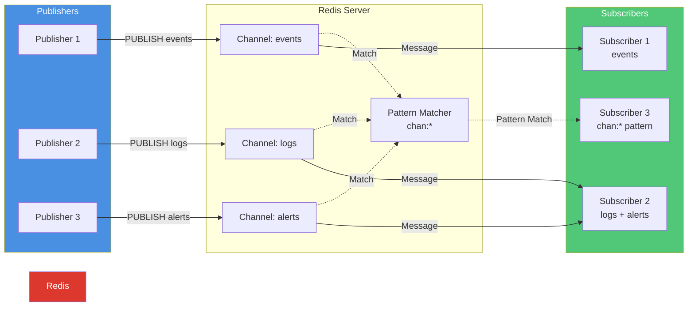
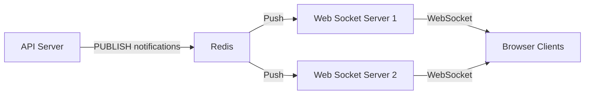
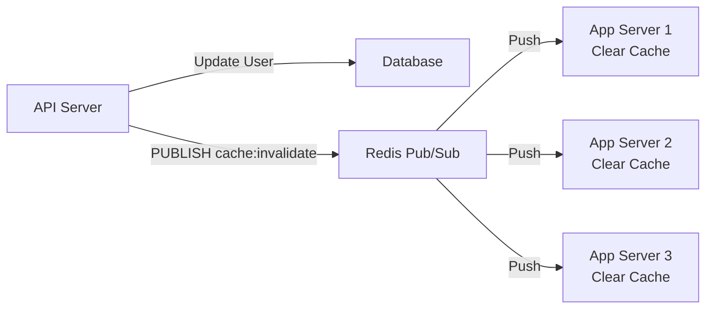

# Redis Pub/Sub

> In-memory messaging with pattern-based subscriptions and sub-millisecond latency

[◂ Back to Documentation](../README.md)

## Contents

- [Overview](#overview)
- [Architecture](#architecture)
- [Key Features](#key-features)
- [Performance Characteristics](#performance-characteristics)
- [Comparison](#comparison)
- [Quick Start](#quick-start)
- [Projects](#projects)
- [Use Cases](#use-cases)
- [Deployment Patterns](#deployment-patterns)
- [Best Practices](#best-practices)
- [Troubleshooting](#troubleshooting)
- [See Also](#see-also)

## Overview

**Redis Pub/Sub** is a lightweight, in-memory messaging pattern implemented in Redis that enables real-time message broadcasting from publishers to multiple subscribers. Unlike traditional message queues, Redis Pub/Sub operates in a **fire-and-forget** manner with no message persistence, making it ideal for ephemeral, high-throughput, low-latency communication scenarios where message delivery guarantees are not critical.

### What is Redis Pub/Sub?

Redis Pub/Sub is a publish-subscribe messaging paradigm where:
- **Publishers** send messages to named channels
- **Subscribers** listen to one or more channels
- Messages are delivered to all active subscribers in real-time
- No message persistence (messages are lost if no subscribers are active)
- Pattern-based subscriptions using glob-style wildcards

### Why Use Redis Pub/Sub?

| Advantage | Description |
|-----------|-------------|
| **Sub-Millisecond Latency** | In-memory operations deliver messages in microseconds |
| **Simplicity** | Minimal setup, no complex configuration |
| **Pattern Matching** | Subscribe to multiple channels with `chan:*` or `event:>` patterns |
| **Scalability** | 1M+ msg/sec throughput on modern hardware |
| **Broadcasting** | Automatic message delivery to all subscribers |
| **Zero Persistence** | No disk I/O overhead for ephemeral data |

### When NOT to Use Redis Pub/Sub

❌ **Message Persistence Required**: Use Redis Streams instead  
❌ **Guaranteed Delivery**: No acknowledgments or retries  
❌ **Consumer Groups**: Use Redis Streams for load balancing  
❌ **Message History**: No replay capability  
❌ **Exactly-Once Semantics**: At-most-once delivery only

## Architecture



### Component Flow

1. **Publisher** → Executes `PUBLISH channel message`
2. **Redis Server** → Routes message to matching channel subscribers
3. **Pattern Matcher** → Evaluates pattern subscriptions (PSUBSCRIBE)
4. **Subscribers** → Receive messages in real-time
5. **No Persistence** → Messages not stored after delivery

### Message Flow Characteristics

- **Push-Based**: Redis pushes messages to subscribers
- **Fire-and-Forget**: No acknowledgments or delivery confirmation
- **No Buffering**: Messages lost if no subscribers are active
- **Ordering**: FIFO per channel, no global ordering
- **Concurrency**: Multiple subscribers receive messages simultaneously

## Key Features

### 1. Channel-Based Messaging

```
PUBLISH events "{\"type\":\"user_login\",\"userId\":123}"
```

Channels are:
- Named identifiers (strings)
- Created dynamically on first publish
- Deleted automatically when no subscribers exist
- Case-sensitive

### 2. Pattern Subscriptions

Redis supports glob-style pattern matching:

| Pattern | Matches | Example |
|---------|---------|---------|
| `chan:*` | Single-level wildcard | `chan:events`, `chan:logs` |
| `event:*:critical` | Middle wildcard | `event:login:critical`, `event:logout:critical` |
| `log:*` | Prefix matching | `log:error`, `log:info`, `log:debug` |

**Note**: Redis patterns use `*` (not `>` like NATS) and match only channel names, not hierarchical structures.

### 3. Multiple Subscribers

A single channel can have:
- Unlimited subscribers
- Each receives a copy of every message
- No load balancing (all receive all messages)
- No consumer groups

### 4. Binary and Text Support

Redis Pub/Sub supports:
- **Binary payloads**: Raw byte arrays
- **Text messages**: UTF-8 encoded strings
- **JSON serialization**: Application-level encoding
- **Protocol buffers**: Binary serialization

### 5. Connection Management

StackExchange.Redis provides:
- **Connection multiplexing**: Single connection for pub/sub and data operations
- **Automatic reconnection**: Handles network failures
- **Heartbeat monitoring**: Detects stale connections
- **Subscription recovery**: Re-subscribes after reconnection

## Performance Characteristics

### Throughput

| Scenario | Messages/sec | Notes |
|----------|-------------|-------|
| **Single Publisher** | 100K - 200K | Single-threaded PUBLISH |
| **Multiple Publishers** | 500K - 1M+ | Parallelized publishing |
| **Small Messages (100B)** | 1M+ | Minimal serialization overhead |
| **Large Messages (10KB)** | 100K | Network bandwidth bottleneck |

### Latency

| Metric | Typical | Notes |
|--------|---------|-------|
| **Publish Latency** | <1ms | In-memory write |
| **Delivery Latency** | <1ms | Push to active subscribers |
| **Pattern Matching** | <10μs | Glob evaluation overhead |
| **End-to-End Latency** | 1-5ms | Publish → Subscriber callback |

### Resource Usage

| Resource | Impact | Optimization |
|----------|--------|--------------|
| **Memory** | Minimal (no persistence) | No message buffering |
| **CPU** | Low (push model) | Pattern matching overhead |
| **Network** | Proportional to subscribers | Each subscriber receives full message |
| **Disk I/O** | None | In-memory only |

### Scalability Limits

- **Channels**: Unlimited (dynamic creation)
- **Subscribers per Channel**: Unlimited (memory constrained)
- **Pattern Subscriptions**: Evaluated for every PUBLISH
- **Message Size**: 512MB theoretical, <10KB practical

## Comparison

### Redis Pub/Sub vs Redis Streams

| Feature | Redis Pub/Sub | Redis Streams |
|---------|--------------|---------------|
| **Persistence** | ❌ None (ephemeral) | ✅ Durable (disk-backed) |
| **Consumer Groups** | ❌ No load balancing | ✅ Load-balanced consumption |
| **Message History** | ❌ No replay | ✅ Read from any position |
| **Acknowledgments** | ❌ Fire-and-forget | ✅ XACK for confirmation |
| **Latency** | ✅ Sub-millisecond | ⚠️ Single-digit ms |
| **Use Case** | Real-time events | Event sourcing, task queues |

**Recommendation**: Use **Pub/Sub** for ephemeral events (notifications, cache invalidation). Use **Streams** for persistent messaging (audit logs, task queues).

### Redis Pub/Sub vs Kafka

| Feature | Redis Pub/Sub | Kafka |
|---------|--------------|-------|
| **Throughput** | 1M msg/sec (single-node) | 10M+ msg/sec (cluster) |
| **Latency** | <1ms | 5-50ms |
| **Persistence** | ❌ None | ✅ Durable log |
| **Replication** | ⚠️ Sentinel/Cluster | ✅ Built-in replication |
| **Ordering** | Per-channel | Per-partition |
| **Complexity** | ✅ Simple | ⚠️ Complex (ZooKeeper) |

**Recommendation**: Use **Redis Pub/Sub** for real-time notifications within a single datacenter. Use **Kafka** for high-throughput, durable event streaming across distributed systems.

### Redis Pub/Sub vs RabbitMQ

| Feature | Redis Pub/Sub | RabbitMQ |
|---------|--------------|----------|
| **Delivery Guarantees** | At-most-once | At-least-once, Exactly-once |
| **Persistence** | ❌ None | ✅ Durable queues |
| **Routing** | Pattern matching | Exchange types (fanout, topic, headers) |
| **Acknowledgments** | ❌ None | ✅ Consumer ACKs |
| **Load Balancing** | ❌ No (broadcast) | ✅ Competing consumers |
| **Latency** | <1ms | 5-20ms |

**Recommendation**: Use **Redis Pub/Sub** for fire-and-forget broadcasting. Use **RabbitMQ** for reliable task distribution.

## Quick Start

### 1. Install Package

```bash
dotnet add package ThunderPropagator.Feeders.RedisPubSub
dotnet add package ThunderPropagator.Providers.DotNet.RedisPubSub
```

### 2. Define Configuration

```json
{
  "Messaging": {
    "RedisPubSub": {
      "Feeder": {
        "ConnectionString": "localhost:6379",
        "Channel": "events",
        "SerializerType": "NJson"
      },
      "Provider": {
        "ConnectionString": "localhost:6379",
        "Channel": "events",
        "SerializerType": "NJson"
      }
    }
  }
}
```

### 3. Define Message Types

**Feeder Message (Consumer)**
```csharp
public class EventFeederMessage : RedisPubSubFeederMessage
{
    public string EventType { get; set; }
    public int UserId { get; set; }
    public DateTime Timestamp { get; set; }
}
```

**Provider Message (Publisher)**
```csharp
public class EventProviderMessage : RedisPubSubProviderMessage
{
    public string EventType { get; set; }
    public int UserId { get; set; }
    public DateTime Timestamp { get; set; }
}
```

### 4. Define Configuration Classes

```csharp
public class EventFeederConfiguration : RedisPubSubFeederConfiguration
{
}

public class EventProviderConfiguration : RedisPubSubProviderConfiguration
{
}
```

### 5. Register Services

```csharp
// Subscribe to channel
services.AddRedisPubSubFeeder<MyChannel, EventFeederMessage, EventFeederConfiguration>(
    configuration, "Messaging:RedisPubSub:Feeder");

// Publish to channel
services.AddRedisPubSubProvider<EventProviderMessage, EventProviderConfiguration>(
    configuration, "Messaging:RedisPubSub:Provider");
```

### 6. Publish Messages

```csharp
public class EventService
{
    private readonly IProvider<EventProviderMessage> _provider;

    public EventService(IProvider<EventProviderMessage> provider)
    {
        _provider = provider;
    }

    public async Task PublishUserLoginAsync(int userId)
    {
        var message = new EventProviderMessage
        {
            EventType = "user_login",
            UserId = userId,
            Timestamp = DateTime.UtcNow
        };

        await _provider.ExecuteAsync(message);
    }
}
```

### 7. Consume Messages

```csharp
public class EventHandler : IFeederHandler<MyChannel, EventFeederMessage>
{
    private readonly ILogger<EventHandler> _logger;

    public EventHandler(ILogger<EventHandler> logger)
    {
        _logger = logger;
    }

    public async ValueTask HandleAsync(EventFeederMessage message, CancellationToken cancellationToken)
    {
        _logger.LogInformation("Received event: {EventType} for user {UserId}",
            message.EventType, message.UserId);

        // Process event
        await ProcessEventAsync(message);
    }

    private async Task ProcessEventAsync(EventFeederMessage message)
    {
        // Business logic
    }
}
```

## Projects

| Project | Type | Description |
|---------|------|-------------|
| [**Feeders.RedisPubSub**](Feeders.RedisPubSub/README.md) | Consumer | DelegativeFeeder for subscribing to Redis channels |
| [**Providers.DotNet.RedisPubSub**](Providers.DotNet.RedisPubSub/README.md) | Publisher | AbstractProvider for publishing to Redis channels |

## Use Cases

### 1. Real-Time Notifications

**Scenario**: Push notifications to connected web clients



**Why Pub/Sub**: Low latency, no persistence needed, broadcasting to all servers.

### 2. Cache Invalidation

**Scenario**: Invalidate distributed caches across multiple servers



**Why Pub/Sub**: Instant invalidation, ephemeral coordination messages.

### 3. Live Dashboards

**Scenario**: Update real-time analytics dashboards

```csharp
// Publisher
await _provider.ExecuteAsync(new MetricProviderMessage
{
    MetricName = "orders_per_second",
    Value = 1234.56,
    Timestamp = DateTime.UtcNow
});

// Subscriber
public async ValueTask HandleAsync(MetricFeederMessage message, CancellationToken ct)
{
    await _hub.Clients.All.SendAsync("UpdateMetric", message.MetricName, message.Value);
}
```

**Why Pub/Sub**: Real-time updates, no need for historical data.

### 4. Microservice Coordination

**Scenario**: Event-driven microservices without durable messaging

```
Service A → Redis Pub/Sub (order:created) → Service B (Inventory)
                                          → Service C (Notifications)
                                          → Service D (Analytics)
```

**Why Pub/Sub**: Low latency, fire-and-forget coordination events.

## Deployment Patterns

### 1. Single Redis Instance

**Setup**: Standalone Redis server

```
redis-server --port 6379
```

**Pros**:
- Simple configuration
- Low operational overhead

**Cons**:
- Single point of failure
- No high availability

### 2. Redis Sentinel (High Availability)

**Setup**: Sentinel monitors master, promotes replica on failure

```
redis-server --sentinel
```

**Configuration**:
```json
{
  "ConnectionString": "sentinel-host1:26379,sentinel-host2:26379,serviceName=mymaster"
}
```

**Pros**:
- Automatic failover
- Read replicas for load distribution

**Cons**:
- More complex setup
- Pub/Sub messages not replicated (republish after failover)

### 3. Redis Cluster

**Setup**: Sharded data across multiple nodes

**Configuration**:
```json
{
  "ConnectionString": "node1:6379,node2:6379,node3:6379"
}
```

**Pros**:
- Horizontal scalability
- Fault tolerance

**Cons**:
- Pub/Sub limited to node-local subscriptions
- Pattern subscriptions broadcast to all nodes (performance impact)

**Recommendation**: For Pub/Sub, prefer Sentinel over Cluster.

## Best Practices

### 1. Channel Naming Conventions

```
✅ Good:
- events:user:login
- cache:invalidate:users
- metrics:orders:realtime

❌ Bad:
- UserLoginEvent (no hierarchy)
- cache_invalidate (underscores inconsistent)
- event (too generic)
```

**Pattern**: `{domain}:{entity}:{action}`

### 2. Message Size Optimization

```csharp
// ✅ Good: Compact JSON
{
  "type": "login",
  "uid": 123,
  "ts": 1640000000
}

// ❌ Bad: Verbose JSON
{
  "EventType": "UserLoginEvent",
  "UserId": 123,
  "Timestamp": "2021-12-20T12:00:00Z",
  "Metadata": { ... }
}
```

**Rule**: Keep messages <1KB for optimal throughput.

### 3. Pattern Subscription Limits

```csharp
// ✅ Good: Specific patterns
PSUBSCRIBE events:user:*

// ❌ Bad: Overly broad patterns
PSUBSCRIBE *:*:*
```

**Rule**: Avoid patterns matching >100 channels (performance degradation).

### 4. Error Handling

```csharp
public async ValueTask HandleAsync(EventFeederMessage message, CancellationToken ct)
{
    try
    {
        await ProcessAsync(message);
    }
    catch (Exception ex)
    {
        _logger.LogError(ex, "Failed to process message");
        // No retry - Pub/Sub is fire-and-forget
    }
}
```

**Rule**: Handle errors locally, no retry mechanism.

### 5. Connection Pooling

```csharp
// ✅ Good: Single ConnectionMultiplexer
services.AddSingleton<IConnectionMultiplexer>(sp =>
    ConnectionMultiplexer.Connect("localhost:6379"));

// ❌ Bad: Multiple connections per subscriber
// Each subscription creates new connection
```

**Rule**: Reuse ConnectionMultiplexer across application.

## Troubleshooting

### Problem 1: Messages Not Received

**Symptoms**: Subscriber receives no messages

**Diagnosis**:
```bash
# Check active subscriptions
redis-cli CLIENT LIST | grep -i subscribe

# Publish test message
redis-cli PUBLISH test-channel "test message"

# Monitor all Pub/Sub activity
redis-cli --csv psubscribe '*'
```

**Solutions**:
- Verify channel name matches (case-sensitive)
- Check subscriber is active before publishing
- Ensure network connectivity (firewall rules)
- Validate StackExchange.Redis connection

### Problem 2: High Latency

**Symptoms**: >10ms publish-to-delivery latency

**Diagnosis**:
```bash
# Measure publish latency
redis-cli --latency

# Check network round-trip time
ping redis-host
```

**Solutions**:
- Use local Redis instance (avoid cross-region)
- Reduce message size (<1KB)
- Limit pattern subscriptions
- Check Redis CPU usage (`INFO cpu`)

### Problem 3: Pattern Subscriptions Not Matching

**Symptoms**: Messages not delivered to pattern subscribers

**Example**:
```csharp
// Channel: events:user:login
// Pattern: events:*:login ✅ Matches
// Pattern: events:>:login ❌ Invalid (NATS syntax)
```

**Solutions**:
- Use Redis glob syntax: `*` (not `>`)
- Test patterns: `redis-cli PSUBSCRIBE 'events:*'`
- Use specific channel subscriptions for critical paths

### Problem 4: Connection Drops

**Symptoms**: Intermittent subscriber disconnections

**Diagnosis**:
```bash
# Check connection timeout
redis-cli CONFIG GET timeout

# Monitor connections
redis-cli CLIENT LIST
```

**Solutions**:
- Enable keep-alive: `KeepAlive=60` in connection string
- Increase timeout: `timeout=300` (seconds)
- Implement reconnection logic (StackExchange.Redis auto-reconnects)
- Check network stability

## See Also

- [Feeders.RedisPubSub](Feeders.RedisPubSub/README.md) - Consumer implementation
- [Providers.DotNet.RedisPubSub](Providers.DotNet.RedisPubSub/README.md) - Publisher implementation
- [Redis Pub/Sub Documentation](https://redis.io/docs/manual/pubsub/)
- [StackExchange.Redis](https://stackexchange.github.io/StackExchange.Redis/)
- [Redis Sentinel](https://redis.io/docs/manual/sentinel/)
- [Redis Cluster](https://redis.io/docs/manual/scaling/)
- [Redis Streams vs Pub/Sub](https://redis.io/docs/manual/data-types/streams/)
