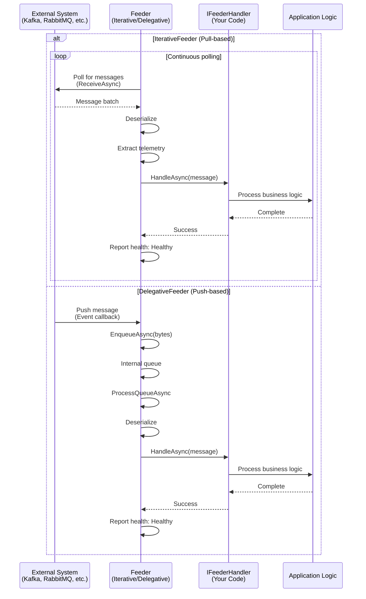

# ThunderPropagator.Feeders.SharedKernel

> Core Feeder Abstractions - Base classes for all message consumers

[◂ Back to SharedKernel](../README.md) | [◂ Back to Documentation](../../README.md)

## Contents

- [Overview](#overview)
- [Architecture](#architecture)
- [Files](#files)
- [Key Abstractions](#key-abstractions)
- [Usage](#usage)
- [Examples](#examples)
- [See Also](#see-also)

## Overview

**Type**: Core Library  
**Target Frameworks**: .NET 8, 9, 10  
**Package**: ThunderPropagator.Feeders.SharedKernel

This project provides the foundational abstractions for all message consumers (Feeders) in the ThunderPropagator.Feeviders framework. It defines two primary consumption patterns:

1. **IterativeFeeder**: Pull-based consumption (active polling)
2. **DelegativeFeeder**: Push-based consumption (event-driven)

All 11 system-specific feeder implementations inherit from one of these base classes.

### Key Features

- ✅ **Dual consumption patterns**: Pull and push messaging models
- ✅ **Health monitoring**: Built-in ASP.NET Core Health Checks integration
- ✅ **OpenTelemetry support**: Distributed tracing with Activity and Baggage propagation
- ✅ **Message enrichment**: C# script-based dynamic message transformation
- ✅ **Serialization abstraction**: JSON, NJson, NetJSON support
- ✅ **Cancellation support**: Graceful shutdown handling
- ✅ **Error handling**: Comprehensive exception management with health reporting

## Architecture



## Files

**Total**: 2 C# source files + 1 assembly info

| File | LOC | Responsibility |
|------|-----|----------------|
| Extensions.cs | ~18 | Dependency injection extension methods for feeder registration |
| AssemblyInfo.cs | ~5 | Assembly metadata and InternalsVisibleTo declarations |

### Key Components

#### IterativeFeeder (from ThunderPropagator.dll)

```csharp
public abstract class IterativeFeeder<TChannel, TMessage, TConfig> 
    : IFeeder<TChannel>
    where TChannel : class, IChannel
    where TMessage : FeederMessage
    where TConfig : IAbstractFeederConfiguration
{
    protected ILogger Logger { get; }
    protected TConfig FeederConfiguration { get; }
    protected string HealthName { get; set; }
    protected List<string> HealthTags { get; set; }
    
    // Core abstract method - implement in derived classes
    protected abstract IAsyncEnumerable<FeederReceivedMessage<TMessage>> ReceiveAsync(
        [EnumeratorCancellation] CancellationToken cancellationToken);
    
    // Health reporting
    protected void ReportHealth(HealthStatus status, Exception? exception = null);
    
    // Message consumed helper
    protected FeederReceivedMessage<TMessage> MessageConsumed(
        TMessage message, 
        ActivityContext? activityContext = null,
        Baggage? baggage = null,
        IDictionary<string, object?>? metadata = null);
}
```

Used by:
- **Kafka**: Consumer API with continuous polling
- **NATS**: Pull consumers and JetStream
- **Pulsar**: Consumer API with receive()
- **RabbitMQ**: BasicConsume with consume loop

#### DelegativeFeeder (from ThunderPropagator.dll)

```csharp
public abstract class DelegativeFeeder<TChannel, TMessage, TConfig> 
    : IFeeder<TChannel>
    where TChannel : class, IChannel
    where TMessage : FeederMessage
    where TConfig : IAbstractFeederConfiguration
{
    protected ILogger Logger { get; }
    protected TConfig FeederConfiguration { get; }
    protected string HealthName { get; set; }
    protected List<string> HealthTags { get; set; }
    
    // Enqueue incoming messages (called by event handlers)
    protected async Task EnqueueAsync(byte[] bytes, CancellationToken cancellationToken);
    protected async Task EnqueueAsync(string rawMessage, CancellationToken cancellationToken);
    
    // Internal queue processing (runs in background)
    private async Task ProcessQueueAsync(CancellationToken cancellationToken);
    
    // Health reporting
    protected void ReportHealth(HealthStatus status, Exception? exception = null);
}
```

Used by:
- **WebSocket**: OnMessage event handler
- **MQTT**: ApplicationMessageReceived event
- **WebApi**: HTTP POST endpoint receiving
- **TcpSocket**: Network stream reading
- **UdpClient**: Datagram received events
- **RedisPubSub**: Subscribe message handler
- **ActiveMQ**: MessageListener callbacks

## Key Abstractions

### IFeeder Interface

```csharp
public interface IFeeder<TChannel> where TChannel : class, IChannel
{
    Task StartAsync(CancellationToken cancellationToken = default);
    Task StopAsync(CancellationToken cancellationToken = default);
}
```

### IAbstractFeederConfiguration

```csharp
public interface IAbstractFeederConfiguration
{
    bool IsEnabled { get; set; }            // Feature flag
    Guid Id { get; set; }                   // Unique identifier
    SerializerType SerializerType { get; set; }  // JSON/NJson/NetJSON
    string? EnrichmentScript { get; set; }  // C# script for transformation
    string[]? MetadataReferences { get; set; }  // Script dependencies
}
```

### FeederReceivedMessage

```csharp
public class FeederReceivedMessage<TMessage> where TMessage : FeederMessage
{
    public TMessage Message { get; set; }
    public ActivityContext? ActivityContext { get; set; }
    public Baggage? Baggage { get; set; }
    public IDictionary<string, object?>? Metadata { get; set; }
    public DateTime ReceivedAt { get; set; } = DateTime.UtcNow;
}
```

## Usage

### Implementing an IterativeFeeder

```csharp
using ThunderPropagator.Feeders.SharedKernel;
using System.Runtime.CompilerServices;

internal sealed class MySystemFeeder<TChannel, TMessage, TConfig> 
    : IterativeFeeder<TChannel, TMessage, TConfig>
    where TChannel : class, IChannel
    where TMessage : MySystemFeederMessage
    where TConfig : MySystemFeederConfiguration
{
    private readonly IMyClient _client;
    
    public MySystemFeeder(TChannel channel, TConfig config, 
        IFeederHandler<TChannel, TMessage> handler, IServiceProvider services)
        : base(channel, config, handler, services)
    {
        _client = new MyClient(config.ConnectionString);
        
        // Set health identifiers
        HealthName = $"feeder_MySystem_{config.Id}";
        HealthTags = new List<string> { "MySystem", config.Id.ToString() };
    }
    
    protected override async IAsyncEnumerable<FeederReceivedMessage<TMessage>> ReceiveAsync(
        [EnumeratorCancellation] CancellationToken cancellationToken)
    {
        while (!cancellationToken.IsCancellationRequested)
        {
            try
            {
                // Poll external system
                var messages = await _client.PollAsync(100, cancellationToken);
                
                foreach (var msg in messages)
                {
                    // Extract tracing context
                    var activityContext = msg.Headers.GetActivityContext();
                    var baggage = msg.Headers.GetBaggage();
                    
                    // Yield message for processing
                    yield return MessageConsumed(msg.Data, activityContext, baggage);
                }
                
                ReportHealth(HealthStatus.Healthy);
            }
            catch (Exception ex)
            {
                ReportHealth(HealthStatus.Unhealthy, ex);
                await Task.Delay(TimeSpan.FromSeconds(10), cancellationToken);
            }
        }
    }
}
```

### Implementing a DelegativeFeeder

```csharp
internal sealed class MyPushFeeder<TChannel, TMessage, TConfig> 
    : DelegativeFeeder<TChannel, TMessage, TConfig>
{
    private readonly IMyEventClient _eventClient;
    
    public MyPushFeeder(TChannel channel, TConfig config, 
        IFeederHandler<TChannel, TMessage> handler, IServiceProvider services)
        : base(channel, config, handler, services)
    {
        _eventClient = new MyEventClient(config.EventEndpoint);
        
        // Subscribe to external events
        _eventClient.OnMessageReceived += async (sender, msg) =>
        {
            try
            {
                // Enqueue message for processing
                await EnqueueAsync(msg.Data, CancellationToken.None);
                ReportHealth(HealthStatus.Healthy);
            }
            catch (Exception ex)
            {
                ReportHealth(HealthStatus.Degraded, ex);
            }
        };
        
        HealthName = $"feeder_MyPush_{config.Endpoint}";
        HealthTags = new List<string> { "MyPush", config.Endpoint };
    }
}
```

## Dependency Injection

### Feeder Registration

```csharp
using ThunderPropagator.Feeders.SharedKernel;

// In ConfigureServices/Program.cs
services.AddChannelFeeder<OrderChannel, 
    KafkaFeeder<OrderChannel, OrderMessage, OrderConfig>,
    OrderMessage,
    OrderConfig>();
```

### Feeder Resolver Pattern

```csharp
// Multi-instance support
services.AddChannelFeederResolver<OrderChannel, KafkaFeeder, OrderMessage, OrderConfig>(
    (sp, channel, config, handler) => new KafkaFeeder(...));
```

### Extensions.cs Implementation

```csharp
internal static class Extensions
{
    internal static IServiceCollection AddChannelFeederResolver<TChannel, TFeeder, TMessage, TConfig>(
        this IServiceCollection services,
        Func<IServiceProvider, TChannel, TConfig, IFeederHandler<TChannel, TMessage>, IFeeder<TChannel>> factory)
        where TChannel : class, IChannel
        where TFeeder : class, IFeeder<TChannel>
        where TMessage : FeederMessage
        where TConfig : class, IAbstractFeederConfiguration, new()
    {
        return Infrastructure.Extensions.FeedersExtensions
            .AddChannelFeederResolver<TChannel, TFeeder, TMessage, TConfig>(services, factory);
    }
}
```

## Health Monitoring Integration

### ASP.NET Core Setup

```csharp
// Program.cs
builder.Services.AddHealthChecks()
    .AddCheck<FeederHealthCheck>("feeders");

app.MapHealthChecks("/health");
```

### Health Reporting Patterns

```csharp
// In feeder implementation
try
{
    var message = await ReceiveAsync(cancellationToken);
    ReportHealth(HealthStatus.Healthy);
}
catch (TimeoutException)
{
    ReportHealth(HealthStatus.Degraded, exception);
    // Continue operation
}
catch (Exception ex)
{
    ReportHealth(HealthStatus.Unhealthy, ex);
    throw; // or implement retry logic
}
```

### Health Status Values

- **Healthy**: Normal operation, messages flowing
- **Degraded**: Temporary issues (timeouts, throttling) but recoverable
- **Unhealthy**: Critical failure requiring intervention

## Examples

### Kafka-style Iterative Consumption

```csharp
protected override async IAsyncEnumerable<FeederReceivedMessage<OrderMessage>> ReceiveAsync(
    [EnumeratorCancellation] CancellationToken cancellationToken)
{
    await foreach (var kafkaMessage in _consumer.ConsumeAsync(cancellationToken))
    {
        // Extract ActivityContext from Kafka headers
        var activityContext = kafkaMessage.Headers
            .FirstOrDefault(h => h.Key == "traceparent")
            ?.GetValueBytes()
            ?.Deserialize<ActivityContext>();
        
        yield return MessageConsumed(
            message: kafkaMessage.Value,
            activityContext: activityContext,
            metadata: new Dictionary<string, object?>
            {
                ["Partition"] = kafkaMessage.Partition,
                ["Offset"] = kafkaMessage.Offset,
                ["Topic"] = kafkaMessage.Topic
            });
    }
}
```

### WebSocket-style Delegative Consumption

```csharp
// Constructor setup
public WebSocketFeeder(...) : base(...)
{
    // WebSocket connection established by ASP.NET Core middleware
    // Messages arrive via UseWebSocketFeeder extension:
}

// Extension method (in WebSocketFeederExtensions.cs)
app.UseWebSockets();
app.Use(async (context, next) =>
{
    if (context.WebSockets.IsWebSocketRequest)
    {
        var webSocket = await context.WebSockets.AcceptWebSocketAsync();
        var buffer = new byte[4096];
        
        while (!cancellationToken.IsCancellationRequested)
        {
            var result = await webSocket.ReceiveAsync(buffer, cancellationToken);
            await feeder.EnqueueAsync(buffer[..result.Count], cancellationToken);
        }
    }
});
```

### Message Enrichment Example

```csharp
// Configuration
{
  "EnrichmentScript": @"
    message.ProcessedAt = DateTime.UtcNow;
    message.ProcessedBy = Environment.MachineName;
    message.Tags.Add(""production"");
    return message;
  ",
  "MetadataReferences": ["System.Runtime", "System.Environment"]
}

// Automatic execution before handler invocation
// message now contains enriched properties
```

## See Also

### Related Projects
- [Providers.DotNet.SharedKernel](../../SharedKernel/Providers.DotNet.SharedKernel/README.md) - Provider abstractions
- [SharedKernel Overview](../README.md) - Architectural overview

### Implementations
- [Kafka Feeder](../../Kafka/Feeders.Kafka/README.md) - IterativeFeeder example
- [RabbitMQ Feeder](../../RabbitMQ/Feeders.RabbitMQ/README.md) - DelegativeFeeder example
- [MQTT Feeder](../../Mqtt/Feeders.Mqtt/README.md) - Push-based pattern
- [All Systems](../../README.md#systems)

### Framework Documentation
- [ThunderPropagator Core](https://github.com/KiarashMinoo/ThunderPropagator)
- [IChannel & ChannelMetadata](https://github.com/KiarashMinoo/ThunderPropagator/docs/Channels.md)
- [IFeederHandler](https://github.com/KiarashMinoo/ThunderPropagator/docs/Handlers.md)

---

**Next**: Explore [Providers.DotNet.SharedKernel](../../SharedKernel/Providers.DotNet.SharedKernel/README.md) for message publishing abstractions.
