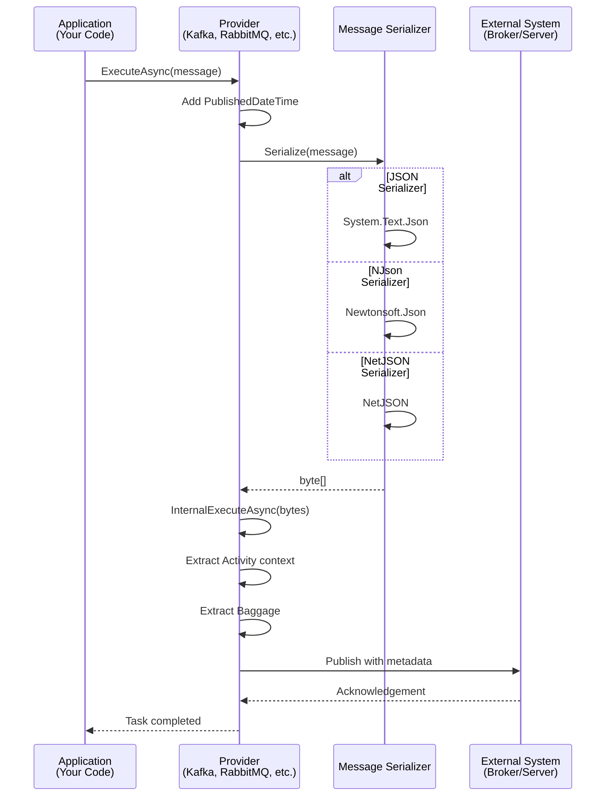

# ThunderPropagator.Providers.DotNet.SharedKernel

> Core Provider Abstractions - Base classes for all message publishers

[◂ Back to SharedKernel](../README.md) | [◂ Back to Documentation](../../README.md)

## Contents

- [Overview](#overview)
- [Architecture](#architecture)
- [Files](#files)
- [Key Abstractions](#key-abstractions)
- [Dependencies](#dependencies)
- [Usage](#usage)
- [Examples](#examples)
- [See Also](#see-also)

## Overview

**Type**: Core Library  
**Target Frameworks**: .NET 8, 9, 10  
**Package**: ThunderPropagator.Providers.DotNet.SharedKernel

This project provides the foundational abstractions for all message publishers (Providers) in the ThunderPropagator.Feeviders framework. Every provider implementation inherits from `AbstractProvider`, which handles serialization, telemetry, and provides a consistent publishing interface across all 11 messaging systems.

### Key Features

- ✅ **Unified publishing interface**: Single `ExecuteAsync()` method for all systems
- ✅ **Automatic serialization**: JSON, NJson, NetJSON support with pluggable serializers
- ✅ **OpenTelemetry integration**: Automatic Activity and Baggage propagation
- ✅ **Message timestamping**: Automatic `PublishedDateTime` injection
- ✅ **Disposable resources**: Proper cleanup with async disposal pattern
- ✅ **Extensible architecture**: Override points for custom serialization logic
- ✅ **Type-safe configuration**: Strongly-typed provider configurations

## Architecture



## Files

**Total**: 6 C# source files + 1 assembly info

| File | LOC | Responsibility |
|------|-----|----------------|
| AbstractProvider.cs | ~40 | Base class for all providers - handles serialization and execution flow |
| FeederMessageSerializer.cs | ~50 | Serialization implementation supporting JSON, NJson, NetJSON |
| IFeederMessageSerializer.cs | ~10 | Serializer interface contract |
| IProvider.cs | ~8 | Provider interface definition |
| IAbstractProviderConfiguration.cs | ~8 | Configuration interface |
| AssemblyInfo.cs | ~5 | Assembly metadata and InternalsVisibleTo declarations |

### Key Implementation Details

#### AbstractProvider.cs

```csharp
public abstract class AbstractProvider<TFeederMessage, TProviderConfiguration> 
    : DisposableObject, IProvider<TFeederMessage>
    where TFeederMessage : FeederMessage
    where TProviderConfiguration : class, IAbstractProviderConfiguration
{
    private readonly IFeederMessageSerializer<TFeederMessage, TProviderConfiguration> _feederMessageSerializer;
    protected ILogger Logger { get; }
    
    protected AbstractProvider(IServiceProvider serviceProvider)
    {
        Logger = serviceProvider.GetRequiredService<ILoggerFactory>().CreateLogger(GetType());
        _feederMessageSerializer = serviceProvider
            .GetRequiredService<IFeederMessageSerializer<TFeederMessage, TProviderConfiguration>>();
    }
    
    // Public entry point - adds timestamp and delegates
    public Task ExecuteAsync(TFeederMessage feederMessage, CancellationToken cancellationToken = default)
    {
        feederMessage.TryAdd("PublishedDateTime", DateTime.UtcNow);
        return InternalExecuteAsync(feederMessage, cancellationToken);
    }
    
    // Default implementation serializes to bytes
    protected virtual Task InternalExecuteAsync(TFeederMessage feederMessage, CancellationToken cancellationToken = default)
    {
        return InternalExecuteAsync(
            _feederMessageSerializer.SerializeToBytes(feederMessage, cancellationToken), 
            cancellationToken);
    }
    
    // System-specific implementation (override in derived class)
    protected abstract Task InternalExecuteAsync(byte[] bytes, CancellationToken cancellationToken = default);
}
```

#### FeederMessageSerializer.cs

```csharp
internal sealed class FeederMessageSerializer<TProviderMessage, TProviderConfiguration> 
    : IFeederMessageSerializer<TProviderMessage, TProviderConfiguration>
    where TProviderMessage : FeederMessage
    where TProviderConfiguration : class, IAbstractProviderConfiguration
{
    private readonly TProviderConfiguration _feederConfiguration;
    
    public FeederMessageSerializer(TProviderConfiguration feederConfiguration) 
        => _feederConfiguration = feederConfiguration;
    
    public string Serialize(TProviderMessage feederMessage, CancellationToken cancellationToken = default)
        => _feederConfiguration.SerializerType switch
        {
            SerializerType.Json => feederMessage.ToJson(),
            SerializerType.NJson => feederMessage.ToNJson(serializerSettings =>
            {
                serializerSettings.TypeNameHandling = TypeNameHandling.Auto;
                return serializerSettings;
            }),
            SerializerType.NetJson => feederMessage.ToNetJson(),
            _ => throw new ArgumentOutOfRangeException()
        };
    
    public byte[] SerializeToBytes(TProviderMessage feederMessage, CancellationToken cancellationToken = default)
        => _feederConfiguration.SerializerType switch
        {
            SerializerType.Json => Encoding.UTF8.GetBytes(feederMessage.ToJson()),
            SerializerType.NJson => Encoding.UTF8.GetBytes(Serialize(feederMessage, cancellationToken)),
            SerializerType.NetJson => feederMessage.ToNetJsonBytes(),
            _ => throw new ArgumentOutOfRangeException()
        };
}
```

## Key Abstractions

### IProvider Interface

```csharp
public interface IProvider
{
    // Non-generic marker interface
}

public interface IProvider<in TFeederMessage> : IProvider 
    where TFeederMessage : FeederMessage
{
    Task ExecuteAsync(TFeederMessage feederMessage, CancellationToken cancellationToken = default);
}
```

### IAbstractProviderConfiguration

```csharp
public interface IAbstractProviderConfiguration
{
    SerializerType SerializerType { get; set; }
}
```

### IFeederMessageSerializer

```csharp
public interface IFeederMessageSerializer<in TProviderMessage, in TProviderConfiguration>
    where TProviderMessage : FeederMessage
    where TProviderConfiguration : class, IAbstractProviderConfiguration
{
    string Serialize(TProviderMessage feederMessage, CancellationToken cancellationToken = default);
    byte[] SerializeToBytes(TProviderMessage feederMessage, CancellationToken cancellationToken = default);
}
```

## Dependencies

### ThunderPropagator Packages

| Package | Version | Description |
|---------|---------|-------------|
| ThunderPropagator.BuildingBlocks | 1.0.1-beta.4 | Common utilities, serialization extensions, DisposableObject |

### Microsoft Packages

| Package | Purpose |
|---------|---------|
| Microsoft.Extensions.Logging.Abstractions | ILogger support |
| Microsoft.Extensions.DependencyInjection.Abstractions | Service resolution |

### Package References (from .csproj)

```xml
<ItemGroup>
    <PackageReference Include="$(BuildingBlocksPackageId)"/>
    <PackageReference Include="Microsoft.Extensions.Logging.Abstractions"/>
    <PackageReference Include="Microsoft.Extensions.DependencyInjection.Abstractions"/>
</ItemGroup>
```

## Usage

### Implementing a Provider

```csharp
using ThunderPropagator.Providers.DotNet.SharedKernel;

internal sealed class MySystemProvider<TMessage, TConfig> 
    : AbstractProvider<TMessage, TConfig>
    where TMessage : MySystemProviderMessage
    where TConfig : MySystemProviderConfiguration
{
    private readonly TConfig _configuration;
    private readonly IMySystemClient _client;
    
    public MySystemProvider(TConfig configuration, IServiceProvider serviceProvider) 
        : base(serviceProvider)
    {
        _configuration = configuration;
        _client = new MySystemClient(configuration.ConnectionString);
    }
    
    // Implement system-specific publishing
    protected override async Task InternalExecuteAsync(byte[] bytes, CancellationToken cancellationToken = default)
    {
        await _client.PublishAsync(
            topic: _configuration.Topic,
            payload: bytes,
            cancellationToken: cancellationToken);
        
        Logger.LogDebug("Published {Size} bytes to {Topic}", bytes.Length, _configuration.Topic);
    }
    
    // Optional: Override for custom serialization
    protected override Task InternalExecuteAsync(TMessage feederMessage, CancellationToken cancellationToken = default)
    {
        // Add custom headers/metadata before serialization
        feederMessage.TryAdd("ProducerId", _configuration.ProducerId);
        return base.InternalExecuteAsync(feederMessage, cancellationToken);
    }
    
    // Cleanup resources
    protected override async ValueTask DisposeManagedResourcesAsync()
    {
        await _client.DisconnectAsync();
        _client.Dispose();
        await base.DisposeManagedResourcesAsync();
    }
}
```

### Message Definition

```csharp
public abstract class MySystemProviderMessage : FeederMessage
{
    // Inherits Dictionary<string, object?> from FeederMessage
    // Add typed properties for convenience:
    
    public string MessageId
    {
        get => this["MessageId"]?.ToString() ?? string.Empty;
        set => this["MessageId"] = value;
    }
    
    public DateTime Timestamp
    {
        get => this.TryGetValue("Timestamp", out var val) && val is DateTime dt 
            ? dt : DateTime.UtcNow;
        set => this["Timestamp"] = value;
    }
}

public class OrderPublishedMessage : MySystemProviderMessage
{
    public string OrderId { get; set; } = default!;
    public decimal Amount { get; set; }
    public string CustomerId { get; set; } = default!;
}
```

### Configuration Definition

```csharp
public abstract class MySystemProviderConfiguration : IAbstractProviderConfiguration
{
    public SerializerType SerializerType { get; set; } = SerializerType.Json;
    public string ConnectionString { get; set; } = default!;
    public string Topic { get; set; } = default!;
    public string ProducerId { get; set; } = Guid.NewGuid().ToString();
}

public class OrderProviderConfiguration : MySystemProviderConfiguration
{
    public OrderProviderConfiguration()
    {
        Topic = "orders";
        SerializerType = SerializerType.NJson; // Use Newtonsoft.Json
    }
}
```

## Dependency Injection

### Provider Registration

```csharp
// Startup.cs or Program.cs
public void ConfigureServices(IServiceCollection services)
{
    // Register configuration
    var config = new OrderProviderConfiguration
    {
        ConnectionString = "server=localhost;port=5672",
        Topic = "orders"
    };
    services.AddSingleton(config);
    
    // Register serializer
    services.AddSingleton<IFeederMessageSerializer<OrderPublishedMessage, OrderProviderConfiguration>,
        FeederMessageSerializer<OrderPublishedMessage, OrderProviderConfiguration>>();
    
    // Register provider
    services.AddScoped<IProvider<OrderPublishedMessage>, 
        MySystemProvider<OrderPublishedMessage, OrderProviderConfiguration>>();
}
```

### Configuration from appsettings.json

```csharp
// appsettings.json
{
  "Messaging": {
    "Orders": {
      "ConnectionString": "server=localhost;port=5672",
      "Topic": "orders",
      "SerializerType": "NJson",
      "ProducerId": "order-service-01"
    }
  }
}

// Registration with IConfiguration
services.AddSingleton(sp =>
{
    var config = sp.GetRequiredService<IConfiguration>();
    var providerConfig = new OrderProviderConfiguration();
    config.GetSection("Messaging:Orders").Bind(providerConfig);
    return providerConfig;
});
```

## Examples

### Publishing a Message

```csharp
public class OrderService
{
    private readonly IProvider<OrderPublishedMessage> _provider;
    
    public OrderService(IProvider<OrderPublishedMessage> provider)
    {
        _provider = provider;
    }
    
    public async Task PublishOrderAsync(Order order, CancellationToken cancellationToken)
    {
        var message = new OrderPublishedMessage
        {
            OrderId = order.Id,
            Amount = order.TotalAmount,
            CustomerId = order.CustomerId
        };
        
        // Add custom metadata
        message["Region"] = order.ShippingAddress.Region;
        message["Priority"] = order.IsPriority ? "high" : "normal";
        
        // PublishedDateTime added automatically by AbstractProvider
        await _provider.ExecuteAsync(message, cancellationToken);
    }
}
```

### Custom Serialization Logic

```csharp
internal sealed class AvroKafkaProvider<TMessage, TConfig> 
    : AbstractProvider<TMessage, TConfig>
{
    private readonly IAvroSerializer _avroSerializer;
    
    // Override to use Avro instead of default serializer
    protected override Task InternalExecuteAsync(TMessage feederMessage, CancellationToken cancellationToken = default)
    {
        // Custom serialization
        var avroBytes = _avroSerializer.Serialize(feederMessage);
        return InternalExecuteAsync(avroBytes, cancellationToken);
    }
    
    protected override async Task InternalExecuteAsync(byte[] bytes, CancellationToken cancellationToken = default)
    {
        await _kafkaProducer.ProduceAsync(_topic, new Message<string, byte[]>
        {
            Key = Guid.NewGuid().ToString(),
            Value = bytes
        }, cancellationToken);
    }
}
```

### Batch Publishing

```csharp
public class BatchOrderService
{
    private readonly IProvider<OrderPublishedMessage> _provider;
    
    public async Task PublishOrdersAsync(IEnumerable<Order> orders, CancellationToken cancellationToken)
    {
        var tasks = orders.Select(order => PublishSingleAsync(order, cancellationToken));
        await Task.WhenAll(tasks);
    }
    
    private async Task PublishSingleAsync(Order order, CancellationToken cancellationToken)
    {
        var message = new OrderPublishedMessage
        {
            OrderId = order.Id,
            Amount = order.TotalAmount,
            CustomerId = order.CustomerId
        };
        
        await _provider.ExecuteAsync(message, cancellationToken);
    }
}
```

### Retry Policy with Polly

```csharp
public class ResilientOrderService
{
    private readonly IProvider<OrderPublishedMessage> _provider;
    private readonly IAsyncPolicy _retryPolicy;
    
    public ResilientOrderService(IProvider<OrderPublishedMessage> provider)
    {
        _provider = provider;
        
        // Exponential backoff: 2s, 4s, 8s
        _retryPolicy = Policy
            .Handle<Exception>()
            .WaitAndRetryAsync(3, attempt => TimeSpan.FromSeconds(Math.Pow(2, attempt)));
    }
    
    public async Task PublishOrderAsync(Order order, CancellationToken cancellationToken)
    {
        var message = new OrderPublishedMessage { /* ... */ };
        
        await _retryPolicy.ExecuteAsync(async () =>
        {
            await _provider.ExecuteAsync(message, cancellationToken);
        });
    }
}
```

## Serialization Formats

### JSON (System.Text.Json)

```csharp
// Configuration
config.SerializerType = SerializerType.Json;

// Output
{
  "OrderId": "12345",
  "Amount": 99.99,
  "CustomerId": "CUST-001",
  "PublishedDateTime": "2025-12-29T10:30:00Z"
}
```

**Performance**: Fast, low memory allocation  
**Use case**: Modern .NET applications, high throughput

### NJson (Newtonsoft.Json)

```csharp
// Configuration
config.SerializerType = SerializerType.NJson;

// Supports complex scenarios
message["ComplexObject"] = new CustomType { /* ... */ };

// Output includes type information
{
  "$type": "OrderPublishedMessage",
  "OrderId": "12345",
  "ComplexObject": {
    "$type": "CustomType",
    "Property": "Value"
  }
}
```

**Performance**: Moderate, feature-rich  
**Use case**: Legacy systems, complex type hierarchies, polymorphism

### NetJSON

```csharp
// Configuration
config.SerializerType = SerializerType.NetJson;

// Output (binary-optimized)
byte[] netJsonBytes = /* optimized binary representation */
```

**Performance**: Fastest, minimal allocations  
**Use case**: High-performance scenarios, large message volumes

## See Also

### Related Projects
- [Feeders.SharedKernel](../../SharedKernel/Feeders.SharedKernel/README.md) - Consumer abstractions
- [SharedKernel Overview](../README.md) - Architectural overview

### Implementations
- [Kafka Provider](../../Kafka/Providers.DotNet.Kafka/README.md) - Confluent Kafka
- [RabbitMQ Provider](../../RabbitMQ/Providers.DotNet.RabbitMQ/README.md) - AMQP protocol
- [MQTT Provider](../../Mqtt/Providers.DotNet.Mqtt/README.md) - IoT messaging
- [All Systems](../../README.md#systems)

### Framework Documentation
- [ThunderPropagator.BuildingBlocks](https://github.com/KiarashMinoo/ThunderPropagator.BuildingBlocks)
- [Serialization Extensions](https://github.com/KiarashMinoo/ThunderPropagator.BuildingBlocks/docs/Serialization.md)
- [DisposableObject Pattern](https://github.com/KiarashMinoo/ThunderPropagator.BuildingBlocks/docs/Disposal.md)

---

**Next**: Explore [system-specific providers](../../README.md#systems) or return to [SharedKernel overview](../README.md).
