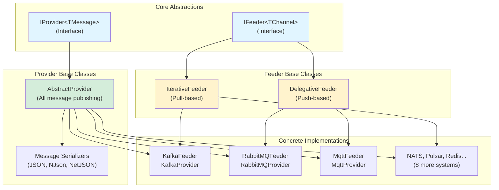

# ThunderPropagator.Feeviders.SharedKernel

> Core Abstractions & Utilities - Foundation for all Feeder and Provider implementations

[◂ Back to Documentation](../README.md)

## Contents

- [Overview](#overview)
- [Architecture](#architecture)
- [Projects](#projects)
- [Key Abstractions](#key-abstractions)
- [Installation](#installation)
- [See Also](#see-also)

## Overview

The **SharedKernel** provides the foundational abstractions and utilities that power all 12 messaging system implementations in ThunderPropagator.Feeviders. It defines the contracts for message consumption (Feeders) and message publishing (Providers), along with common serialization, configuration, and dependency injection patterns.

### Core Components

- **Feeders.SharedKernel**: Base classes for message consumers (IterativeFeeder, DelegativeFeeder)
- **Providers.DotNet.SharedKernel**: Base classes for message publishers (AbstractProvider, serializers)

### Design Philosophy

The SharedKernel follows SOLID principles with:
- **Interface Segregation**: Separate abstractions for pull-based vs push-based consumption
- **Dependency Inversion**: All systems depend on abstractions, not concrete implementations
- **Open/Closed**: Extensible patterns for new messaging systems without modifying core code
- **Single Responsibility**: Clear separation between configuration, serialization, and message handling

## Architecture



## Projects

| Project | Type | Description |
|---------|------|-------------|
| [Feeders.SharedKernel](Feeders.SharedKernel/README.md) | **Consumer Library** | Base classes for all message consumers: IterativeFeeder (pull), DelegativeFeeder (push), shared utilities |
| [Providers.DotNet.SharedKernel](Providers.DotNet.SharedKernel/README.md) | **Publisher Library** | Base classes for all message publishers: AbstractProvider, serialization infrastructure |

## Key Abstractions

### Feeder Patterns

**IterativeFeeder** (Pull-based):
- Used by: Kafka, NATS, Pulsar, RabbitMQ (consumer mode)
- Pattern: Actively polls external system for messages
- Method: `protected abstract IAsyncEnumerable<FeederReceivedMessage<T>> ReceiveAsync(CancellationToken)`

**DelegativeFeeder** (Push-based):
- Used by: WebSocket, MQTT, WebApi, TcpSocket, UdpClient, RabbitMQ (listener mode)
- Pattern: External system pushes messages to feeder
- Method: `protected async Task EnqueueAsync(byte[] | string, CancellationToken)`

### Provider Pattern

**AbstractProvider**:
- Used by: All 12 messaging systems
- Pattern: Application → Serialize → Publish to external system
- Methods:
  - `public Task ExecuteAsync(TMessage, CancellationToken)` - Entry point
  - `protected abstract Task InternalExecuteAsync(byte[], CancellationToken)` - System-specific publishing

### Configuration Interfaces

```csharp
public interface IAbstractFeederConfiguration
{
    bool IsEnabled { get; set; }
    Guid Id { get; set; }
    SerializerType SerializerType { get; set; }
    string? EnrichmentScript { get; set; }
    string[]? MetadataReferences { get; set; }
}

public interface IAbstractProviderConfiguration
{
    SerializerType SerializerType { get; set; }
}
```

### Serialization Support

```csharp
public enum SerializerType
{
    Json,      // System.Text.Json
    NJson,     // Newtonsoft.Json
    NetJson    // NetJSON (high-performance)
}
```

Additional system-specific serializers:
- **Kafka**: SchemaJson, Avro (Confluent Schema Registry)
- **Pulsar**: Schema-based JSON
- **Binary protocols** (TCP/UDP): Raw byte arrays

## Installation

```bash
# Feeders.SharedKernel (consumer infrastructure)
dotnet add package ThunderPropagator.Feeders.SharedKernel

# Providers.DotNet.SharedKernel (publisher infrastructure)
dotnet add package ThunderPropagator.Providers.DotNet.SharedKernel
```

These packages are **automatically included** when you install any system-specific package:

```bash
# Installing Kafka automatically brings SharedKernel dependencies
dotnet add package ThunderPropagator.Feeders.Kafka
dotnet add package ThunderPropagator.Providers.DotNet.Kafka
```

## Key Features

### Health Monitoring

All feeders inherit health monitoring capabilities:

```csharp
protected string HealthName { get; set; } = "feeder_default";
protected List<string> HealthTags { get; set; } = new();

protected void ReportHealth(HealthStatus status, Exception? exception = null)
{
    // Integrated with ASP.NET Core Health Checks
}
```

### OpenTelemetry Integration

Automatic distributed tracing support:

```csharp
// Activity context propagation
ActivityContext? activityContext = ExtractActivityContext(message);
Activity.Current = new Activity("ProcessMessage").SetParentId(activityContext.TraceId, ...);

// Baggage propagation
Baggage? baggage = ExtractBaggage(message);
```

### Enrichment Scripts

Dynamic message enrichment via C# scripts:

```json
{
  "EnrichmentScript": "message.ProcessedAt = DateTime.UtcNow; message.Hostname = Environment.MachineName; return message;",
  "MetadataReferences": ["System.Runtime"]
}
```

## Usage Patterns

### Implementing a Feeder

```csharp
// Pull-based (IterativeFeeder)
internal sealed class MySystemFeeder<TChannel, TMessage, TConfig> 
    : IterativeFeeder<TChannel, TMessage, TConfig>
    where TChannel : class, IChannel
    where TMessage : MySystemFeederMessage
    where TConfig : MySystemFeederConfiguration
{
    protected override async IAsyncEnumerable<FeederReceivedMessage<TMessage>> ReceiveAsync(
        [EnumeratorCancellation] CancellationToken cancellationToken)
    {
        while (!cancellationToken.IsCancellationRequested)
        {
            // Poll external system
            var message = await _client.ReceiveAsync(cancellationToken);
            yield return MessageConsumed(message);
        }
    }
}

// Push-based (DelegativeFeeder)
internal sealed class MyOtherFeeder<TChannel, TMessage, TConfig> 
    : DelegativeFeeder<TChannel, TMessage, TConfig>
{
    public MyOtherFeeder(...) : base(...)
    {
        // Subscribe to external events
        _client.OnMessageReceived += async (msg) => 
            await EnqueueAsync(msg.Data, cancellationToken);
    }
}
```

### Implementing a Provider

```csharp
internal sealed class MySystemProvider<TMessage, TConfig> 
    : AbstractProvider<TMessage, TConfig>
    where TMessage : MySystemProviderMessage
    where TConfig : MySystemProviderConfiguration
{
    protected override async Task InternalExecuteAsync(byte[] bytes, CancellationToken cancellationToken)
    {
        // Serialize handled by base class
        await _client.PublishAsync(bytes, cancellationToken);
    }
}
```

## Dependency Injection

### Feeder Registration

```csharp
services.AddChannelFeeder<TChannel, TFeeder, TMessage, TConfig>();
services.AddChannelFeederResolver<TChannel, TFeeder, TMessage, TConfig>(factory);
```

### Provider Registration

```csharp
services.AddSingleton<TConfig>(config);
services.AddScoped<IProvider<TMessage>, MyProvider<TMessage, TConfig>>();
services.AddSingleton<IFeederMessageSerializer<TMessage, TConfig>, 
    FeederMessageSerializer<TMessage, TConfig>>();
```

## See Also

### Project Documentation
- [Feeders.SharedKernel - Consumer Abstractions](Feeders.SharedKernel/README.md)
- [Providers.DotNet.SharedKernel - Publisher Abstractions](Providers.DotNet.SharedKernel/README.md)

### Implementations
- [Kafka](../Kafka/README.md) - Apache Kafka event streaming
- [RabbitMQ](../RabbitMQ/README.md) - AMQP message broker
- [NATS](../NATS/README.md) - Cloud-native messaging
- [MQTT](../Mqtt/README.md) - IoT protocol
- [All Systems](../README.md#systems) - Complete catalog

### Framework Documentation
- [ThunderPropagator Core](https://github.com/KiarashMinoo/ThunderPropagator) - Streaming framework
- [BuildingBlocks](https://github.com/KiarashMinoo/ThunderPropagator.BuildingBlocks) - Utilities

---

**Next**: Explore specific system implementations or dive into [Feeders.SharedKernel](Feeders.SharedKernel/README.md) internals.
