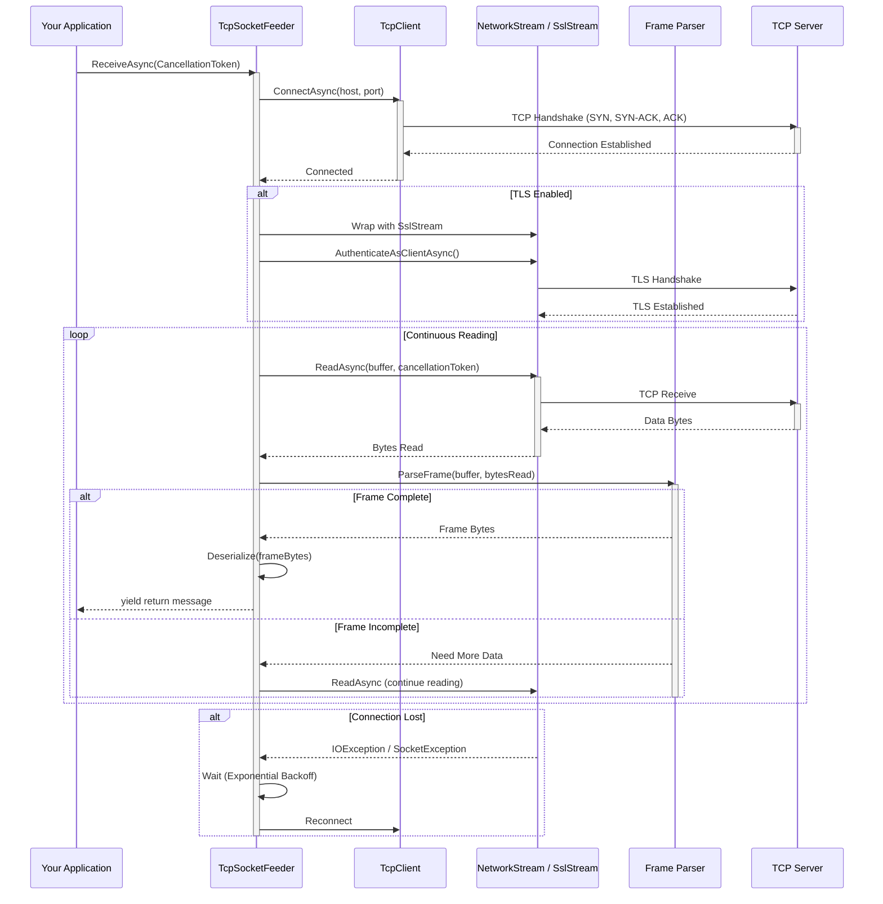

# ThunderPropagator.Feeders.TcpSocket

## Overview

**ThunderPropagator.Feeders.TcpSocket** provides a pull-based TCP socket reader for consuming binary or text messages from TCP servers. Built on the `IterativeFeeder` pattern using `System.Net.Sockets.TcpClient`, it continuously reads from a TCP stream, parses frames using configurable strategies, and yields messages through an asynchronous enumerable.

This feeder is ideal for:
- **Custom binary protocols** (proprietary formats, embedded systems, IoT devices)
- **Legacy TCP servers** that don't support HTTP/WebSocket
- **High-performance scenarios** requiring low-level socket control
- **Real-time data streams** (telemetry, sensor data, log aggregation)
- **Low-latency communication** (gaming, trading systems, industrial automation)

### Key Features

#### 🔌 TCP Connection Management
- **Persistent connections**: Maintain long-lived TCP connections with automatic reconnection
- **Connection pooling**: Reuse connections for throughput (optional)
- **Reconnection logic**: Exponential backoff on connection failures
- **Keep-alive probes**: Detect broken connections without data transfer

#### 📦 Framing Strategies
- **Length-Prefix**: 1/2/4-byte big-endian or little-endian length header
- **Delimiter-Based**: Newline (\n), CRLF (\r\n), null byte (0x00), custom byte sequence
- **Fixed-Size**: Read fixed N bytes per message
- **Custom**: Implement `IFrameParser` interface for proprietary protocols

#### 🛡️ Socket Options
- **NoDelay** (Nagle): Disable buffering for low-latency (interactive protocols)
- **KeepAlive**: TCP keep-alive probes (interval, retry count)
- **Buffer Sizing**: Configurable OS-level send/receive buffers (8KB-64KB)
- **Linger**: Graceful close behavior (wait for pending data)

#### 🔐 TLS/SSL Support
- **SslStream** wrapper for encrypted communication
- **Server certificate validation** (issuer, expiration, hostname)
- **Client certificate authentication** (mutual TLS)
- **TLS 1.2 and TLS 1.3** support

#### ⚡ Performance Optimizations
- **Zero-copy**: Direct buffer manipulation (Span<byte>, Memory<byte>)
- **Async I/O**: Non-blocking reads (ReadAsync)
- **Backpressure**: Pause reading if consumer slow
- **Batch parsing**: Process multiple frames in single buffer

## Architecture

The TcpSocketFeeder follows a **pull-based streaming architecture** with incremental frame parsing:



### Reading Flow

1. **Connect**: Establish TCP connection (3-way handshake: SYN, SYN-ACK, ACK)
2. **TLS Handshake** (optional): Upgrade to encrypted stream
3. **Read Loop**:
   - Read bytes from stream into buffer (async, non-blocking)
   - Parse buffer using framing strategy (length-prefix, delimiter, fixed-size)
   - If frame complete: Deserialize and yield message
   - If frame incomplete: Continue reading to accumulate bytes
4. **Backpressure**: If consumer slow, pause reading (buffer full)
5. **Reconnection**: On connection loss, wait (exponential backoff), then reconnect

## Project Files

| File | Purpose |
|------|---------|
| **TcpSocketFeeder.cs** | Core feeder class, inherits `IterativeFeeder<TChannel, TMessage, TConfig>` |
| **TcpSocketFeederMessage.cs** | Abstract base class for feeder messages |
| **TcpSocketFeederConfiguration.cs** | Configuration class with TCP-specific properties |
| **TcpSocketFeederExtensions.cs** | DI registration extension methods |
| **Framing/LengthPrefixFrameParser.cs** | Length-prefix framing (1/2/4-byte header) |
| **Framing/DelimiterFrameParser.cs** | Delimiter-based framing (\n, \r\n, custom) |
| **Framing/FixedSizeFrameParser.cs** | Fixed-size framing (N bytes per message) |
| **Framing/IFrameParser.cs** | Interface for custom framing logic |
| **Connection/ConnectionPool.cs** | Connection pooling for throughput |
| **Connection/ReconnectionHandler.cs** | Exponential backoff reconnection |

## Dependencies

```xml
<PackageReference Include="ThunderPropagator" Version="1.0.1-beta.2" />
<PackageReference Include="ThunderPropagator.BuildingBlocks" Version="1.0.1-beta.2" />
<PackageReference Include="ThunderPropagator.Feeviders.TcpSocket.SharedKernel" Version="1.0.1-beta.2" />
<!-- System.Net.Sockets is part of .NET runtime (no explicit package) -->
```

**Key Dependencies**:
- **ThunderPropagator**: Core feeder abstractions (`IterativeFeeder`, `FeederReceivedMessage`)
- **TcpSocket.SharedKernel**: Shared framing utilities, configuration base classes
- **System.Net.Sockets**: TcpClient, NetworkStream (built-in)
- **System.Net.Security**: SslStream for TLS/SSL (built-in)

## Configuration

### TcpSocketFeederConfiguration Properties

| Property | Type | Default | Description |
|----------|------|---------|-------------|
| **Id** | `Guid` | Required | Unique feeder identifier |
| **Host** | `string` | Required | Server hostname or IP address (e.g., `localhost`, `192.168.1.100`) |
| **Port** | `int` | Required | Server port (1-65535, e.g., 8080, 5432) |
| **BufferSize** | `int` | `8192` | Read buffer size in bytes (8KB default, 8KB-64KB typical) |
| **ReceiveTimeout** | `TimeSpan` | `Infinite` | Socket receive timeout (`Infinite` = no timeout) |
| **SendTimeout** | `TimeSpan` | `Infinite` | Socket send timeout (for write operations) |
| **ConnectTimeout** | `TimeSpan` | `00:00:05` | Connection timeout (5 seconds default) |
| **NoDelay** | `bool` | `false` | Disable Nagle algorithm (true = low latency, false = throughput) |
| **KeepAlive** | `KeepAliveConfig` | `null` | Keep-alive settings (interval, retry count) |
| **Linger** | `LingerOption` | `null` | Linger option (graceful close behavior) |
| **ReceiveBufferSize** | `int` | OS default | OS-level receive buffer size (8KB-256KB) |
| **SendBufferSize** | `int` | OS default | OS-level send buffer size |
| **Tls** | `TlsConfig` | `null` | TLS/SSL settings (enable, server validation, client cert) |
| **FramingStrategy** | `FramingStrategy` | `LengthPrefix` | Framing strategy (LengthPrefix, Delimiter, FixedSize, Custom) |
| **FrameLengthFieldSize** | `int` | `4` | Length field size in bytes (1, 2, or 4 for LengthPrefix) |
| **FrameLengthEndianness** | `Endianness` | `BigEndian` | Byte order for length field (BigEndian or LittleEndian) |
| **FrameDelimiter** | `byte[]` | `[0x0A]` | Delimiter byte sequence (\n = 0x0A, \r\n = 0x0D 0x0A) |
| **FixedFrameSize** | `int` | `1024` | Fixed frame size in bytes (for FixedSize strategy) |
| **MaxFrameSize** | `int` | `1048576` | Maximum frame size (1 MB default, prevent DoS) |
| **Reconnection** | `ReconnectionConfig` | Enabled | Reconnection settings (enabled, max attempts, backoff) |
| **ConnectionPool** | `ConnectionPoolConfig` | `null` | Connection pooling settings (enabled, max size) |
| **SerializerType** | `SerializerType` | `Json` | Serialization format (Json, NJson, NetJson, Binary) |
| **EnrichmentScript** | `string?` | `null` | C# script for message enrichment |
| **MetadataReferences** | `string[]?` | `null` | Assemblies for enrichment script |

### KeepAliveConfig Properties

| Property | Type | Default | Description |
|----------|------|---------|-------------|
| **Enabled** | `bool` | `false` | Enable TCP keep-alive probes |
| **Interval** | `TimeSpan` | `00:01:00` | Time between keep-alive probes (60 seconds) |
| **RetryCount** | `int` | `3` | Number of probes before considering connection dead |

### TlsConfig Properties

| Property | Type | Default | Description |
|----------|------|---------|-------------|
| **Enabled** | `bool` | `false` | Enable TLS/SSL encryption |
| **ServerName** | `string` | Host | Server name for certificate validation (SNI) |
| **ValidateServerCertificate** | `bool` | `true` | Validate server certificate (issuer, expiration, hostname) |
| **ClientCertificate** | `X509Certificate2` | `null` | Client certificate for mutual TLS |
| **AcceptedIssuers** | `string[]` | `null` | Accepted certificate issuers (CN or thumbprint) |
| **TlsVersion** | `SslProtocols` | `Tls12 \| Tls13` | TLS versions (Tls12, Tls13) |

### ReconnectionConfig Properties

| Property | Type | Default | Description |
|----------|------|---------|-------------|
| **Enabled** | `bool` | `true` | Enable automatic reconnection on connection loss |
| **MaxAttempts** | `int` | `int.MaxValue` | Maximum reconnection attempts (unlimited) |
| **InitialDelay** | `TimeSpan` | `00:00:01` | Initial delay before first reconnection (1 second) |
| **MaxDelay** | `TimeSpan` | `00:05:00` | Maximum delay between attempts (5 minutes) |
| **BackoffMultiplier** | `double` | `2.0` | Exponential backoff multiplier (2^n) |

## API Reference

### TcpSocketFeeder<TChannel, TMessage, TConfig>

**Namespace**: `ThunderPropagator.Feeders.TcpSocket`

```csharp
internal
#if !DEBUG
    sealed
#endif
    class TcpSocketFeeder<TChannel, TMessage, TConfig> : 
        IterativeFeeder<TChannel, TMessage, TConfig>
    where TMessage : TcpSocketFeederMessage
    where TConfig : TcpSocketFeederConfiguration
{
    public override string HealthName { get; }
    public override string[] HealthTags { get; }
    
    public override IAsyncEnumerable<FeederReceivedMessage<TMessage>> ReceiveAsync(
        [EnumeratorCancellation] CancellationToken cancellationToken = default);
}
```

**Key Methods**:
- `ReceiveAsync()`: Connects, reads stream, parses frames, yields messages
- `ConnectAsync()`: Establishes TCP connection (with TLS if configured)
- `ReadFrameAsync()`: Reads bytes until frame complete (using parser)
- `ReconnectAsync()`: Handles reconnection with exponential backoff

### TcpSocketFeederMessage

**Namespace**: `ThunderPropagator.Feeders.TcpSocket`

```csharp
public abstract class TcpSocketFeederMessage : FeederMessage
{
    public string? RemoteEndPoint { get; init; }
    public string? LocalEndPoint { get; init; }
    public int BytesReceived { get; init; }
    public bool IsTlsEncrypted { get; init; }
}
```

**Properties**:
- `RemoteEndPoint`: Server address (e.g., `192.168.1.100:8080`)
- `LocalEndPoint`: Local socket address (e.g., `192.168.1.200:54321`)
- `BytesReceived`: Raw frame size in bytes
- `IsTlsEncrypted`: Whether connection uses TLS/SSL

### TcpSocketFeederConfiguration

**Namespace**: `ThunderPropagator.Feeders.TcpSocket`

```csharp
public abstract class TcpSocketFeederConfiguration : IAbstractFeederConfiguration
{
    public Guid Id { get; set; }
    public required string Host { get; set; }
    public required int Port { get; set; }
    public int BufferSize { get; set; } = 8192;
    public bool NoDelay { get; set; } = false;
    public KeepAliveConfig? KeepAlive { get; set; }
    public TlsConfig? Tls { get; set; }
    public FramingStrategy FramingStrategy { get; set; } = FramingStrategy.LengthPrefix;
    public int FrameLengthFieldSize { get; set; } = 4;
    public int MaxFrameSize { get; set; } = 1048576;
    // ... (see Configuration section for full list)
}
```

### Extension Methods

**Namespace**: `Microsoft.Extensions.DependencyInjection`

```csharp
public static class TcpSocketFeederExtensions
{
    // Register feeder with configuration from IConfiguration
    public static IServiceCollection AddTcpSocketFeeder<TChannel, TMessage, TConfig>(
        this IServiceCollection services,
        IConfigurationRoot configuration,
        string configSection)
        where TMessage : TcpSocketFeederMessage
        where TConfig : TcpSocketFeederConfiguration;
    
    // Register feeder resolver (multi-tenancy)
    public static IServiceCollection AddTcpSocketFeederResolver<TChannel, TMessage, TConfig>(
        this IServiceCollection services)
        where TMessage : TcpSocketFeederMessage
        where TConfig : TcpSocketFeederConfiguration;
    
    // Use specific feeder configuration (multi-tenancy)
    public static void UseTcpSocketFeederResolver<TChannel, TMessage, TConfig>(
        this IServiceProvider services,
        Guid feederId,
        TConfig configuration)
        where TMessage : TcpSocketFeederMessage
        where TConfig : TcpSocketFeederConfiguration;
}
```

## Examples

### Example 1: Basic Connection with Length-Prefixed Framing

Connect to a TCP server and read messages with 4-byte big-endian length headers.

**Configuration (appsettings.json)**:
```json
{
  "TcpServer": {
    "Id": "550e8400-e29b-41d4-a716-446655440001",
    "Host": "localhost",
    "Port": 8080,
    "BufferSize": 8192,
    "NoDelay": false,
    "FramingStrategy": "LengthPrefix",
    "FrameLengthFieldSize": 4,
    "FrameLengthEndianness": "BigEndian",
    "MaxFrameSize": 1048576,
    "SerializerType": "Json"
  }
}
```

**Message Class**:
```csharp
public sealed class TelemetryMessage : TcpSocketFeederMessage
{
    public required string DeviceId { get; init; }
    public required double Temperature { get; init; }
    public required double Humidity { get; init; }
    public required DateTime Timestamp { get; init; }
}

public sealed class TelemetryFeederConfig : TcpSocketFeederConfiguration
{
    // Inherits all TCP configuration properties
}
```

**Registration**:
```csharp
services.AddTcpSocketFeeder<TelemetryChannel, TelemetryMessage, TelemetryFeederConfig>(
    configuration,
    "TcpServer"
);
```

**Consumption**:
```csharp
public class TelemetryProcessor : BackgroundService
{
    private readonly IFeeder<TelemetryChannel, TelemetryMessage, TelemetryFeederConfig> _feeder;
    private readonly ILogger<TelemetryProcessor> _logger;

    protected override async Task ExecuteAsync(CancellationToken stoppingToken)
    {
        await foreach (var message in _feeder.ReceiveAsync(stoppingToken))
        {
            _logger.LogInformation(
                "Telemetry: Device={Device}, Temp={Temp}°C, Humidity={Humidity}%",
                message.Message.DeviceId,
                message.Message.Temperature,
                message.Message.Humidity
            );
            
            await ProcessTelemetryAsync(message.Message);
            await message.AcknowledgeAsync();
        }
    }
}
```

**Wire Format** (Length-Prefix):
```
┌──────────────┬─────────────────────────────────────────────────┐
│ Length: 87   │ Payload: {"deviceId":"sensor-001","temp":...} │
│ (4 bytes BE) │ (87 bytes JSON)                                 │
└──────────────┴─────────────────────────────────────────────────┘
Bytes: 00 00 00 57 7B 22 64 65 76 69 63 65 49 64 22 3A ...
```

### Example 2: Delimiter-Based Framing (Newline)

Read text messages separated by newline characters (common in log streams, IRC, SMTP).

**Configuration**:
```json
{
  "LogServer": {
    "Host": "log-aggregator.example.com",
    "Port": 5140,
    "FramingStrategy": "Delimiter",
    "FrameDelimiter": [10],
    "MaxFrameSize": 65536,
    "SerializerType": "Json"
  }
}
```

**FrameDelimiter Values**:
- `[10]` = `\n` (newline, 0x0A)
- `[13, 10]` = `\r\n` (CRLF, 0x0D 0x0A)
- `[0]` = null byte (0x00)
- `[255, 254, 253]` = custom 3-byte delimiter

**Wire Format** (Delimiter):
```
Message 1: {"level":"INFO","msg":"Server started"}\n
Message 2: {"level":"ERROR","msg":"Connection lost"}\n

Bytes: 7B 22 6C 65 76 65 6C ... 0A 7B 22 6C 65 76 65 6C ... 0A
```

**Message Class**:
```csharp
public sealed class LogMessage : TcpSocketFeederMessage
{
    public required string Level { get; init; }
    public required string Message { get; init; }
    public required string Source { get; init; }
    public required DateTime Timestamp { get; init; }
}
```

### Example 3: Binary Protocol (Protobuf)

Read binary messages serialized with Protocol Buffers.

**Configuration**:
```json
{
  "BinaryServer": {
    "Host": "events.example.com",
    "Port": 9090,
    "FramingStrategy": "LengthPrefix",
    "FrameLengthFieldSize": 2,
    "FrameLengthEndianness": "LittleEndian",
    "MaxFrameSize": 10240,
    "SerializerType": "Binary"
  }
}
```

**Protobuf Message** (.proto):
```protobuf
syntax = "proto3";

message EventMessage {
  string event_type = 1;
  string source = 2;
  bytes payload = 3;
  int64 timestamp = 4;
}
```

**C# Message Class**:
```csharp
[ProtoBuf.ProtoContract]
public sealed class EventMessage : TcpSocketFeederMessage
{
    [ProtoBuf.ProtoMember(1)]
    public required string EventType { get; init; }
    
    [ProtoBuf.ProtoMember(2)]
    public required string Source { get; init; }
    
    [ProtoBuf.ProtoMember(3)]
    public required byte[] Payload { get; init; }
    
    [ProtoBuf.ProtoMember(4)]
    public required long Timestamp { get; init; }
}
```

**Wire Format** (2-byte little-endian length + Protobuf):
```
┌────────┬───────────────────────────────┐
│ 0x0042 │ Protobuf binary data (66 bytes) │
│ (LE)   │                               │
└────────┴───────────────────────────────┘
Bytes: 42 00 0A 0C 6F 72 64 65 72 2E 63 72 65 61 74 65 64 ...
```

### Example 4: TLS/SSL (Encrypted Connection)

Connect to a TLS-encrypted TCP server with server certificate validation.

**Configuration**:
```json
{
  "SecureServer": {
    "Host": "secure.example.com",
    "Port": 443,
    "Tls": {
      "Enabled": true,
      "ServerName": "secure.example.com",
      "ValidateServerCertificate": true,
      "TlsVersion": "Tls12, Tls13"
    },
    "FramingStrategy": "LengthPrefix",
    "FrameLengthFieldSize": 4
  }
}
```

**Certificate Validation** (custom callback):
```csharp
public sealed class SecureFeederConfig : TcpSocketFeederConfiguration
{
    public override Func<object, X509Certificate?, X509Chain?, SslPolicyErrors, bool>? 
        ServerCertificateValidationCallback => ValidateServerCertificate;
    
    private bool ValidateServerCertificate(
        object sender,
        X509Certificate? certificate,
        X509Chain? chain,
        SslPolicyErrors sslPolicyErrors)
    {
        if (sslPolicyErrors == SslPolicyErrors.None)
            return true; // Valid certificate
        
        // Log errors for debugging
        Logger.LogWarning("SSL validation errors: {Errors}", sslPolicyErrors);
        
        // Check specific errors
        if (sslPolicyErrors.HasFlag(SslPolicyErrors.RemoteCertificateNameMismatch))
        {
            Logger.LogError("Certificate hostname mismatch");
            return false;
        }
        
        if (sslPolicyErrors.HasFlag(SslPolicyErrors.RemoteCertificateChainErrors))
        {
            // Inspect chain errors (expired, untrusted issuer, revoked)
            foreach (var status in chain?.ChainStatus ?? [])
            {
                Logger.LogError("Chain error: {Status}", status.StatusInformation);
            }
            return false;
        }
        
        return false; // Reject by default
    }
}
```

**TLS Handshake Flow**:
```
1. TCP Handshake (SYN, SYN-ACK, ACK)
2. ClientHello (TLS version, cipher suites, extensions)
3. ServerHello (selected TLS version, cipher suite)
4. Certificate (server cert, intermediate certs)
5. ServerKeyExchange (ECDHE parameters)
6. CertificateRequest (optional, for mutual TLS)
7. ServerHelloDone
8. Certificate (client cert, if mutual TLS)
9. ClientKeyExchange (ECDHE public key)
10. CertificateVerify (client cert signature, if mutual TLS)
11. ChangeCipherSpec
12. Finished
13. Application Data (encrypted)
```

### Example 5: Connection Pooling (High Throughput)

Use connection pooling to reuse TCP connections for improved throughput.

**Configuration**:
```json
{
  "HighThroughputServer": {
    "Host": "data.example.com",
    "Port": 7000,
    "ConnectionPool": {
      "Enabled": true,
      "MinSize": 2,
      "MaxSize": 10,
      "ConnectionLifetime": "00:10:00",
      "IdleTimeout": "00:02:00"
    },
    "BufferSize": 65536,
    "ReceiveBufferSize": 131072,
    "SendBufferSize": 131072,
    "FramingStrategy": "LengthPrefix",
    "FrameLengthFieldSize": 4
  }
}
```

**ConnectionPool Benefits**:
- **Reuse connections**: Avoid TCP handshake overhead (~50ms saved per message)
- **Concurrent reads**: Multiple connections for parallel processing
- **Connection lifetime**: Force refresh to handle server-side restarts
- **Idle timeout**: Close unused connections (free resources)

**Performance Comparison**:
```
Without pooling:
  - 1 connection
  - Throughput: ~5,000 msg/s (limited by single connection)
  
With pooling (10 connections):
  - 10 connections
  - Throughput: ~40,000 msg/s (8x improvement)
```

### Example 6: Keep-Alive (Detect Broken Connections)

Enable TCP keep-alive to detect network failures on idle connections.

**Configuration**:
```json
{
  "LongLivedServer": {
    "Host": "persistent.example.com",
    "Port": 6000,
    "KeepAlive": {
      "Enabled": true,
      "Interval": "00:01:00",
      "RetryCount": 3
    },
    "Reconnection": {
      "Enabled": true,
      "MaxAttempts": -1,
      "InitialDelay": "00:00:02",
      "MaxDelay": "00:05:00",
      "BackoffMultiplier": 2.0
    }
  }
}
```

**Keep-Alive Behavior**:
```
Time 0: Connection established
Time 60s: Idle for 60s → Send keep-alive probe #1
  └─ ACK received → Connection alive
Time 120s: Idle for 60s → Send keep-alive probe #2
  └─ ACK received → Connection alive
Time 180s: Idle for 60s → Send keep-alive probe #3
  └─ No ACK (network failure)
Time 181s: Send probe #4
  └─ No ACK
Time 182s: Send probe #5
  └─ No ACK (3 retries failed)
Time 183s: Connection marked DEAD → Reconnect with exponential backoff
```

**Use Cases**:
- Long-lived idle connections (hours/days without data)
- NAT/firewall timeout prevention (keep NAT mapping alive)
- Detect hardware failures (router crash, cable unplug, server hang)

## Advanced Patterns

### Pattern 1: Framing Strategies Comparison

Choose framing strategy based on protocol requirements.

#### Length-Prefix Framing
**Best For**: Binary protocols, variable-length messages, efficiency  
**Pros**:
- Exact payload length known upfront (no scanning)
- Binary-safe (no delimiter conflicts)
- Variable-length messages (small to large)

**Cons**:
- Must read header first (2 reads per message: header, then payload)
- Max message size limited by length field (2 bytes = 64 KB, 4 bytes = 4 GB)

**Implementation**:
```csharp
public class LengthPrefixFrameParser : IFrameParser
{
    private readonly int _lengthFieldSize;
    private readonly Endianness _endianness;
    private readonly byte[] _lengthBuffer;
    private int _lengthBufferPos = 0;
    private int _expectedPayloadSize = -1;
    private readonly MemoryStream _payloadBuffer = new();

    public bool TryParseFrame(ReadOnlySpan<byte> buffer, out ReadOnlySpan<byte> frame)
    {
        int offset = 0;
        
        // Step 1: Read length header (1/2/4 bytes)
        while (_expectedPayloadSize == -1 && offset < buffer.Length)
        {
            _lengthBuffer[_lengthBufferPos++] = buffer[offset++];
            
            if (_lengthBufferPos == _lengthFieldSize)
            {
                // Parse length (big-endian or little-endian)
                _expectedPayloadSize = _endianness == Endianness.BigEndian
                    ? BinaryPrimitives.ReadInt32BigEndian(_lengthBuffer)
                    : BinaryPrimitives.ReadInt32LittleEndian(_lengthBuffer);
                
                _lengthBufferPos = 0; // Reset for next frame
            }
        }
        
        // Step 2: Read payload (_expectedPayloadSize bytes)
        if (_expectedPayloadSize != -1)
        {
            int remaining = Math.Min(buffer.Length - offset, 
                _expectedPayloadSize - (int)_payloadBuffer.Length);
            
            _payloadBuffer.Write(buffer.Slice(offset, remaining));
            offset += remaining;
            
            if (_payloadBuffer.Length == _expectedPayloadSize)
            {
                // Frame complete
                frame = _payloadBuffer.ToArray();
                _payloadBuffer.SetLength(0); // Reset for next frame
                _expectedPayloadSize = -1;
                return true;
            }
        }
        
        frame = default;
        return false; // Frame incomplete, need more data
    }
}
```

#### Delimiter-Based Framing
**Best For**: Text protocols, human-readable, simple parsing  
**Pros**:
- Simple implementation (scan for delimiter)
- Human-readable (debugging, logging)
- No header overhead

**Cons**:
- Must scan entire stream (O(n) per byte)
- Delimiter escape required if payload contains delimiter
- Not binary-safe (unless delimiter rare in payload)

**Implementation**:
```csharp
public class DelimiterFrameParser : IFrameParser
{
    private readonly byte[] _delimiter;
    private readonly MemoryStream _buffer = new();

    public bool TryParseFrame(ReadOnlySpan<byte> data, out ReadOnlySpan<byte> frame)
    {
        // Append new data to buffer
        _buffer.Write(data);
        
        // Search for delimiter in buffer
        var bufferArray = _buffer.ToArray();
        int delimiterIndex = IndexOf(bufferArray, _delimiter);
        
        if (delimiterIndex != -1)
        {
            // Frame found (exclude delimiter)
            frame = bufferArray.AsSpan(0, delimiterIndex);
            
            // Remove frame + delimiter from buffer
            _buffer.SetLength(0);
            _buffer.Write(bufferArray.AsSpan(delimiterIndex + _delimiter.Length));
            
            return true;
        }
        
        frame = default;
        return false; // Frame incomplete
    }
    
    private int IndexOf(byte[] haystack, byte[] needle)
    {
        for (int i = 0; i <= haystack.Length - needle.Length; i++)
        {
            if (haystack.AsSpan(i, needle.Length).SequenceEqual(needle))
                return i;
        }
        return -1;
    }
}
```

#### Fixed-Size Framing
**Best For**: Uniform message sizes, simplicity, predictable memory  
**Pros**:
- Simplest parsing (read N bytes, repeat)
- No header overhead
- Predictable memory usage

**Cons**:
- Wastes space (padding for small messages)
- Fixed max size (inflexible)

**Implementation**:
```csharp
public class FixedSizeFrameParser : IFrameParser
{
    private readonly int _frameSize;
    private readonly MemoryStream _buffer = new();

    public bool TryParseFrame(ReadOnlySpan<byte> data, out ReadOnlySpan<byte> frame)
    {
        _buffer.Write(data);
        
        if (_buffer.Length >= _frameSize)
        {
            var bufferArray = _buffer.ToArray();
            frame = bufferArray.AsSpan(0, _frameSize);
            
            // Remove frame from buffer
            _buffer.SetLength(0);
            _buffer.Write(bufferArray.AsSpan(_frameSize));
            
            return true;
        }
        
        frame = default;
        return false; // Need more data
    }
}
```

### Pattern 2: TLS/SSL Configuration

Implement secure communication with TLS/SSL.

#### Basic TLS (Server Certificate Validation)
```json
{
  "Tls": {
    "Enabled": true,
    "ServerName": "secure.example.com",
    "ValidateServerCertificate": true,
    "TlsVersion": "Tls12, Tls13"
  }
}
```

**Validates**:
- Certificate issued by trusted CA (root certificates in OS store)
- Certificate not expired (`NotBefore` ≤ now ≤ `NotAfter`)
- Hostname matches certificate CN or SAN (`secure.example.com`)

#### Mutual TLS (Client Certificate Authentication)
```csharp
public sealed class MutualTlsConfig : TcpSocketFeederConfiguration
{
    public override X509Certificate2? ClientCertificate =>
        new X509Certificate2("client-cert.pfx", "password");
}
```

**Flow**:
1. Server requests client certificate (CertificateRequest)
2. Client sends certificate (Certificate message)
3. Client proves ownership (CertificateVerify signature)
4. Server validates client certificate (issuer, expiration, revocation)

#### Pin Certificate Thumbprint (High Security)
```csharp
private bool ValidateServerCertificate(
    object sender,
    X509Certificate? certificate,
    X509Chain? chain,
    SslPolicyErrors sslPolicyErrors)
{
    const string EXPECTED_THUMBPRINT = "A1B2C3D4E5F6..."; // SHA-256 thumbprint
    
    var actualThumbprint = certificate?.GetCertHashString(HashAlgorithmName.SHA256);
    
    if (actualThumbprint == EXPECTED_THUMBPRINT)
        return true; // Exact match (certificate pinning)
    
    Logger.LogWarning(
        "Certificate thumbprint mismatch: expected {Expected}, got {Actual}",
        EXPECTED_THUMBPRINT,
        actualThumbprint
    );
    
    return false;
}
```

**Certificate Pinning**: Prevents MITM attacks even if CA compromised (strongest security).

### Pattern 3: Nagle Algorithm (NoDelay)

Choose NoDelay setting based on protocol characteristics.

#### Interactive Protocol (NoDelay = true)
**Use Case**: SSH, gaming, RPC, telnet, real-time commands  
**Behavior**: Send small writes immediately (no buffering)

```json
{
  "NoDelay": true
}
```

**Example**: SSH terminal
```
User types: "l" → Send immediately (1 byte packet)
User types: "s" → Send immediately (1 byte packet)
User types: "\n" → Send immediately (1 byte packet)

Result: 3 packets (low latency, instant feedback)
```

#### Bulk Transfer (NoDelay = false, default)
**Use Case**: File transfer, database queries, batch processing  
**Behavior**: Buffer small writes (up to MSS ~1460 bytes or 200ms delay)

```json
{
  "NoDelay": false
}
```

**Example**: File download
```
Write: "chunk1" (6 bytes) → Buffer
Write: "chunk2" (6 bytes) → Buffer
Write: "chunk3" (6 bytes) → Buffer
...
After 200ms or 1460 bytes → Send buffered data (1 packet)

Result: 1 packet (efficient, lower overhead)
```

**Overhead Comparison**:
```
NoDelay = true (SSH):
  - Payload: 1 byte
  - IP header: 20 bytes
  - TCP header: 20 bytes
  - Total: 41 bytes (4100% overhead!)

NoDelay = false (file transfer):
  - Payload: 1460 bytes
  - IP header: 20 bytes
  - TCP header: 20 bytes
  - Total: 1500 bytes (2.7% overhead)
```

### Pattern 4: KeepAlive Tuning

Configure keep-alive based on network characteristics.

#### Stable LAN (Infrequent Probes)
```json
{
  "KeepAlive": {
    "Enabled": true,
    "Interval": "00:05:00",
    "RetryCount": 3
  }
}
```
**Rationale**: Stable network, low failure rate, reduce probe overhead

#### Unstable WAN (Frequent Probes)
```json
{
  "KeepAlive": {
    "Enabled": true,
    "Interval": "00:00:30",
    "RetryCount": 5
  }
}
```
**Rationale**: Unstable network, detect failures quickly (30s vs 5min)

#### NAT/Firewall Timeout Prevention
```json
{
  "KeepAlive": {
    "Enabled": true,
    "Interval": "00:00:45",
    "RetryCount": 3
  }
}
```
**Rationale**: Many NATs timeout after 60s idle, probe every 45s keeps mapping alive

### Pattern 5: Reconnection Strategies

Implement robust reconnection logic for transient failures.

#### Exponential Backoff (Standard)
```json
{
  "Reconnection": {
    "Enabled": true,
    "MaxAttempts": -1,
    "InitialDelay": "00:00:01",
    "MaxDelay": "00:05:00",
    "BackoffMultiplier": 2.0
  }
}
```

**Behavior**:
```
Attempt 1: Wait 1s (2^0 × 1s)
Attempt 2: Wait 2s (2^1 × 1s)
Attempt 3: Wait 4s (2^2 × 1s)
Attempt 4: Wait 8s (2^3 × 1s)
Attempt 5: Wait 16s (2^4 × 1s)
Attempt 6: Wait 32s (2^5 × 1s)
Attempt 7: Wait 64s → Capped at MaxDelay (5min = 300s)
Attempt 8: Wait 300s
...
```

#### Aggressive (Quick Recovery)
```json
{
  "Reconnection": {
    "InitialDelay": "00:00:00",
    "MaxDelay": "00:00:30",
    "BackoffMultiplier": 1.5
  }
}
```
**Use Case**: Server restarts frequently, need quick reconnection

#### Conservative (Reduce Server Load)
```json
{
  "Reconnection": {
    "InitialDelay": "00:00:10",
    "MaxDelay": "00:30:00",
    "BackoffMultiplier": 3.0
  }
}
```
**Use Case**: Server under load, avoid thundering herd (many clients reconnecting simultaneously)

### Pattern 6: Backpressure Handling

Handle slow consumer scenarios (pause reading when buffer full).

**Implementation**:
```csharp
private readonly Channel<FeederReceivedMessage<TMessage>> _messageQueue =
    Channel.CreateBounded<FeederReceivedMessage<TMessage>>(new BoundedChannelOptions(1000)
    {
        FullMode = BoundedChannelFullMode.Wait // Block writes when full
    });

private async Task ReadLoopAsync(CancellationToken cancellationToken)
{
    while (!cancellationToken.IsCancellationRequested)
    {
        var frame = await ReadFrameAsync(cancellationToken);
        var message = DeserializeMessage(frame);
        
        // If queue full (1000 messages), this blocks until space available
        await _messageQueue.Writer.WriteAsync(message, cancellationToken);
    }
}

public override async IAsyncEnumerable<FeederReceivedMessage<TMessage>> ReceiveAsync(
    [EnumeratorCancellation] CancellationToken cancellationToken)
{
    await foreach (var message in _messageQueue.Reader.ReadAllAsync(cancellationToken))
    {
        yield return message;
    }
}
```

**Behavior**:
- Consumer fast: No backpressure, queue empty
- Consumer slow: Queue fills (0 → 1000 messages)
- Queue full: Reader blocks (pauses ReadAsync), prevents memory exhaustion

### Pattern 7: Health Monitoring (Socket Metrics)

Track feeder health for observability.

**Metrics**:
```csharp
public class TcpSocketFeederMetrics
{
    public required string FeederId { get; init; }
    public required string Host { get; init; }
    public required int Port { get; init; }
    public ConnectionState State { get; set; } // Connected, Disconnected, Reconnecting
    public long BytesReceived { get; set; }
    public long MessagesReceived { get; set; }
    public int ReconnectionAttempts { get; set; }
    public TimeSpan AverageFrameParseTime { get; set; }
    public int ActiveConnections { get; set; } // Connection pool
}
```

**Health Check**:
```csharp
public class TcpSocketFeederHealthCheck : IHealthCheck
{
    private readonly TcpSocketFeederMetrics _metrics;

    public async Task<HealthCheckResult> CheckHealthAsync(
        HealthCheckContext context,
        CancellationToken cancellationToken)
    {
        var data = new Dictionary<string, object>
        {
            ["host"] = $"{_metrics.Host}:{_metrics.Port}",
            ["state"] = _metrics.State.ToString(),
            ["bytes_received"] = _metrics.BytesReceived,
            ["messages_received"] = _metrics.MessagesReceived,
            ["reconnection_attempts"] = _metrics.ReconnectionAttempts
        };
        
        // Unhealthy if disconnected for > 5 minutes
        if (_metrics.State == ConnectionState.Disconnected &&
            _metrics.LastConnectedTime < DateTime.UtcNow.AddMinutes(-5))
        {
            return HealthCheckResult.Unhealthy(
                "Disconnected for > 5 minutes",
                data: data
            );
        }
        
        // Degraded if reconnecting
        if (_metrics.State == ConnectionState.Reconnecting)
            return HealthCheckResult.Degraded("Reconnecting", data: data);
        
        return HealthCheckResult.Healthy("Connected", data: data);
    }
}
```

## Best Practices

### ✅ Do
- **Choose appropriate framing**: Length-prefix for binary, delimiter for text
- **Use NoDelay for low-latency**: Interactive protocols (SSH, gaming, RPC)
- **Enable KeepAlive for long connections**: Detect network failures
- **Implement reconnection logic**: Exponential backoff on connection loss
- **Configure TLS for security**: Encrypt sensitive data
- **Tune buffer sizes**: Match network characteristics (8KB-64KB typical)
- **Monitor socket metrics**: Connection state, bytes sent/received, error rate
- **Validate certificates**: Check issuer, expiration, hostname (TLS)
- **Handle backpressure**: Pause reading if consumer slow (prevent memory exhaustion)
- **Log connection events**: Connect, disconnect, errors (debugging)

### ❌ Don't
- **Don't skip framing**: TCP byte stream has no message boundaries
- **Don't ignore reconnection**: Network failures happen
- **Don't use NoDelay for bulk transfer**: Reduces efficiency
- **Don't skip TLS for sensitive data**: Credentials, PII at risk
- **Don't hardcode buffer sizes**: Tune based on network
- **Don't ignore KeepAlive**: Idle connections fail silently
- **Don't leak connections**: Dispose TcpClient properly
- **Don't skip certificate validation**: MITM attacks possible
- **Don't block on sync reads**: Use async I/O (ReadAsync)
- **Don't ignore socket errors**: Log, retry, fail gracefully

## Troubleshooting

### Issue: Connection Refused
**Cause**: Server not listening, firewall blocking  
**Solutions**:
1. Verify server running: `netstat -an | findstr :8080`
2. Test with telnet: `telnet localhost 8080`
3. Check firewall rules
4. Verify host/port configuration

### Issue: Connection Timeout
**Cause**: Network unreachable, server slow  
**Solutions**:
1. Increase `ConnectTimeout` (5s → 30s)
2. Check network connectivity (ping, traceroute)
3. Verify server not overloaded

### Issue: Framing Errors
**Cause**: Incorrect framing strategy, buffer size  
**Solutions**:
1. Verify framing matches server (length-prefix vs delimiter)
2. Check length field endianness (big-endian vs little-endian)
3. Increase buffer size (8KB → 64KB)
4. Log raw bytes (debug framing)

### Issue: High Latency
**Cause**: Nagle algorithm, network RTT  
**Solutions**:
1. Enable NoDelay (interactive protocols)
2. Use regional endpoints (reduce RTT)
3. Check server performance

### Issue: Connection Drops
**Cause**: Network failure, idle timeout  
**Solutions**:
1. Enable KeepAlive (detect failures)
2. Implement reconnection logic
3. Check firewall idle timeouts

## Related Documentation

- **[Providers.DotNet.TcpSocket](../Providers.DotNet.TcpSocket/README.md)**: Provider for TCP sending
- **[Feeviders.TcpSocket.SharedKernel](../Feeviders.TcpSocket.SharedKernel/README.md)**: Shared framing utilities
- **[TcpSocket System Overview](../README.md)**: TCP concepts, socket options, performance
- **[SharedKernel Feeders](../../SharedKernel/Feeders.SharedKernel/README.md)**: `IterativeFeeder` base class

## References

- **RFC 793**: Transmission Control Protocol
- **RFC 5246**: TLS 1.2
- **RFC 8446**: TLS 1.3
- **System.Net.Sockets**: [TcpClient](https://learn.microsoft.com/en-us/dotnet/api/system.net.sockets.tcpclient)

---

**Version**: 1.0.1-beta.2  
**Last Updated**: December 2025  
**Maintainer**: ThunderPropagator Team
