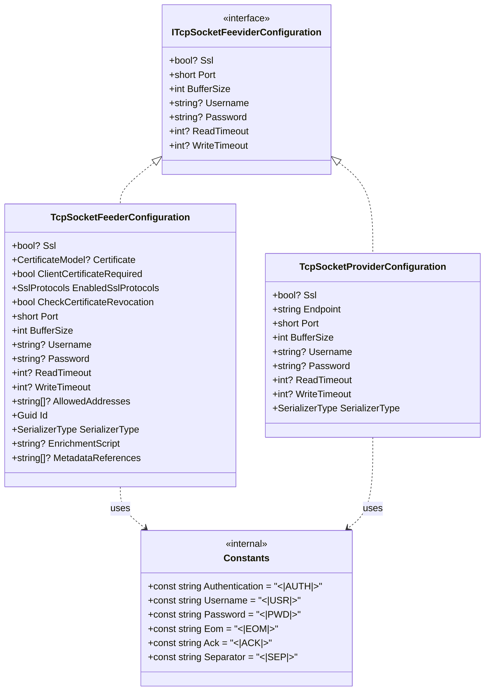

# ThunderPropagator.Feeviders.TcpSocket.SharedKernel

## Overview

**ThunderPropagator.Feeviders.TcpSocket.SharedKernel** provides common abstractions, configuration interfaces, and protocol constants shared between TCP Socket feeders (consumers/servers) and providers (publishers/clients). This shared kernel ensures consistent behavior, simplifies configuration management, and provides reusable components for TCP-based communication within the ThunderPropagator ecosystem.

### Key Components

- ✅ **ITcpSocketFeeviderConfiguration**: Shared configuration interface with connection, TLS, authentication, and timeout properties
- ✅ **Protocol Constants**: Standardized framing markers (EOM, AUTH, USR, PWD, SEP, ACK) for message boundary detection
- ✅ **Configuration Base Classes**: Feeder and provider configurations inherit shared properties
- ✅ **Type Safety**: Consistent property names and types across feeders and providers
- ✅ **Extensibility**: Easy addition of custom properties via inheritance
- ✅ **.NET 8/9/10**: Multi-targeted for latest runtime features

### Shared Configuration Philosophy

Both feeders and providers implement `ITcpSocketFeeviderConfiguration`, ensuring:
- **Connection settings**: Endpoint (feeder uses Port only, provider uses Endpoint+Port)
- **TLS/encryption**: Optional SSL/TLS with certificate validation
- **Authentication**: Username/password authentication protocol
- **Performance**: Configurable buffer sizes and timeouts
- **Consistency**: Same configuration model across all TCP Socket components

## Architecture



### Configuration Inheritance Hierarchy

```
ServiceConfiguration (BuildingBlocks)
    ├── AbstractFeederConfiguration
    │   └── TcpSocketFeederConfiguration (Feeders.TcpSocket)
    │       └── Concrete implementations (e.g., LogFeederConfig)
    └── AbstractProviderConfiguration
        └── TcpSocketProviderConfiguration (Providers.DotNet.TcpSocket)
            └── Concrete implementations (e.g., LogProviderConfig)

Both implement ITcpSocketFeeviderConfiguration (SharedKernel)
```

**Inherited Properties**:
- `Get<T>(T defaultValue)` / `Set<T>(T value)` — Type-safe property bag (ServiceConfiguration)
- Configuration binding from IConfiguration
- JSON serialization support
- OpenTelemetry integration (Activity, Baggage)

## Project Structure

### Files

| File | Lines | Responsibility |
|------|-------|----------------|
| **ITcpSocketFeeviderConfiguration.cs** | 15 | Shared configuration interface with common properties |
| **Constants.cs** | 12 | Protocol framing markers and delimiters |
| **AssemblyInfo.cs** | 5 | Assembly metadata and internals visibility |
| **Total** | **32** | **Complete shared kernel** |

### Dependencies

```xml
<PackageReference Include="ThunderPropagator.BuildingBlocks" Version="1.0.1-beta.2" />
```

**No external dependencies** — Pure interface and constants library.

## Configuration Properties

### ITcpSocketFeeviderConfiguration Interface

| Property | Type | Default | Description |
|----------|------|---------|-------------|
| **Connection** ||||
| `Port` | `short` | *Required* | TCP port number (1-65535). Feeder listens on this port, provider connects to remote port. |
| **Security** ||||
| `Ssl` | `bool?` | `false` | Enable TLS/SSL encryption. Feeder uses server certificate, provider validates server certificate. |
| **Performance** ||||
| `BufferSize` | `int` | `4096` | Read/write buffer size in bytes. Affects memory usage and I/O efficiency. |
| **Authentication** ||||
| `Username` | `string?` | `null` | Authentication username. Enables authentication protocol when both username and password provided. |
| `Password` | `string?` | `null` | Authentication password. Sent via custom protocol (`<|AUTH|><|USR|>...<|PWD|>...`). |
| **Timeouts** ||||
| `ReadTimeout` | `int?` | `Infinite` | Stream read timeout in milliseconds. Critical for feeders (detect hung clients). |
| `WriteTimeout` | `int?` | `Infinite` | Stream write timeout in milliseconds. Critical for providers (detect network issues). |

### Extended Properties (Feeder-Specific)

**TcpSocketFeederConfiguration** adds:

| Property | Type | Default | Description |
|----------|------|---------|-------------|
| **TLS/SSL (Server)** ||||
| `Certificate` | `CertificateModel?` | `null` | Server certificate for TLS. Required when `Ssl=true`. Loaded from file path or Windows certificate store. |
| `ClientCertificateRequired` | `bool` | `false` | Require client certificate for mutual TLS. |
| `EnabledSslProtocols` | `SslProtocols` | `Tls12` | Allowed TLS protocol versions (Tls12, Tls13, Tls12 \| Tls13). |
| `CheckCertificateRevocation` | `bool` | `false` | Check certificate revocation status (OCSP/CRL). Performance impact. |
| **Access Control** ||||
| `AllowedAddresses` | `string[]?` | `null` | IP address whitelist. If set, only specified IPs can connect. Example: `["192.168.1.100", "10.0.0.50"]` |
| **Feeder Base** ||||
| `Id` | `Guid` | Auto | Unique feeder identifier for resolver pattern |
| `SerializerType` | `SerializerType` | `Json` | Message deserialization format (Json, NJson, NetJson) |
| `EnrichmentScript` | `string?` | `null` | C# script for message enrichment (Roslyn-based) |
| `MetadataReferences` | `string[]?` | `null` | Assembly references for enrichment script |

### Extended Properties (Provider-Specific)

**TcpSocketProviderConfiguration** adds:

| Property | Type | Default | Description |
|----------|------|---------|-------------|
| **Connection** ||||
| `Endpoint` | `string` | *Required* | Target server hostname or IP address (e.g., "tcp.example.com", "192.168.1.100") |
| **Serialization** ||||
| `SerializerType` | `SerializerType` | `Json` | Message serialization format (Json, NJson, NetJson) |

## Protocol Constants

### Constants Class

```csharp
internal class Constants
{
    public const string Authentication = "<|AUTH|>";
    public const string Username = "<|USR|>";
    public const string Password = "<|PWD|>";
    public const string Eom = "<|EOM|>";
    public const string Ack = "<|ACK|>";
    public const string Separator = "<|SEP|>";
}
```

### Protocol Marker Reference

| Constant | Value | Purpose | Usage |
|----------|-------|---------|-------|
| `Authentication` | `<|AUTH|>` | Authentication header marker | Identifies authentication message: `<|AUTH|><|USR|>...<|PWD|>...` |
| `Username` | `<|USR|>` | Username field marker | Precedes username: `<|USR|>admin<|SEP|>` |
| `Password` | `<|PWD|>` | Password field marker | Precedes password: `<|PWD|>secret123` |
| `Separator` | `<|SEP|>` | Field separator | Separates username and password: `<|USR|>admin<|SEP|><|PWD|>...` |
| `Eom` | `<|EOM|>` | End-of-message delimiter | Marks message boundary: `{json-data}<|EOM|>` |
| `Ack` | `<|ACK|>` | Acknowledgment (reserved) | Future use for request/response patterns |

### Protocol Design Rationale

**Why Custom Markers?**
1. **Explicit boundaries**: TCP is stream-based, needs clear message delimiters
2. **Collision avoidance**: `<|...|>` pattern unlikely to appear in JSON/binary data
3. **Human-readable**: Easy to debug with network capture tools (Wireshark, tcpdump)
4. **Extensibility**: Can add new markers without breaking existing protocol
5. **Simplicity**: No length-prefix calculations, no escaping needed

**Alternatives Considered:**
- **Length-prefix**: `[4-byte length][payload]` — More efficient but harder to debug
- **Newline delimiter**: `\n` — Common in text protocols, but requires escaping in JSON strings
- **Null byte**: `\0` — Binary-safe but invisible in logs
- **Custom protocol buffer**: Protocol Buffers, MessagePack — Adds serialization dependency

**Security Considerations:**
- Markers are UTF-8 encoded (7 bytes each)
- Authentication markers sent in plaintext (use SSL/TLS)
- No encryption built into protocol (rely on TLS layer)
- Vulnerable to replay attacks if no TLS (credentials reusable)

## API Reference

### ITcpSocketFeeviderConfiguration Interface

```csharp
public interface ITcpSocketFeeviderConfiguration
{
    bool? Ssl { get; set; }
    short Port { get; set; }
    int BufferSize { get; set; }
    string? Username { get; set; }
    string? Password { get; set; }
    int? ReadTimeout { get; set; }
    int? WriteTimeout { get; set; }
}
```

**Implementing Classes:**
- `TcpSocketFeederConfiguration` (Feeders.TcpSocket)
- `TcpSocketProviderConfiguration` (Providers.DotNet.TcpSocket)

**Usage Example:**
```csharp
public class MyTcpConfig : TcpSocketProviderConfiguration
{
    // Inherits all ITcpSocketFeeviderConfiguration properties
    // Can add custom properties
    public int MaxRetries { get; set; } = 3;
}

// Configuration binding
var config = new MyTcpConfig();
configuration.GetSection("Messaging:TcpSocket").Bind(config);

Console.WriteLine($"Connecting to {config.Endpoint}:{config.Port}");
Console.WriteLine($"SSL enabled: {config.Ssl}");
Console.WriteLine($"Buffer size: {config.BufferSize} bytes");
```

### Constants Class Usage

```csharp
using ThunderPropagator.Feeviders.TcpSocket.SharedKernel;

// Build authentication message
var authMessage = $"{Constants.Authentication}" +
                 $"{Constants.Username}admin" +
                 $"{Constants.Separator}" +
                 $"{Constants.Password}secret123";

var authBytes = Encoding.UTF8.GetBytes(authMessage);
await stream.WriteAsync(authBytes);

// Send EOM marker
var eomBytes = Encoding.UTF8.GetBytes(Constants.Eom);
await stream.WriteAsync(eomBytes);
await stream.FlushAsync();

// Output: <|AUTH|><|USR|>admin<|SEP|><|PWD|>secret123<|EOM|>
```

## Examples

### Example 1: Basic Shared Configuration

**Use Case**: Configure feeder and provider with identical connection settings.

```csharp
// Shared configuration section
{
  "TcpSocket": {
    "Shared": {
      "Port": 9000,
      "Ssl": true,
      "BufferSize": 8192,
      "Username": "app-user",
      "Password": "${TCP_PASSWORD}",
      "ReadTimeout": 30000,
      "WriteTimeout": 30000
    }
  }
}

// Feeder configuration
public class SharedTcpFeederConfig : TcpSocketFeederConfiguration
{
    // Inherits ITcpSocketFeeviderConfiguration properties
    // Add feeder-specific properties
}

// Provider configuration
public class SharedTcpProviderConfig : TcpSocketProviderConfiguration
{
    // Inherits ITcpSocketFeeviderConfiguration properties
    // Add provider-specific properties (Endpoint)
}

// Binding
var feederConfig = new SharedTcpFeederConfig();
configuration.GetSection("TcpSocket:Shared").Bind(feederConfig);
feederConfig.Certificate = LoadCertificate("server.pfx");  // Feeder-specific

var providerConfig = new SharedTcpProviderConfig();
configuration.GetSection("TcpSocket:Shared").Bind(providerConfig);
providerConfig.Endpoint = "tcp-server.local";  // Provider-specific
```

**Benefits:**
- DRY principle: No duplicate configuration values
- Consistency: Same SSL, auth, timeouts across feeder/provider
- Maintainability: Change once, affects both components

### Example 2: Protocol Message Framing

**Use Case**: Implement custom framing parser using shared constants.

```csharp
using ThunderPropagator.Feeviders.TcpSocket.SharedKernel;

public class FrameParser
{
    private readonly byte[] _eomBytes;
    private readonly MemoryStream _buffer = new();
    
    public FrameParser()
    {
        _eomBytes = Encoding.UTF8.GetBytes(Constants.Eom);
    }
    
    public async Task<byte[]?> ReadFrameAsync(
        Stream stream,
        int bufferSize,
        CancellationToken cancellationToken)
    {
        var buffer = new byte[bufferSize];
        
        while (true)
        {
            int bytesRead = await stream.ReadAsync(buffer, cancellationToken);
            if (bytesRead == 0) return null;  // Connection closed
            
            _buffer.Write(buffer, 0, bytesRead);
            
            // Check for EOM marker
            if (EndsWithEom(_buffer.GetBuffer(), (int)_buffer.Length))
            {
                // Remove EOM from buffer
                var frameLength = (int)_buffer.Length - _eomBytes.Length;
                var frame = new byte[frameLength];
                Buffer.BlockCopy(_buffer.GetBuffer(), 0, frame, 0, frameLength);
                
                _buffer.SetLength(0);  // Reset buffer
                return frame;
            }
        }
    }
    
    private bool EndsWithEom(byte[] buffer, int length)
    {
        if (length < _eomBytes.Length) return false;
        
        for (int i = 0; i < _eomBytes.Length; i++)
        {
            if (buffer[length - _eomBytes.Length + i] != _eomBytes[i])
                return false;
        }
        
        return true;
    }
}

// Usage
var parser = new FrameParser();
var frame = await parser.ReadFrameAsync(networkStream, 4096, cancellationToken);
var message = Encoding.UTF8.GetString(frame);
```

**Performance Optimization (Span-based):**
```csharp
public class SpanFrameParser
{
    private readonly ReadOnlyMemory<byte> _eom;
    
    public SpanFrameParser()
    {
        _eom = Encoding.UTF8.GetBytes(Constants.Eom);
    }
    
    public async Task<byte[]> ReadFrameAsync(Stream stream, int bufferSize)
    {
        using var ms = new MemoryStream();
        var buffer = ArrayPool<byte>.Shared.Rent(bufferSize);
        
        try
        {
            while (true)
            {
                int bytesRead = await stream.ReadAsync(buffer.AsMemory(0, bufferSize));
                ms.Write(buffer, 0, bytesRead);
                
                if (ms.GetBuffer().AsSpan(0, (int)ms.Length).EndsWith(_eom.Span))
                {
                    ms.SetLength(ms.Length - _eom.Length);
                    return ms.ToArray();
                }
            }
        }
        finally
        {
            ArrayPool<byte>.Shared.Return(buffer);
        }
    }
}
```

### Example 3: Authentication Protocol Implementation

**Use Case**: Implement authentication handshake on both client and server.

```csharp
using ThunderPropagator.Feeviders.TcpSocket.SharedKernel;

// CLIENT SIDE (Provider)
public class TcpAuthenticatedClient
{
    private readonly string _username;
    private readonly string _password;
    
    public async Task ConnectAndAuthenticateAsync(
        TcpClient client,
        CancellationToken cancellationToken)
    {
        var stream = client.GetStream();
        
        // Build authentication message
        var authMessage = $"{Constants.Authentication}" +
                         $"{Constants.Username}{_username}" +
                         $"{Constants.Separator}" +
                         $"{Constants.Password}{_password}";
        
        var authBytes = Encoding.UTF8.GetBytes(authMessage);
        await stream.WriteAsync(authBytes, cancellationToken);
        
        // Send EOM
        var eomBytes = Encoding.UTF8.GetBytes(Constants.Eom);
        await stream.WriteAsync(eomBytes, cancellationToken);
        await stream.FlushAsync(cancellationToken);
        
        // Wait for ACK (optional)
        // var ackBytes = Encoding.UTF8.GetBytes(Constants.Ack);
        // await stream.ReadExactlyAsync(ackBytes, cancellationToken);
    }
}

// SERVER SIDE (Feeder)
public class TcpAuthenticatedServer
{
    private readonly string _expectedUsername;
    private readonly string _expectedPassword;
    private readonly byte[] _authPrefix;
    private readonly byte[] _usernamePrefix;
    private readonly byte[] _passwordPrefix;
    private readonly byte[] _separator;
    
    public TcpAuthenticatedServer(string username, string password)
    {
        _expectedUsername = username;
        _expectedPassword = password;
        
        // Pre-compute byte arrays
        _authPrefix = Encoding.UTF8.GetBytes(Constants.Authentication);
        _usernamePrefix = Encoding.UTF8.GetBytes(Constants.Username);
        _passwordPrefix = Encoding.UTF8.GetBytes(Constants.Password);
        _separator = Encoding.UTF8.GetBytes(Constants.Separator);
    }
    
    public bool ValidateAuthentication(ReadOnlySpan<byte> messageBytes)
    {
        // 1. Check for authentication prefix
        if (!messageBytes.StartsWith(_authPrefix))
            return false;
        
        var authData = messageBytes[_authPrefix.Length..];
        
        // 2. Find separator
        int separatorIndex = authData.IndexOf(_separator);
        if (separatorIndex == -1) return false;
        
        // 3. Extract username and password parts
        var usernamePart = authData[..separatorIndex];
        var passwordPart = authData[(separatorIndex + _separator.Length)..];
        
        // 4. Validate username prefix
        if (!usernamePart.StartsWith(_usernamePrefix))
            return false;
        
        // 5. Validate password prefix
        if (!passwordPart.StartsWith(_passwordPrefix))
            return false;
        
        // 6. Extract credentials
        var username = usernamePart[_usernamePrefix.Length..];
        var password = passwordPart[_passwordPrefix.Length..];
        
        // 7. Compare with expected credentials
        return username.SequenceEqual(Encoding.UTF8.GetBytes(_expectedUsername)) &&
               password.SequenceEqual(Encoding.UTF8.GetBytes(_expectedPassword));
    }
}

// Usage
var server = new TcpAuthenticatedServer("admin", "secret123");

// Read first message (authentication)
var frame = await parser.ReadFrameAsync(stream, 4096, cancellationToken);

if (server.ValidateAuthentication(frame))
{
    Console.WriteLine("Authentication successful");
    // Continue processing subsequent messages
}
else
{
    Console.WriteLine("Authentication failed");
    client.Close();
}
```

**Security Enhancements:**
```csharp
// Hash-based authentication (avoid plaintext passwords)
public class SecureAuthServer
{
    private readonly byte[] _expectedPasswordHash;
    
    public SecureAuthServer(string password)
    {
        // Store SHA256 hash instead of plaintext
        _expectedPasswordHash = SHA256.HashData(Encoding.UTF8.GetBytes(password));
    }
    
    public bool ValidateAuthentication(ReadOnlySpan<byte> password)
    {
        var passwordHash = SHA256.HashData(password);
        return passwordHash.SequenceEqual(_expectedPasswordHash);
    }
}
```

### Example 4: TLS/SSL Certificate Configuration

**Use Case**: Configure server and client certificates for mutual TLS.

```csharp
// SERVER CONFIGURATION (Feeder)
{
  "TcpFeeder": {
    "Port": 9443,
    "Ssl": true,
    "Certificate": {
      "Path": "C:\\Certificates\\server.pfx",
      "Password": "${CERT_PASSWORD}"
    },
    "ClientCertificateRequired": true,
    "EnabledSslProtocols": "Tls12, Tls13",
    "CheckCertificateRevocation": false
  }
}

// CLIENT CONFIGURATION (Provider)
{
  "TcpProvider": {
    "Endpoint": "secure-server.local",
    "Port": 9443,
    "Ssl": true
  }
}

// Certificate loading (server side)
public class CertificateLoader
{
    public static X509Certificate2 LoadFromFile(
        string path,
        string? password = null)
    {
        return new X509Certificate2(
            path,
            password,
            X509KeyStorageFlags.MachineKeySet | X509KeyStorageFlags.PersistKeySet);
    }
    
    public static X509Certificate2 LoadFromStore(
        string thumbprint,
        StoreLocation location = StoreLocation.LocalMachine)
    {
        using var store = new X509Store(StoreName.My, location);
        store.Open(OpenFlags.ReadOnly);
        
        var certs = store.Certificates.Find(
            X509FindType.FindByThumbprint,
            thumbprint,
            validOnly: true);
        
        if (certs.Count == 0)
            throw new InvalidOperationException($"Certificate not found: {thumbprint}");
        
        return certs[0];
    }
}

// Usage
var config = new TcpSocketFeederConfiguration();
configuration.GetSection("TcpFeeder").Bind(config);

config.Certificate = new CertificateModel
{
    Path = config.Certificate.Path,
    Password = Environment.GetEnvironmentVariable("CERT_PASSWORD"),
    Certificate = CertificateLoader.LoadFromFile(
        config.Certificate.Path,
        Environment.GetEnvironmentVariable("CERT_PASSWORD"))
};
```

**Certificate Generation (OpenSSL):**
```bash
# Generate self-signed server certificate
openssl req -x509 -newkey rsa:4096 -keyout server-key.pem -out server-cert.pem -days 365 -nodes -subj "/CN=secure-server.local"

# Convert to PFX (Windows-compatible)
openssl pkcs12 -export -out server.pfx -inkey server-key.pem -in server-cert.pem -password pass:YourPassword

# Generate client certificate for mutual TLS
openssl req -x509 -newkey rsa:4096 -keyout client-key.pem -out client-cert.pem -days 365 -nodes -subj "/CN=tcp-client"
openssl pkcs12 -export -out client.pfx -inkey client-key.pem -in client-cert.pem -password pass:ClientPassword
```

### Example 5: IP Address Whitelisting

**Use Case**: Restrict TCP feeder to accept connections only from specific IPs.

```csharp
// Configuration
{
  "TcpFeeder": {
    "Port": 9000,
    "AllowedAddresses": [
      "192.168.1.100",
      "192.168.1.101",
      "10.0.0.50"
    ]
  }
}

// Feeder implementation
public class WhitelistTcpFeeder
{
    private readonly string[] _allowedAddresses;
    
    public WhitelistTcpFeeder(TcpSocketFeederConfiguration config)
    {
        _allowedAddresses = config.AllowedAddresses ?? Array.Empty<string>();
    }
    
    private bool CheckAllowance(EndPoint? endPoint)
    {
        // No whitelist = allow all
        if (_allowedAddresses.Length == 0)
            return true;
        
        // Extract IP address from endpoint
        if (endPoint is not IPEndPoint ipEndPoint)
            return false;
        
        var clientIp = ipEndPoint.Address.ToString();
        
        // Check against whitelist
        return _allowedAddresses.Contains(clientIp);
    }
    
    public async Task AcceptConnectionAsync(TcpListener listener)
    {
        var client = await listener.AcceptTcpClientAsync();
        
        if (!CheckAllowance(client.Client.RemoteEndPoint))
        {
            var remoteIp = ((IPEndPoint)client.Client.RemoteEndPoint!).Address;
            _logger.LogWarning(
                "Connection rejected from {RemoteIp} (not in whitelist)",
                remoteIp);
            
            client.Close();
            return;
        }
        
        // Process connection...
    }
}
```

**Dynamic Whitelist Updates:**
```csharp
public class DynamicWhitelistFeeder
{
    private readonly HashSet<string> _allowedAddresses = new();
    private readonly ReaderWriterLockSlim _lock = new();
    
    public void AddAllowedAddress(string ipAddress)
    {
        _lock.EnterWriteLock();
        try
        {
            _allowedAddresses.Add(ipAddress);
            _logger.LogInformation("Added {IpAddress} to whitelist", ipAddress);
        }
        finally
        {
            _lock.ExitWriteLock();
        }
    }
    
    public void RemoveAllowedAddress(string ipAddress)
    {
        _lock.EnterWriteLock();
        try
        {
            _allowedAddresses.Remove(ipAddress);
            _logger.LogInformation("Removed {IpAddress} from whitelist", ipAddress);
        }
        finally
        {
            _lock.ExitWriteLock();
        }
    }
    
    private bool CheckAllowance(IPEndPoint endPoint)
    {
        _lock.EnterReadLock();
        try
        {
            return _allowedAddresses.Count == 0 ||
                   _allowedAddresses.Contains(endPoint.Address.ToString());
        }
        finally
        {
            _lock.ExitReadLock();
        }
    }
}
```

### Example 6: Timeout Configuration Patterns

**Use Case**: Configure different timeouts for different scenarios.

```csharp
// Development (lenient timeouts)
{
  "TcpSocket": {
    "Development": {
      "ReadTimeout": null,     // Infinite (no timeout)
      "WriteTimeout": null     // Infinite (no timeout)
    }
  }
}

// Production (strict timeouts)
{
  "TcpSocket": {
    "Production": {
      "ReadTimeout": 30000,    // 30 seconds
      "WriteTimeout": 10000    // 10 seconds
    }
  }
}

// High-latency WAN (generous timeouts)
{
  "TcpSocket": {
    "Wan": {
      "ReadTimeout": 120000,   // 2 minutes
      "WriteTimeout": 60000    // 1 minute
    }
  }
}

// Real-time IoT (aggressive timeouts)
{
  "TcpSocket": {
    "IoT": {
      "ReadTimeout": 5000,     // 5 seconds
      "WriteTimeout": 3000     // 3 seconds
    }
  }
}

// Timeout handling
public class TimeoutAwareTcpClient
{
    public async Task SendWithTimeoutAsync(
        Stream stream,
        byte[] data,
        int timeoutMs)
    {
        using var cts = new CancellationTokenSource(timeoutMs);
        
        try
        {
            await stream.WriteAsync(data, cts.Token);
            await stream.FlushAsync(cts.Token);
        }
        catch (OperationCanceledException)
        {
            throw new TimeoutException(
                $"Write operation timed out after {timeoutMs}ms");
        }
    }
}
```

### Example 7: Buffer Size Optimization

**Use Case**: Tune buffer sizes for different message patterns.

```csharp
// Configuration profiles
public class BufferSizeProfiles
{
    public static readonly Dictionary<string, int> Profiles = new()
    {
        // Small messages (IoT sensors, telemetry)
        ["SmallMessages"] = 1024,      // 1KB
        
        // Medium messages (API requests, logs)
        ["MediumMessages"] = 4096,     // 4KB (default)
        
        // Large messages (file transfers, images)
        ["LargeMessages"] = 16384,     // 16KB
        
        // Huge messages (video streams, bulk data)
        ["HugeMessages"] = 65536,      // 64KB
        
        // Memory-constrained (embedded systems)
        ["Constrained"] = 512,         // 512 bytes
    };
}

// Configuration
{
  "TcpSocket": {
    "Telemetry": {
      "BufferSize": 1024,    // Small messages
      "Comment": "IoT sensor data (100-500 bytes per message)"
    },
    "Logging": {
      "BufferSize": 4096,    // Medium messages
      "Comment": "Structured logs (1-2KB per message)"
    },
    "FileTransfer": {
      "BufferSize": 65536,   // Large buffers
      "Comment": "Bulk data transfer (maximized throughput)"
    }
  }
}

// Dynamic buffer tuning
public class AdaptiveBufferSizeTcpClient
{
    private int _currentBufferSize = 4096;
    private int _messagesSent = 0;
    private long _totalBytes = 0;
    
    public async Task SendAsync(byte[] data)
    {
        _messagesSent++;
        _totalBytes += data.Length;
        
        // Calculate average message size
        long avgMessageSize = _totalBytes / _messagesSent;
        
        // Adjust buffer size every 100 messages
        if (_messagesSent % 100 == 0)
        {
            _currentBufferSize = avgMessageSize switch
            {
                < 1024 => 1024,
                < 4096 => 4096,
                < 16384 => 16384,
                _ => 65536
            };
            
            _logger.LogInformation(
                "Adjusted buffer size to {BufferSize} based on avg message size {AvgSize}",
                _currentBufferSize, avgMessageSize);
        }
        
        // Use current buffer size
        await WriteChunkedAsync(data, _currentBufferSize);
    }
}
```

### Example 8: Custom Protocol Extensions

**Use Case**: Extend protocol with custom markers for application-specific needs.

```csharp
// Custom constants (extends SharedKernel)
public static class CustomConstants
{
    // Standard markers (from SharedKernel)
    public const string Eom = Constants.Eom;
    public const string Auth = Constants.Authentication;
    
    // Custom markers
    public const string Priority = "<|PRI|>";       // Message priority
    public const string Compression = "<|COMP|>";   // Compression flag
    public const string Encryption = "<|ENC|>";     // Encryption metadata
    public const string Checksum = "<|CRC|>";       // Checksum/CRC
    public const string Timestamp = "<|TS|>";       // Timestamp
}

// Extended message format
public class ExtendedTcpMessage
{
    public byte Priority { get; set; }
    public bool Compressed { get; set; }
    public byte[] Payload { get; set; }
    public uint Checksum { get; set; }
    public DateTime Timestamp { get; set; }
    
    public byte[] Serialize()
    {
        using var ms = new MemoryStream();
        using var writer = new BinaryWriter(ms);
        
        // Priority header
        writer.Write(Encoding.UTF8.GetBytes(CustomConstants.Priority));
        writer.Write(Priority);
        
        // Compression header
        if (Compressed)
        {
            writer.Write(Encoding.UTF8.GetBytes(CustomConstants.Compression));
            writer.Write(true);
        }
        
        // Timestamp header
        writer.Write(Encoding.UTF8.GetBytes(CustomConstants.Timestamp));
        writer.Write(Timestamp.ToBinary());
        
        // Payload
        writer.Write(Payload);
        
        // Checksum footer
        var checksum = CalculateCrc32(Payload);
        writer.Write(Encoding.UTF8.GetBytes(CustomConstants.Checksum));
        writer.Write(checksum);
        
        // EOM marker (standard)
        writer.Write(Encoding.UTF8.GetBytes(Constants.Eom));
        
        return ms.ToArray();
    }
}

// Network traffic example
// <|PRI|>5<|COMP|>true<|TS|>638396800000000000{payload}<|CRC|>0x12345678<|EOM|>
```

## Configuration Patterns

### Pattern 1: Multi-Environment Configuration

```csharp
// appsettings.json (base)
{
  "TcpSocket": {
    "Port": 9000,
    "BufferSize": 4096,
    "SerializerType": "Json"
  }
}

// appsettings.Development.json
{
  "TcpSocket": {
    "Ssl": false,
    "ReadTimeout": null,
    "WriteTimeout": null,
    "Username": null,
    "Password": null
  }
}

// appsettings.Production.json
{
  "TcpSocket": {
    "Ssl": true,
    "ReadTimeout": 30000,
    "WriteTimeout": 10000,
    "Username": "prod-user",
    "Password": "${TCP_PASSWORD}",
    "Certificate": {
      "Path": "C:\\Certificates\\prod-server.pfx",
      "Password": "${CERT_PASSWORD}"
    },
    "AllowedAddresses": [
      "10.0.1.100",
      "10.0.1.101"
    ]
  }
}
```

### Pattern 2: Configuration Validation

```csharp
public class TcpConfigValidator
{
    public static void Validate(ITcpSocketFeeviderConfiguration config)
    {
        // Port range
        if (config.Port < 1 || config.Port > 65535)
            throw new ArgumentOutOfRangeException(nameof(config.Port), 
                "Port must be between 1 and 65535");
        
        // Buffer size
        if (config.BufferSize < 512 || config.BufferSize > 1024 * 1024)
            throw new ArgumentOutOfRangeException(nameof(config.BufferSize),
                "BufferSize must be between 512 bytes and 1MB");
        
        // Authentication
        if (!string.IsNullOrEmpty(config.Username) && string.IsNullOrEmpty(config.Password))
            throw new InvalidOperationException(
                "Password required when Username is provided");
        
        if (!string.IsNullOrEmpty(config.Password) && string.IsNullOrEmpty(config.Username))
            throw new InvalidOperationException(
                "Username required when Password is provided");
        
        // Timeouts
        if (config.ReadTimeout < 1000 && config.ReadTimeout != null)
            throw new ArgumentOutOfRangeException(nameof(config.ReadTimeout),
                "ReadTimeout must be at least 1000ms (1 second) or null for infinite");
        
        if (config.WriteTimeout < 1000 && config.WriteTimeout != null)
            throw new ArgumentOutOfRangeException(nameof(config.WriteTimeout),
                "WriteTimeout must be at least 1000ms (1 second) or null for infinite");
    }
}

// Usage in constructor
public TcpSocketProvider(TcpSocketProviderConfiguration config)
{
    TcpConfigValidator.Validate(config);
    _config = config;
}
```

### Pattern 3: Configuration Builder

```csharp
public class TcpConfigBuilder
{
    private readonly TcpSocketProviderConfiguration _config = new();
    
    public TcpConfigBuilder WithEndpoint(string endpoint, short port)
    {
        _config.Endpoint = endpoint;
        _config.Port = port;
        return this;
    }
    
    public TcpConfigBuilder WithSsl(bool enabled = true)
    {
        _config.Ssl = enabled;
        return this;
    }
    
    public TcpConfigBuilder WithAuthentication(string username, string password)
    {
        _config.Username = username;
        _config.Password = password;
        return this;
    }
    
    public TcpConfigBuilder WithBufferSize(int size)
    {
        _config.BufferSize = size;
        return this;
    }
    
    public TcpConfigBuilder WithTimeouts(int readMs, int writeMs)
    {
        _config.ReadTimeout = readMs;
        _config.WriteTimeout = writeMs;
        return this;
    }
    
    public TcpSocketProviderConfiguration Build()
    {
        TcpConfigValidator.Validate(_config);
        return _config;
    }
}

// Usage
var config = new TcpConfigBuilder()
    .WithEndpoint("tcp.example.com", 9443)
    .WithSsl()
    .WithAuthentication("admin", "secret")
    .WithBufferSize(8192)
    .WithTimeouts(30000, 10000)
    .Build();
```

## Best Practices

### 1. Configuration Management

**✅ DO:**
- Store credentials in environment variables or Azure Key Vault
- Use separate configurations for dev/staging/production
- Validate configuration on startup
- Document required vs optional properties

**❌ DON'T:**
- Hardcode passwords in appsettings.json
- Use same configuration across environments
- Ignore configuration validation errors
- Store certificates in source control

### 2. Protocol Design

**✅ DO:**
- Always use EOM markers for message boundaries
- Implement authentication when credentials provided
- Use TLS/SSL for production
- Log protocol errors for debugging

**❌ DON'T:**
- Rely on TCP packet boundaries (stream-based)
- Send credentials without TLS
- Mix different framing strategies
- Ignore authentication failures silently

### 3. Performance

**✅ DO:**
- Use appropriate buffer sizes for message patterns
- Implement connection pooling
- Monitor timeout thresholds
- Profile memory allocations

**❌ DON'T:**
- Use tiny buffers (<512 bytes)
- Create new connections per message
- Set infinite timeouts in production
- Ignore GC pressure

### 4. Security

**✅ DO:**
- Enable SSL/TLS in production
- Validate server certificates
- Use IP whitelisting when possible
- Rotate credentials regularly

**❌ DON'T:**
- Send passwords in plaintext (no TLS)
- Disable certificate validation
- Allow all IPs in production
- Use weak/default passwords

## See Also

### Related Documentation

- [TcpSocket System Overview](../README.md) — Complete TCP Socket integration guide
- [Feeders.TcpSocket](../Feeders.TcpSocket/README.md) — TCP server implementation (message consumption)
- [Providers.DotNet.TcpSocket](../Providers.DotNet.TcpSocket/README.md) — TCP client implementation (message publishing)
- [SharedKernel Overview](../../SharedKernel/README.md) — Core abstractions documentation

### External Resources

- [TCP/IP Protocol Suite](https://datatracker.ietf.org/doc/html/rfc793)
- [TLS 1.2 Specification](https://datatracker.ietf.org/doc/html/rfc5246)
- [TLS 1.3 Specification](https://datatracker.ietf.org/doc/html/rfc8446)
- [X.509 Certificates](https://datatracker.ietf.org/doc/html/rfc5280)
- [Network Stream Protocol Design](https://en.wikipedia.org/wiki/Framing_(networking))

### Framework Documentation

- [ThunderPropagator Documentation](../../README.md) — Framework overview
- [Configuration System](https://learn.microsoft.com/en-us/dotnet/core/extensions/configuration)
- [Dependency Injection](https://learn.microsoft.com/en-us/dotnet/core/extensions/dependency-injection)

---

**Last Updated**: December 29, 2025  
**Version**: 1.0.1-beta.2  
**Maintainer**: ThunderPropagator Team
