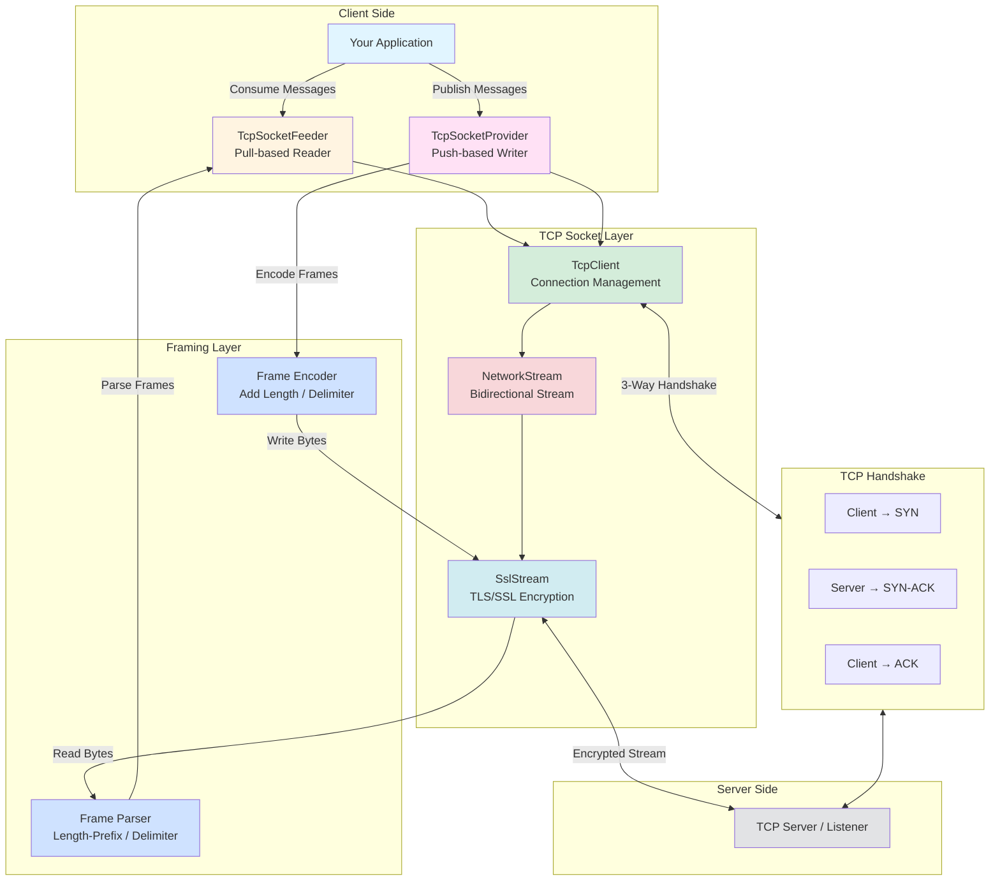

# ThunderPropagator TcpSocket System

## Overview

The **ThunderPropagator TcpSocket** system provides low-level TCP socket communication for .NET applications, enabling both message consumption (Feeders) and publishing (Providers) via reliable stream-oriented connections. Built on `System.Net.Sockets.TcpClient` and `NetworkStream`, this system offers fine-grained control over network communication with support for custom framing protocols, TLS/SSL encryption, and advanced socket options.

TcpSocket implements the **Transmission Control Protocol (RFC 793)**, providing:
- **Connection-oriented**: Three-way handshake (SYN, SYN-ACK, ACK) establishes reliable connection
- **Reliable delivery**: Automatic retransmission, acknowledgments (ACK), sequence numbers
- **Ordered packets**: Guaranteed in-order delivery via sequence numbers
- **Flow control**: Window-based mechanism prevents receiver overflow
- **Congestion control**: Slow start, congestion avoidance, fast retransmit/recovery

### Key Features

#### 🔌 TCP Protocol Support
- **Connection Management**: Persistent connections, connection pooling, reconnection logic
- **Framing Strategies**: Length-prefix, delimiter-based, fixed-size, custom protocols
- **Socket Options**: NoDelay (Nagle), KeepAlive, Linger, buffer sizing
- **TLS/SSL Encryption**: SslStream wrapper, mutual TLS, certificate validation

#### 📦 Framing Protocols
- **Length-Prefix**: 1/2/4-byte header indicating payload length (big-endian or little-endian)
- **Delimiter-Based**: Message boundaries marked by delimiter byte sequence (\n, \r\n, 0x00, custom)
- **Fixed-Size**: Read fixed number of bytes per message (1KB chunks, 64-byte records)
- **Custom**: User-defined framing logic (HTTP-like headers, binary protocols, ASN.1)

#### 🛡️ Socket Options
- **NoDelay** (Nagle algorithm): `true` = disable buffering (low latency), `false` = buffer small writes (throughput)
- **KeepAlive**: Enable TCP keep-alive probes to detect broken connections without data transfer
- **Linger**: Control graceful close behavior (wait for pending data or abort immediately)
- **Buffer Sizing**: Configure OS-level send/receive buffers (8KB-64KB typical)

#### 🔐 TLS/SSL Security
- **Encryption**: SslStream wrapper around NetworkStream (TLS 1.2, TLS 1.3)
- **Certificate Validation**: Server certificate validation (issuer, expiration, hostname)
- **Mutual TLS**: Client certificate authentication (both parties authenticate)
- **Cipher Suites**: Modern algorithms (AES-GCM, ChaCha20-Poly1305)

#### ⚡ Performance Characteristics
- **Low Latency**: Direct socket access (< 1ms overhead typical)
- **Binary Protocols**: Compact encodings (Protobuf, MessagePack, custom binary)
- **Connection Pooling**: Reuse sockets for high throughput
- **Zero-Copy**: Direct buffer manipulation (Span<byte>, Memory<byte>)

## Architecture

The TcpSocket system follows a **bidirectional stream architecture** with explicit framing:



### Component Responsibilities

#### TcpSocketFeeder (Message Consumer)
- **Pull-based reading** from TCP stream (IterativeFeeder pattern)
- **Frame parsing**: Extract messages from byte stream using configured strategy
- **Reconnection logic**: Automatic reconnection on connection loss
- **Backpressure handling**: Pause reading if consumer slow

#### TcpSocketProvider (Message Publisher)
- **Push-based writing** to TCP stream (AbstractProvider pattern)
- **Frame encoding**: Prepend length headers or append delimiters
- **Connection pooling**: Reuse sockets for throughput
- **Batching**: Combine multiple messages (reduce sys calls)

#### TcpClient
- **Connection management**: Connect, disconnect, reconnect
- **Socket options**: NoDelay, KeepAlive, Linger, buffers
- **NetworkStream**: Provides read/write stream over socket

#### SslStream (Optional)
- **TLS encryption**: Wrap NetworkStream for encrypted communication
- **Certificate validation**: Server cert verification
- **Mutual TLS**: Client cert authentication

#### Frame Parser/Encoder
- **Length-Prefix**: Read 1/2/4-byte length header, then read N bytes
- **Delimiter**: Scan for delimiter byte sequence, extract message
- **Fixed-Size**: Read fixed N bytes per message
- **Custom**: User-defined parsing/encoding logic

## Performance Characteristics

### Latency
TCP provides low-latency communication compared to higher-level protocols:

```
┌─────────────────────────────────────────────────────────┐
│  Protocol Latency Comparison (same-host)                │
├─────────────────────────────────────────────────────────┤
│  TCP Socket (localhost)        │█ 0.1ms                 │
│  UDP Socket (localhost)        │█ 0.08ms                │
│  Named Pipes (Windows)         │██ 0.2ms                │
│  Unix Domain Sockets           │█ 0.1ms                 │
│  HTTP/1.1 (localhost)          │████ 1ms                │
│  gRPC (HTTP/2, localhost)      │██ 0.5ms                │
│  WebSocket (localhost)         │███ 0.8ms               │
└─────────────────────────────────────────────────────────┘

Network latency (WAN):
  TCP Socket (cross-region)      50-200ms (RTT + handshake)
  HTTP/REST (cross-region)       50-200ms (RTT + handshake + HTTP)
  WebSocket (cross-region)       50-200ms (RTT + handshake + WS handshake)
```

### Throughput
TCP throughput depends on network bandwidth, packet loss, and congestion:

**Local Network (Gigabit Ethernet)**:
- **Theoretical Max**: 125 MB/s (1 Gbps / 8)
- **Typical TCP**: 110-115 MB/s (overhead: IP/TCP headers ~5%)
- **With TLS**: 80-90 MB/s (encryption/decryption overhead)

**Internet (Broadband)**:
- **Bandwidth-limited**: Depends on ISP (10 Mbps → 1.25 MB/s)
- **Latency-limited**: High RTT reduces effective throughput (TCP window size)

**Optimization**:
- **Large buffers**: Increase SO_SNDBUF, SO_RCVBUF (8KB → 64KB)
- **NoDelay**: Disable Nagle for interactive protocols (low latency)
- **Batching**: Combine small writes (reduce sys calls, improve throughput)

### TCP vs UDP

| Feature | TCP | UDP |
|---------|-----|-----|
| **Connection** | Connection-oriented (handshake) | Connectionless (no handshake) |
| **Reliability** | Guaranteed delivery (ACK, retransmit) | Best-effort (packets may be lost) |
| **Ordering** | In-order delivery (sequence numbers) | No ordering guarantee |
| **Flow Control** | Yes (window-based) | No |
| **Congestion Control** | Yes (slow start, congestion avoidance) | No |
| **Overhead** | Higher (20-byte header + retransmits) | Lower (8-byte header, no retransmits) |
| **Latency** | Higher (handshake, ACKs) | Lower (no handshake, no ACKs) |
| **Use Cases** | File transfer, HTTP, database, RPC | Video streaming, gaming, VoIP, DNS |

**When to Use TCP**:
✅ Reliable delivery required (no data loss)  
✅ Ordered delivery needed (sequence matters)  
✅ Connection-oriented (session state)  
✅ File transfer, database connections, RPCs  

**When to Use UDP**:
✅ Low latency critical (real-time)  
✅ Loss tolerance acceptable (video, audio)  
✅ Broadcast/multicast (multiple receivers)  
✅ Gaming, VoIP, streaming, DNS queries  

## Project Catalog

### Feeders (Message Consumers)
- **[ThunderPropagator.Feeders.TcpSocket](Feeders.TcpSocket/README.md)**: Pull-based TCP reading
  - Iterative feeder with framing strategies
  - Length-prefix, delimiter, fixed-size framing
  - TLS/SSL encryption, socket options
  - Reconnection logic, keep-alive

### Providers (Message Publishers)
- **[ThunderPropagator.Providers.DotNet.TcpSocket](Providers.DotNet.TcpSocket/README.md)**: Push-based TCP writing
  - AbstractProvider with framing
  - Connection pooling for throughput
  - Batching, buffer tuning
  - TLS/SSL, mutual authentication

### Shared Kernel
- **[ThunderPropagator.Feeviders.TcpSocket.SharedKernel](Feeviders.TcpSocket.SharedKernel/README.md)**: Shared utilities
  - Configuration base classes
  - Framing strategy implementations
  - Socket helpers, connection pooling
  - TLS certificate validation

## Quick Start

### Install Package
```bash
dotnet add package ThunderPropagator.Feeders.TcpSocket
dotnet add package ThunderPropagator.Providers.DotNet.TcpSocket
```

### Configuration (appsettings.json)
```json
{
  "TcpSocket": {
    "Feeder": {
      "Id": "tcp-server-feeder",
      "Host": "localhost",
      "Port": 8080,
      "BufferSize": 8192,
      "NoDelay": true,
      "KeepAlive": {
        "Enabled": true,
        "Interval": "00:01:00",
        "RetryCount": 3
      },
      "FramingStrategy": "LengthPrefix",
      "FrameLengthFieldSize": 4,
      "MaxFrameSize": 1048576,
      "Tls": {
        "Enabled": false
      },
      "SerializerType": "Json"
    },
    "Provider": {
      "Host": "localhost",
      "Port": 8080,
      "BufferSize": 8192,
      "NoDelay": true,
      "FramingStrategy": "LengthPrefix",
      "FrameLengthFieldSize": 4,
      "SerializerType": "Json"
    }
  }
}
```

### Register Services
```csharp
using ThunderPropagator.Feeders.TcpSocket;
using ThunderPropagator.Providers.DotNet.TcpSocket;

var builder = WebApplication.CreateBuilder(args);

// Register TcpSocket Feeder (read from server)
builder.Services.AddTcpSocketFeeder<DataChannel, DataMessage, DataFeederConfig>(
    builder.Configuration,
    "TcpSocket:Feeder"
);

// Register TcpSocket Provider (write to server)
builder.Services.AddTcpSocketProvider<DataMessage, DataProviderConfig>(
    builder.Configuration,
    "TcpSocket:Provider"
);

var app = builder.Build();
```

### Define Message Classes
```csharp
// Feeder message (incoming from TCP)
public sealed class DataMessage : TcpSocketFeederMessage
{
    public required string MessageType { get; init; }
    public required object Payload { get; init; }
    public required DateTime Timestamp { get; init; }
}

// Feeder configuration
public sealed class DataFeederConfig : TcpSocketFeederConfiguration
{
    // Inherits Host, Port, Framing, TLS, etc.
}

// Provider message (outgoing to TCP)
public sealed class EventMessage : TcpSocketProviderMessage
{
    public required string EventType { get; init; }
    public required string Source { get; init; }
    public required object Data { get; init; }
}

// Provider configuration
public sealed class EventProviderConfig : TcpSocketProviderConfiguration
{
    // Inherits Host, Port, Framing, TLS, etc.
}
```

### Consume Messages (Feeder)
```csharp
public class DataProcessor : BackgroundService
{
    private readonly IFeeder<DataChannel, DataMessage, DataFeederConfig> _feeder;
    private readonly ILogger<DataProcessor> _logger;

    protected override async Task ExecuteAsync(CancellationToken stoppingToken)
    {
        await foreach (var message in _feeder.ReceiveAsync(stoppingToken))
        {
            _logger.LogInformation(
                "Received: {Type} from {Source}",
                message.Message.MessageType,
                message.Message.RemoteEndPoint
            );
            
            await ProcessDataAsync(message.Message);
            await message.AcknowledgeAsync();
        }
    }
}
```

### Publish Messages (Provider)
```csharp
public class EventPublisher
{
    private readonly IProvider<EventMessage, EventProviderConfig> _provider;

    public async Task PublishEventAsync(string eventType, object data)
    {
        var message = new EventMessage
        {
            EventType = eventType,
            Source = Environment.MachineName,
            Data = data
        };

        await _provider.ExecuteAsync(message);
        // Provider handles framing, serialization, sending automatically
    }
}
```

## TCP Concepts

### Three-Way Handshake
TCP establishes connection via three-way handshake:

```
Client                          Server
  │                               │
  │───── SYN (seq=100) ──────────>│  1. Client sends SYN (synchronize)
  │                               │     seq = initial sequence number
  │                               │
  │<──── SYN-ACK (seq=300, ───────│  2. Server responds SYN-ACK
  │      ack=101)                 │     ack = client seq + 1
  │                               │
  │───── ACK (ack=301) ──────────>│  3. Client sends ACK
  │                               │     ack = server seq + 1
  │                               │
  │<══════ Connected ════════════>│  Connection established
```

**Overhead**: ~1 RTT (round-trip time) before data transfer begins

### Socket Options

#### NoDelay (Nagle Algorithm)
**Purpose**: Buffer small writes to reduce packet count (improve network efficiency)

**Enabled** (NoDelay = false, default):
- Small writes buffered (up to MSS ~1460 bytes or 200ms delay)
- Reduces packet count (fewer ACKs, lower overhead)
- **Use case**: Bulk data transfer, file downloads

**Disabled** (NoDelay = true):
- Small writes sent immediately (no buffering)
- Increases packet count (more overhead)
- **Use case**: Interactive protocols (SSH, gaming, RPC), low latency required

**Example**:
```csharp
// Interactive protocol (SSH-like)
socket.NoDelay = true; // Send small commands immediately

// Bulk transfer (file download)
socket.NoDelay = false; // Buffer small writes
```

#### KeepAlive
**Purpose**: Detect broken connections without data transfer (idle connections)

**How it Works**:
1. Connection idle for `KeepAliveInterval` (e.g., 60 seconds)
2. Send TCP keep-alive probe (empty packet)
3. If no ACK after `KeepAliveRetryCount` probes (e.g., 3) → Connection dead

**Configuration**:
```json
{
  "KeepAlive": {
    "Enabled": true,
    "Interval": "00:01:00",
    "RetryCount": 3
  }
}
```

**Use Cases**:
- Long-lived connections (database, message queue)
- Detect network failures (router crash, cable unplug)
- NAT/firewall timeout prevention (keep NAT mapping alive)

#### Linger
**Purpose**: Control behavior when closing socket with pending data

**Modes**:
- **Linger Off** (default): Close immediately, pending data sent in background (graceful close attempt)
- **Linger On, Time = 0**: Abort connection (RST), discard pending data
- **Linger On, Time > 0**: Wait up to N seconds for pending data to send, then close

**Example**:
```csharp
// Graceful close (default)
socket.LingerState = new LingerOption(false, 0);

// Abort immediately (RST)
socket.LingerState = new LingerOption(true, 0);

// Wait up to 10 seconds for pending data
socket.LingerState = new LingerOption(true, 10);
```

#### Buffer Sizing
**Purpose**: Tune OS-level send/receive buffers

**Defaults**:
- **Windows**: 8 KB send buffer, 8 KB receive buffer
- **Linux**: Configurable via `sysctl` (default ~128 KB)

**Tuning**:
```csharp
socket.SendBufferSize = 65536;    // 64 KB send buffer
socket.ReceiveBufferSize = 65536; // 64 KB receive buffer
```

**Guidelines**:
- **High-throughput**: Increase buffers (64 KB - 256 KB)
- **Low-latency**: Keep small (8 KB - 16 KB)
- **High RTT networks**: Increase to match bandwidth-delay product (BDP)

**BDP Calculation**:
```
BDP = Bandwidth × RTT
Example: 100 Mbps × 50ms = 625 KB
Recommended buffer size: ~625 KB (to fill pipe)
```

### Framing Strategies

TCP is a **byte stream** (no message boundaries). Framing adds structure:

#### Length-Prefix Framing
**Format**: `[Length (1/2/4 bytes)][Payload (Length bytes)]`

**Example** (4-byte big-endian length):
```
┌──────────────┬─────────────────────────────┐
│ Length: 13   │ Payload: "Hello, World!"   │
│ (4 bytes)    │ (13 bytes)                  │
└──────────────┴─────────────────────────────┘
Bytes: 00 00 00 0D 48 65 6C 6C 6F 2C 20 57 6F 72 6C 64 21
```

**Pros**:
- Efficient (know exact payload length)
- Binary-safe (no delimiter conflicts)
- Variable-length messages

**Cons**:
- Must read header first (2 reads per message)
- Max message size limited by length field (2 bytes = 64 KB, 4 bytes = 4 GB)

#### Delimiter-Based Framing
**Format**: `[Payload][Delimiter (\n, \r\n, 0x00, custom)]`

**Example** (newline delimiter):
```
Message 1: "Hello, World!\n"
Message 2: "Goodbye!\n"

Bytes: 48 65 6C 6C 6F 2C 20 57 6F 72 6C 64 21 0A 47 6F 6F 64 62 79 65 21 0A
```

**Pros**:
- Simple parsing (scan for delimiter)
- Human-readable (text protocols: HTTP, SMTP, IRC)

**Cons**:
- Must scan entire stream (can't skip)
- Delimiter escape required if payload contains delimiter
- Not binary-safe (unless delimiter rare)

#### Fixed-Size Framing
**Format**: `[Payload (fixed N bytes)]`

**Example** (64-byte records):
```
Record 1: 64 bytes (pad with 0x00 if < 64)
Record 2: 64 bytes
Record 3: 64 bytes
```

**Pros**:
- Simplest parsing (read N bytes, repeat)
- No header overhead
- Predictable memory usage

**Cons**:
- Wastes space (padding for small messages)
- Fixed max size (inflexible)

#### HTTP-Like Headers
**Format**: `[Headers (Key: Value\r\n)][Separator (\r\n\r\n)][Body]`

**Example**:
```
Content-Type: application/json\r\n
Content-Length: 27\r\n
\r\n
{"message":"Hello, World!"}
```

**Pros**:
- Metadata in headers (content type, encoding, auth)
- Widely understood (HTTP, SMTP)

**Cons**:
- Complex parsing (header extraction, validation)
- Overhead (header size)

### TLS/SSL Encryption

**SslStream Wrapper**:
```csharp
var tcpClient = new TcpClient("server.example.com", 443);
var networkStream = tcpClient.GetStream();

var sslStream = new SslStream(
    networkStream,
    leaveInnerStreamOpen: false,
    userCertificateValidationCallback: ValidateServerCertificate,
    userCertificateSelectionCallback: SelectClientCertificate
);

await sslStream.AuthenticateAsClientAsync("server.example.com");

// Now use sslStream instead of networkStream for encrypted communication
```

**Certificate Validation**:
```csharp
private bool ValidateServerCertificate(
    object sender,
    X509Certificate? certificate,
    X509Chain? chain,
    SslPolicyErrors sslPolicyErrors)
{
    if (sslPolicyErrors == SslPolicyErrors.None)
        return true; // Valid certificate
    
    // Check specific errors
    if (sslPolicyErrors.HasFlag(SslPolicyErrors.RemoteCertificateNameMismatch))
    {
        // Hostname mismatch (server.example.com vs server2.example.com)
        return false;
    }
    
    if (sslPolicyErrors.HasFlag(SslPolicyErrors.RemoteCertificateChainErrors))
    {
        // Check chain errors (expired, untrusted issuer, revoked)
        foreach (var status in chain?.ChainStatus ?? [])
        {
            if (status.Status != X509ChainStatusFlags.NoError)
                return false;
        }
    }
    
    return false;
}
```

**Mutual TLS** (Client Certificate):
```csharp
private X509Certificate SelectClientCertificate(
    object sender,
    string targetHost,
    X509CertificateCollection localCertificates,
    X509Certificate? remoteCertificate,
    string[] acceptableIssuers)
{
    // Select client certificate for authentication
    return localCertificates[0];
}
```

## Best Practices

### ✅ Do
- **Choose appropriate framing**: Length-prefix for binary, delimiter for text protocols
- **Use NoDelay for low-latency**: Interactive protocols (SSH, gaming, RPC)
- **Enable KeepAlive for long connections**: Detect network failures without data transfer
- **Configure TLS for security**: Encrypt sensitive data (credentials, PII, financial)
- **Tune buffer sizes**: Match bandwidth-delay product for high-throughput networks
- **Implement reconnection logic**: Automatic reconnect on connection loss (exponential backoff)
- **Pool connections**: Reuse sockets for high throughput (avoid handshake overhead)
- **Validate certificates**: Check issuer, expiration, hostname in TLS
- **Log connection events**: Connect, disconnect, errors (debugging, monitoring)
- **Monitor socket metrics**: Active connections, bytes sent/received, error rate

### ❌ Don't
- **Don't skip framing**: TCP byte stream has no message boundaries (implement framing)
- **Don't ignore reconnection**: Network failures happen (implement automatic retry)
- **Don't use NoDelay for bulk transfer**: Nagle improves efficiency (reduce packet count)
- **Don't skip TLS for sensitive data**: Plaintext credentials, PII, financial data at risk
- **Don't hardcode buffer sizes**: Tune based on network characteristics (latency, bandwidth)
- **Don't ignore KeepAlive**: Long-lived idle connections fail silently without probes
- **Don't leak connections**: Dispose TcpClient, close streams properly
- **Don't skip certificate validation**: Accept all certificates in production (MITM attacks)
- **Don't block on synchronous reads**: Use async I/O (ReadAsync, WriteAsync)
- **Don't ignore socket errors**: Log, retry, or fail gracefully (don't swallow exceptions)

## Health Monitoring

TcpSocket feeders and providers automatically register health checks:

```csharp
// Feeder health check
builder.Services.AddHealthChecks()
    .AddCheck<TcpSocketFeederHealthCheck>("tcpsocket_feeder_data");

// Provider health check
builder.Services.AddHealthChecks()
    .AddCheck<TcpSocketProviderHealthCheck>("tcpsocket_provider_events");
```

**Health Tags**:
- `feeder_tcpsocket_{id}_{host}:{port}` (e.g., `feeder_tcpsocket_data-feeder_localhost:8080`)
- `provider_tcpsocket_{host}:{port}` (e.g., `provider_tcpsocket_localhost:8080`)

**Metrics Tracked**:
- Connection state (connected, disconnected, reconnecting)
- Bytes sent/received
- Message count (sent/received)
- Error rate (connection failures, read/write errors)
- Reconnection attempts

## Troubleshooting

### Issue: Connection Refused
**Cause**: Server not listening on specified port, firewall blocking  
**Solution**:
- Verify server running: `netstat -an | findstr :8080` (Windows) or `ss -tuln | grep 8080` (Linux)
- Check firewall rules (allow inbound TCP on port)
- Test with telnet: `telnet localhost 8080`
- Verify host/port configuration

### Issue: Connection Timeout
**Cause**: Network unreachable, server slow to accept, firewall dropping packets  
**Solution**:
- Increase `ConnectTimeout` (default 5s → 30s)
- Check network connectivity (ping, traceroute)
- Verify server not overloaded (accept backlog full)
- Test with different port (firewall may block specific ports)

### Issue: Broken Pipe / Connection Reset
**Cause**: Remote side closed connection abruptly, network failure  
**Solution**:
- Implement reconnection logic (exponential backoff)
- Enable KeepAlive (detect failures faster)
- Check server logs (why server closed connection)
- Validate framing (corrupted frames may cause server to disconnect)

### Issue: Framing Errors (Incomplete Messages)
**Cause**: Incorrect framing strategy, buffer size too small, network fragmentation  
**Solution**:
- Verify framing strategy matches server (length-prefix vs delimiter)
- Increase buffer size (8 KB → 64 KB)
- Check length field endianness (big-endian vs little-endian)
- Log raw bytes received (debug framing logic)

### Issue: High Latency
**Cause**: Nagle algorithm buffering, network RTT, server processing delay  
**Solution**:
- Enable NoDelay (disable Nagle) for interactive protocols
- Reduce RTT (use regional endpoints, CDN)
- Check server performance (CPU, memory, thread pool)
- Use connection pooling (avoid handshake overhead)

### Issue: Low Throughput
**Cause**: Small buffer sizes, high RTT, packet loss, congestion  
**Solution**:
- Increase buffer sizes (match bandwidth-delay product)
- Disable NoDelay (enable Nagle) for bulk transfer
- Check packet loss (ping, traceroute)
- Tune TCP window scaling (OS-level settings)

## Related Documentation

- **[Feeders.TcpSocket](Feeders.TcpSocket/README.md)**: Detailed feeder configuration, examples, framing strategies
- **[Providers.DotNet.TcpSocket](Providers.DotNet.TcpSocket/README.md)**: Provider configuration, examples, performance tuning
- **[Feeviders.TcpSocket.SharedKernel](Feeviders.TcpSocket.SharedKernel/README.md)**: Shared framing utilities, configuration classes
- **[SharedKernel Documentation](../SharedKernel/README.md)**: Core abstractions, base classes, utilities
- **[ThunderPropagator Framework](../README.md)**: Overall framework architecture, getting started

## References

- **RFC 793**: Transmission Control Protocol (TCP) Specification
- **RFC 5246**: TLS 1.2 Protocol
- **RFC 8446**: TLS 1.3 Protocol
- **System.Net.Sockets**: [TcpClient Documentation](https://learn.microsoft.com/en-us/dotnet/api/system.net.sockets.tcpclient)
- **System.Net.Security**: [SslStream Documentation](https://learn.microsoft.com/en-us/dotnet/api/system.net.security.sslstream)

---

**Version**: 1.0.1-beta.2  
**Last Updated**: December 2025  
**Feedback**: Report issues via GitHub Issues
