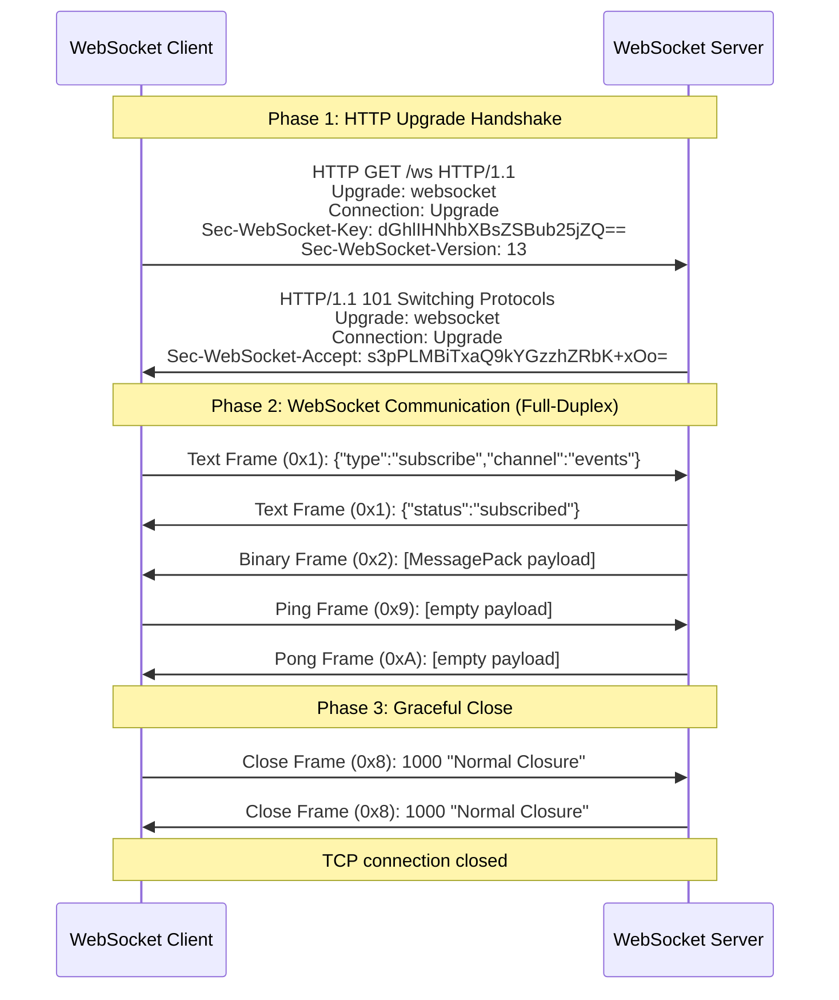
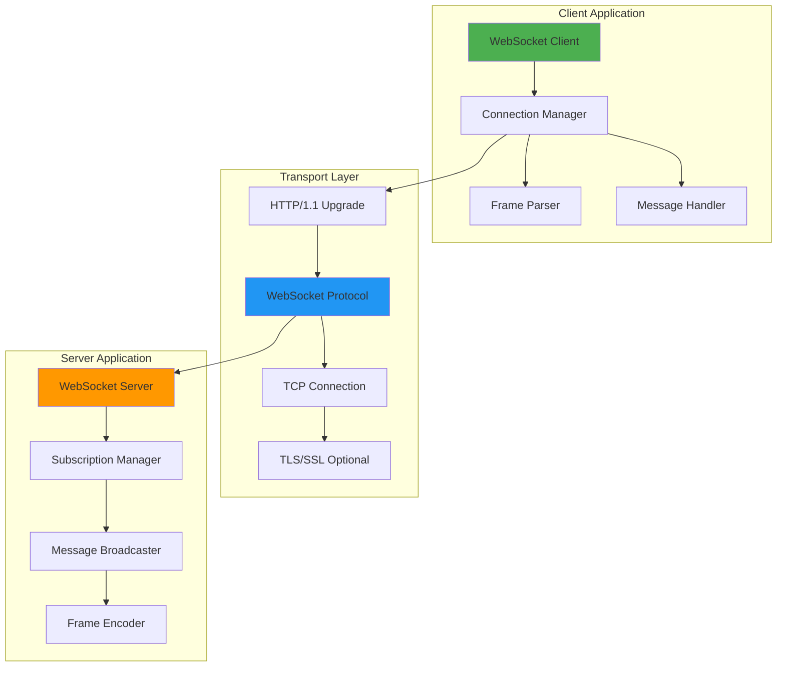

# WebSocket System Overview

## Introduction

**WebSocket** is a bidirectional, full-duplex communication protocol over a single TCP connection, standardized in **RFC 6455**. Unlike traditional HTTP request-response cycles, WebSocket provides a **persistent connection** for real-time, low-latency communication between clients and servers.

### Key Characteristics

- **Full-Duplex**: Simultaneous bidirectional data flow (client ↔ server)
- **Persistent Connection**: Single TCP connection for multiple messages (no handshake overhead)
- **Low Latency**: Sub-millisecond message delivery after connection established
- **HTTP Upgrade**: Starts as HTTP/1.1 request, upgrades to WebSocket protocol
- **Binary & Text Frames**: Supports UTF-8 text and binary data
- **Compression**: Optional `permessage-deflate` for 30-50% bandwidth reduction
- **Subprotocols**: Application-level protocols (STOMP, MQTT, GraphQL-WS) over WebSocket transport

---

## Architecture

### WebSocket Connection Lifecycle



### Component Architecture



---

## WebSocket Protocol

### Frame Structure (RFC 6455)

```
 0                   1                   2                   3
 0 1 2 3 4 5 6 7 8 9 0 1 2 3 4 5 6 7 8 9 0 1 2 3 4 5 6 7 8 9 0 1
+-+-+-+-+-------+-+-------------+-------------------------------+
|F|R|R|R| opcode|M| Payload len |    Extended payload length    |
|I|S|S|S|  (4)  |A|     (7)     |             (16/64)           |
|N|V|V|V|       |S|             |   (if payload len==126/127)   |
| |1|2|3|       |K|             |                               |
+-+-+-+-+-------+-+-------------+ - - - - - - - - - - - - - - - +
|     Extended payload length continued, if payload len == 127  |
+ - - - - - - - - - - - - - - - +-------------------------------+
|                               |Masking-key, if MASK set to 1  |
+-------------------------------+-------------------------------+
| Masking-key (continued)       |          Payload Data         |
+-------------------------------- - - - - - - - - - - - - - - - +
:                     Payload Data continued ...                :
+ - - - - - - - - - - - - - - - - - - - - - - - - - - - - - - - +
|                     Payload Data continued ...                |
+---------------------------------------------------------------+
```

### Opcodes

| Opcode | Hex  | Type         | Description |
|--------|------|--------------|-------------|
| 0x0    | 0x00 | Continuation | Continuation frame (for fragmented messages) |
| 0x1    | 0x01 | Text         | UTF-8 text message |
| 0x2    | 0x02 | Binary       | Binary data (MessagePack, Protobuf, etc.) |
| 0x8    | 0x08 | Close        | Connection close with status code |
| 0x9    | 0x09 | Ping         | Heartbeat request |
| 0xA    | 0x0A | Pong         | Heartbeat response |

### FIN Bit (Fragmentation)

- **FIN = 1**: Final fragment (or single-frame message)
- **FIN = 0**: More fragments follow

**Example (3-fragment message)**:
```
Frame 1: FIN=0, Opcode=0x1 (Text), Payload="Hello "
Frame 2: FIN=0, Opcode=0x0 (Continuation), Payload="World"
Frame 3: FIN=1, Opcode=0x0 (Continuation), Payload="!"
Result:  "Hello World!"
```

### Masking

- **Client → Server**: Mask bit = 1 (all client frames are masked with 4-byte key)
- **Server → Client**: Mask bit = 0 (server frames are not masked)

**Purpose**: Prevent cache poisoning attacks on intermediary proxies.

---

## HTTP Upgrade Handshake

### Client Request

```http
GET /chat HTTP/1.1
Host: example.com
Upgrade: websocket
Connection: Upgrade
Sec-WebSocket-Key: dGhlIHNhbXBsZSBub25jZQ==
Sec-WebSocket-Version: 13
Sec-WebSocket-Protocol: stomp, mqtt
Sec-WebSocket-Extensions: permessage-deflate
Origin: http://example.com
```

### Server Response

```http
HTTP/1.1 101 Switching Protocols
Upgrade: websocket
Connection: Upgrade
Sec-WebSocket-Accept: s3pPLMBiTxaQ9kYGzzhZRbK+xOo=
Sec-WebSocket-Protocol: stomp
Sec-WebSocket-Extensions: permessage-deflate; client_max_window_bits=15
```

### Sec-WebSocket-Accept Calculation

```csharp
// Server calculates accept key from client's nonce:
string clientKey = "dGhlIHNhbXBsZSBub25jZQ==";
string magicString = "258EAFA5-E914-47DA-95CA-C5AB0DC85B11"; // RFC 6455 constant
string concatenated = clientKey + magicString;

byte[] hash = SHA1.HashData(Encoding.UTF8.GetBytes(concatenated));
string acceptKey = Convert.ToBase64String(hash);
// Result: "s3pPLMBiTxaQ9kYGzzhZRbK+xOo="
```

---

## Key Features

### 1. Text and Binary Frames

```csharp
// Text frame (JSON)
await websocket.SendAsync(
    Encoding.UTF8.GetBytes("{\"type\":\"message\"}"),
    WebSocketMessageType.Text,
    endOfMessage: true,
    CancellationToken.None);

// Binary frame (MessagePack)
byte[] msgPackData = MessagePackSerializer.Serialize(new { Type = "message" });
await websocket.SendAsync(
    msgPackData,
    WebSocketMessageType.Binary,
    endOfMessage: true,
    CancellationToken.None);
```

### 2. Subprotocols

Application-level protocols over WebSocket transport:

| Subprotocol | Description | Use Case |
|-------------|-------------|----------|
| **stomp** | Simple Text Oriented Messaging Protocol | Message queues, pub/sub |
| **mqtt** | MQTT over WebSocket | IoT device communication |
| **wamp** | Web Application Messaging Protocol | RPC + Pub/Sub |
| **graphql-ws** | GraphQL subscriptions | Real-time GraphQL queries |
| **soap** | SOAP over WebSocket | Legacy enterprise integration |

**Negotiation**:
```http
Client: Sec-WebSocket-Protocol: stomp, mqtt
Server: Sec-WebSocket-Protocol: stomp  (server picks one)
```

### 3. Compression (permessage-deflate)

**RFC 7692** extension for per-message DEFLATE compression:

```http
Client: Sec-WebSocket-Extensions: permessage-deflate; client_max_window_bits
Server: Sec-WebSocket-Extensions: permessage-deflate; server_max_window_bits=15
```

**Benefits**:
- 30-50% bandwidth reduction for text (JSON)
- Reduced latency on slow networks
- CPU overhead: ~10-20% (compression/decompression)

**Frame Structure**:
```
+-------+
| RSV1=1|  (bit indicates compressed frame)
+-------+
| Compressed payload (DEFLATE) |
+------------------------------+
```

### 4. Heartbeat (Ping/Pong)

Detect broken connections with control frames:

```csharp
// Client sends Ping
await websocket.SendAsync(
    Array.Empty<byte>(),
    WebSocketMessageType.Close,  // Actually should be Ping (library limitation)
    endOfMessage: true,
    CancellationToken.None);

// Server responds with Pong automatically
// Or application-level keep-alive:
var keepAliveTimer = new Timer(async _ =>
{
    await websocket.SendAsync(
        Encoding.UTF8.GetBytes("{\"type\":\"ping\"}"),
        WebSocketMessageType.Text,
        endOfMessage: true,
        CancellationToken.None);
}, null, TimeSpan.Zero, TimeSpan.FromSeconds(30));
```

### 5. Fragmentation

Split large messages into smaller frames:

```csharp
byte[] largePayload = new byte[1_000_000]; // 1 MB
int chunkSize = 16_384; // 16 KB chunks

for (int offset = 0; offset < largePayload.Length; offset += chunkSize)
{
    int count = Math.Min(chunkSize, largePayload.Length - offset);
    bool isLastChunk = (offset + count == largePayload.Length);
    
    await websocket.SendAsync(
        new ArraySegment<byte>(largePayload, offset, count),
        WebSocketMessageType.Binary,
        endOfMessage: isLastChunk,  // FIN=1 on last chunk
        CancellationToken.None);
}
```

### 6. Close Handshake

Graceful connection termination with status codes:

```csharp
await websocket.CloseAsync(
    WebSocketCloseStatus.NormalClosure,  // 1000
    "Goodbye",
    CancellationToken.None);
```

**Status Codes** (RFC 6455):

| Code | Name | Description |
|------|------|-------------|
| 1000 | Normal Closure | Successful completion |
| 1001 | Going Away | Server shutdown or browser navigates away |
| 1002 | Protocol Error | Malformed frame received |
| 1003 | Unsupported Data | Data type not supported (e.g., text-only server receives binary) |
| 1006 | Abnormal Closure | No close frame received (connection lost) |
| 1007 | Invalid Frame Payload | Non-UTF-8 text or protocol violation |
| 1008 | Policy Violation | Generic policy violation |
| 1009 | Message Too Big | Message exceeds server limit |
| 1011 | Internal Server Error | Unexpected server condition |

---

## Performance Characteristics

### Latency Comparison

| Metric | WebSocket | Server-Sent Events (SSE) | Long-Polling | HTTP/2 Server Push |
|--------|-----------|--------------------------|--------------|-------------------|
| **Initial Handshake** | 1 RTT (HTTP Upgrade) | 1 RTT | 1 RTT per request | 2 RTT (TLS + HTTP/2) |
| **Message Latency** | <1ms (frame overhead) | ~5ms (HTTP headers) | ~50ms (reconnect) | ~10ms (HTTP/2 framing) |
| **Bidirectional** | ✅ Full-duplex | ❌ Server → Client only | ❌ Client must poll | ⚠️ Limited |
| **Connection Overhead** | Single TCP connection | Single TCP connection | New connection per poll | Single TCP connection |
| **Bandwidth** | Low (10-14 bytes per frame) | Medium (HTTP headers) | High (HTTP headers) | Medium (HTTP/2 headers) |
| **Browser Support** | All modern browsers | All modern browsers | All browsers | HTTP/2 clients only |

### Throughput Benchmark

**Test**: 1,000 messages/second, 1 KB payload each

| Protocol | Messages/sec | Bandwidth (MB/s) | CPU Usage (%) |
|----------|--------------|------------------|---------------|
| WebSocket (no compression) | 100,000 | 100 | 15% |
| WebSocket (permessage-deflate) | 80,000 | 40 | 25% |
| Server-Sent Events | 50,000 | 120 | 12% |
| Long-Polling | 5,000 | 150 | 30% |

---

## Use Cases

### ✅ Ideal For

1. **Real-Time Collaboration**: Google Docs, Figma, collaborative whiteboards
2. **Live Feeds**: Stock tickers, sports scores, social media notifications
3. **Chat Applications**: Slack, Discord, WhatsApp Web
4. **Online Gaming**: Multiplayer game state synchronization
5. **IoT Device Control**: Real-time sensor data streaming
6. **Financial Trading**: Order book updates, trade execution confirmations
7. **Live Video Streaming Metadata**: Subtitle sync, telemetry overlays

### ❌ Not Ideal For

1. **Static Content**: Use HTTP/2 with caching
2. **Large File Uploads**: Use HTTP multipart/form-data or resumable uploads
3. **One-Way Notifications**: Consider Server-Sent Events (SSE)
4. **Batch Processing**: Use message queues (Kafka, RabbitMQ)

---

## Comparison with Other Technologies

### WebSocket vs Server-Sent Events (SSE)

| Feature | WebSocket | SSE |
|---------|-----------|-----|
| **Direction** | Bidirectional (full-duplex) | Server → Client only |
| **Protocol** | Custom (ws://, wss://) | HTTP (text/event-stream) |
| **Reconnection** | Manual | Automatic (EventSource) |
| **Binary Support** | ✅ Yes | ❌ Text only |
| **Complexity** | Medium | Low |
| **Browser API** | `WebSocket` | `EventSource` |

**When to use SSE**: Server-only push (live news feeds, progress updates).

### WebSocket vs Long-Polling

| Feature | WebSocket | Long-Polling |
|---------|-----------|--------------|
| **Latency** | <1ms | 50-200ms (reconnect overhead) |
| **Connection** | Persistent | New connection per message |
| **Overhead** | 10-14 bytes/frame | ~500 bytes (HTTP headers) |
| **Scalability** | High (C10K problem solved) | Low (1 thread per connection) |

**When to use Long-Polling**: Legacy browser support (IE9), firewall restrictions.

### WebSocket vs WebRTC

| Feature | WebSocket | WebRTC |
|---------|-----------|--------|
| **Use Case** | General messaging | Peer-to-peer audio/video |
| **Topology** | Client ↔ Server | Peer ↔ Peer (P2P) |
| **Latency** | <1ms | <50ms (UDP) |
| **Media Support** | ❌ Text/binary only | ✅ Audio, video, data channels |
| **NAT Traversal** | N/A | ✅ STUN/TURN |

**When to use WebRTC**: Video calls, screen sharing, file sharing (P2P).

---

## ThunderPropagator WebSocket Components

### [Feeders.WebSocket](Feeders.WebSocket/README.md)

**Purpose**: Consume WebSocket frames (text/binary) from server using push-based `DelegativeFeeder`.

**Key Features**:
- Automatic reconnection on disconnect
- Subprotocol negotiation (stomp, mqtt)
- Compression (permessage-deflate)
- TLS/wss support
- Heartbeat (ping/pong)

**Architecture**: WebSocket Server → `ReceiveAsync` loop → `EnqueueAsync` → DelegativeFeeder queue → Application

### [Providers.DotNet.WebSocket](Providers.DotNet.WebSocket/README.md)

**Purpose**: Send WebSocket frames (text/binary) to server using `AbstractProvider`.

**Key Features**:
- Text vs binary frame selection
- Fragmentation (chunked messages)
- End-of-message control
- Connection pooling
- OpenTelemetry tracing

**Architecture**: Application → Provider → Serialize → `SendAsync` (frame) → WebSocket Server

---

## Quick Start

### Basic WebSocket Client (Text Frames)

```csharp
using System.Net.WebSockets;
using System.Text;

var ws = new ClientWebSocket();
await ws.ConnectAsync(new Uri("wss://echo.websocket.org"), CancellationToken.None);

// Send text frame
var message = Encoding.UTF8.GetBytes("Hello WebSocket!");
await ws.SendAsync(message, WebSocketMessageType.Text, endOfMessage: true, CancellationToken.None);

// Receive text frame
var buffer = new byte[4096];
var result = await ws.ReceiveAsync(buffer, CancellationToken.None);
var response = Encoding.UTF8.GetString(buffer, 0, result.Count);
Console.WriteLine($"Received: {response}");

// Close connection
await ws.CloseAsync(WebSocketCloseStatus.NormalClosure, "Goodbye", CancellationToken.None);
```

### WebSocket Server (ASP.NET Core)

```csharp
app.UseWebSockets();

app.Map("/ws", async context =>
{
    if (context.WebSockets.IsWebSocketRequest)
    {
        var ws = await context.WebSockets.AcceptWebSocketAsync("stomp");
        
        var buffer = new byte[4096];
        while (ws.State == WebSocketState.Open)
        {
            var result = await ws.ReceiveAsync(buffer, CancellationToken.None);
            
            if (result.MessageType == WebSocketMessageType.Close)
            {
                await ws.CloseAsync(WebSocketCloseStatus.NormalClosure, "Goodbye", CancellationToken.None);
            }
            else
            {
                // Echo back to client
                await ws.SendAsync(
                    new ArraySegment<byte>(buffer, 0, result.Count),
                    result.MessageType,
                    result.EndOfMessage,
                    CancellationToken.None);
            }
        }
    }
    else
    {
        context.Response.StatusCode = 400;
    }
});
```

---

## WebSocket Concepts Deep Dive

### 1. Frame Types

#### Data Frames
- **Text (0x1)**: UTF-8 encoded string (JSON, XML, plain text)
- **Binary (0x2)**: Arbitrary binary data (MessagePack, Protobuf, images)
- **Continuation (0x0)**: Fragment of multi-frame message

#### Control Frames
- **Close (0x8)**: Terminate connection with status code + reason
- **Ping (0x9)**: Heartbeat request (server → client or client → server)
- **Pong (0xA)**: Heartbeat response (must echo ping payload)

**Control Frame Rules**:
- Must have FIN=1 (no fragmentation)
- Maximum payload: 125 bytes
- Cannot be fragmented

### 2. Masking (Client → Server)

**Purpose**: Prevent cache poisoning on intermediary proxies.

**Algorithm**:
```csharp
byte[] mask = new byte[4]; // Random 4-byte key
Random.Shared.NextBytes(mask);

for (int i = 0; i < payload.Length; i++)
{
    payload[i] ^= mask[i % 4];
}
```

**Wire Format**:
```
Client → Server: [Header] [Mask Key: 4 bytes] [Masked Payload]
Server → Client: [Header] [Unmasked Payload]
```

### 3. Fragmentation (Large Messages)

**Rules**:
1. First frame: Opcode = 0x1 (text) or 0x2 (binary), FIN=0
2. Middle frames: Opcode = 0x0 (continuation), FIN=0
3. Last frame: Opcode = 0x0 (continuation), FIN=1

**Example**:
```
Message: "Hello World!" (12 bytes)
Fragment into 3 frames of 4 bytes each:

Frame 1: FIN=0, Opcode=0x1, Payload="Hell" (4 bytes)
Frame 2: FIN=0, Opcode=0x0, Payload="o Wo" (4 bytes)
Frame 3: FIN=1, Opcode=0x0, Payload="rld!" (4 bytes)

Reassembled: "Hello World!"
```

### 4. Subprotocol Negotiation

**Client Request**:
```http
Sec-WebSocket-Protocol: stomp, mqtt, wamp
```

**Server Response** (picks one):
```http
Sec-WebSocket-Protocol: stomp
```

**Use Cases**:
- **STOMP**: Message queue operations (SEND, SUBSCRIBE, ACK)
- **MQTT**: IoT pub/sub over WebSocket
- **GraphQL-WS**: Real-time GraphQL subscriptions
- **Custom**: Application-specific protocols

### 5. Compression (permessage-deflate)

**Negotiation**:
```http
Client: Sec-WebSocket-Extensions: permessage-deflate; client_max_window_bits=15
Server: Sec-WebSocket-Extensions: permessage-deflate; server_max_window_bits=15
```

**Parameters**:
- `client_max_window_bits`: LZ77 sliding window size (8-15, default 15 = 32KB)
- `server_max_window_bits`: Server's LZ77 window size
- `client_no_context_takeover`: No compression context between messages
- `server_no_context_takeover`: Server doesn't reuse context

**Performance**:
```
Uncompressed JSON (1KB): 1024 bytes
Compressed (permessage-deflate): ~400 bytes (60% reduction)
CPU overhead: +15-20% (compression)
```

### 6. Heartbeat (Keep-Alive)

**Network-Level**:
```csharp
// TCP keep-alive (OS-level)
var ws = new ClientWebSocket();
ws.Options.KeepAliveInterval = TimeSpan.FromSeconds(30);
```

**Application-Level**:
```csharp
// Ping/Pong frames
var pingTimer = new Timer(async _ =>
{
    await ws.SendAsync(
        Array.Empty<byte>(),
        WebSocketMessageType.Close,  // Ping (library limitation)
        endOfMessage: true,
        CancellationToken.None);
}, null, TimeSpan.Zero, TimeSpan.FromSeconds(30));
```

**Or Custom Message**:
```csharp
// JSON heartbeat
var heartbeat = new Timer(async _ =>
{
    var ping = Encoding.UTF8.GetBytes("{\"type\":\"ping\"}");
    await ws.SendAsync(ping, WebSocketMessageType.Text, true, CancellationToken.None);
}, null, TimeSpan.Zero, TimeSpan.FromSeconds(30));
```

---

## Security Considerations

### 1. Use WSS (TLS/SSL)

```csharp
// ✅ Secure: wss://
var ws = new ClientWebSocket();
await ws.ConnectAsync(new Uri("wss://example.com/ws"), CancellationToken.None);

// ❌ Insecure: ws:// (plaintext)
// Only use in development/localhost
```

### 2. Validate Origin Header

**Server-Side** (prevent CSRF):
```csharp
app.Use(async (context, next) =>
{
    if (context.WebSockets.IsWebSocketRequest)
    {
        var origin = context.Request.Headers["Origin"].ToString();
        if (!IsAllowedOrigin(origin))
        {
            context.Response.StatusCode = 403;
            return;
        }
    }
    await next();
});
```

### 3. Authenticate Connections

**Bearer Token in Query String**:
```csharp
var ws = new ClientWebSocket();
await ws.ConnectAsync(
    new Uri("wss://api.example.com/ws?token=eyJhbGciOiJIUzI1NiIsInR5cCI6IkpXVCJ9..."),
    CancellationToken.None);
```

**Custom Header** (not standard, but supported by some clients):
```csharp
ws.Options.SetRequestHeader("Authorization", "Bearer eyJhbGc...");
```

### 4. Rate Limiting

```csharp
// Server-side message rate limiting
var messageCount = 0;
var resetTime = DateTimeOffset.UtcNow.AddSeconds(60);

while (ws.State == WebSocketState.Open)
{
    var result = await ws.ReceiveAsync(buffer, CancellationToken.None);
    
    if (DateTimeOffset.UtcNow > resetTime)
    {
        messageCount = 0;
        resetTime = DateTimeOffset.UtcNow.AddSeconds(60);
    }
    
    if (++messageCount > 100)  // 100 messages/minute limit
    {
        await ws.CloseAsync(
            WebSocketCloseStatus.PolicyViolation,
            "Rate limit exceeded",
            CancellationToken.None);
        break;
    }
}
```

---

## Related Documentation

- **[Feeders.WebSocket Documentation](Feeders.WebSocket/README.md)** — Consuming WebSocket frames
- **[Providers.DotNet.WebSocket Documentation](Providers.DotNet.WebSocket/README.md)** — Sending WebSocket frames
- **[RFC 6455](https://datatracker.ietf.org/doc/html/rfc6455)** — WebSocket Protocol Specification
- **[RFC 7692](https://datatracker.ietf.org/doc/html/rfc7692)** — Compression Extensions (permessage-deflate)

---

## Summary

**WebSocket** provides:

✅ **Full-Duplex**: Bidirectional real-time communication  
✅ **Low Latency**: <1ms message delivery (after handshake)  
✅ **Persistent Connection**: Single TCP connection, no HTTP overhead  
✅ **Binary Support**: MessagePack, Protobuf, custom formats  
✅ **Compression**: 30-50% bandwidth reduction (permessage-deflate)  
✅ **Subprotocols**: STOMP, MQTT, GraphQL-WS, custom protocols  
✅ **Heartbeat**: Ping/Pong frames detect broken connections  
✅ **Security**: TLS/SSL (wss://), origin validation, authentication  

**Use Cases**: Chat, collaboration, live feeds, gaming, IoT, trading platforms  
**ThunderPropagator Components**: [Feeders.WebSocket](Feeders.WebSocket/README.md), [Providers.DotNet.WebSocket](Providers.DotNet.WebSocket/README.md)
